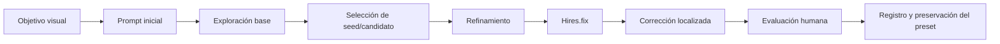
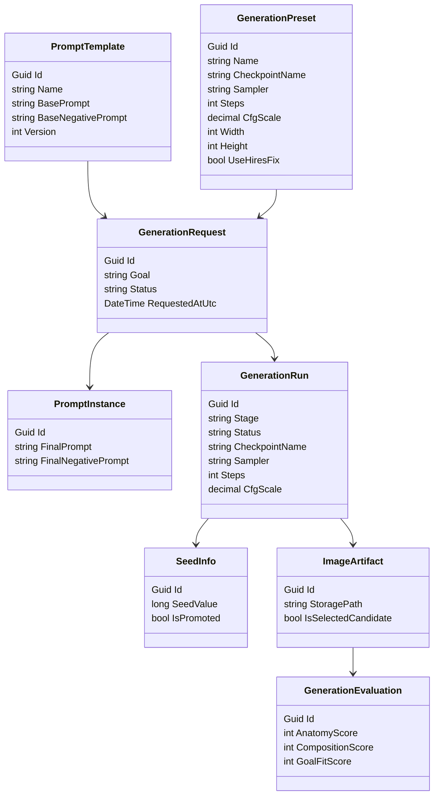
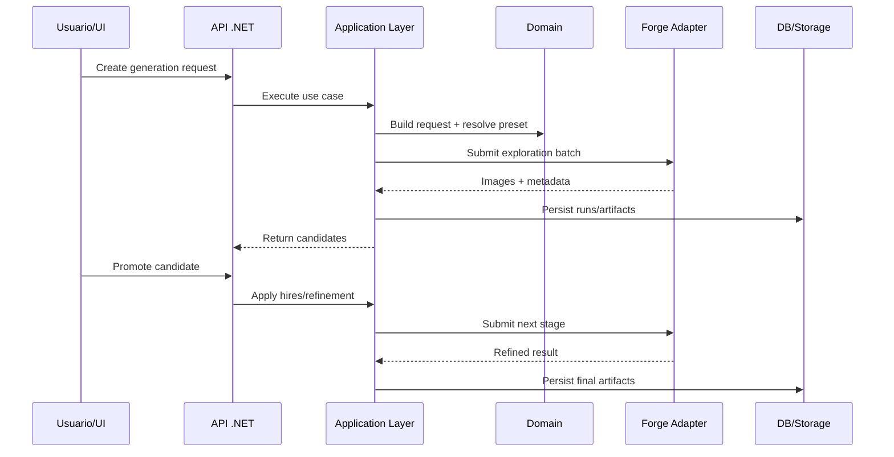
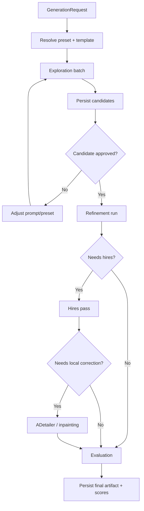

# Guía Maestra SD 1.5 + Forge + Pipeline Profesional + Backend .NET

> Documento integral desde cero hasta nivel profesional/arquitectónico.  
> Enfoque: **dominar Stable Diffusion 1.5 como sistema reproducible**, no como una colección de ajustes aislados.  
> Alcance: **uso técnico de Forge, prompts, LoRAs, Hires.fix, ADetailer, FreeU, pipeline profesional, criterios de calidad visual y diseño de backend en .NET**.  
> Queda fuera por ahora: **router multi-IA**.

---

## Tabla de contenido

1. [Propósito de esta guía](#1-propósito-de-esta-guía)  
2. [Qué es realmente Stable Diffusion 1.5](#2-qué-es-realmente-stable-diffusion-15)  
3. [Cómo pensar SD 1.5 como sistema controlable](#3-cómo-pensar-sd-15-como-sistema-controlable)  
4. [Forge dentro del flujo de trabajo](#4-forge-dentro-del-flujo-de-trabajo)  
5. [Parámetros clave y cómo dominarlos](#5-parámetros-clave-y-cómo-dominarlos)  
6. [Prompt engineering para SD 1.5](#6-prompt-engineering-para-sd-15)  
7. [Negative prompts bien usados](#7-negative-prompts-bien-usados)  
8. [Resolución, composición y límites reales del modelo](#8-resolución-composición-y-límites-reales-del-modelo)  
9. [Hires.fix como etapa formal del pipeline](#9-hiresfix-como-etapa-formal-del-pipeline)  
10. [ADetailer y corrección localizada](#10-adetailer-y-corrección-localizada)  
11. [FreeU y mejoras complementarias](#11-freeu-y-mejoras-complementarias)  
12. [LoRAs: uso profesional y controlado](#12-loras-uso-profesional-y-controlado)  
13. [Presets operativos recomendados](#13-presets-operativos-recomendados)  
14. [Pipeline manual profesional de generación](#14-pipeline-manual-profesional-de-generación)  
15. [Criterios de calidad visual y evaluación humana](#15-criterios-de-calidad-visual-y-evaluación-humana)  
16. [Reproducibilidad y trazabilidad](#16-reproducibilidad-y-trazabilidad)  
17. [Troubleshooting profesional](#17-troubleshooting-profesional)  
18. [Del operador manual al sistema de software](#18-del-operador-manual-al-sistema-de-software)  
19. [Objetivos del backend en .NET](#19-objetivos-del-backend-en-net)  
20. [Modelo de dominio](#20-modelo-de-dominio)  
21. [Casos de uso y capa de aplicación](#21-casos-de-uso-y-capa-de-aplicación)  
22. [Arquitectura .NET recomendada](#22-arquitectura-net-recomendada)  
23. [Integración del backend con Forge](#23-integración-del-backend-con-forge)  
24. [Pipeline automatizado backend](#24-pipeline-automatizado-backend)  
25. [Persistencia, almacenamiento y metadatos](#25-persistencia-almacenamiento-y-metadatos)  
26. [Observabilidad y métricas](#26-observabilidad-y-métricas)  
27. [Roadmap posterior](#27-roadmap-posterior)  
28. [Checklists prácticos](#28-checklists-prácticos)  
29. [Glosario rápido](#29-glosario-rápido)  
30. [Fuentes base y notas](#30-fuentes-base-y-notas)  

---

## 1. Propósito de esta guía

La mayoría de la gente usa Stable Diffusion 1.5 de esta forma:

- mueve sliders
- prueba prompts gigantes
- mezcla LoRAs sin control
- sube resolución demasiado pronto
- obtiene una imagen “bonita”
- luego no puede repetirla, explicarla ni mejorarla

Ese enfoque sirve para jugar, no para dominar la herramienta.

El objetivo de esta guía es cambiar la mentalidad de:

**“generar imágenes por prueba y error”**

a:

**“operar un pipeline controlado, reproducible y extensible”**

Aquí no vas a tratar a SD 1.5 como magia.  
Lo vas a tratar como un sistema con:

- entradas
- etapas
- parámetros
- artefactos
- criterios de calidad
- trazabilidad
- posibilidad de automatización

La guía está escrita para alguien que quiere:

- entender lo que está haciendo
- obtener calidad alta de forma repetible
- construir presets de verdad útiles
- profesionalizar su flujo
- después llevarlo a software real con backend en .NET

---

## 2. Qué es realmente Stable Diffusion 1.5

Stable Diffusion 1.5 es un modelo de generación de imágenes basado en **latent diffusion**.  
Eso importa porque explica por qué el modelo se comporta como se comporta.

### 2.1 La idea esencial

No “pinta” una imagen desde cero como un humano.  
Trabaja sobre una representación latente comprimida y va removiendo ruido de forma iterativa hasta obtener una imagen coherente con el prompt.

De forma simplificada:

1. Tomas un texto.
2. Ese texto se convierte en condicionamiento semántico.
3. El modelo parte de ruido.
4. En varios pasos de denoising va empujando ese ruido hacia una imagen compatible con el texto.
5. El resultado final se decodifica del espacio latente a píxeles.

### 2.2 Por qué esto importa

Porque entonces la imagen final depende de una interacción delicada entre:

- el condicionamiento textual
- la semilla aleatoria
- el número de pasos
- el sampler
- la intensidad de la guía textual
- la resolución y proporción
- cualquier modificación extra como Hires.fix, inpainting, LoRAs, etc.

No hay un único slider mágico de “más calidad”.

### 2.3 Lo que SD 1.5 hace bien

SD 1.5 sigue siendo muy útil cuando:

- quieres velocidad
- tienes recursos limitados
- quieres ecosistema maduro
- quieres usar LoRAs abundantes
- necesitas iteración rápida
- quieres control fino sobre estilo y resultado
- deseas construir pipelines locales sin requerir stacks pesados

### 2.4 Lo que SD 1.5 no hace tan bien

Comparado con modelos más recientes o más grandes, SD 1.5 suele sufrir más en:

- composición compleja
- obediencia de prompts muy elaborados
- anatomía difícil
- escenas con muchos sujetos
- coherencia global en resoluciones altas nativas
- texto legible dentro de la imagen

Eso no significa que “no sirva”.  
Significa que debes operar con estrategia.

### 2.5 Regla mental clave

**SD 1.5 no recompensa la fuerza bruta tanto como recompensa la disciplina del pipeline.**

Subir más steps, más CFG, más resolución, más LoRAs y más palabras rara vez produce un resultado mejor de manera estable.  
La calidad real viene de:

- composición bien planteada
- base resolution correcta
- prompt claro
- refinamiento por etapas
- correcciones localizadas
- registro disciplinado de configuración

---

## 3. Cómo pensar SD 1.5 como sistema controlable

Antes de entrar a Forge, conviene adoptar un modelo mental operativo.

### 3.1 Entradas del sistema

Las entradas más importantes son:

- prompt
- negative prompt
- checkpoint/modelo base
- seed
- sampler
- steps
- CFG
- resolución base
- LoRAs
- ajustes de Hires.fix
- ajustes de ADetailer o inpainting

### 3.2 Salidas del sistema

La salida no es solo la imagen.

Las salidas reales de un pipeline serio son:

- imagen generada
- metadatos de generación
- prompt final resuelto
- seed
- config exacta
- versión del preset
- evaluación de calidad
- decisión de siguiente paso

### 3.3 Etapas del sistema

Una generación profesional no es un solo clic.  
Es una secuencia.



### 3.4 Variables que más pesan

En práctica real, las variables que más cambian el resultado suelen ser:

1. checkpoint/modelo
2. prompt estructurado
3. seed
4. resolución base
5. sampler
6. Hires.fix
7. LoRAs
8. ADetailer/inpainting

El error típico es obsesionarse con microajustes antes de tener estable lo grande.

### 3.5 Filosofía operativa

Trabaja así:

- primero coherencia
- luego composición
- luego detalle
- luego limpieza
- al final upscale/refinamiento

No al revés.

---

## 4. Forge dentro del flujo de trabajo

Stable Diffusion WebUI Forge se presenta como una plataforma sobre Stable Diffusion WebUI orientada a facilitar desarrollo, optimizar recursos y acelerar inferencia. citeturn904694search0

### 4.1 Qué papel juega Forge

Forge no es “la calidad” por sí misma.  
Es la interfaz/plataforma de operación que te permite:

- cargar checkpoints
- construir prompts
- generar batches
- manejar extensiones
- aplicar hires/fixes
- registrar metadatos
- iterar más rápido

### 4.2 Cómo debes verlo

No como un panel para mover cosas al azar, sino como una consola operativa.

Tu meta no es aprender “todos los botones”.  
Tu meta es dominar las rutas que sí impactan calidad y reproducibilidad.

### 4.3 Componentes de Forge que importan más al inicio

Para SD 1.5 de forma disciplinada, lo importante suele ser:

- selección del checkpoint
- prompt / negative prompt
- sampler
- steps
- CFG scale
- seed
- width/height
- batch count / batch size
- Hires.fix
- extensiones relevantes como ADetailer
- LoRAs
- metadata / PNG info / historial

### 4.4 Componentes que puedes dejar en segundo plano al principio

Mientras construyes base sólida, evita dispersarte con demasiadas extensiones o hacks secundarios.  
El problema casi siempre está en:

- prompt mal planteado
- resolución base incorrecta
- sampler o CFG mal elegidos
- LoRAs mal combinados
- Hires.fix mal usado

No en la ausencia del plugin número 27.

### 4.5 Regla de operación en Forge

Cada corrida debe tener intención clara.  
No abras Forge para “a ver qué sale”.  
Abre Forge para ejecutar uno de estos objetivos:

- explorar composición
- fijar un seed prometedor
- refinar detalle
- corregir cara/manos
- validar un LoRA
- comparar presets
- reproducir una imagen previa

Eso ya te mete en modo de pipeline.

---

## 5. Parámetros clave y cómo dominarlos

Esta es una sección crítica.  
Aquí está el corazón del control técnico.

## 5.1 Steps

Los **steps** son la cantidad de iteraciones de denoising.  
Más steps no equivalen linealmente a más calidad.

### Qué hacen
- permiten más iteraciones de refinamiento
- pueden mejorar consistencia hasta cierto punto
- luego entran en rendimientos decrecientes

### Rango práctico típico para SD 1.5
- exploración rápida: 16–22
- estándar equilibrado: 22–30
- refinamiento puntual: 28–36

### Problema común
Subir a 50, 60 o más esperando magia.  
Frecuentemente solo ganas tiempo de cómputo y una imagen sobrecocinada o sin mejora real.

### Regla práctica
Si entre 24 y 30 ya no ves mejora clara, el problema no era steps.  
Era otra cosa.

---

## 5.2 CFG Scale

CFG controla qué tanto se fuerza la imagen a seguir el prompt.

### Rango práctico común
- 5.5–7.5 suele ser una zona muy estable para SD 1.5
- por debajo: puede volverse más libre o menos obediente
- demasiado alto: artefactos, rigidez, saturación, rarezas anatómicas o “forzado”

### Error clásico
Pensar:
“si quiero que respete mejor el prompt, le subo mucho el CFG”

Eso puede romper la imagen.  
Una mejor obediencia suele venir más de:

- prompt mejor estructurado
- modelo adecuado
- seed mejor
- menos conflicto entre tokens

### Regla práctica
Para la mayoría de pipelines serios, **6–7** es una zona muy cómoda.

---

## 5.3 Sampler

El sampler define la estrategia numérica de denoising.

No necesitas memorizar todo el zoológico, pero sí entender que distintos samplers favorecen:

- rapidez
- suavidad
- nitidez
- estabilidad
- estética

### Recomendación operativa
En vez de usar muchos, elige 2–3 confiables y aprende su comportamiento.

Zona segura típica:
- DPM++ 2M
- DPM++ SDE
- variantes Karras si te funcionan bien en tu entorno

### Error común
Cambiar sampler, CFG, steps, seed y prompt al mismo tiempo.  
Así nunca sabes qué causó el resultado.

### Regla práctica
Congela sampler durante una fase de pruebas.  
Sólo cámbialo cuando estés validando el sampler como variable.

---

## 5.4 Seed

La seed es una de las variables más subestimadas y más importantes.

### Qué representa
Una condición inicial aleatoria que influye brutalmente en composición, rasgos, distribución visual y coherencia.

### Implicación práctica
Un buen prompt con una mala seed puede dar basura.  
Un prompt correcto con una seed buena puede dar una base excelente.

### Regla profesional
No trates la seed como detalle técnico menor.  
Trátala como un activo del pipeline.

### Qué hacer
- explora varias seeds al inicio
- conserva las buenas
- promueve una seed prometedora a fases de refinamiento
- documenta la seed final siempre

---

## 5.5 Batch count y batch size

### Batch count
Genera múltiples lotes secuenciales.

### Batch size
Genera múltiples imágenes a la vez.

### Recomendación práctica
Para exploración controlada, suele ser más simple trabajar con:

- batch size pequeño
- batch count suficiente para explorar

Así reduces desorden y revisas resultados con más criterio.

### Meta
No generar por generar.  
Generar lo suficiente para encontrar un candidato fuerte sin perder capacidad de evaluación.

---

## 5.6 Resolución base

SD 1.5 fue entrenado típicamente alrededor de 512x512, y su comportamiento se degrada cuando intentas forzarlo demasiado lejos de su escala de entrenamiento sin estrategia; trabajos como ScaleCrafter documentan problemas como repetición de objetos y estructuras poco razonables al generar directamente mucho más alto que la resolución de entrenamiento. citeturn904694search19

### Regla clave
La resolución base no es para presumir tamaño.  
Es para resolver composición.

### Zona sana de trabajo inicial
- 512x512
- 512x768
- 768x512
- otras cercanas, según formato, sin forzar demasiado al modelo al inicio

### Error típico
Empezar directamente en resoluciones muy altas esperando “más detalle”.

Lo que obtienes muchas veces es:
- peor composición
- más artefactos
- más deformación
- más costo
- menos estabilidad

---

## 5.7 Denoising strength

Este parámetro se vuelve importante en procesos como Hires.fix o img2img.

### Intuición
- bajo: conserva más la estructura previa
- alto: reinterpreta más agresivamente la imagen

### Riesgo
Un denoise demasiado alto en una etapa tardía puede destruir aquello que ya habías logrado.

### Regla práctica
Cuando ya tienes una base buena, sé conservador.  
Cuando aún estás buscando reimaginar, puedes permitir mayor denoise.

---

## 5.8 Interacción entre parámetros

Los parámetros no viven aislados.

Ejemplos:
- un CFG alto con prompt sobrecargado puede empeorar más que ayudar
- más steps con sampler poco favorable no arreglan nada
- resolución alta con mala composición multiplica defectos
- Hires.fix con denoise alto puede traicionar la seed original
- LoRA fuerte + CFG alto + prompt recargado = conflicto casi asegurado

La calidad no emerge de “subirlo todo”, sino de coordinar variables.

---

## 6. Prompt engineering para SD 1.5

Aquí la meta no es escribir bonito.  
La meta es escribir útil.

## 6.1 Qué es un buen prompt en SD 1.5

Un buen prompt:

- expresa intención visual clara
- reduce ambigüedad
- no mete conceptos incompatibles sin querer
- está ordenado por prioridad
- permite iterar por bloques
- produce resultados comparables

Un mal prompt:
- es una bolsa caótica de palabras
- mezcla estilos, cámara, anatomía, iluminación, materiales y narrativas sin estructura
- intenta arreglar con volumen lo que debería arreglar con claridad

---

## 6.2 Estructura recomendada

Plantilla general útil:

```text
[sujeto principal], [atributos del sujeto], [pose o acción], [encuadre/composición], [entorno], [iluminación], [estilo o look], [detalle/calidad], [lentes/cámara si aplica]
```

### Ejemplo
```text
portrait of a young woman, symmetrical face, natural skin, subtle makeup, looking at camera, close-up shot, soft cinematic lighting, realistic photography, detailed eyes, shallow depth of field
```

### Por qué funciona
Porque va de:
- qué es
- cómo se ve
- cómo está presentado
- en qué ambiente
- con qué estética

---

## 6.3 Orden de importancia

En SD 1.5, el orden y la claridad suelen ayudar más que el ruido verbal.

Orden recomendado:
1. sujeto
2. rasgos clave
3. pose/acción
4. composición/encuadre
5. entorno
6. iluminación
7. estilo
8. detalles finos

---

## 6.4 Pesos en prompt

Los pesos son útiles, pero no son para abusar.

Ejemplo:
```text
(masterpiece:1.1), (detailed face:1.2), realistic skin
```

### Cuándo usarlos
- para enfatizar algo verdaderamente central
- para rescatar un detalle que el modelo ignora de forma recurrente
- para experimentos controlados

### Cuándo no
- cuando cada dos palabras está parentetizado
- cuando intentas reemplazar claridad por intensidad
- cuando ya no sabes qué parte manda

### Regla
Pocos pesos, con intención.

---

## 6.5 Prompt modular

Una práctica muy útil es pensar el prompt en bloques.

### Bloque sujeto
```text
1girl, adult woman, elegant features
```

### Bloque composición
```text
portrait, upper body, centered framing
```

### Bloque iluminación
```text
soft rim light, cinematic shadows, warm ambient light
```

### Bloque estilo
```text
realistic photography, fine skin detail
```

### Ventaja
Puedes tocar un bloque sin destruir los demás.

---

## 6.6 Prompt de exploración vs prompt de refinamiento

### Prompt de exploración
Más corto, más limpio, más enfocado en:
- sujeto
- composición
- estilo general

### Prompt de refinamiento
Se usa cuando ya hay una dirección visual válida.  
Entonces sí agregas:
- detalle fino
- materiales
- iluminación precisa
- matices estéticos

### Error común
Empezar desde el primer intento con un prompt monstruoso.  
Eso hace más difícil entender qué está influyendo.

---

## 6.7 Ejemplo de evolución sana

### Etapa 1 — exploración
```text
portrait of an elegant woman, close-up, realistic photography, soft lighting
```

### Etapa 2 — refinamiento
```text
portrait of an elegant woman, symmetrical features, natural skin, close-up, looking at camera, realistic photography, soft cinematic lighting, shallow depth of field, detailed eyes
```

### Etapa 3 — afinado
```text
portrait of an elegant woman, symmetrical features, natural skin texture, subtle makeup, close-up, looking at camera, realistic photography, soft cinematic lighting, catchlight in the eyes, shallow depth of field, detailed eyes, clean background
```

Aquí sí estás iterando con intención.

---

## 7. Negative prompts bien usados

ADetailer se describe como una extensión que realiza detección automática, enmascarado e inpainting; eso es importante porque muestra que ciertas correcciones conviene resolver con mecanismos localizados, no intentando meter todo al negative prompt. citeturn904694search1

## 7.1 Qué hace el negative prompt

Le dice al modelo qué características o defectos quieres evitar o reducir.

No es una vacuna perfecta.  
No elimina mágicamente cualquier problema.

## 7.2 Qué sí suele ayudar a controlar

- baja calidad genérica
- anatomía mala recurrente
- dedos extra
- ojos mal formados
- blur indeseado
- artifacts
- deformaciones comunes
- duplicaciones obvias

## 7.3 Qué no conviene esperar

No le pidas al negative prompt arreglar:
- una mala composición
- un prompt contradictorio
- una seed que nunca tuvo potencial
- una resolución base mal elegida
- un LoRA que está contaminando el resultado

### Regla
Si el problema es estructural, arréglalo estructuralmente.

---

## 7.4 Negative prompt base reusable

Ejemplo base razonable:

```text
low quality, worst quality, blurry, bad anatomy, deformed, malformed hands, extra fingers, missing fingers, extra limbs, poorly drawn face, asymmetrical eyes, distorted features, duplicate, cropped, watermark, text, jpeg artifacts
```

### Nota importante
Esto es base.  
No debe crecer sin control.

---

## 7.5 Negativos específicos por escenario

### Para retrato
```text
cross-eyed, asymmetrical eyes, deformed face, bad teeth, extra face
```

### Para cuerpo completo
```text
extra limbs, malformed legs, fused hands, duplicate body parts
```

### Para fondo limpio
```text
cluttered background, busy background
```

### Regla
Añade negativos específicos sólo cuando el síntoma existe.

---

## 7.6 El error del negative prompt infinito

Muchísima gente mete listas enormes copiadas de internet.

Problemas:
- pierdes claridad
- metes conceptos irrelevantes
- introduces conflictos
- ya no entiendes qué funciona
- complicas reproducibilidad

### Regla profesional
Un negative prompt debe ser:
- suficientemente fuerte
- no absurdamente largo
- mantenible
- orientado al tipo de defecto que realmente estás viendo

---

## 8. Resolución, composición y límites reales del modelo

## 8.1 La composición viene antes que el detalle

Éste es uno de los principios más importantes de toda la guía.

Si la composición es mala:
- más resolución no la salva
- más detalle no la salva
- un upscale solo la hará más cara

### Regla
Primero logra una estructura visual convincente.  
Luego refina.

---

## 8.2 Resoluciones recomendadas de base

Para SD 1.5, empieza casi siempre en una base razonable.

### Retrato
- 512x768

### Horizontal medio cuerpo o escena simple
- 768x512

### Cuadrado general
- 512x512

### Evita al inicio
- saltos agresivos muy por encima de eso
- formatos extremos sin necesidad
- resoluciones altas “porque sí”

---

## 8.3 Aspect ratio sí importa

El aspect ratio afecta:
- composición
- densidad del sujeto
- margen visual
- probabilidad de deformaciones

### Ejemplo
Un cuerpo completo metido en un lienzo demasiado corto suele forzar errores anatómicos.  
Un retrato cerrado en un lienzo muy ancho desperdicia área y dispersa atención.

---

## 8.4 Señales de que la resolución base es incorrecta

- el sujeto sale demasiado pequeño
- salen duplicaciones
- anatomía rara sin razón clara
- objetos repetidos
- el fondo se vuelve caótico
- el prompt “parece no obedecer”

A veces no es que el prompt esté mal.  
Es que la escena no cabe bien en esa resolución/aspect ratio.

---

## 9. Hires.fix como etapa formal del pipeline

## 9.1 Qué hace realmente

Hires.fix no es simplemente “hacer la imagen más grande”.  
Es una segunda etapa donde la imagen base se reinterpreta con upscale y denoising adicional para mejorar o recuperar detalle.

### Mentalidad correcta
No lo uses como un parche ciego.  
Úsalo como una fase oficial del pipeline.

---

## 9.2 Cuándo usarlo

Úsalo cuando ya tienes:
- composición buena
- seed prometedora
- dirección visual correcta

No lo uses para intentar rescatar imágenes débiles.

### Regla
Hires.fix amplifica tanto virtudes como defectos.

---

## 9.3 Qué puede mejorar

- nitidez aparente
- detalle facial
- detalle de cabello
- texturas
- microestructura visual
- sensación de acabado

## 9.4 Qué puede empeorar

- rasgos del rostro
- coherencia anatómica
- estilo original
- proporciones
- limpieza general

sobre todo si el denoise está demasiado alto.

---

## 9.5 Configuración conceptual recomendada

No existe una receta universal, pero como punto de partida:

- upscale moderado
- denoise conservador
- no entrar agresivo
- revisar si mantiene identidad y composición

### Filosofía
Si el primer pass ya está bien, el segundo pass debe respetarlo, no reinventarlo.

---

## 9.6 Patrón sano de uso

1. generar base pequeña/estable
2. elegir mejor seed
3. activar hires.fix
4. usar upscale razonable
5. mantener denoise moderado
6. comparar antes y después
7. conservar sólo si realmente mejora

---

## 9.7 Regla de oro

**No juzgues Hires.fix por “se ve más grande”.  
Júzgalo por “preserva composición y agrega valor real”.**

---

## 10. ADetailer y corrección localizada

ADetailer automatiza detección, enmascarado e inpainting en regiones como rostros, que es exactamente la clase de intervención localizada que conviene aplicar tarde en el pipeline, no desde el primer intento. citeturn904694search1

## 10.1 Qué resuelve bien

ADetailer es especialmente útil para:
- caras pequeñas o medianas que quedaron flojas
- detalles faciales inconsistentes
- algunas correcciones de manos/ojos según setup
- regiones donde un retoque local es mejor que regenerar todo

## 10.2 Cuándo conviene usarlo

Después de tener una imagen base decente.

No antes.

### Por qué
Si la base es mala:
- ADetailer no arregla composición
- puede inventar detalles sobre una estructura equivocada
- puede producir una cara bonita en una escena mala

---

## 10.3 Señales de que sí conviene

- la cara está algo borrosa
- los ojos no están limpios
- el rostro perdió calidad en hires
- la imagen global está bien pero una zona puntual no

---

## 10.4 Señales de que no conviene todavía

- la pose sigue mal
- la anatomía general está rota
- el estilo no es el correcto
- la composición no convence
- todavía estás buscando seed

---

## 10.5 Riesgos

- sobrecorrección
- “cara pegada”
- pérdida de armonía con el resto
- rostro demasiado distinto al cuerpo/escena
- repetición de corrección innecesaria

### Regla
Úsalo como bisturí, no como martillo.

---

## 11. FreeU y mejoras complementarias

FreeU se presenta como una técnica que mejora la calidad de muestreo sin entrenamiento adicional, sin nuevos parámetros y sin aumentar memoria o tiempo de muestreo en su planteamiento original. citeturn904694search2

## 11.1 Qué idea hay detrás

El paper explica la intuición de reequilibrar aportes entre backbone y skip connections del U-Net para mejorar calidad percibida y conservar semántica. citeturn904694search2turn904694search16

## 11.2 Cómo pensar FreeU en práctica

No como “enciéndelo siempre sí o sí”, sino como una mejora complementaria que debes validar contra tu stack real:

- tu checkpoint
- tu sampler
- tu prompt style
- tus LoRAs
- tu objetivo visual

## 11.3 Cuándo puede aportar

- cuando buscas más limpieza o claridad estructural
- cuando el checkpoint responde bien a ese reequilibrio
- cuando tu pipeline ya es estable y estás puliendo

## 11.4 Cuándo puede sobrar

- cuando aún no controlas la base
- cuando introduces demasiadas variables juntas
- cuando no estás comparando A/B

### Regla
Primero domina el pipeline sin FreeU.  
Luego mídelo como mejora incremental.

---

## 12. LoRAs: uso profesional y controlado

## 12.1 Qué es un LoRA

Un LoRA es un adaptador liviano que modifica el comportamiento del modelo base para introducir un estilo, concepto, detalle o sesgo visual específico.

### No es
- un reemplazo del modelo base
- una garantía automática de calidad
- una solución mágica para prompts pobres

### Sí es
- una herramienta de especialización visual

---

## 12.2 Tipos comunes

### LoRA de estilo
Empuja la estética:
- ilustración
- anime
- fotorealismo
- look cinematográfico

### LoRA de detalle
Mejora o fuerza microcaracterísticas:
- textura
- rostro
- ojos
- acabados

### LoRA de personaje o concepto
Introduce identidad concreta o rasgos muy característicos.

---

## 12.3 Regla de cantidad

Como punto de partida serio:
- 1 LoRA: ideal para claridad
- 2 LoRAs: manejable
- 3 LoRAs: ya exige control y pruebas

Más de eso puede funcionar, pero el riesgo de conflicto sube mucho.

---

## 12.4 Regla de pesos

Zona inicial sana:
- 0.4 a 0.8 en muchos casos

### Si está bajo
puede no aportar suficiente.

### Si está alto
puede dominar, contaminar o pelear con prompt/modelo.

### Regla
El mejor peso no es el más fuerte.  
Es el mínimo que logra el efecto deseado.

---

## 12.5 Señales de conflicto de LoRA

- rasgos faciales raros
- estilo inconsistente
- manos peores
- prompt menos obedecido
- saturación visual
- output “plástico” o raro
- pérdida de identidad del checkpoint base

---

## 12.6 Método correcto para validar un LoRA

1. fija checkpoint
2. fija prompt base
3. fija seed o un conjunto pequeño de seeds
4. prueba sin LoRA
5. prueba con LoRA a peso bajo
6. sube gradualmente
7. evalúa impacto real
8. documenta

### Error común
Probar LoRA nuevo + prompt nuevo + CFG nuevo + sampler nuevo.  
Eso invalida la prueba.

---

## 12.7 Estrategia de sets

Una forma profesional de trabajar es construir sets estables:

### Set retrato realista
- checkpoint realista
- LoRA detalle facial
- negative prompt específico
- hires profile

### Set ilustración estilizada
- checkpoint ilustración
- LoRA estilo
- prompt templates más artísticos

### Set editorial/cinemático
- checkpoint adecuado
- énfasis en luz/composición
- LoRA sutil o ninguno si no hace falta

Esto acelera muchísimo la operación.

---

## 13. Presets operativos recomendados

Aquí tienes presets iniciales de trabajo.  
No son dogma. Son puntos de partida útiles.

## 13.1 Preset A — Exploración rápida

**Objetivo:** encontrar composición, seed y dirección visual.

- Steps: 20–24
- CFG: 6–6.5
- Resolución: 512x768 o 768x512
- Hires.fix: apagado
- LoRAs: ninguno o uno muy ligero
- Batch count: moderado
- Negative prompt: base limpia

**Uso:** primeras rondas.

---

## 13.2 Preset B — Retrato realista equilibrado

**Objetivo:** retrato con buena base y control.

- Steps: 24–28
- CFG: 6–7
- Resolución: 512x768
- Sampler estable
- Negative prompt orientado a rostro
- LoRA: opcional, detalle facial ligero

**Uso:** cuando la exploración ya mostró dirección.

---

## 13.3 Preset C — Refinamiento con Hires.fix

**Objetivo:** mejorar acabado sin romper identidad.

- Base resuelta desde un candidato fuerte
- Hires.fix: encendido
- Upscale moderado
- Denoise conservador
- LoRAs: iguales o incluso menos agresivos
- Steps: rango medio-alto razonable

**Uso:** después de elegir seed.

---

## 13.4 Preset D — Corrección facial localizada

**Objetivo:** arreglar zona puntual sin regenerar todo.

- Imagen base ya aprobada
- ADetailer activado
- foco en rostro
- parámetros conservadores
- sin tocar variables grandes innecesariamente

**Uso:** etapa tardía.

---

## 13.5 Preset E — Validación de LoRA

**Objetivo:** medir si un LoRA vale la pena.

- checkpoint fijo
- prompt fijo
- seed fija
- LoRA peso 0.4
- luego 0.6
- luego 0.8 si es necesario

**Uso:** laboratorio, no producción inmediata.

---

## 14. Pipeline manual profesional de generación

Aquí unificamos todo en un flujo operativo serio.

## 14.1 Etapa 1 — Definir objetivo visual

Antes de tocar Forge, debes saber qué estás buscando.

Define:
- tipo de imagen
- sujeto
- estilo
- encuadre
- nivel de realismo
- detalle esperado
- prioridad principal

### Ejemplo
“No quiero solo una mujer realista. Quiero un retrato cercano, editorial, limpio, elegante, con piel natural y luz cinematográfica suave.”

Eso orienta mucho mejor el pipeline.

---

## 14.2 Etapa 2 — Elegir preset base

No empieces configurando desde cero cada vez.  
Elige un preset que corresponda al caso:

- exploración
- retrato
- ilustración
- refinamiento
- corrección localizada

---

## 14.3 Etapa 3 — Construir prompt de exploración

Usa prompt claro, no monstruoso.

Ejemplo:
```text
portrait of an elegant woman, close-up, realistic photography, soft cinematic lighting, clean background
```

Negative prompt base limpio.

---

## 14.4 Etapa 4 — Explorar seeds

Genera varios candidatos.  
Aquí la meta no es el resultado final.  
La meta es encontrar **potencial**.

Evalúa:
- composición
- proporciones
- dirección de luz
- expresión
- limpieza del sujeto
- potencial de refinamiento

---

## 14.5 Etapa 5 — Elegir 1 o 2 candidatos fuertes

No intentes salvar 20 imágenes.  
Selecciona las que de verdad tengan estructura prometedora.

### Criterio
Una buena candidata no tiene que estar terminada.  
Tiene que justificar inversión adicional.

---

## 14.6 Etapa 6 — Refinar prompt y parámetros

Ahora sí puedes:
- agregar detalle facial
- ajustar iluminación
- limpiar negativos específicos
- introducir LoRA si aporta
- afinar CFG o steps un poco

Pero sin destruir lo que funcionó.

---

## 14.7 Etapa 7 — Aplicar Hires.fix

Sólo cuando la base lo merece.

Valida:
- conserva identidad
- mejora detalle real
- no inventa deformaciones
- no ensucia

---

## 14.8 Etapa 8 — Corrección localizada con ADetailer

Si el rostro o una zona puntual lo necesita:
- aplica corrección
- revisa si mejora o se artificializa
- conserva versión anterior para comparar

---

## 14.9 Etapa 9 — Evaluación humana final

No basta con “se ve más nítida”.  
Hay que evaluar calidad real.  
En la sección 15 viene el marco completo.

---

## 14.10 Etapa 10 — Registrar y preservar

Si una imagen funcionó, guarda:

- prompt
- negative prompt
- seed
- sampler
- steps
- CFG
- resolución base
- hires config
- LoRAs
- fecha
- comentario de calidad
- etiqueta del preset

Aquí empieza la profesionalización.

---

## 15. Criterios de calidad visual y evaluación humana

Esta sección es clave porque muchas veces el pipeline técnico mejora números y empeora la imagen.

## 15.1 Por qué hace falta una evaluación humana explícita

Una imagen puede verse:
- más grande
- más contrastada
- más detallada

y aun así ser peor.

### Problema común
Confundir:
- nitidez aparente
con
- calidad visual real

---

## 15.2 Marco de evaluación recomendado

Evalúa al menos estos 8 ejes.

### 1. Coherencia anatómica
- ojos alineados
- proporciones razonables
- manos creíbles
- cuello/hombros lógicos
- cuerpo consistente

### 2. Coherencia estructural
- nada duplicado sin intención
- fondo no roto
- ropa/materiales congruentes
- objetos sin fusiones absurdas

### 3. Composición
- sujeto bien colocado
- lectura visual clara
- encuadre útil
- balance entre sujeto y fondo

### 4. Identidad y consistencia del sujeto
- rostro consistente
- no parece mutar entre etapas
- rasgos definidos
- no “cara pegada”

### 5. Iluminación
- dirección de luz coherente
- sombras plausibles
- no looks incompatibles en zonas distintas

### 6. Detalle útil
- textura donde debe existir
- ojos y piel convincentes
- no exceso de microdetalle falso
- no plasticidad rara

### 7. Limpieza visual
- sin artifacts obvios
- sin ruido extraño
- sin deformaciones de borde
- sin elementos basura en fondo

### 8. Fidelidad al objetivo
- ¿la imagen resuelve realmente lo que querías?
- ¿o sólo quedó vistosa pero incorrecta?

---

## 15.3 Sistema simple de puntuación

Puedes puntuar cada eje del 1 al 5.

| Criterio | 1 | 3 | 5 |
|---|---:|---:|---:|
| Anatomía | rota | aceptable | sólida |
| Composición | pobre | funcional | fuerte |
| Rostro/identidad | inconsistente | aceptable | muy convincente |
| Iluminación | rara | correcta | excelente |
| Detalle útil | pobre | razonable | rico y natural |
| Limpieza visual | con defectos | limpia | muy limpia |
| Fidelidad al objetivo | no cumple | cumple parcialmente | cumple muy bien |

Luego puedes sacar:
- score total
- o score ponderado

### Sugerencia
Pondera más:
- anatomía
- composición
- fidelidad al objetivo

que detalle puro.

---

## 15.4 Preguntas humanas clave

Antes de dar por final una imagen, pregúntate:

- ¿si no supiera que pasó por IA, me seguiría pareciendo buena?
- ¿está realmente mejor o sólo más intensa?
- ¿preserva lo mejor de la versión anterior?
- ¿la mirada va a donde debe ir?
- ¿hay algo raro que el ojo detecta aunque no lo nombre?
- ¿esta imagen comunica lo que quería?

---

## 15.5 Regla crítica

**Nunca promociones una imagen a final sólo porque el último paso fue más caro o más complejo.**

El último paso debe demostrar mejora, no merecer respeto automático.

---

## 16. Reproducibilidad y trazabilidad

Una imagen profesionalmente útil no es la que salió una vez.  
Es la que puedes repetir, derivar y explicar.

## 16.1 Qué debes guardar siempre

- nombre o id del checkpoint
- versión del checkpoint si aplica
- prompt
- negative prompt
- seed
- sampler
- steps
- CFG
- resolución base
- Hires.fix: on/off
- upscale factor
- denoise
- LoRAs y pesos
- ADetailer: sí/no y config clave
- fecha
- comentarios

---

## 16.2 Qué debes guardar idealmente

- motivo del intento
- preset utilizado
- score humano
- variantes comparadas
- imagen padre o antecedente
- motivo por el cual la imagen fue elegida

---

## 16.3 Por qué esto cambia todo

Con trazabilidad puedes:
- reconstruir
- comparar
- iterar
- enseñar
- automatizar
- depurar
- escalar

Sin trazabilidad, todo es superstición.

---

## 17. Troubleshooting profesional

Aquí va una tabla mental de diagnóstico.

## 17.1 La imagen se ve lavada o sin fuerza

### Posibles causas
- prompt demasiado genérico
- CFG demasiado bajo
- checkpoint no alineado
- luz mal especificada
- LoRA débil o inútil

### Qué probar
- mejora bloque de estilo/luz
- ajusta CFG ligeramente
- usa modelo más adecuado
- clarifica composición

---

## 17.2 La imagen se ve forzada o rara

### Posibles causas
- CFG demasiado alto
- prompt demasiado recargado
- pesos abusivos
- LoRAs peleando

### Qué probar
- baja CFG
- simplifica prompt
- reduce pesos
- desactiva LoRAs y reintroduce uno por uno

---

## 17.3 Cara buena, cuerpo malo

### Posibles causas
- composición ambiciosa para la resolución
- ADetailer arregló localmente algo que el resto no soporta
- prompt poco claro para pose/cuerpo completo

### Qué probar
- cambiar aspecto/resolución base
- buscar mejor seed
- reforzar composición
- usar ADetailer más tarde

---

## 17.4 Hires.fix empeoró la imagen

### Posibles causas
- denoise demasiado alto
- base todavía inmadura
- upscale demasiado agresivo
- seed no tan sólida como parecía

### Qué probar
- bajar denoise
- subir calidad base primero
- usar upscale más moderado
- repetir sólo sobre candidatos fuertes

---

## 17.5 LoRA arruinó el resultado

### Posibles causas
- peso muy alto
- LoRA incompatible con checkpoint
- conflicto con otro LoRA
- prompt ya estaba resolviendo lo mismo

### Qué probar
- bajar peso
- usar sólo ese LoRA aislado
- cambiar checkpoint
- decidir si realmente hace falta

---

## 17.6 El prompt “no obedece”

### Posibles causas
- demasiados conceptos
- conceptos incompatibles
- checkpoint no alineado
- resolución inapropiada
- seed desfavorable

### Qué probar
- simplificar
- modularizar
- elegir mejor checkpoint
- explorar nuevas seeds
- cambiar composición

---

## 18. Del operador manual al sistema de software

Hasta aquí ya tienes un pipeline humano disciplinado.

Ahora cambiamos de nivel.

### Problema
Si todo depende de usar Forge manualmente, eventualmente enfrentas estos límites:

- no hay trazabilidad sólida
- no hay versionado operativo
- no hay jobs formales
- no hay historial consistente
- no hay automatización por etapas
- no hay métricas
- no puedes escalar ni colaborar bien

### Solución
Modelar el proceso como sistema de software.

No para “reemplazar la creatividad”, sino para:
- estructurar
- guardar
- reproducir
- automatizar
- observar

---

## 19. Objetivos del backend en .NET

El backend no debe “hacer IA por existir”.  
Debe encargarse de la orquestación.

## 19.1 Responsabilidades ideales

- recibir solicitudes de generación
- validar configuraciones
- resolver presets
- ensamblar prompts
- coordinar ejecución con Forge
- registrar runs
- persistir artefactos
- almacenar imágenes y metadata
- permitir reintentos y variantes
- exponer historial
- soportar comparación entre corridas

## 19.2 Qué no debería hacer de entrada

- meter toda la lógica visual en la API controller
- acoplarse directamente a la UI de Forge
- esconder configuraciones sin trazabilidad
- automatizar todo antes de entender el flujo humano

---

## 20. Modelo de dominio

Aquí propongo un dominio suficientemente serio sin caer en sobreingeniería absurda.

## 20.1 Entidades principales

### PromptTemplate
Representa una plantilla reusable.

Campos sugeridos:
- Id
- Name
- Category
- BasePrompt
- BaseNegativePrompt
- Notes
- Version
- IsActive

### GenerationPreset
Preset operativo reusable.

Campos:
- Id
- Name
- CheckpointName
- Sampler
- Steps
- CfgScale
- Width
- Height
- UseHiresFix
- HiresScale
- HiresDenoise
- UseAdetailer
- FreeUProfile
- Notes
- Version

### LoraReference
Referencia a un LoRA disponible.

Campos:
- Id
- Name
- FileName
- DefaultWeight
- Category
- CompatibilityNotes
- IsActive

### GenerationRequest
Petición formal de generación.

Campos:
- Id
- RequestedAtUtc
- RequestedBy
- Goal
- PromptTemplateId
- PresetId
- PromptOverrides
- NegativeOverrides
- SeedStrategy
- DesiredVariants
- Status

### PromptInstance
Prompt ya resuelto para una ejecución concreta.

Campos:
- Id
- GenerationRequestId
- FinalPrompt
- FinalNegativePrompt
- ResolvedTokens
- ResolutionNotes

### SeedInfo
Semillas usadas o candidatas.

Campos:
- Id
- GenerationRunId
- SeedValue
- IsPromoted
- ParentSeedId

### GenerationRun
Una corrida concreta contra el motor.

Campos:
- Id
- GenerationRequestId
- Stage
- StartedAtUtc
- FinishedAtUtc
- Engine
- CheckpointName
- Sampler
- Steps
- CfgScale
- Width
- Height
- Status
- ErrorMessage

### ImageArtifact
Archivo de imagen resultante.

Campos:
- Id
- GenerationRunId
- StoragePath
- ThumbnailPath
- Width
- Height
- FileSizeBytes
- MimeType
- Hash
- IsSelectedCandidate

### GenerationEvaluation
Evaluación humana o semiestructurada.

Campos:
- Id
- ImageArtifactId
- AnatomyScore
- CompositionScore
- IdentityScore
- LightingScore
- DetailScore
- CleanlinessScore
- GoalFitScore
- ReviewerNotes

### CorrectionStep
Correcciones posteriores a la base.

Campos:
- Id
- ParentArtifactId
- StepType
- ParametersJson
- CreatedAtUtc
- ResultArtifactId

---

## 20.2 Value Objects sugeridos

### Resolution
- Width
- Height
- AspectRatio

### SamplerConfig
- Name
- ScheduleVariant

### HiresConfig
- Enabled
- UpscaleFactor
- DenoiseStrength
- UpscalerName

### LoraBinding
- LoraId
- Weight

### PromptBlock
- Subject
- Composition
- Environment
- Lighting
- Style
- QualityTags

---

## 20.3 Aggregate roots razonables

Podrías considerar como raíces principales:

- GenerationRequest
- GenerationPreset
- PromptTemplate
- LoraReference

Y como entidades subordinadas:
- GenerationRun
- SeedInfo
- PromptInstance
- ImageArtifact
- GenerationEvaluation

---

## 20.4 Diagrama de dominio simplificado



---

## 21. Casos de uso y capa de aplicación

La capa de aplicación debe orquestar el dominio, no llenarse de lógica de infraestructura.

## 21.1 Casos de uso principales

### CreateGenerationRequest
Crea una solicitud formal.

Responsabilidades:
- validar input
- cargar preset/template
- registrar intención
- dejar request lista para ejecución

### RunExplorationBatch
Ejecuta la exploración inicial.

Responsabilidades:
- resolver prompt
- construir payload
- enviar al motor
- persistir imágenes y metadata
- registrar seeds

### PromoteCandidateSeed
Marca una seed o artefacto como candidato.

### RunRefinementPass
Ejecuta nueva corrida con prompt/preset refinado.

### ApplyHiresPass
Dispara la etapa de Hires.fix para un candidato elegido.

### ApplyLocalizedCorrection
Corrección localizada tipo ADetailer/inpainting.

### EvaluateArtifact
Guarda score humano y comentarios.

### SavePresetVersion
Permite versionar presets.

### ReproduceGeneration
Vuelve a ejecutar una corrida histórica.

### CompareRuns
Compara parámetros y resultados entre ejecuciones.

---

## 21.2 Flujo de aplicación sugerido



---

## 22. Arquitectura .NET recomendada

Tú vienes del mundo .NET y arquitectura, así que aquí conviene ser pragmático.

## 22.1 Qué evitar

- meter toda la lógica en controllers
- acoplar EF Core directamente a todo
- acoplar el dominio al payload exacto de Forge
- crear 30 proyectos sin necesidad
- inventar abstracciones antes de tener casos reales

## 22.2 Recomendación

Un enfoque tipo **Clean Architecture ligera / pragmática** funciona muy bien aquí.

### Proyectos sugeridos

```text
ImageGen.Domain
ImageGen.Application
ImageGen.Infrastructure
ImageGen.Api
ImageGen.Worker   (opcional pero recomendable)
```

### Responsabilidades

#### Domain
- entidades
- value objects
- invariantes
- lógica de negocio pura

#### Application
- casos de uso
- contratos
- DTOs internos
- orquestación de dominio

#### Infrastructure
- EF Core
- filesystem/blob storage
- adapter hacia Forge
- logging concreto
- serialización
- implementación de repositorios

#### Api
- endpoints HTTP
- auth si aplica
- validación de entrada
- respuestas

#### Worker
- colas
- jobs largos
- ejecución desacoplada
- retries

---

## 22.3 Por qué esta arquitectura tiene sentido aquí

Porque separa tres preocupaciones que deben vivir separadas:

1. **qué quieres lograr**
2. **cómo lo modelas**
3. **cómo hablas con el motor externo**

Forge puede cambiar.  
El dominio de “GenerationRequest + Preset + Run + Artifact + Evaluation” sigue siendo válido.

---

## 22.4 Alternativa más simple

Si quieres arrancar más rápido, puedes usar un **modular monolith**:

```text
/src
  /Domain
  /Application
  /Infrastructure
  /Api
```

Esto reduce fricción sin perder orden conceptual.

---

## 23. Integración del backend con Forge

Aquí hay que ser muy claro: el backend no debería depender de clicks humanos.

## 23.1 Estrategias de integración posibles

### Opción A — API del motor
Si tu instalación expone API usable, ésta suele ser la opción más limpia.

Ventajas:
- integración directa
- payloads reproducibles
- mejor automatización
- mejor trazabilidad

### Opción B — Cola + proceso local
Un worker recibe jobs y ejecuta generación localmente, leyendo/escribiendo archivos y metadata.

Ventajas:
- desacoplo operativo
- control del job lifecycle
- resiliencia

### Opción C — Automatización frágil de UI
No recomendable para backend serio.

---

## 23.2 Patrón recomendado

Diseña una abstracción de motor:

```csharp
public interface IImageGenerationEngine
{
    Task<GenerationEngineResult> RunAsync(GenerationEngineCommand command, CancellationToken cancellationToken);
}
```

Y luego implementas:

```csharp
public sealed class ForgeImageGenerationEngine : IImageGenerationEngine
{
    // traduce el comando del dominio/aplicación
    // al payload específico del motor
}
```

### Ventaja
Tu aplicación no queda amarrada a la forma concreta del payload externo.

---

## 23.3 Command model sugerido

```csharp
public sealed class GenerationEngineCommand
{
    public string CheckpointName { get; init; } = "";
    public string Prompt { get; init; } = "";
    public string NegativePrompt { get; init; } = "";
    public int Steps { get; init; }
    public decimal CfgScale { get; init; }
    public string Sampler { get; init; } = "";
    public int Width { get; init; }
    public int Height { get; init; }
    public long? Seed { get; init; }
    public HiresConfigDto? Hires { get; init; }
    public IReadOnlyList<LoraBindingDto> Loras { get; init; } = [];
}
```

---

## 23.4 Resultado del motor

```csharp
public sealed class GenerationEngineResult
{
    public required IReadOnlyList<GeneratedImageDto> Images { get; init; }
    public required string RawMetadataJson { get; init; }
    public TimeSpan Duration { get; init; }
    public bool Success { get; init; }
    public string? ErrorMessage { get; init; }
}
```

---

## 24. Pipeline automatizado backend

Ahora sí convertimos el flujo humano en flujo de software.

## 24.1 Etapas backend propuestas

### Etapa 1 — Intake
Se crea `GenerationRequest`.

### Etapa 2 — Resolve
Se resuelve:
- prompt template
- overrides
- preset
- LoRAs
- policy de seed

### Etapa 3 — Exploration Run
Se generan variantes iniciales.

### Etapa 4 — Candidate Selection
Humano o regla básica elige artefacto/seed candidato.

### Etapa 5 — Refinement Run
Se ejecuta una corrida con mejoras puntuales.

### Etapa 6 — Hires Pass
Sólo si la imagen lo merece.

### Etapa 7 — Localized Correction
ADetailer/inpainting si aplica.

### Etapa 8 — Evaluation
Se guarda score y observaciones.

### Etapa 9 — Finalization
Se marca artifact final y se archivan metadatos.

---

## 24.2 Diagrama del pipeline automatizado



---

## 24.3 Dónde entra el humano

Aunque haya backend, el humano sigue siendo importante en:

- definir el objetivo
- elegir candidato
- evaluar calidad real
- versionar presets con criterio
- decidir cuándo una imagen ya está bien

La automatización no elimina criterio.  
Lo formaliza.

---

## 25. Persistencia, almacenamiento y metadatos

## 25.1 Qué guardar en base de datos

En BD relacional puedes guardar:

- requests
- presets
- templates
- runs
- evaluaciones
- referencias a archivos
- LoRAs usados
- metadata indexable

## 25.2 Qué guardar como archivos/blob

- imagen original
- thumbnails
- variantes
- metadata raw si conviene
- exports
- comparativas si generas derivaciones

## 25.3 Estructura sugerida de almacenamiento

```text
/artifacts
  /2026
    /04
      /request-000123
        /exploration
          img_001.png
          img_002.png
        /refinement
          img_010.png
        /hires
          img_020.png
        /final
          img_final.png
        metadata.json
```

### Ventaja
Facilita:
- inspección manual
- backup
- debugging
- trazabilidad por request

---

## 25.4 Naming convention útil

Ejemplo:

```text
req-123_stage-exploration_seed-481928_cfg-6p5_steps-24.png
```

Sí, es más largo.  
Pero gana muchísimo en debuggability.

---

## 26. Observabilidad y métricas

Si lo quieres operar en serio, debes verlo.

## 26.1 Logs estructurados

Registra:
- RequestId
- RunId
- Stage
- Checkpoint
- Sampler
- Seed
- Duration
- ResultCount
- Success/Failure

## 26.2 Métricas útiles

- tiempo por etapa
- tiempo total por request
- tasa de fallo por motor
- presets más usados
- LoRAs con mejor tasa de selección
- score promedio por preset
- proporción de candidatos que sobreviven a hires
- tasa de reintentos

## 26.3 Correlación

Usa correlation ids para unir:
- solicitud HTTP
- caso de uso
- run del motor
- artefactos persistidos
- evaluación humana

---

## 26.4 Por qué importa

Sin observabilidad:
- no sabes por qué algo tardó
- no sabes qué preset funciona mejor
- no sabes qué LoRA arruina más
- no sabes dónde falla el pipeline

Con observabilidad:
- puedes mejorar como ingeniero, no sólo como usuario

---

## 27. Roadmap posterior

Esto queda fuera del alcance actual, pero es la evolución natural.

### Futuro cercano
- ranking automático de candidatos
- panel de comparación
- colas distribuidas
- workers paralelos
- storage remoto
- aprobación humana más formal

### Futuro posterior
- evaluación por visión/LLM
- optimización semi-automática de prompt
- estrategias multi-modelo
- router de decisión
- pipelines híbridos

Pero hoy no necesitas eso para tener una base seria.

---

## 28. Checklists prácticos

## 28.1 Checklist antes de generar

- [ ] sé qué imagen quiero
- [ ] elegí el checkpoint correcto
- [ ] tengo preset base adecuado
- [ ] el prompt está claro
- [ ] el negative prompt no está inflado
- [ ] la resolución base tiene sentido
- [ ] no estoy metiendo demasiados LoRAs
- [ ] tengo plan para evaluar candidatos

---

## 28.2 Checklist antes de usar Hires.fix

- [ ] la composición ya funciona
- [ ] la seed vale la pena
- [ ] el rostro no está roto de origen
- [ ] el upscale no es exagerado
- [ ] el denoise es conservador
- [ ] voy a comparar antes y después

---

## 28.3 Checklist antes de usar ADetailer

- [ ] la imagen base ya está aprobada en general
- [ ] el problema es localizado
- [ ] no estoy intentando arreglar una escena mala con un parche local
- [ ] guardaré la versión anterior para comparar

---

## 28.4 Checklist de calidad final

- [ ] anatomía convincente
- [ ] composición clara
- [ ] rostro consistente
- [ ] iluminación coherente
- [ ] detalle útil, no plástico
- [ ] fondo limpio
- [ ] cumple el objetivo
- [ ] quedó mejor de verdad, no solo más intensa

---

## 28.5 Checklist de backend

- [ ] request formal modelado
- [ ] preset versionado
- [ ] prompt resuelto persistido
- [ ] runs registrados
- [ ] imágenes almacenadas con metadata
- [ ] scores humanos guardados
- [ ] logs estructurados activos
- [ ] integración con motor encapsulada

---

## 29. Glosario rápido

### Checkpoint
Modelo base que define capacidad y estilo general.

### Seed
Valor inicial aleatorio que condiciona el resultado.

### Sampler
Método numérico de denoising.

### CFG
Intensidad con la que el modelo sigue el prompt.

### Hires.fix
Segunda etapa de upscale + reinterpretación/refinamiento.

### Denoise
Cuánto se permite alterar la imagen base en una etapa derivada.

### LoRA
Adaptador ligero que especializa comportamiento del modelo.

### ADetailer
Extensión de detección + máscara + inpainting automático para zonas como rostro. citeturn904694search1

### FreeU
Método para mejorar calidad de muestreo reequilibrando contribuciones internas del U-Net, sin entrenamiento adicional en su propuesta original. citeturn904694search2

---

## 30. Fuentes base y notas

- Stable Diffusion WebUI Forge se describe en su repositorio como una plataforma sobre Stable Diffusion WebUI para facilitar desarrollo, optimizar recursos y acelerar inferencia. citeturn904694search0
- ADetailer se describe como una extensión que realiza detección automática, máscara e inpainting. citeturn904694search1
- FreeU se presenta como una técnica que mejora calidad sin entrenamiento adicional ni costo extra de memoria/tiempo en su formulación original. citeturn904694search2
- ScaleCrafter documenta limitaciones al generar directamente a resoluciones muy por encima de la escala de entrenamiento de modelos como Stable Diffusion. citeturn904694search19

### Nota importante sobre esta guía
Esta guía no intenta imponerte una receta única.  
Te da una estructura profesional para pensar, probar, medir y evolucionar tu pipeline.

La idea central que quiero que te quedes es esta:

> **La calidad en SD 1.5 no viene de hacer más cosas.  
> Viene de hacer las cosas correctas, en el orden correcto, con control y trazabilidad.**

---

# Cierre ejecutivo

Si quisieras resumir toda esta guía en una sola frase técnica, sería:

**SD 1.5 rinde mucho mejor cuando lo operas como un pipeline de ingeniería visual: exploración controlada, refinamiento por etapas, corrección localizada, evaluación humana explícita y trazabilidad suficiente para repetir y automatizar.**

Y si quisieras resumir la parte de arquitectura:

**el backend en .NET no existe para “hacer imágenes”, sino para convertir un proceso artesanal en un sistema reproducible, observable y extensible.**
