# Plan Maestro de Aprendizaje V2
## De Senior .NET a Staff Engineer — Guía Orquestadora Integral

> **Para quién es este documento:** Un Senior Engineer con ~10 años en .NET/C# que busca alcanzar nivel Staff Engineer / Software Architect y pasar entrevistas de ese nivel en empresas tech sólidas.
>
> **Qué hace este plan diferente:** No es una lista de links. Es un sistema de orquestación que toma TODOS los recursos de esta carpeta, los ordena por dependencias reales de conocimiento, especifica cuándo usar cada uno, con qué complementos externos, en qué orden interno, y cómo estudiar de verdad para que el conocimiento se quede.
>
> **Tiempo estimado total:** 8–12 meses de ejecución real (15–20 horas/semana)
>
> **Fecha de creación:** Mayo 2026

---

## Índice General

1. [Cómo Usar Este Plan](#1-cómo-usar-este-plan)
2. [Inventario Completo de Recursos](#2-inventario-completo-de-recursos)
3. [Sistema de Aprendizaje — La Ciencia Detrás del Plan](#3-sistema-de-aprendizaje)
4. [Arquitectura General del Recorrido](#4-arquitectura-general)
5. [FASE 0 — Configuración del Entorno de Aprendizaje](#5-fase-0)
6. [FASE 1 — Diagnóstico y Orientación](#6-fase-1)
7. [FASE 2 — CS Fundamentals (El Suelo Firme)](#7-fase-2)
8. [FASE 3 — Algoritmos + Software Design (Ejecución en Paralelo)](#8-fase-3)
9. [FASE 4 — System Design Mastery](#9-fase-4)
10. [FASE 5 — Stack Especializado + IA Integrada](#10-fase-5)
11. [FASE 6 — Comunicación + Entrevistas + Negociación](#11-fase-6)
12. [Recursos Transversales y Paralelos](#12-recursos-transversales)
13. [Complementos Externos Recomendados](#13-complementos-externos)
14. [Calendario Macro — Vista de 12 Meses](#14-calendario-macro)
15. [Sistema de Seguimiento de Progreso](#15-seguimiento)
16. [Errores Críticos a Evitar](#16-errores-criticos)

---

## 1. Cómo Usar Este Plan

### Reglas de operación

Este documento es el **orquestador**. Cuando no sabes qué hacer a continuación, este es el archivo que abres primero.

**No lo leas de corrido.** Funciona por fases. Lee la fase en la que estás ahora, sigue sus instrucciones, y cuando termines, vuelve aquí para saber qué sigue.

**Símbolos usados en este plan:**

| Símbolo | Significado |
|---------|-------------|
| 📄 | Archivo interno de esta carpeta — leer/usar en el orden indicado |
| 🎯 | Plataforma de suscripción activa — AlgoMonster, AlgoExpert, Pluralsight, Educative |
| 🆓 | Recurso externo gratuito de alto valor |
| ⚠️ | Advertencia crítica — no saltarse |
| 💡 | Insight táctico de alto valor |
| 🧪 | Ejercicio o práctica activa — no opcional |
| 🏁 | Checkpoint — criterio concreto para avanzar |
| 🔄 | Recurso paralelo — puede usarse mientras avanzas en la fase actual |
| 🤖 | Sesión con IA (Claude/ChatGPT/Gemini) — instrucción específica de uso |
| 📅 | Actividad con frecuencia recomendada |

---

## 2. Inventario Completo de Recursos

Todos los archivos de esta carpeta, organizados por subcarpeta, con su rol en el plan.

### 📁 01 — Guías Base IA

| Archivo                                   | Descripción                                                                                             | Cuándo Usarlo                                      |
| ----------------------------------------- | ------------------------------------------------------------------------------------------------------- | -------------------------------------------------- |
| `01-framework-ia-personal.md`             | Framework completo para usar ChatGPT, Gemini y Claude con criterio diferenciado por herramienta         | **Fase 0** — Antes de empezar cualquier estudio    |
| `02-guia_desarrollador_aumentado_2026.md` | Flujo de trabajo real con agentes IA (Claude Code, Codex CLI). Cómo operar como Desarrollador Aumentado | **Fase 0** — Configuración del entorno de trabajo  |
| `guia-maxima-ia-subscripciones.md`        | Optimización de límites y cuotas de Claude Pro, ChatGPT Plus y Gemini Advanced                          | **Fase 0** — Configuración + referencia permanente |
| `guia-optimizacion-ia.md`                 | Multi-IA: estrategia de orquestación, gestión de contexto, prompts avanzados                            | **Fase 0** + referencia cuando notes ineficiencias |
| `guia-ia-no-tecnica.docx`                 | Perspectiva no técnica sobre IA (complemento contextual)                                                | Opcional — referencia durante Módulo 6             |

### 📁 02 — Comunicación

| Archivo | Descripción | Cuándo Usarlo |
|---------|-------------|---------------|
| `guia_comunicacion_valor_ingeniero_senior_staff.md` | Programa completo de entrenamiento en comunicación de valor, influencia sin autoridad, posicionamiento profesional | **Fase 1 (lectura inicial)** + **Fase 6 (ejecución)** + práctica semanal desde Fase 3 |

### 📁 03 — DotNet & Arquitectura

| Archivo | Descripción | Cuándo Usarlo |
|---------|-------------|---------------|
| `guia_dotnet_entrevista_completo.md` | ASP.NET Core profundo: ciclo de request, middleware, DI, auth, JWT, caching, performance | **Fase 5** — Módulo 5 (Stack Específico) |
| `guia_dotnet_arquitectura_patrones_expanded.md` | SOLID a fondo, GoF, Clean Architecture, DDD, CQRS, VSA | **Fase 3** (complemento de Módulo 3) |
| `guia_databases_fundamentos_produccion.md` | Índices, transacciones, ACID, NoSQL, sharding, EF Core, SQL vs Cosmos | **Fase 4** (complemento de Módulo 4, M4-02) |
| `guia_system_design_framework.md` | Framework mental completo de System Design: proceso, componentes, CAP, 10 casos de estudio | **Fase 4** — Usar como referencia paralela durante Módulo 4 |
| `guia_observability_security_devops.md` | Observability (metrics/logs/traces), OWASP Top 10, CI/CD, SLOs | **Fase 5** — Junto con M4-06, M4-07, M4-09 |
| `guia_frontend_arquitecto.md` | CSR/SSR/SSG, React arquitectura, TypeScript avanzado, Blazor, micro-frontends, Core Web Vitals | **Fase 5** — Junto con M5-04, M5-05 |

### 📁 04_1 — Plan de Estudios Staff Engineer (Curriculum Principal)

| Archivo | Módulo | Descripción |
|---------|--------|-------------|
| `00-0-README.md` | Navegación | Punto de entrada al sistema. Principios del curriculum, cómo navegar |
| `00-1-diagnostico.md` | Navegación | Autoevaluación técnica en 8 áreas con preguntas de calibración |
| `00-2-roadmap-visual.md` | Navegación | Mapa panorámico con dependencias entre módulos |
| `01-00-overview.md` → `01-06-*` | Módulo 1 | CS Fundamentals: estructuras de datos, complejidad, memoria, OS, redes, BDs |
| `02-00-overview.md` → `02-07-*` | Módulo 2 | Algoritmos y Patrones DSA: lineales, no-lineales, DP, grafos, C#-específico |
| `03-00-overview.md` → `03-08-*` | Módulo 3 | Software Design: principios, SOLID, GoF, Clean Architecture, DDD, CQRS, Testing |
| `04-00-overview.md` → `04-09-*` | Módulo 4 | System Design: componentes, DBs, caching, queues, distributed systems, casos |
| `05-00-overview.md` → `05-05-*` | Módulo 5 | Stack Específico: .NET avanzado, Azure, Python, TypeScript, React |
| `06-00-overview.md` → `06-05-*` | Módulo 6 | IA Integrada: LLMs en sistemas, agentes, context engineering, evaluación, seguridad |
| `07-00-overview.md` → `07-06-*` | Módulo 7 | Entrevistas: coding, system design, AI system design, behavioral, negociación |
| `A-recursos-completos.md` | Apéndice A | Mapa completo de suscripciones por módulo (AlgoMonster, AlgoExpert, Pluralsight) |
| `B-tracking-autoevaluacion.md` | Apéndice B | Sistema de seguimiento de progreso |
| `C-glosario-terminos-clave.md` | Apéndice C | Glosario técnico de referencia permanente |

### 📁 05 — Varios

| Archivo | Descripción | Cuándo Usarlo |
|---------|-------------|---------------|
| `roadmap_zero_to_hero_updated.md` | Roadmap alternativo de 26–30 semanas: Log2Base2, AlgoExpert, Educative. Vista de alto nivel | **Fase 1** — Lectura única para contexto. No seguirlo en paralelo al curriculum principal |
| `guia_notebooklm_staff_engineer.md` | Guía completa de NotebookLM Plus para estudio técnico: RAG anclado en fuentes, Audio Overviews, integración Obsidian | **Fase 0** — Configurar NotebookLM + referencia cuando cargas nuevo material |
| `guia_sd15_forge_pipeline_backend_net_v3.md` | Stable Diffusion 1.5 + Forge + backend .NET. Pipeline profesional de generación de imágenes | **Proyecto Paralelo Opcional** — No parte del camino Staff Engineer. Solo si tienes un proyecto específico con SD |

---

## 3. Sistema de Aprendizaje — La Ciencia Detrás del Plan

> Esta sección define CÓMO estudias. Ignorarla garantiza que consumas recursos sin retener nada útil.

### 3.1 El Error Más Costoso: Consumir vs. Aprender

La trampa más común en sistemas autodidactas es el **consumo pasivo con ilusión de progreso**: leer un archivo, sentirte satisfecho de haber "terminado", y continuar al siguiente. Esto produce una sensación de avance mientras el conocimiento se evapora en 72 horas.

La investigación en ciencias cognitivas es clara: el conocimiento se consolida únicamente a través de **recuperación activa** (intentar recordar sin mirar), no a través de re-lectura ni subrayado.

### 3.2 Las Cinco Técnicas Que Realmente Funcionan

Estas técnicas están respaldadas por décadas de investigación en psicología cognitiva (Roediger & Butler 2011, Cepeda et al. 2006, Kornell & Bjork 2008):

#### A. Recuperación Activa (Active Recall)

**Qué es:** Antes de abrir cualquier archivo, intenta escribir (en papel o en tu vault) todo lo que ya sabes sobre ese tema. Después de leer, cierra el archivo y escribe los puntos clave de memoria.

**Cómo aplicarlo aquí:**
- Antes de leer `01-01-estructuras-de-datos.md`: escribe de memoria qué estructuras conoces y cuál es su complejidad
- Después de leer: sin ver el archivo, reproduce los conceptos centrales en tu propio lenguaje
- Con Claude o tu IA disponible: "Explícame que es un heap como si nunca lo hubiera escuchado" → luego evalúa tu respuesta

#### B. Repetición Espaciada (Spaced Repetition)

**Qué es:** Revisar el material en intervalos que aumentan progresivamente: 1 día → 3 días → 7 días → 21 días → 60 días.

**Cómo aplicarlo aquí:**
- Usa **Anki** para los conceptos técnicos clave de cada archivo (ver sección de complementos externos)
- Regla: si puedes explicar algo hoy, lo revisas en 3 días. Si te costó, lo revisas en 1 día
- Dedica 15–20 minutos cada mañana a repasos de Anki antes de estudiar material nuevo

#### C. La Técnica Feynman

**Qué es:** Si no puedes explicar algo con lenguaje simple, no lo entiendes de verdad.

**Cómo aplicarlo aquí:**
- Después de cada archivo, escribe una explicación del concepto central como si se lo explicaras a alguien de otro campo
- Usa a Claude o tu IA Disponible como interlocutor: "Voy a explicarte el CAP Theorem con mis propias palabras. Dime qué está bien, qué está incompleto y qué está equivocado"
- Si no puedes escribir la explicación, el archivo no está terminado — vuelve a leerlo

#### D. Práctica Intercalada (Interleaving)

**Qué es:** En lugar de estudiar un tema exhaustivamente antes de pasar al siguiente, intercalar temas relacionados mejora la retención y la transferencia.

**Cómo aplicarlo aquí:**
- A partir de la Fase 3, los Módulos 2 y 3 se trabajan en paralelo (ver el plan) — esto es intercalación deliberada
- En la práctica de algoritmos, no hagas 30 problemas del mismo tipo seguidos. Mezcla patrones
- Alterna: 1 sesión de DSA → 1 sesión de software design → 1 sesión de DSA

#### E. Elaboración Interrogativa (Elaborative Interrogation)

**Qué es:** Cada vez que leas un concepto, pregúntate "¿por qué funciona así?" y "¿cuándo NO funcionaría así?"

**Cómo aplicarlo aquí:**
- El curriculum ya plantea estas preguntas en forma de trade-offs — no las saltes
- Cuando un archivo diga "usa B-Trees para índices", pregúntate: ¿por qué no árboles AVL? ¿por qué no tablas hash?
- Documenta tus respuestas en tu vault — el proceso de escribirlas consolida el conocimiento

### 3.3 El Ciclo de Estudio Recomendado por Sesión

Cada sesión de estudio debe seguir este ciclo, sin excepción:

```
╔══════════════════════════════════════════════════════════╗
║                  CICLO POR SESIÓN (2-3 horas)           ║
╠══════════════════════════════════════════════════════════╣
║  [5 min]   Repaso Anki — recuperación espaciada         ║
║  [10 min]  Active Recall — ¿qué sé ya sobre esto?       ║
║  [60-90m]  Lectura profunda del archivo + notas propias  ║
║  [15 min]  Cierre el archivo → reproduce de memoria      ║
║  [20-30m]  Ejercicio práctico (código, diseño, verbal)   ║
║  [10 min]  Sesión Claude o tu IA disponible: valida comprensión o mock      ║
║  [5 min]   Crea 3-5 tarjetas Anki con los puntos clave  ║
╚══════════════════════════════════════════════════════════╝
```

### 3.4 Reglas de Sesiones con IA

Las IAs son tutores y evaluadores, no sustitutos del esfuerzo cognitivo. Reglas:

1. **Sesiones separadas por propósito:** No mezcles "crear notas" con "práctica de entrevista" en la misma conversación. El contexto se degrada.
2. **Primero intenta, después pide ayuda:** Nunca abras Claude o tu IA disponible antes de haber intentado resolver el problema durante al menos 20 minutos solo.
3. **Valida tu comprensión, no la confirmes:** En vez de "¿está bien lo que entendí?", di "Explícame el concepto" y luego tú lo dices primero — pide que evalúen tu versión.
4. **Simulacros reales:** En entrevistas mock, no pares a preguntar — simula exactamente las condiciones reales. El discomfort es el punto.

### 3.5 Estrategia de Uso de Herramientas IA para el Estudio

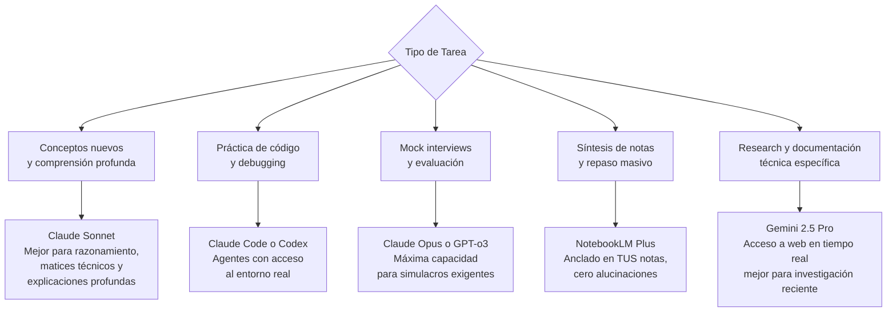

---

## 4. Arquitectura General del Recorrido

### Vista macro del camino completo

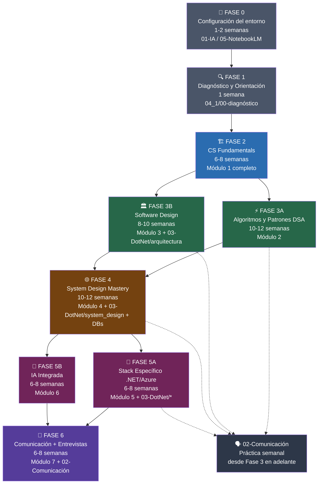

### Regla crítica de paralelismo

| Permitido ejecutar en paralelo | No permitido en paralelo |
|-------------------------------|--------------------------|
| Fase 3A + Fase 3B (desde semana 5 de Fase 2) | Fase 2 + Fase 3 (arranca F3 solo al completar F2) |
| Fase 5A + Fase 5B parcialmente | Fase 4 sin completar M2 y M3 en nivel mínimo |
| Comunicación (práctica semanal) desde Fase 3 | Módulo 6 (IA Integrada) antes de completar M4 |
| Anki y repaso espaciado: siempre | Módulo 7 sin M5 y M6 en nivel mínimo |

---

## 5. FASE 0 — Configuración del Entorno de Aprendizaje

**Duración:** 3–5 días  
**Objetivo:** Tener todas las herramientas de IA configuradas y funcionando eficientemente antes de empezar el estudio técnico real. Invertir aquí ahorra cientos de horas después.

### 5.1 Orden de lectura en esta fase

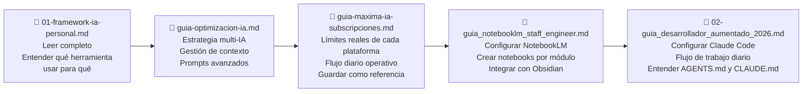

### 5.2 Acciones concretas de esta fase

**Día 1-2: Framework de IA**
- [ ] Lee `01-framework-ia-personal.md` completo — identifica las diferencias reales entre ChatGPT, Gemini y Claude para TUS tareas de estudio
- [ ] Lee `guia-optimizacion-ia.md` — implementa el framework de decisión: qué IA usar para qué tarea
- [ ] Lee `guia-maxima-ia-subscripciones.md` — configura tu flujo diario para no quemar cuotas en tareas que no las requieren
- [ ] Configura un **Proyecto en Claude.ai**, Proyecto de ChatGpt o Gem de Gemini usa la IA que tengas disponible exclusivo para estudio técnico con un system prompt que tenga tu perfil, tus gaps y tus objetivos

**Día 3: NotebookLM**
- [ ] Lee `guia_notebooklm_staff_engineer.md` secciones 1-4 y 7-9
- [ ] Crea en NotebookLM los siguientes notebooks:
  - `NB-M1: CS Fundamentals` — cargar archivos del Módulo 1 cuando llegues ahí
  - `NB-M2: DSA Patterns` — cargar cuando inicies Módulo 2
  - `NB-M3: Software Design` — cargar cuando inicies Módulo 3
  - `NB-M4: System Design` — cargar cuando inicies Módulo 4
  - `NB-Entrevistas` — cargar Módulo 7 + guías de entrevista

**Día 4-5: Entorno de desarrollo**
- [ ] Lee `02-guia_desarrollador_aumentado_2026.md` — configura Claude Code o la IA disponible y tu flujo de trabajo con agentes
- [ ] Instala Anki y crea mazos separados por módulo (ver sección de complementos externos)
- [ ] Instala extensiones de Obsidian recomendadas si no las tienes: Calendar, Periodic Notes, Spaced Repetition

### 5.3 Configuración del Project Claude para estudio

Crea un proyecto en Claude.ai, un proyecto de ChatGpt o un Gem de Gemini el qu tengas disponible con este system prompt como base (adaptarlo con tus datos reales del diagnóstico):

```
Eres mi mentor técnico para la preparación de entrevistas a nivel Staff Engineer.

PERFIL:
- 10 años de experiencia en .NET/C# (nivel 4-5)
- Gaps principales: algoritmos DSA [nivel X], system design [nivel X], software design [nivel X]
- Objetivo: Staff Engineer / Software Architect
- Timeline: 8-12 meses

INSTRUCCIONES DE INTERACCIÓN:
1. Cuando te presente un concepto con mis palabras, evalúa precisión técnica, no validez general
2. En mock interviews, comportate como un entrevistador real — no des pistas, exige articulación clara
3. Siempre que expliques algo, incluye el caso de cuándo NO aplica esta solución
4. Si te pido ayuda con código, primero pregunta si ya intenté resolverlo solo
5. Prioriza trade-offs sobre respuestas definitivas
```

---

## 6. FASE 1 — Diagnóstico y Orientación

**Duración:** 2–3 días  
**Objetivo:** Conocer con precisión tu punto de partida real antes de trazar el camino.

⚠️ **No saltes esta fase aunque "ya sabrás" tu nivel.** La autoevaluación sin preguntas concretas produce niveles inflados que generan un plan mal calibrado para los próximos 8 meses.

### 6.1 Orden de lectura

| Orden | Archivo | Acción requerida |
|-------|---------|------------------|
| 1° | `04_1/00-0-README.md` | Leer completo. Entender los principios del curriculum y la leyenda de símbolos |
| 2° | `04_1/00-1-diagnostico.md` | Completar la Sección 4 (preguntas de calibración) en papel ANTES de asignarte niveles. Luego llenar la tabla de la Sección 3 |
| 3° | `04_1/00-2-roadmap-visual.md` | Ver el mapa panorámico. Identificar dónde estarás en cada momento |
| 4° | `05-Varios/roadmap_zero_to_hero_updated.md` | Lectura única para contexto. Ver la vista alternativa del camino. No seguirlo como plan paralelo |

### 6.2 Resultado esperado de esta fase

Al terminar debes tener completa esta tabla (en el archivo `00-1-diagnostico.md`):

| Área | Mi Nivel (1–5) | Gap a Objetivo | Prioridad |
|------|---------------|---------------|-----------|
| Algoritmos y DSA | ___ | 4–5 | ___ |
| Complejidad Algorítmica | ___ | 4 | ___ |
| Bases de Datos | ___ | 4–5 | ___ |
| Software Design | ___ | 4–5 | ___ |
| System Design | ___ | 4–5 | ___ |
| .NET / C# | ___ | 5 | ___ |
| Cloud / Azure | ___ | 4–5 | ___ |
| IA Integrada | ___ | 3–4 | ___ |

🏁 **Checkpoint de Fase 1:** Tienes el diagnóstico completado, sabes tu punto de entrada al Módulo 1, y tienes identificados tus gaps críticos (nivel ≤ 2 en cualquier área que no sea IA Integrada).

---

## 7. FASE 2 — CS Fundamentals (El Suelo Firme)

**Duración:** 6–8 semanas  
**Objetivo:** Construir los modelos mentales fundamentales de computer science que hacen que todo lo demás tenga sentido.

⚠️ **Advertencia crítica:** Esta fase parece "básica" para un Senior de 10 años. No lo es. CS Fundamentals no es "sé programar" — es saber por qué las cosas funcionan así por dentro. Gaps aquí se manifiestan exactamente cuando más duele: en una entrevista de system design o ante una decisión arquitectónica bajo presión.

### 7.1 Orden secuencial de archivos

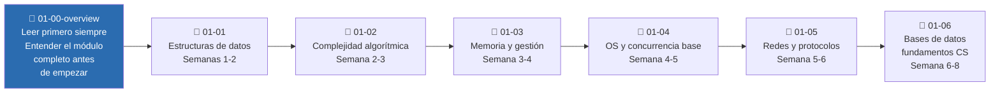

### 7.2 Recursos externos a usar en paralelo con cada archivo

| Archivo del Curriculum | Recurso de Suscripción | Cuándo | Recurso Gratuito Complementario |
|------------------------|----------------------|--------|--------------------------------|
| `01-01-estructuras-de-datos` | 🎯 AlgoMonster: "Data Structures path" completo | En paralelo — primero AlgoMonster para intuición visual, luego el archivo para profundidad | 🆓 VisualAlgo.net (animaciones de estructuras de datos) |
| `01-02-complejidad-algoritmica` | 🎯 AlgoMonster: sección de análisis de complejidad | Después de leer el archivo | 🆓 Big-O Cheat Sheet (bigocheatsheet.com) |
| `01-03-memoria-y-gestion` | 🎯 Pluralsight: ".NET Memory Management" | Después de leer el archivo | 🆓 Docs de Microsoft sobre GC de .NET |
| `01-04-os-y-concurrencia-base` | 🎯 Pluralsight: "Concurrency in C#" | Después de leer | 🆓 "Operating Systems: Three Easy Pieces" — capítulos de concurrencia (gratuito en ostep.org) |
| `01-05-redes-y-protocolos` | — | — | 🆓 "Computer Networking: A Top-Down Approach" capítulos 1-3 / Beej's Guide to Network Programming |
| `01-06-bases-de-datos-fundamentos-cs` | — | — | 🆓 CMU 15-445 lecture notes (free online): páginas sobre B-Trees y storage |

### 7.3 Protocolo de sesiones Claude en esta fase

🤖 **Uso de Claude o tu IA disponible en Módulo 1 — ejemplos concretos:**

- **Después de `01-01`:** "Acabo de estudiar estructuras de datos. Hazme 5 preguntas de profundidad sobre B-Trees y Hash Maps, como si estuvieras en una entrevista de Staff Engineer. Empieza cuando quieras."
- **Después de `01-02`:** "Voy a explicarte amortized O(1) con mis propias palabras: [tu explicación]. Evalúa precisión técnica y completitud. No me des la respuesta antes de escuchar la mía."
- **Después de `01-04`:** "Dame un problema de concurrencia real que deba resolverse con código C#. Tengo 20 minutos. No des pistas."

### 7.4 Qué hacer con NotebookLM en esta fase

- Carga todos los archivos de Módulo 1 en el notebook `NB-M1: CS Fundamentals`
- Genera un Audio Overview semanal para escuchar durante transporte o ejercicio
- Usa el chat de NotebookLM para preguntas de repaso: "¿Qué diferencia hay entre un B-Tree y un B+Tree según mis notas?"

🏁 **Checkpoint de Fase 2:** Puedes responder correctamente (sin consultar) las preguntas P1-P7 del diagnóstico (`00-1-diagnostico.md`). Si no puedes responder P1, P2 y P4 fluidamente, el Módulo 1 no está terminado.

---

## 8. FASE 3 — Algoritmos + Software Design (Ejecución en Paralelo)

**Duración total:** 10–14 semanas  
**Paralelismo:** Los Módulos 2 y 3 pueden ejecutarse en paralelo **a partir de la semana 5 de la Fase 2**. No antes.

> 💡 Por qué en paralelo: Son dominios distintos (algorítmico vs. arquitectónico) que comparten poco contexto entre sí. Intercalarlos es más eficiente que hacerlos secuencialmente y proporciona el beneficio cognitivo del interleaving.

### 8.1 — MÓDULO 2: Algoritmos y Patrones DSA

**Duración:** 10–12 semanas  
**Objetivo:** Desarrollar intuición de patrones algorítmicos — no memorizar soluciones sino reconocer categorías de problemas

#### Orden de archivos

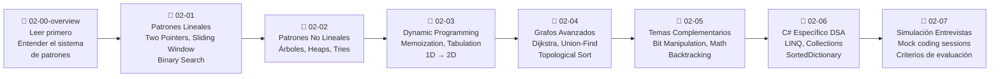

#### Recursos externos para Módulo 2

| Archivo | AlgoMonster | AlgoExpert | Gratuito |
|---------|-------------|------------|----------|
| `02-01` (lineales) | Two Pointers + Sliding Window + Binary Search — **PRIMERO antes del archivo** | Segunda pasada con variantes | 🆓 NeetCode.io (videos explicativos gratuitos por patrón) |
| `02-02` (no lineales) | BFS/DFS + Trees | Trees and Graphs sección | 🆓 NeetCode 150 — sección Trees |
| `02-03` (DP) | Dynamic Programming módulo completo | DP sección — problemas difíciles | 🆓 NeetCode 150 — sección 1D y 2D DP |
| `02-04` (grafos avanzados) | Topological Sort + Union-Find | Graphs avanzado | 🆓 cp-algorithms.com para grafos |
| `02-05` (complementarios) | — | Bit Manipulation sección | 🆓 LeetCode Bit Manipulation study plan |
| `02-07` (mock) | Repetición espaciada de patrones débiles | Mock interviews sección | 🤖 Mock sessions con Claude Opus |

💡 **Regla de oro para DSA:** AlgoMonster siempre **antes** del archivo del curriculum (para la intuición visual del patrón). El archivo del curriculum da la profundidad. AlgoExpert después para volumen y variantes. LeetCode solo en las últimas 2 semanas antes de una entrevista específica para inteligencia de empresa (no como práctica general).

**Target de práctica:** 3–4 problemas de LeetCode/NeetCode por sesión, intercalando patrones distintos. No hagas 20 del mismo tipo — el interleaving es el mecanismo de aprendizaje real aquí.

---

### 8.2 — MÓDULO 3: Software Design + Guía de Arquitectura

**Duración:** 8–10 semanas  
**Objetivo:** Entender arquitectura de software con la profundidad de un Staff Engineer — no memorizar patrones sino saber cuándo NO usarlos y qué costo tiene cada decisión

#### Orden de archivos (incluyendo la guía de arquitectura de la carpeta 03)

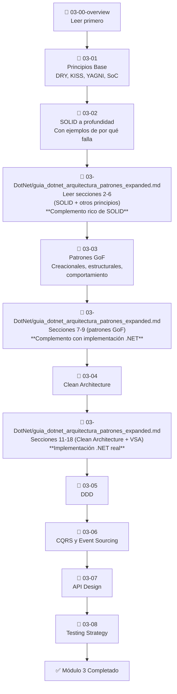

#### Recursos externos para Módulo 3

| Archivo | Pluralsight | Gratuito / Libro |
|---------|-------------|-----------------|
| `03-02` SOLID | "SOLID Principles in C#" — ver después del archivo | 📚 "Clean Code" (Martin) — capítulos sobre principios |
| `03-03` GoF | "Design Patterns in C#" — ver después | 📚 "Head First Design Patterns" — para intuición visual |
| `03-04` Clean Architecture | "Clean Architecture with ASP.NET Core" | 📚 "Clean Architecture" (Martin) — caps 1-7 y 17-22 |
| `03-05` DDD | "Domain-Driven Design Fundamentals" | 📚 "Domain-Driven Design Distilled" (Vernon) |
| `03-06` CQRS | "CQRS and Event Sourcing" — implementación con MediatR | 🆓 Microsoft CQRS pattern docs |
| `03-08` Testing | "Testing .NET Applications" | 📚 "The Art of Unit Testing" (Osherove) |

🏁 **Checkpoint de Fase 3 — DSA:** Puedes resolver un problema de Medium en LeetCode del patrón que corresponde en menos de 25 minutos, articulando el razonamiento en voz alta. Puedes explicar 3 patrones distintos y cuándo elegir cada uno.

🏁 **Checkpoint de Fase 3 — Software Design:** Puedes responder correctamente P12-P14 del diagnóstico. Puedes explicar cuándo NO usar CQRS, cuándo DDD es over-engineering, y qué trade-offs tiene Clean Architecture en proyectos pequeños.

---

## 9. FASE 4 — System Design Mastery

**Duración:** 10–12 semanas  
**Prerequisito:** Módulos 2 y 3 en nivel mínimo (checkpoints alcanzados)  
**Objetivo:** Desarrollar el framework de pensamiento para diseñar cualquier sistema desde cero, comunicar trade-offs, y tomar decisiones arquitectónicas defendibles bajo presión

### 9.1 Orden de archivos y sus complementos

#### Preparación previa (antes de abrir el primer archivo)

🎯 **AlgoExpert Systems Expert:** Antes de entrar a `04-00-overview`, ve los primeros 3-4 videos de Systems Expert. Dan un mapa visual de system design que hace que el texto del curriculum sea mucho más fácil de anclar. El orden es: visualización → texto → práctica.

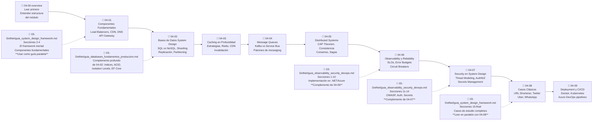

### 9.2 Sesiones de práctica de System Design

La práctica activa es la única forma de desarrollar esta habilidad. Leer casos no es suficiente.

**Protocolo de práctica semanal (obligatorio desde semana 3 de esta fase):**

🧪 **Ejercicio semanal de diseño:**
1. Elige un sistema clásico que no hayas practicado (ver lista en `04-08-casos-clasicos.md`)
2. Sin consultar referencias, diseña el sistema en papel o whiteboard durante 45 minutos
3. Presenta el diseño verbalmente como si fuera una entrevista real (grábate si es posible)
4. Después, compara con los casos de `guia_system_design_framework.md` y `04-08`
5. Sesión con Claude: "Voy a presentarte el diseño que hice de [sistema]. Actúa como entrevistador Staff y evalúa mis trade-offs, no mis componentes."

**Sistemas para practicar (en orden de complejidad):**
1. URL Shortener (bit.ly)
2. Rate Limiter distribuido
3. Sistema de notificaciones push
4. Twitter/X News Feed
5. Sistema de rides en tiempo real (Uber)
6. Google Drive / Dropbox
7. YouTube
8. WhatsApp / mensajería en tiempo real
9. Search Engine (simplificado)
10. Distributed Cache (Redis-like)

🏁 **Checkpoint de Fase 4:** Puedes responder correctamente P15-P17 del diagnóstico, diseñar cualquiera de los 10 sistemas de la lista en 45 minutos articulando trade-offs, y explicar CAP Theorem con un ejemplo concreto sin solo definir los términos.

---

## 10. FASE 5 — Stack Especializado + IA Integrada

**Duración:** 12–16 semanas (ambos módulos en paralelo parcialmente)  
**Prerequisito:** Módulo 4 completado

> 💡 Por qué el stack específico viene después de system design: Como explica el curriculum, los primeros 4 módulos son agnósticos al stack deliberadamente. El modelo mental universal viene primero — la implementación .NET es un detalle que ahora tienes el marco conceptual correcto para anclar.

### 10.1 — MÓDULO 5: Stack Específico

**Duración:** 6–8 semanas

#### Orden de archivos con complementos de la carpeta 03

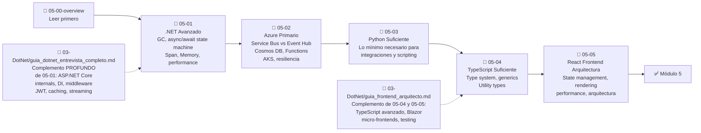

#### Recursos externos para Módulo 5

| Archivo | Pluralsight | Libro / Complemento |
|---------|-------------|---------------------|
| `05-01` .NET Avanzado | "ASP.NET Core Internals" | 📚 "Pro .NET Memory Management" (Goldshtein) — caps sobre GC |
| `05-02` Azure | "Azure Architecture" + "Azure DevOps" | 🆓 Microsoft Azure Architecture Center (docs.microsoft.com) |
| `05-04` TypeScript | "TypeScript Fundamentals" | 🆓 TypeScript Handbook oficial (typescriptlang.org) |
| `05-05` React | "React Fundamentals" | 🆓 react.dev — documentación oficial |

---

### 10.2 — MÓDULO 6: IA Integrada

**Duración:** 6–8 semanas  
⚠️ **Sin excepción:** Siempre después de completar Módulo 4. La razón es técnica: diseñar sistemas con LLMs requiere system design como base. Un RAG bien diseñado requiere conocimiento de caching, bases de datos vectoriales y patrones de consistencia.

#### Orden de archivos

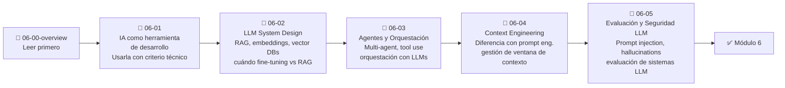

💡 En esta fase, las guías de la carpeta 01 (especialmente `02-guia_desarrollador_aumentado_2026.md`) cobran nueva relevancia — vuelve a leerlas desde la perspectiva técnica que ya tienes. Lo que antes era "configurar herramientas" ahora se lee como "entender la arquitectura de los sistemas que usas".

---

## 11. FASE 6 — Comunicación + Entrevistas + Negociación

**Duración:** 6–8 semanas  
**Prerequisito:** Módulos 5 y 6 en nivel mínimo

> Esta es la fase más activa y menos de lectura. El ratio debe invertirse: 30% lectura / estudio, 70% práctica activa de entrevistas.

### 11.1 — Guía de Comunicación (Inicio en Fase 3, Ejecución en Fase 6)

📄 **`02-Comunicacion/guia_comunicacion_valor_ingeniero_senior_staff.md`**

Esta guía tiene un ciclo de uso en dos tiempos:

**Primera lectura (en Fase 3):**
- Lee completa para entender el marco conceptual
- Identifica los frameworks de comunicación que vas a usar
- Empieza a documentar tu impacto actual (sección 13 del archivo)
- Implementa el checklist semanal de operación (sección 17)

**Ejecución activa (en Fase 6):**
- Sigue el plan de entrenamiento de 8 semanas (sección 15)
- Practica las simulaciones de la sección 14 con Claude
- Refina tu narrativa profesional para entrevistas (sección 6)

### 11.2 — Módulo 7: Entrevistas

#### Orden de archivos

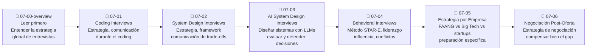

### 11.3 Protocolo de práctica intensiva de entrevistas

**Mocks de coding (2–3 por semana):**
- 🎯 AlgoExpert: Mock interviews sección — con tiempo real
- 🎯 AlgoMonster: Repetición espaciada de patrones débiles
- 🤖 Claude Opus: "Vamos a hacer un mock de coding interview. Yo soy el candidato, tú eres el entrevistador. El problema es de nivel Medium de grafos. No des pistas. Evalúa al final si pasaría la entrevista."

**Mocks de System Design (2 por semana):**
- 🎯 AlgoExpert Systems Expert: Mock interviews de System Design
- 🤖 Claude Opus: "Hazme una entrevista de System Design de 45 minutos. El sistema es [X]. Actúa como entrevistador de nivel Staff en [empresa target]. Evalúa mis trade-offs, mi comunicación y mi claridad de pensamiento."

**Mocks de Behavioral (1 por semana):**
- 🤖 Claude: "Hazme una entrevista behavioral para un rol de Staff Engineer. Enfócate en liderazgo técnico, influencia sin autoridad y situaciones de conflicto. Evalúa si mis respuestas muestran criterio de Staff y no solo de Senior."

---

## 12. Recursos Transversales y Paralelos

Estos recursos funcionan durante todo el recorrido, no en una fase específica.

### 12.1 Apéndices del curriculum — Siempre disponibles

| Archivo | Cómo y cuándo usar |
|---------|-------------------|
| `A-recursos-completos.md` | Consultar cada vez que necesites saber qué suscripción usar en qué punto exacto. No leer linealmente — usar como índice de referencia |
| `B-tracking-autoevaluacion.md` | Actualizar al terminar cada archivo del curriculum. Es tu línea de progreso — sin esto no sabes realmente dónde estás |
| `C-glosario-terminos-clave.md` | Consultar cada vez que encuentres un término técnico que no puedas definir con precisión. No memorizar — usar como diccionario |

### 12.2 Guía de Comunicación — Práctica semanal desde Fase 3

📄 **`02-Comunicacion/guia_comunicacion_valor_ingeniero_senior_staff.md`**

Desde la Fase 3 en adelante, dedica **30–45 minutos por semana** a:
- Documentar 1-2 decisiones técnicas de tu trabajo actual y traducirlas a impacto de negocio
- Practicar 1 framework de comunicación (sección 11 del archivo) con Claude o tu IA disponible
- Actualizar tu narrativa profesional con evidencia nueva

Esta práctica continua es lo que diferencia a quienes llegan a las entrevistas con ejemplos vívidos de quienes improvisando con ejemplos vagos.

### 12.3 NotebookLM — Uso por módulo

| Momento | Acción en NotebookLM |
|---------|---------------------|
| Al iniciar cada módulo | Cargar todos los archivos del módulo en su notebook correspondiente |
| Audio Overviews | Generar y escuchar durante ejercicio o transporte — excelente para repaso pasivo |
| Sesión de repaso (fin de semana) | Chat con el notebook: "Hazme 10 preguntas de nivel Staff sobre [tema] sin dar las respuestas — yo respondo y luego me corriges" |
| Antes de avanzar al siguiente archivo | "Según mis notas, ¿qué debería saber ya sobre [próximo tema] y qué no cubre aún mi material?" |

---

## 13. Complementos Externos Recomendados

### 13.1 Herramientas de práctica y aprendizaje

| Herramienta | Rol | Por qué esta y no otra |
|-------------|-----|----------------------|
| **Anki** (gratuito) | Repetición espaciada de conceptos técnicos | Algoritmo SM-2 probado científicamente. Portable. Funciona sin internet. 15 minutos al día = retención a largo plazo |
| **Obsidian** (gratuito) | Base de conocimiento del vault | Ya lo usas. Integración con NotebookLM. Permite links bidireccionales entre conceptos |
| **Excalidraw** (gratuito) | Whiteboard para diagramas de System Design | La práctica real es en whiteboard — simular ese entorno es parte del entrenamiento |
| **Loom** (gratuito hasta 25 videos) | Grabarte en mocks de entrevista | Verse a uno mismo comunicando es la forma más eficiente de identificar problemas de articulación |

### 13.2 Plataformas de práctica de código

| Plataforma | Cuándo usarla | Cómo usarla |
|------------|--------------|-------------|
| **NeetCode.io** (gratuito) | Módulo 2 — práctica DSA | NeetCode 150 como lista base. Videos explicativos gratuitos por patrón antes de intentar el problema |
| **LeetCode** (gratuito/Pro) | Solo 2–3 semanas antes de entrevista específica | Para inteligencia de empresa (ver qué pregunta X empresa) — no como práctica general |
| **AlgoMonster** (suscripción) | Módulo 2 — andamiaje inicial de cada patrón | Siempre antes del archivo del curriculum — da intuición visual primero |
| **AlgoExpert** (suscripción) | Módulo 2 (variantes) + Módulo 4 (Systems Expert) + Módulo 7 (mocks) | Diferencia con AlgoMonster: más volumen, menos andamiaje |

### 13.3 Libros recomendados por fase

| Libro | Fase | Capítulos Prioritarios |
|-------|------|----------------------|
| 📚 **"Designing Data-Intensive Applications"** (Kleppmann) | Fase 4 | Caps 1-3 (fundamentos), 5-6 (replicación, particiones), 7 (transacciones), 9 (consistencia) |
| 📚 **"System Design Interview"** (Alex Xu — Vol. 1 y 2) | Fase 4 | Todos los casos — usarlo como práctica, no como teoría |
| 📚 **"Clean Architecture"** (Robert C. Martin) | Fase 3 | Caps 1-7 (principios), 17-22 (arquitectura limpia) |
| 📚 **"Domain-Driven Design Distilled"** (Vaughn Vernon) | Fase 3 | Caps 1-6 completos |
| 📚 **"A Philosophy of Software Design"** (Ousterhout) | Fase 3 | Completo — es corto y denso |
| 📚 **"The Staff Engineer's Path"** (Reilly) | Fase 6 | Completo — especialmente caps 3-5 sobre impacto y influencia |

### 13.4 Recursos gratuitos de alto valor

| Recurso | Fase | Uso |
|---------|------|-----|
| 🆓 **ByteByteGo Newsletter** (Alex Xu) | Fase 4 en adelante | Conceptos de system design visualizados semanalmente. Gratuito en Substack |
| 🆓 **Engineering Blogs** (Netflix, Uber, Discord, Cloudflare) | Fase 4-5 | Lectura de 1 post técnico por semana — sistemas reales con decisiones reales. Linkear con lo que estudias |
| 🆓 **"OSTEP" — Operating Systems: Three Easy Pieces** | Fase 2 (`01-04`) | ostep.org — gratuito completo. Caps de concurrencia son los mejores disponibles |
| 🆓 **CMU 15-445 Database Systems** | Fase 2 (`01-06`) y Fase 4 | Lecture notes y slides gratuitos. Nivel universitario serio en almacenamiento e índices |
| 🆓 **The Pragmatic Engineer Newsletter** (Gergely Orosz) | Fase 6 | Estrategias de carrera, negociación y estructura interna de empresas tech. Gratuito en Substack |
| 🆓 **VisualAlgo.net** | Fase 2-3 | Animaciones interactivas de estructuras de datos y algoritmos |
| 🆓 **NeetCode.io** | Fase 3 (DSA) | Videos gratuitos por patrón. Mejor que ver soluciones en LeetCode |
| 🆓 **highscalability.com** | Fase 4-5 | Casos reales de arquitectura de sistemas a escala — leer 1 caso por semana |

---

## 14. Calendario Macro — Vista de 12 Meses

### Timeline visual

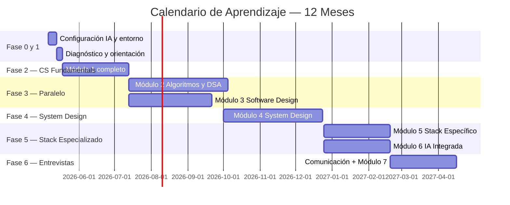

### Desglose semanal por fase

| Semana | Fase | Foco Principal | Archivo(s) |
|--------|------|---------------|------------|
| 0 | Fase 0 | Configuración de herramientas IA | `01-framework-ia-personal`, `guia-optimizacion-ia`, `guia-maxima-ia-subscripciones`, `guia_notebooklm` |
| 1 | Fase 1 | Diagnóstico y orientación | `00-0-README`, `00-1-diagnostico`, `00-2-roadmap-visual`, `roadmap_zero_to_hero` |
| 2–3 | Fase 2 | Estructuras de datos | `01-00-overview` + `01-01-estructuras-de-datos` |
| 4 | Fase 2 | Complejidad algorítmica | `01-02-complejidad-algoritmica` |
| 5–6 | Fase 2 | Memoria y OS | `01-03-memoria-y-gestion` + `01-04-os-y-concurrencia-base` |
| 7–8 | Fase 2 | Redes y Bases de datos CS | `01-05-redes-y-protocolos` + `01-06-bases-de-datos-fundamentos-cs` |
| 9–10 | Fase 3A | Inicio DSA + Fase 3B inicio Software Design | `02-00-overview` + `02-01` / `03-00-overview` + `03-01` |
| 11–12 | Fase 3 | Patrones lineales + SOLID | `02-01` (completo) / `03-02` + guia_arquitectura_patrones |
| 13–15 | Fase 3 | Patrones no-lineales + GoF | `02-02` / `03-03` + guia_arquitectura (GoF) |
| 16–18 | Fase 3 | Dynamic Programming + Clean Architecture | `02-03` / `03-04` + guia_arquitectura (Clean Arch) |
| 19–20 | Fase 3 | Grafos avanzados + DDD | `02-04` / `03-05` |
| 21–22 | Fase 3 | Complementarios + CQRS, Testing | `02-05` + `02-06` / `03-06` + `03-07` + `03-08` |
| 23 | Fase 4 | Inicio System Design | `04-00-overview` + AlgoExpert Systems Expert (primeros videos) |
| 24–25 | Fase 4 | Componentes + Bases de datos SD | `04-01` + `04-02` + `guia_databases_fundamentos` |
| 26–27 | Fase 4 | Caching + Message Queues | `04-03` + `04-04` |
| 28–30 | Fase 4 | Distributed Systems | `04-05` — el más denso del módulo |
| 31–32 | Fase 4 | Observability + Security | `04-06` + `04-07` + guia_observability (secciones 1-14) |
| 33–34 | Fase 4 | Casos clásicos + CI/CD | `04-08` + `guia_system_design_framework` (casos) + `04-09` |
| 35–38 | Fase 5A | .NET Avanzado + guia_entrevista_dotnet | `05-00-overview` + `05-01` + guia_dotnet_entrevista_completo |
| 39–40 | Fase 5A | Azure | `05-02` |
| 41–42 | Fase 5A/5B | TypeScript + React + inicio IA | `05-04` + `05-05` + guia_frontend / `06-00-overview` + `06-01` |
| 43–44 | Fase 5B | LLM System Design + Agentes | `06-02` + `06-03` |
| 45–46 | Fase 5B | Context Engineering + Seguridad LLM | `06-04` + `06-05` |
| 47 | Fase 6 | Inicio Comunicación intensiva + Entrevistas | guia_comunicacion (plan 8 semanas) + `07-00-overview` |
| 48–49 | Fase 6 | Coding + System Design interviews | `07-01` + `07-02` + mocks diarios |
| 50–51 | Fase 6 | AI System Design + Behavioral | `07-03` + `07-04` + mocks |
| 52 | Fase 6 | Estrategia empresa + Negociación | `07-05` + `07-06` |

> ⚠️ Este calendario asume dedicación de 15–20 horas/semana. Con menos tiempo, extiende los módulos proporcionalmente. Con 8–10 horas/semana, el timeline es 16–18 meses.

---

## 15. Sistema de Seguimiento de Progreso

### 15.1 Archivo oficial de tracking

📄 Usa `04_1/B-tracking-autoevaluacion.md` como tu registro oficial. Actualiza al terminar cada archivo.

### 15.2 Indicadores que debes registrar

Para cada archivo del curriculum, registra:
- Fecha de inicio y fecha de término
- Nivel al entrar (1–5) y nivel al salir (1–5)
- Checkpoints alcanzados: sí/no
- Ejercicios prácticos completados
- Preguntas que no pudiste responder (para revisión)

### 15.3 Revisión periódica de progreso

| Frecuencia | Actividad |
|------------|-----------|
| **Diario** | 15 min Anki + actualizar tracking si terminaste un archivo |
| **Semanal (domingo)** | Revisar progreso de la semana, ajustar plan de la siguiente, 1 mock de entrevista completo |
| **Mensual** | Revisar el diagnóstico original: ¿han subido los niveles? Re-hacer 2-3 preguntas de calibración |
| **Al terminar cada módulo** | Checkpoint formal: responder las preguntas del diagnóstico correspondientes sin ayuda |

---

## 16. Errores Críticos a Evitar

Estos son los errores que invalidan meses de trabajo. Léelos ahora y vuelve a leerlos cuando sientas que estás progresando rápido.

### ❌ Error 1: Avanzar sin alcanzar los checkpoints

El checkpoint al final de cada archivo no es decorativo. Es el criterio real de si el archivo terminó. Si puedes completar el ejercicio o responder las preguntas calibradas sin abrir el archivo → terminó. Si no → no terminó aunque lo hayas leído completo.

### ❌ Error 2: Usar LeetCode como práctica principal de DSA

LeetCode como práctica masiva desarrolla reconocimiento de problemas específicos, no intuición algorítmica transferible. El orden correcto es: AlgoMonster (andamiaje del patrón) → NeetCode 150 (consolidación con volumen) → LeetCode (solo en las 2 semanas previas a una entrevista específica para inteligencia de empresa).

### ❌ Error 3: Ir al Módulo 6 antes de terminar el Módulo 4

Diseñar sistemas con LLMs requiere system design. Sin Módulo 4, el Módulo 6 es vocabulario sin comprensión. RAG, vector databases, y trade-offs de consistencia en sistemas de IA son extensiones de caching, bases de datos y distributed systems — no puedes entender la extensión sin la base.

### ❌ Error 4: Contextos de IA demasiado largos

Una conversación de 50+ intercambios pierde calidad. Cada mensaje nuevo que envías fuerza al modelo a procesar todo el historial acumulado. Para estudio técnico: conversaciones nuevas por tema. Nunca mezcles "creación de notas" con "práctica de entrevista" en la misma sesión.

### ❌ Error 5: Estudiar el stack específico antes de time design

Es tentador porque tienes 10 años de .NET. El riesgo: desarrollar una visión tan específica al stack que no puedes tomar decisiones arquitectónicas agnósticas al lenguaje — exactamente lo que se evalúa a nivel Staff. El Módulo 5 viene en Fase 5 por razón técnica, no arbitraria.

### ❌ Error 6: No practicar comunicación desde la Fase 3

La guía de comunicación no es para "leer cuando llegue a entrevistas". El plan de entrenamiento de 8 semanas de la sección 15 del archivo requiere práctica acumulativa. Si empiezas en la Fase 6, llegas sin los ejemplos documentados y sin el músculo de articulación desarrollado. Empieza el checklist semanal desde Fase 3.

### ❌ Error 7: Saltarse el diagnóstico

Un nivel mal calibrado al inicio produce un plan de estudio mal calibrado durante 8 meses. El diagnóstico tiene preguntas técnicas concretas que te darán una medición más honesta que tu percepción. No hay nadie mirando — la honestidad solo te beneficia a ti.

---

## Nota Final

Este plan es un mapa, no un taxi. El mapa te dice el camino — el trabajo real lo haces tú.

El diferencial entre quienes alcanzan nivel Staff y quienes no no es la cantidad de recursos consumidos. Es la calidad de la práctica activa, la honestidad en los checkpoints, y la consistencia de ejecución semana a semana durante 8–12 meses.

Todos los recursos que necesitas están en esta carpeta y en los complementos externos señalados. El problema de los recursos nunca fue la ausencia — siempre fue la falta de sistema.

Ahora tienes el sistema. La ejecución es tuya.

---

*Plan Maestro V2 — Creado: Mayo 2026 — Basado en análisis integral de todos los recursos de la carpeta 04 - Mis_Guias/*
