# 🧠 Guía Máxima de Aprovechamiento de Suscripciones IA
### ChatGPT Plus · Gemini Advanced · Claude Pro — $20/mes c/u → $60 total

> **Para quién es esto:** Senior Engineers → Staff/Arquitecto | Trabajo técnico intensivo | Uso diario profesional  
> **Objetivo:** Exprimir cada token, cada límite, cada herramienta disponible en las tres plataformas

---

## 📋 Tabla de Contenido

1. [La Realidad de los Límites — Por Qué Se Acaban Tan Rápido](#1-la-realidad-de-los-límites)
2. [Filosofía de Orquestación — Las 3 IAs como un Equipo](#2-filosofía-de-orquestación)
3. [Claude Pro — Guía Completa de Aprovechamiento](#3-claude-pro)
4. [ChatGPT Plus — Guía Completa de Aprovechamiento](#4-chatgpt-plus)
5. [Gemini Advanced — Guía Completa de Aprovechamiento](#5-gemini-advanced)
6. [Herramientas de Código: Claude Code, Codex, Gemini Code](#6-herramientas-de-código)
7. [Estrategia de Modelos: Ligeros vs Pesados](#7-estrategia-de-modelos-ligeros-vs-pesados)
8. [Flujos de Trabajo por Caso de Uso](#8-flujos-de-trabajo-por-caso-de-uso)
9. [Gestión de Contexto y Proyectos](#9-gestión-de-contexto-y-proyectos)
10. [Plantillas de Prompts de Alto Rendimiento](#10-plantillas-de-prompts)
11. [Sistema Personal de Organización](#11-sistema-personal-de-organización)
12. [Flujo Diario Recomendado](#12-flujo-diario-recomendado)

---

## 1. La Realidad de los Límites

### ¿Por Qué Se Acaban Tan Rápido?

Cada empresa mide el consumo de manera diferente, pero todas tienen el mismo objetivo: proteger su infraestructura de usuarios que consumen desproporcionadamente.

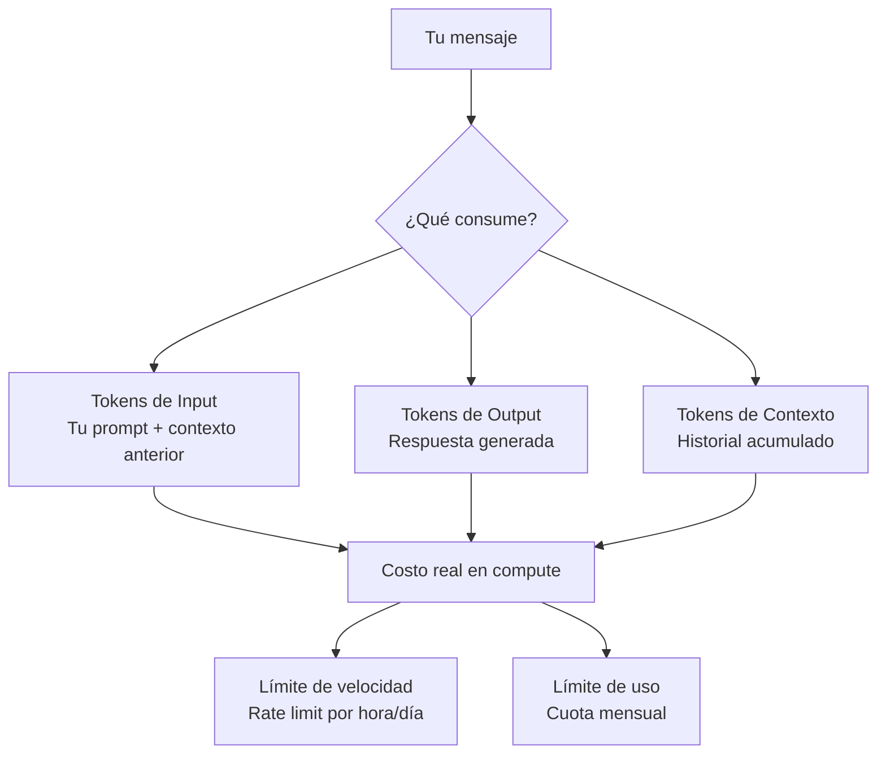

### Tabla Comparativa de Medición de Límites

| Plataforma | Modelo | Tipo de Límite | Período | Nota Clave |
|-----------|--------|---------------|---------|------------|
| **Claude Pro** | claude-sonnet-4-6 | Mensajes/período | ~5 horas ventana | Se resetea automáticamente |
| **Claude Pro** | claude-haiku-4-5 | Mensajes/período | Más generoso | Úsalo para drafts |
| **ChatGPT Plus** | GPT-4o | Mensajes/3 horas | ~40-80 mensajes | Baja a GPT-4o mini automático |
| **ChatGPT Plus** | o1/o3 | Mensajes/semana | Muy limitado | Reservar para razonamiento real |
| **ChatGPT Plus** | o4-mini | Mensajes/día | Moderado | Mejor relación calidad/límite |
| **Gemini Advanced** | Gemini 2.5 Pro | Mensajes/día | ~50-100 | Más generoso actualmente |
| **Gemini Advanced** | Gemini 2.0 Flash | Mensajes/día | Muy generoso | Tu caballo de batalla |

> ⚠️ **Importante:** Los límites exactos no son publicados y cambian constantemente. Lo que no cambia es la estrategia: **usar modelos ligeros para trabajo exploratorio, modelos pesados para decisiones finales.**

### Los 3 Pecados del Usuario que Agota Límites

1. **El Contexto Zombie** — Conversaciones larguísimas donde el modelo carga 10,000 tokens de historial para responder algo nuevo. Cada mensaje nuevo en una conversación larga consume exponencialmente más.

2. **El Prompt Improvisado** — Ir al modelo sin claridad, generar 5 respuestas basura, refinar, generar 5 más. Un prompt bien pensado = 1 llamada. Un prompt improvisado = 8-15 llamadas.

3. **El Modelo Equivocado para la Tarea** — Usar GPT-4o o claude-sonnet-4-6 para resumir un texto corto, hacer una lista de ideas, o formatear código. Eso es como usar un Ferrari para ir a la esquina.

---

## 2. Filosofía de Orquestación

### Las 3 IAs como un Equipo Especializado

No son intercambiables. Cada una tiene fortalezas reales que debes explotar conscientemente.

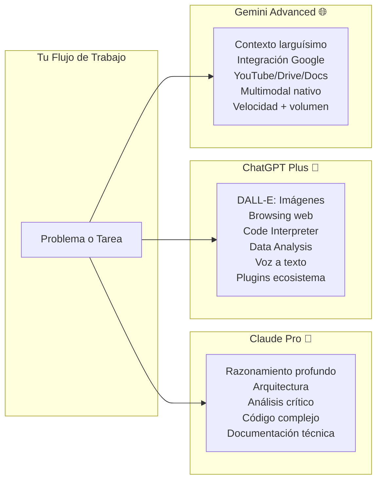

### Principio de Orquestación Inteligente

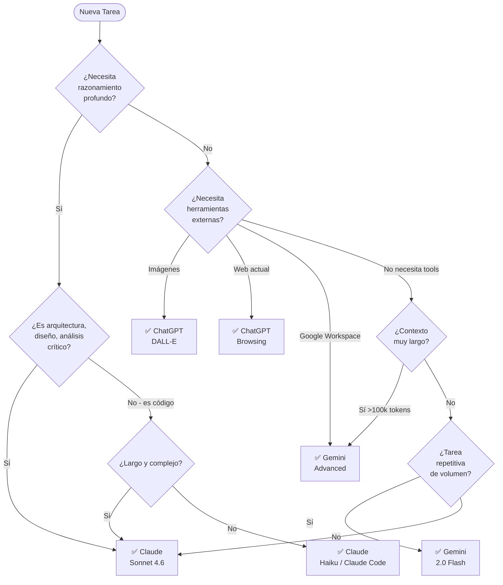

---

## 3. Claude Pro

### 3.1 Cómo Funciona el Sistema de Límites de Claude

Claude mide por **ventanas de tiempo** (aproximadamente 5 horas), no por día calendario. Cuando llegas al límite, el sistema te informa cuánto tiempo debes esperar hasta que se resetee tu cuota.

**Lo que debes saber:**
- El límite es por **uso acumulado de tokens** en esa ventana, no por número de mensajes
- Una conversación larga de 50 mensajes puede consumir tanto como 200 mensajes cortos
- Cambiar entre modelos (Sonnet vs Haiku) **comparte el mismo límite de la cuenta**
- Las respuestas largas (código extenso, documentos) consumen mucho más que Q&A rápidas

### 3.2 La Jerarquía de Modelos en Claude Pro

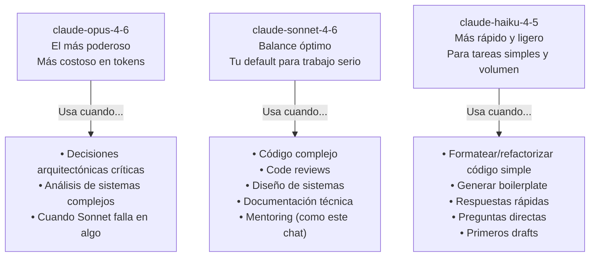

### 3.3 Sistema de Proyectos de Claude — Tu Mejor Herramienta

Los **Proyectos** en Claude son la característica más subutilizada y más poderosa de Claude Pro. Un Proyecto te permite:

- **Instrucciones de sistema persistentes** que se aplican a cada conversación dentro del proyecto
- **Archivos de conocimiento** que el modelo lee en cada sesión (documentación, arquitecturas, contexto de empresa)
- **Separación de contextos** por dominio de trabajo
- **Historial separado** por proyecto, sin contaminación entre temas

#### Estructura de Proyectos Recomendada para un Senior/Staff Engineer

```
📁 Proyectos Claude Pro
│
├── 🏗️ System Design & Architecture
│   ├── System Prompt: "Eres un Staff Engineer con 20 años..."
│   ├── 📄 company-architecture.md (tu arquitectura actual)
│   ├── 📄 tech-stack.md (stack actual)
│   └── 📄 design-principles.md (tus principios)
│
├── 💻 .NET / C# Development  
│   ├── System Prompt: "Experto en .NET 8, ASP.NET Core..."
│   ├── 📄 coding-standards.md
│   ├── 📄 project-structure.md
│   └── 📄 common-patterns.md
│
├── ☁️ Azure & Cloud
│   ├── System Prompt: "Arquitecto Azure certificado..."
│   ├── 📄 azure-resources.md
│   └── 📄 cost-constraints.md
│
├── 🎤 Interview Prep (Staff Level)
│   ├── System Prompt: [El que ya tienes configurado]
│   ├── 📄 my-experience.md
│   └── 📄 target-companies.md
│
└── 📝 Documentation & Writing
    ├── System Prompt: "Technical writer senior..."
    └── 📄 doc-standards.md
```

#### Cómo Escribir un System Prompt Efectivo para un Proyecto

Un mal system prompt (genérico, corto) desperdicia la oportunidad. Aquí el patrón correcto:

```markdown
# System Prompt para Proyecto: .NET Architecture

## Tu Rol
Actúas como Staff Engineer con 15+ años en .NET y Azure. 
Tu trabajo es elevar la calidad técnica de mis decisiones, no solo responder.

## Mi Contexto
- Trabajo con .NET 8, ASP.NET Core, EF Core
- Infraestructura en Azure (AKS, Service Bus, SQL Azure)
- Equipo de 8 devs, yo soy el lead técnico
- Objetivo: pasar a rol Staff/Arquitecto en 12 meses

## Stack Actual
[Pega aquí tu stack real]

## Cómo Debes Responder
1. Siempre incluye: por qué, trade-offs, cuándo NO usar
2. Conecta con patrones del ecosistema .NET
3. Si detecto algo malo en mi código/decisión, dímelo directamente
4. Usa ejemplos de producción real, no hello-world

## Lo Que NO Quiero
- Respuestas genéricas de documentación
- "Depende" sin justificar
- Exceso de teoría sin aplicación práctica
```

### 3.4 Estrategias para Extender tus Límites en Claude

**Técnica 1: La Conversación Quirúrgica**

En lugar de una conversación larga y exploratoria, prepara tu pregunta completamente antes de enviarla.

```
❌ MALO (3-4 mensajes de ida y vuelta):
"Oye, quiero diseñar un sistema..."
"Mmm, ¿qué pasa si necesito..."  
"¿Y cómo manejarías el..."
"Ah ok, pero entonces..."

✅ BUENO (1 mensaje bien estructurado):
"Necesito diseñar un sistema de notificaciones para [contexto específico].
Restricciones: [lista]. 
Dudas específicas: 1) ... 2) ... 3) ...
Quiero que cubras: arquitectura, trade-offs principales, y los 3 errores más comunes."
```

**Técnica 2: El Prompt de Cierre de Sesión**

Al final de una sesión productiva, pide un resumen comprimido que puedas pegar al inicio de la siguiente conversación:

```
"Antes de cerrar esta sesión, genera un resumen de contexto de máximo 500 palabras 
que capture: las decisiones tomadas, el stack definido, los principios acordados, 
y las preguntas pendientes. Lo usaré para continuar en una nueva conversación."
```

**Técnica 3: Conversaciones Nuevas por Subtema**

No alargues conversaciones. Una conversación por tema/feature/decisión. El contexto crece exponencialmente y cada mensaje en una conversación de 50+ intercambios consume mucho más que en una conversación fresca.

**Técnica 4: Archivos en Proyectos en Lugar de Contexto en Chat**

Si tienes una arquitectura de 500 líneas que necesitas referenciar frecuentemente, **súbela como archivo al Proyecto**, no la pegues en cada conversación. El Proyecto lo lee automáticamente sin consumir tu contexto de conversación.

**Técnica 5: Haiku para el Trabajo Pesado Repetitivo**

Cambia al modelo Haiku cuando hagas:
- Generar 20 nombres de variables
- Formatear JSON/XML
- Escribir unit tests de métodos simples
- Crear scripts de migración repetitivos
- Generar mocks y fixtures de prueba

Guarda Sonnet para decisiones arquitectónicas y código complejo.

### 3.5 Artifacts — La Feature Que Más Valor Agrega

Los Artifacts de Claude son ventanas interactivas separadas del chat. Son especialmente útiles para:

- **Código:** Puedes iterarlo directamente sin reescribir el bloque completo
- **Documentos:** Edición in-place, mucho más eficiente que el chat
- **Diagramas Mermaid:** Se renderizan visualmente
- **HTML/React:** Prototipos interactivos

**Consejo:** Cuando pidas código, pide explícitamente que lo ponga en un Artifact. Así puedes hacer ediciones quirúrgicas ("cambia solo la función X") en lugar de re-generar todo.

---

## 4. ChatGPT Plus

### 4.1 El Ecosistema de Modelos GPT

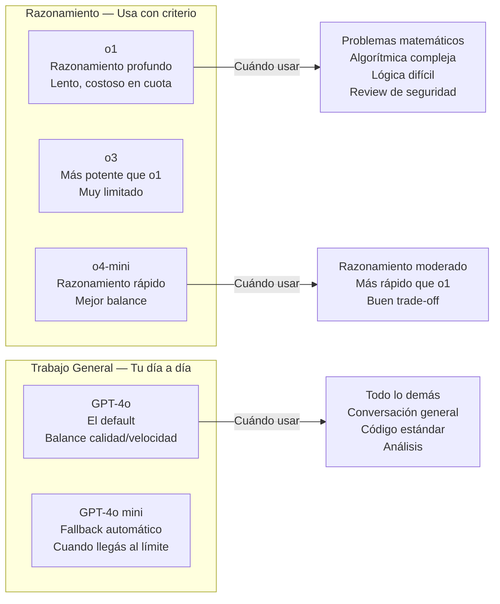

### 4.2 Lo Que Hace ChatGPT Plus que los Otros No Hacen Igual

**DALL-E 3 — Generación de Imágenes**

Esta es la razón #1 para mantener ChatGPT Plus si necesitas imágenes. Gemini tiene Imagen 3, pero la integración en chat de DALL-E es más madura. Casos de uso reales:

- Diagramas de arquitectura cuando Mermaid no alcanza la complejidad visual
- Mockups de UI para presentaciones técnicas
- Infografías para documentación técnica
- Ilustraciones para presentaciones de arquitectura a stakeholders

**Code Interpreter (Advanced Data Analysis)**

ChatGPT puede **ejecutar Python real** en un sandbox. Esto es poderoso para:

```
→ Análisis de logs de producción (sube el CSV, pide el análisis)
→ Visualización de datos de performance
→ Procesamiento de dumps de base de datos
→ Generación de gráficas de métricas
→ Análisis estadístico de bugs/incidents
→ Parsing de archivos de configuración complejos
```

**Memory — Contexto Persistente Entre Sesiones**

ChatGPT Plus tiene memoria real entre conversaciones. A diferencia de Claude (que usa Proyectos) o Gemini, GPT puede recordar tu nombre, tu stack, tus preferencias sin que lo tengas en el system prompt. 

Configura activamente tu memoria:
```
"Recuerda que: soy Senior .NET Engineer en [empresa], 
trabajo con [stack], mi objetivo es [X], 
prefiero respuestas que incluyan trade-offs y ejemplos de producción real."
```

**Browsing Web en Tiempo Real**

Claude tiene búsqueda web, pero la implementación de ChatGPT es más madura para:
- Investigar librerías NuGet con versiones actuales
- Verificar breaking changes en ASP.NET Core
- Comparar precios/características de servicios Azure actuales
- Leer documentación actualizada de Azure SDK

### 4.3 Estrategia de Modelos en ChatGPT Plus

| Tarea | Modelo Recomendado | Por Qué |
|-------|------------------|---------|
| Diseño de algoritmo complejo | o1 o o4-mini | Razonamiento paso a paso |
| Código .NET estándar | GPT-4o | Balance óptimo |
| Análisis de datos/logs | GPT-4o + Code Interpreter | Ejecución real de Python |
| Generar imágenes/diagramas | GPT-4o con DALL-E | Única opción nativa |
| Investigación web actual | GPT-4o con Browsing | Más maduro |
| Tareas simples y rápidas | GPT-4o mini | Ahorra cuota para lo importante |
| Debugging difícil | o4-mini | Razonamiento sin el costo de o1 |

### 4.4 GPTs Personalizados — Tu Segundo Cerebro

Los GPTs (Custom GPTs) son chatbots configurados que puedes crear y reutilizar. Son equivalentes a los Proyectos de Claude pero con más capacidades de herramientas.

**GPTs que un Senior/Staff Engineer debería tener configurados:**

1. **Architecture Reviewer GPT**
   - System prompt: Staff engineer que revisa arquitecturas con framework específico (C4 model, etc.)
   - Conocimiento: Tus patrones de empresa, principios de diseño
   - Acciones: Búsqueda web para patrones actuales

2. **.NET Code Reviewer GPT**
   - System prompt: Experto .NET que revisa con tus estándares específicos
   - Conocimiento: Tus coding standards como archivo PDF o TXT
   - Sin web: Para mantenerlo enfocado

3. **Interview Prep GPT**
   - Similar a tu Proyecto en Claude pero con la persistencia de memoria de GPT

### 4.5 Estrategias para Extender Límites en ChatGPT Plus

**Técnica 1: Mantener GPT-4o mini en Reserva**

Cuando el sistema automáticamente baja a GPT-4o mini porque agotaste GPT-4o, no lo cierres — usa esa sesión para todas las tareas simples del día: formatear, revisar sintaxis, preguntas rápidas. Guarda GPT-4o para mañana cuando se resetee.

**Técnica 2: Code Interpreter para Trabajo Batch**

En lugar de hacer 10 preguntas sobre un archivo de logs, súbelo una vez y haz todas las preguntas en una sola sesión de Code Interpreter. Un archivo cargado persiste en la sesión.

**Técnica 3: Memory como Ahorro de Contexto**

Con memoria activa, no necesitas re-explicar tu stack en cada conversación. Eso son potencialmente 200-500 tokens ahorrados por sesión × N sesiones al día.

**Técnica 4: Los Modelos de Razonamiento Son Para Problemas Concretos**

o1/o3/o4-mini son tentadores pero tienen cuota muy limitada. Regla: úsalos **solo** cuando GPT-4o falla o da una respuesta que intuyes incorrecta. Para el 80% de trabajo diario, GPT-4o es suficiente.

---

## 5. Gemini Advanced

### 5.1 La Ventaja Real de Gemini: Contexto Masivo + Google

Gemini 2.5 Pro tiene una ventana de contexto de **1 millón de tokens** (y en algunos casos hasta 2M). Eso es un libro entero, o una codebase completa de tamaño mediano. Esto cambia completamente los casos de uso.

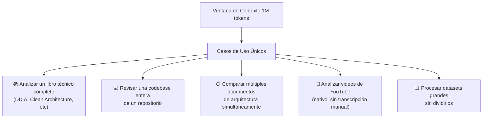

### 5.2 La Suite Google — Tu Diferenciador

Si ya usas Google Workspace (Gmail, Drive, Docs, Sheets, Calendar), Gemini Advanced se integra nativamente:

**En Gmail:**
- Resumir hilos de email complejos de cliente
- Redactar respuestas técnicas en tu tono
- Extraer action items de conversaciones largas

**En Google Docs/Drive:**
- "Analiza todos los documentos de arquitectura en esta carpeta y dame un resumen"
- Editar documentación técnica con contexto del documento real
- Generar PRDs, ADRs, RFCs basados en tus plantillas existentes

**En Google Sheets:**
- Análisis de datos de producción (métricas, KPIs)
- Automatización con fórmulas complejas
- Interpretación de datos de monitoreo exportados

**NotebookLM (Incluido en Advanced):**
Esta es una herramienta separada pero incluida en tu suscripción. Es para **crear notebooks de conocimiento** donde subes múltiples fuentes (PDFs, URLs, Docs) y puedes interrogarlas juntas. Casos de uso:

```
→ Subir toda la documentación de Azure Service Bus y hacer Q&A específico
→ Subir los RFCs/ADRs de tu empresa y preguntarle sobre decisiones
→ Subir libros técnicos y hacer consultas rápidas
→ Crear un "asistente de onboarding" con toda tu documentación de equipo
```

### 5.3 Jerarquía de Modelos Gemini

| Modelo | Velocidad | Capacidad | Cuándo Usarlo |
|--------|----------|-----------|--------------|
| Gemini 2.5 Pro | Media | Máxima | Análisis complejos, contexto largo, reasoning |
| Gemini 2.5 Flash | Rápida | Alta | Tu caballo de batalla diario |
| Gemini 2.0 Flash | Muy rápida | Buena | Volumen alto, tareas simples |
| Gemini 2.0 Flash Thinking | Media | Alta | Problemas que requieren razonamiento visible |

### 5.4 Estrategias para Extender Límites en Gemini

**Técnica 1: Gemini Como el Modelo de Volumen**

Gemini actualmente tiene límites más generosos que Claude y ChatGPT para la mayoría de usuarios. Úsalo para el trabajo de alto volumen: generar variaciones, explorar opciones, primeros borradores.

**Técnica 2: Aprovechar el Contexto Largo Para Trabajo en Batch**

En lugar de hacer múltiples conversaciones sobre un documento grande, carga todo el documento una vez y extrae toda la información que necesitas en esa sesión. El contexto de 1M tokens es tu ventaja.

**Técnica 3: Flash Para Iteraciones, Pro Para Análisis Final**

Usa Gemini Flash para exploración rápida e iteraciones. Cuando tengas algo que validar en profundidad, cambia a Pro para el análisis final.

---

## 6. Herramientas de Código

### 6.1 Claude Code

Claude Code es la interfaz de línea de comandos (CLI) de Claude para trabajo de código agentico. Está incluida en tu suscripción Pro y es **fundamentalmente diferente** al chat.

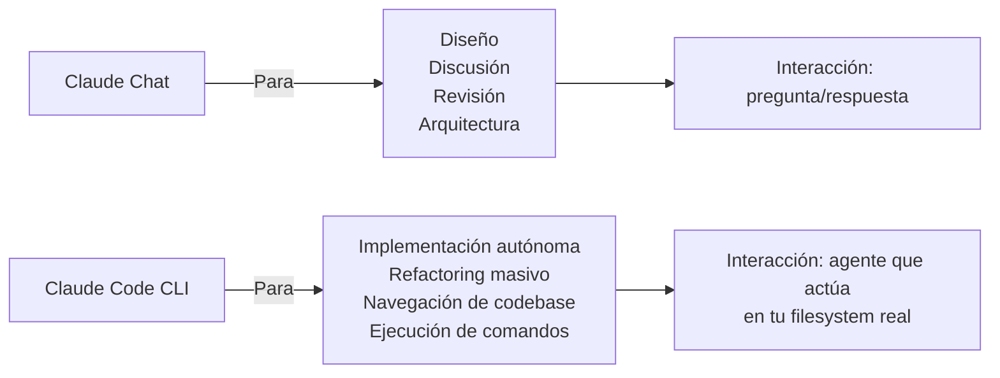

#### Cómo Instalar Claude Code

```bash
# Requiere Node.js 18+
npm install -g @anthropic-ai/claude-code

# Iniciar en tu proyecto
cd tu-proyecto
claude
```

#### Comandos Esenciales de Claude Code

```bash
# Iniciar sesión en un directorio de proyecto
claude

# Dar una tarea específica directamente
claude "Refactoriza el servicio UserService para usar el patrón Repository"

# Modo no interactivo (para scripts)
claude --print "¿Qué hace esta función?" < archivo.cs

# Ver el plan antes de ejecutar
claude --plan "Agrega validación a todos los endpoints"

# Limitar qué archivos puede tocar
claude --include "src/**/*.cs" "Actualiza el manejo de errores"
```

#### Flujo de Trabajo con Claude Code para .NET

```bash
# Scenario: Necesitas agregar un nuevo feature completo

# 1. Primero, contexto de arquitectura en Claude Chat
# (Diseña el approach, decide patterns)

# 2. Luego, implementación en Claude Code
cd tu-proyecto-dotnet
claude "Implementa el servicio OrderNotificationService que:
- Siga el patrón Repository existente en src/Services
- Use el EventBus que está en Infrastructure/Messaging
- Incluya unit tests en el proyecto de tests
- Siga los naming conventions del proyecto"

# Claude Code leerá tu codebase, entenderá los patrones,
# y generará código consistente con lo existente
```

#### Gestión de Contexto y Costos en Claude Code

Claude Code usa los mismos modelos de Claude (y por lo tanto los mismos límites). Para optimizarlo:

```bash
# El archivo CLAUDE.md en tu proyecto es como el System Prompt
# Claude Code lo lee automáticamente al iniciar
# Crea uno en la raíz de tu proyecto:

# CLAUDE.md
## Project Context
- Framework: ASP.NET Core 8
- ORM: EF Core con patrón Repository
- Testing: xUnit + Moq
- Naming: PascalCase para clases, camelCase para métodos privados

## Architecture Patterns
- Clean Architecture con capas: API, Application, Domain, Infrastructure
- CQRS con MediatR
- Result<T> pattern para errores (no exceptions como control flow)

## What NOT to do
- No usar excepciones para control de flujo
- No usar static classes
- No bypass de Repository para queries directas con EF
```

### 6.2 ChatGPT Codex (OpenAI Codex / o1 para código)

Con ChatGPT Plus tienes acceso a capacidades de código mejoradas, particularmente:

**Canvas Mode** — Interface especial para código donde puedes:
- Ver y editar el código en un panel separado
- Pedir modificaciones específicas a funciones individuales
- Hacer "inline edits" señalando partes del código
- Exportar directamente

**Code Interpreter** — Para análisis de código existente:
```
→ Sube tu archivo .cs o proyecto completo como ZIP
→ Pide: "Analiza este código y encuentra posibles memory leaks"
→ Pide: "¿Qué tan complejo es este método? Dame métricas"
→ Pide: "Genera el diagrama de dependencias de este proyecto"
```

### 6.3 Gemini en Android Studio / IDEs

Gemini Code Assist está integrado en:
- **Android Studio** (nativo)
- **VS Code** (extensión)
- **JetBrains IDEs como Rider** (extensión)

Para .NET con Rider:

```
1. Instala la extensión "Gemini Code Assist" en Rider
2. Autentícate con tu cuenta Google (la misma de tu suscripción)
3. Úsalo para:
   → Completado de código en línea (como Copilot)
   → Chat contextual con tu archivo abierto
   → Generación de tests
   → Documentación inline
```

**La ventaja sobre GitHub Copilot:** Con tu suscripción de $20 ya lo tienes incluido. No necesitas Copilot adicional.

---

## 7. Estrategia de Modelos: Ligeros vs Pesados

### El Framework de Decisión de Modelos

Esta es la tabla más importante de esta guía. La diferencia entre un usuario que agota sus límites en 2 días y uno que los hace durar todo el mes está aquí:

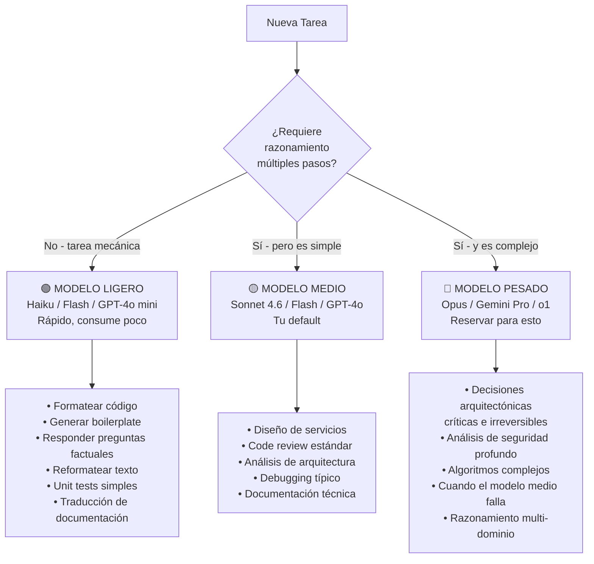

### Matriz de Selección de Modelo por Tarea

| Categoría de Tarea | Claude | ChatGPT | Gemini |
|-------------------|--------|---------|--------|
| **Diseño de sistema nuevo** | Sonnet 4.6 ✅ | o4-mini | 2.5 Pro |
| **Code review profundo** | Sonnet 4.6 ✅ | GPT-4o | 2.5 Flash |
| **Generar CRUD/boilerplate** | Haiku ✅ | GPT-4o mini | Flash |
| **Debugging difícil** | Sonnet 4.6 | o4-mini ✅ | 2.5 Pro |
| **Análisis de logs grandes** | — | Code Interpreter ✅ | 2.5 Pro |
| **Generar imágenes/diagramas** | — | DALL-E ✅ | Imagen 3 |
| **Documentación técnica** | Sonnet 4.6 ✅ | GPT-4o | 2.5 Flash |
| **Investigación web actual** | Claude Search | GPT-4o Browse ✅ | 2.5 Pro |
| **Analizar codebase completa** | — | — | 2.5 Pro ✅ |
| **Integración Google Workspace** | — | — | Advanced ✅ |
| **Interview prep** | Sonnet 4.6 ✅ | GPT-4o | — |
| **Mentoring técnico profundo** | Sonnet 4.6 ✅ | o1 | — |
| **Tareas exploratorias rápidas** | Haiku | GPT-4o mini | Flash ✅ |
| **Refactoring autónomo** | Claude Code ✅ | Canvas | Code Assist |

### Cuándo Escalar al Modelo Más Pesado

Regla práctica: **Intenta siempre con el modelo medio primero.** Solo escala al modelo más pesado cuando:

1. La respuesta del modelo medio es claramente incorrecta o incompleta
2. El problema es genuinamente de múltiples dominios complejos simultáneos
3. Es una decisión de arquitectura que afectará a cientos de miles de líneas de código
4. Necesitas garantía máxima de calidad (code para producción crítica, decisiones irreversibles)

---

## 8. Flujos de Trabajo por Caso de Uso

### Flujo 1: Diseño de un Sistema Nuevo (System Design)

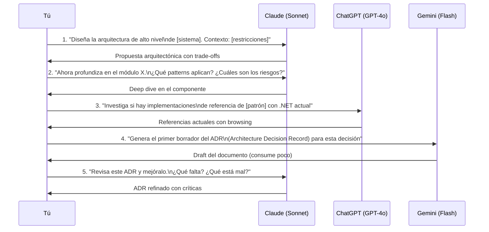

### Flujo 2: Debugging de un Problema Difícil en Producción

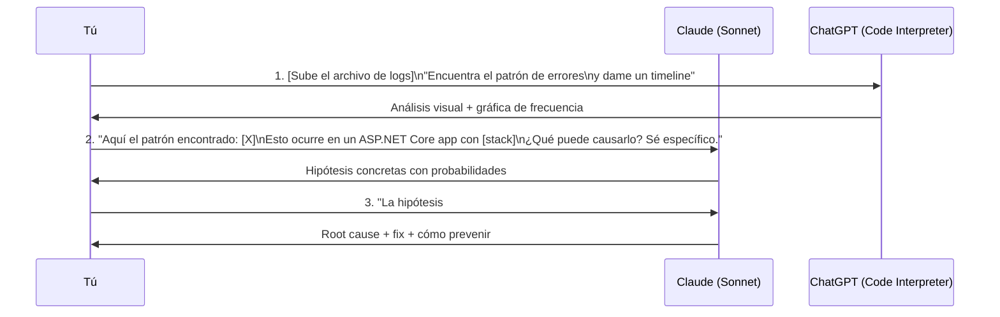

### Flujo 3: Code Review Profundo

```
NUNCA pegues código en el chat sin un prompt de calidad.

❌ MALO:
"Revisa este código"
[pega 200 líneas]

✅ BUENO:
"Actúa como un Staff Engineer haciendo code review senior.
Revisa este código con foco en:
1. Correctness: ¿hay bugs o comportamientos inesperados?
2. Performance: ¿hay N+1 queries, memory leaks, o blocking calls?
3. Seguridad: ¿hay vulnerabilidades de seguridad?
4. Mantenibilidad: ¿viola SOLID? ¿hay code smells?
5. .NET idioms: ¿usa correctamente async/await, IDisposable, cancellation tokens?

Para cada issue: describe el problema, impacto en producción, y la solución.
No menciones cosas que están bien, solo lo que debe mejorar.

[código aquí]"
```

### Flujo 4: Preparación de Entrevista Técnica (Tu Caso de Uso)

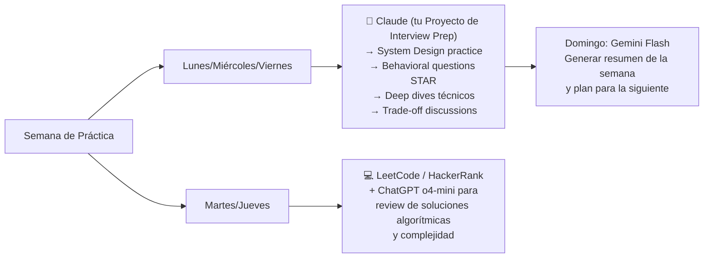

**Prompt de Sesión de Entrevista con Claude:**

```markdown
MODO: Entrevista técnica Staff Engineer nivel FAANG

Voy a responder preguntas como si estuviera en entrevista real.
Tu trabajo es:
1. Hacer la pregunta
2. Esperar mi respuesta completa
3. Evaluarme con criterio de entrevistador senior:
   - ¿Qué nivel demostré? (Junior/Mid/Senior/Staff)
   - ¿Qué faltó específicamente?
   - ¿Cómo habría respondido alguien que pasa la entrevista?
4. Luego hacer la siguiente pregunta

Área: System Design para sistemas distribuidos con .NET y Azure
Empresa objetivo: [nombre si tienes]

Empieza con una pregunta de warm-up de diseño.
```

### Flujo 5: Generación de Documentación Técnica

```
1. Claude Code → Analiza el código existente y extrae la lógica
2. Claude Chat → Estructura la documentación (ADR, RFC, runbook)  
3. Gemini → Genera el borrador completo del documento
4. Claude Chat → Revisión crítica y refinamiento
5. ChatGPT → Si necesitas imágenes/diagramas visuales para el documento
```

---

## 9. Gestión de Contexto y Proyectos

### El Problema del Contexto Infinito

Un error muy común: mantener una sola conversación por semanas, acumulando contexto. El resultado:

- **Cada mensaje nuevo procesa TODO el historial anterior**
- El modelo comienza a "perder el hilo" en conversaciones muy largas (contexto pollution)
- El costo en tokens se vuelve enorme, agotando límites más rápido
- La calidad de las respuestas degradada en conversaciones de +100 intercambios

### La Regla de las Conversaciones Temporales vs Permanentes

```
CONVERSACIÓN TEMPORAL (Cierra cuando termines):
→ Debugging de un bug específico
→ Revisar un PR
→ Generar código para un ticket
→ Responder una duda puntual

CONVERSACIÓN/PROYECTO PERMANENTE (Mantén y cuida):
→ Tu guía de entrevistas (este caso)
→ Tu proyecto de arquitectura de empresa
→ Tu stack de conocimiento de .NET
→ Tu mentor técnico
```

### Sistema de Gestión de Conocimiento Personal

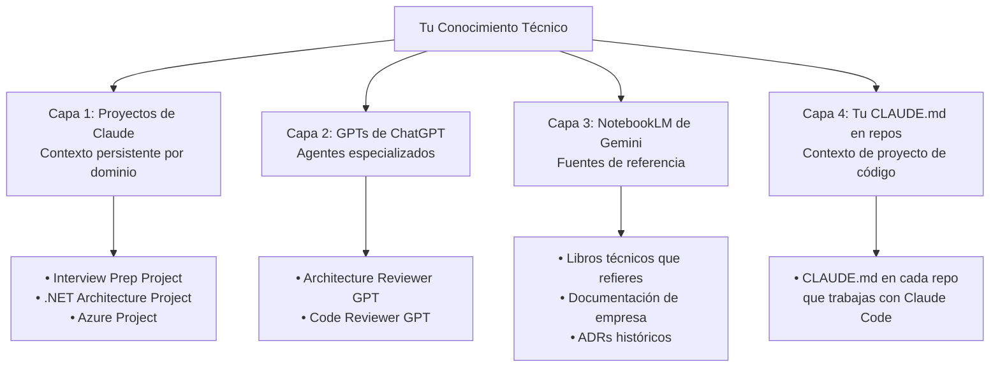

### Cómo Estructurar tu Archivo CLAUDE.md para Máximo Rendimiento

```markdown
# [Nombre del Proyecto]

## Stack Técnico
- Runtime: .NET 8
- Framework: ASP.NET Core 8 Minimal APIs
- ORM: EF Core 8 con patrón Repository
- Messaging: Azure Service Bus
- Cache: Redis via StackExchange.Redis
- Auth: Microsoft.Identity.Web

## Architecture Principles
- Clean Architecture: API → Application → Domain → Infrastructure
- CQRS con MediatR
- No excepciones como control de flujo → usar Result<T>
- Repositorios genéricos están en Infrastructure/Repositories
- Validators con FluentValidation

## Code Conventions
- Clases: PascalCase
- Métodos privados: _camelCase
- Async siempre termina en Async
- Nunca usar .Result o .Wait() en async code
- ConfigureAwait(false) en infrastructure layer

## Testing
- Framework: xUnit
- Mocking: Moq + AutoFixture
- Tests de integración: WebApplicationFactory
- Naming: MetodoQueTestea_Escenario_ResultadoEsperado

## What to Avoid
- No static classes o métodos static con estado
- No acceso directo al DbContext fuera de Repository
- No HttpClient directo → usar IHttpClientFactory
- No hardcodear connection strings → siempre IConfiguration

## Current Context
[Actualiza esto cuando trabajes en Claude Code]
- Feature activa: [nombre]
- Branch: [nombre]
- Decisiones recientes: [lista]
```

---

## 10. Plantillas de Prompts

### Prompt Template: Mentor Técnico (Para Sesiones de Aprendizaje)

```markdown
Actúa como Staff Engineer con 20+ años de experiencia en [dominio].
Tu objetivo es elevar mi comprensión, no solo responder.

Tema a explorar: [TEMA]

Quiero que cubras en este orden:
1. **Intuición** — Explícame el concepto como si fuera una analogía del mundo real
2. **Profundidad** — Los internals: qué pasa realmente debajo del capó
3. **Ejemplo práctico** — Muéstrame código real, no hello-world. Contexto: .NET/C#
4. **Trade-offs** — Cuándo esto es bueno, cuándo es malo
5. **Errores comunes** — Los 3 errores que cometen los mid-seniors con esto
6. **Conexión** — ¿Cómo conecta esto con [concepto relacionado]?

Después de tu respuesta, dame 2 preguntas de seguimiento que debería hacerme 
para profundizar este tema.
```

### Prompt Template: System Design Interview

```markdown
Simula una pregunta de System Design de entrevista Staff Engineer nivel.

Contexto del sistema a diseñar: [DESCRIPCIÓN]
Escala: [usuarios/requests por segundo/datos]
Restricciones: [restricciones técnicas o de negocio]

Dame la pregunta completa como haría un entrevistador de [empresa target].
No me des la respuesta. Espera mi solución.

Criterios de evaluación cuando respondas:
- Clarificación de requisitos (hizo las preguntas correctas?)
- Diseño de alto nivel (coherencia y completitud)
- Deep dives (profundidad en componentes críticos)
- Trade-offs explicados (no solo eligió, justificó)
- Escalabilidad y failure modes (pensó en producción real)
- .NET/Azure specifics (los usó apropiadamente?)

Nivel esperado: Staff Engineer
```

### Prompt Template: Code Review

```markdown
Código a revisar:
```csharp
[código aquí]
```

Contexto: [describe qué hace, de dónde viene, qué restricciones tiene]

Revísalo como Staff Engineer exigente. Dame:

**🐛 Bugs / Correctness Issues**
- [lista con severidad: CRITICAL/HIGH/MEDIUM/LOW]

**⚡ Performance**
- [lista con impacto estimado]

**🔒 Security**
- [lista con OWASP reference si aplica]

**🏗️ Design / Architecture**
- [violations de SOLID, code smells, mejor abstracción]

**🎯 .NET Specifics**
- [uso incorrecto de async, disposal, cancellation, etc]

Para cada issue: problema específico → impacto → solución sugerida con código.
```

### Prompt Template: Debugging de Producción

```markdown
Tengo un problema en producción. Necesito root cause analysis, no suposiciones.

**Síntomas:**
[describe exactamente qué observas: errores, comportamiento, logs]

**Contexto del sistema:**
- Stack: .NET 8, [servicios relevantes]
- Dónde ocurre: [endpoint, servicio, componente]
- Frecuencia: [siempre / intermitente / bajo carga]
- Cuándo empezó: [con qué deploy, cambio, o evento]

**Evidencia disponible:**
[logs, stack traces, métricas — pega aquí]

**Lo que ya descartamos:**
[qué ya revisaste y por qué lo descartaste]

Quiero que:
1. Listes las hipótesis por probabilidad (con justificación)
2. Para la más probable: el mecanismo exacto de fallo
3. Cómo confirmar el root cause
4. El fix
5. Cómo prevenir que vuelva a pasar
```

### Prompt Template: Generación de Código Complejo

```markdown
Necesito implementar: [descripción detallada]

**Contexto del proyecto:**
- Framework: ASP.NET Core 8
- Patrones en uso: [repository, CQRS, etc]
- Convenciones: [naming, estructura]

**Requerimientos específicos:**
- [requisito 1]
- [requisito 2]

**Restricciones:**
- [restricciones de performance, compatibilidad, etc]

**Qué NO quiero:**
- [lista de cosas que no quieres en la implementación]

Antes de generar el código:
1. Explica el approach que vas a tomar
2. Lista las decisiones de diseño no obvias
3. Menciona los trade-offs de este approach vs alternativas

Luego genera el código completo, funcional, con:
- Manejo de errores robusto
- Logging apropiado
- Unit tests en un bloque separado
- Comentarios solo donde el por qué no es obvio
```

---

## 11. Sistema Personal de Organización

### El Dashboard de IA — Tu Vista Operativa

Crea un documento simple (Notion, Obsidian, o incluso un TXT) que sea tu "panel de control" de uso de IA:

```markdown
# AI Dashboard — [Mes/Año]

## Estado de Suscripciones
- Claude Pro: ✅ Activo | Límite próximo reset: [hora]
- ChatGPT Plus: ✅ Activo | GPT-4o: [N msgs restantes estimados]
- Gemini Advanced: ✅ Activo | Sin límites críticos

## Proyectos Activos por Plataforma

### Claude Proyectos
- [Interview Prep] — última sesión: [fecha] — próximo uso: [tema]
- [.NET Architecture] — contexto actual: [feature]
- [Azure] — último tema: [X]

### ChatGPT GPTs
- [Architecture Reviewer] — [última sesión]
- [Code Reviewer] — [última sesión]

### Gemini Notebooks (NotebookLM)
- [Docs de empresa] — [última actualización]
- [Libros técnicos] — [fuentes cargadas]

## Decisiones Técnicas Tomadas Esta Semana
1. [Decisión] — Herramienta usada: [X] — Resumen: [Y]
2. ...

## Preguntas Pendientes para Próximas Sesiones
- [ ] Claude: Profundizar en [tema]
- [ ] ChatGPT: Analizar [archivo]
- [ ] Gemini: Revisar [documento]
```

### Cuándo Usar Cada Plataforma — Guía Rápida de Decisión

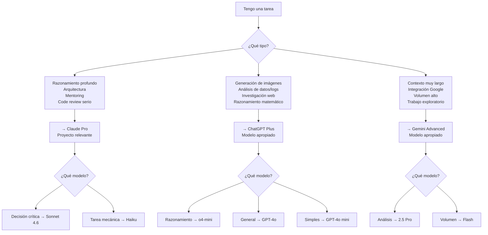

---

## 12. Flujo Diario Recomendado

### Routine Matutina (15 minutos)

```
1. Revisa tu AI Dashboard (2 min)
   → ¿Algún límite próximo a resetear?
   → ¿Qué dejaste pendiente ayer?

2. Define las 3 tareas más importantes del día (3 min)
   → ¿Cuál es la más compleja? → Claude + modelo pesado
   → ¿Cuál puede ser automatizada? → Claude Code o Gemini Flash
   → ¿Cuál necesita datos actuales? → ChatGPT Browsing

3. Prepara tus prompts clave por adelantado (10 min)
   → No entres a la IA "a ver qué pasa"
   → Ten el prompt escrito antes de abrir la plataforma
```

### Durante el Día — Reglas de Uso Eficiente

**Regla 1: Un problema = una conversación nueva**
No sigas usando la misma conversación de ayer para un tema diferente de hoy.

**Regla 2: Draft en Ligero, Final en Pesado**
Primera exploración con Haiku/Flash/GPT-4o mini. 
Refinamiento y validación con Sonnet/2.5 Pro/GPT-4o.

**Regla 3: Batch de Tareas Similares**
Si tienes 5 funciones simples que generar, hazlas todas en la misma conversación con Haiku. No abras 5 conversaciones separadas.

**Regla 4: Guarda el Contexto Valioso**
Al final de una sesión productiva:
```
"Genera un resumen de decisiones y contexto de esta sesión en formato
que pueda usar como punto de partida de la siguiente conversación."
```

**Regla 5: Los Modelos de Razonamiento Son Para el Jueves**
Los modelos más pesados (o1, Opus, 2.5 Pro) tienen cuotas limitadas. Úsalos estratégicamente, no como default. Guárdalos para el trabajo más importante de la semana.

### Uso Semanal Balanceado

```mermaid
gantt
    title Distribución Semanal de Uso de IA
    dateFormat  X
    axisFormat %s

    section Claude Pro
    Interview Prep (Lun/Mié/Vie)     :0, 3
    Architecture/Code Review          :0, 5
    Claude Code para implementación   :0, 5

    section ChatGPT Plus
    Análisis de datos/logs            :0, 2
    Investigación web                 :0, 3
    Generación de imágenes            :0, 1
    Razonamiento difícil (o4-mini)    :0, 2

    section Gemini Advanced
    Trabajo de volumen/drafts         :0, 5
    Google Workspace                  :0, 3
    NotebookLM research               :0, 2
```

### Señales de Alerta — Cuándo Estás Usando Mal la IA

🚨 **Estás desperdiciando límites si:**
- Tienes conversaciones de más de 30 intercambios sobre el mismo tema
- Usas Sonnet/GPT-4o para formatear texto o generar listas simples
- Re-explicas el contexto del proyecto en cada nueva conversación
- Haces preguntas exploratorias vagas sin un objetivo claro
- Generas código, lo descartas, y generas desde cero sin iterar
- Abres Claude para preguntarle algo que ya sabes y podrías verificar en docs

✅ **Estás usando la IA eficientemente si:**
- Cada conversación tiene un objetivo claro y termina cuando lo logras
- Usas proyectos/GPTs para no repetir contexto
- Tienes un CLAUDE.md en tus repos para que Claude Code entienda tu proyecto
- Escalas al modelo pesado solo cuando el ligero genuinamente falla
- Preparas tus prompts antes de abrir la plataforma
- Batcheas tareas similares en una sola conversación

---

## Apéndice: Recursos de Referencia Rápida

### Links Importantes

| Plataforma | Recurso | URL |
|-----------|---------|-----|
| Claude | Docs oficiales | docs.anthropic.com |
| Claude | Claude Code docs | docs.anthropic.com/claude-code |
| ChatGPT | GPT Store | chatgpt.com/gpts |
| ChatGPT | OpenAI Docs | platform.openai.com/docs |
| Gemini | NotebookLM | notebooklm.google.com |
| Gemini | Gemini Code Assist | developers.google.com/gemini |

### Atajos de Teclado Útiles

| Plataforma | Acción | Atajo |
|-----------|--------|-------|
| Claude | Nueva conversación | Ctrl/Cmd + N |
| Claude | Cambiar proyecto | Click en proyecto en sidebar |
| ChatGPT | Nueva conversación | Ctrl/Cmd + Shift + N |
| ChatGPT | Cambiar modelo | Dropdown en la parte superior |
| Gemini | Nueva conversación | Click en "+" |

---

*Guía generada como documento vivo — actualiza la sección "Estado de Suscripciones" y el contexto de proyectos regularmente para mantener su utilidad.*

*Versión: 1.0 | Audiencia: Senior → Staff/Arquitecto Engineer | Stack: .NET + Azure*
