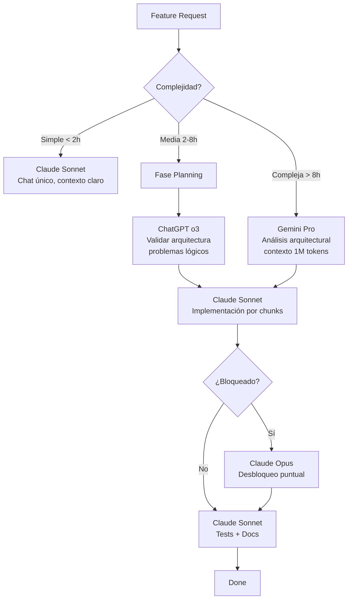
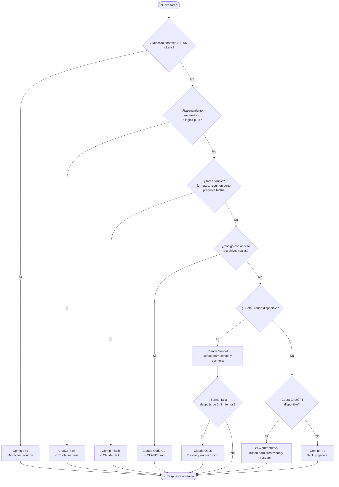
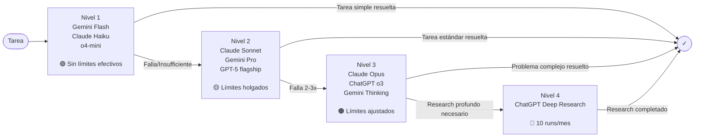

# Guía Completa de Optimización Multi-IA 2026
## ChatGPT Plus · Claude Pro · Gemini AI Pro

> **Nivel:** Senior / Staff Engineer  
> **Actualizada:** Abril 2026  
> **Fuentes:** Documentación oficial Anthropic, OpenAI, Google + investigación de comunidad

---

## Índice

1. [Fundamentos de Consumo de IA](#1-fundamentos)
2. [Manejo de Contexto — Sección Crítica](#2-contexto)
3. [Estrategias por Plataforma](#3-plataformas)
4. [Estrategia Global Multi-IA](#4-multi-ia)
5. [Flujos de Trabajo Reales](#5-workflows)
6. [Optimización de Prompts — Nivel Avanzado](#6-prompts)
7. [CLI y Agentes](#7-cli)
8. [Archivos de Contexto Persistente](#8-archivos-contexto)
9. [Estrategias de Ahorro de Cuota](#9-ahorro)
10. [Anti-patrones — Qué Nunca Hacer](#10-antipatrones)
11. [Sistema Personal de Uso — Blueprint](#11-blueprint)
12. [Diagramas de Decisión](#12-diagramas)

---

## 1. Fundamentos de Consumo de IA {#1-fundamentos}

### 1.1 Límites reales en 2026 (datos verificados)

Antes de optimizar necesitas entender exactamente contra qué estás jugando.

#### Claude Pro ($20/mes)

| Dimensión | Valor real |
|---|---|
| Ventana de reset | **5 horas rolling** (no medianoche) |
| Mensajes cortos / ventana | ~45 mensajes |
| Mensajes largos / ventana | 20–30 (depende del contexto acumulado) |
| Límite semanal | Existe desde agosto 2025; afecta al top 5% de usuarios |
| Contexto máximo | 200K tokens (Enterprise: 500K) |
| Todas las superficies cuentan | Claude.ai + Claude Code + Claude Desktop = **mismo bucket** |
| Modelo más caro | Opus consume **3–5× más cuota** que Sonnet |

> **Clave mental:** Los 45 mensajes son con *conversaciones cortas*. Un chat largo de código puede contar como 3–5 "mensajes" en términos de cuota. Cada mensaje re-procesa **todo el historial** del chat como contexto.

#### ChatGPT Plus ($20/mes)

| Modelo | Límite | Ventana de reset |
|---|---|---|
| GPT-5.x (flagship) | ~80–160 mensajes | Rolling 3 horas |
| o3 (reasoning) | ~100 mensajes | Semanal (domingos UTC) |
| o4-mini | ~300 mensajes/día | Diario |
| Deep Research | ~10 runs/mes | Mensual |

> **Trampa invisible:** ChatGPT hace *silent downgrade* — cuando agotás el flagship, silenciosamente cambia a mini sin advertencia clara. Si tu código se volvió peor de repente, probablemente estás en mini.

#### Gemini AI Pro ($19.99/mes, antes "Gemini Advanced")

| Modelo | Límite AI Pro | Límite AI Ultra |
|---|---|---|
| Gemini 3 Thinking | 300 prompts/día | 1,500/día |
| Gemini 3.1 Pro | 100 prompts/día | 500/día |
| Gemini Flash (Fast) | Sin límite fijo | Sin límite fijo |
| Deep Research | 20/día | 200/día |
| Contexto máximo | **1 millón de tokens** | 1 millón de tokens |

> **Ventaja brutal de Gemini:** La ventana de 1M tokens es real y es el diferenciador más grande. Para análisis de codebases completos o documentos masivos, no hay competencia.

---

### 1.2 Cómo funciona realmente el consumo

Hay tres conceptos que la mayoría confunde:

#### Tokens por request
Lo que se envía al modelo en **una sola llamada**. Incluye:
- Tu mensaje nuevo
- **TODO el historial del chat** (esto es lo que quema)
- Archivos adjuntos
- Instrucciones del sistema/proyecto
- Definiciones de herramientas (en CLI/agentes)

#### Contexto acumulado
El historial que crece mensaje a mensaje. Este es el **villano principal**. En un chat de 20 intercambios, cada nuevo mensaje paga el costo de los 20 anteriores. El costo es cuadrático en términos de cuota consumida.

#### Sesiones vs ventanas
Las sesiones son tus chats. Las ventanas son el tiempo en que se mide tu cuota. **No son lo mismo.** Puedes tener 10 sesiones abiertas, pero todas comparten el mismo bucket de cuota.

```
Costo real de mensaje #N = tokens(mensaje_nuevo) + tokens(historial_1..N-1) + tokens(sistema)
```

### 1.3 El efecto exponencial del contexto largo

Visualización del costo acumulado en un chat típico de código:

```
Mensaje 1:  tokens enviados = 500    (tu prompt inicial)
Mensaje 5:  tokens enviados = 3,200  (prompt + 4 intercambios)
Mensaje 10: tokens enviados = 8,500  (prompt + 9 intercambios)
Mensaje 20: tokens enviados = 22,000 (prompt + 19 intercambios)
Mensaje 30: tokens enviados = 48,000 (prompt + 29 intercambios)
```

En Claude Pro, un chat de 30 mensajes de código equivale a **consumir ~100 mensajes cortos** en términos de cuota. Eso es más de dos ventanas de 5 horas.

### 1.4 Costos ocultos que nadie menciona

**Archivos adjuntos re-enviados:** Si subís un PDF de 50 páginas en el mensaje 1, se re-envía completo en cada mensaje posterior hasta que inicies un chat nuevo.

**Instrucciones de proyecto:** Las instrucciones que configuras en un Proyecto de Claude se inyectan en **cada mensaje** de ese proyecto. Una instrucción de 2,000 palabras bien escrita cuesta 2,000 tokens por mensaje.

**Tool definitions en CLI:** Cuando usás Claude Code con MCP servers, las definiciones de herramientas disponibles se incluyen en cada llamada. Un setup con 10 MCP servers puede agregar 5,000–10,000 tokens de overhead por mensaje.

**Thinking tokens en modelos de razonamiento:** o3 y Gemini Thinking generan tokens internos de razonamiento que **no ves** pero que sí consumen cuota. Un problema complejo puede generar 50,000+ tokens de "pensamiento" interno.

---

## 2. Manejo de Contexto — Sección Crítica {#2-contexto}

Esta sección es la más importante del documento. Dominar el contexto es la diferencia entre quedarte sin cuota a las 2 horas o trabajar todo el día.

### 2.1 El principio fundamental

> **El contexto no es gratis. Cada token en tu ventana de contexto tiene un costo en cuota. Gestionar el contexto es gestionar dinero.**

La mayoría de los usuarios trata los chats como conversaciones humanas — lineales, con todo el historial accesible. Los usuarios avanzados tratan cada chat como una **operación atómica**: propósito claro, contexto mínimo necesario, cierre limpio.

### 2.2 Cuándo continuar un chat vs iniciar uno nuevo

**Continuar el mismo chat cuando:**
- El problema es el mismo y necesitás que el modelo recuerde el estado anterior
- Estás en un ciclo de iteración activo (debugging en curso, documento en edición)
- El contexto acumulado es *directamente relevante* para el siguiente mensaje
- Vas a hacer menos de 10 intercambios adicionales

**Iniciar un chat nuevo cuando:**
- El tema cambió aunque sea levemente
- Completaste un sub-problema y arrancás uno nuevo
- El chat tiene más de 20 intercambios
- El modelo empieza a "olvidar" instrucciones tempranas (señal de contexto saturado)
- Querés cambiar de tarea sin cargar el contexto de la anterior
- Detectás que las respuestas se volvieron más cortas o menos precisas (señal de contexto lleno)

### 2.3 Patrones de gestión de contexto

#### Patrón 1: Chat Efímero
**Para tareas puntuales y atómicas.**

```
Chat → Respuesta → Usar resultado → Cerrar chat → Nunca más
```

Ejemplos: "Convertí este JSON a YAML", "Escribí un regex para validar emails", "Explicame qué hace esta función".

**Regla:** Si podés describir la tarea en una oración y no necesitás iteración, es efímero.

#### Patrón 2: Chat Persistente
**Para proyectos activos con estado complejo.**

```
Chat con contexto base → Iteraciones → Pausa → Continuar mismo chat
```

Ejemplos: Desarrollo de una feature completa, redacción de un documento largo, debugging de un bug complejo.

**Regla de oro:** Un chat persistente tiene UN propósito. "Desarrollar el módulo de autenticación" es un buen chat persistente. "Cosas de programación" es un desastre que quema cuota.

#### Patrón 3: Resumen Progresivo
**Para extender la vida útil de chats largos.**

Cuando un chat ya tiene 15–20 intercambios, antes de continuar:

```
"Resumí en 5–7 puntos concisos:
1. El estado actual del problema/proyecto
2. Decisiones tomadas y por qué
3. Qué está pendiente
4. Contexto técnico clave que necesitamos recordar

Sé brutal con la brevedad. No incluyas el código ya escrito, solo referencias a dónde está."
```

Luego **inicia un chat nuevo** con ese resumen como primer mensaje.

#### Patrón 4: Contexto Base + Iteraciones Cortas
**Para desarrollo con muchas iteraciones pequeñas.**

```
Chat principal: contexto completo del proyecto
→ Sub-chats cortos: "Dado que [2 líneas de contexto], necesito [tarea específica]"
→ Tomar resultado del sub-chat
→ Volver al chat principal solo para integrar
```

#### Patrón 5: Reinicio Controlado
**Cuando el contexto ya está contaminado.**

Señales de que el contexto está contaminado:
- El modelo ignora instrucciones que antes seguía
- Las respuestas incluyen información de contextos anteriores incorrectamente
- El modelo "olvida" el stack tecnológico o convenciones establecidas
- Las respuestas se vuelven más cortas y superficiales

Protocolo de reinicio:

```
1. Pedí al modelo: "Listá los 5 hechos más importantes del estado actual de este proyecto"
2. Copiá ese resumen
3. Abrí chat nuevo con: "Contexto de proyecto [nombre]: [resumen]. Continuamos desde aquí."
4. Verificá que el modelo captó el contexto correctamente antes de continuar
```

### 2.4 Técnicas prácticas de optimización de contexto

#### Técnica A: El Prompt de Contexto Inicial Óptimo

Cuando empezás un chat importante, invertí 2 minutos en estructurar el contexto inicial. Esto ahorra 10 mensajes de "aclaración" después.

```markdown
## Contexto del proyecto
Stack: [tecnologías específicas y versiones]
Objetivo de esta sesión: [una oración clara]
Estado actual: [qué ya existe, qué está roto]

## Restricciones y convenciones
[3–5 reglas que DEBEN respetarse]

## Lo que necesito ahora
[Tarea específica con criterios de éxito claros]
```

#### Técnica B: Transporte de Contexto Entre Chats

Para portar contexto de un chat a otro sin re-adjuntar archivos:

```
"Necesito continuar en un chat nuevo para eficiencia.
Generá un 'paquete de contexto' en formato markdown que incluya:
- Stack técnico actual
- Arquitectura/estructura de lo trabajado
- Decisiones importantes y su razonamiento
- Estado actual (qué funciona, qué no)
- Próximos pasos
Máximo 500 palabras. Debe ser suficiente para que retomes sin contexto adicional."
```

#### Técnica C: Referencias en Lugar de Repetición

**Mal:** Pegar el mismo archivo de 200 líneas en cada mensaje porque lo necesitás como referencia.

**Bien:** En el primer mensaje del chat, describí la estructura. Después referenciá: "En la función `processPayment()` que viste antes..."

**Mejor:** Usá Claude Code con acceso al filesystem. El modelo lee el archivo cuando lo necesita, no lo tiene en contexto permanentemente.

#### Técnica D: Chunking de Información

Para documentos o codebases grandes:

```
Mal:  "Analizá todo este codebase" + adjuntar 50 archivos
Bien: "Analizá específicamente el módulo de autenticación:
       - auth/login.ts
       - auth/middleware.ts
       - auth/types.ts
       Enfocate en seguridad y manejo de errores."
```

**Regla del chunking:** Enviá solo los archivos/secciones directamente relevantes para la tarea actual. Si necesitás otro archivo después, lo mandás en ese momento. No "por las dudas".

#### Técnica E: Instrucciones Tipo "Macro"

En lugar de explicar tu stack y convenciones en cada chat, creá una plantilla guardada que pegás como primer mensaje:

```markdown
## Stack (copiar al inicio de chats de código)
- Node.js 22 + TypeScript strict
- PostgreSQL con Drizzle ORM
- API REST con Hono
- Tests con Vitest
- Sin comentarios en código, nombres auto-descriptivos
- Manejo de errores con Result types, nunca try/catch expuesto
```

Esto toma 5 segundos de pegar y ahorra 3–4 mensajes de clarificación.

### 2.5 Manejo de contexto en código específicamente

#### Solo partes relevantes

```
Mal: Adjuntar el archivo completo de 500 líneas para pedir un cambio en una función
Bien: "Función actual:
[solo las 20 líneas relevantes]
Necesito que haga X en lugar de Y."
```

#### Diff en lugar de archivo completo

Para revisiones de código:
```
"Aquí el diff del cambio que hice:
[diff de 30 líneas]
¿Hay problemas de performance o seguridad que no estoy viendo?"
```

#### Contexto de error mínimo pero completo

Para debugging:
```
Error: [mensaje exacto]
Stack trace (solo las primeras 5 líneas relevantes): [...]
Código donde ocurre: [solo la función/bloque relevante]
Lo que ya intenté: [lista breve]
```

---

## 3. Estrategias por Plataforma {#3-plataformas}

### 3.1 Claude Pro — Cuándo y Cómo

#### Fortalezas reales de Claude
- **Seguimiento de instrucciones complejas:** El mejor del mercado para prompts estructurados con múltiples restricciones
- **Análisis de código extenso:** 200K context window es real y funciona bien
- **Escritura técnica:** Documentación, specs, arquitectura
- **Razonamiento multi-paso:** Excelente para arquitectura de sistemas y debugging complejo
- **Proyectos con memoria persistente:** El sistema de Proyectos + instrucciones es el más maduro

#### Modelos y cuándo usar cada uno

| Modelo | Cuándo usarlo | Costo relativo en cuota |
|---|---|---|
| Claude Haiku | Tareas simples, clasificación, resúmenes cortos, reformateo | ~30% de Sonnet |
| Claude Sonnet (default) | 90% de los casos; excelente balance | Baseline (1x) |
| Claude Opus | Arquitectura compleja, debugging difícil, análisis profundo | 3–5x Sonnet |

> **Regla práctica:** Empieza siempre en Sonnet. Si después de 2–3 intentos no obtenés lo que necesitás, **ahí** subís a Opus para ese problema específico. No uses Opus por default.

#### Uso óptimo de Proyectos en Claude

Los Proyectos son tu arma más poderosa en Claude para reducir cuota:

**Qué va en las instrucciones del proyecto:**
```
- Stack tecnológico (1–2 líneas, específico)
- Rol que debe asumir el modelo
- 3–5 convenciones críticas de código/trabajo
- Formato de respuesta preferido
```

**Qué NO va en las instrucciones:**
```
- Código de ejemplo (se vuelve obsoleto rápido)
- Instrucciones para tareas específicas (van en el chat)
- Historia del proyecto (no es relevante siempre)
- Preferencias estéticas generales
```

**El truco del RAG en Proyectos:** Los documentos adjuntos al Proyecto usan RAG (Retrieval Augmented Generation), lo que significa que Claude solo carga lo relevante al contexto, no todo el documento completo. Esto es enormemente más eficiente que adjuntar archivos en cada chat.

#### Control de cuota Claude Pro

```
Settings → Usage → Ver barra de progreso (ventana 5h + semanal)
```

Tácticas concretas:
- Usá **Haiku para exploración** (preguntas de "¿es posible esto?")
- Usá **Sonnet para implementación**
- Reservá **Opus para desbloqueos** (cuando Sonnet falla repetidamente)
- Si son las 9am y ya usaste el 50% de tu ventana → moderá el ritmo o cambiá a otra plataforma

---

### 3.2 ChatGPT Plus — Cuándo y Cómo

#### Fortalezas reales de ChatGPT
- **Integración con herramientas:** Canvas, DALL-E, Code Interpreter, Deep Research
- **Proyectos con memoria:** La memoria cross-chat es mejor que Claude (aunque menos precisa)
- **Modelos de razonamiento o3:** Para problemas matemáticos y lógicos complejos, o3 es imbatible
- **Interfaz para no-técnicos:** El más accesible para usuarios no técnicos del equipo
- **Más cuota bruta para mensajes simples:** ~150 mensajes/3h con flagship

#### Estructura de límites por modelo (independientes entre sí)

```
GPT-5.x flagship: ~80–160 mensajes / 3 horas (rolling)
o3:               ~100 mensajes / semana
o4-mini:          ~300 mensajes / día
Deep Research:    ~10 runs / mes
```

La independencia de pools es una **ventaja táctica**: cuando agotás flagship, cambiás a o4-mini para tareas simples.

#### Manejo de la memoria cross-chat

La memoria de ChatGPT es doble filo. Para optimizarla:

```
Activá memoria solo para información permanente:
✓ "Soy developer con stack Node.js + PostgreSQL"
✓ "Trabajo en startup de fintech, audiencia técnica"
✗ Información de proyectos específicos que cambia
✗ Preferencias de formato (redundan con prompts)
```

**Truco:** Podés pedirle explícitamente que recuerde algo: "Recordá que mis proyectos siempre usan TypeScript strict mode". Y también podés decirle que olvide: "Olvidá todo lo que recordás sobre el proyecto X".

#### Proyectos en ChatGPT

Similar a Claude pero con una diferencia: los proyectos de ChatGPT permiten subir archivos que persisten entre conversaciones. Para bases de conocimiento que consultás frecuentemente, es mucho más eficiente que re-adjuntar.

---

### 3.3 Gemini AI Pro — Cuándo y Cómo

#### Por qué Gemini es tu comodín para contexto masivo

El contexto de 1 millón de tokens de Gemini no es marketing. Son aproximadamente:
- 1,500 páginas de texto
- 30,000 líneas de código
- Un codebase mediano completo

Esto lo hace irreemplazable para:
- Analizar un repositorio completo de una vez
- Procesar PDFs largos (reportes, papers, manuales)
- Mantener contexto de un proyecto durante una sesión larga sin resetear

#### Modelos y cuándo usarlos

| Modelo | Caso de uso | Límite AI Pro |
|---|---|---|
| Flash (Fast) | Tareas simples, extracción de datos, reformateo | Sin límite fijo |
| Thinking | Razonamiento complejo, matemáticas, lógica | 300/día |
| Pro (3.1) | Código avanzado, análisis técnico profundo | 100/día |

> **Estrategia de cascada Gemini:** Flash → Thinking → Pro. Empieza con Flash, usá Thinking cuando necesitás razonamiento, Pro solo para tareas técnicas que los anteriores no resuelven.

#### Casos de uso donde Gemini gana

**Análisis de codebase completo:**
```
Gemini gana vs Claude para: "Analizá todo este repositorio de 20,000 líneas
y encontrá todos los lugares donde no validamos input del usuario."
→ Subí el repositorio completo, Gemini lo procesa de una
```

**Documentos largos:**
```
PDFs de 100+ páginas, transcripciones largas, datasets textuales
→ Gemini 1M context > Claude 200K context
```

**Multimodal con video:**
```
Analizar grabaciones de pantalla, prototipos de UI, diagramas
→ Gemini tiene el mejor soporte multimodal del mercado en 2026
```

**Google Workspace integrado:**
```
"Analizá mi Drive y encontrá todos los documentos de Q1 2025 sobre marketing"
→ Gemini tiene acceso nativo, ChatGPT y Claude necesitan integraciones
```

#### Integración Google Workspace — Ventaja diferencial

Si tu stack incluye Google Docs, Sheets, Gmail, Drive → Gemini tiene acceso directo sin APIs ni integraciones. Esto elimina el problema de "pasar contexto" para tareas como:
- Resumir todos los emails de esta semana sobre un tema
- Actualizar un spreadsheet basado en un análisis
- Generar documentos en Drive directamente

---

## 4. Estrategia Global Multi-IA {#4-multi-ia}

### 4.1 El principio del routing mental

Antes de abrir cualquier chat, hacete **esta pregunta en 5 segundos:**

> *"¿Qué necesito: contexto masivo, razonamiento puro, integración de herramientas, o codificación precisa?"*

### 4.2 Tabla de routing rápido

| Tarea | IA recomendada | Modelo | Alternativa |
|---|---|---|---|
| Código complejo / debugging | Claude | Sonnet → Opus | ChatGPT GPT-5 |
| Análisis de codebase completo | Gemini | Pro | Claude (200K) |
| Matemáticas / lógica pura | ChatGPT | o3 | Gemini Thinking |
| Documento largo / PDF | Gemini | Pro o Thinking | Claude |
| Escritura técnica | Claude | Sonnet | ChatGPT |
| Brainstorming / ideas | ChatGPT | GPT-5 | Gemini |
| Tareas simples / formateo | Gemini | Flash | Claude Haiku |
| Deep Research | ChatGPT | Deep Research | Gemini Deep Research |
| Integración Google Workspace | Gemini | Pro | — |
| Código con acceso a archivos | Claude Code | — | Gemini CLI |
| Análisis multimodal (video/imagen) | Gemini | Thinking | ChatGPT |

### 4.3 El sistema de "cuota de emergencia"

Cada plataforma tiene modelos "de emergencia" cuando el principal se agota:

```
Claude Pro agotado → ChatGPT o4-mini (rápido, bueno para lógica simple)
ChatGPT flagship agotado → Claude Sonnet o Gemini Flash
Gemini Pro agotado → Gemini Flash (sin límite fijo)
```

### 4.4 Distribución temporal del trabajo

**Patrón de día optimizado:**

```
9:00 – 11:00  → Trabajo profundo en Claude (tareas complejas de código/análisis)
11:00 – 13:00 → Gemini para contexto masivo / análisis de documentos
13:00 – 15:00 → ChatGPT para tareas creativas / brainstorming / research
15:00 – 17:00 → Claude (ventana de 5h se resetea, tenés cuota fresca)
17:00+        → Gemini Flash / ChatGPT o4-mini para tareas livianas
```

Esto distribuye la carga evitando que una sola plataforma se agote.

---

## 5. Flujos de Trabajo Reales {#5-workflows}

### 5.1 Desarrollo de Software (Feature nueva)



**Protocolo de contexto para esta tarea:**
1. **Planning:** Nuevo chat en Claude/Gemini, contexto completo de la feature
2. **Implementación:** Un chat por módulo/componente, no un chat para todo
3. **Tests:** Nuevo chat con contexto del código implementado (no el planning)
4. **Docs:** Nuevo chat con resultado final

### 5.2 Debugging

```
PASO 1: Chat nuevo con contexto mínimo completo
├── Error exacto (mensaje + stack trace reducido)
├── Código donde ocurre (función específica)
└── Qué ya intentaste

PASO 2: Si el modelo no resuelve en 2-3 intentos
└── Escalá a Claude Opus o ChatGPT o3

PASO 3: Si es un bug de arquitectura (no solo código)
└── Gemini Pro con más contexto del sistema

PASO 4: Encontrada la solución
└── Nuevo chat: "Tengo este fix. Revisalo para edge cases y performance"
```

**Anti-patrón de debugging a evitar:**
```
❌ Continuar agregando contexto al mismo chat: "Tampoco funcionó, probemos X, Y, Z..."
   (El modelo empieza a buscar soluciones "diferentes" aunque no lo necesiten,
    pierde el foco, contamina el diagnóstico)

✓ Cada hipótesis → sub-chat nuevo con contexto limpio
```

### 5.3 Arquitectura de Sistema

Para diseño arquitectural:

```
FASE 1: Gemini Pro
→ "Tengo este codebase [adjuntar] y necesito diseñar la capa de [X]"
→ Gemini lee todo el contexto existente con 1M tokens
→ Propone arquitecturas basadas en lo que ya existe

FASE 2: ChatGPT o3
→ Pegar la propuesta de Gemini
→ "Validá estos tradeoffs: [lista de decisiones clave]"
→ o3 hace razonamiento profundo sobre los tradeoffs

FASE 3: Claude Sonnet
→ "Aquí la arquitectura acordada [doc de 1 página]"
→ "Implementá el skeleton básico del módulo X"
→ Claude traduce la arquitectura a código
```

### 5.4 Aprendizaje Técnico

Para aprender conceptos técnicos nuevos:

```
NIVEL 1 - Concepto básico:
→ ChatGPT GPT-5 o Gemini Flash
→ "Explicame [concepto] como si tuviera experiencia en [stack actual]"
→ No necesitás el modelo más caro para esto

NIVEL 2 - Aplicación práctica:
→ Claude Sonnet
→ "Dame un ejemplo real de [concepto] en [stack tuyo]"
→ Claude es mejor en código específico y contextualizado

NIVEL 3 - Deep dive con recursos:
→ ChatGPT Deep Research (10 runs/mes, usarlos bien)
→ "Research sobre las mejores prácticas actuales de [tema]"
→ Devuelve reportes comprehensivos con fuentes

NIVEL 4 - Implementar lo aprendido:
→ Claude Code o Claude Sonnet
→ El conocimiento nuevo aplicado a tu proyecto real
```

### 5.5 Generación de Documentos

Para documentación técnica:

```
ESTRUCTURA:
1. Claude Sonnet → Primer borrador
   Prompt: "Escribí [tipo de doc] para [audiencia] sobre [tema].
   Estructura: [especificar]. Tono: [técnico/didáctico/formal].
   Lo que DEBE incluir: [lista]. Lo que NO debe incluir: [lista]."

2. ChatGPT GPT-5 → Revisión editorial
   Prompt: "Revisá este doc para: claridad, consistencia, gaps de información.
   No reescribas, solo señalá problemas específicos con ubicación y sugerencia."

3. Claude Sonnet → Aplicar correcciones
   (nuevo chat, con el doc y la lista de correcciones)

4. Gemini Pro → Verificación técnica con contexto amplio
   (si el doc referencia código, adjuntar codebase relevante)
```

---

## 6. Optimización de Prompts — Nivel Avanzado {#6-prompts}

### 6.1 La estructura que reduce iteraciones a la mitad

Un prompt que reduce el 80% de las rondas de "no, eso no era lo que quería":

```markdown
## Rol
[Quién debe ser el modelo para esta tarea]

## Tarea
[Descripción en 1–2 oraciones de qué hacer]

## Input
[El material con el que trabaja]

## Output esperado
- Formato: [markdown / código / lista / etc]
- Longitud: [aproximada o exacta]
- Audiencia: [quién lo va a leer/usar]

## Restricciones (CRÍTICAS)
- [Lo que nunca debe hacer]
- [Convenciones que debe respetar]
- [Qué incluir y qué no]

## Criterio de éxito
[Cómo sé que está bien. Esto es lo más importante y lo que más se omite.]
```

### 6.2 Obtener respuestas completas desde el inicio

**Problema común:** El modelo te da una respuesta incompleta y necesitás 3 mensajes más para que termine.

**Solución:** Sé explícito sobre completitud:

```
"Necesito la implementación COMPLETA de esta función.
No uses comentarios tipo '// ... resto del código'.
No cortes la respuesta.
Si es muy larga, divídila en partes pero indica explícitamente cuántas partes son."
```

Para código largo:
```
"Implementá [feature]. Si la implementación supera 100 líneas,
dividila en archivos lógicos y dime el orden en que los vas a entregar.
Luego entregá cada uno completo, uno por mensaje."
```

### 6.3 Roles que amplifican la calidad

El rol en el prompt no es decorativo. Define el frame mental del modelo:

```
❌ "Revisá este código"
✓ "Actuá como senior engineer con 10 años de experiencia en Node.js.
    Hacé una code review enfocada en: performance, seguridad, mantenibilidad.
    Sé directo y crítico. No suavices problemas."

❌ "Escribí un README"  
✓ "Sos un technical writer especializado en developer tools.
    Escribí un README que convenza a un developer senior de usar esta librería
    en los primeros 60 segundos de lectura."
```

### 6.4 Constraints que mejoran la precisión

Añadir restricciones paradójicamente mejora la calidad:

```
Constraints efectivos:
- "Sin usar librerías externas"
- "Compatible con Node.js 18+"
- "Máximo 50 líneas"
- "Sin comentarios explicativos, código auto-documentado"
- "Que un junior pueda entenderlo sin preguntar"
- "Que pase una auditoría de seguridad OWASP"
```

### 6.5 Formato de output como control de calidad

Pedir un formato específico obliga al modelo a estructurar su pensamiento:

```
Para debugging:
"Respondé con este formato exacto:
DIAGNÓSTICO: [causa raíz en 1 oración]
EVIDENCIA: [qué en el código lo indica]
FIX: [código del fix]
EDGE CASES: [qué más podría fallar]
ALTERNATIVAS: [si hay otro approach mejor]"
```

### 6.6 Chain of thought sin pedirlo explícitamente

Para problemas complejos, en lugar de "pensá paso a paso" (genérico):

```
"Antes de dar la solución:
1. Identificá las 3 causas más probables del problema
2. Para cada una, describí el síntoma que confirmaría o descartaría esa hipótesis
3. Evaluá cuál es más probable dado el contexto
Solo después de ese análisis, proponé el fix."
```

---

## 7. CLI y Agentes {#7-cli}

### 7.1 Cuándo CLI vs Chat

```
Usar CHAT cuando:
- Tareas puntuales y conversacionales
- Necesitás explicaciones interactivas
- El problema es exploración/diseño
- No tenés acceso a archivos o terminal

Usar CLI cuando:
- Necesitás acceso directo al filesystem
- Iteración rápida sobre código real
- Ejecutar comandos y ver resultados
- Proyectos con muchos archivos
- Quieres ahorrar cuota: CLI evita re-subir archivos manualmente
```

### 7.2 Claude Code — Guía práctica

#### Setup que hace la diferencia

```bash
# Instalar
npm install -g @anthropic-ai/claude-code

# Iniciar en tu proyecto
cd mi-proyecto
claude

# Comandos esenciales (aprendelos de memoria)
/init          # Genera CLAUDE.md inicial analizando tu proyecto
/compact       # Resume el contexto del chat actual (libera cuota!)
/clear         # Limpia contexto completamente
/model         # Cambia el modelo mid-sesión
/cost          # Ver cuánto has consumido en esta sesión
```

#### `/compact` — el comando más infrautilizado

`/compact` resume el historial de la conversación actual manteniendo lo esencial. Úsalo cuando:
- La conversación tiene más de 30 minutos de trabajo
- Sientes que el modelo empieza a olvidar instrucciones tempranas
- Antes de un cambio de dirección importante

Esto puede reducir el token count del contexto a 10–20% del original.

#### Estrategia de modelo en Claude Code

```bash
# Para exploración y diseño inicial
/model claude-sonnet  # default, eficiente

# Para implementación compleja
/model claude-opus    # úsalo solo cuando Sonnet se traba

# Para tareas simples dentro de la sesión
/model claude-haiku   # formateo, renombrado, búsquedas
```

#### Reducir consumo en Claude Code

**El problema:** Claude Code hace múltiples llamadas por tarea (lee archivo, analiza, escribe, verifica). Cada llamada consume cuota.

**Optimizaciones:**

```
1. Prompts de tarea completa en lugar de conversación:
   ❌ "Leé el archivo X" → "¿Qué hace?" → "Modificá la función Y"
   ✓ "En el archivo X, modificá la función Y para hacer Z. 
      Luego corrí los tests y arreglá cualquier falla."

2. Scope explícito para evitar lecturas innecesarias:
   "Solo modificá auth/login.ts. No toques otros archivos."

3. Verificación al final, no durante:
   "Hacé todos los cambios, luego avisame qué modificaste."
   En lugar de verificar después de cada archivo.
```

### 7.3 Gemini CLI

```bash
# Instalar
npm install -g @google/generative-ai-cli

# Uso básico
gemini "Analizá este archivo"

# Con contexto de archivo
gemini --file mi-archivo.py "¿Qué mejoras de performance hay?"

# Con el modelo específico
gemini --model gemini-pro "Revisá este codebase"
```

**Ventaja de Gemini CLI:** El contexto de 1M tokens aplica también en CLI. Podés pasar archivos grandes o múltiples archivos que excederían la capacidad de Claude Code.

```bash
# Pasar múltiples archivos grandes
cat src/**/*.ts | gemini "Encontrá todos los lugares donde no manejamos errores de red"
```

---

## 8. Archivos de Contexto Persistente {#8-archivos-contexto}

### 8.1 CLAUDE.md — El archivo más importante de tu proyecto

`CLAUDE.md` es leído automáticamente por Claude Code al inicio de cada sesión. Es tu "sistema de memoria" de proyecto.

#### Dónde viven los archivos

```
~/.claude/CLAUDE.md          → Configuración global (aplica a todos los proyectos)
{project-root}/CLAUDE.md     → Configuración del proyecto (commitear a git)
{subdir}/CLAUDE.md           → Configuración de sub-módulo (para monorepos)
```

#### Estructura óptima — Template probado

```markdown
# [Nombre del Proyecto]

## Stack
- [Runtime y versión]
- [Framework principal]
- [Base de datos + ORM]
- [Testing framework]
- [Herramientas de build]

## Comandos esenciales
```bash
npm run dev          # Servidor de desarrollo
npm test             # Tests (vitest)
npm run build        # Build de producción
npm run db:migrate   # Migraciones
```

## Convenciones de código
- [Convención 1]: [descripción concreta]
- [Convención 2]: [descripción concreta]
- Ejemplo de lo que hacemos: @src/modules/auth/login.ts:45

## Arquitectura
- Estructura de módulos: [descripción breve]
- Cómo fluye una request: [descripción breve]
- Patrón de manejo de errores: [Result types / throws / etc]

## Lo que Claude suele hacer mal en este proyecto
- [Error común 1]: [cómo evitarlo]
- [Error común 2]: [cómo evitarlo]

## Referencias (no cargar por default, solo cuando es relevante)
- ADRs (decisiones arquitecturales): docs/adrs/
- Especificaciones de API: docs/api-spec.md
```

#### Longitud ideal: 100–200 líneas máximo

Research de la comunidad indica que más de 200 líneas degrada la calidad de seguimiento. Si necesitás más, usá referencias a archivos en lugar de incluir el contenido directamente:

```markdown
## Para contexto adicional
- Para detalles de base de datos: @docs/database-schema.md
- Para flujo de autenticación: @docs/auth-flow.md
```

Esto carga el contenido solo cuando Claude lo necesita, no siempre.

#### La sección más valiosa: "Lo que Claude hace mal"

Esta es la sección que más impacto tiene y más se omite. Cada vez que Claude comete un error recurrente en tu proyecto:

```markdown
## Gotchas (errores que Claude repite)
- NO usar `any` en TypeScript. Siempre tipos explícitos o `unknown`.
- Las rutas de import son @/ (alias), no rutas relativas en src/
- Los tests van en __tests__/ no junto al archivo fuente
- NUNCA commitear el .env. Siempre .env.example para cambios
```

Con el tiempo, este archivo se vuelve el conocimiento más valioso de tu configuración.

#### Mantenimiento evolutivo

```
Estrategia de actualización:
1. Revisión semanal: ¿qué explicaste 3+ veces esta semana? → agregar al CLAUDE.md
2. Post-onboarding: cuando un nuevo dev (o Claude) no entiende algo → documentar
3. Post-bug: cuando un bug se debió a un malentendido del contexto → documentar
4. Cuando el archivo supera 200 líneas → refactorizar a referencias

Qué NO agregar:
- Código de ejemplo que se volverá obsoleto
- Instrucciones de tareas específicas (van en el chat)
- Preferencias personales de un developer (van en ~/.claude/CLAUDE.md)
- Información que Claude puede inferir del código
```

### 8.2 Equivalentes en otras plataformas

#### AGENTS.md / .cursorrules (ecosistema multi-editor)

Si usás Cursor, Zed, Windsurf u otras herramientas junto a Claude Code, el equivalente es:
- Cursor: `.cursor/rules` o `AGENTS.md`
- Windsurf: `.windsurfrules`
- OpenCode: `AGENTS.md`

La estructura es idéntica a CLAUDE.md. Vale la pena mantener un archivo base y sincronizarlo.

#### Contexto persistente en ChatGPT (Memoria)

ChatGPT tiene memoria cross-chat pero no un archivo explícito. La estrategia:

```
1. Sé explícito sobre qué recordar:
   "Recordá para futuros chats: trabajo en Node.js, PostgreSQL, TypeScript strict.
   Nunca sugierirme JavaScript puro o MongoDB."

2. Información de proyecto en proyectos de ChatGPT:
   Subí documentos de referencia al Proyecto → persisten entre conversaciones

3. Verificar periódicamente:
   "¿Qué recordás sobre mis preferencias de trabajo?"
   → Corrija cualquier información incorrecta
```

#### Gemini: System Prompts en Gems

Gemini permite crear "Gems" (equivalente a los GPTs de ChatGPT) con instrucciones persistentes. Para proyectos recurrentes, creá un Gem específico:

```
Gem "Backend Engineer [Proyecto X]":
- Sistema: [descripción]
- Stack: [lista]
- Reglas de código: [3-5 reglas]
- Formato de respuesta preferido: [especificar]
```

---

## 9. Estrategias de Ahorro de Cuota {#9-ahorro}

### 9.1 El sistema de escalada de modelos

**Nunca uses el modelo más caro por default.** El sistema de escalada correcto:

```
NIVEL 1 — Exploración (¿Es esto posible? ¿Cómo funciona?)
└── Gemini Flash, Claude Haiku, ChatGPT o4-mini
└── Costo: mínimo, sin límites efectivos

NIVEL 2 — Implementación estándar (80% de tareas de código/escritura)
└── Claude Sonnet, ChatGPT GPT-5.x (flagship)
└── Costo: moderado, límites holgados para uso normal

NIVEL 3 — Problemas complejos (no resueltos en Nivel 2 después de 2-3 intentos)
└── Claude Opus, ChatGPT o3, Gemini Pro
└── Costo: alto, usar con cirugía

NIVEL 4 — Research profundo (máximo 1-2 veces por semana)
└── ChatGPT Deep Research
└── Costo: muy alto, limitado a 10/mes
```

### 9.2 Dividir problemas grandes

Un problema grande mal dividido quema el doble de cuota que el mismo problema bien dividido.

**Técnica de descomposición:**

```
Problema: "Construí un sistema de autenticación con JWT"

❌ Mal: Un chat, prompt gigante, todo de una

✓ Bien:
Chat 1: "Diseñá la arquitectura del sistema de auth (solo el diseño, no código)"
Chat 2: "Implementá el modelo User y la lógica de registro [usa el diseño de Chat 1]"
Chat 3: "Implementá el login y generación de JWT [contexto: [código de Chat 2]]"
Chat 4: "Implementá el middleware de verificación [contexto: [estructura acordada]]"
Chat 5: "Escribí los tests de integración [contexto: [API final acordada]]"
```

Cada chat es más pequeño, más enfocado, y el modelo trabaja mejor.

### 9.3 Reutilización de respuestas

Antes de hacer una pregunta, preguntate: **¿Ya tengo esta información en algún chat anterior?**

Técnicas de reutilización:
- Guardá respuestas valiosas (prompts de explicación, código de utilidad, documentación) en un sistema de notas personal
- Crea plantillas de prompts que funcionan para casos recurrentes
- Para código repetitivo, tené snippets guardados en lugar de pedirlos cada vez

### 9.4 Programar el trabajo según límites

```
Estrategia de "timing" de cuota:

Claude Pro (reset cada 5h):
→ Tarea intensa de código a las 9am
→ Usar para agotar la primera ventana conscientemente
→ A las 2pm tenés ventana fresca para segunda tanda

ChatGPT (o3 semanal):
→ Reservar o3 para los problemas más difíciles de la semana
→ Martes/miércoles para debugging difícil (la semana está en su punto)
→ Lunes no (todavía no sabés qué será lo más complejo)

Gemini (diario):
→ 100 prompts Pro / día es generoso para uso moderado
→ Si llegás al 80%, cambiar a Flash para el resto del día
```

### 9.5 Monitoreo activo de cuota

```
Claude Pro:  Settings → Usage (barra de ventana 5h + barra semanal)
ChatGPT:     Settings → Limits (ver contador por modelo)
Gemini:      Gemini App → Settings → Plan (muestra prompts restantes)
```

Hacer un check rápido al inicio y al mediodía te permite **redistribuir** en lugar de quedarte sin cuota en el momento peor.

---

## 10. Anti-patrones — Qué Nunca Hacer {#10-antipatrones}

### 10.1 Anti-patrón: El Chat Eterno

```
❌ Problema: Un chat que lleva 3 días y 80 mensajes sobre "el proyecto"
   Consecuencia: El contexto está tan contaminado que el modelo
   contradice sus propias respuestas, olvida convenciones establecidas,
   y consume el doble de cuota por mensaje.

✓ Solución: Un chat = un objetivo específico.
   "Implementar módulo de pagos" → un chat.
   "Debugging del bug de race condition en pagos" → otro chat.
```

### 10.2 Anti-patrón: El Archivo Adjunto Permanente

```
❌ Problema: Adjuntar el mismo archivo de 200KB en cada chat
   "Por si acaso lo necesitás..."
   
   Consecuencia: Estás pagando 50,000 tokens de overhead en cada
   conversación aunque el modelo no lo use.

✓ Solución: 
   - Si usás el archivo en menos del 30% de los mensajes → no lo adjuntes por default
   - Usar Claude Code con acceso a filesystem (lee cuando necesita)
   - En Claude Proyectos: subir el archivo al proyecto, no al chat
```

### 10.3 Anti-patrón: El Prompt Sin Contexto

```
❌ Problema: "¿Por qué no funciona mi código?"
   + adjuntar 500 líneas sin indicar qué función o qué error

   Consecuencia: El modelo hace preguntas clarificatorias (2 mensajes perdidos),
   o da una respuesta genérica que no ayuda (otro mensaje respondiendo).

✓ Solución: El contexto mínimo completo desde el primer mensaje:
   Error → Función exacta → Qué esperabas → Qué obtenés
```

### 10.4 Anti-patrón: Usar Opus por Default

```
❌ Problema: Usar Claude Opus para todo porque "es el mejor"
   Consecuencia: Agotás la cuota 3-5x más rápido.
   Para el 80% de las tareas, Sonnet da la misma calidad.

✓ Solución: Sonnet siempre. Opus solo cuando Sonnet falla repetidamente.
```

### 10.5 Anti-patrón: La Iteración Tipo Chat de WhatsApp

```
❌ Problema: 
   "Hacé X"
   "Ahora agregale Y"
   "Ahh pero que también tenga Z"
   "Espera, cambiá X por lo que te digo ahora"
   
   Consecuencia: Cada mensaje re-procesa toda la conversación.
   10 mensajes de "agregar feature" cuestan como 30 mensajes normales.

✓ Solución: Pensar ANTES de escribir.
   Definir el output completo en el primer mensaje.
   Aceptar resultados "80% buenos" y hacer los ajustes finales vos mismo.
```

### 10.6 Anti-patrón: Ignorar los Modelos Ligeros

```
❌ Problema: Usar GPT-5.x o Claude Sonnet para:
   - "Resumí este texto en 3 puntos"
   - "Formatá este JSON"
   - "Escribí el subject para este email"
   - "¿Cuál es la sintaxis de X en Python?"

✓ Solución: Gemini Flash o Claude Haiku para todo lo que no requiere
   razonamiento complejo. Son tan buenos como los modelos premium
   para tareas simples, con límites mucho más generosos.
```

### 10.7 Anti-patrón: CLAUDE.md Como Manual

```
❌ Problema: CLAUDE.md de 500 líneas con todo el manual de desarrollo,
   convenciones exhaustivas, código de ejemplo, historia del proyecto...
   
   Consecuencia: El modelo no puede priorizar qué es importante,
   sigue mal las instrucciones porque hay demasiadas,
   cada sesión carga un overhead enorme de tokens.

✓ Solución: CLAUDE.md de 100-200 líneas máximo.
   Solo lo que Claude suele hacer mal sin esta guía.
   Referencias a otros archivos para contexto profundo.
```

---

## 11. Sistema Personal de Uso — Blueprint {#11-blueprint}

### 11.1 Árbol de decisión antes de cada prompt

```
1. ¿Es una tarea que ya he hecho antes?
   Sí → Usar plantilla/snippet guardado como base
   No → Continuar

2. ¿Necesito contexto de archivos reales?
   Sí → Claude Code CLI
   No → Continuar con chat

3. ¿El contexto necesario supera 100K tokens?
   Sí → Gemini (1M token context)
   No → Continuar

4. ¿Es una tarea de razonamiento puro (matemáticas, lógica, análisis de tradeoffs)?
   Sí → ChatGPT o3 (si no agotaste la cuota semanal)
   No → Continuar

5. ¿Tengo cuota disponible en Claude esta ventana de 5h?
   Sí → Claude Sonnet (primera opción para código y escritura)
   No → Gemini Pro o ChatGPT GPT-5

6. ¿Es simple (formateo, resumen corto, pregunta factual)?
   Sí → Gemini Flash o Claude Haiku
   No → Modelo estándar de la plataforma elegida
```

### 11.2 Reglas del sistema

```
REGLA 1: Sonnet antes que Opus
→ Usar Opus solo después de 2–3 intentos fallidos con Sonnet

REGLA 2: Un chat = un objetivo
→ Cuando el objetivo cambie, nuevo chat

REGLA 3: Contexto inicial de 1 minuto
→ Siempre invertir 1 minuto en estructurar el contexto inicial

REGLA 4: /compact cuando hay más de 30 minutos de trabajo
→ En Claude Code, usar /compact antes de cambios de dirección

REGLA 5: Flash primero para exploración
→ Cualquier pregunta de "¿es posible?", "¿qué es?", "¿cómo funciona?" → Flash

REGLA 6: Verificar cuota al mediodía
→ Un check de 30 segundos en cada plataforma redistribuye el trabajo

REGLA 7: Guardar lo que funciona
→ Prompts que funcionan muy bien → guardados en sistema de notas
→ Configuraciones de CLAUDE.md que funcionan → versionadas en git
```

### 11.3 Respuestas a situaciones específicas

| Situación | Acción |
|---|---|
| Claude Pro se agotó | → ChatGPT GPT-5 para el resto del día |
| ChatGPT o3 semanal agotado | → Claude Opus para razonamiento complejo |
| Gemini Pro agotado | → Gemini Flash para el resto del día |
| Modelo da respuestas peores que antes | → Nuevo chat, contexto contaminado |
| Debugging en loop (3+ intentos fallidos) | → Escalar a Opus o cambiar de plataforma |
| Tarea muy larga (> 2h de trabajo) | → Descomponer en sub-tareas, un chat por sub-tarea |
| Necesito consistencia cross-sesión | → Usar Proyectos + CLAUDE.md + documentación explícita |
| Límite semanal Claude casi al máximo | → Cambiar a Gemini/ChatGPT por 1-2 días |

---

## 12. Diagramas de Decisión {#12-diagramas}

### 12.1 Routing Multi-IA



### 12.2 Gestión de Contexto

```mermaid
flowchart TD
    MSG([Nuevo mensaje]) --> A{¿Cuántos intercambios\ntiene este chat?}
    A -- < 10 --> B{¿El tema cambió?}
    A -- 10–20 --> C[Considerar resumen\nprogresivo]
    A -- > 20 --> D[⚠️ Pedir paquete\nde contexto y nuevo chat]
    
    B -- No → contexto relacionado --> CONTINUE[Continuar chat]
    B -- Sí → tema diferente --> NEW_CHAT[Nuevo chat]
    
    C --> E{¿Respuestas se\nvolvieron peores?}
    E -- No --> CONTINUE
    E -- Sí --> D
    
    D --> F[Prompt: Generá paquete\nde contexto en 500 palabras]
    F --> G[Nuevo chat con\nel paquete como contexto]
    
    CONTINUE --> H{¿En Claude Code?}
    H -- Sí y > 30min --> COMPACT[/compact]
    H -- No o reciente --> DONE([✓ Continuar])
    COMPACT --> DONE
    NEW_CHAT --> DONE
    G --> DONE
```

### 12.3 Escalada de Modelos



---

## Apéndice: Plantillas de Prompts Reutilizables

### A1. Contexto inicial para chats de código

```markdown
## Stack
[Stack técnico específico con versiones]

## Tarea de esta sesión
[Una oración]

## Restricciones
- [3–5 reglas que no pueden romperse]

## Solicitud
[Lo que necesitás con criterio de éxito]
```

### A2. Paquete de contexto para transporte entre chats

```
"Generá un paquete de contexto de esta conversación para continuar en un chat nuevo.
Incluye: estado actual, decisiones tomadas, próximos pasos, contexto técnico clave.
Máximo 500 palabras. Markdown. Conciso y completo."
```

### A3. Code review enfocado

```
"Sos un senior engineer con foco en [seguridad/performance/mantenibilidad].
Revisá este código:
[código]
Formato de respuesta:
CRÍTICO: [problemas que deben resolverse]
IMPORTANTE: [mejoras recomendadas]
MENOR: [nitpicks opcionales]
Sé directo. No suavices críticas."
```

### A4. Debugging estructurado

```
"Error: [mensaje exacto]
Stack (top 3 frames): [...]
Código donde ocurre: [solo la función relevante]
Última modificación que lo causó: [si sabes]
Ya intenté: [lista]

Hipótesis y fix. Formato: CAUSA → EVIDENCIA → FIX → EDGE CASES"
```

### A5. Descomposición de tarea grande

```
"Tarea: [descripción de la tarea grande]
Stack: [tecnologías]

Descomponela en sub-tareas atómicas ordenadas por dependencia.
Para cada sub-tarea: nombre, input necesario, output esperado, complejidad estimada.
No implementes nada todavía. Solo el plan."
```

---

## Resumen Ejecutivo — 10 Reglas de Oro

1. **Un chat = un objetivo.** Cuando el objetivo cambia, nuevo chat.
2. **Sonnet antes que Opus.** Opus solo después de fallar con Sonnet 2–3 veces.
3. **Gemini para contexto masivo.** 1M tokens para codebases completos y documentos largos.
4. **o3 para razonamiento puro.** Reservarlo para los problemas lógicos más difíciles de la semana.
5. **Flash/Haiku para exploración.** Nunca uses el modelo caro para preguntas simples.
6. **CLAUDE.md: < 200 líneas, solo lo que Claude hace mal.** No lo conviertas en un manual.
7. **/compact antes de cambios de dirección.** En Claude Code, /compact libera cuota sin perder trabajo.
8. **Contexto inicial de 1 minuto.** Invertir en el prompt inicial elimina 3–5 mensajes de clarificación.
9. **Monitorear cuota al mediodía.** Un check de 30 segundos permite redistribuir trabajo.
10. **Guardar lo que funciona.** Prompts y configuraciones exitosas → sistema de notas + git.

---

*Guía generada con datos de documentación oficial de Anthropic, OpenAI y Google, más investigación de comunidad. Última actualización: Abril 2026.*
