# Guía de Bases de Datos — Fundamentos a Producción
## Para Senior Engineers apuntando a [[roadmap_zero_to_hero_updated|Staff/Arquitecto]]

> **Propósito de este documento**
>
> Esta guía cubre bases de datos desde sus fundamentos reales hasta las decisiones arquitectónicas
> que toma un Staff Engineer o Arquitecto en producción. No está pensada para que "sepas usar SQL"
> — ya sabes. Está pensada para que entiendas **por qué** funciona como funciona, **cuándo** cada
> motor o estrategia es la decisión correcta, y **cómo** defender esas decisiones en una entrevista
> o en una revisión de [[guia_dotnet_arquitectura_patrones_expanded|arquitectura]] real.
>
> Al terminar podrás:
> - Explicar cómo funcionan los índices por dentro, no solo cómo crearlos
> - Entender transacciones a nivel de isolation levels y sus trade-offs reales
> - Decidir con criterio entre [[guia_dotnet_entrevista_completo|SQL]] y las distintas familias NoSQL
> - Diseñar esquemas que escalen sin romper la consistencia
> - Optimizar queries y detectar problemas de performance antes de que lleguen a producción
> - Hablar con propiedad de sharding, replicación y consistencia eventual
> - Conectar todo esto con [[guia_dotnet_entrevista_completo|EF Core]] en .NET para decisiones cotidianas

---

## 📋 Índice General

1. [Cómo estudiar esta guía](#1-cómo-estudiar-esta-guía)
2. [Fundamentos: qué es realmente una base de datos](#2-fundamentos-qué-es-realmente-una-base-de-datos)
3. [Cómo almacena datos el disco — la base de todo](#3-cómo-almacena-datos-el-disco)
4. [Índices — el corazón del performance](#4-índices)
5. [El Query Planner — cómo piensa el motor](#5-el-query-planner)
6. [Transacciones y ACID a profundidad](#6-transacciones-y-acid)
7. [Isolation Levels — el trade-off más ignorado](#7-isolation-levels)
8. [Deadlocks: cómo ocurren y cómo evitarlos](#8-deadlocks)
9. [Modelado relacional y normalización](#9-modelado-relacional-y-normalización)
10. [El panorama NoSQL — familias y cuándo usar cada una](#10-el-panorama-nosql)
11. [Replicación — alta disponibilidad y read scaling](#11-replicación)
12. [Sharding — escalar writes más allá de un nodo](#12-sharding)
13. [Connection Pooling — el problema silencioso](#13-connection-pooling)
14. [El problema N+1 y optimización de queries](#14-el-problema-n1-y-optimización)
15. [EF Core a profundidad — lo que nadie te explica](#15-ef-core-a-profundidad)
16. [SQL Server vs PostgreSQL vs CosmosDB — trade-offs reales](#16-comparativa-de-motores)
17. [Bases de datos en Azure — servicios y cuándo usarlos](#17-bases-de-datos-en-azure)
18. [Patrones de arquitectura con bases de datos](#18-patrones-de-arquitectura)
19. [Preguntas de entrevista y respuestas modelo](#19-preguntas-de-entrevista)
20. [Checklist de estudio y práctica](#20-checklist-final)

---

## 1. Cómo estudiar esta guía

Esta guía está diseñada para leerse en orden la primera vez. Cada sección construye sobre la anterior.
Si saltas directamente a NoSQL sin entender índices y transacciones, te vas a perder la mitad del
razonamiento.

**Tiempo estimado:** 3-4 semanas de estudio serio (1-2 horas diarias).

**Recursos de plataformas que complementan esta guía:**

> 🎓 **Pluralsight** — Cuando llegues a las secciones de índices y query tuning, toma en paralelo:
> **"SQL Server: Optimizing Queries with Indexes"** de Pinal Dave. Es directo, denso y orientado
> a producción real. Úsalo después de leer las secciones 4 y 5 de esta guía para reforzar con
> ejemplos visuales interactivos.

> 🎓 **Educative** — Los cursos de [[guia_dotnet_arquitectura_patrones_expanded|System Design]] en Educative cubren la selección de bases de datos
> dentro de cada sistema. Úsalos después de terminar esta guía completa, no antes.

> 🎓 **Pluralsight** — Para Azure específicamente: **"Microsoft Azure SQL Database"** de Leonard Lobel.
> Úsalo después de las secciones 16 y 17.

---

## 2. Fundamentos: qué es realmente una base de datos

### La intuición

Piensa en una base de datos como un sistema con tres responsabilidades que parecen simples pero
esconden décadas de ingeniería:

1. **Guardar datos de forma durable** — si se cae la máquina, los datos siguen ahí
2. **Recuperarlos rápido** — incluso si tienes 500 millones de registros
3. **Mantener consistencia** — si dos personas modifican el mismo dato al mismo tiempo, el resultado debe ser predecible y correcto

Estas tres responsabilidades están en tensión permanente. Hacer una perfectamente suele dañar las otras dos. Toda la ingeniería de bases de datos es gestionar ese triángulo.

### Los componentes internos que debes conocer

Un motor de base de datos relacional (SQL Server, PostgreSQL) tiene estos subsistemas principales:

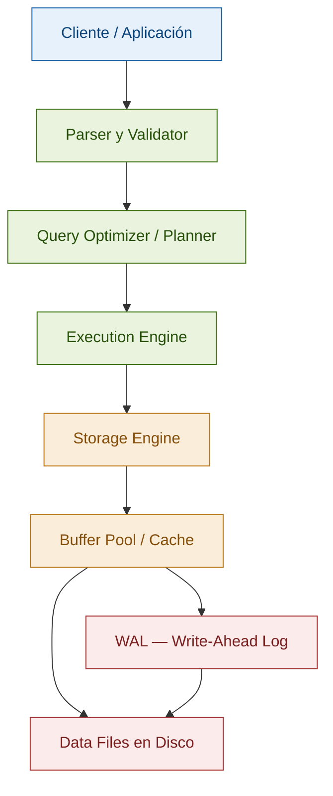

**Parser y Validator:** Convierte tu SQL en un árbol sintáctico y verifica que las tablas y columnas existan y que tengas permisos.

**Query Optimizer / Planner:** El componente más importante y más incomprendido. Toma tu query y decide el plan de ejecución más barato. No ejecuta tu SQL literalmente — lo reescribe. Más sobre esto en la sección 5.

**Execution Engine:** Ejecuta el plan elegido por el optimizer. Coordina acceso a datos, joins, agregaciones.

**Storage Engine:** Gestiona cómo los datos viven en disco. Define la estructura física: páginas, extents, archivos.

**Buffer Pool:** Cache en RAM del storage engine. Es donde viven los datos "calientes". Si un dato no está aquí, el motor va a disco — y eso es órdenes de magnitud más lento.

**WAL (Write-Ahead Log):** El mecanismo que hace posible ACID. Antes de modificar cualquier dato, se escribe en el log. Si la máquina se cae, el motor puede reconstruir el estado consistente desde el log. Fundamental para entender transacciones.

### La diferencia entre un Senior y un Staff al hablar de bases de datos

| Pregunta | Respuesta Senior | Respuesta Staff |
|---|---|---|
| "¿Cómo indexas esta tabla?" | "Creo un índice en las columnas del WHERE" | "Depende del patrón de acceso: reads vs writes, selectividad de la columna, si necesito covering index. Primero analizo el query plan" |
| "¿[[guia_dotnet_entrevista_completo|SQL]] o NoSQL?" | "Depende del caso de uso" | "Primero defino los patrones de acceso, las garantías de consistencia que necesito, y si el modelo de datos es naturalmente relacional. Luego evalúo motores específicos con sus trade-offs concretos" |
| "¿Por qué está lento este query?" | "Falta un índice" | "Reviso el plan de ejecución: si hay table scans, key lookups, hash joins costosos. Luego el buffer pool hit ratio, estadísticas desactualizadas y si hay blocking queries" |

---

## 3. Cómo almacena datos el disco

### Por qué necesitas saber esto

La mayoría de los problemas de performance en bases de datos tienen su raíz en cómo los datos viven físicamente en disco. Entender esto cambia completamente cómo diseñas tablas, índices y queries.

### Páginas: la unidad fundamental

Los motores de base de datos no leen ni escriben bytes individuales del disco. Todo se hace en unidades llamadas **páginas** (o bloques). SQL Server usa páginas de **8 KB**. PostgreSQL también. Esta limitación viene del sistema operativo y del hardware.

Una página contiene:
- Un header con metadatos (page ID, tipo de página, punteros)
- Filas de datos
- Un slot array al final que apunta al inicio de cada fila

```
┌─────────────────────────────────────────┐
│ Page Header (96 bytes en SQL Server)    │
├─────────────────────────────────────────┤
│ Row 1 data                              │
│ Row 2 data                              │
│ Row 3 data                              │
│ ...                                     │
│ (espacio libre)                         │
├─────────────────────────────────────────┤
│ Slot Array → [offset row3][offset row2] │
│              [offset row1]              │
└─────────────────────────────────────────┘
        ← 8 KB total →
```

**Implicación crítica:** Si una fila es muy grande (muchas columnas o columnas de texto largo), caben pocas filas por página. Pocas filas por página significa más páginas para el mismo dato, lo que significa más I/O. Esto es por qué el diseño de columnas importa para el performance.

### Extents y la organización en árbol

Las páginas se agrupan en **extents** (8 páginas = 64 KB en SQL Server). Las tablas crecen extent por extent. Hay dos tipos:

- **Uniform extents:** todas las páginas pertenecen al mismo objeto
- **Mixed extents:** páginas de diferentes objetos pequeños comparten un extent (para tablas pequeñas)

### El Buffer Pool — la RAM como cache

Cada vez que el motor necesita una página, la busca en el **buffer pool** (un área de RAM). Si la encuentra, la usa directamente (**buffer hit**). Si no, va a disco a buscarla (**buffer miss**) y la carga al buffer pool.

El buffer pool usa un algoritmo LRU (Least Recently Used) para decidir qué páginas sacar cuando se llena. Las páginas "calientes" (accedidas frecuentemente) se quedan en RAM. Las "frías" se van a disco.

**¿Por qué importa esto?** Cuando ejecutas un query, el costo real no es "cuántas filas lee" sino "cuántas páginas carga desde disco". Si esas páginas ya están en el buffer pool (cache hit), el query es muy rápido. Si no están (cache miss), es órdenes de magnitud más lento.

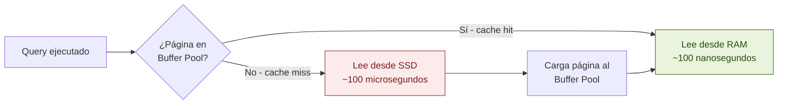

> ⚠️ **Un cache miss es 1,000 veces más lento que un cache hit.** Por eso los índices importan tanto: reducen las páginas que hay que leer. Un table scan de 10 millones de filas puede leer cientos de miles de páginas. Un index seek puede leer 3-4.

### Fragmentación — el problema que crece silencioso

Cuando insertas filas, el motor las coloca en páginas con espacio disponible. Cuando actualizas o eliminas filas, se crean huecos. Con el tiempo, las páginas se llenan de forma despareja y los datos lógicamente continuos quedan físicamente dispersos. Esto se llama **fragmentación**.

**Fragmentación interna:** espacio desperdiciado dentro de una página (huecos por deletes/updates).

**Fragmentación externa:** las páginas del índice no están físicamente en orden en el disco, entonces leer datos "en orden" requiere saltar entre páginas no contiguas — costoso para el disco.

La solución es hacer **rebuild** o **reorganize** de índices periódicamente. En SQL Server:
```sql
-- Ver fragmentación
SELECT * FROM sys.dm_db_index_physical_stats(DB_ID(), NULL, NULL, NULL, 'DETAILED');

-- Reorganizar (online, bajo impacto)
ALTER INDEX IX_Orders_CustomerId ON Orders REORGANIZE;

-- Rebuild completo (más agresivo, puede bloquear)
ALTER INDEX IX_Orders_CustomerId ON Orders REBUILD;
```

---

## 4. Índices

### La intuición correcta

Un índice es exactamente como el índice al final de un libro. Si quieres encontrar todas las páginas que mencionan "ACID", tienes dos opciones: leer el libro completo (table scan) o ir al índice, buscar "ACID", y saltar directamente a esas páginas (index seek).

La diferencia con los libros es que en bases de datos el "índice" tiene una estructura específica que permite búsquedas muy eficientes: el **B-Tree**.

### B-Tree — la estructura que hace posible los índices

Un B-Tree (Balanced Tree) es un árbol donde:
- Todos los nodos hoja están al mismo nivel (por eso "balanced")
- Cada nodo contiene múltiples claves y punteros
- Los datos están ordenados

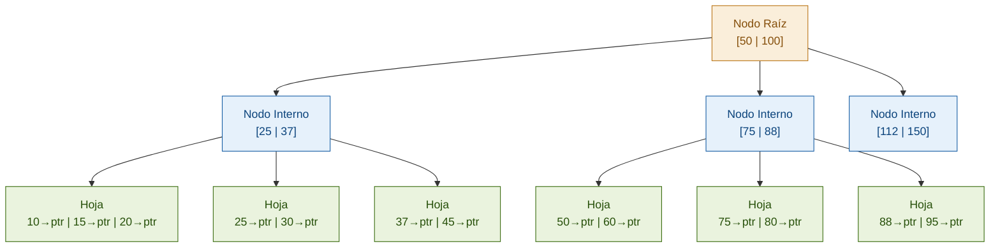

**¿Por qué B-Tree y no un árbol binario?** Un árbol binario tiene 2 hijos por nodo — en una tabla de 1 millón de filas, la altura sería ~20 niveles. Cada nivel es una página en disco. 20 accesos a disco para encontrar un dato. Un B-Tree tiene cientos o miles de claves por nodo (porque una página de 8KB cabe mucho), entonces la altura es 3-4 niveles. 3-4 accesos a disco.

**Búsqueda en el B-Tree:** Para buscar CustomerId = 75, el motor empieza en la raíz, compara con las claves [50 | 100], sabe que 75 está entre ellas, baja al hijo del medio, y así hasta el nodo hoja en 3-4 pasos sin importar el tamaño de la tabla. Eso es O(log n).

### Tipos de índices — y cuándo usar cada uno

#### Clustered Index (Índice Agrupado)

En SQL Server y MySQL/InnoDB, los datos de la tabla **son** el índice. Las filas se almacenan físicamente ordenadas según la clave del clustered index.

- **Solo puede haber uno por tabla** (porque los datos físicos solo pueden estar en un orden)
- En SQL Server, la PRIMARY KEY se convierte en clustered index por default
- Los nodos hoja del B-Tree contienen los datos reales de la fila

```sql
-- SQL Server — por default el PK es el clustered index
CREATE TABLE Orders (
    OrderId INT PRIMARY KEY,  -- → Clustered Index automático
    CustomerId INT,
    OrderDate DATETIME,
    Total DECIMAL(18,2)
);
```

**Implicación:** Si haces un range scan por OrderId (WHERE OrderId BETWEEN 100 AND 200), el motor lee páginas físicamente contiguas — muy eficiente. Si haces range scan por CustomerId (WHERE CustomerId = 5), tiene que saltar por toda la tabla.

> ⚠️ **Error común:** Usar GUIDs (uniqueidentifier) como clustered index. Los GUIDs son aleatorios, entonces cada INSERT va a una posición aleatoria del árbol, causando fragmentación masiva y page splits constantes. Si necesitas GUIDs como PK, usa `NEWSEQUENTIALID()` en SQL Server o considera un surrogate key entero como clustered index.

#### Non-Clustered Index (Índice No Agrupado)

Una estructura B-Tree **separada** que contiene las columnas del índice más un puntero al registro real (RID en heap tables, o la clave del clustered index en tablas con clustered index).

```sql
-- Índice no agrupado en CustomerId
CREATE NONCLUSTERED INDEX IX_Orders_CustomerId
ON Orders (CustomerId);
```

Cuando el motor usa este índice para `WHERE CustomerId = 5`:
1. Busca en el B-Tree del índice → encuentra los punteros a los registros
2. Para cada puntero, hace un **Key Lookup** (o RID Lookup) para obtener el resto de las columnas

Si la query solo necesita columnas que están en el índice, el paso 2 no es necesario — esto lleva al concepto de **covering index**.

#### Covering Index

Un índice que contiene todas las columnas que la query necesita. El motor puede satisfacer la query completa leyendo solo el índice, sin tocar la tabla.

```sql
-- Query frecuente:
SELECT OrderId, OrderDate, Total
FROM Orders
WHERE CustomerId = 5
ORDER BY OrderDate;

-- Covering index: incluye todas las columnas que necesita la query
CREATE NONCLUSTERED INDEX IX_Orders_CustomerId_Covering
ON Orders (CustomerId, OrderDate)    -- columnas de búsqueda y orden
INCLUDE (Total, OrderId);            -- columnas adicionales que necesita el SELECT
```

Con este índice, el motor lee solo el B-Tree del índice — no hace ningún Key Lookup a la tabla. Para queries de alto volumen, la diferencia puede ser de órdenes de magnitud.

**INCLUDE vs columna en la clave:** Las columnas en INCLUDE no afectan el orden del índice, solo viven en los nodos hoja. Úsalas para columnas que solo necesitas en el SELECT, no para filtrar o ordenar.

#### Índice Compuesto — el orden importa

Un índice sobre múltiples columnas. El orden de las columnas en el índice es crítico.

```sql
CREATE INDEX IX_Orders_Customer_Date ON Orders (CustomerId, OrderDate);
```

Este índice es útil para:
- `WHERE CustomerId = 5` ✅
- `WHERE CustomerId = 5 AND OrderDate > '2024-01-01'` ✅
- `WHERE CustomerId = 5 ORDER BY OrderDate` ✅

Este índice **no** es útil para:
- `WHERE OrderDate > '2024-01-01'` ❌ (no puede usar el índice por la primera columna)

**Regla general:** Primero las columnas de igualdad (=), luego las de rango (>, <, BETWEEN), luego las de ORDER BY, luego las de SELECT (en INCLUDE).

#### Índices Filtrados

Un índice que solo incluye filas que cumplen una condición. Muy eficientes para conjuntos de datos donde solo un subconjunto se accede frecuentemente.

```sql
-- Solo índice de órdenes pendientes (supongamos que son el 5% del total)
CREATE NONCLUSTERED INDEX IX_Orders_Pending
ON Orders (CustomerId, OrderDate)
WHERE Status = 'Pending';
```

Si la mayoría de queries de operación son sobre órdenes pendientes, este índice es mucho más pequeño y eficiente que un índice completo.

### Selectividad — el criterio más importante para decidir si indexar

La **selectividad** mide qué tan únicos son los valores de una columna. Alta selectividad = pocos duplicados.

- `CustomerId` en una tabla de órdenes: alta selectividad (cada cliente tiene pocas órdenes vs el total)
- `Status` ('Active'/'Inactive'/'Pending'): baja selectividad si el 90% son 'Active'

**Un índice en una columna de baja selectividad puede ser peor que un table scan.** Si el 90% de las filas son 'Active' y buscas `WHERE Status = 'Active'`, el optimizer probablemente prefiere el table scan porque tiene que ir a la tabla para cada resultado de todas formas.

```sql
-- Ver selectividad aproximada
SELECT
    COUNT(DISTINCT CustomerId) AS distinct_values,
    COUNT(*) AS total_rows,
    CAST(COUNT(DISTINCT CustomerId) AS FLOAT) / COUNT(*) AS selectivity
FROM Orders;
-- selectivity cercana a 1.0 = alta selectividad, bueno para indexar
-- selectivity cercana a 0.0 = baja selectividad, pensar bien antes de indexar
```

### El costo oculto de los índices

Los índices no son gratis. Cada índice que creas tiene estos costos:

1. **Storage:** Cada índice ocupa espacio en disco. Una tabla con 10 índices puede tener más espacio en índices que en datos.
2. **Write amplification:** Cada INSERT, UPDATE o DELETE debe actualizar todos los índices relevantes. Una tabla con 10 índices tiene writes ~10 veces más costosos que sin índices.
3. **Mantenimiento:** Los índices se fragmentan y necesitan mantenimiento periódico.

**La regla de oro:** Indexa para tus reads, pero mide el impacto en tus writes. En sistemas write-heavy (logging, eventos, IoT), demasiados índices pueden ser el cuello de botella.

> 🎓 **Ir a Pluralsight ahora:** Si quieres ver esto con ejemplos visuales interactivos y casos reales de tuning, este es el momento de tomar **"SQL Server: Optimizing Queries with Indexes"** en Pluralsight. Las secciones de "Index Internals" y "Covering Indexes" complementan perfectamente lo que acabas de leer.

---

## 5. El Query Planner

### La intuición

El Query Planner (o Query Optimizer) es el componente más sofisticado de un motor de base de datos. Su trabajo es tomar tu SQL y encontrar el plan de ejecución más eficiente. No ejecuta tu SQL literalmente — lo transforma.

Cuando escribes:
```sql
SELECT c.Name, COUNT(o.OrderId) as OrderCount
FROM Customers c
JOIN Orders o ON c.CustomerId = o.CustomerId
WHERE c.Country = 'Mexico'
GROUP BY c.Name
HAVING COUNT(o.OrderId) > 5;
```

El planner considera docenas de planes posibles: ¿qué tabla accedo primero? ¿qué tipo de join uso? ¿uso algún índice? ¿en qué orden aplico los filtros? Y elige el que estima más barato.

### Estadísticas — el insumo del planner

El planner no sabe cuántas filas hay en tu tabla en tiempo real. Usa **estadísticas**: histogramas sobre la distribución de valores en cada columna, actualizados periódicamente.

Si las estadísticas están desactualizadas (tabla creció mucho desde la última actualización), el planner puede elegir un plan terrible porque sus estimaciones de filas son incorrectas.

```sql
-- SQL Server — actualizar estadísticas
UPDATE STATISTICS Orders;

-- Ver cuándo se actualizaron por última vez
SELECT
    OBJECT_NAME(s.object_id) AS TableName,
    s.name AS StatName,
    sp.last_updated,
    sp.rows,
    sp.rows_sampled
FROM sys.stats s
CROSS APPLY sys.dm_db_stats_properties(s.object_id, s.stats_id) sp
WHERE OBJECT_NAME(s.object_id) = 'Orders';
```

### Leyendo un Query Plan — lo esencial

El plan de ejecución es el mapa que el motor usará para ejecutar tu query. En SQL Server Management Studio (SSMS), presiona Ctrl+M para ver el plan estimado, o Ctrl+L para el plan real.

**Operadores que debes reconocer:**

| Operador | Qué significa | ¿Bueno o malo? |
|---|---|---|
| **Index Seek** | Busca en el B-Tree del índice — pocas páginas | ✅ Muy bueno |
| **Index Scan** | Lee todo el índice — muchas páginas | ⚠️ Aceptable si la tabla es pequeña |
| **Table Scan** (Clustered Scan) | Lee toda la tabla | ❌ Malo en tablas grandes |
| **Key Lookup** | Va a la tabla a buscar columnas no en el índice | ⚠️ Puede ser costoso si hay muchas filas |
| **Nested Loops** | Para cada fila de la tabla exterior, busca en la interior | ✅ Bueno con pocos resultados y buenos índices |
| **Hash Match** | Construye una hash table en memoria para el join | ⚠️ Necesario con muchas filas, costoso en memoria |
| **Merge Join** | Join de dos inputs ya ordenados | ✅ Muy eficiente cuando hay índices apropiados |
| **Sort** | Ordena un resultado intermedio | ⚠️ Costoso si no hay índice que ya lo ordene |

**El porcentaje de costo:** Cada operador en el plan muestra un porcentaje del costo total. Empieza siempre por los operadores de mayor porcentaje — ahí está tu cuello de botella.

### El problema de los Parameter Sniffing

SQL Server cachea los planes de ejecución. La primera vez que ejecuta un stored procedure, genera el plan basado en los valores de los parámetros de esa primera ejecución. Si esa ejecución tenía parámetros muy distintos a los típicos, el plan cacheado puede ser terrible para el resto.

```sql
-- Primera ejecución: CustomerId = 1 (tiene 50,000 órdenes = 5% de la tabla)
-- El planner elige un Table Scan porque tiene que leer muchas filas de todas formas
EXEC GetOrdersByCustomer @CustomerId = 1;

-- Segunda ejecución: CustomerId = 9999 (tiene 3 órdenes)
-- El planner reutiliza el plan con Table Scan — pero aquí un Index Seek sería mucho mejor
EXEC GetOrdersByCustomer @CustomerId = 9999;
```

Soluciones:
```sql
-- Opción 1: OPTION (RECOMPILE) — el planner genera un nuevo plan cada vez
SELECT * FROM Orders WHERE CustomerId = @CustomerId OPTION (RECOMPILE);

-- Opción 2: Optimize for unknown — usa estadísticas promedio en lugar del valor real
SELECT * FROM Orders WHERE CustomerId = @CustomerId OPTION (OPTIMIZE FOR (@CustomerId UNKNOWN));

-- Opción 3: Limpiar el cache para ese plan (solo en emergencias)
DBCC FREEPROCCACHE;
```

---

## 6. Transacciones y ACID

### La intuición

Una transacción es un grupo de operaciones que el motor trata como una unidad atómica: o todas tienen efecto, o ninguna lo tiene. La razón de existir de las transacciones es proteger la integridad de los datos cuando dos cosas pueden salir mal: el sistema falla a mitad de una operación, o múltiples usuarios acceden a los mismos datos simultáneamente.

**El ejemplo clásico — transferencia bancaria:**

```sql
BEGIN TRANSACTION;

UPDATE Accounts SET Balance = Balance - 1000 WHERE AccountId = 1; -- Débito
UPDATE Accounts SET Balance = Balance + 1000 WHERE AccountId = 2; -- Crédito

COMMIT;
```

Si el sistema falla entre el débito y el crédito, sin transacciones se pierde $1,000. Con transacciones, el motor hace rollback automático y las dos cuentas quedan como estaban.

### ACID — las cuatro propiedades

ACID no es solo un acrónimo — es un contrato que el motor te hace. Entender cada propiedad en profundidad es fundamental para System Design.

#### Atomicidad (Atomicity)

**Definición:** Una transacción se trata como unidad indivisible. O todas sus operaciones tienen efecto, o ninguna.

**Cómo se implementa:** A través del **WAL (Write-Ahead Log)** y el proceso de rollback.

Cuando inicia una transacción, el motor:
1. Escribe en el WAL las operaciones a realizar (incluyendo los valores anteriores para poder revertirlas)
2. Aplica los cambios en el Buffer Pool (RAM)
3. Al hacer COMMIT, marca la transacción como completada en el WAL
4. Eventualmente, el Buffer Pool se escribe a disco (checkpoint)

Si el sistema falla antes del COMMIT, al reiniciar el motor lee el WAL y hace rollback de las transacciones incompletas. Si el sistema falla después del COMMIT pero antes del checkpoint, el motor re-aplica las operaciones del WAL (redo).

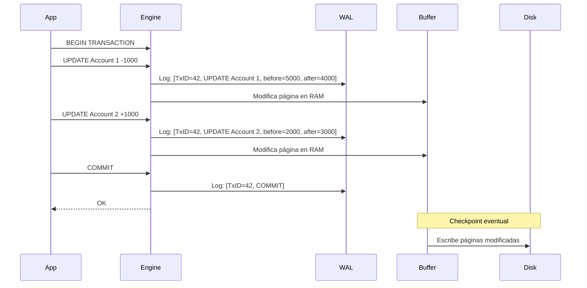

#### Consistencia (Consistency)

**Definición:** Una transacción lleva la base de datos de un estado válido a otro estado válido. Las reglas de integridad (constraints, triggers, foreign keys) nunca se violan.

**Cómo se implementa:** Mediante constraints declarados en el esquema.

```sql
-- Estos constraints garantizan consistencia:
CREATE TABLE Orders (
    OrderId INT PRIMARY KEY,
    CustomerId INT NOT NULL,
    Total DECIMAL(18,2) CHECK (Total >= 0),  -- No puede ser negativo
    Status VARCHAR(20) CHECK (Status IN ('Pending', 'Confirmed', 'Shipped', 'Cancelled')),
    FOREIGN KEY (CustomerId) REFERENCES Customers(CustomerId)  -- FK integridad referencial
);
```

> ⚠️ **Nota importante:** La C de ACID es la más debatida. En sistemas distribuidos (lo que cubriremos en la sección de Sharding y en la guía de System Design), garantizar consistencia fuerte entre múltiples nodos es extremadamente costoso. Esta es la raíz del teorema CAP.

#### Isolation (Aislamiento)

**Definición:** Las transacciones concurrentes se ejecutan como si fueran secuenciales. Los cambios de una transacción en progreso no son visibles a otras transacciones (dependiendo del nivel de aislamiento).

Esta es la propiedad más compleja y la que tiene más trade-offs. La cubrimos en profundidad en la siguiente sección.

#### Durabilidad (Durability)

**Definición:** Una vez que una transacción recibe COMMIT, sus cambios son permanentes. Sobreviven crashes del sistema.

**Cómo se implementa:** El WAL garantiza esto. El COMMIT no retorna al cliente hasta que el log de la transacción está escrito en disco (no solo en RAM). Por eso los SSDs cambiaron radicalmente el performance de las bases de datos: escribir al WAL en SSD es mucho más rápido que en HDD.

> ⚠️ **El trade-off de durabilidad:** En sistemas de altísima carga, el fsync (forzar escritura a disco) puede ser el cuello de botella. PostgreSQL tiene la opción `synchronous_commit = off` que hace el commit más rápido pero arriesga perder las últimas transacciones en caso de crash. En sistemas donde perder algunos eventos es aceptable (analytics, logging), puede tener sentido. En sistemas financieros, nunca.

---

## 7. Isolation Levels

### El problema que resuelven

Cuando múltiples transacciones corren concurrentemente, pueden interferirse entre sí de formas que corrompen los datos. Los Isolation Levels son un menú de trade-offs: más aislamiento = más correcto pero más lento; menos aislamiento = más rápido pero con posibles anomalías.

### Las anomalías de concurrencia

Antes de ver los niveles, necesitas entender qué problemas evitan:

#### Dirty Read

Transacción A lee datos que Transacción B modificó pero aún no hizo COMMIT. Si B hace ROLLBACK, A leyó datos que "nunca existieron".

```
T1: BEGIN; UPDATE Balance = 5000 WHERE AccountId = 1;
T2: SELECT Balance FROM Accounts WHERE AccountId = 1;  -- Lee 5000 (dirty!)
T1: ROLLBACK;  -- El balance real nunca fue 5000
```

#### Non-Repeatable Read

Transacción A lee una fila. Transacción B modifica esa fila y hace COMMIT. A vuelve a leer la misma fila y obtiene un valor diferente dentro de la misma transacción.

```
T1: SELECT Balance FROM Accounts WHERE AccountId = 1;  -- Lee 3000
T2: UPDATE Accounts SET Balance = 5000 WHERE AccountId = 1; COMMIT;
T1: SELECT Balance FROM Accounts WHERE AccountId = 1;  -- Lee 5000 — diferente!
```

#### Phantom Read

Transacción A ejecuta una query que devuelve N filas. Transacción B inserta o elimina filas que cumplirían la condición de A. A vuelve a ejecutar la misma query y obtiene un número diferente de filas.

```
T1: SELECT COUNT(*) FROM Orders WHERE Status = 'Pending';  -- Devuelve 10
T2: INSERT INTO Orders (..., Status = 'Pending'); COMMIT;
T1: SELECT COUNT(*) FROM Orders WHERE Status = 'Pending';  -- Devuelve 11 — fantasma!
```

#### Lost Update

Dos transacciones leen el mismo valor, ambas lo modifican basándose en el valor leído, y la segunda escritura sobreescribe a la primera sin saber que hubo una modificación intermedia.

```
T1: lee Balance = 1000
T2: lee Balance = 1000
T1: escribe Balance = 1000 + 500 = 1500
T2: escribe Balance = 1000 + 200 = 1200  -- perdió la actualización de T1!
```

### Los cuatro Isolation Levels del estándar SQL

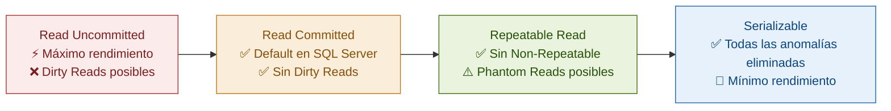

| Nivel | Dirty Read | Non-Repeatable Read | Phantom Read | Cuándo usarlo |
|---|---|---|---|---|
| **Read Uncommitted** | ✅ Posible | ✅ Posible | ✅ Posible | Reportes aproximados donde la exactitud no importa. Raramente justificado. |
| **Read Committed** | ❌ Imposible | ✅ Posible | ✅ Posible | Default en SQL Server y PostgreSQL. Correcto para la mayoría de aplicaciones OLTP. |
| **Repeatable Read** | ❌ Imposible | ❌ Imposible | ✅ Posible | Cuando necesitas que los valores leídos no cambien durante la transacción. |
| **Serializable** | ❌ Imposible | ❌ Imposible | ❌ Imposible | Operaciones financieras críticas. Costoso — usa con criterio. |

### SNAPSHOT Isolation — el enfoque moderno

SQL Server y PostgreSQL implementan **Snapshot Isolation** (también llamado MVCC — Multi-Version Concurrency Control), que es un enfoque diferente al locking tradicional.

En lugar de bloquear filas cuando se leen, el motor mantiene **múltiples versiones** de cada fila. Cada transacción ve una "snapshot" consistente de la base de datos del momento en que inició.

**Ventaja enorme:** Los reads no bloquean writes, y los writes no bloquean reads. El rendimiento de concurrencia mejora dramáticamente.

```sql
-- En SQL Server, habilitar SNAPSHOT isolation
ALTER DATABASE MyDB SET ALLOW_SNAPSHOT_ISOLATION ON;
ALTER DATABASE MyDB SET READ_COMMITTED_SNAPSHOT ON;  -- Read Committed usa snapshot automáticamente

-- Usar en una transacción específica
SET TRANSACTION ISOLATION LEVEL SNAPSHOT;
BEGIN TRANSACTION;
SELECT * FROM Orders WHERE Status = 'Pending';  -- Ve la snapshot del inicio de la transacción
COMMIT;
```

**PostgreSQL usa MVCC por default** para todos los isolation levels. Por eso PostgreSQL tiene un rendimiento de concurrencia excelente out of the box.

> ⚠️ **Write skew — el problema de Snapshot Isolation:** Con snapshot isolation, dos transacciones pueden leer el mismo dato, tomar decisiones basadas en él, y ambas escribir sin conflicto — resultando en un estado inconsistente. Ejemplo: dos médicos ven que hay 2 médicos de guardia, ambos deciden tomar su día libre, ambos hacen commit — resultado: 0 médicos de guardia. Para esto necesitas Serializable o locking explícito.

### Cómo configurar en C# / EF Core

```csharp
// EF Core — configurar isolation level en una transacción
using var transaction = await context.Database.BeginTransactionAsync(
    IsolationLevel.Serializable);

try
{
    var order = await context.Orders.FindAsync(orderId);
    order.Status = "Confirmed";
    await context.SaveChangesAsync();
    await transaction.CommitAsync();
}
catch
{
    await transaction.RollbackAsync();
    throw;
}
```

---

## 8. Deadlocks

### La intuición

Un deadlock ocurre cuando dos o más transacciones se bloquean mutuamente esperando recursos que la otra tiene. Ninguna puede avanzar.

```
T1 tiene lock en tabla A, espera lock en tabla B
T2 tiene lock en tabla B, espera lock en tabla A
→ Ambas esperan indefinidamente = deadlock
```

### Cómo detecta el motor los deadlocks

SQL Server corre un proceso llamado **Deadlock Monitor** que periódicamente (cada 5 segundos) busca ciclos en el grafo de esperas. Cuando detecta uno, elige una víctima (generalmente la transacción con menos costo de rollback) y la mata con error 1205.

### Causas más comunes de deadlocks en producción

#### 1. Acceso a tablas en orden diferente

```csharp
// T1 accede: Customers → Orders
// T2 accede: Orders → Customers
// → Deadlock garantizado con suficiente concurrencia

// Solución: siempre acceder en el mismo orden
// T1 y T2 deben acceder: Customers → Orders
```

#### 2. Hot rows — muchas transacciones pelean por la misma fila

Típico en tablas con contadores o saldos actualizados frecuentemente.

```sql
-- Muchas transacciones concurrentes haciendo esto:
UPDATE Inventory SET Quantity = Quantity - 1 WHERE ProductId = 1;
-- Si hay otras transacciones que también leen y modifican ProductId = 1, hay contención
```

#### 3. Missing indexes que causan scans amplios

Si una query hace un table scan porque falta un índice, bloquea muchas más filas de las necesarias, aumentando la probabilidad de deadlock.

### Estrategias para prevenir deadlocks

**1. Orden consistente de acceso:**
```csharp
// Siempre acceder a las entidades en orden por su ID
var lowerCustomerId = Math.Min(customerId1, customerId2);
var higherCustomerId = Math.Max(customerId1, customerId2);

var customer1 = await context.Customers
    .Where(c => c.CustomerId == lowerCustomerId)
    .FirstAsync();
var customer2 = await context.Customers
    .Where(c => c.CustomerId == higherCustomerId)
    .FirstAsync();
```

**2. Transacciones cortas:** Cuanto más corta la transacción, menos tiempo tiene los locks, menos probabilidad de deadlock. Nunca hagas I/O de red, llamadas a APIs externas, o esperas dentro de una transacción.

```csharp
// ❌ MAL — llamada HTTP dentro de una transacción
using var transaction = await context.Database.BeginTransactionAsync();
var order = await context.Orders.FindAsync(orderId);
var paymentResult = await paymentService.ProcessAsync(order.Total); // HTTP call!
order.Status = paymentResult.Success ? "Paid" : "Failed";
await context.SaveChangesAsync();
await transaction.CommitAsync();

// ✅ BIEN — el procesamiento externo va fuera de la transacción
var order = await context.Orders.FindAsync(orderId);
var paymentResult = await paymentService.ProcessAsync(order.Total); // Fuera de transacción

using var transaction = await context.Database.BeginTransactionAsync();
order.Status = paymentResult.Success ? "Paid" : "Failed";
await context.SaveChangesAsync();
await transaction.CommitAsync();
```

**3. Retry con backoff exponencial:**
```csharp
public async Task ExecuteWithDeadlockRetryAsync(Func<Task> action, int maxRetries = 3)
{
    for (int attempt = 0; attempt <= maxRetries; attempt++)
    {
        try
        {
            await action();
            return;
        }
        catch (SqlException ex) when (ex.Number == 1205) // Deadlock victim
        {
            if (attempt == maxRetries) throw;
            var delay = TimeSpan.FromMilliseconds(Math.Pow(2, attempt) * 100);
            await Task.Delay(delay);
        }
    }
}
```

**4. Usar SNAPSHOT isolation** para reducir el locking en reads.

### Ver deadlocks en SQL Server

```sql
-- Habilitar Deadlock Trace
DBCC TRACEON(1222, -1);  -- Detalle completo de deadlocks en el error log

-- O usar Extended Events (la forma moderna)
-- En SSMS: Management → Extended Events → New Session → usar template "Deadlock Graph"

-- Ver deadlocks históricos en Azure SQL (built-in)
SELECT * FROM sys.event_log
WHERE event_type = 'deadlock'
ORDER BY start_time DESC;
```

---

## 9. Modelado Relacional y Normalización

### Por qué importa el modelado para un Arquitecto

Un esquema mal diseñado es deuda técnica que cobra intereses compuestos. Los problemas de performance, las anomalías de datos y la rigidez para cambiar el modelo a menudo vienen de decisiones de modelado tempranas que parecían razonables en el momento.

### Las Formas Normales — y cuándo romperse a propósito

#### 1NF — Primera Forma Normal

**Regla:** Cada celda contiene un solo valor atómico. No hay grupos repetitivos ni arrays en una columna.

```sql
-- ❌ Viola 1NF — múltiples valores en una columna
CREATE TABLE Orders (
    OrderId INT,
    Products VARCHAR(500)  -- "ProductA, ProductB, ProductC"
);

-- ✅ 1NF — cada valor en su propia fila
CREATE TABLE Orders (OrderId INT, ...);
CREATE TABLE OrderItems (OrderId INT, ProductId INT, Quantity INT, ...);
```

#### 2NF — Segunda Forma Normal

**Regla:** Estar en 1NF y que todos los atributos no-clave dependan de la clave completa (no de una parte de ella). Solo relevante cuando hay claves compuestas.

```sql
-- ❌ Viola 2NF — ProductName depende solo de ProductId, no del par (OrderId, ProductId)
CREATE TABLE OrderItems (
    OrderId INT,
    ProductId INT,
    ProductName VARCHAR(100),  -- Depende solo de ProductId
    Quantity INT,
    PRIMARY KEY (OrderId, ProductId)
);

-- ✅ 2NF
CREATE TABLE Products (ProductId INT PRIMARY KEY, ProductName VARCHAR(100));
CREATE TABLE OrderItems (
    OrderId INT, ProductId INT, Quantity INT,
    PRIMARY KEY (OrderId, ProductId),
    FOREIGN KEY (ProductId) REFERENCES Products(ProductId)
);
```

#### 3NF — Tercera Forma Normal

**Regla:** Estar en 2NF y que no haya dependencias transitivas (un atributo no-clave que depende de otro atributo no-clave).

```sql
-- ❌ Viola 3NF — City depende de ZipCode, no directamente de CustomerId
CREATE TABLE Customers (
    CustomerId INT PRIMARY KEY,
    ZipCode VARCHAR(10),
    City VARCHAR(100)  -- Depende de ZipCode, no de CustomerId directamente
);

-- ✅ 3NF
CREATE TABLE ZipCodes (ZipCode VARCHAR(10) PRIMARY KEY, City VARCHAR(100));
CREATE TABLE Customers (
    CustomerId INT PRIMARY KEY,
    ZipCode VARCHAR(10),
    FOREIGN KEY (ZipCode) REFERENCES ZipCodes(ZipCode)
);
```

### Desnormalización estratégica — cuándo violar las formas normales a propósito

La normalización elimina redundancia y anomalías de actualización. Pero en sistemas de alto volumen de lectura, los JOINs costosos pueden ser el cuello de botella. La **desnormalización** es guardar datos redundantes para evitar JOINs.

```sql
-- Normalizado: para obtener el nombre del cliente en una orden, necesitas JOIN
SELECT o.OrderId, c.Name, o.Total
FROM Orders o
JOIN Customers c ON o.CustomerId = c.CustomerId;

-- Desnormalizado: CustomerName guardado directamente en Orders
-- Ventaja: no necesitas JOIN para el read más común
-- Costo: si el nombre del cliente cambia, tienes que actualizar todas sus órdenes
CREATE TABLE Orders (
    OrderId INT PRIMARY KEY,
    CustomerId INT,
    CustomerName VARCHAR(100),  -- redundante pero elimina el JOIN
    Total DECIMAL(18,2)
);
```

**¿Cuándo desnormalizar?**
- El JOIN es frecuente y costoso (tablas grandes, alta concurrencia)
- El dato desnormalizado cambia raramente (nombres de clientes, descripciones de productos)
- El sistema es read-heavy y el costo de mantener la consistencia en writes es aceptable

**¿Cuándo NO desnormalizar?**
- El dato cambia frecuentemente (precios, inventario, estados)
- El sistema es write-heavy
- La complejidad de mantener la consistencia no vale el beneficio en reads

> ⚠️ **Regla para [[guia_dotnet_entrevista_completo|entrevistas]]:** Nunca desnormalices "porque los JOINs son lentos". Primero mide, agrega los índices correctos, y solo desnormaliza si los JOINs siguen siendo el cuello de botella después de la indexación correcta.

---

## 10. El Panorama NoSQL

### La intuición

"NoSQL" no significa "sin SQL" ni "sin estructura". Significa "Not Only SQL" — bases de datos diseñadas para casos donde el modelo relacional no es la mejor herramienta. Cada familia NoSQL resuelve un problema específico de forma diferente.

**La pregunta correcta no es "¿SQL o NoSQL?" sino "¿qué garantías necesito, cuál es mi modelo de acceso, y qué escala manejo?"**

### Las cuatro familias principales

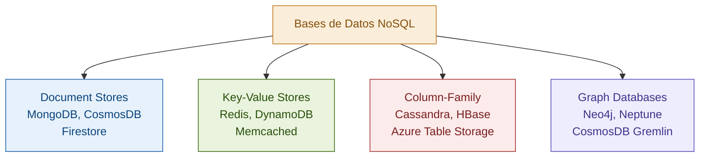

### Document Stores — MongoDB, CosmosDB (API MongoDB)

**Modelo:** Documentos JSON/BSON anidados. Los datos relacionados se guardan juntos en un mismo documento.

**Cuándo usar:**
- El modelo de datos es naturalmente jerárquico (un pedido con sus líneas, un perfil de usuario con sus preferencias)
- El acceso principal es por el ID del documento o por campos del mismo documento
- El esquema cambia frecuentemente (flexibilidad schema)
- Necesitas escalar reads horizontalmente con sharding por documentos

**Cuándo NO usar:**
- Tienes relaciones complejas entre entidades que requieren JOINs frecuentes
- Necesitas transacciones ACID entre múltiples documentos (aunque MongoDB lo soporta desde v4, es más caro)
- Tus queries son ad-hoc y no sabes de antemano los patrones de acceso

**Ejemplo — orden en document store:**
```json
{
  "_id": "order-123",
  "customerId": "cust-456",
  "customerName": "Carlos Mendez",
  "status": "Confirmed",
  "createdAt": "2024-01-15T10:30:00Z",
  "items": [
    { "productId": "prod-1", "name": "Laptop", "quantity": 1, "unitPrice": 15000 },
    { "productId": "prod-2", "name": "Mouse", "quantity": 2, "unitPrice": 350 }
  ],
  "total": 15700,
  "shippingAddress": {
    "street": "Av. Chapultepec 100",
    "city": "Guadalajara",
    "state": "Jalisco"
  }
}
```

En SQL relacional, esto son 3 tablas (Orders, OrderItems, Addresses) y un JOIN de 3 vías. En document store, es una lectura de un solo documento. Si siempre accedes a una orden con todos sus detalles, el document store gana.

**Anti-patrón común:** Usar MongoDB como si fuera SQL, con colecciones muy normalizadas y $lookup (joins) frecuentes. Si necesitas JOINs frecuentes, probablemente necesitas SQL.

### Key-Value Stores — Redis, DynamoDB

**Modelo:** Un hashmap gigante: dado una clave, obtienes un valor. La clave es el único medio de acceso.

**Redis específicamente:**
- In-memory (datos en RAM) → latencia submilisegundo
- Soporta estructuras de datos ricas: strings, hashes, lists, sets, sorted sets, streams
- Persistencia opcional (RDB snapshots + AOF log)
- Clustering para escalar

**Cuándo usar Redis:**
- Cache (el caso de uso estrella)
- Session storage
- Rate limiting (INCR atómico en Redis es perfecto para esto)
- Leaderboards (sorted sets)
- Pub/Sub básico
- Distributed locks

**Cuándo NO usar Redis como base de datos principal:**
- Cuando el dataset es más grande que la RAM disponible (Redis es in-memory)
- Cuando necesitas queries complejas por campos que no son la clave
- Cuando la durabilidad es crítica y no puedes perder datos (Redis puede perder los últimos segundos de datos si no configuras AOF correctamente)

```csharp
// Redis en .NET — StackExchange.Redis
var redis = ConnectionMultiplexer.Connect("localhost");
var db = redis.GetDatabase();

// Cache simple
await db.StringSetAsync($"user:{userId}", JsonSerializer.Serialize(user),
    TimeSpan.FromMinutes(30));

var cached = await db.StringGetAsync($"user:{userId}");
if (cached.HasValue)
    return JsonSerializer.Deserialize<User>(cached);

// Rate limiting con Redis
var key = $"ratelimit:{userId}:{DateTime.UtcNow:yyyyMMddHHmm}";
var count = await db.StringIncrementAsync(key);
if (count == 1)
    await db.KeyExpireAsync(key, TimeSpan.FromMinutes(1));
if (count > 100)
    throw new RateLimitExceededException();
```

### Column-Family Stores — Cassandra, HBase

**Modelo:** Los datos se organizan en familias de columnas. Cada fila puede tener columnas diferentes. Optimizado para writes masivos y range scans por la clave de partición.

**El modelo mental de Cassandra:** Piensa en una tabla de Cassandra no como una tabla SQL sino como un hashmap de hashmaps. La partition key determina en qué nodo vive la fila. La clustering key determina el orden dentro de la partición.

**Cuándo usar Cassandra:**
- Series temporales con altísimo volumen de writes (IoT, métricas, eventos)
- Datos que se acceden por una clave de partición bien definida
- Necesitas write availability sobre consistency (AP en el teorema CAP)
- Distribución geográfica y multi-datacenter

**Cuándo NO usar Cassandra:**
- Necesitas transacciones ACID
- Tus queries son ad-hoc y no puedes predefinir los patrones de acceso
- Necesitas JOINs o agregaciones complejas
- Tu dataset es pequeño (Cassandra tiene overhead de operación)

**El error fatal de Cassandra:** Diseñar el esquema pensando en normalización y luego intentar hacer JOINs. En Cassandra, el esquema se diseña **para las queries**, no para el modelo de datos. Diferentes queries necesitan diferentes tablas (incluso si tienen los mismos datos).

```
// Cassandra: tabla diseñada para la query "dame los eventos del sensor X de la última hora"
CREATE TABLE sensor_events (
    sensor_id UUID,
    event_time TIMESTAMP,
    temperature FLOAT,
    humidity FLOAT,
    PRIMARY KEY (sensor_id, event_time)  -- partición por sensor, orden por tiempo
) WITH CLUSTERING ORDER BY (event_time DESC);
```

### Graph Databases — Neo4j, Neptune

**Modelo:** Nodos (entidades) y edges (relaciones). Las relaciones son ciudadanos de primera clase, no JOINs.

**Cuándo usar:**
- El problema se centra en las relaciones entre entidades: redes sociales, detección de fraude, sistemas de recomendación, grafos de conocimiento
- Las queries navegan relaciones de profundidad variable ("amigos de amigos de amigos que compraron X")
- Las relaciones tienen atributos propios

**Cuándo NO usar:**
- El modelo de datos es principalmente tabular con pocas relaciones
- Necesitas agregaciones o analytics sobre grandes volúmenes (hay mejores herramientas)

```cypher
// Cypher — lenguaje de Neo4j
// "Dame todos los productos comprados por amigos de Carlos que Carlos no ha comprado"
MATCH (carlos:User {name: 'Carlos'})-[:FRIEND]->(amigo:User)
MATCH (amigo)-[:PURCHASED]->(producto:Product)
WHERE NOT (carlos)-[:PURCHASED]->(producto)
RETURN DISTINCT producto.name, COUNT(*) as popularity
ORDER BY popularity DESC;
```

En SQL relacional, esta query requeriría múltiples self-JOINs costosos. En un grafo, es una traversal natural.

### La tabla de decisión

| Criterio | SQL Relacional | Document | Key-Value | Column-Family | Graph |
|---|---|---|---|---|---|
| Transacciones ACID | ✅ Nativo | ⚠️ Limitado | ❌ No | ❌ No | ⚠️ Limitado |
| JOINs complejos | ✅ Excelente | ❌ Costoso | ❌ No | ❌ No | ✅ Natural |
| Schema flexible | ❌ Rígido | ✅ Excelente | ✅ Total | ✅ Flexible | ✅ Flexible |
| Write throughput | ⚠️ Limitado | ✅ Bueno | ✅ Excelente | ✅ Excelente | ⚠️ Moderado |
| Read by key | ⚠️ Con índice | ✅ Excelente | ✅ Excelente | ✅ Excelente | ✅ Bueno |
| Ad-hoc queries | ✅ Excelente | ⚠️ Limitado | ❌ No | ❌ No | ✅ Con Cypher |
| Escala horizontal | ⚠️ Complejo | ✅ Nativo | ✅ Nativo | ✅ Nativo | ⚠️ Limitado |
| Relaciones complejas | ⚠️ Con JOINs | ❌ Difícil | ❌ No | ❌ No | ✅ Excelente |

---

## 11. Replicación

### La intuición

Replicación significa tener múltiples copias del mismo dato en múltiples servidores. Los dos motivos principales son:
1. **Alta disponibilidad:** si el servidor principal falla, un réplica puede tomar el control
2. **Read scaling:** distribuir las lecturas entre múltiples réplicas para aumentar el throughput

### Arquitectura Primary-Replica (Master-Slave)

La arquitectura más común. Un nodo primary recibe todos los writes. Los cambios se propagan a uno o más nodos replica.

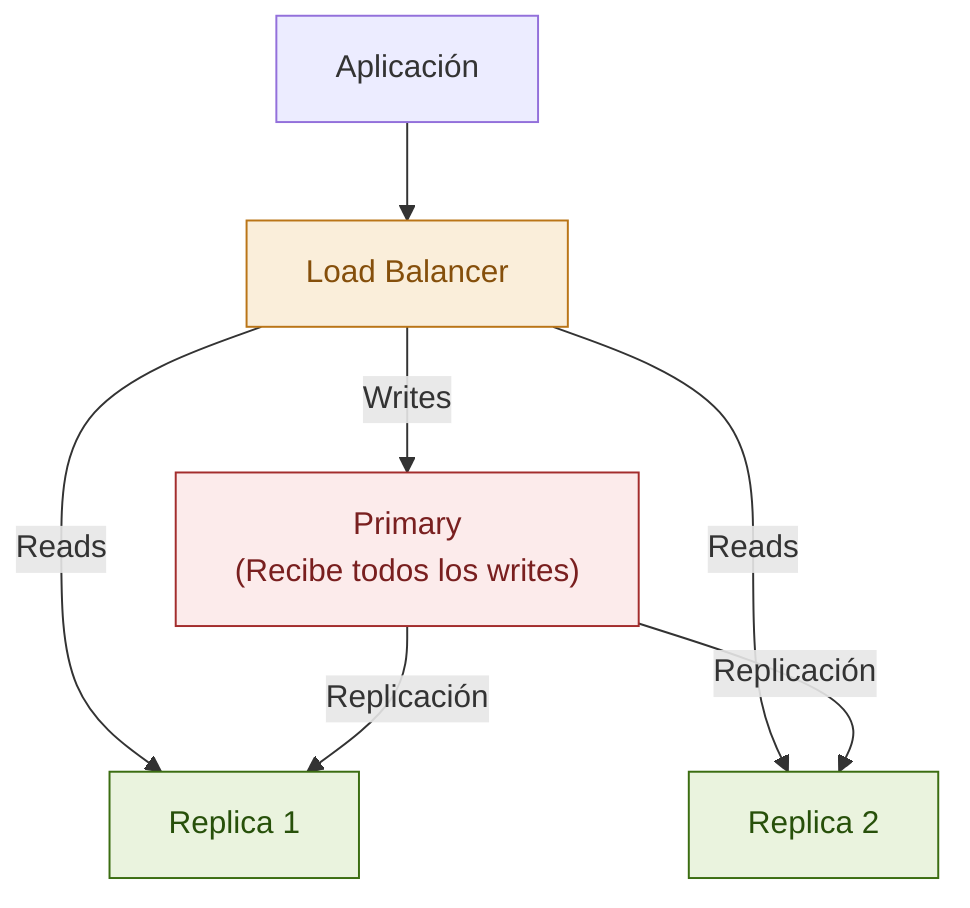

### Replicación Síncrona vs Asíncrona

**Replicación síncrona:**
- El primary espera confirmación de la réplica antes de confirmar el COMMIT al cliente
- Garantía: cuando el cliente recibe "OK", el dato está en al menos 2 nodos
- Costo: cada write tiene la latencia adicional de la réplica (puede ser alta si está en otro datacenter)
- Úsala: para datos críticos donde perder escrituras es inaceptable

**Replicación asíncrona:**
- El primary confirma el COMMIT al cliente sin esperar a la réplica
- Riesgo: si el primary falla antes de que la réplica reciba el cambio, se pierde ese dato
- Ventaja: latencia de write mínima
- Úsala: cuando perder unos pocos segundos de datos en un escenario de desastre es aceptable

**Replicación semisíncrona:** Híbrido — espera confirmación de al menos una réplica, no de todas. Balance entre seguridad y rendimiento.

### Replication Lag — el problema más ignorado

En replicación asíncrona, las réplicas están **siempre** atrasadas respecto al primary, aunque sea por milisegundos. Este atraso se llama **replication lag**.

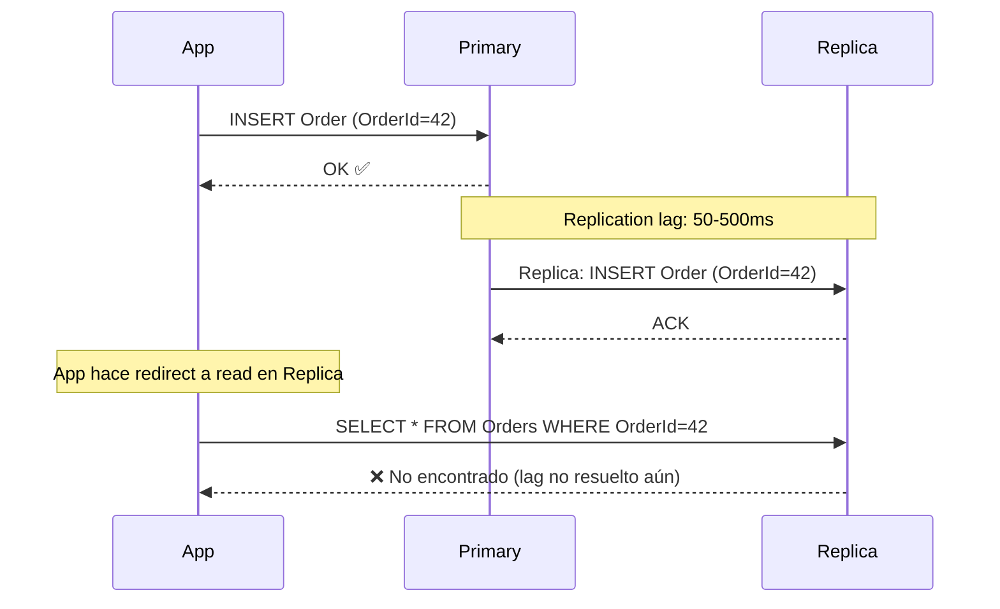

**El problema en la práctica:** Usuario crea un pedido, la aplicación redirige al usuario a "ver tu pedido" (que lee de la réplica), y el pedido no aparece porque la réplica aún no lo tiene.

**Soluciones:**

1. **Read-your-writes:** después de un write, las lecturas del mismo usuario van al primary temporalmente
2. **Monotonic reads:** el usuario siempre lee del mismo servidor réplica (no puede "retroceder")
3. **Sticky sessions con primary para operaciones críticas**

```csharp
// Patrón Read-your-writes en .NET con EF Core y SQL Server
// Después de un write crítico, forzar lectura desde primary
public class OrderService
{
    private readonly AppDbContext _context;
    private readonly AppDbContext _replicaContext;

    public async Task<Order> CreateOrderAsync(CreateOrderDto dto)
    {
        var order = new Order { ... };
        _context.Orders.Add(order);
        await _context.SaveChangesAsync();

        // Leer del primary para confirmar al usuario, no de la réplica
        return await _context.Orders.FindAsync(order.OrderId);
        // No usar _replicaContext aquí
    }
}
```

### SQL Server Always On Availability Groups

La solución enterprise de SQL Server para alta disponibilidad y read scaling.

```
Primary Replica → Log Stream → Secondary Replica 1 (sync commit, readable)
                            → Secondary Replica 2 (async commit, readable)
                            → Secondary Replica 3 (async commit, non-readable, DR)
```

Cada grupo de disponibilidad tiene:
- Un **Availability Group Listener** (un nombre/IP virtual) — la aplicación se conecta aquí
- Un primary que recibe writes
- Hasta 8 secondaries (SQL Server 2019)
- Failover automático (en modo sync) o manual (en modo async)

```
-- Connection string con ApplicationIntent para dirigir reads a secondary
Server=AG_Listener,1433;Database=MyDB;ApplicationIntent=ReadOnly;
```

### Azure SQL — replicación gestionada

En Azure SQL Database, la replicación y alta disponibilidad están completamente gestionadas:

- **Business Critical tier:** Always On integrado, 3 réplicas síncronas en la misma región
- **General Purpose tier:** Almacenamiento redundante en Azure Storage, réplica asíncrona
- **Geo-Replication:** Réplicas asíncronas en otras regiones para DR

---

## 12. Sharding

### La intuición

Sharding (también llamado **particionamiento horizontal**) significa dividir los datos entre múltiples servidores (shards) de forma que cada servidor tenga solo un subconjunto de los datos. A diferencia de la replicación (donde cada nodo tiene todos los datos), en sharding cada nodo tiene datos diferentes.

**¿Cuándo necesitas sharding?** Cuando un solo servidor — incluso el más poderoso del mercado — ya no puede manejar el volumen de datos o el throughput de writes. Antes de llegar aquí, deberías haber agotado: indexación, query optimization, read replicas, caching, y vertical scaling.

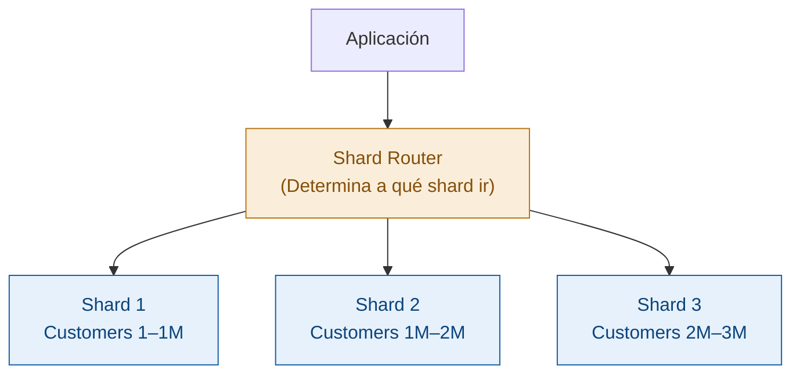

### Estrategias de Sharding — la decisión más crítica

Elegir la shard key incorrecta es un error que cuesta millones corregir. Esta decisión define la distribución de carga y la eficiencia de las queries.

#### Range-based Sharding

Divide los datos en rangos continuos de la shard key.

```
Shard 1: CustomerId 1 – 1,000,000
Shard 2: CustomerId 1,000,001 – 2,000,000
Shard 3: CustomerId 2,000,001 – 3,000,000
```

**Ventaja:** Range scans son eficientes — una query por rango probablemente va a un solo shard.
**Problema crítico:** Hotspots. Si los usuarios nuevos siempre tienen IDs altos, el último shard recibe todos los writes de nuevos usuarios mientras los demás están casi inactivos. Los IDs secuenciales son el enemigo del range-based sharding.

#### Hash-based Sharding

La shard key se pasa por una función hash, y el hash determina el shard.

```
shard_number = hash(CustomerId) % num_shards
```

**Ventaja:** Distribución uniforme — cualquier shard puede recibir writes.
**Problema:** Range scans son ineficientes — una query por rango tiene que ir a todos los shards (scatter-gather).

#### Consistent Hashing

Una variante más sofisticada del hash-based sharding que resuelve el problema de redistribución cuando agregas o quitas shards. En hash-based simple, cambiar el número de shards requiere remapear casi todos los datos. Consistent hashing minimiza ese remapeo.

Es el algoritmo usado por Cassandra, DynamoDB y muchos sistemas distribuidos modernos.

```
Concepto visual:
- Los shards y los datos se mapean a puntos en un "ring" circular
- Cada dato va al primer shard que encuentra en el ring en sentido horario
- Agregar un shard solo afecta a los datos entre ese shard y el anterior en el ring
```

#### Directory-based Sharding

Un servicio de lookup mantiene un mapa explícito: qué datos están en qué shard.

**Ventaja:** Máxima flexibilidad — puedes mover datos entre shards sin cambiar la lógica de sharding.
**Problema:** El directorio es un punto único de fallo y un cuello de botella (aunque puede cachearse).

### Los problemas que introduce el sharding

Sharding no es gratis — agrega complejidad significativa:

**1. Cross-shard queries:** Una query que necesita datos de múltiples shards tiene que hacer scatter-gather: enviar la query a todos los shards y combinar resultados. Costoso y lento.

**2. Cross-shard transactions:** Las transacciones ACID entre shards requieren protocolos complejos como 2-Phase Commit (2PC), que son lentos y tienen riesgos de bloqueo.

**3. Joins entre entidades en diferentes shards:** Si Customer y Orders están en shards diferentes, el JOIN tiene que traer datos de ambos shards a la aplicación.

**4. Resharding:** Cuando necesitas agregar shards porque uno se llenó, redistribuir los datos es complejo y disruptivo.

**La implicación para System Design:** En entrevistas Staff, cuando propones sharding, el entrevistador va a preguntarte: "¿cuál es tu shard key y por qué?" y "¿cómo manejas las cross-shard queries?". Tener una respuesta bien pensada es lo que separa una propuesta Staff de una Senior.

### Sharding en Azure — Elastic Scale

Azure SQL Database tiene soporte nativo de sharding a través de la **Elastic Database Client Library** y **Elastic Database Pools**.

```csharp
// Azure SQL Elastic Scale — shard map management
var shardMapManager = ShardMapManagerFactory.GetSqlShardMapManager(
    connectionString, ShardMapManagerLoadPolicy.Eager);

var rangeMap = shardMapManager.GetRangeShardMap<int>("OrdersShardMap");

// Routing automático: dado CustomerId, encuentra el shard correcto
using var conn = rangeMap.OpenConnectionForKey(
    customerId, connectionString, ConnectionOptions.Validate);
```

---

## 13. Connection Pooling

### El problema sin connection pooling

Crear una conexión a una base de datos no es gratis. Implica:
- Establecer conexión TCP/IP
- Autenticar el usuario
- Negociar configuraciones de sesión
- Asignar memoria en el servidor

Este proceso toma 50-200ms. En una aplicación web que recibe 1,000 requests por segundo, crear y destruir conexiones con cada request haría que la base de datos se volviera el cuello de botella inmediato — no por el trabajo real, sino solo por el overhead de conexión.

### Cómo funciona un connection pool

El pool mantiene un conjunto de conexiones ya establecidas y listas para usar. Cuando la aplicación necesita una conexión:
1. Solicita una del pool
2. El pool entrega una conexión disponible (en microsegundos)
3. La aplicación la usa
4. La "cierra" — en realidad, la devuelve al pool para reutilización

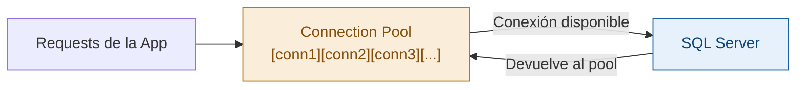

### Connection Pooling en .NET — System.Data.SqlClient / Microsoft.Data.SqlClient

.NET tiene connection pooling integrado en el driver. Por default está habilitado y configurado razonablemente. Las conexiones se poolean por **connection string** — dos connection strings idénticas comparten el mismo pool.

```csharp
// Esto NO crea una nueva conexión física — obtiene una del pool
using var connection = new SqlConnection(connectionString);
await connection.OpenAsync();

// Esto NO cierra la conexión física — la devuelve al pool
// el using statement llama a Dispose/Close automáticamente
```

**Parámetros clave del connection string:**

```
Server=myserver;Database=mydb;User Id=user;Password=pass;
Min Pool Size=5;          -- Conexiones mínimas siempre abiertas (default: 0)
Max Pool Size=100;        -- Conexiones máximas en el pool (default: 100)
Connection Lifetime=300;  -- Segundos antes de reciclar una conexión (default: 0 = nunca)
Connection Timeout=30;    -- Segundos para obtener una conexión del pool antes de error
Pooling=true;             -- Habilitado por default
```

### EF Core y Connection Pooling

EF Core gestiona el connection pooling automáticamente a través del `DbContext`. El `DbContext` abre la conexión cuando la necesita y la devuelve al pool cuando termina.

**El antipatrón más común en EF Core:** Registrar el `DbContext` como Singleton.

```csharp
// ❌ MAL — DbContext como Singleton
services.AddSingleton<AppDbContext>(); // Esto comparte una conexión entre todos los requests

// ✅ BIEN — DbContext como Scoped (default correcto para web apps)
services.AddDbContext<AppDbContext>(options =>
    options.UseSqlServer(connectionString));
// Scoped = un DbContext por request HTTP
```

### El problema de connection pool exhaustion

Cuando todos los slots del pool están ocupados y llega una nueva solicitud, la aplicación espera hasta que se libera una conexión o hasta que expira el `Connection Timeout`. Si esto ocurre masivamente, la aplicación se degrada drásticamente.

**Causas comunes:**
1. **Conexiones que no se devuelven al pool:** `DbContext` que no se dispone correctamente (olvidar `using` o `Dispose`).
2. **Queries lentos que mantienen conexiones abiertas demasiado tiempo:** Un query que tarda 30 segundos mantiene una conexión ocupada todo ese tiempo.
3. **Max Pool Size muy bajo para el load:** Si tienes 200 requests concurrentes y Max Pool Size = 100, 100 requests van a esperar.
4. **Transacciones muy largas:** Una transacción que dura minutos mantiene la conexión bloqueada.

**Detectar y diagnosticar:**

```sql
-- SQL Server — ver conexiones activas y en espera
SELECT
    DB_NAME(dbid) as DatabaseName,
    COUNT(dbid) as ConnectionCount,
    loginame as LoginName
FROM sys.sysprocesses
WHERE dbid > 0
GROUP BY dbid, loginame;

-- Ver qué queries tienen conexiones abiertas por mucho tiempo
SELECT
    session_id,
    status,
    DATEDIFF(second, last_request_start_time, GETDATE()) as seconds_active,
    command,
    sql_handle
FROM sys.dm_exec_sessions
WHERE is_user_process = 1
ORDER BY seconds_active DESC;
```

```csharp
// En .NET — monitorear pool con eventos
SqlConnection.ClearAllPools(); // Emergencia: limpiar todo el pool (fuerza reconexión)

// Mejorar: usar resiliencia con Polly
services.AddDbContext<AppDbContext>(options =>
    options.UseSqlServer(connectionString, sqlOptions =>
        sqlOptions.EnableRetryOnFailure(
            maxRetryCount: 3,
            maxRetryDelay: TimeSpan.FromSeconds(5),
            errorNumbersToAdd: null)));
```

---

## 14. El Problema N+1 y Optimización de Queries

### El problema N+1 — el error más caro de EF Core

El problema N+1 ocurre cuando cargas una lista de N entidades y luego, para cada una, ejecutas una query adicional para obtener datos relacionados. El resultado: 1 query para la lista + N queries para los detalles = N+1 queries en total.

```csharp
// ❌ Problema N+1
var customers = await context.Customers.ToListAsync(); // 1 query

foreach (var customer in customers) // Para 100 clientes:
{
    var orders = await context.Orders  // 100 queries adicionales!
        .Where(o => o.CustomerId == customer.CustomerId)
        .ToListAsync();

    Console.WriteLine($"{customer.Name}: {orders.Count} orders");
}
// Total: 101 queries para 100 clientes
```

```csharp
// ✅ Solución con Include (JOIN)
var customers = await context.Customers
    .Include(c => c.Orders)  // 1 query con JOIN
    .ToListAsync();

foreach (var customer in customers)
{
    Console.WriteLine($"{customer.Name}: {customer.Orders.Count} orders");
}
// Total: 1 query
```

### Select N+1 vs Include — el trade-off

`Include` no siempre es la respuesta correcta. Si cargas 1,000 clientes con `.Include(c => c.Orders)` y cada cliente tiene 500 órdenes, estás cargando 500,000 órdenes en memoria — probablemente mucho más de lo que necesitas.

```csharp
// Para proyecciones específicas — más eficiente que Include completo
var result = await context.Customers
    .Select(c => new
    {
        c.Name,
        OrderCount = c.Orders.Count,
        LatestOrder = c.Orders.OrderByDescending(o => o.OrderDate).FirstOrDefault()
    })
    .ToListAsync();
// Solo trae los datos que necesitas, no todas las órdenes completas
```

### Lazy Loading vs Eager Loading vs Explicit Loading

**Lazy Loading:** Las relaciones se cargan automáticamente cuando se acceden por primera vez. Conveniente pero peligroso — puede causar N+1 sin que lo veas.

```csharp
// Habilitar Lazy Loading (requiere proxies)
services.AddDbContext<AppDbContext>(options =>
    options.UseSqlServer(connectionString)
           .UseLazyLoadingProxies()); // ⚠️ Cuidado con N+1

// Con lazy loading habilitado:
var customer = await context.Customers.FindAsync(1);
var count = customer.Orders.Count; // Dispara una query automáticamente al acceder
```

**Eager Loading:** Cargas las relaciones explícitamente con `.Include()`. Más verboso pero controlado.

**Explicit Loading:** Cargas relaciones de forma explícita cuando las necesitas.

```csharp
var customer = await context.Customers.FindAsync(1);
// Solo carga las órdenes cuando las necesitas explícitamente
await context.Entry(customer).Collection(c => c.Orders).LoadAsync();
```

**Recomendación para producción:** Deshabilita el Lazy Loading en aplicaciones serias. El N+1 silencioso es demasiado costoso de detectar. Usa Eager Loading explícito o proyecciones.

### Queries que golpean el performance — y cómo detectarlos

**SQL Server Profiler / Extended Events:**
```sql
-- Ver queries lentos con Extended Events
CREATE EVENT SESSION [SlowQueries] ON SERVER
ADD EVENT sqlserver.sql_statement_completed(
    ACTION (sqlserver.sql_text, sqlserver.plan_handle)
    WHERE duration > 1000000  -- más de 1 segundo (en microsegundos)
)
ADD TARGET package0.ring_buffer;
```

**EF Core Logging en desarrollo:**
```csharp
services.AddDbContext<AppDbContext>(options =>
    options.UseSqlServer(connectionString)
           .LogTo(Console.WriteLine, LogLevel.Information)  // Ver todos los SQL generados
           .EnableSensitiveDataLogging()  // Ver los valores de los parámetros
           .EnableDetailedErrors());
```

**Interceptores de EF Core para monitorear en producción:**
```csharp
public class SlowQueryInterceptor : DbCommandInterceptor
{
    private static readonly TimeSpan SlowQueryThreshold = TimeSpan.FromSeconds(1);

    public override async ValueTask<DbDataReader> ReaderExecutedAsync(
        DbCommand command,
        CommandExecutedEventData eventData,
        DbDataReader result,
        CancellationToken cancellationToken = default)
    {
        if (eventData.Duration > SlowQueryThreshold)
        {
            // Log a tu sistema de observabilidad
            Log.Warning("Slow query detected: {Duration}ms\n{SQL}",
                eventData.Duration.TotalMilliseconds,
                command.CommandText);
        }
        return result;
    }
}

// Registrar el interceptor
services.AddDbContext<AppDbContext>(options =>
    options.UseSqlServer(connectionString)
           .AddInterceptors(new SlowQueryInterceptor()));
```

### Otras optimizaciones críticas en EF Core

**AsNoTracking — para reads que no van a modificar datos:**
```csharp
// ✅ Para queries de solo lectura — hasta 2-3x más rápido
var orders = await context.Orders
    .AsNoTracking()
    .Where(o => o.Status == "Pending")
    .ToListAsync();
// Sin tracking, EF no mantiene estado de los objetos → menos memoria y CPU
```

**Split Queries — para evitar el producto cartesiano en Include múltiples:**
```csharp
// Si incluyes múltiples colecciones, puedes obtener un producto cartesiano enorme
// ❌ Puede traer muchos datos duplicados
var orders = await context.Orders
    .Include(o => o.Items)
    .Include(o => o.Tags)
    .ToListAsync();

// ✅ Split Query — ejecuta queries separadas para cada colección
var orders = await context.Orders
    .Include(o => o.Items)
    .Include(o => o.Tags)
    .AsSplitQuery()
    .ToListAsync();
```

**Raw SQL cuando EF no genera el query correcto:**
```csharp
// Para queries complejos que EF no puede generar eficientemente
var topCustomers = await context.Customers
    .FromSqlRaw(@"
        SELECT TOP 10 c.*,
               COUNT(o.OrderId) as OrderCount,
               SUM(o.Total) as TotalSpent
        FROM Customers c
        JOIN Orders o ON c.CustomerId = o.CustomerId
        WHERE o.OrderDate >= @StartDate
        GROUP BY c.CustomerId, c.Name
        ORDER BY TotalSpent DESC",
        new SqlParameter("@StartDate", startDate))
    .ToListAsync();
```

---

## 15. EF Core a Profundidad

### El Change Tracker — cómo funciona realmente

Cuando cargas entidades con EF Core, el `DbContext` registra cada entidad en su **Change Tracker** con su estado inicial. Al llamar `SaveChanges()`, el Change Tracker compara el estado actual con el estado inicial y genera los SQL necesarios (INSERT, UPDATE, DELETE).

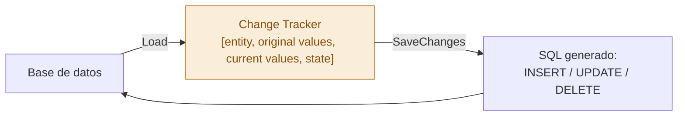

**Estados del Change Tracker:**
- `Added` — será INSERT en SaveChanges
- `Modified` — será UPDATE en SaveChanges
- `Deleted` — será DELETE en SaveChanges
- `Unchanged` — no genera SQL
- `Detached` — no es tracked, no genera nada

```csharp
var order = await context.Orders.FindAsync(orderId);
// Estado: Unchanged

order.Status = "Shipped";
// Estado: Modified — EF detectó el cambio

context.Entry(order).State = EntityState.Detached; // Desconectar del tracker
```

**El costo del Change Tracker:** Cada entidad tracked consume memoria. En queries que devuelven miles de entidades que nunca vas a modificar, el overhead del tracking es significativo. Usa `AsNoTracking()` siempre que puedas.

### Concurrencia Optimista en EF Core

Cuando múltiples usuarios intentan modificar el mismo registro, puedes usar concurrencia optimista para detectar conflictos sin bloquear.

```csharp
// Modelo con RowVersion para concurrencia optimista
public class Product
{
    public int ProductId { get; set; }
    public string Name { get; set; }
    public decimal Price { get; set; }

    [Timestamp]
    public byte[] RowVersion { get; set; }  // SQL Server actualiza esto automáticamente
}

// Manejo del conflicto
public async Task UpdateProductPriceAsync(int productId, decimal newPrice)
{
    try
    {
        var product = await context.Products.FindAsync(productId);
        product.Price = newPrice;
        await context.SaveChangesAsync();
    }
    catch (DbUpdateConcurrencyException ex)
    {
        // Otro usuario modificó el registro entre que lo leímos y que intentamos guardar
        var entry = ex.Entries.Single();
        var databaseValues = await entry.GetDatabaseValuesAsync();

        if (databaseValues == null)
        {
            // El registro fue eliminado por otro usuario
            throw new InvalidOperationException("El producto ya no existe.");
        }

        // Estrategia: el último gana (sobrescribir)
        entry.OriginalValues.SetValues(databaseValues);
        await context.SaveChangesAsync();

        // Alternativa: el primero gana (lanzar error al usuario)
        throw new ConflictException("Otro usuario modificó este producto. Recarga y reintenta.");
    }
}
```

### Migrations — buenas prácticas para producción

```bash
# Crear una migration
dotnet ef migrations add AddOrderStatusIndex

# Ver el SQL que se va a ejecutar (revisar SIEMPRE antes de aplicar en producción)
dotnet ef migrations script LastMigration NewMigration

# Aplicar en producción — preferible hacerlo desde el startup
# context.Database.Migrate() en Program.cs (con precaución)
```

**Reglas de oro para migrations en producción:**

1. **Nunca hagas `Database.EnsureCreated()` en producción** — solo para desarrollo/testing
2. **Revisa el SQL generado antes de aplicar** — EF puede generar operaciones destructivas
3. **Las migrations son irreversibles en la práctica** — el `Down()` rara vez funciona bien en producción
4. **Columnas con NOT NULL:** Agregar una columna NOT NULL sin default value en una tabla con datos existentes fallará. Siempre agrega primero como nullable, migra los datos, luego cambia a NOT NULL.
5. **Renombrar una columna** — EF genera DROP + ADD, no RENAME. Pierdes los datos. Usa métodos explícitos:

```csharp
migrationBuilder.RenameColumn(
    name: "OldName",
    table: "Orders",
    newName: "NewName");
```

> 🎓 **Pluralsight ahora:** Para profundizar en EF Core performance y patrones avanzados, el curso **"Entity Framework Core in the Enterprise"** de Rowan Miller en Pluralsight cubre estos temas con escenarios reales de producción.

---

## 16. Comparativa de Motores

### SQL Server vs PostgreSQL — los dos gigantes relacionales

| Criterio | SQL Server | PostgreSQL |
|---|---|---|
| **Licenciamiento** | Comercial (costoso en Enterprise) | Open source (gratis) |
| **Plataforma** | Windows-first (Linux desde 2017) | Linux-first, Windows soportado |
| **Ecosistema .NET** | Primera clase — Microsoft lo hace | Muy bueno — drivers maduros (Npgsql) |
| **JSON support** | Bueno (JSON functions desde 2016) | Excelente (JSONB nativo, indexable) |
| **Full-text search** | Bueno (SQL Server FTS) | Muy bueno (tsvector, tsquery nativo) |
| **Extensions** | Limitado | Riquísimo (PostGIS, TimescaleDB, pgvector) |
| **MVCC / Concurrencia** | Read Committed Snapshot (opt-in) | MVCC nativo en todos los niveles |
| **Window functions** | Completo | Completo + más avanzado |
| **Partitioning** | Bueno (table partitioning) | Excelente (declarative partitioning) |
| **Azure managed** | Azure SQL Database | Azure Database for PostgreSQL (Flexible Server) |
| **Herramientas** | SSMS, Azure Data Studio | pgAdmin, DBeaver |
| **Curva de aprendizaje** | Más suave para devs .NET | Ligeramente más técnico |

**¿Cuándo elegir SQL Server?**
- Ecosistema Microsoft puro (.NET + Azure + Active Directory)
- Equipo ya familiarizado con SQL Server
- Necesitas Always On, SSRS, SSIS en el stack
- Cliente corporativo que ya paga licencias EA de Microsoft

**¿Cuándo elegir PostgreSQL?**
- Quieres evitar el lock-in de licencias
- Necesitas extensiones especializadas (PostGIS para geoespacial, TimescaleDB para series temporales, pgvector para AI)
- El equipo es cross-platform
- Workloads mixtos (OLTP + JSON semi-estructurado)

### Azure Cosmos DB — cuándo tiene sentido de verdad

CosmosDB es el servicio de base de datos globalmente distribuido de Azure. Es costoso y tiene trade-offs específicos que la gente ignora cuando lo adopta.

**Las garantías únicas de CosmosDB:**
- **Multi-region writes:** escribes en cualquier región del mundo y está disponible globalmente
- **99.999% SLA** (cinco nueves) — el más alto del mercado
- **Latencia garantizada por contrato:** < 10ms en p99 para reads, < 15ms para writes (con datos cacheados)
- **Cinco niveles de consistencia configurables** — desde Strong hasta Eventual

**Los cinco niveles de consistencia de CosmosDB:**

```
Strong ← Bounded Staleness ← Session ← Consistent Prefix ← Eventual
  ↑                                                               ↑
Más consistente                                         Más rendimiento
Más latencia                                            Más disponible
```

| Nivel | Garantía | Cuándo usarlo |
|---|---|---|
| **Strong** | Linearizabilidad — lee siempre lo más reciente | Datos financieros críticos, inventario |
| **Bounded Staleness** | Máximo K versiones o T segundos de lag | Cuando toleras poco lag controlado |
| **Session** | Consistent para la sesión del cliente | Default recomendado — 99% de los casos |
| **Consistent Prefix** | Nunca lees en orden incorrecto, pero puede ser stale | Redes sociales, comentarios |
| **Eventual** | Sin garantía de orden, máximo rendimiento | Métricas aproximadas, likes, vistas |

**Cuándo CosmosDB tiene sentido:**
- Aplicación verdaderamente global que necesita writes en múltiples regiones
- SLA de 99.999% es un requisito de negocio real
- El modelo de datos es document-oriented y el patron de acceso es por partition key
- Tienes budget para pagarlo (es significativamente más caro que Azure SQL)

**Cuándo CosmosDB NO tiene sentido (y la gente lo usa igual):**
- Tu aplicación es de una sola región — Azure SQL es más simple y más barato
- Necesitas JOINs frecuentes — CosmosDB los cobra extra en RUs y son costosos
- Tu equipo no entiende el modelo de Request Units (RUs) — mal aprovisionamiento destruye el presupuesto
- Solo usas la API SQL de CosmosDB con un modelo normalizado — estás pagando el costo de NoSQL sin el beneficio

> ⚠️ **El error de CosmosDB más caro en producción:** No entender el modelo de RUs (Request Units). CosmosDB cobra por operación en RUs, y una query que hace cross-partition scan puede consumir miles de RUs vs. una query que va directo a la partition key. El aprovisionamiento incorrecto de RUs puede resultar en facturas de Azure 10-100x lo esperado.

---

## 17. Bases de Datos en Azure

### El catálogo de servicios

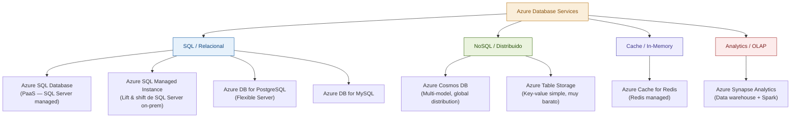

### Azure SQL Database — tiers y cuándo usar cada uno

**Purchasing model — DTU vs vCore:**

El modelo DTU (Database Transaction Unit) es más simple pero menos flexible. El modelo vCore es más predecible y permite controlar CPU, RAM y storage independientemente. **Para aplicaciones nuevas, siempre vCore.**

**Service tiers en vCore:**

| Tier | Storage | Max IOPS | HA | Cuándo usarlo |
|---|---|---|---|---|
| **General Purpose** | 1GB–4TB | 7000 | 1 réplica (HA con storage redundante) | La mayoría de aplicaciones business |
| **Business Critical** | 1GB–4TB | 200,000+ | 4 réplicas Always On, in-memory OLTP | Apps críticas que necesitan latencia ultra-baja y failover segundos |
| **Hyperscale** | 1GB–100TB | Depende del tier | 2 réplicas | Bases de datos muy grandes con crecimiento impredecible |

**Serverless — para workloads intermitentes:**
```
Azure SQL Database Serverless:
- Auto-pausa cuando no hay actividad (ahorras cuando no usas)
- Auto-escala de compute según demanda
- Costo: pagas por vCore-segundo cuando está activo
- Problema: cold start de ~30-60 segundos después de pausa
- Úsalo: para desarrollo, staging, apps con uso impredecible
- No lo uses: para producción con SLA de disponibilidad
```

### Configuraciones críticas en Azure SQL

```sql
-- Habilitar Query Store (monitoreo de performance histórico)
ALTER DATABASE MyDatabase SET QUERY_STORE = ON;
ALTER DATABASE MyDatabase SET QUERY_STORE (
    OPERATION_MODE = READ_WRITE,
    CLEANUP_POLICY = (STALE_QUERY_THRESHOLD_DAYS = 30),
    DATA_FLUSH_INTERVAL_SECONDS = 3000,
    INTERVAL_LENGTH_MINUTES = 60,
    MAX_STORAGE_SIZE_MB = 1000
);

-- Configurar Automatic Tuning (Azure SQL recomienda y aplica índices automáticamente)
ALTER DATABASE MyDatabase SET AUTOMATIC_TUNING (
    FORCE_LAST_GOOD_PLAN = ON,  -- Revierte a plan anterior si el nuevo es peor
    CREATE_INDEX = ON,           -- Crea índices automáticamente si detecta beneficio
    DROP_INDEX = ON              -- Elimina índices no usados
);
```

### Connection resilience en Azure

Las conexiones a Azure SQL pueden fallar por mantenimiento, failover, o throttling. Siempre configura retry:

```csharp
// EF Core con retry automático para Azure SQL
services.AddDbContext<AppDbContext>(options =>
    options.UseSqlServer(connectionString, sqlOptions =>
    {
        sqlOptions.EnableRetryOnFailure(
            maxRetryCount: 5,
            maxRetryDelay: TimeSpan.FromSeconds(30),
            errorNumbersToAdd: null); // null = usa los errores transientes default
    }));
```

> 🎓 **Pluralsight ahora:** El curso **"Microsoft Azure SQL Database"** de Leonard Lobel cubre la configuración, monitoring, y tuning de Azure SQL en profundidad. Úsalo después de leer esta sección para ver los portales y herramientas en acción.

---

## 18. Patrones de Arquitectura con Bases de Datos

### CQRS y bases de datos — separar reads de writes

CQRS (Command Query Responsibility Segregation) separa los modelos de lectura y escritura. Aplicado a bases de datos, permite usar diferentes modelos de datos, motores, o incluso schemas para reads y writes.

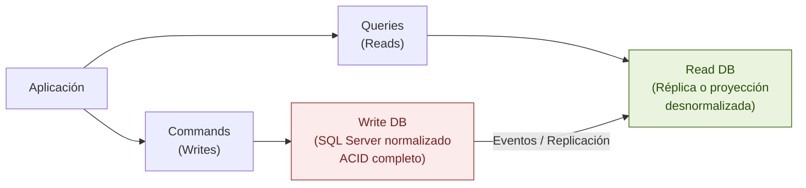

**El beneficio real:** El modelo de lectura puede estar optimizado específicamente para las queries (desnormalizado, con las columnas exactas que necesitas), mientras el modelo de escritura garantiza consistencia. No tienes que comprometer el schema para satisfacer ambos requisitos.

### Outbox Pattern — transaccionalidad con eventos

Un problema clásico: quieres guardar datos Y publicar un evento, de forma atómica. Si guardas y el mensaje falla, tu sistema queda inconsistente.

```csharp
// ❌ No atómico — pueden guardarse datos sin que se publique el evento
await context.Orders.AddAsync(order);
await context.SaveChangesAsync(); // Si esto pasa...
await messagebus.PublishAsync(new OrderCreatedEvent(order.OrderId)); // ...y esto falla, inconsistencia

// ✅ Outbox Pattern — la publicación del evento es parte de la transacción
public class Order { ... }
public class OutboxMessage {
    public Guid Id { get; set; }
    public string EventType { get; set; }
    public string Payload { get; set; }
    public DateTime CreatedAt { get; set; }
    public DateTime? ProcessedAt { get; set; }
}

// En la misma transacción
using var transaction = await context.Database.BeginTransactionAsync();
await context.Orders.AddAsync(order);
await context.OutboxMessages.AddAsync(new OutboxMessage {
    EventType = "OrderCreated",
    Payload = JsonSerializer.Serialize(new OrderCreatedEvent(order.OrderId))
});
await context.SaveChangesAsync();
await transaction.CommitAsync();

// Un background worker lee el outbox y publica los mensajes
// Si falla, reintenta — at-least-once delivery garantizado
```

### Database per Service — en microservices

En arquitecturas de microservices, cada servicio debe tener su propia base de datos. Ningún servicio accede directamente a la base de datos de otro.

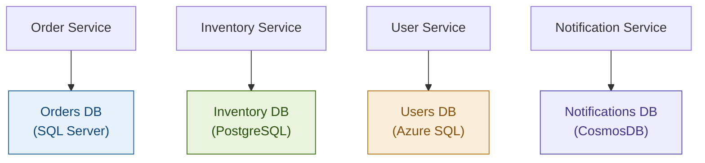

**Por qué importa:** Si los servicios comparten base de datos, están acoplados en el nivel de schema. Un cambio en una tabla que usa el Servicio A puede romper el Servicio B. La independencia del schema permite que cada equipo evolucione su modelo de datos sin coordinación.

**El problema resultante:** Ya no puedes hacer JOINs entre datos de diferentes servicios. La solución es usar eventos o API calls para componer los datos en la capa de aplicación.

---

## 19. Preguntas de Entrevista y Respuestas Modelo

### Pregunta 1: "¿Cuándo usarías NoSQL sobre SQL?"

**Respuesta nivel promedio:** "Cuando los datos no son estructurados o cuando necesitas escalar."

**Respuesta nivel Staff:**

"La decisión entre SQL y NoSQL depende de tres factores: los patrones de acceso, las garantías de consistencia necesarias, y el modelo de datos.

Elegiría NoSQL cuando el modelo de datos es naturalmente jerárquico o de documentos y el acceso principal es por el ID del documento — como un perfil de usuario con sus preferencias, donde siempre accedes al perfil completo. Un document store evita los JOINs costosos que tendrías en SQL.

Elegiría un key-value store como Redis cuando necesito latencia submilisegundo para datos que caben en RAM: cache de sesiones, rate limiting, leaderboards.

Elegiría Cassandra cuando tengo writes masivos y el patrón de acceso es predecible por una partition key — típico en series temporales de IoT o métricas.

Sin embargo, hay trade-offs importantes que muchos ignoran: los stores NoSQL generalmente sacrifican transacciones ACID cross-documento o cross-partición. Si necesito garantías ACID fuertes entre múltiples entidades relacionadas, SQL sigue siendo la herramienta correcta. Y antes de ir a NoSQL, siempre pregunto: ¿hemos agotado las opciones de optimización en SQL? Muchos problemas que parecen requerir NoSQL se resuelven con buenos índices y read replicas."

### Pregunta 2: "Explícame cómo funcionan los índices"

**Respuesta nivel Staff:**

"Un índice es una estructura de datos separada, generalmente un B-Tree, que mantiene los valores de una o más columnas ordenados y con punteros a los registros reales de la tabla.

El B-Tree permite búsquedas en O(log n) porque es un árbol balanceado donde todos los nodos hoja están al mismo nivel. Para una tabla de 1 millón de filas, el B-Tree tiene apenas 3-4 niveles de altura — lo que significa 3-4 lecturas de página para encontrar cualquier valor. Sin índice, son hasta 1 millón de lecturas en un table scan.

Hay dos tipos principales en SQL Server. El clustered index define el orden físico de los datos en disco — los datos de la tabla son el índice. Solo puede haber uno. El non-clustered index es una estructura separada que apunta al registro real.

Para decisiones de indexación, evalúo tres cosas: selectividad (columnas con pocos valores únicos como un boolean no se benefician de índice), el patrón de acceso (el orden de columnas en índices compuestos importa — primero las de igualdad, luego las de rango), y el costo en writes (cada índice adicional ralentiza los INSERTs y UPDATEs porque el motor debe actualizarlos).

Un concepto que uso frecuentemente en producción es el covering index: incluyo en el índice todas las columnas que una query frecuente necesita, para que el motor nunca tenga que ir a la tabla. Esto puede convertir una query con Key Lookups costosos en un Index Seek puro."

### Pregunta 3: "¿Qué es el CAP theorem y cómo afecta tus decisiones?"

**Respuesta nivel Staff:**

"El teorema CAP afirma que en un sistema distribuido solo puedes garantizar dos de tres propiedades simultáneamente: Consistencia (todos los nodos ven el mismo dato al mismo tiempo), Disponibilidad (el sistema siempre responde), y Tolerancia a Particiones (el sistema funciona aunque la red se fragmente entre nodos).

La tolerancia a particiones es prácticamente no negociable en sistemas distribuidos reales — las redes fallan. Entonces la decisión real es entre CP y AP.

Cuando elijo CP (consistency over availability): sistemas financieros, inventario crítico, cualquier lugar donde leer datos desactualizados tiene consecuencias de negocio graves. SQL Server con replicación síncrona, o ZooKeeper, son ejemplos.

Cuando elijo AP (availability over consistency): carritos de compra, redes sociales, contadores de likes, sistemas de recomendación. Un usuario puede tolerar que su like no aparezca en otra región por algunos segundos. DynamoDB en modo eventual y Cassandra son ejemplos típicos.

Lo que muchos omiten: el teorema CAP es binario pero la realidad es un espectro. CosmosDB ofrece cinco niveles de consistencia, permitiendo elegir exactamente el punto en el espectro que necesitas. En arquitecturas modernas, diferentes partes del sistema pueden usar diferentes niveles de consistencia según sus requisitos."

### Pregunta 4: "¿Cómo diagnosticarías un problema de performance en la base de datos de producción?"

**Respuesta nivel Staff:**

"Mi proceso tiene capas, de macro a micro.

Primero, métricas del servidor: CPU, IOPS, memoria utilizada por el buffer pool, hit ratio del buffer pool. Si el hit ratio es bajo (menos del 95%), el sistema está yendo a disco frecuentemente — puede ser falta de memoria o que los datos no tienen localidad de acceso.

Segundo, queries lentos: uso `sys.dm_exec_query_stats` o Query Store en SQL Server para encontrar los queries con mayor tiempo acumulado, mayor uso de CPU, o mayor IO. Estos son mis candidatos de optimización.

Tercero, para cada query problemático, reviso el plan de ejecución. Busco Table Scans en tablas grandes (falta de índice), Key Lookups frecuentes (índice no covering), Hash Joins con muchas filas (considero si necesito índices o reescribir la query), y Sort operators (¿hay índice que ya ordene los datos?).

Cuarto, reviso blocking y deadlocks: `sys.dm_exec_requests` para ver qué está esperando y por qué. Los deadlocks quedan registrados en Extended Events.

Quinto, si el problema persiste después de la optimización de queries, evalúo si el problema es de escala: ¿necesito read replicas para distribuir la carga de lectura? ¿Es necesario sharding? ¿El buffer pool es suficiente grande o necesito más RAM?

Lo que nunca hago: optimizar a ciegas. Cada cambio va acompañado de medición antes y después."

---

## 20. Checklist Final de Estudio y Práctica

### Fundamentos — no avances hasta tener estos claros

- [ ] Puedo explicar qué es una página de datos y por qué el tamaño de página importa para el performance
- [ ] Puedo dibujar un B-Tree en papel y explicar cómo se realiza una búsqueda
- [ ] Explico la diferencia entre clustered y non-clustered index con un ejemplo concreto
- [ ] Sé qué es un covering index y cuándo lo usaría
- [ ] Puedo explicar las cuatro propiedades ACID con el WAL como mecanismo de soporte
- [ ] Identifico las cuatro anomalías de concurrencia y cuál isolation level previene cada una
- [ ] Explico la diferencia entre MVCC y locking tradicional

### Intermedio — el nivel mínimo para entrevistas Senior

- [ ] Puedo leer un query plan en SSMS e identificar los operadores problemáticos
- [ ] Entiendo qué es parameter sniffing y cómo solucionarlo
- [ ] Puedo explicar replication lag y sus implicaciones en una aplicación web
- [ ] Conozco las cuatro familias NoSQL y puedo dar un caso de uso concreto para cada una
- [ ] Entiendo el problema N+1 y puedo identificarlo en código EF Core
- [ ] Sé por qué los GUIDs son malos como clustered index y cómo mitigarlo
- [ ] Puedo explicar connection pool exhaustion y sus causas

### Avanzado — nivel Staff/Arquitecto

- [ ] Puedo diseñar una estrategia de sharding para un sistema dado, justificando la shard key
- [ ] Explico el CAP theorem y cómo afecta la elección de base de datos en un sistema distribuido
- [ ] Puedo comparar SQL Server, PostgreSQL y CosmosDB con trade-offs reales según el contexto
- [ ] Diseño un esquema considerando tanto el modelo de datos como los patrones de acceso
- [ ] Puedo argumentar cuándo desnormalizar y cuándo no, con criterios medibles
- [ ] Entiendo consistent hashing y por qué importa en sistemas distribuidos
- [ ] Puedo diseñar el database layer de un sistema completo en una entrevista de System Design

### Ejercicios prácticos recomendados

1. **Ejercicio de índices:** Toma una tabla de tu proyecto con 100K+ registros. Ejecuta tus queries más frecuentes SIN índices (guarda el plan). Agrega los índices correctos. Compara los planes y los tiempos. Aprende a leer las diferencias.

2. **Ejercicio de deadlock:** Crea dos stored procedures que acceden a dos tablas en orden diferente. Ejecútalos concurrentemente y provoca un deadlock. Luego, corrígelo cambiando el orden de acceso.

3. **Ejercicio de N+1:** En EF Core, carga una lista de entidades con sus relaciones usando lazy loading (con logging habilitado). Cuenta cuántas queries se ejecutan. Ahora usa Include y compara.

4. **Ejercicio de isolation levels:** Escribe dos transacciones concurrentes que demuestren un Non-Repeatable Read en Read Committed. Luego demuestra que no ocurre en Repeatable Read.

5. **Ejercicio de NoSQL:** Diseña el esquema de una aplicación de red social en:
   - PostgreSQL (modelo relacional)
   - MongoDB (document store)
   - Cassandra (basado en queries específicos: "timeline del usuario", "posts de los últimos 7 días")
   Compara los trade-offs de cada diseño.

### Recursos de plataformas — plan de estudio completo

> 🎓 **Pluralsight — secuencia recomendada:**
> 1. **"SQL Server: Optimizing Queries with Indexes"** — después de secciones 4-5 de esta guía
> 2. **"Microsoft Azure SQL Database"** — después de secciones 16-17
> 3. **"PostgreSQL: Getting Started"** — para entender las diferencias con SQL Server
> 4. **"Redis for Developers"** — después de la sección de Key-Value stores

> 🎓 **Educative — cuándo usar:**
> - Después de terminar esta guía completa, los cursos de **"Grokking the System Design Interview"**
>   te pedirán decidir bases de datos para sistemas completos. Esta guía te da el vocabulario
>   y los criterios para esas decisiones.
> - El módulo de "Databases" dentro de ese curso complementa perfectamente lo aprendido aquí.

---

*Guía generada como parte del plan de entrenamiento Staff/Arquitecto*
*Versión 1.0 — Complementa: [[roadmap_zero_to_hero_updated]], [[guia_dotnet_arquitectura_patrones_expanded]]*
