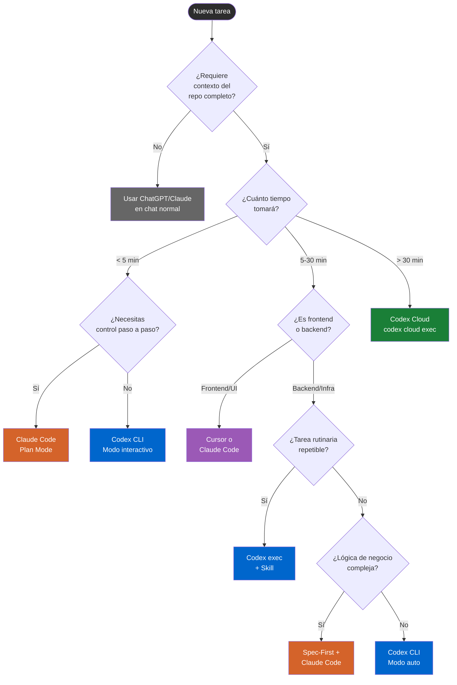
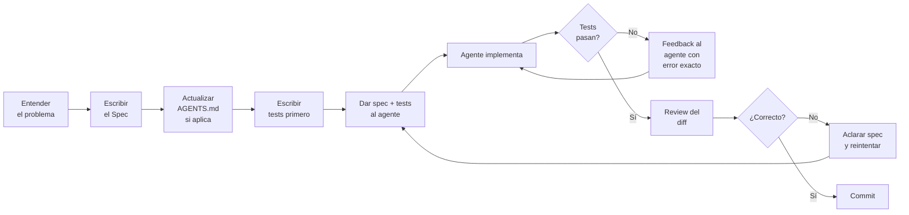
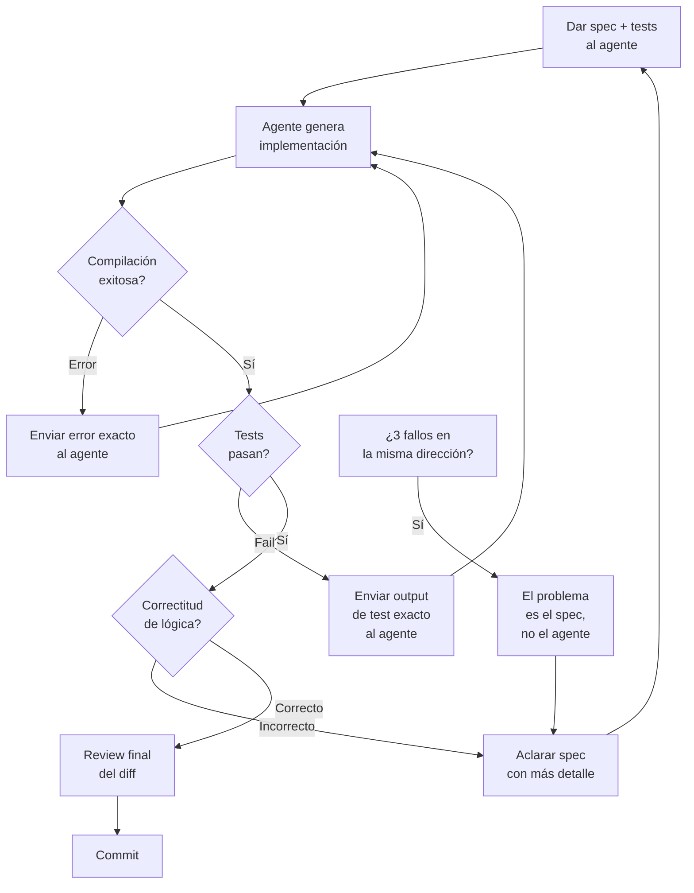
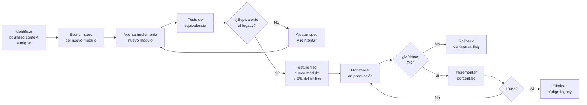
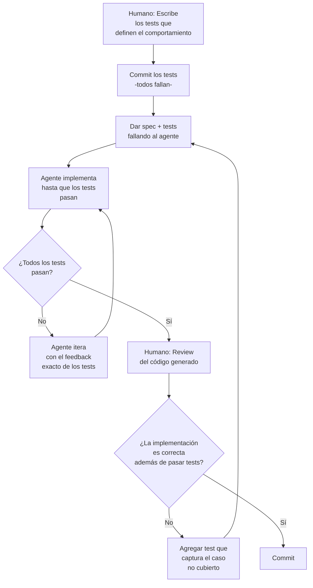
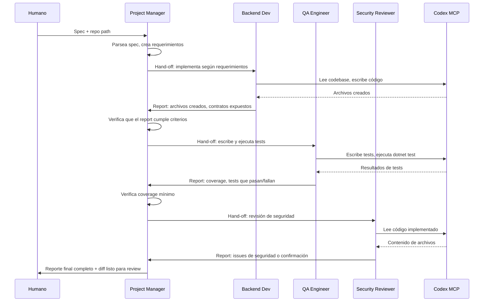

# El Desarrollador Aumentado: Guía Maestra de Flujo de Trabajo Diario con Agentes de IA — Edición 2026

> **Para quién es esta guía**: Senior Engineers y Staff Engineers que ya saben programar y quieren dejar de usar la IA como un buscador glorificado para empezar a usarla como lo que es en 2026: un colaborador autónomo que puede manejar la implementación mientras tú manejas la arquitectura.
>
> **Qué no encontrarás aquí**: teoría sobre "el futuro de la IA", tutoriales de cómo instalar un IDE, ni motivación. Solo flujos de trabajo ejecutables.

---

## Índice

- [Capítulo 0 — El Mapa del Territorio 2026](#capítulo-0)
- [Capítulo 1 — Filosofía del Desarrollador Aumentado](#capítulo-1)
- [Capítulo 2 — Configuración Permanente del Entorno del Agente](#capítulo-2)
- [Capítulo 3 — El Flujo de Trabajo Diario](#capítulo-3)
- [Capítulo 4 — Calidad, Testing y Seguridad No-Opcionales](#capítulo-4)
- [Capítulo 5 — Multi-Agent y Escala](#capítulo-5)
- [Apéndice A — Plantillas AGENTS.md](#apéndice-a)
- [Apéndice B — Plantillas CLAUDE.md](#apéndice-b)
- [Apéndice C — Tabla Comparativa 2026](#apéndice-c)
- [Apéndice D — Checklists Listos para Usar](#apéndice-d)

---

<a id="capítulo-0"></a>
# Capítulo 0 — El Mapa del Territorio 2026

## 0.1 El ecosistema real, sin marketing

En 2026 el ecosistema de agentes de código se divide en tres categorías. Entender dónde cae cada herramienta es la primera decisión que tomas cada mañana.

**Categoría 1 — Agentes CLI de primera clase** (el foco de esta guía):
- **Codex CLI** (OpenAI) — open-source, escrito en Rust, modelo gpt-5.4 por defecto
- **Claude Code** (Anthropic) — propietario, Node.js, multi-surface (terminal, VS Code, JetBrains, Desktop, Web)

**Categoría 2 — Extensiones de IDE con capacidades agénticas**:
- **GitHub Copilot Workspace** — integrado en GitHub, fuerte en contexto de PRs
- **Cursor** — fork de VS Code con agente integrado, excelente UX para devs frontend
- **Windsurf** — alternativa a Cursor, enfocado en Cascade (su motor agéntico)

**Categoría 3 — Herramientas de orquestación y ecosistema**:
- **Antigravity** — colección de 1,234+ Skills cross-compatible, instala con `npx antigravity-awesome-skills --claude`
- **Gemini CLI** — CLI de Google, compatible con formato SKILL.md estándar
- **Warp** — terminal con IA integrada, complementa a cualquier agente CLI

> ⚠️ **Advertencia de productividad**: Instalar múltiples herramientas de esta lista sin un decision framework claro garantiza que uses todas a medias. Define tu stack principal antes de continuar leyendo.

## 0.2 Codex — La plataforma completa (no solo el CLI)

Codex no es solo un comando de terminal. En 2026 es una plataforma con múltiples superficies que comparten el mismo contexto:

### Codex CLI (primario de esta guía)
```bash
# Instalación
npm i -g @openai/codex
# o
brew install --cask codex

# Modo interactivo (TUI)
codex

# Modo no-interactivo / scripteable
codex exec "refactoriza el módulo de autenticación para usar JWT"

# Lanzar tarea en la nube desde el terminal
codex cloud exec --env ENV_ID "Implementa la feature X según el spec en docs/spec-x.md"

# Con intentos múltiples (best-of-N)
codex cloud exec --env ENV_ID --attempts 3 "Corrige el bug en el módulo de pagos"
```

### Codex en el IDE (extensiones oficiales)
- **VS Code**: extensión oficial de Codex, acceso al agente cloud sin salir del editor
- **JetBrains (Rider, IntelliJ, etc.)**: plugin oficial, misma experiencia que VS Code
- **Cursor / Windsurf**: compatible via configuración de modelo personalizado

### Codex Desktop App
```bash
# Lanzar la app desktop desde el terminal
codex app
```
La app desktop incluye worktrees integrados y entornos en la nube para trabajo paralelo. Es el hub de control para trabajo agéntico pesado.

### Codex Cloud (asíncrono)
Accesible en `chatgpt.com/codex`. Cada tarea corre en su propio contenedor aislado precargado con tu repositorio. Ideal para:
- Tareas que tardan más de 15 minutos
- Trabajo que quieres revisar al volver del almuerzo
- Generar múltiples soluciones alternativas (flag `--attempts`)

### Antigravity — El ecosistema de Skills
```bash
# Instalar colección completa de Skills para Codex y Claude Code
npx antigravity-awesome-skills --claude

# Instalar un skill específico
npx skills add anthropics/claude-code --skill frontend-design

# Listar skills instalados
npx skills list
```

## 0.3 Tabla comparativa completa

| Dimensión | Codex CLI | Codex Cloud | Claude Code | GitHub Copilot WS | Cursor |
|---|---|---|---|---|---|
| **Filosofía** | Fire-and-forget autónomo | Asíncrono aislado | Collaborative step-by-step | PR-centric | UX-first IDE |
| **Modo aprobación** | Auto, semi-auto, manual | Revisión al final | Plan Mode por paso | Por chunk | Por chunk |
| **Contexto permanente** | `AGENTS.md` | `AGENTS.md` | `CLAUDE.md` | `.github/copilot-instructions.md` | `.cursorrules` |
| **Subagentes** | Sí (config.toml) | Sí (nativo cloud) | Sí (Dispatch) | No | No |
| **Modelo recomendado** | gpt-5.4 | gpt-5.4 | claude-opus-4.6 / sonnet-4.6 | gpt-5 / claude | claude-3.5-sonnet |
| **Ejecución de código** | Sí, sandbox local | Sí, contenedor cloud | Sí, aprobación por paso | Limitada | Sí |
| **MCP** | Sí | No (aún) | Sí | No | Limitado |
| **Codebase awareness** | Repo completo | Repo precargado | Repo completo | GitHub-native | Proyecto abierto |
| **CLI / scripting** | `codex exec` | API / webhooks | `claude -p` | No | No |
| **Open source** | Sí (Rust) | No | SDK sí, core no | No | No |
| **Fortaleza real** | Refactoring masivo, autonomía, backend | Tareas largas async, PR gen | Precisión quirúrgica, ediciones controladas | Review de PRs, GitHub flow | Frontend, React, UI |
| **Debilidad real** | Frontend, inconsistencia en sesiones largas | Latencia inicial, sin MCP | Rate limits, costo en tareas largas | Sin CLI, contexto limitado | Backend complejo, sin multi-agent |
| **Superficies** | CLI, VS Code, JetBrains, Rider, Desktop, Antigravity | Web, GitHub | CLI, VS Code, JetBrains, Desktop, Web | GitHub.com, VS Code | VS Code fork |

## 0.4 Decision Framework — ¿Qué herramienta uso para esta tarea?



## 0.5 El anti-patrón fundamental

> ⚠️ **El anti-patrón más caro de 2026**: Usar un agente de código como autocomplete avanzado.
>
> Si tu uso de Codex o Claude Code se reduce a: escribes código → el agente completa la línea siguiente → aceptas → repites, estás usando el 10% de la capacidad de la herramienta y pagando el 100% del costo.
>
> El cambio que esta guía intenta instalar: **tú escribes la especificación, el agente escribe el código, tú revisas y orquestas.**

La diferencia en output entre un developer que usa agentes como autocomplete y uno que los usa como colaboradores autónomos no es 10-20% de productividad. Las empresas que reportan "30-50% de reducción en tiempo de iteración temprana" están hablando del segundo grupo, no del primero.

---

<a id="capítulo-1"></a>
# Capítulo 1 — Filosofía del Desarrollador Aumentado

## 1.1 Tres niveles de autonomía — elige conscientemente

No todas las tareas merecen el mismo nivel de delegación. Entender los tres niveles evita el error más común: usar autonomía total donde necesitas control, y control manual donde podrías delegar.

### Nivel 1 — Copilot (Sugerencia)
El agente sugiere, tú decides en cada línea. Útil para: exploración de APIs desconocidas, código con lógica de negocio crítica que debes entender completamente, trabajo en código que nadie más revisará pronto.

**Cuándo activarlo**: Claude Code con Plan Mode habilitado, Codex en modo `suggest`.

### Nivel 2 — Agent (Autónomo con supervisión)
El agente ejecuta bloques de trabajo, tú apruebas checkpoints clave. Es el modo de operación estándar para el 80% del trabajo diario.

**Cuándo activarlo**: Codex CLI modo interactivo (apruebas los diffs antes de aplicar), Claude Code sin Plan Mode para tareas medianas.

### Nivel 3 — Fully Autonomous (Fire-and-forget)
El agente ejecuta una tarea completa, tú revisas el resultado final. Solo apropiado cuando: tienes tests que validan el output, la tarea es bien delimitada, hay un branch aislado para el trabajo, y puedes descartar y empezar de nuevo si el resultado es malo.

**Cuándo activarlo**: `codex exec` con flag `--auto`, Codex Cloud, Claude Code Auto Mode.

> ⚠️ **Regla crítica**: El nivel de autonomía que eliges debe coincidir con la calidad de tu especificación. Autonomía total con especificación vaga produce basura con mucha confianza.

## 1.2 El cambio cognitivo que define al Desarrollador Aumentado

El modelo mental equivocado (la mayoría de devs en 2025):
```
Yo pienso el problema → Yo escribo el código → Pido sugerencia al agente → Acepto o rechazo
```

El modelo mental correcto (el que esta guía entrena):
```
Yo pienso el problema → Yo escribo la especificación → El agente escribe el código → Yo reviso y orquesto
```

El cambio no es cosmético. Implica que:
1. **Tu trabajo de alto valor cambia**: diseño, especificación, arquitectura, revisión crítica
2. **El trabajo de bajo valor se delega**: implementación, tests de cobertura, boilerplate, documentación técnica, scripts de despliegue
3. **Tu velocidad aumenta en lo que importa**: más tiempo pensando el problema, menos tiempo escribiendo código que ya sabes cómo escribir

### Lo que nunca delegas al agente
- Decisiones arquitectónicas con trade-offs (el agente puede proponer, tú decides)
- Especificaciones de lógica de negocio (si la especificación es incorrecta, el código lo será)
- Revisión de seguridad final antes de producción
- Entendimiento del dominio del problema

### Lo que siempre delegas al agente
- Implementación una vez que la interfaz está definida
- Tests de cobertura (después de escribir los tests que definen el comportamiento)
- Refactoring mecánico (renombrados, movimiento de archivos, cambios de patrón sistemáticos)
- Generación de documentación técnica desde el código existente
- Mensajes de commit y PR summaries

## 1.3 Gestión de carga cognitiva

El beneficio más subestimado de los agentes no es velocidad — es **preservar la energía cognitiva para lo que importa**.

Los ingenieros de OpenAI que usan Codex internamente reportan que lo usan más frecuentemente para **descargar tareas repetitivas y bien definidas** — refactoring, renombrado, escritura de tests — que de otro modo interrumpirían el foco en problemas de alto nivel.

**El principio de delegación cognitiva**:
- Si la tarea te aburre, delégala con una especificación precisa
- Si la tarea te exige pensar mucho, mantenla bajo control humano
- Si la tarea es nueva para ti, supervisa el proceso del agente para aprender; luego delega

## 1.4 El modelo mental del Tech Lead de Agentes

Un Staff Engineer usando agentes en 2026 opera como un Tech Lead con un equipo de devs muy rápidos pero sin contexto de negocio.

**Tu trabajo es**:
- Asignar tareas con especificaciones claras
- Revisar el output con criterio técnico, no solo "se ve bien"
- Orquestar el orden de trabajo cuando hay dependencias
- Tomar decisiones cuando el agente reporta ambigüedad
- Mantener la visión arquitectónica del sistema

**El trabajo del agente es**:
- Implementar según la especificación
- Reportar cuando la especificación es ambigua o inconsistente
- Generar los tests que validan su propia implementación
- Documentar lo que hizo

## 1.5 Anti-patrones de mentalidad

| Anti-patrón | Descripción | Consecuencia real |
|---|---|---|
| **El que "le da chance"** | Prompts vagos esperando que el agente adivine la intención | Código que "se ve correcto" pero no hace lo que necesita |
| **El revisor de líneas** | Lee cada línea del código generado buscando errores | Elimina el beneficio de velocidad, no escala |
| **El que nunca especifica** | Delega implementación sin definir interfaces ni contratos | Deuda técnica que el agente genera muy rápido |
| **El que no usa tests** | Acepta output del agente sin validación automatizada | Bugs en producción con alta confianza |
| **El stack-switcher** | Cambia de herramienta según el humor del día | Nunca desarrolla maestría en ninguna |
| **El contexto ignorante** | No gestiona el context window, sesiones eternas | Degradación silenciosa de calidad a mitad de tarea |

---

<a id="capítulo-2"></a>
# Capítulo 2 — Configuración Permanente del Entorno del Agente

## 2.1 AGENTS.md — El estándar abierto cross-tool

### ¿Qué es y por qué existe?

`AGENTS.md` es el archivo de contexto permanente del agente para tu proyecto. Es lo que convierte a un agente genérico en un colaborador que conoce tu codebase, tus convenciones y tus anti-patrones.

En diciembre de 2025, OpenAI donó el formato `AGENTS.md` a la **Agentic AI Foundation (AAIF)**, un fondo dirigido bajo la Linux Foundation, junto con la donación de MCP por parte de Anthropic y Goose por parte de Block. Esto lo convirtió en un estándar abierto cross-tool.

**Herramientas que soportan AGENTS.md de forma nativa en 2026**:
Codex CLI, Codex Cloud, GitHub Copilot, Cursor, Gemini CLI, Factory, Amp, Windsurf, Zed, RooCode, Aider.

La diferencia con `README.md`:

| README.md | AGENTS.md |
|---|---|
| Escrito para humanos | Escrito para máquinas |
| Narrativo y explicativo | Imperativo y específico |
| Incluye motivación y contexto | Solo incluye instrucciones ejecutables |
| "¿Por qué existe este proyecto?" | "¿Cómo opera este proyecto?" |

### El hallazgo de investigación que contradice la intuición

> ⚠️ **DATO CRÍTICO — Estudio ETH Zurich, febrero 2026**: Los archivos de contexto generados por LLM **reducen** las tasas de éxito en 5 de 8 configuraciones evaluadas, y aumentan el costo de inferencia en **20-23%**. Los agentes tomaron 2.45-3.92 pasos adicionales por tarea cuando el archivo fue generado por IA.
>
> Los archivos escritos por humanos ayudan, pero solo si son **mínimos y específicos**. La instrucción tiene consecuencias: los agentes tienden a seguir las instrucciones del AGENTS.md incluso cuando son contraproducentes para la tarea en cuestión.
>
> **Implicación práctica**: Escribe tu AGENTS.md tú mismo. Mantenlo bajo 150 líneas. Incluye solo lo que el agente necesita saber y que no puede inferir del código mismo.

### Estructura de un AGENTS.md efectivo

```markdown
# AGENTS.md

## Project Overview
[3-5 líneas máximo. Stack, propósito, escala.]
API REST en .NET 8 / ASP.NET Core. Gestión de inventario para cadena de retail.
~200k líneas de código, monolito modular con 8 bounded contexts.

## Build & Test Commands
```bash
# Build
dotnet build src/InventoryApi.sln

# Tests unitarios
dotnet test src/InventoryApi.Tests --filter Category=Unit

# Tests de integración (requiere Docker)
docker compose -f docker-compose.test.yml up -d
dotnet test src/InventoryApi.Tests --filter Category=Integration

# Linting
dotnet format --verify-no-changes
```

## Architecture Decisions
- CQRS con MediatR. Commands en /Application/Commands, Queries en /Application/Queries.
- EF Core para escritura. Dapper para queries de lectura complejas.
- Todos los endpoints REST siguen el contrato en /docs/api-contracts.md
- Domain events en /Domain/Events, handlers en /Application/EventHandlers

## Coding Conventions (non-obvious only)
- Use Result<T> pattern para todos los casos de error. NO uses excepciones para control de flujo.
- Los DTOs van en /Application/DTOs/{ModuleName}/. NUNCA en la misma carpeta que los handlers.
- Todos los repositorios son interfaces en /Domain/Repositories, implementaciones en /Infrastructure.
- Feature flags via IFeatureManager (Microsoft.FeatureManagement). No hardcodes condicionales.

## Anti-patterns — NUNCA hacer
- NUNCA acceder a DbContext directamente desde Controllers
- NUNCA usar `var` para tipos de retorno de métodos públicos
- NUNCA crear migraciones de EF Core sin revisar el SQL generado primero
- NUNCA hacer llamadas HTTP síncronas. Siempre async/await.

## Pre-completion Checks
Antes de considerar cualquier tarea como completa, ejecuta en orden:
1. `dotnet build` — debe compilar sin warnings
2. `dotnet test --filter Category=Unit` — todos deben pasar
3. `dotnet format --verify-no-changes` — sin cambios de formato pendientes
```

### AGENTS.md jerárquico — reglas por módulo

Puedes tener AGENTS.md en subdirectorios. Las reglas se fusionan jerárquicamente:

```
/AGENTS.md                          ← Reglas globales del proyecto
/src/PaymentsModule/AGENTS.md       ← Reglas específicas del módulo de pagos
/src/AuthModule/AGENTS.md           ← Reglas específicas de autenticación
/infrastructure/AGENTS.md           ← Reglas de Terraform/Bicep/etc.
```

El archivo del subdirectorio **extiende** el root, no lo reemplaza. Úsalo para:
- Restricciones de seguridad adicionales en módulos sensibles
- Convenciones de patrones específicos de un bounded context
- Comandos de test específicos de un submódulo

### Cómo cargan el contexto las diferentes herramientas

| Herramienta | Estrategia de carga | Prioridad |
|---|---|---|
| Codex CLI | Proximity-based (primero el más cercano al archivo activo) | Subdirectorio > Root |
| Claude Code | Relevance-based + hierarchical merging | Todos los niveles, mergeados |
| GitHub Copilot | Hierarchical merging | Root + subdirectorio activo |
| Cursor | Relevance-based con embeddings | El más semánticamente relevante |

## 2.2 CLAUDE.md — La variante de Claude Code

`CLAUDE.md` es el equivalente de AGENTS.md para Claude Code. Comparte el propósito pero agrega capacidades exclusivas.

### Diferencias clave con AGENTS.md

```
AGENTS.md          → Estándar cross-tool, instrucciones planas
CLAUDE.md          → Exclusivo Claude Code, con sistema de reglas modulares
                      + auto memory + path scoping + custom commands
```

### Sistema de reglas modulares

En lugar de un solo archivo monolítico, Claude Code soporta reglas separadas por archivo en `.claude/rules/`:

```
.claude/
├── rules/
│   ├── api-conventions.md      ← Solo se activa cuando Claude trabaja en /src/Api/
│   ├── test-patterns.md        ← Solo se activa en archivos de test
│   ├── security-critical.md    ← Se activa en módulos marcados como sensibles
│   └── database-rules.md       ← Solo se activa en /src/Infrastructure/
├── commands/
│   ├── review-pr.md            ← Disponible como /project:review-pr
│   ├── security-audit.md       ← Disponible como /project:security-audit
│   └── generate-docs.md        ← Disponible como /project:generate-docs
└── agents/
    ├── code-reviewer.md        ← Subagente especializado
    └── security-auditor.md     ← Subagente especializado
```

El path scoping usa frontmatter YAML:

```markdown
---
globs: ["src/Api/**", "src/Controllers/**"]
---

# API Conventions

Todos los endpoints deben:
- Retornar IActionResult tipado (ActionResult<T>)
- Usar [ProducesResponseType] para todos los códigos de respuesta
- Incluir [Authorize] o [AllowAnonymous] explícitamente (nunca implicado)
```

### Custom Commands — Slash commands de equipo

Cualquier archivo `.md` en `.claude/commands/` se convierte en un slash command invocable. Pueden ejecutar comandos de shell y embeber el output antes de que Claude lo vea:

```markdown
# .claude/commands/review-pr.md
---
description: Revisa el PR actual con criterios de calidad del equipo
---

Ejecuta esto primero y úsalo como contexto:
```bash
git diff main...HEAD
git log main..HEAD --oneline
dotnet test src/ --filter Category=Unit 2>&1 | tail -20
```

Con el contexto anterior, actúa como un Senior Engineer revisando este PR.
Evalúa: correctitud, cobertura de tests, adherencia a convenciones del CLAUDE.md,
y posibles problemas de rendimiento o seguridad. Sé directo y específico.
```

Ahora `/project:review-pr` ejecuta automáticamente el diff, el log y los tests, e inyecta todo como contexto antes de que Claude genere la revisión.

## 2.3 Skills — La capa de reutilización en 2026

### ¿Qué son los Skills?

Un Skill es un archivo `SKILL.md` que le da al agente instrucciones especializadas, contexto y flujos de trabajo para un tipo específico de tarea. Son la evolución natural de "el prompt que siempre copias y pegas".

**La regla de conversión a Skill**: Si reutilizas el mismo prompt 3 o más veces, muévelo a un Skill.

El formato SKILL.md es el mismo estándar abierto que AGENTS.md — funciona en Claude Code, Codex, Cursor y Gemini CLI.

### Instalación y gestión

```bash
# Instalar un skill específico
npx skills add anthropics/claude-code --skill frontend-design

# Instalar la colección completa de Antigravity (1,234+ skills)
npx antigravity-awesome-skills --claude

# Listar skills instalados
npx skills list

# En Codex: skills también disponibles en la app y el CLI
```

### Skills esenciales para devs backend

| Skill | Instalar con | Para qué |
|---|---|---|
| `code-reviewer` | `npx skills add anthropics/code-reviewer` | Review automático antes de cada PR |
| `security-auditor` | `npx skills add anthropics/security-auditor` | Audit de seguridad pre-producción |
| `documentation-generator` | `npx skills add anthropics/doc-gen` | Generar docs técnicas desde código |
| `test-writer` | `npx skills add anthropics/test-writer` | Generar suite de tests desde interfaces |
| `migration-helper` | `npx skills add anthropics/migration-helper` | Asistencia en migraciones de versión/patrón |

### Crear un Skill de equipo

```markdown
# .claude/skills/api-contract-validator.md
---
description: Valida que un nuevo endpoint cumple el contrato de la API
triggers: ["nuevo endpoint", "nueva ruta", "add endpoint"]
---

# API Contract Validator

Cuando se agrega un nuevo endpoint REST al proyecto, valida:

1. **Contrato de respuesta**: ¿Existe en /docs/api-contracts.md?
   - Si no existe: genera el contrato antes de implementar
   - Si existe: verifica que la implementación lo cumpla exactamente

2. **Autenticación**: ¿Tiene [Authorize] o [AllowAnonymous] explícito?

3. **Documentación OpenAPI**: ¿Tiene todos los [ProducesResponseType] necesarios?

4. **Tests de integración**: ¿Existe al menos un test de integración para el happy path?

Genera un reporte de validación al final con ✅ / ❌ por cada criterio.
```

Versiona los Skills de equipo en el repositorio. Son tan parte de la infraestructura del proyecto como los archivos de CI/CD.

## 2.4 MCP — Extendiendo al agente con herramientas externas

### ¿Qué cambia MCP en el modelo mental?

Antes de MCP: el agente puede leer y escribir tu código.  
Con MCP: el agente puede leer y escribir tu código **y** llamar a cualquier herramienta externa con un protocolo estándar.

Esto significa que Codex puede: consultar tu base de datos de producción (read-only), abrir issues en GitHub, postear en Slack, consultar métricas en Datadog, ejecutar queries en tu sistema de monitoreo, o llamar a cualquier API interna que hayas expuesto como servidor MCP.

### Configuración de MCP en Codex CLI

En `~/.codex/config.toml`:

```toml
[mcp_servers]

  [mcp_servers.github]
  command = "npx"
  args = ["-y", "@modelcontextprotocol/server-github"]
  env = { GITHUB_TOKEN = "$GITHUB_TOKEN" }

  [mcp_servers.postgres]
  command = "npx"
  args = ["-y", "@modelcontextprotocol/server-postgres"]
  env = { DATABASE_URL = "$DATABASE_URL_READONLY" }

  [mcp_servers.slack]
  command = "npx"
  args = ["-y", "@modelcontextprotocol/server-slack"]
  env = { SLACK_TOKEN = "$SLACK_TOKEN" }
```

### Exponer Codex CLI como servidor MCP (para orquestación)

```bash
# Codex CLI como servidor MCP para ser orquestado por el Agents SDK
npx codex --mcp-server
```

Esto permite que un script de Python con el OpenAI Agents SDK orqueste a Codex como si fuera una herramienta llamable. Ver Capítulo 5 para el workflow completo.

### MCP servers útiles para devs

| Server | Para qué | Instalación |
|---|---|---|
| GitHub | PRs, issues, repos | `@modelcontextprotocol/server-github` |
| PostgreSQL | Queries read-only a BD | `@modelcontextprotocol/server-postgres` |
| Slack | Notificaciones, lectura de canales | `@modelcontextprotocol/server-slack` |
| Filesystem | Control preciso de permisos de archivos | `@modelcontextprotocol/server-filesystem` |
| Azure DevOps | Work items, pipelines, repos | `@microsoft/azure-devops-mcp` |
| Datadog | Métricas, logs, alertas | Servidor MCP de Datadog |

> ⚠️ **Seguridad crítica**: Nunca expongas un servidor MCP con acceso de escritura a producción sin approval humano en el pipeline. El agente puede llamar herramientas de forma autónoma — asegúrate de que las herramientas expuestas sean read-only o estén detrás de guardrails.

## 2.5 Hooks — Enforcement estructural (Claude Code)

### Por qué las instrucciones de texto no son suficientes

Las instrucciones en `CLAUDE.md` se siguen aproximadamente el **70% del tiempo**. Para convenciones de estilo, es aceptable. Para reglas de seguridad críticas — "nunca hacer push directo a main", "nunca modificar tablas de producción sin backup" — un 30% de incumplimiento es un incidente de producción esperando ocurrir.

Los Hooks cierran esa brecha al **100%** ejecutando scripts en puntos específicos del workflow del agente, haciendo ciertos comportamientos estructuralmente imposibles.

### Tipos de Hooks

**Pre-action hooks (bloquean)**: Se ejecutan antes de que Claude tome una acción. Si el script retorna un código de error, Claude abandona la acción y prueba una alternativa.

```json
// .claude/settings.json
{
  "hooks": {
    "PreToolUse": [
      {
        "matcher": "Bash",
        "hooks": [
          {
            "type": "command",
            "command": "bash /scripts/validate-command.sh"
          }
        ]
      }
    ]
  }
}
```

```bash
# /scripts/validate-command.sh
# Lee el comando que Claude intenta ejecutar desde stdin
COMMAND=$(cat)

# Bloquear push directo a main
if echo "$COMMAND" | grep -q "git push.*main\|git push.*master"; then
  echo "ERROR: Push directo a main bloqueado. Usa un branch y PR." >&2
  exit 1
fi

# Bloquear comandos destructivos en BD
if echo "$COMMAND" | grep -qi "DROP TABLE\|TRUNCATE\|DELETE FROM.*WHERE 1"; then
  echo "ERROR: Comando destructivo de BD bloqueado." >&2
  exit 1
fi

exit 0
```

**Post-action hooks (feedback)**: Se ejecutan después de que Claude modifica un archivo. No bloquean, pero inyectan el output como contexto para la siguiente acción.

```json
{
  "hooks": {
    "PostToolUse": [
      {
        "matcher": "Write|Edit",
        "hooks": [
          {
            "type": "command",
            "command": "bash /scripts/auto-lint.sh"
          }
        ]
      }
    ]
  }
}
```

```bash
# /scripts/auto-lint.sh
# Claude acaba de modificar un archivo. Ejecuta el linter y reporta.
dotnet format --verify-no-changes 2>&1
if [ $? -ne 0 ]; then
  echo "LINTING: Se detectaron problemas de formato. Claude debe corregirlos."
  dotnet format 2>&1
fi
```

> ⚠️ **Anti-patrón crítico de Hooks**: Nunca bloquees `Write` o `Edit` durante la ejecución de un plan multi-paso. Claude pierde el hilo de dónde estaba en la secuencia. Usa post-action hooks para feedback no-bloqueante en escrituras de archivos. Los pre-action hooks de bloqueo son seguros solo para comandos `Bash`.

---

<a id="capítulo-3"></a>
# Capítulo 3 — El Flujo de Trabajo Diario

## 3.1 Gestión del Context Window — Lo que nadie te dice

Este es el tema más ignorado y el que más destroza la calidad del trabajo con agentes. Entenderlo te diferencia del 90% de los devs que usan estas herramientas.

### Los números reales

**Claude Code**:
- Sesión fresca: ~20,000 tokens consumidos *antes de escribir una sola palabra* (system prompt, tool definitions, CLAUDE.md)
- Ventana total: 200,000 tokens
- Degradación de calidad: **comienza entre el 20-40% de la ventana**
- Auto-compaction: dispara al **83.5%** — destructivo, retiene solo 20-30% de los detalles
- Umbral seguro máximo: **60% de la ventana**

**Codex CLI**:
- Ventana de contexto: 128,000-192,000 tokens según el modo
- Thread por tarea (no por proyecto): regla oficial de OpenAI para mantener calidad

> ⚠️ **Incidente de producción real**: Un developer perdió tres horas de trabajo de refactoring cuando el auto-compaction de Claude Code (al 83.5%) borró todo el conocimiento de las decisiones de migración tomadas durante la sesión. El agente empezó a contradecir sus propias decisiones anteriores sin saberlo.

### Las señales de degradación de contexto

Identifica cuándo tu sesión está deteriorándose:
1. El agente empieza a ignorar convenciones que siguió correctamente antes
2. Genera código que contradice decisiones tomadas al inicio de la sesión
3. "Olvida" el propósito de la tarea y deriva hacia soluciones genéricas
4. Repite código que ya había generado en la misma sesión
5. Sus explicaciones se vuelven más genéricas y menos específicas al proyecto

### El workflow "dump-and-reset"

Cuando detectas degradación — o antes de alcanzar el 60% del contexto:

```bash
# 1. Pide al agente que vuelque el estado actual
# En Claude Code:
/project:save-progress

# O manualmente: escribe al agente
"Resume el estado actual de la tarea: qué se hizo, qué decisiones 
se tomaron, qué falta por hacer, y cualquier contexto crítico que 
deba preservarse. Guárdalo en docs/session-progress.md"

# 2. Verifica que el archivo tiene la información correcta

# 3. Limpia el contexto
# Claude Code:
/clear

# Codex CLI:
# Cierra el thread, abre uno nuevo

# 4. Primera instrucción en la sesión nueva:
"Lee docs/session-progress.md y continúa desde donde se quedó."
```

### El anti-patrón de thread por proyecto

> ⚠️ **Error confirmado por OpenAI como uno de los más comunes**: Usar un thread (sesión) por proyecto en lugar de un thread por tarea.

Un thread por proyecto significa que cada tarea nueva hereda todo el contexto de todas las tareas anteriores. El contexto se llena de información irrelevante para la tarea actual, degradando la calidad. La solución es estructural:

```
❌ INCORRECTO: Una sesión de Codex para todo el proyecto "Inventory API"
✅ CORRECTO:   Una sesión para "implementar endpoint de ajuste de stock"
               Una sesión para "refactorizar el módulo de proveedores"
               Una sesión para "agregar tests al módulo de reportes"
```

## 3.2 Spec-First Development — La práctica más importante

### Por qué el agente falla en lógica compleja

El agente no falla porque sea incapaz. Falla porque la lógica de negocio compleja tiene constraints implícitos que el dev tiene en la cabeza y no escribió en el prompt. La solución no es un modelo más inteligente — es una especificación más completa.

### El flujo completo Spec-First



### Qué incluir en un spec document efectivo

Un spec para un agente no es la historia de usuario de JIRA. Es un documento técnico de implementación. Incluye exactamente:

```markdown
# Spec: Endpoint de Ajuste de Stock

## Contexto
El endpoint permite a un supervisor ajustar el stock de un producto
por discrepancias físicas. Se registra como auditoría.

## Interfaz esperada
POST /api/v1/inventory/adjustments

Request body:
{
  "productId": "uuid",
  "warehouseId": "uuid",
  "adjustmentQuantity": -15,   // Negativo = reducción, positivo = incremento
  "reason": "string (max 500 chars)",
  "supervisorId": "uuid"
}

Response 200:
{
  "adjustmentId": "uuid",
  "previousStock": 100,
  "newStock": 85,
  "adjustedAt": "2026-04-19T10:00:00Z"
}

## Constraints explícitos
- Solo usuarios con rol "Supervisor" o "Admin" pueden llamar este endpoint
- adjustmentQuantity no puede resultar en stock negativo → HTTP 422
- adjustmentQuantity = 0 → HTTP 400 (ajuste sin efecto no tiene sentido)
- El ajuste debe registrarse en la tabla AuditLog con: userId, productId, 
  previousStock, newStock, reason, timestamp
- Si el producto no existe → HTTP 404
- Si el warehouse no existe → HTTP 404
- Todo en una transacción: si falla el AuditLog, rollback del ajuste

## Casos edge
1. adjustmentQuantity = -100 cuando stock actual = 50 → 422
2. Supervisor sin acceso a ese warehouse específico → 403
3. Producto con estado "Discontinued" → 409 (no se ajusta stock de productos discontinuados)
4. Concurrent requests para el mismo producto/warehouse → debe manejar con locking optimista

## QUÉ NO HACER
- No validar el adjustmentQuantity en el Controller, solo en el Domain
- No exponer el InternalId (int) de la base de datos, solo el UUID público
- No hacer dos roundtrips a BD: leer stock + actualizar debe ser atómico

## Criterio de aceptación
- [ ] Todos los scenarios de constraints retornan el HTTP code correcto
- [ ] AuditLog siempre se crea cuando el ajuste es exitoso
- [ ] Nunca existe AuditLog sin ajuste correspondiente (rollback funciona)
- [ ] Tests de integración cubren los 4 casos edge numerados arriba
```

### Skeleton Prompting — cuando el spec completo es excesivo

Para tareas más simples donde no vale la pena el spec document completo:

```
Define la firma del método/interfaz y los contratos primero.
El agente completa la implementación.
```

```csharp
// Tú escribes esto:
public interface IStockAdjustmentService
{
    Task<Result<StockAdjustmentResult>> AdjustStockAsync(
        StockAdjustmentRequest request, 
        CancellationToken ct = default);
}

public record StockAdjustmentRequest(
    Guid ProductId,
    Guid WarehouseId,
    int AdjustmentQuantity,
    string Reason,
    Guid SupervisorId);

public record StockAdjustmentResult(
    Guid AdjustmentId,
    int PreviousStock,
    int NewStock,
    DateTimeOffset AdjustedAt);
```

```
Prompt al agente: "Implementa IStockAdjustmentService siguiendo la 
interfaz definida. Los constraints de negocio están en el spec adjunto."
```

> ⚠️ **La trampa del spec generado por IA**: Los archivos de especificación generados por LLM reducen la tasa de éxito del agente en la implementación. Escribir el spec es trabajo humano no-delegable. El agente no puede especificar correctamente sus propios constraints — no conoce el dominio de negocio.

## 3.3 El Ciclo de Feedback Iterativo

### El loop completo



### Cómo estructurar el feedback de errores

La calidad del feedback determina la velocidad de corrección. Nunca escribas "no funciona" o "hay un error". Envía el output exacto:

```
# Feedback correcto al agente:

El build falló con el siguiente error:
---
Error CS0246: The type or namespace name 'StockAdjustmentResult' could not be found
   --> src/Application/Commands/AdjustStockCommand.cs:45:15
---

El tipo está definido en /src/Domain/Models/StockAdjustmentResult.cs
pero no está siendo importado en el command handler. Corrige el using.
```

```
# Otro ejemplo — test fallando:

El test AdjustStock_ShouldReturn422_WhenResultsInNegativeStock falló:
---
Expected: StatusCode 422
Actual:   StatusCode 200
Response body: {"adjustmentId": "...", "previousStock": 50, "newStock": -15}
---

El dominio no está validando que el stock resultante sea >= 0 antes
de persistir. La validación debe ocurrir en el aggregate, no en el handler.
```

### Cuándo intervenir vs cuándo dejar iterar

| Situación | Qué hacer |
|---|---|
| El agente itera 1-2 veces sobre un error de compilación | Dejar iterar, es normal |
| El agente falla 3 veces en la misma dirección | Intervenir: el problema es la especificación |
| El agente genera código diferente pero con el mismo error | El constraint no está claro en el spec, aclararlo |
| El agente pregunta por clarificación | Responder con el detalle exacto del spec, no con más código |
| El agente propone cambiar la arquitectura para resolver el problema | Evaluar si la propuesta es válida antes de rechazarla automáticamente |

## 3.4 Refactoring Masivo con Agentes Autónomos

### Cuándo activar modo autónomo para refactoring

El modo autónomo (`codex exec` o Claude Code Auto Mode) es seguro para refactoring cuando se cumplen **todas** estas condiciones:

1. El código tiene cobertura de tests suficiente para detectar regresiones
2. El cambio es mecánico y sistemático (no requiere decisiones de diseño)
3. El trabajo está en un branch aislado
4. Tienes tiempo para revisar el diff completo al final

### Workflow para migración de versiones

Ejemplo: migración de .NET 6 a .NET 8, cambio de patrón de repositorio, o actualización de EF Core.

```bash
# Paso 1: Branch aislado
git checkout -b feat/migrate-net8

# Paso 2: Ejecutar con Codex en modo auto
codex exec "Migra el proyecto de .NET 6 a .NET 8. 
Los archivos de proyecto están en src/. 
Actualiza todos los .csproj a <TargetFramework>net8.0</TargetFramework>,
aplica los breaking changes documentados en docs/net8-migration-notes.md,
y verifica que el build compila sin errores al final.
NO modifiques lógica de negocio, solo actualiza sintaxis y configuración."

# Paso 3: Revisar el diff
git diff main...feat/migrate-net8 --stat
# Ver archivos modificados primero

# Paso 4: Tests
dotnet test --filter Category=Unit
```

### Cómo revisar diffs masivos sin leerlos línea a línea

Para refactorings que modifican 50+ archivos, leer línea a línea es impráctica. La estrategia de revisión eficiente:

```bash
# 1. Ver el mapa de cambios
git diff --stat main...HEAD

# 2. Identificar archivos de alto riesgo (lógica de negocio crítica)
git diff main...HEAD -- src/Domain/ src/Application/

# 3. Delegar la revisión del resto al agente
# En Codex:
codex exec "Revisa el diff adjunto y reporta: 
1. ¿Algún cambio modifica lógica de negocio? (solo detectar, no evaluar)
2. ¿Algún cambio introduce nuevas dependencias externas?
3. ¿Hay algún cambio que NO sea mecánico (renombrado/actualización de sintaxis)?
$(git diff main...HEAD)"
```

### La estrategia Strangler Fig con agentes

Para refactoring de sistemas legacy, el Strangler Fig pattern es el más seguro. Con agentes se ejecuta módulo por módulo:



## 3.5 Git Worktrees + Paralelización Real

### Git Worktrees — la infraestructura del desarrollo multi-agente

Git worktrees permiten hacer checkout de múltiples branches del mismo repositorio simultáneamente, cada uno en su propia carpeta. Sin worktrees, no hay paralelización real — los agentes se pisarían entre sí.

```bash
# Setup inicial de worktrees
git worktree add ../proyecto-feature-a feature/ajuste-stock
git worktree add ../proyecto-feature-b feature/reporte-inventario
git worktree add ../proyecto-feature-c fix/bug-concurrencia

# Verificar worktrees activos
git worktree list
```

### Workflow de paralelización con agentes

```bash
# Terminal 1 — Feature A
cd ../proyecto-feature-a
codex "Implementa el endpoint de ajuste de stock según docs/spec-ajuste.md.
       Cuando termines, corre los tests y reporta el resultado."

# Terminal 2 — Feature B (simultáneamente)
cd ../proyecto-feature-b
codex "Implementa el reporte de inventario por warehouse según docs/spec-reporte.md.
       La interfaz de datos está en src/Application/Queries/ReporteInventario/"

# Terminal 3 — Fix C (simultáneamente)
cd ../proyecto-feature-c
codex exec "Analiza el bug de concurrencia documentado en issues/bug-234.md.
            Propón y aplica la solución. Los tests de regresión están en 
            src/Tests/Concurrency/"
```

### Cuándo parallelizar — criterios reales

**Paralleliza cuando**:
- Las tareas trabajan en módulos sin dependencias entre sí
- Cada tarea tiene su propio spec y sus propios tests
- Puedes revisar los resultados de forma independiente
- El tiempo de review de cada resultado es manejable

**NO parallelices cuando**:
- Las tareas modifican los mismos archivos o interfaces
- Una tarea depende del output de otra
- El costo en tokens de los subagentes supera el beneficio de tiempo
- No tienes tests para validar que los módulos integran correctamente

### El costo real de subagentes en tokens

> ⚠️ **Cálculo antes de decidir**: Cada subagente en Codex hace su propio trabajo de modelo y herramientas. Un workflow de 3 subagentes paralelos puede consumir 3-4x los tokens de un único agente bien enfocado. Calcula el costo antes de activar paralelismo.

Para tareas de menos de 30 minutos, frecuentemente es más eficiente ejecutarlas en secuencia con un único agente bien contextualizado que en paralelo con múltiples agentes.

## 3.6 Automatización de Toil en CLI

### Codex exec — El comando más subestimado

`codex exec` ejecuta Codex de forma no-interactiva, piping el resultado a stdout. Esto lo hace composable con el resto de tu toolchain de terminal.

```bash
# Ejecución básica
codex exec "genera un script de bash para limpiar logs de más de 30 días en /var/logs/app"

# Piping — usar el output en otro comando
codex exec "lista todos los endpoints del proyecto sin documentación OpenAPI" | tee undocumented-endpoints.txt

# En un script de bash
#!/bin/bash
DIFF=$(git diff main...HEAD)
codex exec "Analiza este diff y genera el mensaje de commit semántico apropiado:
$DIFF" > commit-message.txt
git commit -F commit-message.txt
```

### Tareas de toil que debes automatizar hoy

**Análisis de logs de producción**:
```bash
# Analizar un log de error y proponer causa raíz
cat /var/logs/app/error.log | tail -500 | codex exec "Analiza estos logs de error.
Identifica: 1) El error más frecuente, 2) El patrón de recurrencia, 
3) La causa raíz probable, 4) Acciones de mitigación inmediata."
```

**Scripts de despliegue**:
```bash
codex exec "Genera un script de bash para deployment a Azure App Service
usando Azure CLI. El app service se llama inventory-api-prod, 
resource group: rg-inventory-prod. El script debe:
1. Verificar que los tests pasan antes de deployar
2. Crear un backup de la configuración actual
3. Deployar la nueva versión
4. Verificar que el health endpoint responde después del deploy
5. Hacer rollback automático si el health check falla en 60 segundos."
```

**Transformaciones de datos**:
```bash
# Transformar output de herramienta a formato útil
dotnet test --logger "trx;LogFileName=results.trx" 2>&1 | \
codex exec "Analiza estos resultados de tests y genera un reporte Markdown con:
- Resumen ejecutivo (passed/failed/skipped)
- Tests que fallaron con el error exacto
- Tests más lentos (top 5)
- Recomendaciones de mejora"
```

### Convertir toil recurrente en Skills de Codex

Si ejecutas el mismo tipo de análisis más de 3 veces, conviértelo en un Skill:

```markdown
# ~/.codex/skills/log-analyzer.md
---
description: Analiza logs de error de la aplicación y genera reporte de causa raíz
triggers: ["analiza logs", "log analysis", "error logs"]
---

# Log Analyzer

Cuando se te pasen logs de error:

1. Identifica los top 3 errores por frecuencia
2. Para cada error: causa raíz probable, componente afectado, stack trace más relevante
3. Identifica si hay correlación temporal (¿empezó después de algún deploy?)
4. Genera tabla de priorización: Frecuencia × Impacto
5. Propón acciones concretas de mitigación para cada error

Formato de output: Markdown con tablas. Incluye ejemplos del error exacto del log.
```

## 3.7 Git + IA — El Stack Completo

### Commits semánticos automáticos (desde el diff real)

El error más común: pedir al agente que genere un mensaje de commit sin darle el diff real. Resultado: mensajes genéricos como "feat: update inventory module".

El workflow correcto:

```bash
# Generar mensaje de commit desde el diff real
git add .
git diff --cached | codex exec "Genera un mensaje de commit en formato Conventional Commits.
Analiza exactamente qué cambió en el código — no lo que yo te diga que cambié.
Formato: <type>(<scope>): <description>

[opcional: body con detalles si el cambio es no-obvio]

[opcional: BREAKING CHANGE si aplica]

Tipos disponibles: feat, fix, refactor, test, docs, chore, perf, style
Scope: nombre del módulo afectado (en minúsculas)" > .git/COMMIT_EDITMSG

# Revisar antes de commitear
cat .git/COMMIT_EDITMSG
git commit -F .git/COMMIT_EDITMSG
```

### PR Summaries que los reviewers realmente leen

```bash
# Generar PR summary completo
PR_DIFF=$(git diff main...HEAD)
PR_COMMITS=$(git log main..HEAD --oneline)

codex exec "Genera un PR description completo para GitHub/Azure DevOps.

## Contexto del PR:
Commits: $PR_COMMITS

Diff:
$PR_DIFF

## Estructura del PR description:
### ¿Qué hace este PR?
[2-3 oraciones. Qué problema resuelve, no cómo.]

### Cambios técnicos principales
[Lista de cambios más significativos con contexto técnico]

### Tests agregados/modificados
[Qué escenarios cubren los tests nuevos]

### Cómo hacer review eficientemente
[Orden sugerido para revisar los archivos, dónde está la lógica crítica]

### Checklist
- [ ] Tests pasan
- [ ] No hay secrets en el código
- [ ] Breaking changes documentados (si aplica)"
```

### Code review con agente como pre-filtro

Antes de enviar un PR a review humano, pasa el diff por el agente como primer filtro. Esto captura el 60-70% de los problemas obvios antes de consumir tiempo del equipo.

```bash
# Pre-review automático
git diff main...HEAD | codex exec "Actúa como un Senior Engineer revisando este PR.
Analiza el diff y reporta:

1. **Problemas críticos** (bloqueadores): correctitud, seguridad, pérdida de datos
2. **Problemas importantes** (deben corregirse): convenciones del equipo, tests faltantes, edge cases no manejados  
3. **Sugerencias** (opcionales): mejoras de legibilidad, optimizaciones

Para cada problema: archivo, línea aproximada, descripción exacta del problema,
y sugerencia de cómo corregirlo.

NO reportes cosas que se ven bien. Solo problemas reales."
```

### Codex PR Autofix en CI — Configuración básica

```yaml
# .github/workflows/codex-autofix.yml
name: Codex PR Autofix

on:
  pull_request:
    types: [opened, synchronize]

jobs:
  autofix:
    runs-on: ubuntu-latest
    # Solo en PRs de bots o con label específico
    if: contains(github.event.pull_request.labels.*.name, 'autofix')
    
    steps:
      - uses: actions/checkout@v4
        with:
          ref: ${{ github.head_ref }}
          
      - name: Run tests
        run: dotnet test --filter Category=Unit
        
      - name: Codex autofix if tests fail
        if: failure()
        env:
          OPENAI_API_KEY: ${{ secrets.OPENAI_API_KEY }}
        run: |
          TEST_OUTPUT=$(dotnet test 2>&1 || true)
          codex exec "Los siguientes tests están fallando en el CI:
          $TEST_OUTPUT
          
          Analiza los errores, identifica la causa raíz y aplica la corrección mínima
          necesaria para que los tests pasen. NO cambies la lógica de negocio."
          
      - name: Commit autofix
        if: failure()
        run: |
          git config user.name "codex-autofix[bot]"
          git config user.email "codex-autofix@noreply"
          git add .
          git commit -m "fix(autofix): corrección automática de tests fallidos en CI" || true
          git push
```

---

<a id="capítulo-4"></a>
# Capítulo 4 — Calidad, Testing y Seguridad No-Opcionales

## 4.1 Test-Driven AI Development (TDAID)

### Por qué los tests son el único guardrail confiable

Sin tests, el agente verifica su propio trabajo usando su propio juicio. Ese juicio se degrada conforme el context window se llena. El resultado: código que "se ve correcto" pero tiene bugs sutiles en los edge cases que el agente no consideró.

Con tests, el agente tiene un oráculo externo e imparcial. O los tests pasan o no pasan. No hay ambigüedad.

### El flujo TDAID



### Tests como especificación ejecutable

Un suite de tests bien escrito es más efectivo que un documento de spec para guiar al agente:

```csharp
// Tú escribes esto — es tanto el spec como el guardrail
public class StockAdjustmentServiceTests
{
    [Fact]
    public async Task AdjustStock_ShouldSucceed_WhenValidRequest()
    {
        // Dado: producto con 100 unidades en stock
        // Cuando: ajuste de -15
        // Entonces: stock = 85, audit log creado
    }

    [Fact]
    public async Task AdjustStock_ShouldReturn422_WhenResultsInNegativeStock()
    {
        // Dado: producto con 50 unidades
        // Cuando: ajuste de -100
        // Entonces: excepción DomainException, stock no modificado, sin audit log
    }

    [Fact]
    public async Task AdjustStock_ShouldReturn403_WhenSupervisorLacksWarehouseAccess()
    { ... }

    [Fact]
    public async Task AdjustStock_ShouldReturn409_WhenProductIsDiscontinued()
    { ... }

    [Fact]
    public async Task AdjustStock_ShouldRollback_WhenAuditLogFails()
    {
        // Este test valida que el agente implementó la transacción correctamente
        // Si el mock del AuditLogRepository lanza excepción, el stock no debe cambiar
    }
}
```

```bash
# Prompt al agente con los tests ya escritos
codex "Implementa IStockAdjustmentService para que pasen todos los tests
en src/Tests/Application/StockAdjustmentServiceTests.cs.
Las interfaces de repositorio están en src/Domain/Repositories/.
Usa la arquitectura CQRS documentada en AGENTS.md.
NO modifiques los tests."
```

### La pirámide de tests con agentes

| Tipo | Quién escribe | Para qué usar al agente |
|---|---|---|
| Unit tests de dominio | **Humano** — define el comportamiento | Implementar el dominio que los pase |
| Unit tests de application | **Humano** — define los casos de uso | Implementar los handlers que los pase |
| Tests de integración | **Humano** — define los contratos | Agente puede agregar cobertura de happy path |
| Tests de regresión | **Agente** — después de un bug fix | Generar el test que captura el bug corregido |

## 4.2 Detección de Alucinaciones — El Checklist Real

El agente genera código confidence-plausible que puede estar sutilmente equivocado. La confianza en el output no indica su correctitud. Aplica este checklist antes de aceptar cualquier output de agente:

```markdown
## Checklist de Validación de Output de Agente

### Verificación de dependencias
- [ ] ¿Las versiones de paquetes NuGet/npm/pip referenciadas existen en NuGet.org/npm?
- [ ] ¿Los métodos de APIs externas (SDKs de Azure, AWS, etc.) existen en la versión 
      que usa el proyecto?
- [ ] ¿Las interfaces internas que referencia el código generado existen realmente?

### Verificación de correctitud
- [ ] ¿El código compila? (ejecutar `dotnet build` antes de revisar lógica)
- [ ] ¿Los tests unitarios pasan?
- [ ] ¿Los edge cases del spec están cubiertos en los tests?
- [ ] ¿La lógica de negocio coincide con el spec, no solo "se ve correcta"?

### Verificación de integridad
- [ ] ¿El agente modificó archivos fuera del scope definido en el spec?
- [ ] ¿Se crearon archivos inesperados? (`git status` y `git diff --stat`)
- [ ] ¿El agente eliminó código existente que no debía tocar?

### Verificación de seguridad básica
- [ ] ¿Hay strings hardcodeados que parezcan credenciales o secrets?
- [ ] ¿Se validan inputs en el boundary (Controller/endpoint)?
- [ ] ¿Las queries a BD usan parámetros o tienen riesgo de SQL injection?

### Señal de alerta: escrutinio doble
- [ ] ¿El código usa un framework o librería con la que no estás familiarizado?
      Si sí: verificar cada llamada a API contra la documentación oficial
```

### Cómo pedirle al agente que detecte sus propias alucinaciones

```bash
codex exec "Revisa el código que acabas de generar en src/Application/Commands/.
Haz lo siguiente:
1. Verifica que cada método de SDK externo que usaste existe en la versión actual 
   del paquete (revisa el .csproj para ver la versión)
2. Verifica que cada interfaz interna que implementaste existe en el proyecto
3. Identifica cualquier asunción que hiciste sobre el comportamiento del sistema 
   que no estaba explícita en el spec

Reporta cualquier discrepancia. Si todo está correcto, confirma explícitamente."
```

## 4.3 Security Audit Antes de Producción

### El prompt de Security Auditor

Este prompt convierte al agente en un revisor de seguridad enfocado. Úsalo antes de cada PR que vaya a producción:

```bash
git diff main...HEAD | codex exec "Actúa como un Security Engineer haciendo code review.
Analiza el diff con enfoque exclusivo en seguridad. Busca específicamente:

**CRÍTICO — Reportar siempre:**
1. Secrets o credenciales hardcodeadas (connection strings, API keys, passwords)
2. SQL injection: concatenación de strings en queries o uso de raw SQL sin parámetros
3. Deserialization de input no validado
4. Autorización insuficiente: endpoints que deberían requerir autenticación sin [Authorize]
5. Logging de datos sensibles (PII, credenciales en logs)
6. Path traversal en operaciones de archivos

**IMPORTANTE — Reportar si encuentras:**
7. Over-permissioning: el código pide más permisos de los que necesita
8. Insecure direct object reference: acceso a recursos sin verificar ownership del usuario
9. Missing input validation en boundaries
10. Cryptographic issues: algoritmos obsoletos, implementación manual de crypto

Para cada hallazgo: archivo, línea, descripción del riesgo, CVSS aproximado (High/Medium/Low),
y corrección recomendada.

Si no encuentras nada: confirma explícitamente qué revisaste y que no encontraste issues.
NO inventes issues que no existen."
```

### Integración en el pipeline CI/CD

```yaml
# .github/workflows/security-review.yml
name: Security Review

on:
  pull_request:
    branches: [main, staging]

jobs:
  security-audit:
    runs-on: ubuntu-latest
    steps:
      - uses: actions/checkout@v4
      
      - name: Get diff
        id: diff
        run: echo "diff=$(git diff origin/main...HEAD | base64 -w 0)" >> $GITHUB_OUTPUT
        
      - name: Codex Security Audit
        env:
          OPENAI_API_KEY: ${{ secrets.OPENAI_API_KEY }}
        run: |
          DIFF=$(echo "${{ steps.diff.outputs.diff }}" | base64 -d)
          REPORT=$(echo "$DIFF" | codex exec "$(cat .codex/prompts/security-audit.txt)")
          echo "$REPORT" > security-report.md
          
      - name: Comment on PR
        uses: actions/github-script@v7
        with:
          script: |
            const fs = require('fs');
            const report = fs.readFileSync('security-report.md', 'utf8');
            github.rest.issues.createComment({
              issue_number: context.issue.number,
              owner: context.repo.owner,
              repo: context.repo.repo,
              body: `## 🔒 Security Review Automático\n\n${report}`
            });
```

> ⚠️ **Límite importante**: El security audit del agente es un pre-filtro, no un reemplazo de herramientas de análisis estático (SAST) como Semgrep, SonarQube o Snyk. Úsalo en conjunto, no en lugar de.


---

<a id="capítulo-5"></a>
# Capítulo 5 — Multi-Agent y Escala

## 5.1 Subagentes en Codex — Configuración Real

### Cuándo los subagentes tienen sentido

Los subagentes en Codex son una herramienta poderosa que se mal-usa frecuentemente. La regla práctica: úsalos cuando la paralelización genuinamente reduce el tiempo total — no para sentirte más productivo.

**Casos donde subagentes agregan valor real**:
- Exploración de codebase mientras el agente principal implementa
- Generación de suite de tests mientras el agente principal refactoriza
- Análisis de seguridad paralelo al desarrollo de features
- Triage de múltiples bugs independientes simultáneamente

**Casos donde NO usar subagentes** (usa un agente único bien enfocado):
- Tareas secuenciales con dependencias entre sí
- Tareas que toman menos de 5 minutos
- Cuando el costo de tokens supera el beneficio de tiempo

> ⚠️ **Costo real**: Cada subagente en Codex hace su propio trabajo de modelo y herramientas. Workflows de 3-4 subagentes pueden consumir 3-4x los tokens de un agente único. Calcula antes de activar.

### Configuración de subagentes en Codex

```toml
# ~/.codex/config.toml

[agents]

  [agents.explorer]
  role = "Exploración de codebase y búsqueda de patrones existentes"
  model = "gpt-5.4"
  tools = ["read_file", "search_files", "list_directory"]
  # Solo puede leer, no modificar
  
  [agents.tester]
  role = "Generación y ejecución de tests"
  model = "gpt-5.4"
  tools = ["read_file", "write_file", "run_command"]
  allowed_commands = ["dotnet test", "dotnet build"]
  
  [agents.reviewer]
  role = "Review de código y detección de issues"
  model = "gpt-5.4"
  tools = ["read_file", "search_files"]
  # Read-only para el reviewer
```

### Activar subagentes en el flujo

```bash
# Codex lanza subagentes cuando se le pide explícitamente
codex "Implementa el módulo de reportes según docs/spec-reportes.md.
       Usa un subagente para explorar los módulos existentes de donde 
       necesitarás leer datos, y otro para escribir los tests de integración
       una vez que la implementación esté lista."
```

### El principio de división de responsabilidades entre agentes

```
Agente Principal: El problema core (implementación)
Subagente Explorer: Búsqueda de contexto en el codebase
Subagente Tester: Generación y ejecución de tests
Subagente Reviewer: Review del output antes de presentarlo al humano
```

## 5.2 Codex CLI como MCP Server + OpenAI Agents SDK

### La arquitectura

Exponer Codex CLI como servidor MCP permite orquestarlo desde código Python usando el OpenAI Agents SDK. Esto crea pipelines de desarrollo completamente deterministas y auditables.

```bash
# Iniciar Codex como servidor MCP
npx codex --mcp-server
# Codex escucha en un socket Unix y expone sus herramientas como MCP tools
```

### Workflow multi-agente completo con Agents SDK

```python
# codex_pipeline.py
import asyncio
from agents import Agent, Runner, handoff
from agents.mcp import MCPServer

async def run_feature_pipeline(spec_path: str, repo_path: str):
    """
    Pipeline multi-agente para implementar una feature completa.
    Cada agente tiene un rol específico y responsabilidades acotadas.
    """
    
    # Inicializar servidor Codex MCP
    codex_mcp = MCPServer(
        name="codex-local",
        params={"command": "npx", "args": ["codex", "--mcp-server"]}
    )
    
    # Agente Project Manager — coordina y verifica hand-offs
    pm_agent = Agent(
        name="ProjectManager",
        instructions="""Eres el Project Manager del pipeline.
        Tu trabajo: crear los requerimientos compartidos desde el spec,
        coordinar hand-offs entre agentes, y verificar que cada 
        entregable cumple los criterios antes de pasar al siguiente agente.
        NO escribes código — solo coordinas y verificas.""",
        mcp_servers=[codex_mcp],
    )
    
    # Agente Backend Developer
    backend_agent = Agent(
        name="BackendDeveloper",
        instructions="""Implementas la lógica de backend: domain model,
        application layer, infrastructure. Sigues las convenciones del 
        AGENTS.md del proyecto. Cuando terminas, reportas exactamente 
        qué archivos creaste y qué contratos expones.""",
        mcp_servers=[codex_mcp],
    )
    
    # Agente QA Engineer
    qa_agent = Agent(
        name="QAEngineer", 
        instructions="""Escribes y ejecutas tests para el código del 
        BackendDeveloper. Coverage mínimo: todos los casos del spec.
        Reportas: tests que pasan, tests que fallan, gaps de cobertura.""",
        mcp_servers=[codex_mcp],
    )
    
    # Agente Security Reviewer
    security_agent = Agent(
        name="SecurityReviewer",
        instructions="""Revisas el código implementado con enfoque en seguridad.
        Usas el prompt de security audit estándar del equipo.
        Reportas: issues críticos, importantes, y sugerencias. 
        Si no hay issues, confirmas explícitamente qué revisaste.""",
        mcp_servers=[codex_mcp],
    )
    
    # Definir hand-offs con guardrails
    pm_agent.handoffs = [
        handoff(backend_agent, tool_name_override="delegate_to_backend"),
        handoff(qa_agent, tool_name_override="delegate_to_qa"),
        handoff(security_agent, tool_name_override="delegate_to_security"),
    ]
    
    # Ejecutar el pipeline
    with codex_mcp:
        result = await Runner.run(
            pm_agent,
            f"Implementa la feature descrita en {spec_path} en el repo {repo_path}. "
            f"Coordina: Backend → QA → Security. Solo procede al siguiente agente "
            f"cuando el anterior haya completado exitosamente su entregable.",
        )
    
    return result

# Ejecutar
asyncio.run(run_feature_pipeline(
    spec_path="docs/spec-ajuste-stock.md",
    repo_path="/workspace/inventory-api"
))
```

### Diagrama del pipeline multi-agente



## 5.3 CI/CD con IA — Configuración Real

### GitHub Actions nativo para Claude Code

```yaml
# .github/workflows/claude-code-review.yml
name: Claude Code Review

on:
  pull_request:
    types: [opened, synchronize, ready_for_review]

jobs:
  claude-review:
    runs-on: ubuntu-latest
    permissions:
      contents: read
      pull-requests: write
      
    steps:
      - uses: actions/checkout@v4
        with:
          fetch-depth: 0
          
      - name: Claude Code Review
        uses: anthropics/claude-code-action@v1
        with:
          anthropic-api-key: ${{ secrets.ANTHROPIC_API_KEY }}
          review-type: "full"
          post-comment: true
          comment-prefix: "🤖 Claude Code Review"
```

### Pipeline completo con validación de IA antes del merge

```yaml
# .github/workflows/ai-quality-gate.yml
name: AI Quality Gate

on:
  pull_request:
    branches: [main]
    types: [ready_for_review]

jobs:
  quality-gate:
    runs-on: ubuntu-latest
    steps:
      - uses: actions/checkout@v4
        with:
          fetch-depth: 0
          
      - name: Setup .NET
        uses: actions/setup-dotnet@v4
        with:
          dotnet-version: '8.0'
          
      - name: Build & Test
        id: tests
        run: |
          dotnet build src/ || echo "BUILD_FAILED=true" >> $GITHUB_ENV
          dotnet test src/ --filter Category=Unit 2>&1 | tee test-output.txt || true
          
      - name: Codex Security Scan
        env:
          OPENAI_API_KEY: ${{ secrets.OPENAI_API_KEY }}
        run: |
          DIFF=$(git diff origin/main...HEAD)
          echo "$DIFF" | codex exec "$(cat .codex/prompts/security-audit.txt)" \
            > security-report.md 2>&1
            
      - name: Codex Code Quality Review
        env:
          OPENAI_API_KEY: ${{ secrets.OPENAI_API_KEY }}
        run: |
          DIFF=$(git diff origin/main...HEAD)
          echo "$DIFF" | codex exec "$(cat .codex/prompts/code-quality-review.txt)" \
            > quality-report.md 2>&1
            
      - name: Post Reports as PR Comments
        uses: actions/github-script@v7
        with:
          script: |
            const fs = require('fs');
            const security = fs.readFileSync('security-report.md', 'utf8');
            const quality = fs.readFileSync('quality-report.md', 'utf8');
            
            await github.rest.issues.createComment({
              issue_number: context.issue.number,
              owner: context.repo.owner,
              repo: context.repo.repo,
              body: `## 🔒 Security Scan\n${security}\n\n## 📋 Quality Review\n${quality}`
            });
            
      - name: Block merge on critical security issues
        run: |
          if grep -q "CRÍTICO\|CRITICAL" security-report.md; then
            echo "❌ Se encontraron issues de seguridad críticos. Revisar antes de mergear."
            exit 1
          fi
```

> ⚠️ **Regla de oro no-negociable**: Nunca configures merge automático a producción basado en el approval de la IA. El agente puede aprobar código incorrecto con alta confianza. El merge a producción siempre requiere aprobación humana.

### Codex Autofix — Corrección automática de CI

Codex puede corregir automáticamente errores de CI en PRs de bots o features branches. La configuración segura:

```yaml
# .github/workflows/codex-autofix.yml  
name: Codex Autofix

on:
  pull_request:
    types: [opened, synchronize]
    
# Solo se activa en PRs con el label "autofix-enabled"    
jobs:
  autofix:
    if: contains(github.event.pull_request.labels.*.name, 'autofix-enabled')
    runs-on: ubuntu-latest
    
    steps:
      - uses: actions/checkout@v4
        with:
          ref: ${{ github.head_ref }}
          token: ${{ secrets.AUTOFIX_TOKEN }}
          
      - name: Run tests and capture output
        id: test-run
        run: |
          dotnet test 2>&1 | tee test-results.txt
          echo "exit_code=$?" >> $GITHUB_OUTPUT
          
      - name: Codex Autofix
        if: steps.test-run.outputs.exit_code != '0'
        env:
          OPENAI_API_KEY: ${{ secrets.OPENAI_API_KEY }}
        run: |
          TEST_OUTPUT=$(cat test-results.txt)
          codex exec "Los siguientes tests están fallando:

$TEST_OUTPUT

Aplica la corrección mínima para que pasen. Restricciones:
- NO cambies la interfaz pública de ninguna clase
- NO modifiques los archivos de tests
- NO cambies lógica de negocio — solo corrige bugs de implementación
- Si el fix requiere cambiar la interfaz, reporta el conflicto en lugar de corregir"
          
      - name: Commit and push if changes were made
        run: |
          if git diff --quiet; then
            echo "No changes made by autofix"
          else
            git config user.name "codex-autofix[bot]"
            git config user.email "41898282+github-actions[bot]@users.noreply.github.com"
            git add .
            git commit -m "fix(autofix): corrección automática de tests fallidos [skip ci]"
            git push
          fi
```

## 5.4 Remote Control y Workflows Headless (Claude Code)

### Remote Control — Claude Code sin terminal local

Remote Control (Q1 2026) permite ejecutar Claude Code en un servidor o entorno CI sin una sesión de terminal local adjunta. Interactúas con él vía API REST o WebSocket.

**Casos de uso reales**:
- Un servicio backend que despacha tareas a Claude Code según tickets de JIRA
- Una instancia de Claude Code que monitorea alertas de producción y propone hotfixes
- Un pipeline de onboarding que genera código de scaffold para nuevas features automáticamente

```python
# remote_control_client.py
import requests
import json

CLAUDE_CODE_REMOTE = "http://your-server:8080"
API_KEY = "your-api-key"

def dispatch_task(task_description: str, repo_path: str) -> dict:
    """Despacha una tarea a Claude Code headless y espera el resultado."""
    
    response = requests.post(
        f"{CLAUDE_CODE_REMOTE}/tasks",
        headers={"Authorization": f"Bearer {API_KEY}"},
        json={
            "task": task_description,
            "working_directory": repo_path,
            "permissions": {
                "allowed_paths": [repo_path],
                "allowed_commands": ["dotnet build", "dotnet test", "git diff"],
                "blocked_commands": ["git push", "git merge", "rm -rf"]
            }
        }
    )
    
    task_id = response.json()["task_id"]
    
    # Polling del estado
    import time
    while True:
        status = requests.get(
            f"{CLAUDE_CODE_REMOTE}/tasks/{task_id}",
            headers={"Authorization": f"Bearer {API_KEY}"}
        ).json()
        
        if status["state"] in ["completed", "failed"]:
            return status
            
        time.sleep(5)

# Uso
result = dispatch_task(
    task_description="Analiza los tests fallidos en el branch feature/payment-refactor "
                     "e identifica la causa raíz. No hagas cambios, solo reporta.",
    repo_path="/workspace/payment-service"
)
print(result["output"])
```

### Dispatch — Scheduling y routing de tareas multi-agente

Dispatch es la capa de scheduling que hace Remote Control útil a escala. A diferencia de un queue genérico, Dispatch entiende el modelo de capacidades de Claude Code y soporta dependency chaining entre tareas de agentes.

```python
# dispatch_workflow.py
from claude_code_sdk import Dispatch, Task, depends_on

# Definir el pipeline con dependencias
tasks = [
    Task(
        id="analyze-spec",
        description="Lee docs/spec-feature-x.md y extrae: interfaces requeridas, "
                    "constraints de negocio, y criterios de aceptación.",
        outputs=["interfaces.json", "constraints.json"]
    ),
    Task(
        id="implement-domain",
        description="Implementa el domain model según interfaces.json y constraints.json",
        inputs=["interfaces.json", "constraints.json"],
        depends_on=["analyze-spec"],
        outputs=["src/Domain/FeatureX/"]
    ),
    Task(
        id="implement-application",
        description="Implementa los command/query handlers para la feature X",
        depends_on=["implement-domain"],
        outputs=["src/Application/FeatureX/"]
    ),
    Task(
        id="write-tests",
        description="Escribe tests unitarios y de integración para todo lo implementado",
        depends_on=["implement-domain", "implement-application"],
        outputs=["src/Tests/FeatureX/"]
    ),
    Task(
        id="security-review",
        description="Ejecuta el security audit del código implementado",
        depends_on=["implement-application"],
        outputs=["reports/security-review.md"]
    )
]

# Dispatch ejecuta las tareas en paralelo donde las dependencias lo permiten
dispatch = Dispatch(tasks=tasks, working_dir="/workspace/my-api")
results = dispatch.run()
```

### Seguridad en Claude Code headless

> ⚠️ **Una instancia de Claude Code headless con filesystem access y permisos de ejecución de comandos es una superficie de ataque real.** Configura los permisos con el principio de mínimo privilegio:

```json
// .claude/settings.json para instancia headless
{
  "permissions": {
    "allow": [
      "Read(*)",
      "Write(src/**, tests/**, docs/**)",
      "Bash(dotnet build)",
      "Bash(dotnet test)",
      "Bash(git diff)",
      "Bash(git add)",
      "Bash(git commit)"
    ],
    "deny": [
      "Bash(git push *)",
      "Bash(git merge *)",
      "Bash(rm -rf *)",
      "Bash(curl *)",
      "Bash(wget *)",
      "Write(/etc/**)",
      "Write(~/.ssh/**)"
    ]
  }
}
```

Los permisos denegados son estructuralmente bloqueados por el runtime de Claude Code — no son sugerencias. Configura los denies antes de cualquier otra cosa en una instancia headless.


---

<a id="apéndice-a"></a>
# Apéndice A — Plantillas AGENTS.md

## A.1 Template: Proyecto Backend Monolito (.NET)

```markdown
# AGENTS.md

## Project Overview
API REST en .NET 8 / ASP.NET Core. Gestión de inventario para retail.
Arquitectura: Monolito modular con 6 bounded contexts.
Stack: ASP.NET Core, EF Core 8, SQL Server, MediatR, Azure Service Bus.

## Build & Test Commands
```bash
# Build completo
dotnet build src/InventoryApi.sln

# Tests unitarios (rápidos, sin infraestructura)
dotnet test src/InventoryApi.Tests --filter Category=Unit

# Tests de integración (requieren Docker Compose)
docker compose -f docker-compose.test.yml up -d --wait
dotnet test src/InventoryApi.Tests --filter Category=Integration
docker compose -f docker-compose.test.yml down

# Formato y análisis estático
dotnet format --verify-no-changes
dotnet build /p:TreatWarningsAsErrors=true
```

## Project Structure
```
src/
├── InventoryApi/               ← ASP.NET Core host
│   ├── Controllers/            ← Solo routing y input validation
│   └── Program.cs
├── InventoryApi.Application/   ← Use cases (Commands, Queries, DTOs)
│   ├── Commands/{Module}/
│   ├── Queries/{Module}/
│   ├── DTOs/{Module}/
│   └── EventHandlers/
├── InventoryApi.Domain/        ← Entities, Value Objects, Domain Events
│   ├── Aggregates/
│   ├── Events/
│   └── Repositories/          ← Solo interfaces
├── InventoryApi.Infrastructure/ ← EF Core, external services
│   ├── Persistence/
│   ├── Repositories/          ← Implementaciones
│   └── Services/
└── InventoryApi.Tests/
    ├── Unit/
    └── Integration/
```

## Architecture Decisions
- CQRS con MediatR. Commands mutan estado. Queries son read-only.
- EF Core para escritura. Dapper para queries de lectura complejas.
- Result<T, TError> pattern para todos los casos de error — NUNCA excepciones para control de flujo.
- Domain events para comunicación entre bounded contexts.
- Todos los IDs públicos son Guid. Los IDs internos (int) nunca se exponen.

## Coding Conventions
- DTOs en Application/DTOs/{ModuleName}/. NUNCA en la carpeta del handler.
- Repository interfaces en Domain/Repositories/. Implementaciones en Infrastructure/Repositories/.
- Feature flags: IFeatureManager de Microsoft.FeatureManagement. No hardcodes.
- ConfigureAwait(false) en todos los awaits dentro de librería (no en controllers).
- Cancellation tokens: todos los métodos async reciben CancellationToken ct = default.

## Anti-patterns — NUNCA
- NUNCA acceder a DbContext directamente desde Application o Domain layers
- NUNCA usar excepciones para control de flujo de negocio
- NUNCA crear migraciones de EF Core sin revisar el SQL generado con `dotnet ef migrations script`
- NUNCA hardcodear connection strings o API keys
- NUNCA hacer llamadas síncronas a código async (.Result o .Wait())

## Pre-completion Checks
Antes de terminar cualquier tarea, ejecuta en orden:
1. `dotnet build src/InventoryApi.sln` — sin errores ni warnings
2. `dotnet test --filter Category=Unit` — todos deben pasar
3. `dotnet format --verify-no-changes` — sin cambios pendientes
4. `git diff --stat` — revisar que solo se modificaron los archivos del scope
```

## A.2 Template: Microservicio

```markdown
# AGENTS.md

## Service Overview
Microservicio de notificaciones. Responsabilidad única: enviar emails y push notifications.
Recibe eventos via Azure Service Bus. No tiene API REST propia — es event-driven.
Stack: .NET 8, Azure Service Bus, SendGrid, Azure Notification Hubs.

## Build & Test Commands
```bash
dotnet build src/NotificationService.sln
dotnet test src/NotificationService.Tests --filter Category=Unit
dotnet test src/NotificationService.Tests --filter Category=Integration
```

## Service Contract
Este servicio CONSUME mensajes de estos topics:
- `orders.confirmed` → Envía email de confirmación
- `orders.shipped` → Envía email + push de envío
- `password.reset-requested` → Envía email de reset (alta prioridad)

NO publica eventos propios (es un sink, no una fuente de eventos).

## Boundaries — Qué puede y qué no puede hacer este servicio
- PUEDE: leer de Azure Service Bus, enviar via SendGrid, enviar via Notification Hubs
- PUEDE: leer su propia tabla de templates en la BD local
- NO PUEDE: acceder a la BD de otros servicios
- NO PUEDE: hacer llamadas HTTP a otros microservicios internos
- NO PUEDE: publicar eventos en el Service Bus

## Coding Conventions
- Todos los message handlers en /Handlers/{EventName}Handler.cs
- Idempotencia obligatoria: cada handler debe ser seguro de ejecutar múltiples veces
- Correlation ID: propagarlo en todos los logs y requests externos
- Retry policy: configurada en Program.cs via Polly. NO reimplementar en handlers.

## Pre-completion Checks
1. `dotnet build` — sin warnings
2. `dotnet test --filter Category=Unit` — todos pasan
3. Verificar que el handler nuevo es idempotente ante mensajes duplicados
```

## A.3 Template: Monorepo

```markdown
# AGENTS.md (root)

## Repository Overview
Monorepo con 3 servicios principales y 2 librerías compartidas.
Herramienta de build: Nx para orquestación, dotnet para .NET, npm para frontend.

## Structure
```
/
├── services/
│   ├── inventory-api/      ← .NET 8 API, tiene su propio AGENTS.md
│   ├── notification-svc/   ← .NET 8 Worker, tiene su propio AGENTS.md
│   └── admin-frontend/     ← React/TypeScript, tiene su propio AGENTS.md
├── libs/
│   ├── shared-contracts/   ← Modelos compartidos entre servicios (.NET)
│   └── shared-ui/          ← Componentes React compartidos
└── infrastructure/
    └── bicep/              ← IaC para Azure, tiene su propio AGENTS.md
```

## Cross-service Rules (aplican a todos)
- Los servicios NO se importan directamente entre sí — solo via contratos en shared-contracts/
- Cambios en shared-contracts/ requieren actualizar TODOS los consumidores
- Versioning de contratos: nunca breaking changes sin versionar el contrato

## Build Commands (root level)
```bash
# Build all
nx run-many --target=build --all

# Test all
nx run-many --target=test --all

# Build specific service
nx build inventory-api
```

## Pre-completion Checks
1. Si modificaste shared-contracts/: verificar que todos los servicios compilaron
2. nx run-many --target=test --all — todos los servicios deben pasar
```

## A.4 Template: Proyecto con Legacy Debt

```markdown
# AGENTS.md

## ⚠️ CONTEXTO CRÍTICO: Legacy Codebase
Este es un proyecto legacy con deuda técnica significativa.
Lee esta sección completa antes de hacer cualquier cambio.

## Estado Actual
- .NET Framework 4.8 en proceso de migración a .NET 8 (60% completado)
- Algunos módulos usan WebForms (legacy). NO modificar WebForms — está marcado para deprecación
- La capa de datos mezcla ADO.NET raw, Entity Framework 6, y Dapper
- Cobertura de tests: ~25% (solo módulos migrados tienen tests decentes)

## Qué está migrado (seguro de modificar con confianza)
- /src/Inventory/ — migrado a .NET 8, arquitectura limpia, con tests
- /src/Reporting/ — migrado a .NET 8, arquitectura limpia, con tests
- /src/Auth/ — migrado a .NET 8, con tests de integración

## Qué NO está migrado (máxima precaución)
- /src/Legacy/ — WebForms, NO modificar
- /src/OldOrders/ — ADO.NET raw, modificar solo si es absolutamente necesario
- /src/Finance/ — En migración activa, consultar con el equipo antes de tocar

## Reglas especiales para este proyecto
- NUNCA hacer refactoring de módulos legacy sin crear tests primero
- Si necesitas modificar un módulo legacy NO migrado: migrar a .NET 8 primero
- No introducir nuevas dependencias NuGet sin revisar compatibilidad con .NET Framework 4.8 (para los módulos que aún no migraron)
- Cualquier nuevo código va en /src/ (no en /src/Legacy/)

## Build Commands
```bash
# Build completo (incluye legacy y migrado)
msbuild src/LegacyApp.sln /p:Configuration=Release

# Tests de módulos migrados únicamente
dotnet test src/InventoryApi.Tests
dotnet test src/ReportingApi.Tests
```

## Pre-completion Checks
1. `msbuild src/LegacyApp.sln` — sin errores
2. `dotnet test src/*Api.Tests` — tests de módulos migrados pasan
3. Verificar que NO se modificaron archivos en /src/Legacy/ ni /src/OldOrders/
```

---

<a id="apéndice-b"></a>
# Apéndice B — Plantillas CLAUDE.md

## B.1 Template Básico

```markdown
# CLAUDE.md

## Project
API de inventario en .NET 8. Monolito modular con arquitectura CQRS.
Ver AGENTS.md para comandos de build, estructura y convenciones detalladas.

## Claude-specific Instructions

### Behavior
- Siempre ejecuta `dotnet build` antes de declarar una tarea como completa
- Siempre ejecuta los tests del módulo afectado después de cada cambio
- Si una tarea afecta más de 3 archivos, presenta el plan antes de ejecutar
- En caso de ambigüedad sobre la lógica de negocio: pregunta, no asumas

### Session Management
- Cuando el contexto esté ocupado en ~50%, pregúntame si quiero hacer dump-and-reset
- Al final de cada tarea, resume: qué hiciste, qué archivos modificaste, qué falta

### Code Style
- XML documentation en todos los métodos públicos
- Máximo 300 líneas por archivo — si un archivo crece más, propón extraer
- Nombres en inglés para código, comentarios en español si son complejos
```

## B.2 Template con Reglas Modulares

```
# Estructura de archivos:
.claude/
├── CLAUDE.md              ← Instrucciones base
├── rules/
│   ├── api-layer.md       ← Con frontmatter para path scoping
│   ├── domain-layer.md
│   ├── test-rules.md
│   └── security-critical.md
└── commands/
    ├── review-pr.md
    ├── security-audit.md
    └── generate-docs.md
```

```markdown
# .claude/rules/api-layer.md
---
globs: ["src/InventoryApi/Controllers/**", "src/InventoryApi/Middleware/**"]
---

# API Layer Rules

Cuando trabajes en Controllers o Middleware:
- Controllers solo hacen: validar input, llamar MediatR, retornar resultado
- NUNCA lógica de negocio en Controllers
- Siempre [Authorize] o [AllowAnonymous] explícito
- Siempre [ProducesResponseType] para todos los HTTP codes posibles
- Usa ActionResult<T> tipado, no IActionResult sin tipo
```

```markdown
# .claude/rules/security-critical.md
---
globs: ["src/InventoryApi.Application/Commands/Auth/**", "src/**/Payment/**"]
---

# Security Critical Module Rules

Este módulo maneja autenticación y pagos. Reglas adicionales:
- NUNCA loggear: passwords, tokens, números de tarjeta, datos PII
- TODA operación de escritura requiere doble validación de autorización
- Cualquier cambio en este módulo: ejecutar el security-audit command al final
- No uses string interpolation para queries — solo parámetros
- Toda excepción debe loggearse con correlation ID pero SIN datos sensibles
```

## B.3 Template para Equipo

```markdown
# CLAUDE.md

## Team Context
Equipo de 5 devs. Tech Lead: María. 
Sprints de 2 semanas. Usamos GitHub Flow (feature branches → PR → main).
Reviewers mínimos en PR: 2 (incluyendo el Tech Lead para módulos críticos).

## Workflow de Equipo que Claude debe respetar
- NUNCA hacer push a main directamente (el hook lo bloquea, pero evitar intentarlo)
- NUNCA hacer force push a branches compartidos
- Mensajes de commit: Conventional Commits en inglés
- PRs: siempre incluir descripción siguiendo el template en .github/pull_request_template.md

## Sprint Conventions
- Las tareas activas están en GitHub Issues con label "in-progress"
- Los archivos de especificación están en /docs/specs/{issue-number}-{feature-name}.md
- Cuando termines una tarea, actualiza el issue con un comment de progreso

## Comandos de Equipo Disponibles
- /project:review-pr — Review del PR actual con criterios del equipo
- /project:security-audit — Audit de seguridad del diff actual
- /project:generate-docs — Generar documentación técnica del módulo activo
- /project:estimate — Estimar complejidad de una tarea en story points

## Cómo comunicar progreso
Al terminar cada tarea, genera un resumen en este formato:
### Tarea completada: [nombre]
**Archivos modificados**: [lista]
**Tests**: [X pasando, Y nuevos]
**Próximos pasos**: [si aplica]
**Decisiones tomadas**: [cualquier decisión arquitectónica tomada durante la implementación]
```

---

<a id="apéndice-c"></a>
# Apéndice C — Tabla Comparativa Completa 2026

| Criterio | Codex CLI | Codex Cloud | Claude Code | GitHub Copilot WS | Cursor |
|---|---|---|---|---|---|
| **Filosofía central** | Autonomous agent local | Async cloud sandbox | Collaborative, step-by-step | PR-centric GitHub | IDE-first UX |
| **Modelo por defecto** | gpt-5.4 | gpt-5.4 | claude-opus-4.6 / sonnet-4.6 | gpt-5 / claude | claude-3.5-sonnet |
| **Open source** | ✅ Sí (Rust, GitHub) | ❌ No | SDK sí, core no | ❌ No | ❌ No |
| **Contexto permanente** | AGENTS.md | AGENTS.md | CLAUDE.md | copilot-instructions.md | .cursorrules |
| **Context window** | 128k-192k tokens | 192k tokens | 200k tokens | ~128k (varía) | ~128k |
| **Modos de aprobación** | Read-only, auto, full | Revisión al final | Plan Mode por paso, Auto Mode | Por chunk | Por chunk |
| **Subagentes nativos** | ✅ Sí (config.toml) | ✅ Sí (cloud-native) | ✅ Sí (Dispatch, Q1 2026) | ❌ No | ❌ No |
| **MCP support** | ✅ Completo | 🔄 Parcial (en desarrollo) | ✅ Completo | ❌ No | ⚠️ Limitado |
| **CLI / scripting** | ✅ `codex exec` | ✅ API + webhooks | ✅ `claude -p` | ❌ No | ❌ No |
| **IDE extensions** | VS Code, JetBrains, Rider | VS Code, GitHub | VS Code, JetBrains, Rider | VS Code, JetBrains | VS Code fork |
| **Desktop app** | ✅ `codex app` | Via web (chatgpt.com/codex) | ✅ Sí | ❌ No | ✅ Sí |
| **Antigravity / Skills** | ✅ Compatible | Parcial | ✅ Compatible | ❌ No | ⚠️ Limitado |
| **CI/CD integration** | ✅ GitHub Actions | ✅ API-driven | ✅ GitHub Actions oficial | ✅ Nativo GitHub | ❌ No |
| **Remote Control / Headless** | ✅ Via API | ✅ Nativo | ✅ Q1 2026 | ❌ No | ❌ No |
| **Git worktrees** | Manual | Auto (cloud envs) | Auto Mode + Dispatch | ❌ No | Manual |
| **Computer Use** | ✅ Sí (macOS) | ✅ Sí (browser propio) | ✅ Q1 2026 | ❌ No | ❌ No |
| **Precio base** | Incluido en ChatGPT Plus ($20/mes) | Incluido en ChatGPT Plus | Requiere suscripción Claude | GitHub Copilot ($10-19/mes) | Cursor Pro ($20/mes) |
| **Fortaleza principal** | Refactoring masivo, autonomía backend | Tareas largas asíncronas | Precisión, ediciones quirúrgicas | GitHub/PR workflow | Frontend, React/UI |
| **Debilidad principal** | Frontend, inconsistencia sesiones largas | Latencia setup, sin MCP aún | Rate limits, costo sesiones largas | Sin CLI, sin multi-agent | Backend complejo |
| **Mejor para** | Backend, infra, refactoring autónomo | Tareas batch largas, PR generation | Código crítico, pair programming | Devs GitHub-first | Devs frontend, UX |

### ¿Cuál elegir? — La guía de 30 segundos

```
¿Trabajas principalmente en backend/infra y quieres máxima autonomía?
→ Codex CLI como herramienta primaria

¿Tienes tareas largas (>30 min) que quieres dejar corriendo en background?
→ Codex Cloud

¿Necesitas máximo control y precisión en cada cambio?
→ Claude Code con Plan Mode

¿Tu flujo gira alrededor de GitHub PRs y reviews?
→ GitHub Copilot Workspace como complemento

¿Haces mucho frontend/React y quieres la mejor UX de IDE?
→ Cursor

¿Puedes pagar $40/mes (ChatGPT Plus + Claude Pro)?
→ Codex CLI + Claude Code en conjunto. Se complementan perfectamente.
```

---

<a id="apéndice-d"></a>
# Apéndice D — Checklists Listos para Usar

## D.1 Checklist de Validación de Output de Agente

Aplica este checklist antes de aceptar y commitear cualquier output de agente:

```markdown
## ✅ Checklist de Validación — Output de Agente

### Paso 1: Compilación y Tests (obligatorio, automatizable)
- [ ] `dotnet build` pasa sin errores ni warnings
- [ ] Tests unitarios del módulo afectado pasan
- [ ] Tests de integración pasan (si los hay para este módulo)

### Paso 2: Scope Check (obligatorio, manual)
- [ ] `git diff --stat` — ¿Se modificaron solo los archivos del scope definido?
- [ ] ¿Se crearon archivos inesperados? (`git status`)
- [ ] ¿Se eliminó código que no debía eliminarse?

### Paso 3: Dependencias (obligatorio, manual)
- [ ] ¿Las versiones de paquetes NuGet referenciados existen realmente?
- [ ] ¿Los métodos de SDKs externos usados existen en la versión del proyecto?
- [ ] ¿Hay nuevas dependencias que requieren aprobación del equipo?

### Paso 4: Correctitud de lógica (obligatorio, manual)
- [ ] ¿La lógica coincide con el spec escrito, no solo con lo que "parece correcto"?
- [ ] ¿Los edge cases del spec están cubiertos en los tests?
- [ ] ¿Hay casos de error que el spec definió y el agente no manejó?

### Paso 5: Seguridad básica (obligatorio para código que va a producción)
- [ ] ¿Hay strings que parezcan credenciales, API keys, o passwords hardcodeados?
- [ ] ¿Los inputs del usuario se validan antes de usarse?
- [ ] ¿Las queries a BD usan parámetros (no concatenación de strings)?
- [ ] ¿Los datos sensibles (PII) no se están loggeando?

### Señales de alerta — Revisar con doble atención:
- ⚠️ El agente usó una librería o framework con el que no estás familiarizado
- ⚠️ El agente tardó muchas iteraciones en el mismo error
- ⚠️ El agente sugirió cambiar la arquitectura para resolver el problema
- ⚠️ La sesión estuvo activa más de 2 horas sin un reset de contexto
```

## D.2 Checklist de Setup Inicial de Proyecto con Agentes

Cuando incorporas agentes de código a un proyecto por primera vez:

```markdown
## ✅ Checklist de Setup de Proyecto para Agentes de IA

### Fundamentos (Día 1)
- [ ] Crear AGENTS.md en el root del repositorio
  - [ ] Project overview (< 5 líneas)
  - [ ] Build & test commands exactos (verificar que funcionan)
  - [ ] Estructura de carpetas relevante
  - [ ] Convenciones no-obvias (las obvias no las pongas)
  - [ ] Anti-patterns explícitos ("nunca hacer X")
  - [ ] Pre-completion checks
- [ ] Crear CLAUDE.md si el equipo usa Claude Code
- [ ] Verificar que el AGENTS.md tiene < 150 líneas (ETH research guideline)
- [ ] Agregar AGENTS.md al control de versiones
- [ ] Documentar los comandos de build/test en README también (para humanos)

### Configuración de calidad (Día 1-3)
- [ ] Configurar linting y formatting automático (dotnet format, ESLint, etc.)
- [ ] Configurar pre-commit hooks para ejecutar tests y linting
- [ ] Si usas Claude Code: configurar Hooks en .claude/settings.json
  - [ ] Pre-action hook: bloquear push directo a main
  - [ ] Post-action hook: ejecutar linter después de ediciones
- [ ] Crear el skill de code review: .claude/commands/review-pr.md
- [ ] Crear el skill de security audit: .claude/commands/security-audit.md

### Configuración de CI/CD con IA (Semana 1-2)
- [ ] Agregar GitHub Action para review automático de PRs
- [ ] Configurar security scan en el pipeline de PRs a main
- [ ] Definir política: ¿qué issues bloquean el merge?
- [ ] Crear .codex/prompts/ con los prompts reutilizables del equipo

### Entrenamiento del equipo (Semana 2)
- [ ] Definir decision framework del equipo (qué herramienta para qué)
- [ ] Establecer la regla de "un thread por tarea, no por proyecto"
- [ ] Comunicar la regla del 60% de context window
- [ ] Definir qué tipos de tareas requieren spec document vs skeleton prompting
- [ ] Establecer el proceso de TDAID para módulos nuevos
```

## D.3 Checklist Antes de Activar Modo Autónomo

Antes de ejecutar `codex exec` en modo full-auto o Claude Code Auto Mode en código que irá a producción:

```markdown
## ✅ Checklist Antes de Activar Modo Autónomo

### Prerequisitos no-negociables
- [ ] La tarea está en un branch aislado (NUNCA en main o staging directamente)
- [ ] Existe cobertura de tests suficiente para detectar regresiones
      (mínimo: todos los comportamientos que el agente podría romper tienen un test)
- [ ] El spec de la tarea está escrito y es específico
- [ ] Tienes tiempo para revisar el diff completo al terminar

### Definición del scope
- [ ] ¿El agente sabe exactamente qué archivos puede modificar?
      (especificarlo en el prompt: "trabaja solo en src/Payments/")
- [ ] ¿El agente sabe exactamente qué NO debe tocar?
      (especificarlo explícitamente: "no modificar tests, no cambiar interfaces")
- [ ] ¿La tarea es mecánica y sistemática? (si requiere decisiones de diseño, no es apropiada para full-auto)

### Post-ejecución (antes de hacer merge)
- [ ] Revisar `git diff --stat` — ¿scope correcto?
- [ ] Ejecutar suite completa de tests
- [ ] Ejecutar el checklist de validación de output (D.1)
- [ ] Si hay cambios en > 10 archivos: hacer pre-review con el agente
      usando el prompt de code review

### Señales de que NO debes activar modo autónomo para esta tarea:
- ❌ La tarea involucra lógica de negocio que solo tú entiendes
- ❌ No hay tests que puedan detectar regresiones
- ❌ La tarea modifica código en módulos marcados como "legacy" o "security-critical"
- ❌ No puedes describir el criterio de aceptación de forma verificable
- ❌ El spec dice "hazlo similar a como está hecho en X" sin más detalle
```

---

## Recursos y referencias

### Documentación oficial
- **Codex CLI**: [developers.openai.com/codex/cli](https://developers.openai.com/codex/cli)
- **Codex Best Practices**: [developers.openai.com/codex/learn/best-practices](https://developers.openai.com/codex/learn/best-practices)
- **AGENTS.md Spec**: [agents-md.github.io](https://agents-md.github.io)
- **Claude Code Docs**: [code.claude.com/docs](https://code.claude.com/docs)
- **OpenAI Agents SDK**: [developers.openai.com/docs/agents](https://developers.openai.com/docs/agents)

### Ecosistema de Skills
- **Antigravity (1,234+ skills)**: `npx antigravity-awesome-skills`
- **Awesome Claude Code**: [github.com/hesreallyhim/awesome-claude-code](https://github.com/hesreallyhim/awesome-claude-code)
- **OpenAI Skills Marketplace**: Disponible en la app de Codex

### Investigación académica
- **"Evaluating AGENTS.md: Are Repository-Level Context Files Helpful for Coding Agents?"**  
  ETH Zurich, febrero 2026 — El estudio que demuestra que los archivos de contexto generados por LLM reducen el rendimiento.

---

*Guía generada en abril 2026. El ecosistema de agentes de código evoluciona rápidamente — verifica siempre la documentación oficial para features específicos.*
