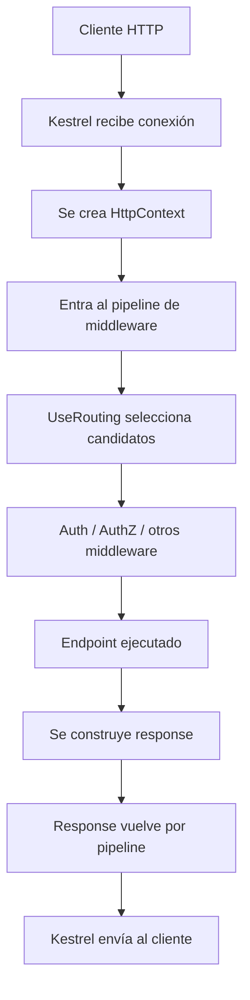
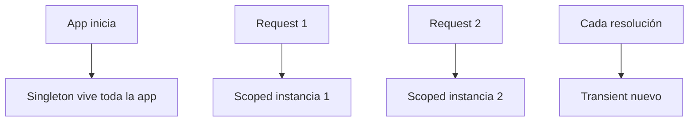
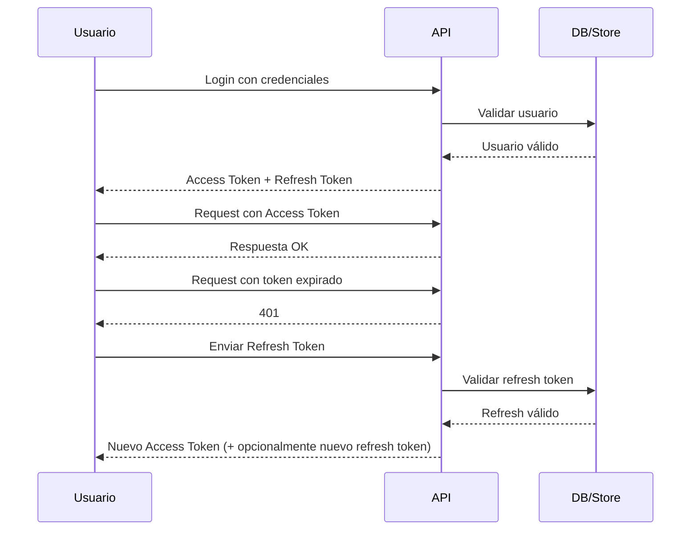
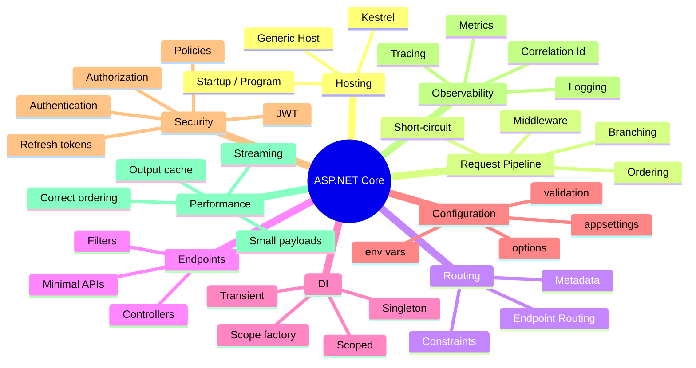
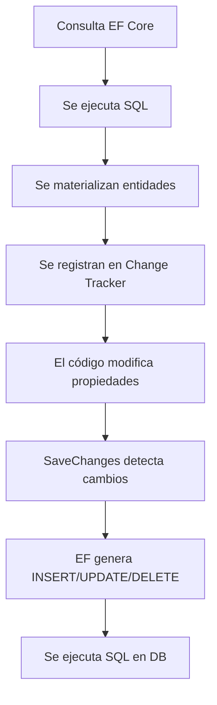
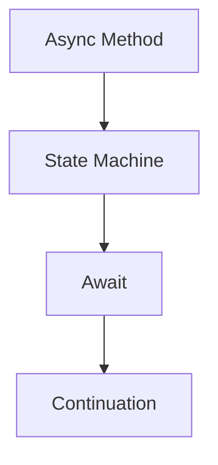
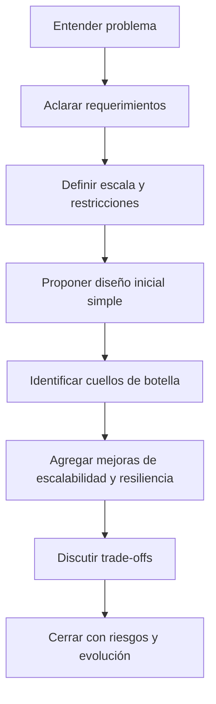
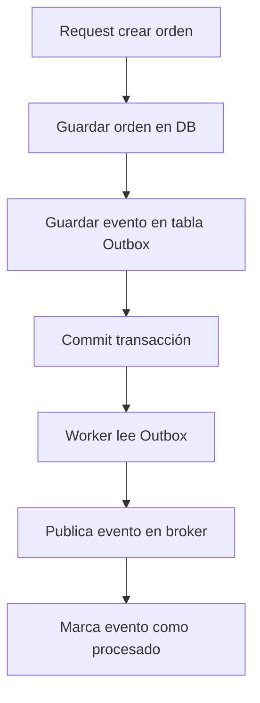
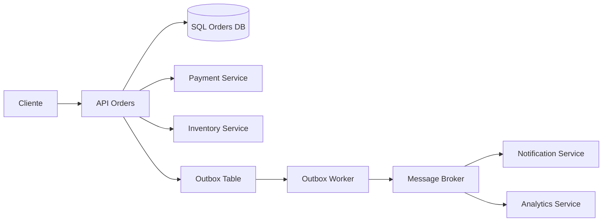

# Guía definitiva de entrevistas .NET — Fase 1
## ASP.NET Core a profundidad para entrevistas senior

> Esta fase está enfocada en que puedas estudiar ASP.NET Core de verdad, no solo repetir definiciones.
> La idea es que al terminar puedas:
>
> - explicar cómo viaja un request internamente
> - responder preguntas senior con criterio
> - conectar conceptos de middleware, routing, DI, auth, configuración y performance
> - defender decisiones reales de arquitectura

---

# Índice de la fase 1

1. Qué es realmente ASP.NET Core  
2. Ciclo de vida completo de un request  
3. Kestrel, hosting y arranque de la aplicación  
4. El pipeline de middleware  
5. Routing internamente  
6. Endpoints, Minimal APIs y Controllers  
7. Dependency Injection profundo  
8. Configuración y Options Pattern  
9. Middleware vs Filters vs Endpoint Filters  
10. Autenticación y autorización  
11. JWT y refresh tokens end-to-end  
12. Validación de configuración  
13. Logging, tracing y observabilidad  
14. Caché y output caching  
15. Versionado de APIs  
16. Logging seguro de request/response  
17. BackgroundService y apagado ordenado  
18. Streaming y archivos por chunks  
19. Preguntas difíciles de entrevista y cómo responder  
20. Checklist de estudio y práctica

---

# 1. Qué es realmente ASP.NET Core

ASP.NET Core es un framework para construir aplicaciones HTTP modernas sobre .NET.  
Pero esa frase, en entrevista, se queda corta.

La forma senior de explicarlo es esta:

**ASP.NET Core es un framework modular y multiplataforma que construye una tubería de procesamiento HTTP sobre el host genérico de .NET, usando middleware, routing, inyección de dependencias, configuración y logging integrados.**

Eso ya comunica varias cosas:

- sabes que no es solo “web”
- entiendes que está montado sobre Generic Host
- conoces que el request se procesa como pipeline
- reconoces que DI, config y logging no son extras, sino parte del runtime de la app

## Qué lo hace diferente de ASP.NET clásico

ASP.NET clásico estaba muy ligado a IIS y al System.Web pipeline.  
ASP.NET Core fue rediseñado con estas ideas:

- modularidad
- mejor rendimiento
- multiplataforma
- pipeline explícito
- DI nativo
- configuración unificada
- hosting desacoplado

## Cómo decirlo en entrevista

Una buena respuesta sería:

> “ASP.NET Core no lo veo solo como framework de controllers. Lo veo como una plataforma HTTP de propósito general sobre .NET, donde el request atraviesa un pipeline explícito de middleware, llega a un endpoint seleccionado por routing y se apoya en servicios base como DI, logging y configuración. Esa composición es clave para entender performance, seguridad y extensibilidad.”

---

# 2. Ciclo de vida completo de un request

Aquí empieza lo bueno.

Cuando un cliente hace una petición HTTP a tu aplicación, pasa algo como esto:



## Paso a paso real

### 1. El cliente se conecta
Puede ser navegador, app móvil, Postman, otro microservicio, API Gateway, etc.

### 2. Kestrel recibe el socket y procesa HTTP
Kestrel es el servidor web embebido en ASP.NET Core.  
Lee la conexión, parsea headers, método, path, body y crea el contexto del request.

### 3. Se crea `HttpContext`
`HttpContext` representa el request en curso.  
Contiene, entre muchas otras cosas:

- `Request`
- `Response`
- `User`
- `RequestServices`
- `Items`
- `Connection`
- `TraceIdentifier`

### 4. El request entra al pipeline
Ese pipeline es una cadena de delegados/middleware.

Cada middleware puede:

- hacer trabajo antes del siguiente
- llamar al siguiente con `await next()`
- hacer trabajo después del siguiente
- cortar el pipeline y devolver respuesta sin seguir

### 5. Routing identifica el endpoint
`UseRouting()` no ejecuta el endpoint todavía.  
Lo que hace es analizar la ruta y seleccionar candidatos compatibles.

### 6. Otros middleware usan esa información
Por ejemplo autorización necesita saber qué endpoint fue seleccionado, porque de ahí salen metadatos como `[Authorize]`.

### 7. `UseEndpoints()` o el endpoint mapper ejecuta el endpoint final
Puede ser:

- controller action
- minimal API handler
- Razor page
- gRPC method
- SignalR hub

### 8. Se escribe la respuesta
Puede ser JSON, texto, archivo, stream, error, redirect, etc.

### 9. La respuesta sale de regreso
Igual que la ida, pero “de vuelta” a través del pipeline para que middleware posteriores al `await next()` ejecuten lógica adicional.

## Ejemplo para visualizar ida y vuelta

```csharp
app.Use(async (context, next) =>
{
    Console.WriteLine("Middleware A - antes");
    await next();
    Console.WriteLine("Middleware A - después");
});

app.Use(async (context, next) =>
{
    Console.WriteLine("Middleware B - antes");
    await next();
    Console.WriteLine("Middleware B - después");
});

app.MapGet("/", () => "Hola");
```

### Orden real de salida

```text
Middleware A - antes
Middleware B - antes
Middleware B - después
Middleware A - después
```

## Qué demuestra esto

Que el pipeline funciona como una pila:

- entra de arriba hacia abajo
- sale de abajo hacia arriba

---

# 3. Kestrel, hosting y arranque de la aplicación

## Qué es Kestrel

Kestrel es el servidor web de ASP.NET Core.  
Se encarga de:

- escuchar puertos
- aceptar conexiones
- parsear HTTP/1.1, HTTP/2 y según configuración otros protocolos
- gestionar request/response a bajo nivel

En muchas arquitecturas Kestrel está detrás de:

- IIS
- Nginx
- Apache
- Azure App Service reverse proxy
- API Gateway o Load Balancer

## Arranque moderno de una app

En .NET moderno normalmente inicias con algo así:

```csharp
var builder = WebApplication.CreateBuilder(args);

// registrar servicios
builder.Services.AddControllers();

var app = builder.Build();

// configurar pipeline
app.UseRouting();
app.UseAuthorization();
app.MapControllers();

app.Run();
```

## Qué pasa aquí en realidad

### `WebApplication.CreateBuilder(args)`

Construye:

- configuración
- logging
- contenedor de DI
- host
- servidor
- environment

### `builder.Services`
Es la colección donde registras dependencias para DI.

### `builder.Build()`
Compila el host y crea la app final.  
A partir de aquí ya no deberías registrar más servicios normales porque el contenedor ya quedó construido.

### `app.Use...`
Define el pipeline.

### `app.Map...`
Registra endpoints.

### `app.Run()`
Arranca el servidor y queda esperando requests.

## Pregunta de entrevista clásica

**¿Cuál es la diferencia entre `builder.Services` y `app`?**

Respuesta sólida:

- `builder.Services` sirve para registrar dependencias y configuración de servicios antes de construir la app
- `app` es la aplicación ya construida y se usa para configurar el pipeline HTTP y mapear endpoints

---

# 4. El pipeline de middleware

Este es uno de los temas más preguntados y más mal explicados.

## Qué es un middleware

Un middleware es un componente que participa en el procesamiento del request/response.

Conceptualmente es una función que recibe:

- `HttpContext`
- un delegado al siguiente middleware

## Forma mínima

```csharp
app.Use(async (context, next) =>
{
    // antes
    await next();
    // después
});
```

## Responsabilidades típicas

- manejo global de excepciones
- HTTPS redirection
- autenticación
- autorización
- CORS
- logging
- compresión
- output caching
- routing
- static files

## Tres patrones clave

### 1. Middleware pasante
Hace algo y deja seguir.

```csharp
app.Use(async (context, next) =>
{
    context.Items["CorrelationId"] = Guid.NewGuid().ToString();
    await next();
});
```

### 2. Middleware terminal
No llama `next()`.

```csharp
app.Use(async (context, next) =>
{
    if (!context.Request.Headers.ContainsKey("X-Api-Key"))
    {
        context.Response.StatusCode = 401;
        await context.Response.WriteAsync("Missing API Key");
        return;
    }

    await next();
});
```

### 3. Middleware con lógica antes y después

```csharp
app.Use(async (context, next) =>
{
    var start = DateTime.UtcNow;

    await next();

    var elapsed = DateTime.UtcNow - start;
    Console.WriteLine($"Request demoró {elapsed.TotalMilliseconds} ms");
});
```

## Short-circuiting

Esto es muy importante.

**Short-circuit** significa cortar el pipeline antes de llegar al endpoint final.

Se usa para:

- bloquear requests inválidos
- servir contenido cacheado
- devolver errores rápidos
- autenticación previa
- rate limiting

## Orden importa muchísimo

Piensa el pipeline como una receta exacta.  
Si el orden cambia, el resultado cambia.

### Ejemplo correcto típico

```csharp
app.UseExceptionHandler("/error");
app.UseHttpsRedirection();
app.UseStaticFiles();
app.UseRouting();
app.UseAuthentication();
app.UseAuthorization();
app.MapControllers();
```

### Por qué así

- primero manejo de errores global
- luego redirección a HTTPS
- luego archivos estáticos
- luego routing selecciona endpoint
- luego auth usa info del endpoint
- finalmente se ejecutan controllers

## Error clásico de entrevista

**¿Qué pasa si pones `UseAuthorization()` antes de `UseRouting()`?**

Respuesta:

La autorización puede no comportarse correctamente porque todavía no se ha resuelto el endpoint ni sus metadatos.  
Muchos mecanismos de autorización dependen del endpoint seleccionado.

## `Use`, `Run` y `Map`

### `Use`
Agrega middleware que normalmente puede llamar al siguiente.

### `Run`
Agrega middleware terminal.

```csharp
app.Run(async context =>
{
    await context.Response.WriteAsync("Fin");
});
```

### `Map`
Ramifica el pipeline según una ruta.

```csharp
app.Map("/admin", adminApp =>
{
    adminApp.Run(async context =>
    {
        await context.Response.WriteAsync("Área admin");
    });
});
```

## `MapWhen`

Ramifica por condición arbitraria.

```csharp
app.MapWhen(
    context => context.Request.Query.ContainsKey("debug"),
    branch =>
    {
        branch.Run(async context =>
        {
            await context.Response.WriteAsync("Modo debug");
        });
    });
```

## Cuándo usar `Map` o `MapWhen`

- `Map`: cuando la separación depende claramente del path
- `MapWhen`: cuando depende de headers, querystring, método o reglas complejas

## Ejemplo real de negocio

Imagina una API multicliente:

- requests con header `X-Tenant: internal` entran a un pipeline con más telemetría
- requests públicos usan rate limit más agresivo

Ahí `MapWhen` podría tener sentido.

---

# 5. Routing internamente

Otro tema donde mucha gente se queda superficial.

## Qué hace realmente el routing

Routing no es “buscar una URL”.  
Routing es un mecanismo que:

1. toma el request
2. evalúa endpoints candidatos
3. compara patrones, constraints y metadata
4. selecciona el mejor match
5. deja listo el endpoint para ejecutarse

## Endpoint Routing

En ASP.NET Core moderno se usa endpoint routing.

Eso permite que todo tipo de endpoints convivan bajo el mismo modelo:

- controllers
- minimal APIs
- Razor pages
- hubs
- gRPC

## Cómo pensarlo mentalmente

Cuando haces esto:

```csharp
app.MapGet("/products/{id:int}", (int id) => Results.Ok(id));
```

No estás “ejecutando” ese endpoint al arrancar.  
Estás registrando metadata y patrones en una tabla de endpoints.

En request time, el routing compara el path con esa tabla.

## Elementos del routing

### Template
Ejemplo:

```text
/products/{id:int}
```

### Segmentos
- `products`
- `{id:int}`

### Parámetros
`id`

### Constraint
`:int`

## Ejemplo

```csharp
app.MapGet("/orders/{orderId:guid}", (Guid orderId) =>
{
    return Results.Ok(new { orderId });
});
```

Si llega:

```text
/orders/9c2a4ec1-5fb6-4c2d-bf8e-9c4a33d7b1fd
```

sí hace match.

Si llega:

```text
/orders/abc
```

no hace match por el constraint `guid`.

## Prioridad y ambigüedad

Cuando varias rutas parecen compatibles, el framework usa reglas de precedencia.  
Por eso conviene ser explícito y evitar rutas ambiguas.

## Ejemplo conflictivo

```csharp
app.MapGet("/users/{id}", ...);
app.MapGet("/users/me", ...);
```

Si no entiendes precedencia puedes llevarte sorpresas.

## Cómo responder en entrevista

> “Routing en ASP.NET Core moderno usa endpoint routing. Los endpoints se registran al arrancar y en runtime se comparan contra el request para seleccionar un candidato según patrón, constraints y metadata. La parte importante no es solo el match, sino que luego otros middleware consumen el endpoint seleccionado, por ejemplo autorización.”

---

# 6. Endpoints, Minimal APIs y Controllers

## Minimal APIs

Son handlers HTTP con menos ceremony.

```csharp
app.MapGet("/health", () => Results.Ok(new { status = "ok" }));
```

## Ventajas

- menos código
- ideal para microservicios pequeños o APIs simples
- bootstrap rápido
- excelente para endpoints sencillos

## Desventajas

- si se abusa, puede desordenarse una API grande
- requiere disciplina para no meter demasiada lógica inline

## Controllers

Modelo más clásico y estructurado.

```csharp
[ApiController]
[Route("api/[controller]")]
public class ProductsController : ControllerBase
{
    [HttpGet("{id:int}")]
    public IActionResult Get(int id)
    {
        return Ok(new { id });
    }
}
```

## Ventajas

- organización por recursos y acciones
- filtros conocidos
- familiaridad empresarial
- mejor separación si hay muchas acciones

## Cómo responder “¿Minimal APIs son más rápidas?”

Respuesta madura:

> “Tienen menos sobrecarga conceptual y menos ceremony, pero no basaría una arquitectura solo en una diferencia marginal. La elección la haría según simplicidad, mantenibilidad y estilo del sistema. Para APIs pequeñas o internas me gustan mucho. Para sistemas grandes con mucha convención y muchos equipos, Controllers suelen dar más estructura.”

## Endpoint Filters

Se parecen a filtros ligeros para Minimal APIs.

Sirven para:

- validación
- logging
- transformar inputs/outputs
- cross-cutting concerns a nivel endpoint

---

# 7. Dependency Injection profundo

Aquí conviene subir mucho el nivel.

## Qué es DI de verdad

DI no es “inyectar por constructor”.  
DI es una técnica para invertir el control de creación y provisión de dependencias.

Eso permite:

- desacoplar componentes
- facilitar pruebas
- centralizar composición
- controlar lifetimes

## El contenedor de ASP.NET Core

ASP.NET Core trae un contenedor de DI integrado.  
No es el más sofisticado del planeta, pero cubre la gran mayoría de escenarios.

## Lifetimes

### Singleton
Una sola instancia para toda la vida de la aplicación.

Casos comunes:

- caches globales
- servicios stateless
- factories thread-safe
- mapeadores inmutables

### Scoped
Una instancia por scope.  
En web, normalmente un scope por request.

Caso clásico:

- `DbContext`

### Transient
Nueva instancia cada vez que se solicita.

Casos:

- servicios muy ligeros
- componentes sin estado con vida corta

## Diagrama mental



## Ejemplo de registro

```csharp
builder.Services.AddSingleton<IClock, SystemClock>();
builder.Services.AddScoped<IOrderRepository, OrderRepository>();
builder.Services.AddTransient<IEmailFormatter, EmailFormatter>();
```

## Por qué `DbContext` suele ser scoped

Porque representa una unidad de trabajo acotada al request.  
Tiene change tracking y estado interno.  
No quieres compartirlo entre múltiples requests concurrentes.

## Error clásico: usar scoped dentro de singleton

Esto es importantísimo en entrevistas y en producción.

### Ejemplo malo

```csharp
public class BadCacheService
{
    private readonly MyDbContext _dbContext;

    public BadCacheService(MyDbContext dbContext)
    {
        _dbContext = dbContext;
    }
}
```

Si registras `BadCacheService` como singleton y `MyDbContext` es scoped, rompes lifetimes.

## Por qué está mal

Porque el singleton vive toda la app y el scoped vive por request.  
No puedes capturar una dependencia más corta dentro de una más larga de forma directa.

## Soluciones reales

### 1. Cambiar diseño
Muchas veces el singleton no debería depender del scoped.

### 2. Crear scope manualmente
Solo cuando tiene sentido.

```csharp
public class ReportScheduler
{
    private readonly IServiceScopeFactory _scopeFactory;

    public ReportScheduler(IServiceScopeFactory scopeFactory)
    {
        _scopeFactory = scopeFactory;
    }

    public async Task RunAsync()
    {
        using var scope = _scopeFactory.CreateScope();
        var db = scope.ServiceProvider.GetRequiredService<MyDbContext>();

        // usar db aquí
        await Task.CompletedTask;
    }
}
```

## Constructor injection vs method injection

### Constructor injection
Para dependencias obligatorias y estables.

### Method injection
Para dependencias específicas de una acción o endpoint.

Ejemplo en controller:

```csharp
[HttpGet]
public IActionResult Get([FromServices] IDateProvider dateProvider)
{
    return Ok(dateProvider.Now);
}
```

## Cuándo usar method injection

- dependencia muy específica de una acción
- evitar inflar el constructor
- dependencia rara o poco usada

Pero no abuses.  
Si muchas acciones usan el mismo servicio, mejor constructor injection.

## Cómo responder en entrevista

> “Prefiero constructor injection para dependencias obligatorias porque hace explícito el contrato del objeto. Recurro a method injection cuando la dependencia es muy puntual de una acción y no quiero acoplarla al resto del controller.”

---

# 8. Configuración y Options Pattern

## Capas de configuración

ASP.NET Core combina múltiples fuentes de configuración.

Normalmente el orden de precedencia va creciendo así:

1. `appsettings.json`
2. `appsettings.{Environment}.json`
3. User secrets en desarrollo
4. variables de entorno
5. command line

La idea clave es:

**la última fuente gana si hay conflicto**.

## Ejemplo mental

Supón que tienes esto en `appsettings.json`:

```json
{
  "MyOptions": {
    "TimeoutSeconds": 30
  }
}
```

Y una variable de entorno con valor 60.  
El valor final será 60 si esa fuente tiene mayor precedencia.

## Options Pattern

Sirve para mapear configuración a clases tipadas.

### Clase

```csharp
public class JwtOptions
{
    public string Issuer { get; set; } = string.Empty;
    public string Audience { get; set; } = string.Empty;
    public string SigningKey { get; set; } = string.Empty;
    public int ExpirationMinutes { get; set; }
}
```

### Registro

```csharp
builder.Services.Configure<JwtOptions>(
    builder.Configuration.GetSection("Jwt"));
```

## `IOptions<T>`, `IOptionsSnapshot<T>`, `IOptionsMonitor<T>`

Este tema sí lo preguntan.

### `IOptions<T>`
- valor resuelto una vez
- ideal para singletons o config estable

### `IOptionsSnapshot<T>`
- recalculado por scope
- en web, normalmente por request
- útil cuando la config puede cambiar entre requests

### `IOptionsMonitor<T>`
- permite observar cambios durante la vida de la app
- útil para singletons que necesitan reaccionar a cambios

## Tabla resumen

| Tipo | Ciclo típico | Soporta cambios |
|---|---|---|
| IOptions | estable | no dinámicamente útil |
| IOptionsSnapshot | por request | sí entre requests |
| IOptionsMonitor | global | sí, con notificación |

## Cómo explicarlo bien

> “`IOptions` me sirve cuando la configuración es esencialmente fija. `IOptionsSnapshot` cuando quiero una vista por request, por ejemplo en web. `IOptionsMonitor` cuando necesito observar cambios en runtime, especialmente desde singletons.”

## Validación de configuración

No basta con bindear.  
En producción debes validar.

### Ejemplo

```csharp
using System.ComponentModel.DataAnnotations;

public class SmtpOptions
{
    [Required]
    public string Host { get; set; } = string.Empty;

    [Range(1, 65535)]
    public int Port { get; set; }

    [Required]
    public string Username { get; set; } = string.Empty;
}
```

Registro:

```csharp
builder.Services
    .AddOptions<SmtpOptions>()
    .Bind(builder.Configuration.GetSection("Smtp"))
    .ValidateDataAnnotations()
    .ValidateOnStart();
```

## Por qué `ValidateOnStart()` es valioso

Porque prefieres que la app falle al arrancar si la config crítica está mal, no descubrirlo cuando llegue el primer usuario real.

---

# 9. Middleware vs Filters vs Endpoint Filters

Tema muy bueno porque evalúa criterio.

## Middleware

Actúa a nivel pipeline HTTP global.

Úsalo cuando el concern aplica a todo o casi todo el tráfico.

Ejemplos:

- correlation id
- manejo global de excepciones
- autenticación
- CORS
- compresión
- logging general

## MVC Filters

Actúan alrededor de actions/controllers.

Tipos típicos:

- authorization filters
- action filters
- exception filters
- result filters

Buenos para concerns específicos del modelo MVC.

## Endpoint Filters

Más naturales en Minimal APIs.

## Cómo elegir

### Usa middleware cuando:
- el concern es HTTP global
- quieres máxima reutilización a nivel pipeline
- no depende del modelo MVC

### Usa filters cuando:
- necesitas lógica asociada a actions/controllers
- quieres acceso al contexto MVC
- el concern es específico de endpoints MVC

### Usa endpoint filters cuando:
- trabajas con Minimal APIs
- el concern aplica a endpoints concretos

## Ejemplo de decisión real

**Validar un header de correlación global**  
→ middleware

**Auditar acciones específicas de ciertos controllers**  
→ action filter

**Validar DTO de una Minimal API específica**  
→ endpoint filter

---

# 10. Autenticación y autorización

Muchos candidatos mezclan estos conceptos.  
En entrevista eso pega mal.

## Autenticación
Responde a:

**¿Quién eres?**

## Autorización
Responde a:

**¿Qué puedes hacer?**

## Ejemplo simple

Un usuario puede estar autenticado con JWT, pero no autorizado para borrar órdenes.

## Pipeline típico

```csharp
app.UseAuthentication();
app.UseAuthorization();
```

## Por qué ese orden

Primero necesitas construir `HttpContext.User` a partir del token o esquema de auth.  
Luego autorización evalúa si ese usuario puede ejecutar el endpoint.

## Claims

Son afirmaciones sobre el usuario:

- id
- email
- role
- permisos
- tenant
- scopes

## Roles vs policies

### Roles
Sencillos, pero pueden quedarse cortos.

### Policies
Más flexibles.  
Muy recomendables cuando hay reglas más ricas.

## Ejemplo de policy

```csharp
builder.Services.AddAuthorization(options =>
{
    options.AddPolicy("CanManageOrders", policy =>
        policy.RequireClaim("permission", "orders.manage"));
});
```

Uso:

```csharp
[Authorize(Policy = "CanManageOrders")]
[HttpDelete("{id:int}")]
public IActionResult Delete(int id)
{
    return NoContent();
}
```

## Recurso y autorización basada en recurso

Muy importante para nivel senior.

No basta con decir “este usuario tiene permiso general”.  
A veces importa el recurso concreto.

Ejemplo:

- un gerente puede ver cualquier pedido de su sucursal
- un cliente solo puede ver sus propios pedidos

Eso es autorización basada en recurso.

## Cómo explicarlo en entrevista

> “Para escenarios simples uso policies por claims o roles. Cuando la decisión depende del recurso específico —por ejemplo si el pedido realmente pertenece al usuario— uso autorización basada en recurso o verificaciones explícitas en capa de aplicación.”

---

# 11. JWT y refresh tokens end-to-end

Este tema sí conviene desarrollarlo bien.

## Qué es JWT

Un JWT es un token firmado que contiene claims del usuario y metadatos como expiración.

## Importante

JWT no es una sesión almacenada en el servidor.  
La gracia es que el servidor puede validar su firma y contenido sin guardar estado de sesión tradicional.

## Componentes conceptuales

- header
- payload
- signature

## Flujo típico



## Access token vs refresh token

### Access token
- vida corta
- va en cada request
- contiene claims
- si se filtra, la ventana de riesgo debe ser reducida

### Refresh token
- vida más larga
- se usa solo para renovar
- debe almacenarse y protegerse muy bien
- normalmente se rota

## Rotación de refresh tokens

Esto es muy bueno para entrevista.

En lugar de dejar un refresh token vivo eternamente, cada renovación devuelve uno nuevo y revoca el anterior.

### Beneficios
- reduce reutilización maliciosa
- permite detectar replay
- facilita invalidación

## Ejemplo conceptual de login

```csharp
public async Task<TokenResponse> LoginAsync(LoginRequest request)
{
    var user = await _userService.ValidateCredentialsAsync(request.Username, request.Password);

    if (user is null)
        throw new UnauthorizedAccessException("Credenciales inválidas");

    var accessToken = _tokenService.GenerateAccessToken(user);
    var refreshToken = _tokenService.GenerateRefreshToken();

    await _refreshTokenStore.SaveAsync(user.Id, refreshToken);

    return new TokenResponse
    {
        AccessToken = accessToken,
        RefreshToken = refreshToken
    };
}
```

## Explicación línea por línea

### `ValidateCredentialsAsync`
Valida identidad real del usuario.

### `GenerateAccessToken`
Crea JWT con claims y expiración corta.

### `GenerateRefreshToken`
Crea un secreto aleatorio fuerte, idealmente criptográficamente seguro.

### `SaveAsync`
Persistes el refresh token, normalmente hash o token con metadata:

- userId
- expiresAt
- revokedAt
- replacedBy
- createdAt
- device o client metadata si aplica

## Buenas prácticas reales

- access token corto
- refresh token largo pero rotado
- guardar refresh tokens de forma segura
- revocación al logout
- invalidación ante sospecha
- usar HTTPS siempre
- no meter datos sensibles en claims del JWT

## Error común de entrevista

**“¿Dónde guardarías el refresh token?”**

Respuesta madura:

Depende del cliente, pero en aplicaciones web normalmente evaluaría una estrategia segura como cookies `HttpOnly` y `Secure` para reducir exposición a XSS, o almacenamiento cuidadosamente controlado según arquitectura. Lo importante es minimizar superficie de robo y proteger el canal con HTTPS.

---

# 12. Validación de configuración

Aunque ya tocamos Options, aquí vamos más práctico.

## Qué validar

- cadenas requeridas
- rangos numéricos
- URLs válidas
- claves no vacías
- combinaciones coherentes

## Ejemplo útil

```csharp
public class PaymentGatewayOptions
{
    [Required]
    public string BaseUrl { get; set; } = string.Empty;

    [Required]
    public string ApiKey { get; set; } = string.Empty;

    [Range(1, 300)]
    public int TimeoutSeconds { get; set; }
}
```

```csharp
builder.Services.AddOptions<PaymentGatewayOptions>()
    .Bind(builder.Configuration.GetSection("PaymentGateway"))
    .ValidateDataAnnotations()
    .Validate(opt => Uri.IsWellFormedUriString(opt.BaseUrl, UriKind.Absolute),
        "BaseUrl debe ser una URL absoluta válida")
    .ValidateOnStart();
```

## Qué decir en entrevista

> “No me gusta descubrir configuraciones inválidas en el primer request real. Para settings críticos uso binding tipado, validaciones y `ValidateOnStart()` para fail fast.”

---

# 13. Logging, tracing y observabilidad

Nivel senior no solo escribe código.  
También piensa en diagnosticar producción.

## Logging estructurado

No es lo mismo esto:

```csharp
_logger.LogInformation("Pedido creado " + order.Id);
```

que esto:

```csharp
_logger.LogInformation("Pedido creado con Id {OrderId}", order.Id);
```

## Por qué el segundo es mejor

- logging estructurado
- mejor búsqueda
- mejor indexación
- mejor análisis en herramientas de observabilidad

## Correlation ID

Cuando un request pasa por varios servicios, quieres seguirlo.

### Middleware simple

```csharp
app.Use(async (context, next) =>
{
    const string headerName = "X-Correlation-Id";

    var correlationId = context.Request.Headers.TryGetValue(headerName, out var value)
        ? value.ToString()
        : Guid.NewGuid().ToString();

    context.Response.Headers[headerName] = correlationId;
    context.Items[headerName] = correlationId;

    await next();
});
```

## Para qué sirve

- rastrear un request entre servicios
- investigar errores
- correlacionar logs y traces

## Qué loggear y qué no

### Sí
- ruta
- método
- status code
- duración
- correlation id
- errores relevantes
- metadata útil

### No o con extremo cuidado
- passwords
- tokens completos
- datos sensibles
- PII sin justificación y protección

## Respuesta fuerte de entrevista

> “Mi enfoque es logging estructurado, con correlation ID, métricas de duración y cuidado extremo con datos sensibles. Loggear demasiado también es un problema: encarece observabilidad, genera ruido y puede exponer información.”

---

# 14. Caché y output caching

## Por qué cachear

Porque muchas veces el cuello de botella no es CPU sino trabajo repetido:

- consultas repetidas
- serialización repetida
- respuestas idénticas para muchos usuarios

## Tipos de caché que debes distinguir

### Response caching
Más ligado a headers HTTP y caché del cliente/proxy.

### Output caching
Más potente del lado servidor para evitar regenerar respuestas.

### Memory cache / distributed cache
Para datos, no necesariamente para la respuesta HTTP completa.

## Output caching mentalmente

Si 100 usuarios piden el mismo catálogo público, no quieres recalcular la respuesta 100 veces.

## Ejemplo conceptual

```csharp
builder.Services.AddOutputCache();

app.UseOutputCache();

app.MapGet("/catalog", async () =>
{
    await Task.Delay(500); // simular trabajo
    return Results.Ok(new[] { "A", "B", "C" });
})
.CacheOutput();
```

## Cuándo sirve mucho

- catálogos públicos
- endpoints de solo lectura
- contenido estable por periodos
- respuestas costosas de generar

## Cuándo tener cuidado

- respuestas por usuario
- datos muy dinámicos
- contenido sensible
- invalidación difícil

## Invalidación: el reto real

Cachear es fácil.  
Invalidar bien es lo difícil.

Ejemplo real:

- cacheas `/products`
- se actualiza inventario
- ¿cuándo invalidas?
- ¿por key exacta, por tag, por tenant?

Eso es lo que diferencia una respuesta básica de una senior.

---

# 15. Versionado de APIs

## Por qué versionar

Porque tus clientes dependen del contrato.  
No siempre puedes romperlo.

## Estrategias comunes

- URL: `/api/v1/orders`
- Header
- Query string
- Media type

## Qué prefiero normalmente

En muchas APIs empresariales, URL versioning es claro y fácil de operar.

## Pregunta de entrevista:
**¿Cómo agregas versionado si no puedes romper URLs existentes?**

Respuesta madura:

- mantener endpoints viejos convivendo
- introducir nueva versión paralela
- usar versionado por header o media type si la URL no puede cambiar
- documentar deprecación
- medir uso antes de retirar

---

# 16. Logging seguro de request/response

Tema delicado y muy real.

## Riesgo

Loggear bodies completos puede filtrar:

- passwords
- tokens
- tarjetas
- datos personales
- documentos

## Qué hacer entonces

- loggear metadata por defecto
- permitir body logging solo en casos controlados
- redactar/sanitizar campos sensibles
- limitar tamaño
- evitar duplicar streams incorrectamente

## Idea general segura

- habilitar solo en troubleshooting
- no en todo el tráfico indiscriminadamente
- excluir rutas sensibles como login o payment

## Qué decir en entrevista

> “No loggeo bodies completos de forma indiscriminada. Priorizo metadata y, si necesito body logging, aplico redacción, límites y exclusiones explícitas porque seguridad y cumplimiento pesan más que la comodidad de debug.”

---

# 17. BackgroundService y apagado ordenado

## Qué es `BackgroundService`

Es una base para tareas en segundo plano gestionadas por el host.

Ejemplos:

- polling
- colas internas
- procesamiento periódico
- sincronización
- limpieza programada

## Estructura básica

```csharp
public class Worker : BackgroundService
{
    private readonly ILogger<Worker> _logger;

    public Worker(ILogger<Worker> logger)
    {
        _logger = logger;
    }

    protected override async Task ExecuteAsync(CancellationToken stoppingToken)
    {
        while (!stoppingToken.IsCancellationRequested)
        {
            _logger.LogInformation("Trabajando...");
            await Task.Delay(TimeSpan.FromSeconds(5), stoppingToken);
        }
    }
}
```

## Qué significa `stoppingToken`

Es la señal de apagado ordenado.  
Tu servicio debe respetarla para no dejar trabajos a medias o colgar el shutdown.

## Error común

Ignorar cancelación y usar `Task.Delay` sin token.

## Escenario real

Tienes un servicio que consume mensajes o reprocesa tareas.  
Si el host se apaga por deploy o scaling, debes:

- dejar de aceptar nuevo trabajo
- terminar o cancelar limpiamente
- liberar recursos
- registrar el cierre

## Scoped dentro de `BackgroundService`

Como `BackgroundService` suele ser singleton, si necesita servicios scoped debes crear un scope por iteración o por unidad de trabajo.

```csharp
public class CleanupWorker : BackgroundService
{
    private readonly IServiceScopeFactory _scopeFactory;

    public CleanupWorker(IServiceScopeFactory scopeFactory)
    {
        _scopeFactory = scopeFactory;
    }

    protected override async Task ExecuteAsync(CancellationToken stoppingToken)
    {
        while (!stoppingToken.IsCancellationRequested)
        {
            using var scope = _scopeFactory.CreateScope();
            var db = scope.ServiceProvider.GetRequiredService<MyDbContext>();

            // trabajo con db
            await Task.Delay(TimeSpan.FromMinutes(1), stoppingToken);
        }
    }
}
```

---

# 18. Streaming y archivos por chunks

Muy buena pregunta de entrevista porque mezcla HTTP, memoria y experiencia real.

## Problema

Si cargas un archivo enorme completo en memoria antes de enviarlo:

- disparas uso de RAM
- empeoras throughput
- arriesgas presión del GC

## Mejor enfoque

Transmitir en streaming.

## Ejemplo conceptual de devolver archivo

```csharp
app.MapGet("/download", async context =>
{
    var path = "large-report.zip";

    context.Response.ContentType = "application/zip";
    context.Response.Headers.ContentDisposition = "attachment; filename=large-report.zip";

    await using var stream = File.OpenRead(path);
    await stream.CopyToAsync(context.Response.Body);
});
```

## Qué logra esto

- no cargas todo el archivo en un byte[]
- el stream se copia progresivamente
- mejor uso de memoria

## Qué son “chunks” en idea práctica

El contenido se va enviando por partes conforme se lee del stream.  
No necesitas esperar a tener todo listo.

## Cuándo es crítico

- reportes grandes
- videos
- exportaciones
- proxies de archivos
- integración con blob storage

## Cómo responder en entrevista

> “Para archivos grandes evitaría materializarlos completos en memoria. Prefiero streaming directamente al response body para reducir consumo de RAM, mejorar throughput y soportar mejor concurrencia.”

---

# 19. Preguntas difíciles de entrevista y cómo responder

Aquí vamos con estilo real de entrevista.

---

## Pregunta 1
**Explícame cómo funciona internamente el routing en ASP.NET Core.**

### Respuesta modelo
> “En ASP.NET Core moderno los endpoints se registran al arrancar la aplicación. Durante el request, `UseRouting()` evalúa el path, método y constraints para seleccionar candidatos compatibles. El resultado no es solo ejecutar la acción; también deja metadata del endpoint disponible para middleware posteriores, por ejemplo autorización. Después el endpoint seleccionado se ejecuta. Lo importante es entender que routing y ejecución del endpoint son etapas separadas.”

---

## Pregunta 2
**¿Por qué no debes inyectar un `DbContext` scoped dentro de un singleton?**

### Respuesta modelo
> “Porque violas lifetimes. El singleton vive toda la app y el `DbContext` scoped vive por request. Capturar una dependencia scoped en una singleton puede generar comportamiento incorrecto, acceso fuera de scope y errores de concurrencia. Si un singleton realmente necesita usar un servicio scoped, debe crear un scope explícito con `IServiceScopeFactory`.”

---

## Pregunta 3
**¿Qué diferencia hay entre autenticación y autorización?**

### Respuesta modelo
> “Autenticación responde quién eres; autorización responde qué puedes hacer. Primero el sistema autentica al usuario y construye su identidad y claims. Luego autorización evalúa si esa identidad cumple roles, policies o reglas basadas en recurso para ejecutar una operación concreta.”

---

## Pregunta 4
**¿Minimal APIs o Controllers?**

### Respuesta modelo
> “No lo veo como guerra de frameworks sino como decisión de diseño. Minimal APIs son muy buenas para endpoints simples, microservicios pequeños o bootstrap rápido. Controllers aportan estructura y convenciones útiles en APIs grandes. La decisión la tomo según complejidad, disciplina del equipo y mantenibilidad, no por moda.”

---

## Pregunta 5
**¿Cómo validas configuración crítica?**

### Respuesta modelo
> “Uso Options Pattern con clases tipadas, validaciones por data annotations y reglas custom, y para settings críticos aplico `ValidateOnStart()` para fallar rápido en startup en lugar de descubrir el problema en producción cuando llega el primer request.”

---

## Pregunta 6
**¿Cómo implementarías un middleware para medir tiempos?**

### Respuesta modelo
> “Tomo timestamp antes del `next()`, dejo continuar y al regresar calculo la duración total. Lo combinaría con logging estructurado, correlation ID y, según el stack, métricas exportables para observabilidad. También cuidaría no meter trabajo pesado dentro del middleware para no degradar throughput.”

---

## Pregunta 7
**¿Cuándo usarías Output Caching y cuándo no?**

### Respuesta modelo
> “Lo usaría en endpoints de lectura con respuestas repetitivas y relativamente estables, por ejemplo catálogos públicos. Tendría cuidado en endpoints por usuario, datos muy dinámicos o respuestas sensibles. El mayor reto no es habilitarlo, sino invalidarlo correctamente.”

---

## Pregunta 8
**¿Cómo detenerías correctamente un `BackgroundService`?**

### Respuesta modelo
> “Respetando el `CancellationToken`, evitando loops que ignoren cancelación y cerrando recursos ordenadamente. Si procesa unidades de trabajo, definiría si termina la actual o la cancela según criticidad. En general, el shutdown correcto es parte del diseño, no un detalle cosmético.”

---

# 20. Casos reales de producción para practicar mentalidad senior

## Caso 1: API lenta en picos de tráfico

### Señales
- latencia sube
- CPU moderada
- DB con muchas consultas repetidas

### Análisis senior
No asumir de inmediato que el problema es .NET.  
Investigar:

- ¿hay endpoints repetitivos sin caché?
- ¿se están serializando payloads enormes?
- ¿hay logging excesivo?
- ¿el pipeline hace trabajo innecesario?
- ¿hay auth externa lenta?
- ¿las consultas están bien?

### Respuesta esperada
Una buena solución podría mezclar:

- output caching para lectura
- reducción de payload
- revisión de logging
- observabilidad por endpoint
- profiling y medición real

## Caso 2: servicio en background deja datos inconsistentes al apagar
### Causa posible
Ignora cancelación y termina a media transacción.

### Mejora
- controlar stopping token
- unidad de trabajo clara
- idempotencia
- reintentos controlados
- registro de progreso

## Caso 3: API pública con versionado difícil
### Situación
Muchos clientes consumen v1 y no puedes romperlos.

### Enfoque senior
- mantener compatibilidad
- introducir v2 de forma paralela
- documentar deprecación
- medir adopción
- retirar gradualmente

---

# 21. Mapa mental de ASP.NET Core para entrevista



---

# 22. Checklist de estudio de esta fase

## Debes poder explicar sin leer

- qué hace Kestrel
- cómo nace `HttpContext`
- cómo entra y sale del pipeline
- por qué el orden de middleware importa
- cómo funciona routing internamente
- diferencia entre middleware, filters y endpoint filters
- diferencia entre autenticación y autorización
- por qué `DbContext` suele ser scoped
- diferencia entre `IOptions`, `IOptionsSnapshot` e `IOptionsMonitor`
- cómo diseñar JWT + refresh token seguro
- cómo cachear sin romper consistencia
- cómo hacer logging útil sin filtrar secretos
- cómo detener un `BackgroundService` correctamente
- cómo enviar archivos grandes sin matar memoria

## Práctica recomendada

1. Crea una Minimal API pequeña con:
   - logging middleware
   - auth fake
   - output caching
   - endpoint filter
   - descarga de archivo por stream

2. Reescribe la misma API con Controllers

3. Explica en voz alta:
   - por qué elegiste Minimal API o Controller
   - dónde pondrías middleware, policies y filters
   - qué harías para producción

---

# 23. Ejercicio de simulación de entrevista

Responde en voz alta estas preguntas:

1. Explícame el request pipeline completo desde que entra a Kestrel hasta que sale la respuesta.
2. ¿Qué diferencias reales hay entre middleware y filters?
3. ¿Qué problema resuelve `UseRouting()` y por qué el orden importa?
4. ¿Qué harías si una API empieza a degradarse en latencia?
5. ¿Por qué un `BackgroundService` puede romper lifetimes?
6. ¿Cómo protegerías refresh tokens?
7. ¿Cuándo elegirías Minimal APIs y cuándo Controllers?
8. ¿Cómo validarías configuración crítica?
9. ¿Cómo harías logging útil sin exponer datos sensibles?
10. ¿Cómo devolverías un archivo de 3 GB sin reventar memoria?

---

# 24. Resumen final de la fase 1

Si dominas esta fase, ya no responderás como alguien que “ha usado ASP.NET Core”, sino como alguien que entiende:

- hosting
- pipeline
- routing
- endpoints
- lifetimes
- seguridad
- configuración
- observabilidad
- performance

Ese salto es justo el que se nota en entrevistas senior.

---

# Próxima fase sugerida

La fase 2 debería ser **EF Core a profundidad**, incluyendo:

- change tracking interno
- eager/lazy/explicit loading con casos reales
- N+1 y cómo detectarlo
- `AsNoTracking`, `AsSplitQuery`, compiled queries
- concurrencia
- transacciones
- raw SQL
- herencia TPH/TPT/TPC
- soft delete
- query filters
- pooling
- problemas reales con `DbContext`


---

# Guía definitiva de entrevistas .NET — Fase 2
## EF Core a profundidad para entrevistas senior

> Esta fase está diseñada para que entiendas EF Core como herramienta de acceso a datos de producción, no solo como una capa cómoda para CRUD.
> La meta es que puedas explicar:
>
> - cómo piensa EF Core internamente
> - cuándo ayuda y cuándo estorba
> - cómo detectar y evitar problemas reales de performance
> - cómo responder preguntas de entrevista con criterio de arquitectura y operación

---

# Índice de la fase 2

1. Qué es realmente EF Core  
2. El rol de `DbContext`  
3. Ciclo de vida de `DbContext` y por qué suele ser scoped  
4. Change Tracking internamente  
5. Entity states: Added, Modified, Deleted, Unchanged, Detached  
6. `IQueryable` vs `IEnumerable`  
7. Cómo EF Core traduce LINQ a SQL  
8. Materialización de entidades  
9. Eager Loading, Lazy Loading y Explicit Loading  
10. El problema N+1  
11. `AsNoTracking` y `AsNoTrackingWithIdentityResolution`  
12. `AsSplitQuery` vs `AsSingleQuery`  
13. Proyecciones y por qué suelen ganar  
14. Concurrencia optimista  
15. Cascade delete y delete behavior  
16. Shadow properties  
17. Global query filters  
18. Soft delete bien implementado  
19. Owned types  
20. Consultas SQL crudas y cuándo usar raw SQL  
21. Transacciones  
22. Compiled queries  
23. Herencia TPH, TPT y TPC  
24. Migraciones en producción  
25. Connection pooling y DbContext pooling  
26. Performance real en alta carga  
27. Anti-patrones comunes  
28. Preguntas difíciles de entrevista y respuestas modelo  
29. Casos reales de producción  
30. Checklist de estudio y práctica

---

# 1. Qué es realmente EF Core

Entity Framework Core es un ORM para .NET.  
Pero si en entrevista solo dices “es un ORM”, te quedas corto.

Una definición más fuerte sería:

**EF Core es un ORM moderno que traduce operaciones sobre objetos y expresiones LINQ a comandos SQL u operaciones equivalentes sobre el proveedor de datos, gestionando opcionalmente estado, identidad, materialización y persistencia.**

Eso ya muestra que entiendes varias piezas clave:

- no solo mapea tablas
- traduce expresiones
- materializa objetos
- hace seguimiento de cambios
- depende del proveedor de base de datos
- no todo LINQ se traduce igual

## Qué resuelve

EF Core te ayuda a:

- mapear entidades a tablas
- consultar con LINQ
- persistir cambios sin escribir SQL repetitivo
- centralizar configuración del modelo
- mantener un nivel de abstracción sobre el proveedor

## Qué no resuelve mágicamente

EF Core **no** elimina la necesidad de entender:

- SQL
- índices
- planes de ejecución
- transacciones
- latencia de red
- tamaño de payload
- consistencia
- modelado de datos

Esto es vital en entrevista.

## Respuesta senior

> “EF Core me acelera mucho acceso a datos y composición de consultas, pero no reemplaza entender base de datos. Para usarlo bien hay que saber qué LINQ se traduce, qué SQL termina generando, cómo se comporta el tracking y dónde conviene bajar a proyecciones o raw SQL.”

---

# 2. El rol de `DbContext`

`DbContext` es el corazón de EF Core.

No lo pienses solo como “la clase que tiene DbSet”.  
Piensa que representa una **unidad de trabajo** y un **contenedor de servicios internos del ORM** para esa sesión de datos.

## Qué hace un `DbContext`

- expone `DbSet<T>`
- mantiene el change tracker
- coordina consultas
- materializa entidades
- detecta cambios
- guarda cambios con `SaveChanges`
- gestiona transacciones implícitas en ciertas operaciones
- conoce el modelo mapeado

## Ejemplo básico

```csharp
public class AppDbContext : DbContext
{
    public DbSet<User> Users => Set<User>();
    public DbSet<Order> Orders => Set<Order>();

    public AppDbContext(DbContextOptions<AppDbContext> options)
        : base(options)
    {
    }

    protected override void OnModelCreating(ModelBuilder modelBuilder)
    {
        modelBuilder.Entity<User>(entity =>
        {
            entity.HasKey(x => x.Id);
            entity.Property(x => x.Name).HasMaxLength(200).IsRequired();
        });
    }
}
```

## Cómo explicarlo bien en entrevista

> “`DbContext` representa una unidad de trabajo sobre el modelo de datos. No solo expone tablas; también coordina tracking, materialización, traducción de consultas y persistencia. Por eso su ciclo de vida y uso correcto importan muchísimo.”

---

# 3. Ciclo de vida de `DbContext` y por qué suele ser scoped

Este tema sí o sí debes dominarlo.

## Por qué suele ser scoped

En aplicaciones web, normalmente registras `DbContext` como scoped porque quieres:

- una instancia por request
- un change tracker aislado por request
- evitar compartir estado entre requests concurrentes
- tratar el request como unidad natural de trabajo

## Registro típico

```csharp
builder.Services.AddDbContext<AppDbContext>(options =>
    options.UseSqlServer(builder.Configuration.GetConnectionString("DefaultConnection")));
```

Por defecto, este registro es scoped.

## Qué problema resuelve eso

Imagina que compartieras un mismo `DbContext` entre múltiples requests:

- mezclarías entidades de usuarios distintos
- tendrías problemas de concurrencia
- el change tracker crecería demasiado
- podrías terminar actualizando cosas equivocadas

## Por qué no debe ser singleton

Porque `DbContext`:

- no es thread-safe
- tiene estado interno
- representa una unidad de trabajo corta
- no debe vivir toda la app

## Por qué tampoco quieres crear uno manualmente en cualquier lado sin criterio

Porque puedes:

- perder control de transacciones
- romper composición con DI
- dificultar testing
- generar disposals extraños
- abrir patrones inconsistentes

## Señal de entrevista

Si te preguntan esto, una respuesta buena sería:

> “Normalmente lo uso scoped porque `DbContext` representa una unidad de trabajo acotada al request y no es thread-safe. Evito capturarlo en singletons y, si un proceso singleton necesita usarlo, creo scopes explícitos.”

---

# 4. Change Tracking internamente

Aquí empieza la parte donde te diferencias de quien solo ha hecho CRUD.

## Qué es change tracking

El change tracker es el mecanismo por el que EF Core recuerda:

- qué entidades conoce
- cuál era su estado
- si cambiaron propiedades
- qué SQL debe emitir al guardar

## Idea mental

Piensa que EF Core mantiene una tabla interna de entidades cargadas, sus claves y su estado.

Cuando haces una consulta trackeada:

- EF materializa la entidad
- la registra en el change tracker
- monitorea cambios para luego persistirlos

## Flujo simplificado



## Ejemplo

```csharp
var user = await db.Users.FirstAsync(x => x.Id == 10);
user.Name = "Omar actualizado";
await db.SaveChangesAsync();
```

## Qué pasa aquí realmente

### 1. `FirstAsync`
EF genera SQL para traer el usuario.

### 2. Materialización
Crea una instancia `User`.

### 3. Tracking
La entidad queda registrada como `Unchanged`.

### 4. Cambio en memoria
Al cambiar `Name`, EF detecta que ya no coincide con el original.

### 5. `SaveChangesAsync`
EF construye un `UPDATE` solo con lo necesario según configuración y estado.

## Coste del tracking

Tracking no es gratis.

Tiene coste en:

- memoria
- CPU para detectar cambios
- identity resolution
- manejo del graph de objetos

## Cuándo sí vale la pena

- cuando vas a modificar entidades
- cuando una unidad de trabajo real necesita persistencia
- cuando necesitas graph tracking controlado

## Cuándo puede sobrar

- consultas puramente de lectura
- listados grandes
- dashboards
- catálogos
- reporting

---

# 5. Entity states: Added, Modified, Deleted, Unchanged, Detached

EF Core clasifica entidades por estado.

## Estados clave

### `Added`
La entidad aún no existe en DB y se insertará.

### `Modified`
Existe en DB y alguna propiedad cambió.

### `Deleted`
Existe en DB y se eliminará.

### `Unchanged`
Está trackeada, pero sin cambios.

### `Detached`
No está siendo trackeada por el contexto.

## Ejemplo

```csharp
var user = new User { Name = "Nuevo" };
db.Users.Add(user);

Console.WriteLine(db.Entry(user).State); // Added
```

Después de `SaveChanges`, si todo salió bien, normalmente pasa a `Unchanged`.

## Ejemplo modificando una entidad existente

```csharp
var user = await db.Users.FirstAsync(x => x.Id == 1);
Console.WriteLine(db.Entry(user).State); // Unchanged

user.Name = "Nuevo nombre";
Console.WriteLine(db.Entry(user).State); // Modified
```

## Cuándo importa entender esto

- debugging de updates inesperados
- attach/detach de graphs
- APIs con DTOs
- escenarios disconnected
- optimización de persistencia

---

# 6. `IQueryable` vs `IEnumerable`

Pregunta clásica y tramposa.

## `IQueryable`

Representa una consulta que aún puede traducirse al proveedor de datos.

Lo importante es:

- no contiene datos todavía
- contiene una expresión
- el proveedor puede traducirla a SQL

## `IEnumerable`

Representa una secuencia ya en memoria o al menos ya materializada a nivel .NET.

Una vez que conviertes demasiado pronto a `IEnumerable`, muchas operaciones ya no ocurren en DB, sino en memoria.

## Ejemplo bueno

```csharp
IQueryable<User> query = db.Users.Where(x => x.IsActive);
var result = await query.ToListAsync();
```

## Ejemplo problemático

```csharp
IEnumerable<User> users = db.Users.ToList();
var filtered = users.Where(x => x.IsActive);
```

Aquí:

- `ToList()` trajo todo
- el filtrado ocurre en memoria
- puedes haber jalado miles de filas innecesarias

## Cómo explicarlo en entrevista

> “`IQueryable` representa una consulta composable que el proveedor aún puede traducir a SQL. `IEnumerable` ya está del lado de .NET; si materializas demasiado pronto, pierdes la capacidad de empujar filtros, ordenamientos y paginación a la base de datos.”

---

# 7. Cómo EF Core traduce LINQ a SQL

Este tema te sube mucho el nivel.

## Idea general

Cuando escribes una consulta LINQ sobre un `DbSet`, EF Core no la ejecuta inmediatamente.  
Construye un árbol de expresiones y luego intenta traducirlo al lenguaje del proveedor, típicamente SQL.

## Ejemplo

```csharp
var query = db.Users
    .Where(x => x.IsActive)
    .OrderBy(x => x.Name)
    .Select(x => new { x.Id, x.Name });
```

## Qué hay aquí realmente

- `Where` no filtra todavía
- `OrderBy` no ordena todavía
- `Select` no proyecta todavía

Lo que se construye es una representación abstracta de la consulta.

## Al materializar

Cuando haces:

```csharp
var result = await query.ToListAsync();
```

EF intenta traducir todo eso a SQL.

## SQL aproximado esperado

```sql
SELECT [u].[Id], [u].[Name]
FROM [Users] AS [u]
WHERE [u].[IsActive] = 1
ORDER BY [u].[Name]
```

## Por qué esto importa

Porque no todo lo que escribes en LINQ se traduce.

### Ejemplo de peligro

Si metes lógica arbitraria de .NET no traducible, EF puede:

- fallar
- o en algunos escenarios obligarte a reestructurar la consulta

## Mentalidad correcta

Cuando escribes LINQ para EF, no pienses “estoy recorriendo objetos”.  
Piensa:

**“estoy describiendo una consulta que el proveedor intentará traducir.”**

---

# 8. Materialización de entidades

## Qué es materialización

Es el proceso de convertir filas del resultado SQL en objetos .NET.

## Qué hace EF aquí

- lee columnas del result set
- crea instancias
- asigna propiedades
- opcionalmente las registra en tracking
- resuelve identidad si aplica

## Por qué importa

Porque materializar entidades completas cuesta más que proyectar solo lo necesario.

### Ejemplo pesado

```csharp
var users = await db.Users.ToListAsync();
```

Si `User` tiene muchas columnas y quizá relaciones posteriores, eso puede ser costoso.

### Ejemplo mejor para lectura

```csharp
var users = await db.Users
    .AsNoTracking()
    .Select(x => new UserListItemDto
    {
        Id = x.Id,
        Name = x.Name
    })
    .ToListAsync();
```

## Ventajas de la proyección

- menos columnas
- menos memoria
- menos tracking
- menos materialización compleja
- DTO listo para salida

---

# 9. Eager Loading, Lazy Loading y Explicit Loading

Tema obligadísimo.

## 9.1 Eager Loading

Cargas relaciones desde la misma consulta o estrategia compuesta desde el inicio.

```csharp
var orders = await db.Orders
    .Include(x => x.Items)
    .ToListAsync();
```

## Ventajas

- explícito
- claro en el código
- útil cuando sabes que sí necesitarás la relación

## Riesgos

- joins enormes
- duplicación de filas
- cartesian explosion si abusas

---

## 9.2 Lazy Loading

La relación se carga automáticamente cuando accedes a la navegación.

Eso suele requerir proxies y configuración especial.

Ejemplo conceptual:

```csharp
var order = await db.Orders.FirstAsync();
var items = order.Items; // aquí podría dispararse consulta
```

## Ventajas

- comodidad
- código aparentemente simple

## Riesgos

- consultas invisibles
- N+1 facilísimo
- difícil de detectar a simple vista
- peor control en rendimiento

## Opinión madura de entrevista

> “Soy cuidadoso con lazy loading. Puede ser cómodo, pero en sistemas serios prefiero estrategias explícitas porque lazy loading hace muy fácil caer en N+1 y oculta costo real.”

---

## 9.3 Explicit Loading

Cargas una navegación manualmente cuando decides hacerlo.

```csharp
var order = await db.Orders.FirstAsync(x => x.Id == id);
await db.Entry(order).Collection(x => x.Items).LoadAsync();
```

## Ventajas

- control claro
- útil si decides condicionalmente cargar relación

## Cuándo usarlo

- cuando primero decides si el recurso base existe
- cuando una relación depende de reglas posteriores
- cuando no quieres incluirla siempre

---

# 10. El problema N+1

Esto sí debes poder explicarlo con soltura.

## Qué es

N+1 ocurre cuando haces:

- 1 consulta para traer N entidades
- luego 1 consulta adicional por cada entidad para traer su relación

Total: 1 + N consultas

## Ejemplo típico

```csharp
var orders = await db.Orders.ToListAsync();

foreach (var order in orders)
{
    Console.WriteLine(order.Customer.Name);
}
```

Si `Customer` se resuelve con lazy loading o acceso diferido, podrías disparar una consulta por orden.

## Por qué es malo

- más roundtrips a DB
- más latencia acumulada
- peor escalabilidad
- comportamiento engañoso: en local parece “funcionar”

## Cómo detectarlo

- logs SQL
- profiling
- observabilidad
- revisar navegación dentro de loops

## Cómo mitigarlo

- eager loading cuando conviene
- proyecciones
- queries explícitas bien pensadas
- evitar lazy loading indiscriminado

## Respuesta de entrevista

> “N+1 aparece cuando por cada entidad principal se dispara una consulta adicional para datos relacionados. Lo evito siendo explícito con includes o, mejor aún en muchos casos, proyectando exactamente lo necesario para el caso de uso.”

---

# 11. `AsNoTracking` y `AsNoTrackingWithIdentityResolution`

## `AsNoTracking`

Le dice a EF Core que no haga tracking de las entidades materializadas.

```csharp
var users = await db.Users
    .AsNoTracking()
    .ToListAsync();
```

## Cuándo usarlo

- lecturas puras
- endpoints GET
- dashboards
- listados
- reportes

## Beneficios

- menos memoria
- menos trabajo del change tracker
- mejor rendimiento en muchos escenarios de lectura

## Peligro conceptual

Si luego esperas modificar esa entidad y guardar cambios automáticamente, no va a funcionar como con tracking.

---

## `AsNoTrackingWithIdentityResolution`

Resuelve identidad de entidades repetidas en el resultado sin habilitar tracking completo.

## Cuándo sirve

En consultas complejas donde la misma entidad relacionada podría aparecer varias veces y quieres evitar múltiples instancias separadas en memoria, pero sin el costo total del tracking.

## Cómo explicarlo

> “Mi default mental para lectura es pensar si la consulta necesita tracking. Si no lo necesita, `AsNoTracking` suele ser una mejora simple y muy rentable.”

---

# 12. `AsSplitQuery` vs `AsSingleQuery`

Muy buena pregunta de entrevista.

## Problema de consultas con múltiples `Include`

Cuando incluyes varias colecciones, un solo SQL grande puede producir duplicación enorme de filas por combinaciones.

## `AsSingleQuery`

Intenta resolver todo en una sola consulta.

### Ventajas
- un solo roundtrip

### Riesgos
- SQL gigantesco
- cartesian explosion
- más duplicación de datos

## `AsSplitQuery`

Divide la carga en varias consultas relacionadas.

```csharp
var orders = await db.Orders
    .Include(x => x.Items)
    .Include(x => x.Payments)
    .AsSplitQuery()
    .ToListAsync();
```

### Ventajas
- evita explosiones cartesianas en algunos escenarios
- consultas más manejables

### Riesgos
- más roundtrips
- debes entender el trade-off

## Respuesta madura

> “No asumo que una sola query siempre sea mejor. Con varios includes de colecciones, `AsSplitQuery` puede reducir cartesian explosion y mejorar rendimiento total. Lo decido midiendo y entendiendo el shape de los datos.”

---

# 13. Proyecciones y por qué suelen ganar

Este es uno de los puntos más importantes de toda la fase.

## Idea principal

Muchas consultas de lectura no necesitan entidades completas.  
Necesitan solo los datos de salida.

## Ejemplo común malo

```csharp
var users = await db.Users.ToListAsync();
```

Y luego solo usas:

- `Id`
- `Name`

Eso implica traer columnas de más y trackear de más.

## Mejor enfoque

```csharp
var users = await db.Users
    .AsNoTracking()
    .Select(x => new UserSummaryDto
    {
        Id = x.Id,
        Name = x.Name
    })
    .ToListAsync();
```

## Beneficios

- menos datos transferidos
- menos memoria
- menos costo de materialización
- DTO ya listo
- más claridad sobre intención

## Cómo decirlo en entrevista

> “Para lectura, mi primera opción mental suele ser proyección y no entidad completa. Las entidades las reservo cuando realmente necesito comportamiento de unidad de trabajo y persistencia posterior.”

---

# 14. Concurrencia optimista

Tema fuerte de entrevista.

## El problema

Dos usuarios cargan el mismo registro.  
Ambos lo modifican.  
¿Quién gana?

Si no haces nada, el último en guardar pisa al anterior silenciosamente.

## Concurrencia optimista

Asume que los conflictos son raros, pero los detecta cuando ocurren.

## Mecanismo común: `RowVersion`

```csharp
public class Product
{
    public int Id { get; set; }
    public string Name { get; set; } = string.Empty;

    [Timestamp]
    public byte[] RowVersion { get; set; } = Array.Empty<byte>();
}
```

## Qué pasa al guardar

EF incluye la versión original en el `WHERE` del `UPDATE`.

Si alguien ya cambió la fila, la versión ya no coincide y no se actualiza ninguna fila.  
Entonces EF lanza una excepción de concurrencia.

## Manejo

```csharp
try
{
    await db.SaveChangesAsync();
}
catch (DbUpdateConcurrencyException ex)
{
    // resolver conflicto
}
```

## Estrategias de resolución

- ganar servidor
- ganar cliente
- recargar y pedir confirmación
- merge inteligente

## Respuesta senior

> “Prefiero concurrencia optimista para la mayoría de sistemas empresariales. Con `RowVersion` detecto cambios concurrentes sin bloquear filas durante toda la edición. Luego defino una estrategia de resolución según el dominio.”

---

# 15. Cascade delete y delete behavior

## Qué es

Cuando eliminas una entidad principal, ¿qué pasa con las dependientes?

## Opciones conceptuales

- eliminar en cascada
- restringir
- poner null
- manejarlo manualmente

## Por qué importa

Porque un cascade delete mal entendido puede borrar mucho más de lo esperado.

## Ejemplo mental

- borras `Customer`
- se borran todas sus `Orders`
- se borran todos sus `OrderItems`

Eso puede ser correcto… o un desastre.

## Qué debes evaluar

- reglas de negocio
- auditoría
- soft delete vs hard delete
- tamaño del graph
- restricciones del proveedor

## Respuesta de entrevista

> “No doy por hecho que cascade delete sea correcto. En datos críticos prefiero modelar explícitamente la regla de negocio y revisar si de verdad corresponde hard delete, soft delete o restricción.”

---

# 16. Shadow properties

## Qué son

Propiedades que existen en el modelo de EF Core pero no necesariamente en la clase .NET.

## Ejemplo de uso

- `CreatedAt`
- `ModifiedAt`
- `TenantId`
- `IsDeleted`

cuando no quieres exponerlas directamente en el dominio o entidad simple

## Configuración conceptual

```csharp
modelBuilder.Entity<User>()
    .Property<DateTime>("CreatedAt");
```

## Ventajas

- metadata útil sin ensuciar demasiado la clase
- soporte a cross-cutting concerns

## Riesgos

- menos visibilidad en código
- puede confundir si abusas

## Cuándo lo explicaría en entrevista

> “Las shadow properties me parecen útiles para metadata transversal como auditoría o soft delete, pero no abusaría de ellas porque reducen explicitud del modelo.”

---

# 17. Global query filters

Muy útiles y muy peligrosos si olvidas que existen.

## Qué hacen

Aplican un filtro automáticamente a todas las consultas de una entidad.

## Ejemplo clásico: soft delete

```csharp
modelBuilder.Entity<User>()
    .HasQueryFilter(x => !x.IsDeleted);
```

Ahora cualquier consulta a `Users` excluye registros soft deleted.

## Casos de uso

- soft delete
- multitenancy por tenant
- visibilidad lógica

## Beneficios

- evitas repetir filtros por todos lados
- centralizas una regla transversal

## Riesgos

- olvidas que existen y te preguntas “¿por qué no aparece este registro?”
- combinaciones complejas pueden confundir
- en admin/reporting quizá necesites ignorarlos

## Ejemplo

```csharp
var allUsers = await db.Users
    .IgnoreQueryFilters()
    .ToListAsync();
```

## Respuesta madura

> “Me gustan mucho para reglas transversales como soft delete o tenant isolation, pero siempre siendo consciente de que añaden comportamiento implícito. Documentación y casos de administración importan.”

---

# 18. Soft delete bien implementado

No es solo agregar `IsDeleted`.

## Qué es soft delete

En vez de borrar físicamente, marcas el registro como eliminado lógico.

## Por qué usarlo

- auditoría
- recuperación
- trazabilidad
- evitar pérdida irreversible

## Implementación mínima

```csharp
public class User
{
    public int Id { get; set; }
    public string Name { get; set; } = string.Empty;
    public bool IsDeleted { get; set; }
}
```

Filtro global:

```csharp
modelBuilder.Entity<User>()
    .HasQueryFilter(x => !x.IsDeleted);
```

## Pero una implementación seria suele añadir

- `DeletedAt`
- `DeletedBy`
- quizá razón
- auditoría
- políticas de purga

## Convertir delete en soft delete

Puedes interceptar entidades marcadas como `Deleted` y transformarlas a `Modified`.

Ejemplo conceptual:

```csharp
public override async Task<int> SaveChangesAsync(CancellationToken cancellationToken = default)
{
    foreach (var entry in ChangeTracker.Entries<User>())
    {
        if (entry.State == EntityState.Deleted)
        {
            entry.State = EntityState.Modified;
            entry.Entity.IsDeleted = true;
        }
    }

    return await base.SaveChangesAsync(cancellationToken);
}
```

## Peligros

- relaciones
- unicidad lógica
- queries admin
- acumulación de datos “muertos”

## Respuesta de entrevista

> “Soft delete no es solo un booleano. También implica filtros, auditoría, recuperación potencial y una estrategia para datos acumulados. Si el sistema lo requiere, lo implemento como política consistente, no como parche.”

---

# 19. Owned types

## Qué son

Tipos de valor u objetos que conceptualmente pertenecen a otra entidad y no tienen identidad propia independiente.

## Ejemplo

```csharp
public class Customer
{
    public int Id { get; set; }
    public Address Address { get; set; } = new();
}

public class Address
{
    public string Street { get; set; } = string.Empty;
    public string City { get; set; } = string.Empty;
}
```

## Configuración

```csharp
modelBuilder.Entity<Customer>()
    .OwnsOne(x => x.Address);
```

## Cuándo tiene sentido

- value objects
- objetos sin identidad independiente
- composición natural del dominio

## Beneficio conceptual

Expresas mejor el dominio sin convertir todo en tabla/entidad independiente.

---

# 20. Consultas SQL crudas y cuándo usar raw SQL

EF Core no prohíbe SQL.  
Y eso es bueno.

## Cuándo considerar raw SQL

- consultas muy optimizadas
- sprocs heredados
- SQL muy específico
- hints del proveedor
- reporting especializado
- operaciones donde LINQ queda poco claro o poco eficiente

## Ejemplo

```csharp
var users = await db.Users
    .FromSqlRaw("SELECT * FROM Users WHERE IsActive = 1")
    .ToListAsync();
```

## Importante

Siempre que haya parámetros, usa variantes seguras y parametrizadas.

## Cuándo no bajar a raw SQL por costumbre

- cuando LINQ produce SQL perfectamente bueno
- cuando reduces mantenibilidad sin beneficio real
- cuando introduces fragmentación innecesaria

## Respuesta de entrevista

> “No soy dogmático. Prefiero LINQ para la mayoría de escenarios por mantenibilidad y composición. Pero cuando necesito control fino, compatibilidad con legado o una consulta muy específica, raw SQL es una herramienta válida.”

---

# 21. Transacciones

## Qué pasa normalmente

Un `SaveChanges()` suele ejecutarse transaccionalmente para ese conjunto de cambios.

## Cuándo necesitas una transacción explícita

- múltiples `SaveChanges`
- varias operaciones que deben ser atómicas juntas
- coordinación compleja

## Ejemplo conceptual

```csharp
await using var transaction = await db.Database.BeginTransactionAsync();

try
{
    db.Orders.Add(order);
    await db.SaveChangesAsync();

    db.Payments.Add(payment);
    await db.SaveChangesAsync();

    await transaction.CommitAsync();
}
catch
{
    await transaction.RollbackAsync();
    throw;
}
```

## Cuándo pensar más allá

En sistemas distribuidos, no asumas que una transacción local resuelve todo.  
Ahí aparecen:

- outbox pattern
- idempotencia
- consistencia eventual

---

# 22. Compiled queries

Tema bueno para entrevistas duras.

## Qué resuelven

En escenarios de consultas muy repetidas y de alto volumen, puede convenir precompilar la consulta para reducir parte del costo de traducción.

## Ejemplo conceptual

```csharp
private static readonly Func<AppDbContext, int, Task<User?>> GetUserByIdCompiled =
    EF.CompileAsyncQuery((AppDbContext db, int id) =>
        db.Users.FirstOrDefault(x => x.Id == id));
```

## Cuándo vale la pena

- consultas muy calientes
- alto throughput
- paths súper repetidos
- después de medir

## Cuándo no obsesionarse

- si la consulta no es hotspot
- si el cuello de botella es la DB, no la traducción
- si añade complejidad innecesaria

## Respuesta madura

> “Las compiled queries pueden ayudar en hot paths muy repetidos, pero no las uso por reflejo. Primero mido. Muchas veces el verdadero cuello de botella está en la consulta o en la base de datos, no en el overhead de traducción.”

---

# 23. Herencia TPH, TPT y TPC

## TPH — Table Per Hierarchy

Toda la jerarquía en una sola tabla, con discriminador.

### Ventajas
- consultas simples
- buen rendimiento general

### Desventajas
- columnas nulas
- tabla ancha

## TPT — Table Per Type

Cada tipo tiene su tabla, normalmente enlazada con joins.

### Ventajas
- modelo más normalizado

### Desventajas
- más joins
- peor rendimiento en muchas consultas

## TPC — Table Per Concrete Type

Cada tipo concreto tiene su propia tabla completa.

### Ventajas
- evita algunos joins
- claro por tipo concreto

### Desventajas
- duplicación de columnas comunes
- complejidad

## Respuesta de entrevista

> “Si no hay una razón fuerte, TPH suele ser una opción pragmática por rendimiento y simplicidad. TPT me parece más limpio visualmente, pero puede degradar consultas por joins adicionales. La elección depende de volumen, forma de acceso y necesidades del dominio.”

---

# 24. Migraciones en producción

Tema muy real y muy importante.

## Qué son

Migraciones permiten versionar cambios del esquema junto con el código.

## Comandos típicos

```bash
dotnet ef migrations add AddCustomerTable
dotnet ef database update
```

## Pero producción no es solo correr comandos

Debes pensar en:

- ventanas de despliegue
- backward compatibility
- scripts revisables
- cero downtime o mínimo downtime
- rollback strategy
- cambios destructivos con mucho cuidado

## Ejemplo de riesgo

Agregar una columna nullable suele ser relativamente seguro.  
Renombrar, dropear o cambiar tipo de columna crítica puede ser mucho más delicado.

## Buenas prácticas

- revisar SQL generado
- evitar cambios destructivos sin plan
- separar migraciones complejas
- coordinar con despliegue de aplicación
- considerar estrategia expand/contract en cambios grandes

## Respuesta de entrevista

> “No trato las migraciones de producción como un detalle automático. Me interesa revisar el SQL, evaluar compatibilidad con la versión anterior y planear despliegues de esquema y aplicación de forma segura.”

---

# 25. Connection pooling y DbContext pooling

No confundas estos conceptos.

## Connection pooling

Lo maneja el proveedor ADO.NET.  
Reutiliza conexiones físicas/lógicas para no abrir/cerrar desde cero cada vez.

## Beneficio

- menos overhead
- mejor rendimiento

## DbContext pooling

Reutiliza instancias de `DbContext` bajo ciertas condiciones.

Ejemplo:

```csharp
builder.Services.AddPooledDbContextFactory<AppDbContext>(options =>
    options.UseSqlServer(connectionString));
```

## Beneficio potencial

- reduce costo de crear contextos en escenarios de alto throughput

## Cuidados

- entender bien el patrón de consumo
- no asumir que arregla problemas de diseño
- tener claro que el contexto se reutiliza y debe resetear estado interno correctamente

## Respuesta madura

> “Connection pooling y DbContext pooling resuelven cosas distintas. El primero es nivel conexión y normalmente ya lo aprovechas vía proveedor. El segundo reduce overhead de creación de contextos, pero lo aplico solo si el patrón de uso lo justifica y lo tengo bien entendido.”

---

# 26. Performance real en alta carga

Aquí se junta todo.

## Checklist mental de optimización

### Consulta
- ¿trae solo columnas necesarias?
- ¿tiene filtros correctos?
- ¿usa índices adecuados?
- ¿página resultados?

### Materialización
- ¿realmente necesito entidad completa?
- ¿basta DTO proyectado?

### Tracking
- ¿necesito tracking?
- si no, `AsNoTracking`

### Relaciones
- ¿hay N+1?
- ¿hay includes excesivos?
- ¿conviene split query?

### Persistencia
- ¿hay demasiados `SaveChanges`?
- ¿se puede agrupar trabajo?

### Base de datos
- ¿el plan de ejecución es sano?
- ¿hay lock contention?
- ¿la consulta está bien diseñada?

## Ejemplo de mejora típica

### Antes

```csharp
var users = await db.Users
    .Include(x => x.Orders)
    .ToListAsync();
```

y luego solo muestras nombre y número de órdenes.

### Después

```csharp
var users = await db.Users
    .AsNoTracking()
    .Select(x => new UserDashboardDto
    {
        Id = x.Id,
        Name = x.Name,
        OrdersCount = x.Orders.Count
    })
    .ToListAsync();
```

## Qué mejoras posibles trae

- menos columnas
- menos datos completos
- nada de entidades innecesarias
- menos tracking
- intención más clara

---

# 27. Anti-patrones comunes

## 1. Repositorios genéricos ciegos sobre EF Core
A veces solo duplican lo que EF ya hace y esconden capacidades útiles.

## 2. Materializar demasiado pronto
`ToList()` antes de tiempo mata composición.

## 3. Usar entidades para todo
Muchas lecturas deberían ser DTOs proyectados.

## 4. Lazy loading indiscriminado
Receta clásica para N+1.

## 5. Un `SaveChanges` por cada entidad
Genera overhead y más roundtrips.

## 6. No entender el SQL generado
“Funciona” no significa “escala”.

## 7. `DbContext` compartido indebidamente
Riesgo de concurrencia y bugs raros.

## 8. `Include` como reflejo
No todo se resuelve agregando más includes.

## 9. Suponer que el ORM arregla mala base de datos
No lo hace.

## 10. Ignorar índices, cardinalidad y planes
Eso pega durísimo en producción.

---

# 28. Preguntas difíciles de entrevista y respuestas modelo

## Pregunta 1
**¿Cómo traduce EF Core una consulta LINQ a SQL?**

### Respuesta modelo
> “Cuando consultas sobre un `DbSet`, EF construye un árbol de expresiones. Esa expresión se pasa por el pipeline del proveedor, que intenta traducirla a SQL u otro lenguaje del store. La ejecución real ocurre al materializar, por ejemplo con `ToListAsync`. Por eso no pienso LINQ sobre EF como simple iteración en memoria, sino como descripción de consulta.”

---

## Pregunta 2
**¿Cuándo usarías `AsNoTracking`?**

### Respuesta modelo
> “Cuando la consulta es de solo lectura y no necesito persistir cambios sobre esas entidades. Reduce trabajo del change tracker y suele mejorar rendimiento y memoria. En endpoints GET grandes o dashboards es de mis primeras consideraciones.”

---

## Pregunta 3
**¿Qué diferencia hay entre eager, lazy y explicit loading?**

### Respuesta modelo
> “Eager carga relaciones de forma explícita desde la consulta inicial; lazy las trae cuando se accede a la navegación; explicit las carga manualmente después. En sistemas serios prefiero estrategias explícitas porque lazy loading facilita mucho N+1 y oculta costo.”

---

## Pregunta 4
**¿Qué problema resuelve la concurrencia optimista?**

### Respuesta modelo
> “Evita que actualizaciones concurrentes silenciosas se pisen sin detección. Con un token como `RowVersion`, EF puede detectar que la fila cambió desde que la leí y lanzar una excepción para resolver el conflicto.”

---

## Pregunta 5
**¿Cómo optimizas EF Core en un endpoint caliente?**

### Respuesta modelo
> “Primero mido y veo SQL real. Luego reviso si hace falta tracking; muchas veces paso a `AsNoTracking`. Después proyecto solo columnas necesarias, reviso includes, detecto N+1, verifico índices y paging. Si sigue siendo hotspot, evalúo compiled queries o incluso raw SQL si la consulta lo justifica.”

---

## Pregunta 6
**¿Qué opinas de los repositorios genéricos sobre EF Core?**

### Respuesta modelo
> “No me gustan por defecto. EF Core ya implementa mucho del patrón repository/unit of work y un repositorio genérico suele ocultar capacidades valiosas como composición de consultas, includes, tracking y proyecciones. Prefiero abstracciones orientadas al dominio o casos de uso concretos cuando realmente aportan valor.”

---

## Pregunta 7
**¿Cuándo bajarías a SQL crudo?**

### Respuesta modelo
> “Cuando necesito control fino, compatibilidad con legado, una consulta particularmente compleja o una optimización medida. No por costumbre. Mi criterio es mantenibilidad primero y SQL crudo cuando aporta una ganancia real o es la herramienta adecuada.”

---

# 29. Casos reales de producción

## Caso 1: endpoint de dashboard muy lento

### Síntoma
Consulta tarda 2.5 segundos y consume bastante memoria.

### Código típico malo

```csharp
var customers = await db.Customers
    .Include(x => x.Orders)
    .ThenInclude(x => x.Items)
    .ToListAsync();
```

Luego el dashboard solo necesita:

- nombre del cliente
- total de órdenes
- monto total

### Diagnóstico
Se están trayendo entidades completas y relaciones completas para una necesidad agregada.

### Mejor enfoque
Proyección:

```csharp
var customers = await db.Customers
    .AsNoTracking()
    .Select(x => new CustomerDashboardDto
    {
        Id = x.Id,
        Name = x.Name,
        OrdersCount = x.Orders.Count,
        TotalAmount = x.Orders.Sum(o => o.Total)
    })
    .ToListAsync();
```

### Lección
El ORM funciona mejor cuando la consulta expresa exactamente el shape del dato requerido.

---

## Caso 2: error de contexto disposed en background process

### Causa típica
Un singleton captura `DbContext` scoped.

### Solución
Crear scope por unidad de trabajo con `IServiceScopeFactory`.

### Lección
No es solo “arreglar error”; es respetar lifetimes.

---

## Caso 3: explosión de filas con múltiples includes

### Síntoma
Consulta única genera resultado enorme y lenta.

### Posible mejora
Evaluar `AsSplitQuery` o rediseñar consulta con proyecciones.

### Lección
Una sola query no siempre gana.

---

## Caso 4: actualizaciones concurrentes pisan cambios

### Síntoma
Usuarios reportan que sus cambios desaparecen.

### Solución
Agregar token de concurrencia y flujo de resolución.

### Lección
La consistencia funcional importa tanto como que “guarde”.

---

# 30. Checklist de estudio y práctica de EF Core

## Debes poder explicar sin leer

- qué es realmente `DbContext`
- por qué suele ser scoped
- cómo funciona el change tracker
- diferencia entre tracked y no tracked
- diferencia entre `IQueryable` e `IEnumerable`
- cómo se traduce LINQ a SQL
- qué es materialización
- eager vs lazy vs explicit loading
- cómo detectar y evitar N+1
- cuándo usar `AsNoTracking`
- cuándo considerar `AsSplitQuery`
- por qué las proyecciones suelen ser mejores para lectura
- cómo funciona concurrencia optimista
- qué resuelven global query filters
- cómo implementar soft delete con criterio
- cuándo usar raw SQL
- qué implican migraciones en producción
- diferencia entre connection pooling y DbContext pooling

## Práctica recomendada

1. Crea un mini sistema con:
   - `Users`
   - `Orders`
   - `OrderItems`

2. Implementa:
   - consulta mala con N+1
   - consulta corregida
   - proyección a DTO
   - soft delete con query filter
   - concurrencia con `RowVersion`
   - un caso con `AsSplitQuery`

3. Mide:
   - número de consultas
   - tamaño del resultado
   - tiempo de respuesta
   - diferencia con `AsNoTracking`

---

# 31. Resumen final de la fase 2

Si dominas esta fase, ya no verás EF Core como “magia para CRUD”.

Lo verás como un sistema con:

- traducción de expresiones
- materialización
- tracking opcional
- costos reales
- trade-offs
- puntos concretos de optimización

Y eso es exactamente lo que en entrevista distingue a alguien que “ha usado EF Core” de alguien que **entiende EF Core**.

---

# Próxima fase sugerida

La fase 3 debería ser **C# avanzado para entrevistas**, incluyendo:

- constructor estático y ciclo de vida de tipos
- `DateTime`, `DateTimeOffset`, time zones
- `ToLookup`
- LINQ deferred execution profundo
- threads, tasks y parallelism
- colecciones thread-safe
- locks, `SemaphoreSlim`, `Monitor`
- async coordination
- `volatile` vs `Interlocked`
- `Task.Run` vs `TaskFactory.StartNew`
- method overloading vs overriding
- `ref`, `in`, `out`
- async streams
- channels
- `CancellationToken`
- memoria, stack vs heap, boxing, GC


---

# Guía definitiva de entrevistas .NET — Fase 3
## C# avanzado para entrevistas senior (nivel profundo)

> Esta fase es donde muchos candidatos fallan.
> No porque no sepan C#, sino porque no entienden **cómo funciona realmente por debajo**.
>
> Aquí vamos a cubrir:
>
> - comportamiento interno del lenguaje
> - threading real
> - async/await internals
> - memoria
> - trampas comunes de entrevista

---

# Índice de la fase 3

1. Ciclo de vida de tipos y constructor estático  
2. `DateTime`, `DateTimeOffset` y time zones  
3. LINQ: deferred execution profundo  
4. `ToLookup` vs `GroupBy`  
5. Threads vs Tasks vs ThreadPool  
6. Async/Await internals (state machine)  
7. `Task.Run` vs `TaskFactory.StartNew`  
8. Paralelismo (`Parallel`, `Task.WhenAll`)  
9. Locks y sincronización  
10. `SemaphoreSlim`, `Monitor`, `Mutex`  
11. Colecciones thread-safe  
12. `volatile` vs `Interlocked`  
13. `ref`, `in`, `out`  
14. Method overloading vs overriding  
15. Async streams  
16. Channels  
17. `CancellationToken`  
18. Memoria: stack vs heap  
19. Boxing / Unboxing  
20. Garbage Collector  
21. Preguntas difíciles de entrevista  
22. Casos reales de producción  
23. Checklist de estudio

---

# 1. Constructor estático y ciclo de vida de tipos

## ¿Qué es un constructor estático?

Se ejecuta UNA SOLA VEZ por tipo.

```csharp
public class MyClass
{
    static MyClass()
    {
        Console.WriteLine("Constructor estático");
    }
}
```

## ¿Cuándo se ejecuta?

- antes del primer uso del tipo
- antes de acceder a cualquier miembro estático
- antes de crear la primera instancia

## Importante

- es thread-safe por runtime
- no puedes controlarlo explícitamente
- si falla → el tipo queda inutilizable

## Pregunta de entrevista

**¿Por qué evitar lógica pesada en constructor estático?**

👉 Porque bloquea el tipo y puede generar problemas difíciles de diagnosticar

---

# 2. DateTime vs DateTimeOffset

## Problema clásico

```csharp
var date = DateTime.Now;
```

👉 Depende del servidor

## Solución

```csharp
var date = DateTime.UtcNow;
```

o mejor:

```csharp
var date = DateTimeOffset.UtcNow;
```

## Diferencia clave

| Tipo | Contiene zona |
|------|-------------|
| DateTime | ❌ |
| DateTimeOffset | ✔ |

## Respuesta de entrevista

> “Prefiero DateTimeOffset para sistemas distribuidos porque preserva contexto temporal”

---

# 3. Deferred Execution en LINQ

## Concepto

```csharp
var query = users.Where(x => x.IsActive);
```

NO ejecuta todavía.

## Se ejecuta cuando:

- ToList()
- First()
- Count()

## Problema típico

```csharp
foreach(var u in query)
```

👉 cada iteración puede ejecutar la consulta si no se materializó

## Respuesta

> “LINQ es diferido por diseño. Entender cuándo se ejecuta es clave para evitar queries repetidas”

---

# 4. ToLookup vs GroupBy

## ToLookup

- ejecución inmediata
- indexado
- más rápido para múltiples búsquedas

## GroupBy

- diferido
- más flexible

## Ejemplo

```csharp
var lookup = users.ToLookup(x => x.Role);
```

---

# 5. Threads vs Tasks vs ThreadPool

## Thread

- control total
- costoso

## Task

- abstracción moderna
- usa ThreadPool

## ThreadPool

- reutiliza threads

## Respuesta de entrevista

> “Prefiero Task porque abstrae manejo de threads y escala mejor”

---

# 6. Async/Await internals

## Qué pasa realmente

El compilador genera una **state machine**



## Importante

- no crea threads automáticamente
- no bloquea

---

# 7. Task.Run vs StartNew

## Task.Run

- simple
- usa ThreadPool

## StartNew

- más control
- más complejo

## Recomendación

👉 usar Task.Run en la mayoría de casos

---

# 8. Paralelismo

## Task.WhenAll

```csharp
await Task.WhenAll(task1, task2);
```

## Parallel.For

```csharp
Parallel.For(0, 10, i => { });
```

## Diferencia

- Task → async IO
- Parallel → CPU-bound

---

# 9. Locks

```csharp
lock(obj)
{
    // sección crítica
}
```

## Problemas

- deadlocks
- contention

---

# 10. SemaphoreSlim

```csharp
await semaphore.WaitAsync();
try
{
}
finally
{
    semaphore.Release();
}
```

## Uso

- limitar concurrencia

---

# 11. Colecciones thread-safe

- ConcurrentDictionary
- ConcurrentQueue

---

# 12. volatile vs Interlocked

| volatile | Interlocked |
|---------|------------|
| visibilidad | atomicidad |

---

# 13. ref, in, out

| keyword | uso |
|--------|-----|
| ref | read/write |
| out | solo salida |
| in | solo lectura |

---

# 14. Overloading vs Overriding

- Overloading → misma función distinta firma
- Overriding → polimorfismo

---

# 15. Async Streams

```csharp
await foreach(var item in stream)
```

---

# 16. Channels

Comunicación entre threads

---

# 17. CancellationToken

```csharp
await Task.Delay(1000, token);
```

---

# 18. Memoria: stack vs heap

| Stack | Heap |
|------|------|
| rápido | flexible |

---

# 19. Boxing / Unboxing

```csharp
object obj = 5; // boxing
int x = (int)obj; // unboxing
```

---

# 20. Garbage Collector

- generación 0,1,2
- compacta memoria

---

# 21. Preguntas difíciles

### ¿Async crea threads?
👉 No necesariamente

### ¿Task.WhenAll vs WaitAll?
👉 WaitAll bloquea

---

# 22. Casos reales

## Deadlock clásico

```csharp
Task.Run(...).Result
```

---

# 23. Checklist

Debes poder explicar:

- async internals
- threading
- locks
- memoria
- GC

---

# Próxima fase

System Design + Arquitectura


---

# Fase 3 — EXPANSIÓN (C# avanzado profundo)

## A. SynchronizationContext y ConfigureAwait

### Qué es SynchronizationContext

Es un mecanismo que define **dónde** se ejecutan las continuaciones de `await`.

- En ASP.NET Core **no hay SynchronizationContext** (por diseño).
- En UI (WPF/WinForms) sí hay → vuelve al hilo de UI.

### Problema clásico

```csharp
await SomeAsync(); // ¿dónde continúa?
```

En ASP.NET Core: en cualquier hilo del ThreadPool.

### ConfigureAwait

```csharp
await SomeAsync().ConfigureAwait(false);
```

Indica que **no intente volver a un contexto capturado**.

### Cuándo usarlo

- Librerías → casi siempre `false`
- Apps ASP.NET Core → normalmente irrelevante, pero seguro

### Respuesta entrevista

> “En ASP.NET Core no hay SynchronizationContext, por lo que ConfigureAwait(false) no cambia mucho. En librerías sí lo uso para evitar dependencias de contexto.”

---

## B. Async internals (más profundo)

### Qué genera el compilador

```csharp
public async Task<int> GetAsync()
{
    await Task.Delay(1000);
    return 5;
}
```

Se transforma conceptualmente en:

- una **state machine**
- con estados: antes/durante/después del await
- con continuaciones registradas

### Implicaciones

- cada `await` tiene costo
- demasiados awaits → overhead
- pero evita bloquear threads

---

## C. Deadlocks reales

### Ejemplo clásico

```csharp
var result = SomeAsync().Result; // ❌
```

### Por qué pasa

- bloqueas thread
- continuation necesita ese thread
- circular wait → deadlock

### Regla

👉 “Async all the way”

---

## D. CPU-bound vs IO-bound

### IO-bound

- DB
- HTTP
- disco

→ usa async/await

### CPU-bound

- cálculos intensivos

→ usa `Task.Run` o paralelismo

### Error común

usar async para CPU → no sirve

---

## E. ThreadPool y starvation

### Qué es starvation

cuando el ThreadPool no tiene threads suficientes

### Síntomas

- latencia alta
- tasks tardan en iniciar

### Causas

- bloquear threads (`.Result`)
- operaciones largas sin async

---

## F. ValueTask

### Problema

`Task` siempre crea objeto

### Solución

`ValueTask`

```csharp
ValueTask<int> GetAsync()
```

### Cuándo usarlo

- métodos MUY frecuentes
- que a veces son síncronos

### Cuidado

- más complejo
- no abusar

---

## G. Span y Memory

### Span<T>

- acceso a memoria sin copiar
- stack-friendly

```csharp
Span<int> numbers = stackalloc int[3];
```

### Beneficio

- menos GC
- más performance

---

## H. Race conditions

### Ejemplo

```csharp
counter++;
```

NO es atómico

### Solución

```csharp
Interlocked.Increment(ref counter);
```

---

## I. Backpressure (muy importante)

### Problema

productor más rápido que consumidor

### Solución

- Channels
- SemaphoreSlim
- queues con límite

---

## J. Channels (profundo)

```csharp
var channel = Channel.CreateBounded<int>(10);
```

### Beneficio

- control de flujo
- backpressure
- async producer-consumer

---

## K. Garbage Collector profundo

### Generaciones

- Gen 0 → objetos cortos
- Gen 1 → transición
- Gen 2 → larga vida

### Problemas reales

- LOH (Large Object Heap)
- fragmentation
- memory pressure

---

## L. Stack vs Heap (detalle real)

### Stack

- rápido
- tamaño limitado

### Heap

- flexible
- GC necesario

---

## M. Preguntas TRAMPA

### ¿await crea threads?
👉 No

### ¿Task es thread?
👉 No

### ¿async mejora performance siempre?
👉 No, solo en IO-bound

---

## N. Caso real

### API lenta bajo carga

Causa:

- uso excesivo de `.Result`
- bloqueos

Solución:

- async end-to-end

---

## O. Checklist ampliado

Debes dominar:

- async internals
- SynchronizationContext
- ConfigureAwait
- deadlocks
- race conditions
- ThreadPool behavior
- ValueTask
- Span
- Channels
- GC


---

# Guía definitiva de entrevistas .NET — Fase 4
## System Design y Arquitectura para entrevistas senior, staff y arquitecto

> Esta fase es la más importante para entrevistas de alto nivel.
> Aquí ya no basta con saber escribir código o usar frameworks.
> Aquí te evalúan en:
>
> - criterio técnico
> - capacidad de diseñar sistemas que escalen
> - manejo de trade-offs
> - pensamiento de negocio
> - resiliencia, seguridad, operación y evolución del sistema
>
> En otras palabras:
>
> **esta fase determina si te perciben como un desarrollador fuerte o como un ingeniero capaz de liderar diseño de sistemas reales.**

---

# Índice de la fase 4

1. Qué es realmente System Design  
2. Cómo responder una entrevista de diseño de sistemas  
3. Recolección de requerimientos funcionales y no funcionales  
4. Traducción de negocio a arquitectura técnica  
5. Monolito, monolito modular y microservicios  
6. Diseño de APIs HTTP profesionales  
7. API Gateway, Reverse Proxy y BFF  
8. Caching: local, distribuido, HTTP y de aplicación  
9. Rate limiting, throttling y protección de recursos  
10. CQRS bien entendido  
11. Event-Driven Architecture  
12. Mensajería, colas, topics y pub/sub  
13. Idempotencia  
14. Reintentos, backoff y políticas de resiliencia  
15. Circuit Breaker, Timeout, Bulkhead y degradación controlada  
16. Outbox Pattern  
17. Saga Pattern y consistencia distribuida  
18. Transacciones locales vs consistencia eventual  
19. Diseño de datos y elección de base de datos  
20. SQL vs NoSQL y cuándo elegir cada uno  
21. Escalabilidad horizontal y vertical  
22. Statelessness y manejo de sesión  
23. Observabilidad: logs, métricas y trazas  
24. Seguridad arquitectónica  
25. Versionado de contratos y compatibilidad evolutiva  
26. Multi-tenancy  
27. Background processing y jobs  
28. Diseño de un sistema de órdenes (caso completo)  
29. Diseño de una API de archivos y streaming  
30. Diseño de un sistema con alta lectura y caché  
31. Anti-patrones comunes de arquitectura  
32. Preguntas difíciles de entrevista y respuestas modelo  
33. Framework mental para responder cualquier System Design  
34. Checklist final de preparación

---

# 1. Qué es realmente System Design

Muchas personas creen que System Design es “dibujar cajitas”.

Eso es una caricatura del tema.

**System Design es el proceso de convertir una necesidad de negocio en una arquitectura técnica que cumpla funcionalidad, escalabilidad, seguridad, disponibilidad, mantenibilidad, costo y operabilidad.**

Esa definición importa mucho porque deja claro que diseñar sistemas no es solo elegir tecnologías.

Diseñar sistemas implica responder preguntas como:

- ¿qué problema de negocio resolvemos?
- ¿cuánta carga debe soportar?
- ¿qué pasa si un componente falla?
- ¿cómo evolucionará sin romper clientes?
- ¿qué parte necesita consistencia fuerte y cuál tolera eventual?
- ¿cómo lo operaremos en producción?
- ¿cuánto costará?

## Error típico de entrevista

Responder con:

> “Yo usaría microservicios, Redis, Kafka y Kubernetes.”

Eso suena a inventario de buzzwords, no a criterio.

## Respuesta madura

> “Antes de elegir componentes, aclaro requerimientos funcionales, restricciones y atributos de calidad. Después diseño un sistema que haga el mínimo correcto hoy, dejando claro dónde escalar, dónde desacoplar y qué trade-offs estoy aceptando.”

Eso es mentalidad senior de verdad.

---

# 2. Cómo responder una entrevista de diseño de sistemas

Una entrevista de diseño no se gana por “adivinar la arquitectura favorita del entrevistador”.

Se gana mostrando proceso de pensamiento.

## Secuencia recomendada



## Estructura profesional de respuesta

### 1. Aclarar objetivo del sistema
No asumas.  
Pregunta o define:

- quién usa el sistema
- qué operaciones hace
- cuál es el flujo principal
- qué importa más: latencia, consistencia, disponibilidad, costo, simplicidad

### 2. Identificar requerimientos funcionales
Ejemplo:

- crear órdenes
- consultar órdenes
- actualizar estatus
- procesar pagos
- enviar notificaciones

### 3. Identificar requerimientos no funcionales
Ejemplo:

- 10k requests por minuto
- latencia p95 menor a 300 ms
- alta disponibilidad
- trazabilidad completa
- auditoría
- multi-región no necesaria al inicio

### 4. Proponer un diseño base simple
No empieces con lo más complejo.  
Empieza con lo que cumple.

### 5. Escalar el diseño según presión real
Luego agregas:

- caché
- colas
- partición
- eventos
- circuit breakers
- escalado horizontal

### 6. Hablar de trade-offs
Esto es lo que más pesa.

No basta decir “uso Redis”.  
Debes decir **por qué** y **qué costo trae**.

### 7. Cerrar con evolución
Explica cómo crecería si la carga o el negocio cambian.

## Frase poderosa en entrevista

> “Voy a empezar con un diseño simple que cumpla el caso principal y luego lo voy a tensionar según latencia, throughput, consistencia y resiliencia.”

Esa frase comunica madurez.

---

# 3. Recolección de requerimientos funcionales y no funcionales

## Requerimientos funcionales

Describen qué debe hacer el sistema.

Ejemplos:

- usuarios pueden registrarse
- clientes pueden hacer pedidos
- administradores pueden cancelar órdenes
- sistema envía notificaciones
- usuarios descargan archivos

## Requerimientos no funcionales

Describen cómo debe comportarse el sistema.

Ejemplos:

- 99.9% de disponibilidad
- 200 ms p95
- soporte para 50 mil usuarios concurrentes
- auditabilidad
- seguridad de datos
- cumplimiento normativo
- escalabilidad horizontal

## Error común

Diseñar arquitectura sin primero distinguir estas dos categorías.

## Ejemplo real

Negocio dice:

> “Necesitamos una API para pedidos.”

Eso es insuficiente.

Debes aterrizar:

- ¿lectura intensiva o escritura intensiva?
- ¿qué tan crítica es la consistencia del inventario?
- ¿hay picos?
- ¿hay operaciones batch?
- ¿hay SLA?
- ¿qué pasa si falla la notificación?
- ¿el pago es síncrono u asíncrono?

## Tabla guía

| Tipo | Preguntas |
|---|---|
| Funcional | ¿Qué operaciones existen? |
| Escala | ¿Cuánto tráfico? ¿Picos? |
| Datos | ¿Qué volumen? ¿Retención? |
| Latencia | ¿Qué tan rápido debe responder? |
| Consistencia | ¿Debe verse de inmediato? |
| Seguridad | ¿Qué datos son sensibles? |
| Operación | ¿Cómo lo monitoreamos? |
| Evolución | ¿Qué tan frecuente cambia el negocio? |

---

# 4. Traducción de negocio a arquitectura técnica

Este es un arte.

El negocio habla en objetivos.  
Tú debes convertirlos en decisiones técnicas.

## Ejemplo 1

### Negocio
“Queremos que el checkout nunca se sienta lento.”

### Traducción técnica
- ruta crítica con pocas dependencias síncronas
- validar lo indispensable en línea
- mover notificaciones a cola
- cachear catálogos
- minimizar roundtrips
- aplicar timeout y fallback a servicios periféricos

## Ejemplo 2

### Negocio
“Necesitamos trazabilidad completa de cambios.”

### Traducción técnica
- auditoría
- eventos de dominio/integración
- logs estructurados
- tabla de historial
- correlation id
- retención y consulta

## Ejemplo 3

### Negocio
“El sistema crecerá a nuevos clientes empresariales.”

### Traducción técnica
- diseño multi-tenant o segregación por cliente
- versionado de API
- límites por tenant
- configurabilidad
- aislamiento de datos y observabilidad por tenant

## Cómo decirlo en entrevista

> “Mi objetivo es convertir lenguaje de negocio a decisiones técnicas observables. Si el negocio pide rapidez en checkout, eso se traduce en minimizar dependencias síncronas, optimizar la ruta crítica y diferir trabajo no esencial.”

---

# 5. Monolito, monolito modular y microservicios

Tema obligado.

## Monolito clásico

Una sola aplicación desplegable con todos los módulos mezclados.

### Ventajas
- simple de arrancar
- menos complejidad operacional
- debug más fácil
- menos overhead distribuido

### Desventajas
- acoplamiento si se diseña mal
- despliegues más pesados
- riesgo de crecimiento desordenado

## Monolito modular

Una sola unidad desplegable, pero con módulos internos bien separados.

### Ventajas
- simplicidad operacional del monolito
- mejor separación de responsabilidades
- buen paso intermedio o incluso solución duradera
- evita complejidad prematura

### Desventajas
- requiere disciplina real
- algunos equipos no respetan módulos y terminan en “big ball of mud”

## Microservicios

Servicios pequeños o medianos, independientes, con responsabilidades acotadas y despliegue/operación distribuidos.

### Ventajas
- independencia de despliegue
- escalado por servicio
- aislamiento parcial
- autonomía de equipos

### Desventajas
- red, latencia y fallos distribuidos
- observabilidad más compleja
- consistencia distribuida
- contratos y versionado más delicados
- operación mucho más costosa

## Respuesta madura de entrevista

> “No empiezo recomendando microservicios por defecto. Prefiero monolito modular cuando el dominio y el tamaño del equipo todavía no justifican complejidad distribuida. Voy a microservicios cuando hay presión real por escalado independiente, límites de dominio claros, autonomía de equipos y capacidad operacional para sostenerlos.”

## Regla mental

**Microservicios no son un upgrade automático. Son un intercambio: ganas desacoplamiento operativo a cambio de complejidad distribuida.**

---

# 6. Diseño de APIs HTTP profesionales

En entrevistas te pueden pedir diseñar una API y aquí tienes que mostrar criterio.

## Buenas prácticas de diseño

- modelar recursos de forma clara
- usar métodos HTTP correctamente
- hacer contratos consistentes
- paginar listas
- definir errores coherentes
- versionar con intención
- no exponer entidades internas sin pensar

## Ejemplo de recursos

- `POST /api/orders`
- `GET /api/orders/{id}`
- `GET /api/orders?page=1&pageSize=20`
- `POST /api/orders/{id}/cancel`

## Qué comunicar con cada verbo

### GET
Lectura, idealmente idempotente y sin efectos secundarios.

### POST
Crear o disparar acción no idempotente.

### PUT
Reemplazo completo del recurso.

### PATCH
Actualización parcial.

### DELETE
Eliminación lógica o física según semántica del sistema.

## Errores bien diseñados

No regreses errores aleatorios.

Debes ser consistente con:

- código HTTP
- mensaje claro
- código de negocio si aplica
- correlation id
- detalles útiles pero no inseguros

Ejemplo conceptual:

```json
{
  "code": "order_not_found",
  "message": "La orden solicitada no existe",
  "correlationId": "8cc4d0e1-..."
}
```

## Idempotencia en APIs

Crear un recurso dos veces por reintento puede ser gravísimo.  
Por eso a veces conviene un `Idempotency-Key`.

## Cómo explicarlo en entrevista

> “Diseño APIs pensando en claridad del contrato, semántica HTTP, consistencia de errores, paginación y evolución futura. También evalúo idempotencia y compatibilidad de clientes desde el inicio.”

---

# 7. API Gateway, Reverse Proxy y BFF

## API Gateway

Es un punto de entrada central para clientes.

Puede manejar:

- routing
- autenticación o validación previa
- rate limiting
- agregación ligera
- transformación
- logging/tracing
- políticas

## Cuándo sirve

- múltiples clientes
- múltiples servicios backend
- necesidad de gobernanza
- control de acceso centralizado
- políticas transversales

## Riesgos

- cuello de botella si se sobrecarga
- demasiada lógica de negocio en el gateway
- dependencia operativa crítica

## Reverse Proxy

Su foco es más de infraestructura/routing que de orquestación de negocio.

## BFF (Backend For Frontend)

Un backend específico para un tipo de cliente: web, móvil, partner, etc.

### Cuándo tiene sentido
- distintos clientes necesitan distintas formas de datos
- quieres evitar sobrecargar un backend genérico con necesidades UI
- hay orquestación específica por canal

## Respuesta madura

> “Gateway y BFF resuelven problemas distintos. El gateway me sirve como punto de control y gobernanza; el BFF me ayuda a adaptar el backend a necesidades concretas de un canal sin contaminar servicios de dominio con lógica de presentación.”

---

# 8. Caching: local, distribuido, HTTP y de aplicación

El caché es uno de los temas más valiosos en diseño.

## Problema que resuelve

Evita recomputar o recargar datos costosos una y otra vez.

## Tipos principales

### 1. Caché local en memoria
Dentro de una instancia del servicio.

#### Ventajas
- muy rápida
- simple

#### Desventajas
- no compartida entre instancias
- se pierde al reiniciar
- puede desincronizarse entre nodos

### 2. Caché distribuida
Ejemplo: Redis.

#### Ventajas
- compartida entre instancias
- útil para escalado horizontal
- TTL centralizado

#### Desventajas
- más latencia que memoria local
- operación extra
- invalidación sigue siendo difícil

### 3. Caché HTTP
Headers y caches intermedios/CDN/browser.

### 4. Output caching
Respuesta HTTP generada por el servidor y reutilizada.

## Lo más difícil del caché

No es ponerlo.  
Es invalidarlo correctamente.

## Estrategias de invalidación

- TTL
- write-through
- cache-aside
- event-driven invalidation
- tags o namespaces

## Cache-aside

Muy común.

1. buscar en caché
2. si no existe, ir a DB
3. guardar en caché
4. devolver resultado

## Ejemplo de trade-off

Si cacheas inventario por 5 minutos:

- ganas rapidez
- puedes mostrar datos un poco viejos

¿Eso es aceptable?  
Depende del negocio.

## Respuesta de entrevista

> “Cacheo donde reduzco latencia y presión en dependencias, pero siempre explicando la estrategia de invalidación y el nivel de staleness aceptable. El verdadero diseño del caché está en la consistencia, no en el `GetOrCreate`.”

---

# 9. Rate limiting, throttling y protección de recursos

## Problema

Si no controlas uso, un cliente agresivo o un ataque puede degradar a todos.

## Rate limiting

Limita cantidad de requests en una ventana o criterio.

Ejemplos:

- 100 requests por minuto por API key
- 10 requests por segundo por IP
- límites por tenant o endpoint

## Throttling

Respuesta más general al exceso de uso; puede incluir retrasos, rechazos o degradación.

## Cuándo es clave

- APIs públicas
- recursos costosos
- multitenancy
- protección contra abuso
- control de costos

## Qué debes definir

- dimensión del límite: IP, usuario, token, tenant, endpoint
- ventana: fija, sliding, token bucket
- respuesta: 429
- headers informativos
- si hay burst permitido

## Respuesta madura

> “No implementaría rate limiting solo por IP si el sistema es multi-tenant con clientes empresariales. Preferiría límites por identidad relevante: API key, tenant o usuario, porque eso protege mejor el recurso y es más justo.”

---

# 10. CQRS bien entendido

Muchísima gente menciona CQRS sin entenderlo.

## Qué significa

**Command Query Responsibility Segregation**

Separar el modelo de escritura del modelo de lectura.

No siempre implica dos bases de datos.  
No siempre implica eventos.  
No siempre implica microservicios.

## Por qué existe

Las necesidades de lectura y escritura muchas veces son distintas.

- Escritura necesita invariantes, consistencia, reglas de negocio.
- Lectura necesita rapidez, shape específico y consultas flexibles.

## Ejemplo

### Escritura
Crear orden:
- validar stock
- validar reglas
- crear entidad
- persistir transacción

### Lectura
Mostrar dashboard:
- total de órdenes por día
- top clientes
- resumen por estado

Eso no tiene por qué salir del mismo modelo complejo de dominio.

## Niveles de CQRS

### Ligero
Separar handlers/servicios de command y query, pero misma DB.

### Intermedio
Separar modelos lógicos de lectura y escritura.

### Avanzado
Proyecciones asincrónicas, bases separadas, eventos.

## Cuándo conviene

- lectura muy distinta a escritura
- reglas de negocio complejas en escritura
- dashboards/reporting fuertes
- evolución independiente

## Cuándo no hace falta

- CRUD simple
- equipo pequeño
- presión baja de escala

## Respuesta madura

> “Veo CQRS como una herramienta de separación de modelos, no como religión. Empiezo ligero cuando lectura y escritura ya muestran tensiones distintas. Solo lo llevo a proyecciones/eventos separados si el problema lo justifica.”

---

# 11. Event-Driven Architecture

## Qué es

Una arquitectura donde componentes reaccionan a eventos en lugar de depender tanto de llamadas síncronas directas.

## Ejemplo

Cuando una orden se crea, en vez de llamar sincronamente a todo:

- orden creada
- notificación escucha evento
- analítica escucha evento
- facturación escucha evento
- inventario escucha evento

## Beneficios

- desacoplamiento temporal
- escalabilidad
- nuevas capacidades sin tocar tanto la ruta crítica
- mejor integración entre bounded contexts

## Riesgos

- complejidad de observabilidad
- consistencia eventual
- duplicados
- reordenamiento
- manejo de errores y reintentos

## Error común

Pensar que eventos arreglan todo.

No.  
Cambian la naturaleza del problema.

## Respuesta senior

> “Event-driven ayuda a desacoplar y sacar trabajo de la ruta síncrona, pero a cambio aceptas complejidad en orden, duplicados, reintentos y observabilidad. Por eso lo uso donde realmente trae valor.”

---

# 12. Mensajería, colas, topics y pub/sub

## Cola

Modelo productor-consumidor donde normalmente un mensaje es procesado por un consumidor.

Útil para:

- background processing
- trabajos desacoplados
- nivelar picos
- reintentos

## Topic / pub-sub

Un mensaje puede ser consumido por múltiples suscriptores.

Útil para:

- integración entre dominios
- analytics
- notificaciones
- workflows desacoplados

## Cola vs llamada síncrona

### Llamada síncrona
- respuesta inmediata
- simple
- acoplamiento temporal

### Cola/evento
- desacople
- tolera picos
- eventualidad
- más complejidad operacional

## Ejemplo real

En checkout:

- crear orden y devolver respuesta rápido
- enviar evento para email, analytics y ERP
- no bloquear al usuario esperando esas tareas

---

# 13. Idempotencia

Tema absolutamente central.

## Qué es

Una operación idempotente puede repetirse sin producir efectos inconsistentes adicionales.

## Ejemplos

### GET
Normalmente idempotente.

### Crear pago
No necesariamente.  
Repetirlo dos veces puede cobrar doble.

## Dónde importa mucho

- reintentos
- colas
- webhooks
- integración con terceros
- submit de formularios
- APIs con clients inestables

## Técnicas

- idempotency key
- unique constraints
- deduplicación por mensaje
- tablas de procesamiento
- marca de operación ya aplicada

## Respuesta de entrevista

> “Cuando el sistema hace reintentos o trabaja con mensajería, asumo que puede haber duplicados. Por eso diseño operaciones críticas como pagos, órdenes o webhooks con mecanismos de idempotencia, no con esperanza.”

---

# 14. Reintentos, backoff y políticas de resiliencia

## Reintentos

No todos los errores merecen reintento.

### Sí podrían
- timeouts transitorios
- errores temporales de red
- 503 de dependencia

### No deberían sin pensar
- validación de negocio
- 400
- operaciones no idempotentes sin protección

## Backoff

No reintentes en loop agresivo.

Usa backoff exponencial o estrategia controlada.

## Riesgo de reintentos mal hechos

- tormenta sobre un servicio ya caído
- duplicados
- mayor degradación global

## Respuesta madura

> “Los reintentos deben ser selectivos y conscientes de idempotencia. Reintentar todo indiscriminadamente empeora incidentes. Prefiero políticas explícitas con timeout, backoff y límites.”

---

# 15. Circuit Breaker, Timeout, Bulkhead y degradación controlada

Aquí entramos a resiliencia seria.

## Timeout

No esperes para siempre una dependencia.

Si un servicio tarda demasiado, tu sistema también se degrada.

## Circuit Breaker

Si una dependencia está fallando mucho, dejas temporalmente de llamarla.

### Beneficios
- evitas castigar más al servicio caído
- reduces saturación local
- respondes más rápido con fallback o error controlado

## Bulkhead

Aíslas recursos para que un problema en una parte no se lleve todo.

Ejemplo:
- pool separado para llamadas a servicio externo
- cola separada para trabajos pesados

## Degradación controlada

Cuando una dependencia secundaria falla, el sistema sigue ofreciendo valor parcial.

Ejemplo:
- checkout sigue, pero email se encola para reintento
- perfil se muestra sin recomendaciones
- dashboard muestra datos parciales con aviso

## Cómo responder en entrevista

> “Mi objetivo no es solo que el sistema funcione cuando todo está sano, sino que falle de forma controlada cuando una dependencia se degrada. Para eso combino timeouts, circuit breakers, aislamiento y estrategias de fallback.”

---

# 16. Outbox Pattern

Tema premium de entrevistas.

## El problema

Quieres:

1. guardar un cambio en DB
2. publicar un evento

Si haces ambas cosas por separado y falla una, quedas inconsistente.

### Ejemplo
- orden se guarda
- evento no se publica
- otros sistemas nunca se enteran

## Solución: Outbox

Dentro de la misma transacción de DB:

- guardas la orden
- guardas también un registro en una tabla outbox

Luego un proceso aparte lee la outbox y publica eventos.

## Flujo



## Beneficios

- atomicidad local
- reduces pérdida de eventos
- integridad entre estado y evento

## Trade-off

- más complejidad
- publicación no instantánea
- necesitas worker y monitoreo

## Respuesta senior

> “Cuando necesito consistencia entre persistencia local y publicación de eventos, prefiero Outbox sobre dobles escrituras ingenuas. El objetivo es evitar que el estado del negocio y la mensajería se desalineen.”

---

# 17. Saga Pattern y consistencia distribuida

## El problema

Una operación de negocio puede tocar varios servicios:

- órdenes
- pagos
- inventario
- envíos

No tienes una transacción ACID simple entre todos.

## Saga

Coordina una secuencia de pasos distribuidos con acciones compensatorias si algo falla.

## Ejemplo

1. crear orden pendiente
2. reservar inventario
3. autorizar pago
4. confirmar orden

Si falla pago:
- liberar inventario
- cancelar orden

## Tipos de saga

### Orquestada
Un coordinador central decide los pasos.

### Coreografiada
Cada servicio reacciona a eventos.

## Trade-offs

### Orquestación
- más control
- más claridad
- riesgo de coordinador complejo

### Coreografía
- más desacople aparente
- puede volverse difícil de entender con muchos eventos

## Respuesta madura

> “Saga no reemplaza transacciones ACID; es una forma de coordinar procesos distribuidos con compensación. La usaría cuando el negocio atraviesa varios servicios y necesito consistencia de proceso, no consistencia instantánea global.”

---

# 18. Transacciones locales vs consistencia eventual

## Transacción local

Todo ocurre dentro de una base de datos o límite transaccional único.

### Ventajas
- fuerte consistencia
- modelo mental simple

### Desventajas
- no escala a sistemas distribuidos arbitrarios
- no resuelve integración entre múltiples servicios heterogéneos

## Consistencia eventual

Aceptas que el sistema puede tardar un poco en converger a su estado final correcto.

### Ventajas
- más desacople
- mejor tolerancia distribuida
- escalabilidad

### Desventajas
- complejidad mental y operacional
- datos temporalmente desfasados
- necesidad de idempotencia, reintentos y monitoreo

## Cómo responder en entrevista

> “No intento forzar consistencia fuerte global donde el negocio no la necesita. Identifico qué parte requiere confirmación inmediata y cuál puede tolerar consistencia eventual, porque eso cambia mucho el diseño.”

---

# 19. Diseño de datos y elección de base de datos

No elijas base de datos por moda.

## Preguntas correctas

- ¿qué shape tienen los datos?
- ¿relaciones complejas?
- ¿consistencia fuerte?
- ¿consultas agregadas?
- ¿escritura intensa o lectura intensa?
- ¿escala horizontal necesaria?
- ¿índices, joins y transacciones son críticos?

## Principio clave

**La base de datos es parte del diseño del sistema, no un detalle de implementación.**

## Error común

Intentar usar la misma base para todos los problemas.

---

# 20. SQL vs NoSQL y cuándo elegir cada uno

## SQL

Ideal cuando necesitas:

- relaciones
- joins
- transacciones fuertes
- integridad referencial
- consultas complejas estructuradas

### Ejemplos
- órdenes
- facturación
- inventario
- contabilidad
- catálogos relacionales

## NoSQL

Muy amplio; no es una sola cosa.

Puede servir para:

- documentos flexibles
- key-value
- grafos
- series de tiempo
- eventos
- grandes volúmenes con acceso específico

### Casos
- sesiones
- cache distribuido
- catálogos flexibles
- perfiles semi-estructurados
- eventos append-only

## Respuesta madura

> “No veo SQL y NoSQL como enemigos. Elijo según patrón de acceso, consistencia y shape de los datos. Para flujos transaccionales como órdenes o pagos, SQL suele ser natural. Para sesiones, documentos flexibles o proyecciones específicas, NoSQL puede encajar mejor.”

---

# 21. Escalabilidad horizontal y vertical

## Escalado vertical
Agregar más CPU, RAM, disco a una sola instancia.

### Ventajas
- simple
- rápido de aplicar

### Desventajas
- límite físico/costo
- single point of failure si no se diseña bien

## Escalado horizontal
Agregar más instancias.

### Ventajas
- más resiliencia
- más throughput
- mejor distribución

### Desventajas
- requiere statelessness o coordinación
- caché, sesión y locks se vuelven más complejos

## Qué debes explicar en entrevista

No basta decir “escalo horizontal”.  
Debes aclarar:

- balanceador
- statelessness
- caché compartida
- sesión
- base de datos como nuevo cuello de botella
- partición o read replicas si aplica

---

# 22. Statelessness y manejo de sesión

## Stateless

Cada request puede resolverse sin depender del estado en memoria local de otra petición previa.

### Ventajas
- facilita escalado horizontal
- reinicios más seguros
- menos sticky sessions

## Problema de guardar estado local

Si guardas estado crítico en memoria local del nodo:

- al escalar se pierde consistencia
- al mover el request otro nodo no lo ve
- al reiniciar lo pierdes

## Cuándo sí usar estado compartido
- caché distribuida
- DB
- store de sesión
- event store
- blob storage

## Respuesta madura

> “Para servicios HTTP escalables prefiero diseño stateless. Si necesito estado compartido, lo saco del proceso y lo llevo a un store adecuado. Eso reduce acoplamiento al nodo y mejora elasticidad.”

---

# 23. Observabilidad: logs, métricas y trazas

System Design serio no existe sin observabilidad.

## Logs

Eventos discretos con contexto.

Sirven para:
- debugging
- auditoría
- análisis de errores

## Métricas

Valores numéricos agregables.

Ejemplos:
- requests por segundo
- latencia p95
- errores por minuto
- longitud de cola

## Trazas

Representación del recorrido de una solicitud a través de múltiples servicios.

## Por qué necesitas las tres

- logs te dicen qué pasó en detalle
- métricas te dicen cuánto y cuándo empeora
- trazas te dicen por dónde pasó

## Ejemplo de diseño bueno

Cada request tiene:
- trace id
- correlation id
- spans por dependencia
- métricas por endpoint
- logs estructurados sin datos sensibles

## Respuesta de entrevista

> “No considero observabilidad como agregado posterior. Desde el diseño pienso en logs estructurados, métricas útiles y tracing distribuido, porque sin eso operar microservicios o integraciones complejas es casi adivinar.”

---

# 24. Seguridad arquitectónica

La seguridad no es solo auth.

## Capas de seguridad

- autenticación
- autorización
- cifrado en tránsito
- cifrado en reposo
- secretos gestionados correctamente
- validación de entrada
- rate limiting
- auditoría
- segmentación de red
- principio de menor privilegio

## Preguntas correctas

- ¿qué datos son sensibles?
- ¿quién puede ver qué?
- ¿qué pasa si roban un token?
- ¿cómo se gestionan secretos?
- ¿cómo rotamos claves?
- ¿qué logs no debemos guardar?

## Respuesta madura

> “Seguridad la pienso como atributo transversal: identidad, permisos, secreto, transporte, almacenamiento, auditoría y reducción de superficie de ataque. No me limito a poner JWT y darlo por resuelto.”

---

# 25. Versionado de contratos y compatibilidad evolutiva

Todo sistema vivo cambia.

## Lo importante

No solo cómo versionas, sino cómo evolucionas sin romper clientes.

## Estrategias

- URL versioning
- header versioning
- media type versioning
- contratos tolerantes a cambios aditivos
- deprecación gradual

## Buenas prácticas

- agregar campos opcionales es más seguro que romper estructuras existentes
- documentar cambios
- medir adopción de versiones
- dar periodo de transición

## Respuesta madura

> “Versionar no es solo poner v1 y v2; es gestionar evolución del contrato. Intento diseñar cambios aditivos, medir uso y retirar versiones viejas con visibilidad, no de golpe.”

---

# 26. Multi-tenancy

## Qué es

Un mismo sistema sirve a múltiples clientes/tenants.

## Modelos comunes

### Base compartida, tablas compartidas
- simple
- barato
- exige buen aislamiento lógico

### Base compartida, esquema por tenant
- más aislamiento
- más complejidad operativa

### Base por tenant
- máximo aislamiento
- mayor costo y complejidad

## Qué debes evaluar

- seguridad
- ruido entre tenants
- escalado
- personalización
- requisitos regulatorios
- costo operativo

## Respuesta madura

> “La estrategia de multi-tenancy depende del nivel de aislamiento requerido. Si el sistema atiende clientes empresariales con necesidades regulatorias fuertes, quizás convenga mayor segregación. Si el foco es costo y simplicidad, tablas compartidas pueden ser suficientes con buen aislamiento lógico.”

---

# 27. Background processing y jobs

No todo debe ejecutarse en request/response.

## Qué sacar de la ruta síncrona

- emails
- reportes
- sincronizaciones
- analytics
- procesamiento pesado
- integraciones no críticas para la respuesta inmediata

## Beneficios

- respuesta más rápida al usuario
- desacople
- manejo de reintentos
- mejor throughput de la ruta crítica

## Riesgos

- consistencia eventual
- monitoreo necesario
- necesidad de idempotencia
- recuperación ante fallos

## Buen criterio

**No saques trabajo asíncrono si el usuario realmente necesita confirmación inmediata del resultado final.**

---

# 28. Diseño de un sistema de órdenes (caso completo)

Ahora vamos a aplicar todo lo anterior.

## Problema

Diseñar un sistema de órdenes para e-commerce.

### Requerimientos funcionales
- crear orden
- consultar orden
- cancelar orden
- procesar pago
- descontar inventario
- enviar notificación

### No funcionales
- p95 menor a 300 ms en creación de orden
- 99.9% disponibilidad
- tolerar picos de campañas
- trazabilidad completa
- evitar cobros duplicados
- consistencia fuerte en pago/orden local
- notificaciones pueden ser eventuales

## Diseño inicial



## Explicación del diseño

### API Orders
Expone endpoints HTTP para crear y consultar órdenes.

### Orders DB
Persistencia transaccional de órdenes.

### Payment Service
Puede ser interno o externo.  
Debe manejar timeouts, idempotencia y errores transitorios.

### Inventory Service
Reserva o confirma inventario.

### Outbox Table
Garantiza que al crear la orden quede registrado el evento a publicar.

### Worker + Broker
Publican eventos para consumidores asíncronos.

### Notification/Analytics
No bloquean checkout.

## Flujo de creación de orden

1. cliente envía `POST /orders`
2. servicio valida request
3. calcula totales y reglas
4. llama a pago o reserva según diseño de negocio
5. persiste orden y outbox en transacción local
6. responde al cliente
7. worker publica evento `OrderCreated`
8. otros servicios reaccionan

## Pregunta clave: ¿Pago síncrono o asíncrono?

Depende del negocio.

### Pago síncrono
- usuario recibe respuesta final más clara
- checkout más lento
- más dependencia en línea

### Pago asíncrono
- mejor desacople
- experiencia más compleja
- orden queda pendiente

## Respuesta madura

> “La decisión la tomo según UX y criticidad del negocio. Si el negocio exige confirmación inmediata de pago, pago síncrono con resiliencia e idempotencia. Si tolera estado pendiente, puedo desacoplar más y mejorar robustez de la ruta crítica.”

## Idempotencia de creación

Muy importante.

Si el cliente reintenta por timeout, no debes crear dos órdenes ni cobrar doble.

Soluciones:
- idempotency key
- clave única por operación
- store de requests procesados

## Observabilidad

Cada orden debe tener:
- correlation id
- logs estructurados
- eventos auditables
- métricas por estado
- trazas a servicios externos

---

# 29. Diseño de una API de archivos y streaming

## Problema

Usuarios suben y descargan archivos grandes.

## Requerimientos
- no saturar memoria
- soportar archivos grandes
- escalar horizontalmente
- permitir reintentos
- proteger acceso

## Diseño recomendado

- API recibe metadata y autorización
- archivo se guarda en blob/object storage
- uso de streaming en upload y download
- metadata en DB
- URLs firmadas o acceso mediado por API según seguridad

## Por qué no guardar archivos grandes en DB relacional por defecto

No siempre es incorrecto, pero muchas veces complica:
- costo
- backup
- throughput
- tamaño de tablas

## Flujo

1. cliente solicita subir archivo
2. API valida permisos y metadata
3. stream del archivo hacia storage
4. guardar metadata y referencia
5. para descarga, stream desde storage al cliente

## Trade-off

Si usas URL firmada:
- menos carga en API
- cliente accede directo al storage
- más complejidad de permisos y expiración

Si todo pasa por API:
- más control
- más carga en el backend

---

# 30. Diseño de un sistema con alta lectura y caché

## Problema

Un catálogo público recibe millones de lecturas y pocas actualizaciones.

## Diseño

- DB principal para verdad
- caché distribuida para lecturas
- CDN si contenido es altamente reutilizable
- invalidación por evento o TTL
- endpoints de lectura muy optimizados

## Flujo cache-aside

1. request llega
2. buscar en Redis
3. si existe, devolver
4. si no, consultar DB
5. guardar en caché
6. devolver

## Riesgo

Si todas las keys expiran al mismo tiempo → stampede.

## Mitigación

- TTL aleatorio
- warming
- locks ligeros por key
- refresh adelantado

## Cómo responder en entrevista

> “En escenarios read-heavy pienso no solo en poner Redis, sino en evitar stampede, definir invalidación y evaluar si además conviene CDN o output caching.”

---

# 31. Anti-patrones comunes de arquitectura

## 1. Microservicios prematuros
Distribuir sin necesidad real.

## 2. Gateway con lógica de negocio excesiva
Convierte infraestructura en cuello de botella cognitivo.

## 3. Caché sin estrategia de invalidación
Genera bugs difíciles y confianza rota en datos.

## 4. Reintentos ciegos
Empeoran incidentes.

## 5. Acoplamiento síncrono excesivo
Todo depende de todo en línea.

## 6. Eventos sin observabilidad
Nadie entiende qué pasó ni dónde se perdió.

## 7. Elegir NoSQL “para escalar” sin patrón de acceso claro
Diseño guiado por moda, no por necesidad.

## 8. Compartir base de datos entre muchos servicios sin límites claros
Mata autonomía y versionado.

## 9. Ignorar idempotencia
Problemas de duplicados, cobros dobles, estados inconsistentes.

## 10. Sobreingeniería
Diseñar para una escala imaginaria y pagar complejidad hoy.

---

# 32. Preguntas difíciles de entrevista y respuestas modelo

## Pregunta 1
**¿Cuándo elegirías un monolito modular sobre microservicios?**

### Respuesta modelo
> “Cuando el dominio aún no necesita despliegue independiente fuerte, el equipo es pequeño o mediano y quiero reducir complejidad operacional. Un monolito modular me da separación interna y velocidad sin pagar de entrada la complejidad distribuida.”

---

## Pregunta 2
**¿Cómo diseñarías un sistema resiliente ante fallas de dependencias externas?**

### Respuesta modelo
> “Primero reduzco dependencias síncronas en la ruta crítica. Luego aplico timeouts, reintentos selectivos con backoff, circuit breakers y degradación controlada. También diferencio dependencias críticas de secundarias: por ejemplo, email no debe tumbar checkout.”

---

## Pregunta 3
**¿Por qué usarías Outbox Pattern?**

### Respuesta modelo
> “Porque necesito consistencia entre el cambio de estado local y la publicación del evento. Si persisto la orden pero el evento no sale, otros sistemas quedan desalineados. Con outbox hago ambas escrituras en la misma transacción local y publico después de forma confiable.”

---

## Pregunta 4
**¿Qué trade-offs trae Event-Driven Architecture?**

### Respuesta modelo
> “Gano desacoplamiento y escalabilidad, pero acepto consistencia eventual, manejo de duplicados, reintentos, orden de mensajes y más necesidad de observabilidad. No la usaría por moda, sino cuando realmente necesito desacoplar procesos o sacar trabajo de la ruta síncrona.”

---

## Pregunta 5
**¿Cómo escalarías una API read-heavy?**

### Respuesta modelo
> “Primero optimizo consultas y payloads. Luego introduzco caché apropiado: output caching, Redis o CDN según el caso. También reviso statelessness, balanceo y, si la base empieza a ser cuello, evalúo read replicas o modelos de lectura separados.”

---

## Pregunta 6
**¿Cómo manejarías duplicados en un sistema con reintentos y colas?**

### Respuesta modelo
> “Asumo duplicados desde el diseño. Uso idempotency keys, restricciones únicas, deduplicación por mensaje y procesos idempotentes. Prefiero eso a confiar en que la red o el broker nunca repetirán.”

---

## Pregunta 7
**¿Cómo piensas seguridad en arquitectura?**

### Respuesta modelo
> “Como atributo transversal: autenticación, autorización, secretos, cifrado, reducción de superficie, validación, rate limiting, auditoría y menor privilegio. No lo limito a poner JWT.”

---

## Pregunta 8
**¿Cuándo usarías CQRS?**

### Respuesta modelo
> “Cuando lectura y escritura empiezan a tener tensiones distintas en modelo, rendimiento o evolución. No lo aplico de forma doctrinaria; empiezo ligero y separo más solo si el problema lo justifica.”

---

# 33. Framework mental para responder cualquier System Design

Esta sección es probablemente de las más valiosas de toda la guía.

Cuando te hagan una pregunta de diseño, puedes usar este marco mental:

## Paso 1: Aterriza el objetivo
- ¿qué resuelve el sistema?
- ¿quién lo usa?
- ¿qué operación importa más?

## Paso 2: Aclara escala
- tráfico promedio y picos
- tamaño de datos
- concurrencia
- SLA/SLO

## Paso 3: Define atributos clave
- consistencia
- disponibilidad
- latencia
- costo
- seguridad
- auditabilidad

## Paso 4: Dibuja diseño simple
- cliente
- API
- almacenamiento principal
- dependencias principales

## Paso 5: Detecta cuellos de botella
- DB
- dependencia externa
- red
- CPU
- memoria
- fan-out

## Paso 6: Introduce mejoras
- caché
- cola
- partición
- replicas
- CQRS
- eventos
- resiliencia

## Paso 7: Habla de fallas
- ¿qué pasa si se cae payment?
- ¿qué pasa si se duplica un mensaje?
- ¿qué pasa si Redis está caído?
- ¿qué pasa si una operación tarda demasiado?

## Paso 8: Cierra con trade-offs
- qué ganas
- qué complejidad agregas
- qué postergas para más adelante

## Frase poderosa de cierre

> “Mi propuesta busca balancear simplicidad inicial con capacidad de evolución. Prefiero no sobreingenierizar desde el día uno, pero sí dejar claros los puntos donde introduciría caché, eventos o separación adicional cuando la presión real del sistema lo demande.”

---

# 34. Checklist final de preparación de arquitectura

## Debes poder explicar sin leer

- diferencia entre requerimientos funcionales y no funcionales
- cuándo usar monolito modular y cuándo microservicios
- cómo diseñar una API HTTP seria
- cuándo usar gateway y cuándo BFF
- qué tipo de caché usar y cómo invalidarlo
- cómo diseñar rate limiting útil
- qué es CQRS de verdad
- cuándo usar eventos y qué costo traen
- diferencia entre cola y pub/sub
- por qué la idempotencia importa
- cómo funcionan reintentos seguros
- qué resuelven timeout, circuit breaker y bulkhead
- qué resuelve outbox
- qué resuelve saga
- cuándo aceptar consistencia eventual
- cómo elegir entre SQL y NoSQL
- cómo escalar horizontalmente sin romper estado
- cómo diseñar observabilidad desde el inicio
- cómo pensar seguridad como arquitectura
- cómo evolucionar contratos sin romper clientes
- cómo modelar multi-tenancy
- qué sacar a background processing y qué no

## Ejercicio de práctica recomendado

Diseña y explica en voz alta, de extremo a extremo:

1. un sistema de checkout
2. un sistema de notificaciones
3. una API de archivos grandes
4. una plataforma multi-tenant B2B
5. una API read-heavy con Redis y CDN

En cada caso responde:
- flujo principal
- datos
- escalado
- fallos
- seguridad
- trade-offs
- evolución futura

---

# Cierre de la fase 4

Si dominas esta fase, cambias por completo el tipo de conversación que puedes sostener en una entrevista.

Ya no solo respondes:
- “qué hace esta tecnología”

Empiezas a responder:
- “cómo diseñaría el sistema”
- “qué riesgos veo”
- “qué trade-offs acepto”
- “qué haría hoy y qué dejaría para mañana”

Y eso es exactamente lo que diferencia a alguien que implementa tareas de alguien que puede diseñar soluciones.

---

# Próximos pasos sugeridos después de esta fase

A partir de aquí, lo ideal sería construir una o varias de estas extensiones:

1. **Fase 5 — Simulador de entrevistas reales**
   - preguntas técnicas
   - system design
   - debugging
   - respuestas modelo
   - evaluación de tus respuestas

2. **Fase 6 — Patrones de diseño, Clean Architecture, DDD y principios**
   - SOLID profundo
   - Clean Architecture real
   - Vertical Slice
   - patrones de diseño clásicos y modernos
   - DDD aplicado sin humo

3. **Fase 7 — SQL Server y bases de datos para entrevistas**
   - joins
   - índices
   - execution plans
   - transacciones
   - isolation levels
   - optimización real

4. **Fase 8 — Preparación de respuestas de entrevista**
   - respuestas habladas
   - storytelling técnico
   - cómo defender decisiones
   - cómo contestar cuando no sabes algo

