# Guía de System Design — Framework Mental Completo
## Del problema al sistema: cómo piensa un Staff Engineer

> **Propósito de este documento**
>
> System Design es la habilidad que más separa a un Senior de un Staff Engineer.
> No es sobre memorizar arquitecturas — es sobre desarrollar un framework de pensamiento
> que te permita diseñar cualquier sistema desde cero, comunicar trade-offs con claridad,
> y tomar decisiones arquitectónicas defendibles bajo presión.
>
> Al terminar esta guía podrás:
> - Atacar cualquier System Design question con un proceso estructurado
> - Conocer los componentes fundamentales y cuándo usar cada uno
> - Entender CAP theorem, consistencia eventual y sus implicaciones prácticas
> - Diseñar sistemas escalables con patrones probados en producción
> - Resolver 10 casos de estudio completos que cubren los escenarios más frecuentes en entrevistas
> - Hablar de trade-offs como lo hace un Arquitecto, no como alguien que memoriza respuestas

---

## 📋 Índice General

1. [Cómo estudiar esta guía](#1-cómo-estudiar-esta-guía)
2. [El framework mental — el proceso antes que los componentes](#2-el-framework-mental)
3. [Estimación y back-of-the-envelope math](#3-estimación-y-cálculos)
4. [Componentes fundamentales del sistema — la caja de herramientas](#4-componentes-fundamentales)
5. [Load Balancers — distribuir la carga](#5-load-balancers)
6. [Caching — la capa más rentable de cualquier sistema](#6-caching)
7. [Message Queues y Event Streaming](#7-message-queues-y-event-streaming)
8. [API Design y API Gateway](#8-api-design-y-api-gateway)
9. [CDN — Content Delivery Networks](#9-cdn)
10. [CAP Theorem aplicado — la decisión que define el sistema](#10-cap-theorem)
11. [Consistencia eventual — vivir con datos que se sincronizan](#11-consistencia-eventual)
12. [Patrones de escalabilidad](#12-patrones-de-escalabilidad)
13. [Alta disponibilidad y Resiliencia](#13-alta-disponibilidad-y-resiliencia)
14. [Monolito vs Microservicios — cuándo y por qué](#14-monolito-vs-microservicios)
15. [Caso 1: URL Shortener (bit.ly)](#15-caso-1-url-shortener)
16. [Caso 2: Rate Limiter](#16-caso-2-rate-limiter)
17. [Caso 3: Twitter Feed / News Feed](#17-caso-3-twitter-feed)
18. [Caso 4: Sistema de Notificaciones](#18-caso-4-sistema-de-notificaciones)
19. [Caso 5: Sistema de Chat (WhatsApp)](#19-caso-5-sistema-de-chat)
20. [Caso 6: YouTube / Video Streaming](#20-caso-6-youtube)
21. [Caso 7: Uber / Ride-Sharing](#21-caso-7-uber)
22. [Caso 8: Search Autocomplete](#22-caso-8-search-autocomplete)
23. [Caso 9: Distributed File Storage (Google Drive)](#23-caso-9-distributed-file-storage)
24. [Caso 10: E-Commerce / Inventory System](#24-caso-10-e-commerce)
25. [Cómo responder en una entrevista de System Design](#25-cómo-responder-en-entrevista)
26. [Errores comunes y cómo evitarlos](#26-errores-comunes)
27. [Checklist final y plan de práctica](#27-checklist-final)

---

## 1. Cómo estudiar esta guía

Esta guía funciona en dos pasadas:

**Primera pasada (semanas 1-2):** Lee las secciones 2-14 completas. No saltes a los casos todavía. Necesitas el framework y los componentes antes de aplicarlos a sistemas reales.

**Segunda pasada (semanas 3-4):** Lee cada caso de estudio y, **antes de leer la solución**, intenta diseñarlo tú mismo en papel. Tus intentos fallidos son el aprendizaje real.

**Recursos de plataformas que se integran con esta guía:**

> 🎓 **Educative.io — Usar en paralelo desde el día 1:**
> **"Grokking the System Design Interview"**
> Lee el capítulo de Educative sobre un tema, luego lee la sección correspondiente aquí
> para profundizar. Los dos se complementan: Educative tiene excelentes diagramas interactivos,
> esta guía tiene más profundidad conceptual y trade-offs en español.

> 🎓 **Educative.io — Después de terminar el anterior:**
> **"Grokking Modern System Design for Software Engineers & Managers"**
> Versión actualizada con sistemas más modernos. Complementa los casos de estudio de esta guía.

> 🎓 **Pluralsight — Para el contexto Azure (a partir de semana 3):**
> **"Designing Microsoft Azure Infrastructure Solutions (AZ-305)"**
> Úsalo después de las secciones 4-13 para ver cómo Azure implementa cada componente.

---

## 2. El Framework Mental

### Por qué la mayoría falla en System Design

La gente falla en System Design no porque no sepa de tecnología, sino porque:

1. **Salta a soluciones antes de entender el problema** — propone microservicios sin saber el scale
2. **Memoriza arquitecturas en lugar de razonar** — "Twitter usa Kafka entonces yo uso Kafka"
3. **No sabe priorizar** — trata todos los requisitos como igualmente importantes
4. **No comunica trade-offs** — propone una solución como si fuera la única correcta
5. **Se pierde en detalles prematuros** — discute el schema de la base de datos antes de tener la arquitectura general

Un Staff Engineer hace lo opuesto: primero entiende el problema completamente, luego diseña de macro a micro, y en cada decisión explicita el trade-off que está haciendo.

### El proceso de 6 pasos — el framework central

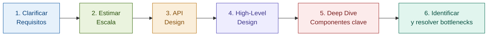

Este proceso toma 45-60 minutos en una entrevista. La distribución de tiempo recomendada:

| Paso | Tiempo | Qué logras |
|---|---|---|
| Clarificar requisitos | 5-7 min | Entiendes el problema real, no el que asumiste |
| Estimar escala | 5 min | Defines si necesitas distribución, caching, sharding |
| API Design | 5 min | Defines la interfaz que el sistema expone |
| High-Level Design | 15 min | La arquitectura general con componentes principales |
| Deep Dive | 15 min | Los 2-3 componentes más críticos o difíciles |
| Bottlenecks | 5 min | Identifica y propone soluciones para los puntos débiles |

### Paso 1: Clarificar Requisitos — el paso más importante

Nunca empieces a diseñar sin hacer preguntas. Un sistema para "1,000 usuarios" y uno para "1 billón de usuarios" son arquitecturas completamente diferentes.

**Las preguntas que siempre debes hacer:**

**Funcionales — qué hace el sistema:**
- ¿Cuáles son las features core? (No asumas)
- ¿Hay features que explícitamente están out of scope?
- ¿Qué acciones pueden hacer los usuarios?

**No funcionales — cómo se comporta el sistema:**
- ¿Cuántos usuarios? ¿Usuarios activos diarios (DAU)?
- ¿Cuál es el ratio read/write?
- ¿Qué latencia es aceptable? ¿p99 < 100ms?
- ¿Qué disponibilidad se necesita? ¿99.9%? ¿99.99%?
- ¿El sistema es global o regional?
- ¿Qué consistencia necesitamos? ¿Podemos tolerar consistencia eventual?
- ¿Hay requisitos de compliance o seguridad especiales?

**De datos:**
- ¿Qué tipos de datos maneja? ¿Texto, imágenes, video?
- ¿Cuánto tiempo se guardan los datos?
- ¿El sistema es de lectura intensa, escritura intensa, o balanceado?

> ⚠️ **Error crítico:** Asumir que sabes lo que el entrevistador quiere. Un "diseña Twitter" puede significar el timeline, el sistema de DMs, o la ingesta de tweets. Siempre pregunta.

### Paso 2: Estimar Escala

Las estimaciones definen las decisiones arquitectónicas. No necesitas ser preciso — necesitas estar en el orden de magnitud correcto. Ver sección 3 para el proceso detallado.

### Paso 3: API Design

Definir los endpoints principales antes de diseñar los internos. Esto te fuerza a pensar en los casos de uso desde afuera.

```
POST /api/v1/tweets
  body: { content: string, media_ids?: string[] }
  returns: { tweet_id: string, created_at: timestamp }

GET /api/v1/feed
  query: { user_id, page_token?, limit? }
  returns: { tweets: Tweet[], next_page_token?: string }

POST /api/v1/users/{user_id}/follow
  body: { target_user_id: string }
  returns: { success: boolean }
```

### Paso 4: High-Level Design

Dibuja los componentes principales y cómo se conectan. En este paso:
- No entres en detalles de implementación
- Identifica los flujos de datos principales (read path, write path)
- Decide los componentes de alto nivel

### Paso 5: Deep Dive

Profundiza en los 2-3 componentes más interesantes o críticos. El entrevistador puede dirigirte o tú puedes elegir. Aquí demuestras conocimiento real.

### Paso 6: Bottlenecks — identifica las debilidades

Ningún sistema es perfecto. Naming your own weaknesses antes de que el entrevistador los señale demuestra madurez de Staff Engineer:
- "El single point of failure en este diseño es X — lo resolvería con Y"
- "Si el write traffic crece 10x, el cuello de botella sería Z"
- "La consistencia eventual aquí puede causar el problema P"

---

## 3. Estimación y Cálculos

### Por qué importa la estimación

Sin estimaciones, no puedes tomar decisiones arquitectónicas informadas. ¿Necesitas un solo servidor o mil? ¿Un disco de 1TB es suficiente o necesitas petabytes?

### Los números que debes memorizar

**Latencias de hardware:**

| Operación | Latencia | Factor relativo |
|---|---|---|
| L1 cache reference | 0.5 ns | 1x |
| L2 cache reference | 7 ns | 14x |
| RAM reference | 100 ns | 200x |
| SSD random read | 150 µs | 300,000x |
| HDD random read | 10 ms | 20,000,000x |
| Red local (LAN) | 0.5 ms | — |
| Red entre datacenters | 150 ms | — |

**Los números más útiles para estimación:**

```
1 millón de bytes    = 1 MB
1 billón de bytes    = 1 GB
1 trillón de bytes   = 1 TB

Velocidad de red en datacenter:  10 Gbps = 1.25 GB/s
Velocidad de escritura SSD:      100-500 MB/s
Velocidad de lectura SSD NVMe:   500 MB/s - 3 GB/s

1 día    = 86,400 segundos ≈ 100,000 segundos (para cálculos rápidos)
1 mes    ≈ 2.5 millones de segundos
1 año    ≈ 30 millones de segundos
```

**Disponibilidad en números reales:**

```
99.9%   = 8.7 horas de downtime/año   (tres nueves)
99.99%  = 52.6 minutos de downtime/año (cuatro nueves)
99.999% = 5.2 minutos de downtime/año  (cinco nueves — CosmosDB SLA)
```

### El proceso de estimación — ejemplo con Twitter

**Supuestos de partida:**
- 300 millones de usuarios activos mensuales
- 100 millones de usuarios activos diarios (DAU)
- Ratio read/write: 100:1 (Twitter es muy read-heavy)
- Un tweet promedio: 280 caracteres ≈ 300 bytes
- Un tweet con metadata completa ≈ 1 KB

**Estimación de writes (tweets):**
```
100M usuarios × 2 tweets/día promedio = 200M tweets/día
200M tweets/día ÷ 100,000 s/día      = 2,000 tweets/segundo (write TPS)
```

**Estimación de reads (feed, timeline):**
```
2,000 writes/s × ratio 100:1 = 200,000 lecturas/segundo (read TPS)
```

**Estimación de storage:**
```
Texto:
  2,000 tweets/s × 1 KB = 2 MB/s
  2 MB/s × 86,400 s/día = ~170 GB/día de tweets de texto
  170 GB/día × 365 días = ~62 TB/año de solo texto

Imágenes (10% de tweets tienen imagen de ~200 KB):
  200 tweets/s con imagen × 200 KB = 40 MB/s
  40 MB/s × 86,400 s = ~3.5 TB/día de imágenes
  3.5 TB/día × 365     = ~1.3 PB/año de imágenes
```

**Estimación de bandwidth:**
```
Reads: 200,000 tweets/s × 1 KB = 200 MB/s outbound (solo texto)
Con imágenes: 200,000 × 10% × 200 KB ≈ 4 GB/s outbound
Total outbound estimado: ~4.2 GB/s
```

**Conclusiones arquitectónicas derivadas directamente de las estimaciones:**
- **200,000 reads/segundo** → Necesitamos caching agresivo. No puede ser solo DB.
- **62 TB/año de texto** → Necesitamos sharding en DB o motor distribuido.
- **1.3 PB/año de imágenes** → Object storage (Azure Blob/S3), nunca disco local.
- **4.2 GB/s outbound** → CDN es obligatorio, no opcional.

> ⚠️ **Clave en entrevista:** Las estimaciones no son para ser exactas — son para derivar decisiones arquitectónicas. Muestra ese razonamiento explícitamente.

### Cómo estimar capacidad de componentes

**Un servidor web típico (8 cores, 32 GB RAM):**
- ~10,000-50,000 requests/segundo sin DB
- ~1,000-5,000 requests/segundo con DB
- Con latencia p99 < 100ms

**Una base de datos SQL single-node bien indexada:**
- ~10,000-50,000 reads simples/segundo
- ~5,000-10,000 writes/segundo
- Más allá: read replicas para reads, sharding para writes

**Redis single-node:**
- ~100,000-500,000 operaciones/segundo
- Con clustering: escala horizontalmente casi sin límite

---

## 4. Componentes Fundamentales — La Caja de Herramientas

Un Arquitecto no inventa — combina componentes conocidos de formas correctas para el problema específico. Antes de diseñar cualquier sistema, necesitas conocer los bloques disponibles y cuándo usar cada uno.

```mermaid
graph TD
    Components["Componentes de System Design"] --> Compute["Compute"]
    Components --> Storage["Storage"]
    Components --> Network["Network / Distribution"]
    Components --> Async["Async / Messaging"]
    Components --> Cache["Cache Layer"]

    Compute --> WS["Web/App Servers\n(.NET, Node, Java)"]
    Compute --> FaaS["Functions as a Service\n(Azure Functions, Lambda)"]

    Storage --> SQL["SQL Databases\n(SQL Server, PostgreSQL)"]
    Storage --> NoSQL["NoSQL\n(MongoDB, Cassandra, CosmosDB)"]
    Storage --> Object["Object Storage\n(Azure Blob Storage, S3)"]
    Storage --> Search["Search Engines\n(Elasticsearch, Azure Cognitive Search)"]

    Network --> LB["Load Balancers\n(L4 / L7)"]
    Network --> CDN["CDN\n(Azure CDN, CloudFront)"]
    Network --> AG["API Gateway\n(Azure API Management)"]

    Async --> MQ["Message Queues\n(Azure Service Bus)"]
    Async --> ES["Event Streaming\n(Kafka, Azure Event Hubs)"]

    Cache --> Redis["Redis\n(Azure Cache for Redis)"]
    Cache --> InMem["In-Process\n(IMemoryCache)"]

    style Components fill:#FAEEDA,stroke:#BA7517,color:#854F0B
    style Compute fill:#E6F1FB,stroke:#185FA5,color:#0C447C
    style Storage fill:#EAF3DE,stroke:#3B6D11,color:#27500A
    style Network fill:#EEEDFE,stroke:#534AB7,color:#3C3489
    style Async fill:#FCEBEB,stroke:#A32D2D,color:#791F1F
    style Cache fill:#E1F5EE,stroke:#0F6E56,color:#085041
```

La pregunta que siempre debes hacerte al añadir un componente:
**"¿Qué problema específico resuelve este componente en mi sistema, y cuál es el trade-off que introduzco al usarlo?"**

---

## 5. Load Balancers

### La intuición

Un load balancer distribuye el tráfico entrante entre múltiples servidores backend, asegurando que ninguno se sature mientras otros están ociosos. Pero es más que eso: es el punto de entrada del sistema, responsable de health checking, SSL termination, y routing inteligente.

### L4 vs L7 — la diferencia fundamental

**Layer 4 (Transport Layer) Load Balancers:**
- Opera a nivel TCP/UDP — no lee el contenido HTTP
- Muy rápido (no necesita parsear el payload)
- Distribuye solo por IP + Puerto — no puede hacer routing por URL, headers o cookies
- Ejemplos: Azure Load Balancer básico, AWS NLB

**Layer 7 (Application Layer) Load Balancers:**
- Opera a nivel HTTP/HTTPS — lee y entiende el contenido
- Puede hacer routing basado en URL path, hostname, headers, cookies
- Hace SSL termination (descifra HTTPS y habla HTTP al backend)
- Ligeramente más lento por el parsing adicional
- Ejemplos: Azure Application Gateway, AWS ALB, Nginx

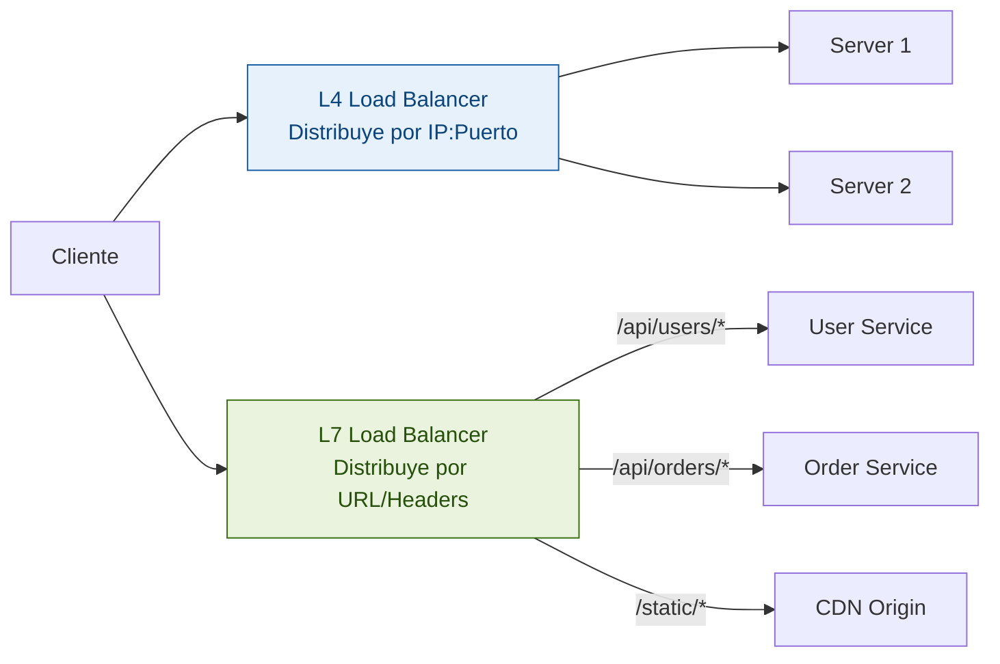

**¿Cuándo usar cada uno?**

| Criterio | L4 | L7 |
|---|---|---|
| Máximo rendimiento | ✅ Más rápido | ⚠️ Overhead de parsing |
| Routing inteligente | ❌ No puede | ✅ Por URL, headers, cookies |
| SSL termination | ⚠️ Passthrough | ✅ Termina SSL en el LB |
| Websockets | ✅ Nativo | ✅ Con configuración |
| Health checks HTTP | ❌ Solo TCP | ✅ HTTP request /health |
| Costo | ✅ Más barato | ⚠️ Más costoso |

**En la mayoría de sistemas modernos:** combinas ambos. L4 en el borde para máximo throughput, L7 para routing inteligente a microservicios.

### Algoritmos de balanceo

**Round Robin:** Cada request va al siguiente servidor en la lista. Simple y justo cuando todos los servers tienen la misma capacidad.

```
Request 1 → Server A
Request 2 → Server B
Request 3 → Server C
Request 4 → Server A (vuelve al inicio)
```

**Weighted Round Robin:** Los servidores más potentes reciben más tráfico proporcionalmente.

**Least Connections:** El request va al servidor con menos conexiones activas. Mejor cuando los requests tienen duraciones variables.

**IP Hash:** La IP del cliente determina a qué servidor va (sticky sessions a nivel L4). Útil para WebSockets o cuando el server guarda estado de sesión.

**Least Response Time:** El request va al servidor más rápido en ese momento.

### Health Checks — detectar servers caídos

```
Health Check activo típico:
- El LB hace un HTTP GET /health a cada backend cada 30 segundos
- Si responde 200 OK:   healthy
- Si no responde o 5xx: unhealthy
- Después de 3 fallos consecutivos:  remove del pool
- Después de 2 éxitos consecutivos:  add back al pool
```

**El /health endpoint en ASP.NET Core:**
```csharp
builder.Services.AddHealthChecks()
    .AddSqlServer(connectionString)
    .AddRedis(redisConnection)
    .AddUrlGroup(new Uri("https://api.payment.com/health"));

// Endpoint de liveness (solo el proceso)
app.MapHealthChecks("/health/live", new HealthCheckOptions
{
    Predicate = check => check.Tags.Contains("liveness")
});

// Endpoint de readiness (todas las dependencias)
app.MapHealthChecks("/health/ready", new HealthCheckOptions
{
    Predicate = check => check.Tags.Contains("readiness")
});
```

### Load Balancer como Single Point of Failure

El load balancer mismo puede fallar. En producción siempre tienes al menos dos en configuración active-passive o active-active, con failover automático via DNS o Virtual IP.

**En Azure:** Azure Load Balancer y Application Gateway son servicios PaaS con HA incorporada — no gestionas la redundancia tú mismo.

---

## 6. Caching

### La intuición

El caching es la técnica de mejor ROI en cualquier sistema. La intuición es simple: calcular o leer algo una vez y reutilizar el resultado es siempre más rápido que repetir el trabajo.

Pero el caching introduce un problema fundamental: **¿cómo sé cuándo el cache está desactualizado?** Esta tensión entre performance y consistencia es el corazón del diseño de cache.

### Dónde puede existir el cache

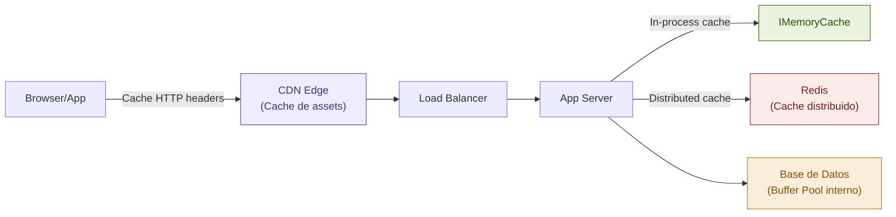

**Browser cache:** El navegador guarda CSS, JS, imágenes. Controlado por headers HTTP.

**CDN cache:** Servidores distribuidos geográficamente que sirven contenido cerca del usuario.

**Application cache (in-process):** En memoria del proceso. Ultra-rápido pero no se comparte entre instancias.

**Distributed cache (Redis):** Cache compartido entre múltiples instancias del servidor. Más lento que in-process pero consistente entre instancias.

**Database buffer pool:** El motor de base de datos cachea páginas en RAM automáticamente.

### Estrategias de escritura — el trade-off fundamental

#### Cache-Aside (Lazy Loading) — la más común

La aplicación gestiona el cache manualmente: lee del cache, si no está hace cache miss y va a la DB.

```csharp
public async Task<Product> GetProductAsync(int productId)
{
    var cacheKey = $"product:{productId}";

    // 1. Intentar obtener del cache
    var cached = await cache.GetStringAsync(cacheKey);
    if (cached != null)
        return JsonSerializer.Deserialize<Product>(cached); // Cache hit ✅

    // 2. Cache miss → ir a la base de datos
    var product = await db.Products.FindAsync(productId);
    if (product == null) return null;

    // 3. Guardar en cache para próximas peticiones
    await cache.SetStringAsync(cacheKey,
        JsonSerializer.Serialize(product),
        new DistributedCacheEntryOptions
        {
            AbsoluteExpirationRelativeToNow = TimeSpan.FromMinutes(30)
        });

    return product;
}
```

**Pros:** Solo cachea lo que se pide. Si el cache falla, la app sigue funcionando.
**Contras:** Cache miss inicial es lento (triple operación). Posible thundering herd.

#### Write-Through — consistencia garantizada

Cuando escribes datos, siempre escribes tanto en el cache como en la DB.

```csharp
public async Task UpdateProductAsync(Product product)
{
    // Escribir en DB
    db.Products.Update(product);
    await db.SaveChangesAsync();

    // Escribir en cache simultáneamente
    await cache.SetStringAsync($"product:{product.ProductId}",
        JsonSerializer.Serialize(product),
        new DistributedCacheEntryOptions
        {
            AbsoluteExpirationRelativeToNow = TimeSpan.FromMinutes(30)
        });
}
```

**Pros:** El cache siempre está actualizado.
**Contras:** Cada write es más lento. Cacheas datos que quizás nunca se leerán.

#### Write-Behind (Write-Back) — máximo rendimiento en writes

Escribes en el cache inmediatamente. El cache se sincroniza con la DB de forma asíncrona en batch.

**Pros:** Write ultrarrápido.
**Contras:** Si el cache falla antes de sincronizar con DB, pierdes datos. Solo para sistemas donde perder algunos datos es aceptable.

### Políticas de Invalidación — el problema más difícil

> "There are only two hard things in Computer Science: cache invalidation and naming things." — Phil Karlton

**TTL (Time To Live):** El dato expira después de un tiempo fijo.

```csharp
// ¿Cuánto TTL?
// Datos de configuración: 1 hora o más
// Perfiles de usuario: 5-15 minutos
// Inventario de productos: 1-5 minutos
// Precios: máximo 1 minuto (o invalidación explícita)
// Disponibilidad de asientos: 0 — no cachear
```

**Invalidación explícita:** Cuando el dato cambia, eliminas la entrada del cache inmediatamente.

```csharp
public async Task UpdateProductPriceAsync(int productId, decimal newPrice)
{
    var product = await db.Products.FindAsync(productId);
    product.Price = newPrice;
    await db.SaveChangesAsync();

    // Invalidar el cache explícitamente
    await cache.RemoveAsync($"product:{productId}");
}
```

### Cache Stampede / Thundering Herd

El problema: cuando un dato popular expira, cientos de requests simultáneos ven cache miss y todos van a la DB al mismo tiempo. La DB se satura.

**Solución — Mutex/Lock pattern:**
```csharp
private static readonly SemaphoreSlim _cacheLock = new(1, 1);

public async Task<Product> GetProductWithLockAsync(int productId)
{
    var cacheKey = $"product:{productId}";
    var cached = await cache.GetStringAsync(cacheKey);
    if (cached != null) return JsonSerializer.Deserialize<Product>(cached);

    await _cacheLock.WaitAsync();
    try
    {
        // Double-check: otro thread pudo haberlo cargado mientras esperábamos
        cached = await cache.GetStringAsync(cacheKey);
        if (cached != null) return JsonSerializer.Deserialize<Product>(cached);

        var product = await db.Products.FindAsync(productId);
        await cache.SetStringAsync(cacheKey, JsonSerializer.Serialize(product),
            new DistributedCacheEntryOptions
            {
                AbsoluteExpirationRelativeToNow = TimeSpan.FromMinutes(30)
            });
        return product;
    }
    finally
    {
        _cacheLock.Release();
    }
}
```

### Eviction Policies

| Política | Cómo funciona | Cuándo usar |
|---|---|---|
| **LRU** (Least Recently Used) | Elimina el dato usado hace más tiempo | La más común |
| **LFU** (Least Frequently Used) | Elimina el dato menos accedido | Cuando frecuencia importa más que tiempo |
| **TTL** | Elimina los expirados primero | Complementa las otras |
| **Random** | Elimina al azar | Simple, sorprendentemente bueno en algunos casos |

**Redis default:** allkeys-lru.

### Caching en .NET

```csharp
// In-Process Cache — solo para una instancia
services.AddMemoryCache();
public class ProductService(IMemoryCache cache)
{
    public async Task<Product> GetAsync(int id) =>
        await cache.GetOrCreateAsync($"product:{id}", async entry =>
        {
            entry.AbsoluteExpirationRelativeToNow = TimeSpan.FromMinutes(30);
            entry.SlidingExpiration = TimeSpan.FromMinutes(5);
            return await db.Products.FindAsync(id);
        });
}

// Distributed Cache — compartido entre instancias
services.AddStackExchangeRedisCache(options =>
{
    options.Configuration = "redis-connection-string";
    options.InstanceName = "MyApp:";
});
```

> 🎓 **Educative.io ahora:** Lee el capítulo **"Caching"** en "Grokking the System Design Interview". Su comparación de estrategias de cache complementa perfectamente lo que acabas de leer.

---

## 7. Message Queues y Event Streaming

### La intuición

Las message queues resuelven el problema del acoplamiento temporal: el productor y el consumidor no necesitan estar disponibles al mismo tiempo. El productor pone un mensaje en la cola y continúa. El consumidor lo procesa cuando puede.

**La diferencia fundamental entre Queue y Event Stream:**

**Queue (Azure Service Bus):** Los mensajes se procesan una vez y se eliminan. Point-to-point. Si hay 5 consumidores, cada mensaje va a solo uno de ellos.

**Event Stream (Kafka, Azure Event Hubs):** Los mensajes se retienen por días/semanas. Múltiples grupos de consumidores pueden leer el mismo mensaje independientemente. Los consumidores pueden "rebobinar" y releer desde el principio.

### Por qué las queues son fundamentales en System Design

**Desacoplamiento:** El servicio A no necesita saber si el servicio B está disponible.

**Amortiguación de load spikes:** Si llegan 10,000 órdenes en un segundo pero el procesador maneja 1,000/segundo, la queue absorbe el spike.

**Fiabilidad:** Si el consumidor falla, el mensaje vuelve a la queue para reintento.

**Paralelismo:** Múltiples instancias del consumidor procesan mensajes en paralelo.

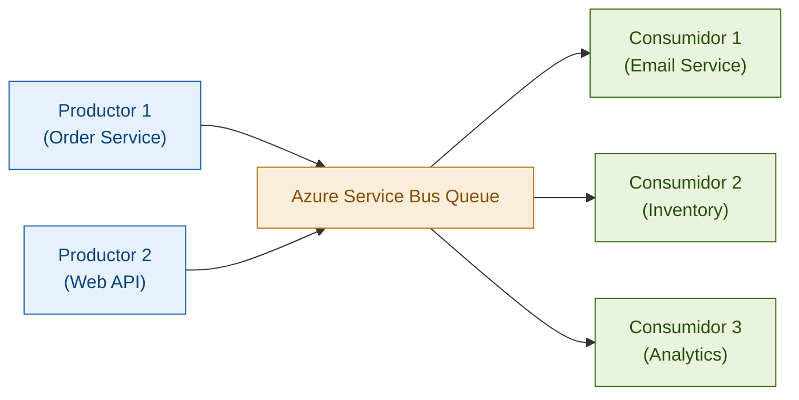

### Azure Service Bus en .NET

```csharp
// Productor — enviar mensaje
var client = new ServiceBusClient(connectionString);
var sender = client.CreateSender("orders-queue");

var order = new OrderCreatedEvent { OrderId = 42, Total = 1500m };
var message = new ServiceBusMessage(JsonSerializer.Serialize(order))
{
    ContentType = "application/json",
    MessageId = Guid.NewGuid().ToString(),
    CorrelationId = correlationId
};
await sender.SendMessageAsync(message);

// Consumidor — procesar mensajes
var processor = client.CreateProcessor("orders-queue", new ServiceBusProcessorOptions
{
    MaxConcurrentCalls = 10,
    AutoCompleteMessages = false
});

processor.ProcessMessageAsync += async args =>
{
    var order = JsonSerializer.Deserialize<OrderCreatedEvent>(args.Message.Body);
    try
    {
        await ProcessOrderAsync(order);
        await args.CompleteMessageAsync(args.Message); // Eliminar de la queue
    }
    catch
    {
        await args.AbandonMessageAsync(args.Message); // Vuelve a la queue para reintento
    }
};
```

### Dead Letter Queue (DLQ)

Cuando un mensaje falla reiteradamente (después de N reintentos), va a la Dead Letter Queue. Esto evita que un mensaje "envenenado" bloquee el procesamiento indefinidamente.

```csharp
// Revisar la DLQ para diagnosticar mensajes fallidos
var dlqReceiver = client.CreateReceiver(
    ServiceBusEntityPath.FormatDeadLetterPath("orders-queue"));

var messages = await dlqReceiver.ReceiveMessagesAsync(maxMessages: 100);
foreach (var message in messages)
{
    Console.WriteLine($"Failed: {message.DeadLetterReason} - {message.MessageId}");
    // Log, alert, o proceso manual de recuperación
}
```

### Kafka / Azure Event Hubs — Event Streaming

**Conceptos clave de Kafka:**

```
Topic:     Categoría de mensajes (ej: "orders", "payments", "user-events")
Partition: Subdivisión de un topic para paralelismo
           - Mensajes dentro de una partition están ordenados
           - Múltiples partitions permiten múltiples consumidores en paralelo
Offset:    Posición de un mensaje en una partition
Consumer Group: Grupo de consumidores que comparten el trabajo
           - Cada partition es procesada por un consumidor del grupo
           - 10 partitions + 5 consumidores = cada consumidor procesa 2 partitions
Retention: Cuánto tiempo se guardan los mensajes (default: 7 días en Kafka)
```

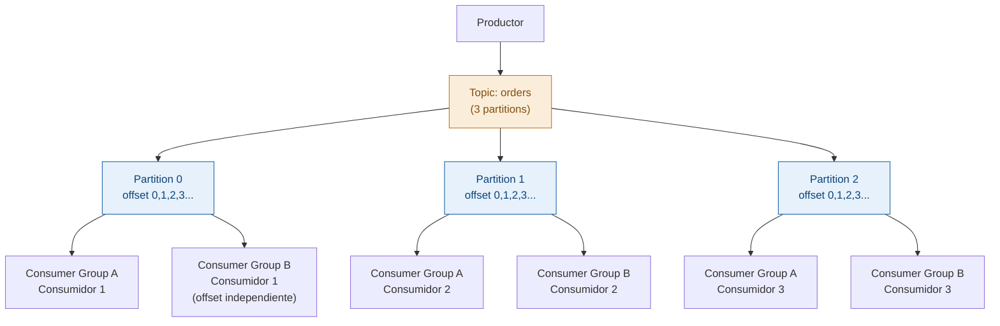

### Queue vs Event Stream — tabla de decisión

| Criterio | Queue (Service Bus) | Event Stream (Kafka/Event Hubs) |
|---|---|---|
| **Procesamiento** | Cada mensaje: una vez | Múltiples consumidores, mismo evento |
| **Retención** | Se elimina al completar | Días o semanas configurables |
| **Rebobinar** | No | Sí — desde cualquier offset |
| **Throughput** | Miles/segundo | Millones/segundo |
| **Casos de uso** | Tareas, jobs, comandos | Log aggregation, event sourcing, pipelines |
| **Complejidad** | Menor | Mayor (gestión de offsets, partitions) |

### Garantías de entrega

**At-most-once:** El mensaje se entrega máximo una vez. Puede perderse, nunca se duplica.

**At-least-once:** El mensaje se entrega al menos una vez. Puede duplicarse (si el consumidor falla antes de hacer ACK). Los consumidores deben ser **idempotentes**.

**Exactly-once:** El mensaje se entrega exactamente una vez. Kafka lo soporta desde v0.11 con transacciones. Costoso en performance.

**Idempotencia — el patrón para at-least-once:**
```csharp
public async Task ProcessOrderAsync(OrderCreatedEvent order)
{
    // Verificar si ya procesamos este mensaje
    var exists = await db.ProcessedEvents.AnyAsync(e => e.EventId == order.EventId);
    if (exists) return; // Ignorar duplicado

    using var transaction = await db.Database.BeginTransactionAsync();
    await CreateOrderInternalAsync(order);
    await db.ProcessedEvents.AddAsync(new ProcessedEvent { EventId = order.EventId });
    await db.SaveChangesAsync();
    await transaction.CommitAsync();
}
```

---

## 8. API Design y API Gateway

### Los principios de una buena API

**1. Consistencia sobre creatividad:**
```
✅ GET /api/v1/users/{id}     ✅ GET /api/v1/orders/{id}
❌ GET /api/v1/getUser/{id}   ❌ GET /api/v1/fetchOrder?orderId={id}
```

**2. Sustantivos en plural para recursos, verbos HTTP para acciones:**
```
GET    /api/v1/orders          → Listar
POST   /api/v1/orders          → Crear
GET    /api/v1/orders/{id}     → Obtener uno
PUT    /api/v1/orders/{id}     → Actualizar (completo)
PATCH  /api/v1/orders/{id}     → Actualizar (parcial)
DELETE /api/v1/orders/{id}     → Eliminar
```

**3. Versioning desde el inicio:**
```
/api/v1/orders  → Versión 1 (no romper contratos)
/api/v2/orders  → Versión 2 (nuevas features)
```

**4. Paginación siempre en colecciones:**
```json
GET /api/v1/orders?page_token=abc123&limit=20

{
  "data": [ ... ],
  "next_page_token": "def456",
  "total_count": 1543
}
```

**5. Errores informativos:**
```json
{
  "error": {
    "code": "ORDER_ITEM_OUT_OF_STOCK",
    "message": "El producto 'Laptop' no tiene stock disponible",
    "details": {
      "product_id": "prod-123",
      "requested_quantity": 5,
      "available_quantity": 2
    },
    "request_id": "req-abc-123"
  }
}
```

**6. Idempotency keys para operaciones críticas:**
```
POST /api/v1/payments
Idempotency-Key: client-generated-uuid-123

Si el cliente envía el mismo request dos veces con la misma key,
el servidor procesa el pago una sola vez y retorna el mismo resultado.
Previene pagos duplicados por reintentos de red.
```

### API Gateway — el punto de entrada unificado

En microservicios, el API Gateway centraliza funcionalidades transversales que cada servicio tendría que implementar por separado.

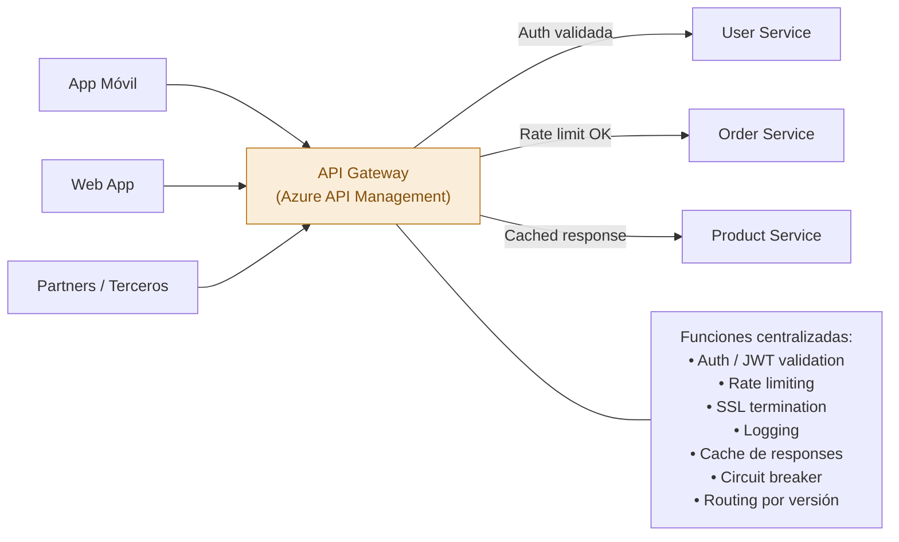

**Azure API Management (APIM) — rate limiting:**
```xml
<!-- Policy en Azure APIM -->
<rate-limit-by-key
    calls="100"
    renewal-period="60"
    counter-key="@(context.Request.Headers['X-Client-Id'])" />
<!-- Si se supera: retorna 429 Too Many Requests automáticamente -->
```

---

## 9. CDN — Content Delivery Networks

### La intuición

Un CDN es una red de servidores distribuidos geográficamente que sirven contenido desde el servidor más cercano al usuario. En lugar de que un usuario en México descargue una imagen de un servidor en Virginia (150ms de latencia), la descarga del servidor CDN en Querétaro (10ms).

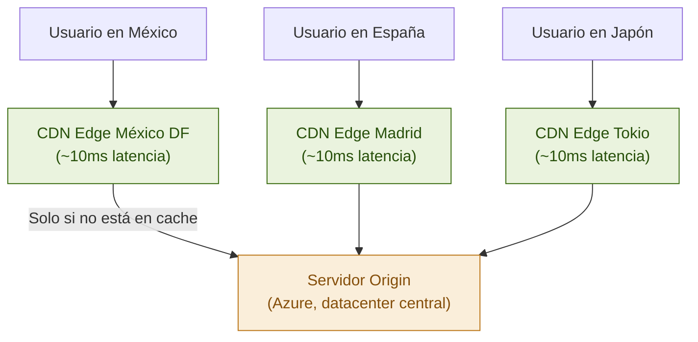

### Qué va y qué no va en CDN

**Siempre en CDN:**
- Imágenes, videos, audio
- CSS, JavaScript, HTML estático
- Fuentes web, iconos, PDFs

**A veces en CDN (con TTL corto):**
- Responses de APIs que no cambian frecuentemente (catálogos, configuraciones)
- Páginas generadas server-side cacheables

**Nunca en CDN:**
- Datos específicos del usuario (carrito, perfil, historial)
- Datos en tiempo real (precios en bolsa, inventario en vivo)
- Requests autenticados con datos sensibles

### Headers HTTP que controlan el CDN

```
Cache-Control: public, max-age=86400
→ CDN puede cachear por 24 horas.

Cache-Control: private, no-cache
→ No cachear en CDN.

Cache-Control: no-store
→ No cachear en ningún lugar.

ETag: "33a64df5..."
→ Fingerprint del contenido. Si no cambió, retorna 304 Not Modified.
```

### CDN en ASP.NET Core

```csharp
// Assets estáticos con hash — se pueden cachear por 1 año
app.UseStaticFiles(new StaticFileOptions
{
    OnPrepareResponse = ctx =>
    {
        ctx.Context.Response.Headers.Append(
            "Cache-Control", "public,max-age=31536000,immutable");
    }
});

// Contenido dinámico cacheable en CDN por 5 minutos
[HttpGet("products/{id}/details")]
[ResponseCache(Duration = 300, Location = ResponseCacheLocation.Any)]
public async Task<IActionResult> GetProductDetails(int id)
{
    var product = await _productService.GetAsync(id);
    return Ok(product);
}
```

**El CDN como primera línea contra DDoS:** Los CDNs absorben tráfico malicioso antes de que llegue a tu infraestructura. Un ataque DDoS de 1 Tbps puede ser absorbido por el CDN global mientras tu origen sigue funcionando.

---

## 10. CAP Theorem Aplicado

### La intuición correcta

El teorema CAP dice que un sistema distribuido no puede garantizar simultáneamente:

- **C**onsistency: Todos los nodos ven los mismos datos al mismo tiempo
- **A**vailability: El sistema siempre responde (aunque no tenga los datos más recientes)
- **P**artition Tolerance: El sistema funciona aunque la red se fragmente entre nodos

**La clave que la mayoría malentiende:** La Tolerancia a Particiones no es opcional en sistemas distribuidos reales. Las redes fallan — no es cuestión de si ocurre sino de cuándo. Por tanto, **la elección real es entre Consistencia y Disponibilidad** cuando ocurre una partición.

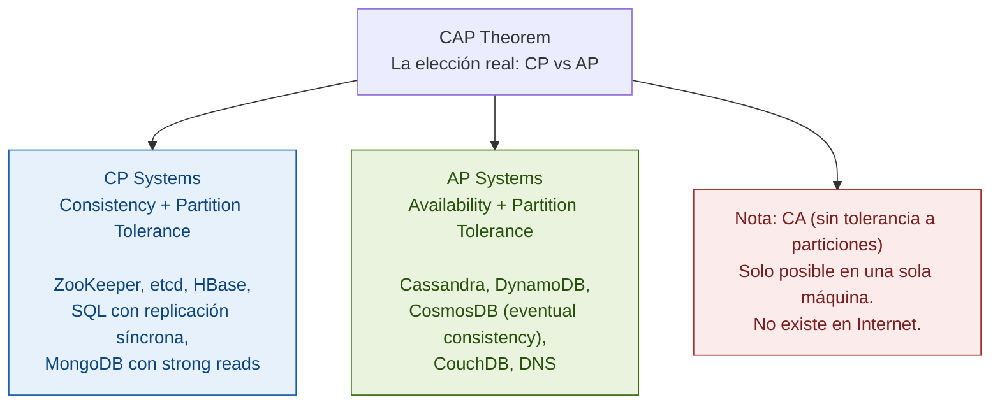

### Cuando ocurre una partición — el momento de verdad

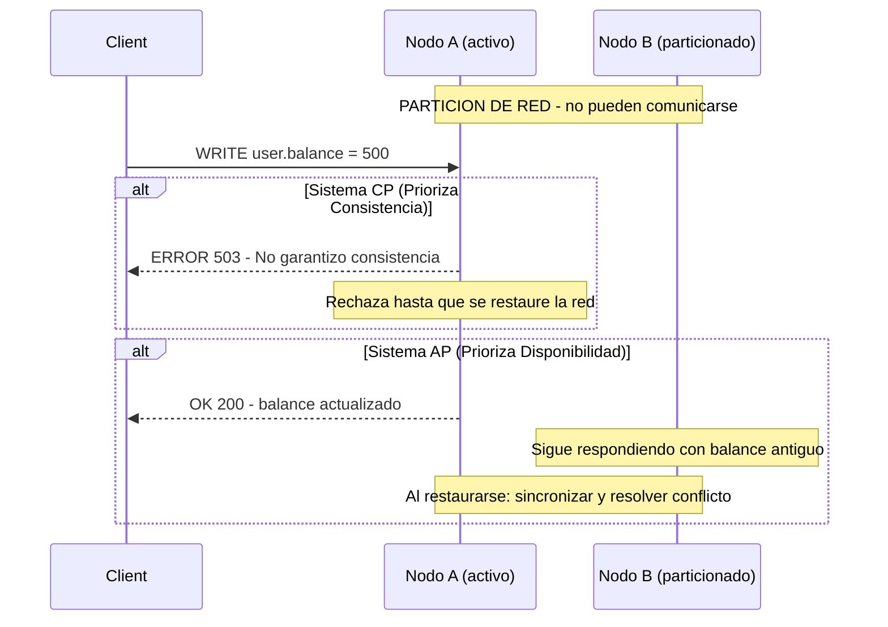

### Decisiones reales basadas en CAP

**Usa CP cuando:**
- Los datos desactualizados causan daño real (dinero, inventario crítico)
- Un error temporal es aceptable para el usuario
- Ejemplo: sistema bancario — mejor rechazar una transferencia que procesarla dos veces

**Usa AP cuando:**
- La disponibilidad importa más que la exactitud momentánea
- El sistema puede resolver conflictos después
- Ejemplo: feed de redes sociales — es aceptable que un like tarde 2 segundos en aparecer

### PACELC — la extensión más realista

El teorema PACELC extiende CAP para el caso cuando **no** hay una partición:

```
If Partition (P): trade-off entre Availability (A) vs Consistency (C)
Else (E):         trade-off entre Latency (L) vs Consistency (C)
```

Incluso sin particiones, para leer datos más recientes necesitas sincronización entre nodos (costosa en latencia). Para responder rápido, puedes leer de un nodo local (que puede estar ligeramente desactualizado).

CosmosDB expone este trade-off explícitamente con sus 5 niveles de consistencia (Strong → Bounded Staleness → Session → Consistent Prefix → Eventual).

---

## 11. Consistencia Eventual

### La intuición

Consistencia eventual significa que si dejas de hacer writes, eventualmente todos los nodos convergerán al mismo valor. No te dice cuándo, pero garantiza que ocurrirá.

En la práctica, "eventual" suele ser milisegundos a segundos en la mayoría de sistemas.

**El ejemplo concreto:** Cuando subes una foto a Instagram y alguien en otro país la ve inmediatamente, puede ser que aún no se haya propagado a todos los datacenters. Ellos verían la versión anterior de tu perfil por algunos segundos. Eso es consistencia eventual — y para una red social, está perfectamente bien.

### El problema del write skew y los conflict resolvers

Cuando dos nodos aceptan writes concurrentes sobre el mismo dato durante una partición, al restaurarse hay un conflicto. El sistema necesita una estrategia de resolución:

**Last Write Wins (LWW):** El write con timestamp más reciente gana. Simple pero problemático por clock skew entre servidores.

**Vector Clocks:** Cada operación lleva un vector de versiones por nodo. El sistema detecta conflictos causales y los presenta al usuario. Usado por DynamoDB y Riak.

**CRDTs (Conflict-free Replicated Data Types):** Estructuras matemáticamente diseñadas para que los conflictos se resuelvan automáticamente de forma determinista.

```
CRDT counter: Nodo A incrementa 3 veces, Nodo B incrementa 2 veces durante partición
Al sincronizar: el contador final es siempre 5, sin importar el orden del merge.
```

### Read-your-writes consistency — el problema más común

El usuario escribe algo y luego lo lee inmediatamente — pero lee de una réplica que aún no tiene su write.

**Estrategias:**
1. Después de un write del usuario, sus lecturas van al primary temporalmente
2. El cliente envía la versión del dato en cada read — si la réplica es más antigua, se redirige al primary
3. Session stickiness: el usuario siempre lee del mismo servidor

---

## 12. Patrones de Escalabilidad

### Vertical vs Horizontal Scaling

**Vertical Scaling (Scale Up):** Darle más recursos a la misma máquina.

```
Pros: Simple, sin overhead de distribución, ACID nativo
Contras: Límite físico, costoso no-linealmente, single point of failure, downtime para upgrades
```

**Horizontal Scaling (Scale Out):** Agregar más máquinas.

```
Pros: Escala casi infinita, alta disponibilidad, costo lineal
Contras: Complejidad, distribución de datos, debugging difícil, transacciones entre nodos costosas
```

**La regla en System Design:** Escala verticalmente hasta el límite práctico, luego diseña para horizontal. No empieces con horizontal si no lo necesitas.

### Stateless Services — requisito para escala horizontal

Para escalar horizontalmente, cada instancia debe ser intercambiable. Eso requiere que el servicio sea **stateless**.

```csharp
// ❌ Stateful — imposible escalar horizontalmente
public class CartController : ControllerBase
{
    private static Dictionary<string, Cart> _carts = new(); // Estado en memoria!

    // Si el request llega a otro servidor, no encuentra el carrito
}

// ✅ Stateless — el estado vive en Redis
public class CartController : ControllerBase
{
    private readonly IDistributedCache _cache;

    public async Task<IActionResult> AddToCart(string userId, CartItem item)
    {
        var key = $"cart:{userId}";
        var cart = await GetCartFromCache(key) ?? new Cart();
        cart.Items.Add(item);
        await _cache.SetStringAsync(key, JsonSerializer.Serialize(cart),
            new DistributedCacheEntryOptions { SlidingExpiration = TimeSpan.FromHours(24) });
        return Ok();
    }
    // Cualquier servidor puede manejar el request
}
```

### Database Scaling — el cuello de botella más común

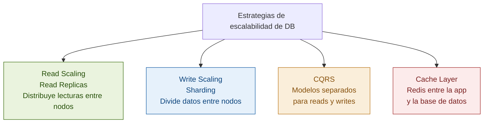

**El orden correcto:** Primero el cache → luego read replicas → luego sharding. Nunca al revés.

---

## 13. Alta Disponibilidad y Resiliencia

### Circuit Breaker — evitar fallas en cascada

El Circuit Breaker previene que un servicio lento o caído cause que todo el sistema se caiga.

```
Estado CLOSED (normal):     Las llamadas pasan. Si N fallos → OPEN
Estado OPEN (fallando):     Falla inmediatamente sin llamar. Después de T segundos → HALF-OPEN
Estado HALF-OPEN (probando): Permite algunas llamadas. Si éxito → CLOSED, si falla → OPEN
```

```csharp
// Polly — Circuit Breaker en .NET
services.AddHttpClient<IPaymentService, PaymentService>()
    .AddPolicyHandler(
        Policy<HttpResponseMessage>
            .Handle<HttpRequestException>()
            .OrResult(r => !r.IsSuccessStatusCode)
            .CircuitBreakerAsync(
                handledEventsAllowedBeforeBreaking: 5,
                durationOfBreak: TimeSpan.FromSeconds(30),
                onBreak: (result, breakDelay) =>
                    logger.LogWarning("Circuit breaker abierto por {Delay}s", breakDelay),
                onReset: () => logger.LogInformation("Circuit breaker cerrado")
            )
    );
```

### Retry con Exponential Backoff y Jitter

```csharp
// Polly — Retry inteligente
var retryPolicy = Policy<HttpResponseMessage>
    .Handle<HttpRequestException>()
    .OrResult(r => (int)r.StatusCode >= 500)
    .WaitAndRetryAsync(
        retryCount: 3,
        sleepDurationProvider: attempt =>
            TimeSpan.FromSeconds(Math.Pow(2, attempt)) +        // 2s, 4s, 8s
            TimeSpan.FromMilliseconds(new Random().Next(0, 1000)), // + jitter aleatorio
        onRetry: (result, delay, attempt, context) =>
            logger.LogWarning("Reintento {Attempt} en {Delay}", attempt, delay)
    );
// El jitter evita que todos los clientes reintenten al mismo tiempo (thundering herd)
```

### Bulkhead — aislar recursos por operación

```csharp
// Máximo 10 llamadas concurrentes al servicio de pagos
// El servicio de emails tiene su propio bulkhead separado
var bulkheadPolicy = Policy.BulkheadAsync(
    maxParallelization: 10,
    maxQueuingActions: 25,
    onBulkheadRejectedAsync: context =>
    {
        logger.LogWarning("Bulkhead rechazó llamada al servicio de pagos");
        return Task.CompletedTask;
    });
```

### Timeout — nunca esperar indefinidamente

```csharp
// Siempre timeout explícito
var timeoutPolicy = Policy.TimeoutAsync(TimeSpan.FromSeconds(5));

// Combinando políticas (el orden importa)
var combinedPolicy = Policy.WrapAsync(
    retryPolicy,    // Outer: reintenta
    circuitBreaker, // Middle: circuit breaker
    timeoutPolicy   // Inner: timeout por intento
);
```

---

## 14. Monolito vs Microservicios

### La pregunta correcta

No es "¿monolito o microservicios?" sino "¿cuál arquitectura resuelve mejor los problemas que tengo ahora, considerando el costo de la complejidad que introduce?"

### El Monolito — injustamente desprestigiado

```
Cuándo el monolito es la respuesta correcta:
✅ Equipo pequeño (< 10-15 ingenieros)
✅ Producto en etapa temprana — el dominio aún está evolucionando
✅ No tienes problemas de escala que los microservicios resolverían
✅ No tienes equipos independientes que necesiten deployment independiente

El "Microservices Premium" (Martin Fowler): pagas el costo de complejidad
sin recibir los beneficios si el producto no los necesita.
```

**Monolito modular — el mejor de ambos mundos:**

```csharp
// Un solo proceso, pero con límites claros entre módulos
// Los módulos no se llaman directamente — se comunican por interfaces/eventos
Solution/
  Orders/
    Orders.Domain/
    Orders.Application/
    Orders.Infrastructure/
  Inventory/
    Inventory.Domain/
  Users/
  SharedKernel/

// Regla: Orders no hace referencia directa a Inventory
// Se comunican por eventos internos (MediatR) o interfaces explícitas
// Cuando necesites separar, los límites ya están definidos
```

### Microservicios — cuándo realmente tienen sentido

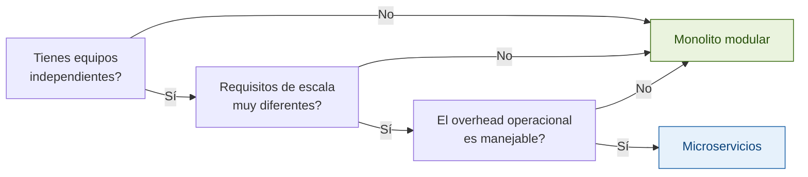

**Los microservicios resuelven tres problemas específicos:**
1. **Deployment independiente:** Equipo A puede deployar sin coordinar con equipo B
2. **Escala independiente:** El servicio de búsqueda necesita 100 instancias, pagos necesita 5
3. **Aislamiento de fallos:** Si el servicio de recomendaciones falla, el flujo de compra sigue

**Los problemas que introducen:**

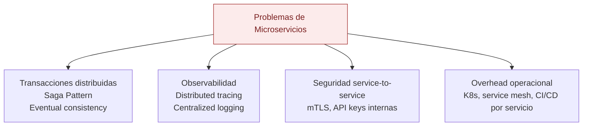

> 🎓 **Pluralsight ahora:** **"Microservices Architecture"** de Mark Heath. Cubre cuándo usar microservicios, patrones de comunicación, y los problemas operacionales reales.

---

## 15. Caso 1: URL Shortener (bit.ly)

### Clarificación de requisitos

**Funcionales:**
- Dado una URL larga, genera una URL corta (ej: short.ly/abc123)
- Dado una URL corta, redirige a la URL larga
- Analytics: cuántos clicks por URL

**No funcionales:**
- 100 millones de URLs nuevas por día
- Ratio read/write: 100:1
- Latencia de redirect: < 10ms (p99)
- Alta disponibilidad: 99.99%

### Estimaciones

```
Writes:
100M URLs/día ÷ 86,400 s/día ≈ 1,200 URLs/segundo

Reads (redirects):
1,200 × 100 = 120,000 redirects/segundo

Storage:
URL larga promedio: 200 bytes | metadata: ~100 bytes | Total: ~300 bytes/registro
100M URLs/día × 300 bytes × 365 días = ~10 TB/año → Sharding necesario en el futuro

Bandwidth:
120,000 reads/s × 300 bytes = ~36 MB/s outbound
→ Manejable. CDN puede ayudar pero no es crítico aquí.
```

### Generación del código corto — la decisión técnica clave

**Opción 1: Hash de la URL larga**
```
MD5(url_larga) → tomar primeros 7 caracteres
Problema: colisiones posibles. Requiere lógica de detección y reintento.
```

**Opción 2: ID auto-incremental + Base62 (la mejor opción)**
```csharp
// 62^7 = ~3.5 trillones de combinaciones → suficiente para décadas
const string chars = "abcdefghijklmnopqrstuvwxyzABCDEFGHIJKLMNOPQRSTUVWXYZ0123456789";

public string EncodeBase62(long id)
{
    var result = new StringBuilder();
    while (id > 0)
    {
        result.Insert(0, chars[(int)(id % 62)]);
        id /= 62;
    }
    return result.ToString().PadLeft(7, 'a');
}
// ID 1 → "aaaaaab", ID 1000000 → "aaadl8"
```

**El problema del ID en sistemas distribuidos:** ¿Quién genera el ID único?

**Solución: Snowflake ID (Twitter)**
```
64 bits = 1 bit (0) | 41 bits (timestamp ms) | 10 bits (machine_id) | 12 bits (sequence)
→ 4096 IDs únicos por milisegundo por máquina
→ Único globalmente sin coordinación entre máquinas
→ Los IDs son monotónicamente crecientes (beneficio adicional para el B-Tree del índice)
```

### Arquitectura completa

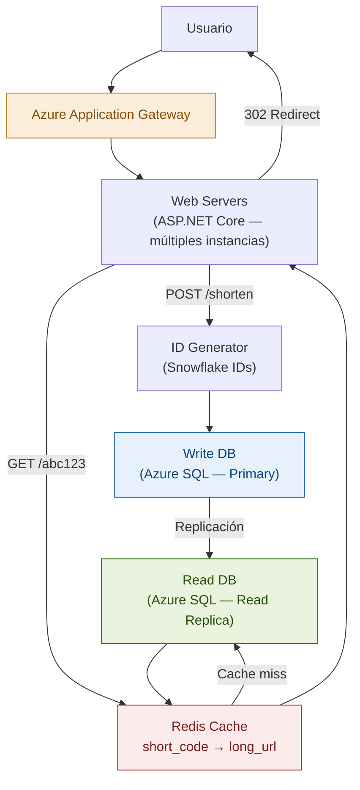

### Schema

```sql
CREATE TABLE urls (
    id BIGINT PRIMARY KEY,            -- Snowflake ID
    short_code VARCHAR(10) NOT NULL,
    long_url VARCHAR(2048) NOT NULL,
    user_id BIGINT,
    created_at DATETIME NOT NULL,
    expires_at DATETIME,
    click_count BIGINT DEFAULT 0
);

CREATE UNIQUE INDEX IX_urls_short_code ON urls (short_code);
-- Este índice es el más crítico: 99% del tráfico es GET por short_code
```

### 301 vs 302 Redirect

**301 Permanent:** Browser cachea → requests futuros no llegan a tu servidor. No puedes medir clicks.

**302 Temporary:** Browser NO cachea → cada click llega a tu servidor. Puedes medir analytics.

**Para bit.ly: 302** — el negocio es el analytics.

### Analytics con cola asíncrona — patrón crítico

```
NO incrementes click_count en la DB en cada redirect — sería un bottleneck masivo.

En cambio:
1. El redirect ocurre inmediatamente (< 10ms desde cache)
2. Se pone un evento en Azure Service Bus: { short_code, timestamp, user_agent, ip }
3. Un worker asíncrono agrega clicks en batch (cada 5 minutos)
→ El usuario experimenta el redirect rápido. Analytics llegan con pequeño delay.
```

---

## 16. Caso 2: Rate Limiter

### El problema

Diseñar un servicio que limite cuántos requests puede hacer cada cliente en un período. Por ejemplo: máximo 100 requests por minuto por API key.

### Los algoritmos de Rate Limiting

#### Fixed Window Counter — simple pero con edge case

```
Ventana fija de 1 minuto. Contador por ventana.
Problema: cliente puede hacer 100 al final del minuto 1 y 100 al inicio del minuto 2
→ 200 requests en 2 segundos, aunque el límite sea 100/min.
```

```csharp
public async Task<bool> IsAllowedAsync(string apiKey, int limitPerMinute)
{
    var key = $"ratelimit:{apiKey}:{DateTime.UtcNow:yyyyMMddHHmm}";
    var count = await redis.StringIncrementAsync(key);
    if (count == 1) await redis.KeyExpireAsync(key, TimeSpan.FromMinutes(2));
    return count <= limitPerMinute;
}
```

#### Sliding Window Counter — el mejor balance

Combina Fixed Window con interpolación para aproximar el sliding window sin guardar todos los timestamps.

```
Ejemplo:
Límite: 100 req/min | Ventana actual: 02:00 - 03:00
Requests en ventana anterior (01:00 - 02:00): 84
Requests en ventana actual hasta 02:45: 60
Tiempo transcurrido: 45s = 75% de la ventana

Estimación = 84 × (1 - 0.75) + 60 = 21 + 60 = 81 → OK, menor que 100
```

#### Token Bucket — el más usado en producción

Cada cliente tiene un "cubo" con capacidad máxima de tokens. Los tokens se recargan a una tasa fija. Cada request consume un token.

```
bucket_capacity = 100 tokens (burst máximo)
refill_rate = 10 tokens/segundo (tasa sostenida)

Un cliente puede hacer 100 requests en el primer segundo (burst)
Luego solo 10/segundo (la tasa de recarga)
→ Permite ráfagas cortas sin bloquear completamente
```

```csharp
// Token Bucket con Redis — Lua script para atomicidad
public async Task<(bool allowed, int remaining)> TryConsumeAsync(
    string clientId, int capacity, double refillRate)
{
    var now = DateTimeOffset.UtcNow.ToUnixTimeMilliseconds();
    var script = @"
        local bucket = redis.call('HMGET', KEYS[1], 'tokens', 'last_refill')
        local tokens = tonumber(bucket[1]) or tonumber(ARGV[1])
        local last_refill = tonumber(bucket[2]) or tonumber(ARGV[3])
        local elapsed = (tonumber(ARGV[3]) - last_refill) / 1000.0
        local new_tokens = math.min(tonumber(ARGV[1]), tokens + (elapsed * tonumber(ARGV[2])))
        if new_tokens >= 1 then
            new_tokens = new_tokens - 1
            redis.call('HMSET', KEYS[1], 'tokens', new_tokens, 'last_refill', ARGV[3])
            redis.call('EXPIRE', KEYS[1], 3600)
            return {1, math.floor(new_tokens)}
        else
            redis.call('HMSET', KEYS[1], 'tokens', new_tokens, 'last_refill', ARGV[3])
            redis.call('EXPIRE', KEYS[1], 3600)
            return {0, math.floor(new_tokens)}
        end";

    var result = (RedisResult[])await redis.ScriptEvaluateAsync(script,
        new RedisKey[] { $"tb:{clientId}" },
        new RedisValue[] { capacity, refillRate, now });

    return ((int)result[0] == 1, (int)result[1]);
}
```

### Arquitectura distribuida del Rate Limiter

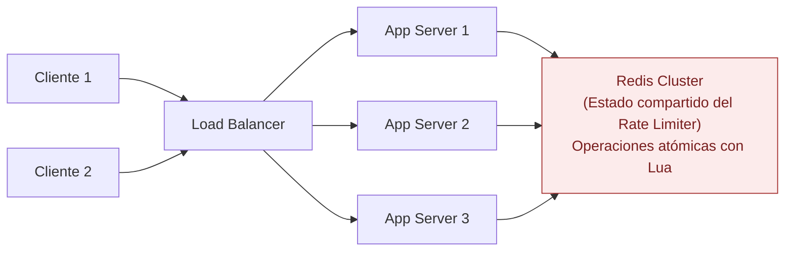

**¿Por qué Redis y no en-memory?** En un sistema distribuido con múltiples servidores, el estado del rate limiter debe ser compartido. Si está en memoria de cada servidor, un cliente puede hacer el doble de requests distribuyendo entre servidores.

### Response headers correctos

```
HTTP/1.1 200 OK
X-RateLimit-Limit: 100
X-RateLimit-Remaining: 47
X-RateLimit-Reset: 1715612400  (timestamp Unix del próximo reset)

HTTP/1.1 429 Too Many Requests
Retry-After: 30               (segundos hasta que puede reintentar)
X-RateLimit-Limit: 100
X-RateLimit-Remaining: 0
```

---

## 17. Caso 3: Twitter Feed / News Feed

### Estimaciones

```
200M usuarios activos × 5 tweets/día ÷ 86,400 = ~11,600 tweets/segundo (writes)
200M usuarios × 10 lecturas de feed/día ÷ 86,400 = ~23,000 lecturas/segundo
Fan-out: un tweet de alguien con 1M followers → 1M actualizaciones de feed necesarias
```

### El problema de fan-out — el corazón del diseño

#### Fan-out on Write (Push Model)

Al publicar, copias el tweet al home timeline (feed) de cada follower.

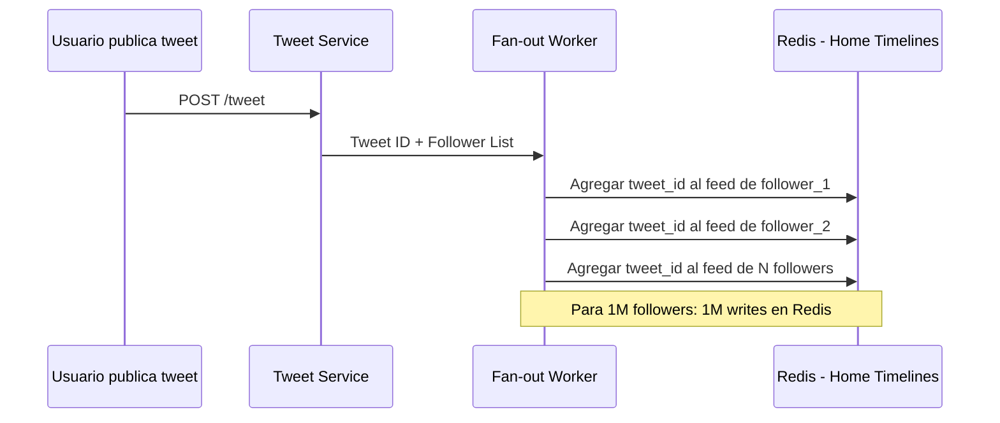

**Pros:** Leer el feed es instantáneo (ya pre-computado en cache).
**Contras:** "Celebrity problem" — un tweet con 10M followers causa 10M writes simultáneos.

#### Fan-out on Read (Pull Model)

Al leer el feed, traes los tweets de todas las personas que sigues en ese momento.

**Pros:** Publicar un tweet es simple — solo guardarlo.
**Contras:** Leer el feed es muy lento y costoso para usuarios que siguen muchas personas.

#### La solución híbrida de Twitter

```
Regla:
  Si usuario tiene < 10,000 followers → Fan-out on Write (tweet va al cache de cada follower)
  Si usuario tiene > 10,000 followers → Fan-out on Read (tweet no se pre-pushea)

Al leer el feed:
1. Leer tweets pre-computados del cache (usuarios normales)
2. Para cada celebrity seguida: fetch directo al tweet store en tiempo real
3. Merge y ordenar por timestamp
4. Devolver feed combinado
```

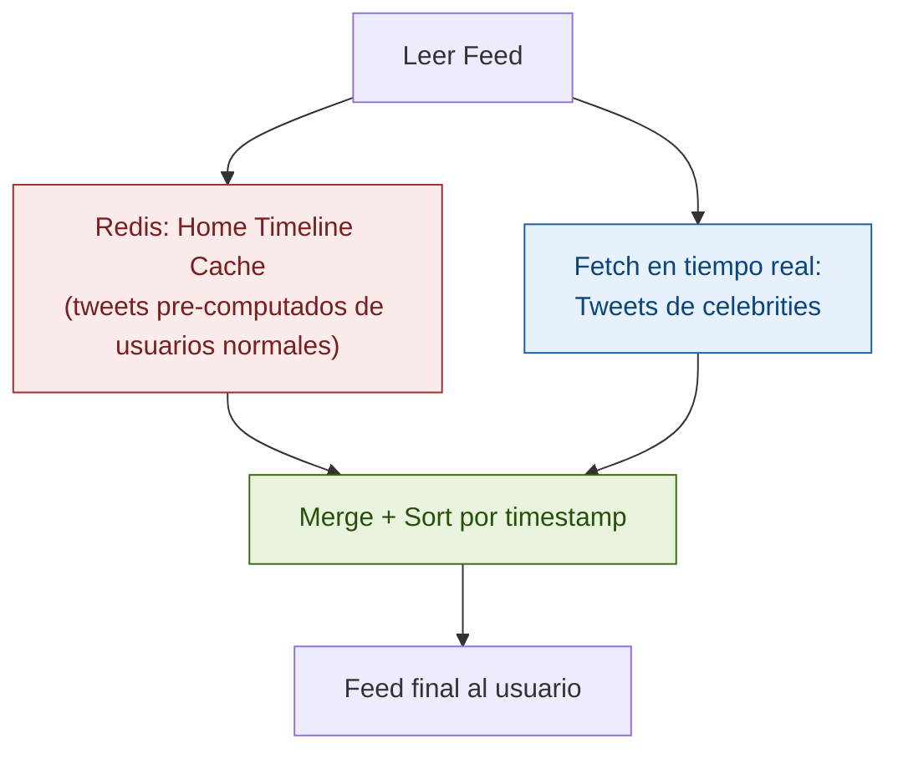

### Storage de tweets y media

```sql
CREATE TABLE tweets (
    tweet_id BIGINT PRIMARY KEY,  -- Snowflake ID
    user_id BIGINT NOT NULL,
    content VARCHAR(280),
    media_ids JSON,               -- IDs de medios en Azure Blob Storage
    created_at DATETIME NOT NULL,
    like_count BIGINT DEFAULT 0,
    retweet_count BIGINT DEFAULT 0
);

-- Home timeline en Redis: Sorted Set
-- Key:    "timeline:{user_id}"
-- Member: tweet_id
-- Score:  timestamp (para ordenar)
-- ZADD timeline:12345 1715000000 tweet_id_9876
-- ZREVRANGE timeline:12345 0 499  → los últimos 500 tweets del feed
```

---

## 18. Caso 4: Sistema de Notificaciones

### Estimaciones

```
10M notificaciones/día → ~115/segundo promedio
Picos (evento viral): 1M notificaciones en 5 minutos → 3,333/segundo

Los canales de entrega son externos y lentos:
Push: 50-500ms | Email: 1-5s | SMS: 1-10s
→ Procesamiento asíncrono es obligatorio
```

### Arquitectura

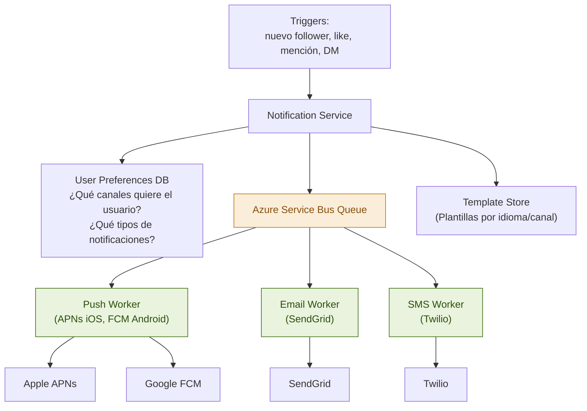

### Idempotencia — evitar notificaciones duplicadas

```csharp
public async Task SendNotificationAsync(NotificationMessage message)
{
    var idempotencyKey = $"notif:{message.NotificationId}:{message.Channel}";

    // SET NX = Set if Not eXists — atómico en Redis
    var set = await redis.StringSetAsync(
        idempotencyKey, "sent",
        TimeSpan.FromDays(1),
        When.NotExists);

    if (!set) return; // Ya enviada, ignorar duplicado

    await SendToExternalProviderAsync(message);
}
```

---

## 19. Caso 5: Sistema de Chat (WhatsApp)

### Estimaciones

```
1 billón de usuarios
100 billones de mensajes/día ÷ 86,400 = ~1.15M mensajes/segundo
Storage: 100B × 100 bytes ≈ 10 TB/día de texto
→ Retención 7 días: ~70 TB hot storage | Mensajes antiguos: Azure Archive
```

### WebSockets — obligatorio para tiempo real

Para mensajes en tiempo real (< 1 segundo), no puedes usar HTTP polling. Necesitas una conexión persistente bidireccional.

```csharp
app.UseWebSockets();
app.Map("/ws", async context =>
{
    if (!context.WebSockets.IsWebSocketRequest) { context.Response.StatusCode = 400; return; }

    var userId = GetUserIdFromToken(context);
    using var ws = await context.WebSockets.AcceptWebSocketAsync();
    connectionManager.AddConnection(userId, ws);

    var buffer = new byte[4096];
    while (ws.State == WebSocketState.Open)
    {
        var result = await ws.ReceiveAsync(buffer, CancellationToken.None);
        if (result.MessageType == WebSocketMessageType.Close) break;

        var message = JsonSerializer.Deserialize<ChatMessage>(buffer[..result.Count]);
        await messageRouter.RouteMessageAsync(message);
    }
    connectionManager.RemoveConnection(userId);
});
```

### Arquitectura del chat

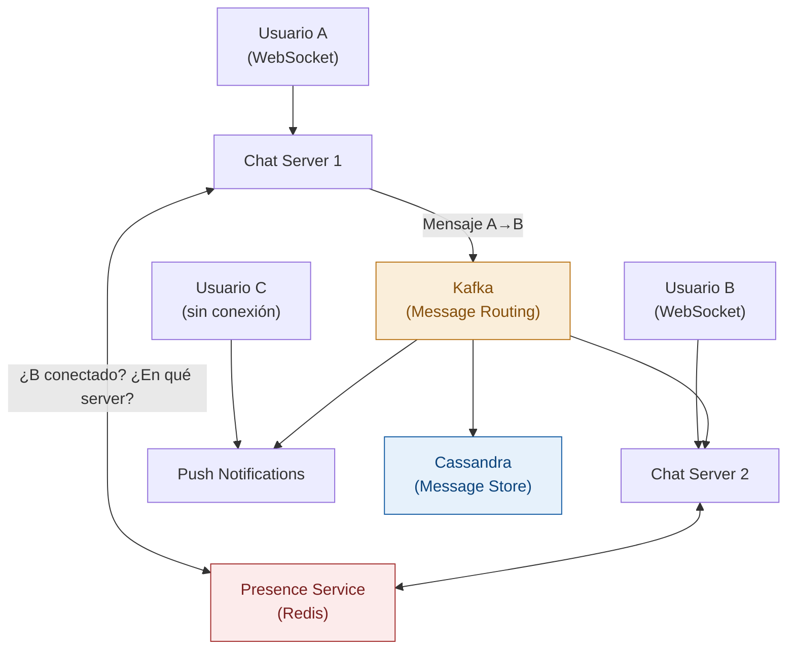

### Por qué Cassandra para mensajes de chat

El patrón de acceso de chat es perfecto para Cassandra:
- Siempre accedes por `conversation_id`
- Siempre quieres los últimos N mensajes ordenados por tiempo

```sql
CREATE TABLE messages (
    conversation_id UUID,
    message_id TIMEUUID,    -- UUID con timestamp = ordenación natural
    sender_id BIGINT,
    content TEXT,
    media_url TEXT,
    PRIMARY KEY (conversation_id, message_id)
) WITH CLUSTERING ORDER BY (message_id DESC);

-- Query eficiente: "últimos 50 mensajes de esta conversación"
SELECT * FROM messages WHERE conversation_id = ? LIMIT 50;
```

---

## 20. Caso 6: YouTube / Video Streaming

### Upload Pipeline

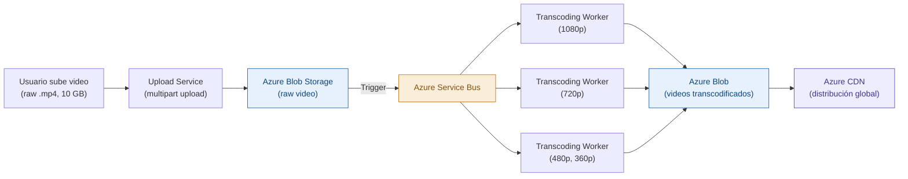

### Adaptive Bitrate Streaming (ABR)

El video no se sirve como un archivo monolítico. Se divide en segmentos de 2-10 segundos y el cliente elige la calidad de cada segmento según su conexión.

```
Un video se almacena en múltiples resoluciones y fragmentado:
video_id_1080p/segment_001.ts  |  video_id_720p/segment_001.ts  | ...

El archivo m3u8 (HLS) lista todas las opciones:
#EXT-X-STREAM-INF:BANDWIDTH=5000000,RESOLUTION=1920x1080
video_id_1080p/playlist.m3u8
#EXT-X-STREAM-INF:BANDWIDTH=2500000,RESOLUTION=1280x720
video_id_720p/playlist.m3u8

El player del cliente elige la calidad según el ancho de banda.
Si la conexión empeora, baja automáticamente la calidad para el siguiente segmento.
```

**El 99%+ del tráfico de video es servido desde el CDN.** El origen (Blob Storage) casi nunca se accede directamente.

---

## 21. Caso 7: Uber / Ride-Sharing

### El desafío único

Uber tiene dos challenges: localización en tiempo real y matching de oferta/demanda.

```
1M conductores activos × 1 update de ubicación/4s = 250,000 updates/segundo
→ ENORMEMENTE write-heavy para datos de ubicación
→ Solo la ubicación MÁS RECIENTE importa
→ Necesitas búsquedas geoespaciales eficientes
```

### Redis para localización geoespacial

```
Redis soporta geo-indexing nativo:
GEOADD drivers 19.4326 -99.1332 "driver:123"  -- Agregar/actualizar ubicación del conductor
GEORADIUS drivers 19.4326 -99.1332 2 km ASC COUNT 10  -- Conductores en 2km de radio
→ Respuesta: [driver:456, 0.3km], [driver:789, 0.8km], ...

Este comando retorna en ~1ms, procesando millones de ubicaciones.
```

### Matching Engine

```mermaid
graph TD
    P["Pasajero solicita ride"] --> MS["Matching Service"]
    MS --> Redis["Redis Geospatial\n(ubicaciones en tiempo real)"]
    Redis --> MS
    MS --> Rank["Ranking Service\n(distancia, rating, tipo de vehículo)"]
    Rank --> Notify["Notificar conductores cercanos\n(push notification + WebSocket)"]
    Notify -->|"Primer driver que acepta"| Match["Match confirmado"]
    Match --> P
    Match --> Trip["Trip Service\n(tracking de la ruta)"]

    style Redis fill:#FCEBEB,stroke:#A32D2D,color:#791F1F
    style MS fill:#FAEEDA,stroke:#BA7517,color:#854F0B
```

---

## 22. Caso 8: Search Autocomplete

### El desafío

Mientras el usuario escribe, sugerencias deben aparecer en < 100ms (idealmente < 50ms). Para Google, esto son 10 billones de búsquedas diarias.

### La estructura de datos — Trie (Prefix Tree)

Un Trie es un árbol donde cada camino raíz→nodo representa un prefijo. Para buscar todas las palabras que comienzan con "app": navega hasta el nodo "p" en a-p-p y recorre todos los subárboles. Complejidad: O(longitud del prefijo).

**El problema de escala:** Un Trie de todo el vocabulario de Google sería terabytes — no cabe en RAM de un solo servidor.

### Solución escalable

```mermaid
graph TD
    User["Usuario escribe 'ap'"] --> AG["API Gateway"]
    AG --> Geo["Geolocation Router\n(servidor regional más cercano)"]
    Geo --> AC["Autocomplete Server\n(Región México)"]
    AC --> TrieRAM["Trie en RAM\n(prefijos populares de México)"]
    TrieRAM -->|"Cache miss - prefijo raro"| Central["Trie Store Centralizado\n(Redis / DB especializada)"]

    style TrieRAM fill:#EAF3DE,stroke:#3B6D11,color:#27500A
    style Central fill:#E6F1FB,stroke:#185FA5,color:#0C447C
```

**El truco de la partición por prefijo:**
- Servidor A1: maneja todos los prefijos "a" a "az" (Trie completamente en RAM)
- Servidor B1: maneja "b" a "bz"
- Cada servidor conoce su Trie completamente, sin necesitar ir a otro nodo

**Actualización del Trie:** Las búsquedas van a un log (Kafka). Un job batch analiza las búsquedas de la última semana y reconstruye el Trie con los términos más populares. Se actualiza cada pocas horas, no en tiempo real.

---

## 23. Caso 9: Distributed File Storage (Google Drive)

### Upload con Chunking — evitar reiniciar desde cero

Los archivos grandes se dividen en chunks de 4-8 MB que se suben independientemente.

```csharp
public async Task UploadFileAsync(string filePath)
{
    const int chunkSize = 4 * 1024 * 1024; // 4 MB
    var fileId = Guid.NewGuid().ToString();
    var fileBytes = await File.ReadAllBytesAsync(filePath);
    var totalChunks = (int)Math.Ceiling((double)fileBytes.Length / chunkSize);

    for (int i = 0; i < totalChunks; i++)
    {
        var chunkData = fileBytes.Skip(i * chunkSize).Take(chunkSize).ToArray();
        var chunkHash = ComputeSHA256(chunkData); // Para deduplicación

        await UploadChunkAsync(new ChunkUploadRequest
        {
            FileId = fileId, ChunkIndex = i, TotalChunks = totalChunks,
            Data = chunkData, Hash = chunkHash
        });
    }
}
```

### Deduplicación — el truco que ahorra petabytes

Si 1 millón de usuarios suben el mismo archivo de Office, ¿guardas 1 millón de copias?

No. Calculas el hash SHA256. Si dos archivos tienen el mismo hash, son idénticos. Solo guardas una copia y múltiples referencias.

```sql
CREATE TABLE chunks (
    chunk_hash VARCHAR(64) PRIMARY KEY,  -- SHA256 del contenido
    storage_path VARCHAR(500),           -- Ubicación en Azure Blob
    size_bytes BIGINT,
    reference_count INT DEFAULT 1        -- Cuántos archivos usan este chunk
);

CREATE TABLE file_chunks (
    file_id BIGINT,
    chunk_index INT,
    chunk_hash VARCHAR(64),
    PRIMARY KEY (file_id, chunk_index),
    FOREIGN KEY (chunk_hash) REFERENCES chunks(chunk_hash)
);
```

### Sincronización entre dispositivos

```mermaid
sequenceDiagram
    participant Phone as Teléfono (modifica archivo)
    participant Sync as Sync Service
    participant MQ as Event Queue
    participant Laptop as Laptop (recibe cambio)

    Phone->>Sync: PATCH /file/123 (nuevo chunk)
    Sync->>MQ: FileChanged { file_id=123, user_id=456, changed_chunks=[2,5] }
    MQ->>Sync: Notificar dispositivos del usuario 456
    Sync->>Laptop: WebSocket: file_changed con lista de chunks modificados
    Laptop->>Sync: Descargar solo los chunks 2 y 5
    Note over Phone,Laptop: Solo se sincronizan los chunks que cambiaron
```

---

## 24. Caso 10: E-Commerce / Inventory System

### El problema de consistencia del inventario

Cuando 1,000 personas están viendo el mismo producto con solo 5 unidades, ¿cómo garantizas que no se venden más de 5?

### El flujo de compra

```mermaid
graph TD
    A["Agregar al carrito"] --> B["Inventory Service:\nSoft reserve en Redis\n(5 minutos TTL)"]
    B -->|"Reservado"| C["Ir al checkout"]
    C --> D["Payment Service:\nProcesar pago"]
    D -->|"Exitoso"| E["Inventory Service:\nHard commit en DB"]
    D -->|"Fallido"| F["Liberar soft reserve"]
    E --> G["Order confirmada"]
    B -->|"Sin stock"| H["Notificar: Sin stock"]

    style B fill:#FAEEDA,stroke:#BA7517,color:#854F0B
    style D fill:#EAF3DE,stroke:#3B6D11,color:#27500A
    style E fill:#E6F1FB,stroke:#185FA5,color:#0C447C
```

### Soft Reserve con Redis — prevenir overselling

```csharp
public async Task<bool> SoftReserveAsync(string productId, int qty, string sessionId)
{
    // Script Lua — atómico para evitar race conditions
    var script = @"
        local available = tonumber(redis.call('GET', KEYS[1]))
        if available == nil or available < tonumber(ARGV[1]) then return 0 end
        redis.call('DECRBY', KEYS[1], ARGV[1])
        redis.call('SET', KEYS[2], ARGV[1], 'EX', 300)  -- TTL 5 minutos
        return 1";

    var result = (int)await redis.ScriptEvaluateAsync(script,
        new RedisKey[]
        {
            $"inventory:available:{productId}",
            $"reservation:{sessionId}:{productId}"
        },
        new RedisValue[] { qty });

    return result == 1;
}
```

### Flash Sales — el caso extremo (Black Friday)

```
Problema: 100,000 usuarios comprando el mismo producto en el mismo segundo
→ La DB no puede manejar esa concurrencia directa

Solución real (Amazon, Alibaba):
1. Los pedidos van a una cola en Redis en lugar de directo a la DB
2. Un worker procesa la cola en orden (FIFO), máximo N writes/segundo a la DB
3. Los usuarios reciben inmediatamente: "tu pedido está siendo procesado"
4. En 2-5 segundos: confirmación o "sin stock"
→ La DB nunca recibe más de N writes/segundo, controlado por el worker
→ La experiencia del usuario es: respuesta inmediata + confirmación en segundos
```

---

## 25. Cómo Responder en una Entrevista de System Design

### El comportamiento que diferencia al candidato Staff

**Lo que hace un candidato promedio:**
- Empieza a diseñar sin preguntar nada
- Elige tecnologías sin justificar
- Propone una solución sin mencionar alternativas
- No menciona trade-offs
- Se queda callado si no sabe algo

**Lo que hace un candidato Staff:**
- Hace preguntas específicas y útiles al inicio
- Piensa en voz alta durante todo el diseño
- Justifica cada decisión con un trade-off explícito
- Propone alternativas y explica por qué eligió una
- **Identifica las debilidades de su propio diseño**
- Si no sabe algo, razona desde primeros principios

### Las frases que debes usar

**Para justificar decisiones:**
- "Elegí X en lugar de Y porque en este contexto [razón]. El trade-off es que [costo de X], pero para este sistema eso es aceptable porque [justificación]."
- "Hay dos enfoques: [A] y [B]. El primero tiene la ventaja de [beneficio] pero el problema de [costo]. El segundo es más apropiado aquí porque [razón]."

**Para comunicar escala:**
- "Con [X] usuarios y un ratio de [Y:1] reads/writes, estamos hablando de aproximadamente [Z] requests por segundo en el write path."
- "Este componente será el cuello de botella porque [razón]. Para resolverlo, consideraría [solución]."

**Para identificar trade-offs:**
- "Esta decisión sacrifica [A] en favor de [B]. Para este sistema, [B] es más importante porque [razón del negocio]."
- "El punto débil de este diseño es [X]. En producción real, lo abordaría con [Y]."

### Cómo manejar el no saber

```
Entrevistador: "¿Cómo implementarías consistent hashing aquí?"
Tu: "No he implementado consistent hashing directamente, pero entiendo el problema
     que resuelve: cuando cambias el número de shards, minimizar el remapeo de datos.
     El concepto básico es [...razonar desde primeros principios...]
     En este contexto específico, lo que necesitaría es [...aplicar el principio...]
     ¿Es eso lo que exploramos, o prefieres otro enfoque?"
```

Nunca finjas saber algo que no sabes. Razonar desde primeros principios mostrando que entiendes el problema es siempre mejor que una respuesta memorizada incorrecta.

---

## 26. Errores Comunes y Cómo Evitarlos

### Error 1: Proponer microservicios para todo

"Dividiría esto en 15 microservicios: AuthService, UserService, ProfileService..."

**La corrección:** Empieza con el design más simple que funcione. Si identificas componentes que necesitan escalar de forma diferente, entonces los separas.

### Error 2: Usar Kafka para todo

"Agregaría Kafka aquí para hacer las cosas asíncronas..."

**La corrección:** Usa una cola de mensajes solo cuando hay una razón específica: desacoplamiento de velocidades, fan-out a múltiples consumidores, o cuando la durabilidad de los eventos importa.

### Error 3: No estimar antes de proponer

"Usaría sharding aquí porque vamos a tener muchos datos..."

**La corrección:** Estima primero. Si el throughput o volumen supera lo que un solo servidor puede manejar razonablemente, entonces propones distribución.

### Error 4: Ignorar la latencia entre componentes

"El servicio A llama al B, que llama al C, que llama al D..."

**La corrección:** Cada llamada de red añade 1-50ms. Identifica el critical path. ¿Qué calls pueden ser en paralelo? ¿Qué datos pueden estar en cache?

### Error 5: Diseñar para el caso extremo inmediatamente

"Desde el inicio diseñaría para 1 billón de usuarios..."

**La corrección:** Diseña para el escenario actual + 10x. Identifica los puntos de escala naturales y menciona cómo evolucionarías si el sistema crece más allá.

### Error 6: No mencionar los propios puntos débiles

**La corrección:** Antes de que el entrevistador los señale, dilo tú mismo:
- "El SPOF en este diseño es X — lo resolvería con Y si se convierte en un problema"
- "La consistencia eventual aquí puede causar el problema P — los usuarios podrían ver Q"

---

## 27. Checklist Final y Plan de Práctica

### Checklist de conocimiento

**Framework y proceso:**
- [ ] Puedo explicar el proceso de 6 pasos y la distribución de tiempo en entrevista
- [ ] Sé qué preguntas hacer en la fase de clarificación de requisitos
- [ ] Puedo hacer estimaciones de TPS, storage y bandwidth en < 5 minutos
- [ ] Puedo derivar decisiones arquitectónicas directamente de las estimaciones

**Componentes fundamentales:**
- [ ] Explico L4 vs L7 load balancer con casos de uso concretos
- [ ] Conozco las tres estrategias de cache y sus trade-offs
- [ ] Explico la diferencia entre message queue y event stream con cuándo usar cada uno
- [ ] Entiendo cuándo un API Gateway agrega valor real

**Teoría distribuida:**
- [ ] Explico CAP theorem correctamente (la elección real es CP vs AP)
- [ ] Entiendo consistencia eventual y sus problemas prácticos (read-your-writes, write skew)
- [ ] Puedo explicar fan-out on write vs fan-out on read con sus trade-offs reales

**Patrones de resiliencia:**
- [ ] Entiendo el Circuit Breaker y sus tres estados
- [ ] Sé por qué el retry con jitter previene el thundering herd
- [ ] Puedo diseñar un sistema con liveness y readiness probes apropiados

**Casos de estudio:**
- [ ] Diseño URL shortener con estrategia de IDs justificada (Snowflake)
- [ ] Diseño rate limiter con al menos dos algoritmos diferentes
- [ ] Explico el celebrity problem del Twitter feed y la solución híbrida
- [ ] Entiendo por qué Cassandra para chat y cómo estructurar el schema
- [ ] Diseño el flujo de soft reserve + hard commit para inventario

### Plan de práctica — 4 semanas

**Semana 1:** Leer toda la guía. Tomar "Grokking the System Design Interview" en Educative (capítulos 1-8). Diseñar en papel sin mirar soluciones: URL Shortener y Rate Limiter.

**Semana 2:** Grokking capítulos 9-15. Diseñar: Twitter Feed y Notificaciones. Practicar estimaciones: dado un sistema, estimar TPS/storage/bandwidth en < 5 minutos.

**Semana 3:** "Grokking Modern System Design" primeros 5 módulos. Diseñar: Chat y E-Commerce. Practicar en voz alta explicando el diseño como si fuera una entrevista.

**Semana 4:** Mock interviews con Claude. "Designing Microsoft Azure Infrastructure Solutions (AZ-305)" en Pluralsight. Redesignar los casos que más trabajo costaron.

### Recursos — secuencia óptima

> 🎓 **Educative.io — Semanas 1-2:**
> **"Grokking the System Design Interview"**
> El curso más completo para preparación. Sus diagramas interactivos complementan esta guía.

> 🎓 **Educative.io — Semanas 3-4:**
> **"Grokking Modern System Design for Software Engineers & Managers"**
> Sistemas más modernos: streaming, ML systems, colaboración en tiempo real.

> 🎓 **Pluralsight — A partir de semana 3:**
> **"Designing Microsoft Azure Infrastructure Solutions (AZ-305)"**
> Cómo cada componente de esta guía se implementa en Azure.

> 🎓 **Pluralsight — Complementario:**
> **"Microservices Architecture"** de Mark Heath
> Para profundizar en los trade-offs de microservicios (sección 14).

**Libro de referencia fundamental:**
**"Designing Data-Intensive Applications"** — Martin Kleppmann
El libro más importante de System Design. Lee los capítulos 1, 5, 6, 7, y 9.

---

*Guía generada como parte del plan de entrenamiento Staff/Arquitecto — Versión 1.0*
*Prerequisito: guia_databases_fundamentos_produccion.md*
*Complementa: roadmap_zero_to_hero_updated.md*
