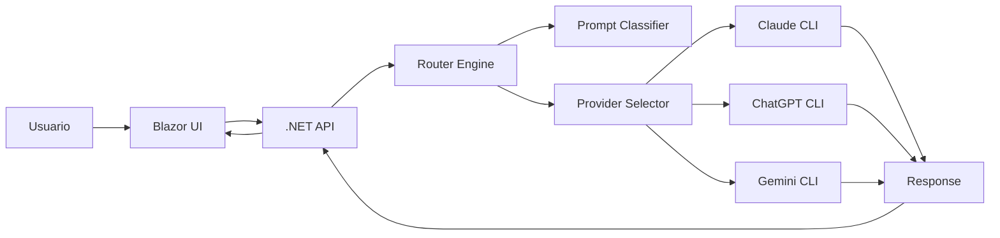

# 00_indice_y_vision_general.md

# Multi-AI Router (CLI-First)
## Índice y Visión General

---

## 1. Introducción

### ¿Qué es este proyecto?

**Multi-AI Router (CLI-First)** es un sistema que actúa como un **orquestador inteligente de modelos de IA**, capaz de:

- Recibir prompts de usuario
- Analizar su intención
- Decidir qué modelo usar (Claude, ChatGPT/Codex, Gemini)
- Ejecutar el modelo vía CLI (sin APIs)
- Retornar la respuesta

No es solo una app.

Es un **vehículo de aprendizaje profundo** para:

- Arquitectura moderna
- System Design
- Integración de IA en sistemas reales

---

### Problema que resuelve

Hoy existen múltiples modelos de IA con fortalezas distintas:

| Modelo | Fortaleza |
|--------|----------|
| Claude | Código complejo, instrucciones largas |
| ChatGPT | General-purpose, rapidez |
| Gemini | Contextos largos, multimodal |

El problema:

> ❌ Elegir manualmente qué IA usar  
> ❌ Desperdicio de tiempo, costo y contexto  
> ❌ No hay capa de abstracción inteligente  

El Router resuelve:

> ✅ Selección automática  
> ✅ Optimización de costo y calidad  
> ✅ Desacoplamiento de proveedores  

---

### Relevancia actual

Estamos en una etapa donde:

- La IA ya es parte del flujo de desarrollo
- Las empresas usan múltiples modelos
- El costo y eficiencia importan

Este proyecto demuestra:

- Cómo integrar IA de forma **arquitectónicamente correcta**
- Cómo diseñar sistemas **extensibles y resilientes**
- Cómo pensar como **Staff Engineer**

---

## 2. Visión del sistema

### Flujo general

---

### Explicación conceptual

El sistema funciona en capas:

1. **Entrada**
   - Usuario envía prompt

2. **Análisis**
   - Clasificador detecta tipo de tarea

3. **Decisión**
   - Router selecciona proveedor

4. **Ejecución**
   - CLI ejecuta modelo

5. **Respuesta**
   - Resultado regresa al usuario

---

## 3. Objetivos del proyecto

### Objetivos técnicos

- Implementar un **router multi-modelo**
- Integrar múltiples CLIs de IA
- Diseñar arquitectura limpia y extensible
- Aplicar patrones reales (Strategy, CQRS, etc.)
- Preparar evolución a sistema distribuido

---

### Objetivos de aprendizaje

- Clean Architecture (sin dogma)
- Vertical Slice Architecture
- System Design real
- Integración de IA en backend
- Manejo de contexto y eficiencia

---

### Objetivos de entrevista

Este proyecto permite demostrar:

- Decisiones arquitectónicas justificadas
- Trade-offs reales
- Diseño de sistemas escalables
- Pensamiento de nivel senior/staff

---

## 4. Filosofía de diseño

### CLI-first

**Por qué:**

- Evita dependencias de APIs
- Aprovecha suscripciones existentes
- Simula entorno real de desarrollo moderno

**Trade-off:**

- Mayor complejidad en ejecución
- Parsing de resultados necesario

---

### Monolito modular

**Por qué:**

- Simplicidad inicial
- Fácil debugging
- Menor overhead

**Trade-off:**

- Escalabilidad limitada si crece mal

---

### Evolución progresiva

**Principio clave:**

> No construir complejidad antes de necesitarla

Fases:

1. Monolito simple
2. Modularización
3. Distribución

---

## 5. Alcance general

### Incluye

- Router multi-IA
- Clasificación de prompts
- Ejecución vía CLI
- Persistencia básica
- UI inicial

---

### No incluye (por ahora)

- Fine-tuning de modelos
- Infraestructura cloud compleja
- ML avanzado desde inicio
- Microservicios desde día 1

---

## 6. Estructura de documentación

| Archivo | Contenido |
|--------|----------|
| 00_indice_y_vision_general.md | Visión general |
| 01_contexto.md | Problema y contexto |
| 02_arquitectura.md | Diseño detallado |
| 03_modelo_dominio.md | Entidades y reglas |
| 04_aplicacion.md | Casos de uso |
| 05_infraestructura.md | DB, cache, messaging |
| 06_router.md | Lógica del router |
| 07_frontend.md | UI |
| 08_devops.md | Docker, CI/CD |
| 09_testing.md | Estrategia de pruebas |
| 10_system_design.md | Preparación entrevistas |

---

## 7. Roadmap de alto nivel

| Fase | Descripción |
|------|------------|
| Fase 1 | Setup básico + CLI execution |
| Fase 2 | Router + Strategy Pattern |
| Fase 3 | Persistencia |
| Fase 4 | Cache |
| Fase 5 | UI |
| Fase 6 | Messaging |
| Fase 7 | Observabilidad |
| Fase 8 | Testing |

---

## 8. Cómo usar esta documentación

### Para estudiar

- Leer en orden
- Entender decisiones
- Analizar trade-offs

---

### Para implementar

- Seguir roadmap
- Construir incrementalmente
- Validar cada fase

---

### Para entrevistas

- Usar como caso real
- Explicar decisiones
- Justificar arquitectura

---

## 9. Enfoque Staff Engineer

Este proyecto documenta:

- Decisiones técnicas (ADRs)
- Trade-offs
- Alternativas descartadas
- Impacto a largo plazo

---

## 10. Criterios de calidad

### “Bien hecho” significa:

- Código claro
- Arquitectura coherente
- Bajo acoplamiento
- Alta extensibilidad

---

### Se evaluará:

- Diseño
- Claridad
- Escalabilidad
- Capacidad de explicación

---

# Fin del documento
