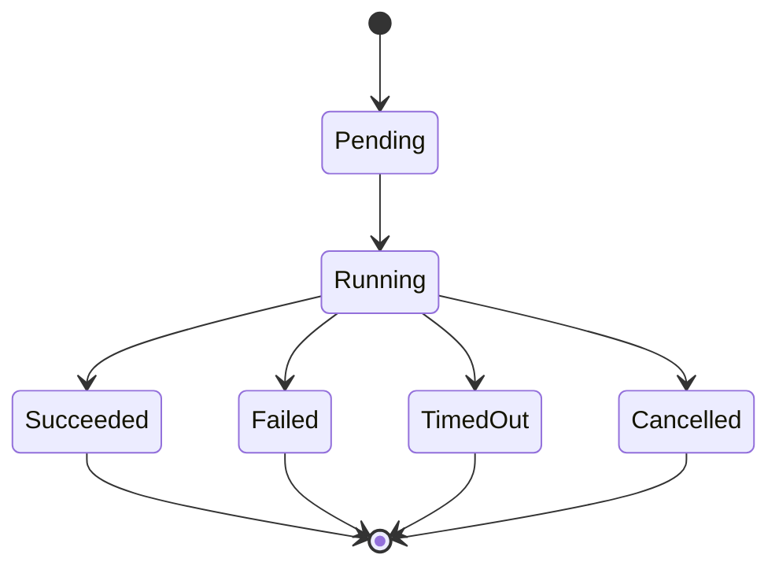
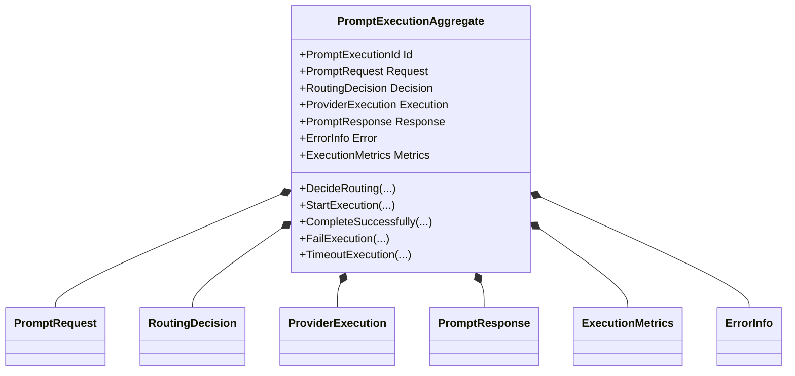
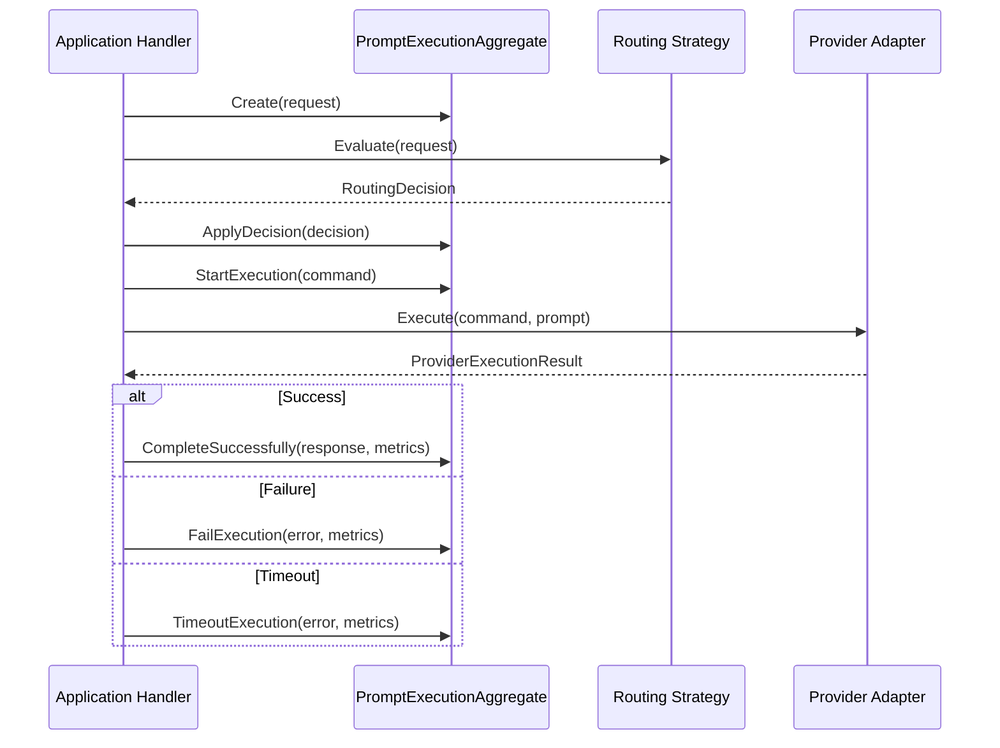
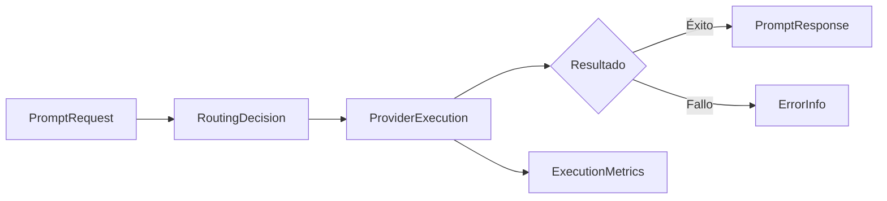
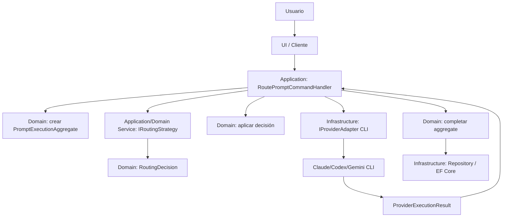
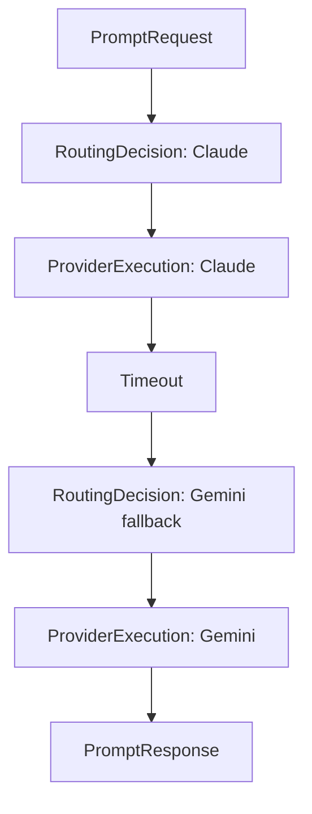
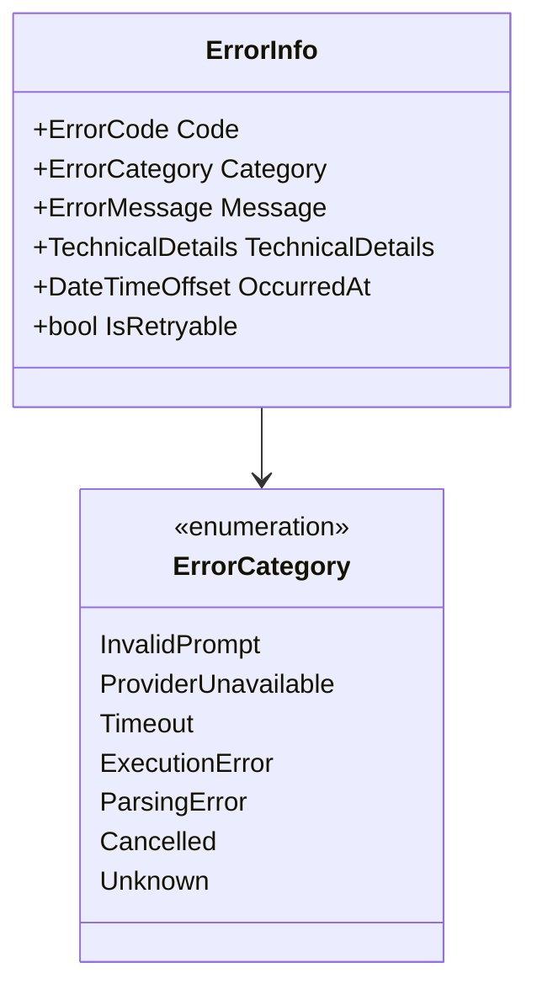

# Multi-AI Router (CLI-First)
## 03 — Modelo de Dominio

> Documento de arquitectura y diseño táctico de dominio para el proyecto **Multi-AI Router (CLI-First)**.
>
> Propósito: definir el modelo conceptual, entidades, value objects, aggregate roots, invariantes, reglas de negocio y límites de responsabilidad del dominio del sistema.
>
> Enfoque: **DDD pragmático**, **Clean Architecture ligera**, **monolito modular**, **MVP primero**, integración **CLI-first**.

---

# Tabla de contenido

1. [Propósito del modelo de dominio](#1-propósito-del-modelo-de-dominio)
2. [Identificación del dominio](#2-identificación-del-dominio)
3. [Lenguaje ubicuo inicial](#3-lenguaje-ubicuo-inicial)
4. [Entidades principales](#4-entidades-principales)
5. [Value Objects](#5-value-objects)
6. [Aggregate Roots](#6-aggregate-roots)
7. [Reglas de negocio e invariantes](#7-reglas-de-negocio-e-invariantes)
8. [Modelo conceptual del flujo](#8-modelo-conceptual-del-flujo)
9. [Dominio vs Application vs Infrastructure](#9-dominio-vs-application-vs-infrastructure)
10. [Interfaces del dominio y de aplicación](#10-interfaces-del-dominio-y-de-aplicación)
11. [Errores y modelado de fallos](#11-errores-y-modelado-de-fallos)
12. [Eventos de dominio básicos](#12-eventos-de-dominio-básicos)
13. [Persistencia y EF Core sin contaminar el dominio](#13-persistencia-y-ef-core-sin-contaminar-el-dominio)
14. [Modelo C# sugerido](#14-modelo-c-sugerido)
15. [Evolución del dominio](#15-evolución-del-dominio)
16. [Anti-patterns a evitar](#16-anti-patterns-a-evitar)
17. [Cómo explicar este dominio en entrevista](#17-cómo-explicar-este-dominio-en-entrevista)
18. [Resumen final](#18-resumen-final)
19. [Referencias consultadas](#19-referencias-consultadas)

---

# 1. Propósito del modelo de dominio

## 1.1 Qué significa “dominio” en este sistema

En el **Multi-AI Router (CLI-First)**, el dominio no es “usar Claude”, “usar ChatGPT”, “abrir un proceso del sistema operativo” o “guardar en SQLite”.

El dominio real es:

> La lógica que permite recibir una solicitud de prompt, validar que pueda ser procesada, decidir qué proveedor de IA debe atenderla, ejecutar esa decisión bajo reglas controladas, obtener una respuesta o fallo explícito, y conservar el historial suficiente para explicar qué ocurrió.

Dicho de otra forma, el dominio responde preguntas como:

- ¿Qué es una solicitud válida?
- ¿Qué significa tomar una decisión de routing?
- ¿Cuándo una ejecución se considera exitosa?
- ¿Cuándo una ejecución falló?
- ¿Qué datos mínimos necesitamos guardar para auditar una interacción?
- ¿Qué proveedor fue elegido y por qué?
- ¿Qué métricas importan para analizar calidad, costo, latencia y confiabilidad?

Este dominio es pequeño al inicio, pero tiene una ventaja: representa un problema real de arquitectura moderna. Un AI Gateway suele centralizar acceso a modelos, abstracción de proveedores, routing, failover, telemetría, control de costos y políticas. En este proyecto eso se adapta a un MVP local y CLI-first, no a una plataforma enterprise desde el día uno.

## 1.2 Qué NO es dominio

No todo lo importante pertenece al dominio.

| Elemento | ¿Es dominio? | Razón |
|---|---:|---|
| Pantalla Blazor | No | Es presentación/UI. |
| Minimal API endpoint | No | Es entrada HTTP, no regla de negocio. |
| `ProcessStartInfo` | No | Es detalle de infraestructura para ejecutar CLI. |
| SQLite / EF Core | No | Es persistencia. |
| Parsing de `stdout` específico de Claude CLI | No principalmente | Es adaptación técnica del proveedor. |
| Estrategia de selección de proveedor | Sí, parcialmente | La política de routing sí es regla del sistema. La implementación concreta puede vivir en Application/Infrastructure. |
| Historial de prompts | Sí | Es parte del negocio del router: trazabilidad y aprendizaje. |
| Métricas de ejecución | Sí | Son parte del resultado observable de una ejecución. |
| Timeout configurado | Sí como política; no como implementación | El dominio puede declarar que una ejecución expiró; Infrastructure decide cómo cancelar el proceso. |

## 1.3 Por qué es crítico definir bien el dominio

Sin un modelo de dominio claro, el proyecto puede terminar como una colección de scripts pegados a una UI:

```text
Controller → if/else proveedor → Process.Start() → guardar string → return
```

Eso funcionaría para una demo, pero no enseñaría arquitectura ni sería fácil de explicar en entrevistas senior.

Un buen modelo de dominio aporta:

- **Claridad conceptual:** cada concepto tiene nombre y responsabilidad.
- **Reglas explícitas:** las invariantes no quedan escondidas en controllers o handlers.
- **Extensibilidad:** agregar un proveedor no rompe el core.
- **Testabilidad:** las decisiones se prueban sin ejecutar CLIs reales.
- **Trazabilidad:** cada prompt puede explicar qué pasó, qué se decidió y por qué.
- **Base para evolución:** workflows, usuarios, scoring, fallback y ML routing pueden agregarse sin reescribir todo.

## 1.4 Principio rector del modelo

> El dominio debe modelar la conversación de negocio del router, no los detalles accidentales de cómo se invoca cada CLI.

Ejemplo:

- Correcto: `ProviderExecution.MarkAsTimedOut(...)`
- Incorrecto: `ClaudeCliProcess.KillProcessAndReadStdErr(...)` dentro del dominio.

El dominio sabe que hubo timeout. No sabe cómo se mata un proceso en macOS, Windows o Linux.

---

# 2. Identificación del dominio

## 2.1 Dominio principal

El dominio principal del sistema es:

## Prompt Routing and Execution Domain

Este dominio cubre el ciclo completo:

```text
Prompt recibido → Prompt validado → Decisión de routing → Ejecución CLI → Respuesta o fallo → Métricas → Historial
```

No estamos construyendo “un chat genérico”. Estamos construyendo un **router de ejecución de prompts contra proveedores de IA usando CLI**.

## 2.2 Subdominios iniciales

Para el MVP, conviene pensar en subdominios conceptuales, sin partir todavía el sistema en microservicios.

| Subdominio | Responsabilidad | Complejidad MVP | Puede crecer a módulo |
|---|---|---:|---:|
| Routing Domain | Decidir proveedor de IA. | Media | Sí |
| Execution Domain | Representar ejecución y resultado/fallo. | Media | Sí |
| Tracking Domain | Historial, métricas, auditoría básica. | Baja-media | Sí |
| Provider Catalog Domain | Registrar proveedores soportados y capacidades. | Baja | Sí |
| Policy Domain | Reglas de límites, timeouts, fallback. | Baja al inicio | Sí |

## 2.3 Routing Domain

Responsable de responder:

- ¿Qué proveedor debe usarse?
- ¿Por qué ese proveedor?
- ¿Qué criterios participaron?
- ¿Existe proveedor disponible?
- ¿Se debe aplicar fallback?

Ejemplos de criterios MVP:

- Tipo de tarea: código, análisis largo, resumen, general.
- Preferencia explícita del usuario.
- Proveedor habilitado o deshabilitado.
- Timeout esperado.
- Compatibilidad de capacidades.

Ejemplo:

```text
Prompt: “Analiza este documento largo y propón arquitectura”
Decision: Claude
Reason: tarea de análisis + código/arquitectura + instrucciones largas
```

## 2.4 Execution Domain

Responsable de representar la ejecución como hecho de negocio:

- Una decisión se ejecutó.
- La ejecución inició.
- La ejecución terminó con respuesta.
- La ejecución terminó con error.
- La ejecución excedió el timeout.
- La ejecución produjo métricas.

No se encarga de lanzar procesos del sistema operativo. Eso es Infrastructure.

## 2.5 Tracking Domain

Responsable de conservar evidencia:

- Prompt original o resumen/hash según política.
- Proveedor elegido.
- Respuesta obtenida.
- Error si falló.
- Duración.
- Tokens estimados si aplica.
- Fecha de creación.

En el MVP, Tracking es persistencia básica. Más adelante puede evolucionar a analytics, scoring, dashboard y auditoría.

## 2.6 Provider Catalog Domain

Modela qué proveedores existen y qué capacidades declaran:

- `Claude`
- `ChatGPT/Codex`
- `Gemini`

Capacidades iniciales:

- Soporta código.
- Soporta contexto largo.
- Soporta multimodalidad.
- Soporta output estructurado.
- Está disponible localmente vía CLI.

En el MVP, esto puede ser configuración. Con el tiempo puede volverse una entidad administrable.

## 2.7 Policy Domain

Modela reglas de ejecución:

- Timeout máximo.
- Reintentos permitidos.
- Fallback permitido.
- Tamaño máximo de prompt.
- Proveedores deshabilitados.
- Preferencias por tipo de tarea.

En el MVP, estas reglas pueden estar en una estrategia simple. No hace falta crear un motor de reglas complejo.

---

# 3. Lenguaje ubicuo inicial

DDD no empieza con clases. Empieza con lenguaje.

El lenguaje ubicuo es el conjunto de términos que el código, la documentación y las conversaciones usan de forma consistente.

| Término | Definición en este proyecto |
|---|---|
| Prompt | Texto enviado por el usuario para ser resuelto por una IA. |
| Prompt Request | Solicitud formal recibida por el sistema, con contenido y opciones. |
| Routing | Proceso de seleccionar proveedor de IA. |
| Routing Decision | Resultado de elegir un proveedor y justificar la decisión. |
| Provider | IA disponible mediante CLI: Claude, ChatGPT/Codex, Gemini. |
| Provider Adapter | Componente que sabe hablar con una CLI específica. |
| Provider Execution | Intento concreto de ejecutar un prompt en un proveedor. |
| Prompt Response | Respuesta útil generada por el proveedor. |
| Execution Failure | Fallo explícito de ejecución. |
| Timeout | Fallo por exceder duración máxima. |
| Metrics | Medidas de ejecución: duración, tokens, exit code, etc. |
| Aggregate | Unidad de consistencia que controla el ciclo de vida de una ejecución de prompt. |
| History | Registro persistente de interacciones pasadas. |

Regla de calidad:

> Si el equipo usa “ejecución”, “corrida”, “invocación”, “llamada” y “run” indistintamente, el modelo se vuelve borroso. El documento propone usar **ProviderExecution** como término central.

---

# 4. Entidades principales

Una entidad tiene identidad y ciclo de vida. No se define solo por sus atributos.

En este sistema, las entidades principales son:

- `PromptRequest`
- `RoutingDecision`
- `ProviderExecution`
- `PromptResponse`
- `ExecutionMetrics`
- `ErrorInfo`

Aunque algunas podrían modelarse como Value Objects en una versión ultraligera, aquí se proponen como entidades o componentes internos del aggregate porque forman parte del ciclo de vida auditable de una ejecución.

---

## 4.1 PromptRequest

### Qué representa

Representa la solicitud recibida por el sistema antes de decidir proveedor.

No es simplemente un string. Es el objeto que encapsula:

- Contenido del prompt.
- Momento de creación.
- Opciones de ejecución.
- Preferencias del usuario.
- Identificador de correlación.
- Estado inicial de la operación.

### Atributos sugeridos

| Atributo | Tipo conceptual | Descripción |
|---|---|---|
| `Id` | `PromptRequestId` | Identidad de la solicitud. |
| `Content` | `PromptContent` | Texto validado del prompt. |
| `CreatedAt` | `DateTimeOffset` | Fecha de recepción. |
| `RequestedProvider` | `ProviderName?` | Proveedor preferido opcional. |
| `Options` | `PromptOptions` | Opciones del usuario. |
| `CorrelationId` | `CorrelationId` | Trazabilidad entre capas. |
| `EstimatedTokenCount` | `TokenCount?` | Estimación inicial. |

### Responsabilidades

- Garantizar que el prompt tenga contenido válido.
- Conservar intención original del usuario.
- Servir como entrada formal del proceso de routing.
- Evitar que el resto del sistema trabaje con strings crudos.

### Invariantes

- Un `PromptRequest` no puede existir sin `PromptContent` válido.
- El contenido no puede estar vacío o compuesto solo por espacios.
- El contenido no debe exceder el límite máximo configurado para el MVP.
- `CreatedAt` debe existir.
- Si `RequestedProvider` existe, debe ser un proveedor conocido.

### Qué NO debe hacer

- No decide proveedor.
- No ejecuta CLI.
- No guarda en base de datos.
- No estima costos avanzados por sí mismo.

### Ejemplo conceptual

```csharp
var request = PromptRequest.Create(
    PromptContent.From("Explícame Clean Architecture con un ejemplo en .NET"),
    PromptOptions.Default(),
    requestedProvider: null,
    correlationId: CorrelationId.New());
```

---

## 4.2 RoutingDecision

### Qué representa

Representa la decisión tomada por el router para seleccionar un proveedor.

Es una pieza crítica para aprendizaje y entrevistas porque convierte una elección implícita en una decisión explicable.

En lugar de:

```text
Usé Claude porque sí.
```

El sistema debe poder decir:

```text
Usé Claude porque la tarea fue clasificada como arquitectura/código, requiere instrucciones largas y Claude está habilitado.
```

### Atributos sugeridos

| Atributo | Tipo conceptual | Descripción |
|---|---|---|
| `Id` | `RoutingDecisionId` | Identidad de decisión. |
| `SelectedProvider` | `ProviderName` | Proveedor elegido. |
| `StrategyName` | `RoutingStrategyName` | Estrategia usada. |
| `Reason` | `DecisionReason` | Explicación humana. |
| `EvaluatedProviders` | `IReadOnlyList<ProviderEvaluation>` | Proveedores considerados. |
| `CreatedAt` | `DateTimeOffset` | Momento de decisión. |
| `WasFallback` | `bool` | Indica si la decisión fue fallback. |

### Responsabilidades

- Registrar qué proveedor fue seleccionado.
- Explicar por qué se seleccionó.
- Evitar que una ejecución ocurra sin decisión previa.
- Permitir auditoría y aprendizaje.

### Invariantes

- `SelectedProvider` debe existir.
- `Reason` no debe estar vacío.
- Debe haber al menos un proveedor evaluado o una razón explícita si se forzó proveedor.
- Una decisión debe estar asociada a un `PromptRequest` dentro del aggregate.

### Qué NO debe hacer

- No ejecuta el proveedor.
- No contiene detalles técnicos de comandos CLI.
- No sabe si `claude` está instalado en `/usr/local/bin` o en otra ruta.

### Ejemplo conceptual

```csharp
var decision = RoutingDecision.Select(
    provider: ProviderName.Claude,
    strategy: RoutingStrategyName.HeuristicV1,
    reason: DecisionReason.From("Prompt clasificado como tarea de arquitectura y código."),
    evaluations: evaluations);
```

---

## 4.3 ProviderExecution

### Qué representa

Representa un intento concreto de ejecutar el prompt en el proveedor seleccionado.

Esta entidad es clave porque separa tres cosas que muchas apps mezclan:

1. Decidir proveedor.
2. Ejecutar proveedor.
3. Obtener resultado o error.

### Atributos sugeridos

| Atributo | Tipo conceptual | Descripción |
|---|---|---|
| `Id` | `ProviderExecutionId` | Identidad de ejecución. |
| `ProviderName` | `ProviderName` | Proveedor ejecutado. |
| `StartedAt` | `DateTimeOffset` | Inicio. |
| `CompletedAt` | `DateTimeOffset?` | Fin. |
| `Status` | `ProviderExecutionStatus` | Pending, Running, Succeeded, Failed, TimedOut, Cancelled. |
| `Command` | `CommandDefinition` | Definición conceptual del comando. |
| `ExitCode` | `ExitCode?` | Código de salida si aplica. |
| `Metrics` | `ExecutionMetrics?` | Métricas. |
| `Error` | `ErrorInfo?` | Error explícito si falló. |

### Responsabilidades

- Controlar el estado de ejecución.
- Impedir transiciones inválidas.
- Registrar resultado técnico de alto nivel.
- Conservar métricas y error cuando existan.

### Invariantes

- No puede iniciar sin proveedor.
- No puede iniciar sin una decisión de routing asociada.
- Una ejecución `Succeeded` debe tener `PromptResponse`.
- Una ejecución `Failed` o `TimedOut` debe tener `ErrorInfo`.
- Una ejecución terminada debe tener `CompletedAt`.
- No se puede pasar de `Succeeded` a `Running`.
- No se puede completar dos veces.

### Estados sugeridos



### Ejemplo conceptual

```csharp
execution.Start(clock.UtcNow);

// Si todo sale bien:
execution.MarkSucceeded(response, metrics, clock.UtcNow);

// Si falla:
execution.MarkFailed(errorInfo, metrics, clock.UtcNow);

// Si expira:
execution.MarkTimedOut(timeoutError, metrics, clock.UtcNow);
```

---

## 4.4 PromptResponse

### Qué representa

Representa la respuesta generada por el proveedor.

No es solamente `string Content`. Debe conservar lo necesario para uso, auditoría y evaluación.

### Atributos sugeridos

| Atributo | Tipo conceptual | Descripción |
|---|---|---|
| `Id` | `PromptResponseId` | Identidad de respuesta. |
| `Content` | `ResponseContent` | Texto de respuesta. |
| `ProviderName` | `ProviderName` | Proveedor que respondió. |
| `CreatedAt` | `DateTimeOffset` | Momento de creación. |
| `FinishReason` | `FinishReason` | Completed, Truncated, Cancelled, Unknown. |
| `RawOutputReference` | `RawOutputReference?` | Referencia opcional al output crudo si se guarda. |

### Responsabilidades

- Encapsular respuesta útil.
- Validar que una respuesta exitosa tenga contenido suficiente.
- Asociar la respuesta con el proveedor real que la generó.

### Invariantes

- Una respuesta exitosa no puede estar vacía.
- Debe conocer el proveedor que la generó.
- Debe tener fecha de creación.

### Nota importante

En CLI-first puede existir una diferencia entre:

- `stdout` crudo.
- Respuesta parseada.
- Respuesta normalizada.

El dominio debe guardar la respuesta normalizada. El `stdout` crudo puede guardarse como referencia técnica o log en Infrastructure/Tracking.

---

## 4.5 ExecutionMetrics

### Qué representa

Representa mediciones de una ejecución.

Podría modelarse como Value Object si no requiere identidad propia. En este documento se trata como entidad/componente del aggregate porque puede crecer hacia analytics, pero para MVP puede implementarse como owned/value object.

### Atributos sugeridos

| Atributo | Tipo conceptual | Descripción |
|---|---|---|
| `ExecutionTime` | `ExecutionTime` | Duración total. |
| `EstimatedInputTokens` | `TokenCount?` | Tokens estimados de entrada. |
| `EstimatedOutputTokens` | `TokenCount?` | Tokens estimados de salida. |
| `TotalTokens` | `TokenCount?` | Total estimado. |
| `ExitCode` | `ExitCode?` | Código de salida. |
| `StdErrLength` | `int?` | Tamaño de stderr si aplica. |
| `WasFallback` | `bool` | Si fue resultado de fallback. |

### Responsabilidades

- Medir ejecución de forma consistente.
- Ayudar a comparar proveedores.
- Servir para historial, dashboard y scoring futuro.

### Invariantes

- La duración no puede ser negativa.
- Los tokens no pueden ser negativos.
- Si hay total, debe ser consistente con entrada + salida cuando ambos existan.

### Métricas que importan en AI Gateways

Aunque el MVP no necesita observabilidad avanzada, un AI Gateway real suele monitorear:

- Latencia total.
- Errores por proveedor.
- Throughput.
- Time to First Token si hay streaming.
- Tokens de entrada/salida.
- Cache hit ratio.
- Fallback rate.

Para CLI-first, al inicio bastan:

- Duración total.
- Proveedor.
- Estado.
- Error category.
- Exit code.

---

## 4.6 ErrorInfo

### Qué representa

Representa un fallo de forma explícita y clasificable.

No debe ser solo un string con la excepción.

### Atributos sugeridos

| Atributo | Tipo conceptual | Descripción |
|---|---|---|
| `Code` | `ErrorCode` | Código estable. |
| `Category` | `ErrorCategory` | Timeout, ProviderUnavailable, InvalidPrompt, ParsingError, Unknown. |
| `Message` | `ErrorMessage` | Mensaje seguro para la app. |
| `TechnicalDetails` | `TechnicalDetails?` | Detalle opcional para debugging. |
| `OccurredAt` | `DateTimeOffset` | Fecha del error. |
| `IsRetryable` | `bool` | Si tiene sentido reintentar. |

### Responsabilidades

- Clasificar fallos.
- Evitar excepciones sin semántica.
- Permitir fallback y métricas.
- Facilitar troubleshooting.

### Invariantes

- Todo fallo debe tener código.
- Todo fallo debe tener categoría.
- Un error mostrado al usuario no debe filtrar secretos, rutas sensibles o tokens.
- Si `IsRetryable` es true, la categoría debe tener sentido operativo.

### Categorías iniciales

| Categoría | Descripción | Retry sugerido |
|---|---|---:|
| `InvalidPrompt` | Prompt inválido. | No |
| `ProviderUnavailable` | CLI no disponible o proveedor deshabilitado. | A veces |
| `Timeout` | Excedió tiempo máximo. | Sí, con cuidado |
| `ExecutionError` | CLI terminó con error. | Depende |
| `ParsingError` | Output no pudo normalizarse. | No normalmente |
| `Cancelled` | Usuario o sistema canceló. | No |
| `Unknown` | Error no clasificado. | Depende |

---

# 5. Value Objects

Un Value Object no tiene identidad propia. Se define por sus valores.

Ejemplo clásico:

```text
Dos ExecutionTime de 2.5 segundos son equivalentes.
No importa “cuál objeto” fue creado primero.
```

Los Value Objects son especialmente útiles en este proyecto porque evitan primitivas peligrosas:

```csharp
// Débil
string provider;
int tokens;
string command;

// Mejor
ProviderName provider;
TokenCount tokens;
CommandDefinition command;
```

## 5.1 Características de Value Objects

- Son inmutables.
- Se comparan por valor.
- Validan su propio contenido.
- No tienen identidad persistente propia.
- Reducen errores por strings mágicos o ints sin contexto.

## 5.2 PromptContent

### Qué representa

Texto del prompt validado.

### Reglas

- No vacío.
- No whitespace-only.
- Longitud máxima configurable.
- Puede normalizar saltos de línea.
- Puede calcular hash.

### Ejemplo

```csharp
public sealed record PromptContent
{
    public string Value { get; }

    private PromptContent(string value) => Value = value;

    public static PromptContent From(string value)
    {
        if (string.IsNullOrWhiteSpace(value))
            throw new DomainException("Prompt content cannot be empty.");

        var normalized = value.Trim();

        if (normalized.Length > 100_000)
            throw new DomainException("Prompt content exceeds maximum length.");

        return new PromptContent(normalized);
    }
}
```

## 5.3 TokenCount

### Qué representa

Conteo estimado o real de tokens.

### Reglas

- No puede ser negativo.
- Puede ser cero si no se pudo estimar o si el contenido está vacío después de parsing técnico, aunque el prompt no debería estar vacío.
- Debe distinguirse entre estimado y real si se requiere precisión futura.

### Ejemplo

```csharp
public readonly record struct TokenCount
{
    public int Value { get; }

    private TokenCount(int value) => Value = value;

    public static TokenCount From(int value)
    {
        if (value < 0)
            throw new DomainException("Token count cannot be negative.");

        return new TokenCount(value);
    }
}
```

## 5.4 ExecutionTime

### Qué representa

Duración de una ejecución.

### Reglas

- No negativa.
- Puede expresarse como `TimeSpan` internamente.
- Debe tener helpers para milisegundos/segundos.

```csharp
public readonly record struct ExecutionTime
{
    public TimeSpan Value { get; }

    private ExecutionTime(TimeSpan value) => Value = value;

    public static ExecutionTime From(TimeSpan value)
    {
        if (value < TimeSpan.Zero)
            throw new DomainException("Execution time cannot be negative.");

        return new ExecutionTime(value);
    }
}
```

## 5.5 ProviderName

### Qué representa

Nombre estable de proveedor.

### Reglas

- No usar strings libres en todo el sistema.
- Solo permitir proveedores conocidos.
- Debe ser case-insensitive al parsear, pero estable al almacenar.

```csharp
public sealed record ProviderName
{
    public string Value { get; }

    public static ProviderName Claude => new("Claude");
    public static ProviderName ChatGpt => new("ChatGPT");
    public static ProviderName Gemini => new("Gemini");

    private ProviderName(string value) => Value = value;

    public static ProviderName From(string value) =>
        value.Trim().ToLowerInvariant() switch
        {
            "claude" => Claude,
            "chatgpt" or "gpt" or "codex" => ChatGpt,
            "gemini" => Gemini,
            _ => throw new DomainException($"Unknown provider '{value}'.")
        };

    public override string ToString() => Value;
}
```

## 5.6 CommandDefinition

### Qué representa

Descripción conceptual segura del comando a ejecutar.

Importante: este Value Object no debería ser una invitación a ejecutar comandos arbitrarios.

### Atributos sugeridos

| Atributo | Descripción |
|---|---|
| `ExecutableName` | Nombre lógico: `claude`, `codex`, `gemini`. |
| `Arguments` | Argumentos ya construidos por adapter, no por input crudo. |
| `WorkingDirectory` | Opcional, controlado por configuración. |
| `Timeout` | Timeout de ejecución. |

### Reglas

- El ejecutable debe venir de configuración controlada.
- No debe aceptar shell script libre.
- No debe concatenar input de usuario en comandos sin escape/sanitización.
- No debe representar secretos.

## 5.7 Otros Value Objects recomendados

| Value Object | Propósito |
|---|---|
| `PromptRequestId` | Identificador fuerte. |
| `ProviderExecutionId` | Identificador fuerte. |
| `CorrelationId` | Trazabilidad. |
| `DecisionReason` | Razón no vacía. |
| `RoutingStrategyName` | Nombre de estrategia. |
| `ExitCode` | Código de salida validado. |
| `ErrorCode` | Código estable de error. |
| `ResponseContent` | Contenido validado de respuesta. |
| `PromptHash` | Hash para cache/deduplicación futura. |
| `ProviderCapability` | Capacidad declarada de un proveedor. |
| `ModelPreference` | Preferencia opcional del usuario. |

---

# 6. Aggregate Roots

## 6.1 Qué es un Aggregate

Un aggregate es una frontera de consistencia.

Agrupa entidades y value objects que deben cambiar de forma coordinada para mantener reglas de negocio.

Regla fundamental:

> Desde fuera del aggregate, se interactúa con el Aggregate Root, no con sus entidades internas directamente.

Esto evita que cualquier parte de la aplicación haga cambios peligrosos como:

```csharp
execution.Status = Succeeded;
response = null;
error = null;
```

Eso rompería una regla crítica: una ejecución exitosa debe tener respuesta.

## 6.2 Aggregate Root principal: PromptExecutionAggregate

Para el MVP, el aggregate principal debe ser:

## PromptExecutionAggregate

Representa el ciclo completo de una solicitud de prompt desde que entra hasta que termina con respuesta o fallo.

### Entidades que agrupa

- `PromptRequest`
- `RoutingDecision`
- `ProviderExecution`
- `PromptResponse`
- `ExecutionMetrics`
- `ErrorInfo`

### Diagrama conceptual



## 6.3 Por qué este aggregate tiene sentido

Porque las reglas importantes cruzan varias entidades:

- No puede haber ejecución sin prompt.
- No puede haber ejecución sin decisión.
- No puede haber respuesta sin ejecución exitosa.
- No puede haber fallo sin ejecución fallida.
- No puede haber métricas finales sin ejecución terminada.

Si esas piezas vivieran sueltas, sería fácil persistir estados inválidos.

## 6.4 Ciclo de vida del aggregate



## 6.5 Transacciones

En el MVP, una transacción lógica puede cubrir:

- Guardar `PromptExecutionAggregate` finalizado.

No es necesario persistir cada paso en tiempo real desde el día uno.

Pero el modelo debe permitir evolucionar a:

- Guardar `Created` al recibir prompt.
- Guardar `DecisionMade`.
- Guardar `ExecutionStarted`.
- Guardar `ExecutionCompleted` o `ExecutionFailed`.

Para MVP local:

```text
Recibir → ejecutar → construir aggregate final → guardar
```

Para versión más robusta:

```text
Recibir → guardar Created → decidir → guardar Decision → ejecutar → guardar Completion
```

## 6.6 Límites

El aggregate no debe crecer hasta incluir:

- Usuario completo.
- Todas las conversaciones.
- Configuración global de proveedores.
- Historial completo.
- Dashboard de métricas.

Eso sería un aggregate gigante.

Regla práctica:

> Un aggregate debe proteger reglas de consistencia inmediatas, no representar todo el sistema.

## 6.7 Posibles aggregates futuros

| Aggregate futuro | Cuándo tendría sentido |
|---|---|
| `ConversationAggregate` | Cuando haya sesiones multi-turn con continuidad. |
| `ProviderProfileAggregate` | Cuando proveedores puedan administrarse dinámicamente. |
| `RoutingPolicyAggregate` | Cuando las reglas de routing sean configurables por usuario/equipo. |
| `WorkflowAggregate` | Cuando existan flujos multi-step/multi-modelo. |
| `UserQuotaAggregate` | Cuando haya multi-user, límites y cuotas. |

---

# 7. Reglas de negocio e invariantes

Esta es la sección más importante para entrevistas.

Un modelo de dominio senior no se justifica por tener muchas clases, sino por proteger reglas reales.

## 7.1 Reglas de PromptRequest

### Regla 1: Un prompt debe ser válido

Un prompt válido:

- Tiene contenido.
- No excede límites máximos.
- No contiene únicamente whitespace.
- Tiene metadata mínima.

Razón:

> El sistema no debe gastar ejecución CLI, routing o persistencia en solicitudes inválidas.

### Regla 2: El prompt original debe conservarse o trazarse

En MVP, se puede guardar el texto completo localmente.

Futuro:

- Guardar hash.
- Guardar resumen.
- Enmascarar datos sensibles.
- Guardar contenido cifrado.

## 7.2 Reglas de RoutingDecision

### Regla 3: Siempre debe existir una decisión antes de ejecutar

No se puede ejecutar directamente un proveedor sin decisión.

Incorrecto:

```text
Prompt → Claude CLI
```

Correcto:

```text
Prompt → RoutingDecision(Claude, reason) → Claude CLI
```

Esto permite explicar el comportamiento y evita acoplar UI o handler a proveedores.

### Regla 4: Una decisión debe tener razón

Toda decisión debe tener una justificación mínima.

Ejemplos:

- “Proveedor solicitado explícitamente por el usuario.”
- “Tarea clasificada como código complejo.”
- “Fallback por timeout de proveedor primario.”
- “Proveedor con menor costo estimado para tarea general.”

### Regla 5: El proveedor seleccionado debe estar disponible conceptualmente

El dominio puede validar que el proveedor existe en el catálogo lógico.

La infraestructura valida si el binario CLI realmente existe y ejecuta.

## 7.3 Reglas de ProviderExecution

### Regla 6: No se puede ejecutar sin provider seleccionado

Una ejecución necesita:

- `ProviderName`
- `CommandDefinition`
- `PromptContent`
- `RoutingDecision`

### Regla 7: Una ejecución debe terminar con resultado o error

Estados terminales:

- `Succeeded` con `PromptResponse`
- `Failed` con `ErrorInfo`
- `TimedOut` con `ErrorInfo`
- `Cancelled` con `ErrorInfo` o razón de cancelación

Nunca debe quedar un aggregate final guardado como `Running` salvo que el diseño soporte recuperación.

Para MVP, conviene evitar persistir estados intermedios permanentes.

### Regla 8: Una ejecución completada no puede modificarse libremente

Una vez terminal:

- No reiniciar.
- No cambiar provider.
- No reemplazar respuesta sin operación explícita.

Si se reintenta, se crea otra ejecución o se modela un intento adicional.

## 7.4 Reglas de PromptResponse

### Regla 9: Una respuesta exitosa debe tener contenido

Si el CLI termina con exit code 0 pero no produce contenido útil, el sistema debe clasificarlo como error de parsing o respuesta vacía.

### Regla 10: La respuesta debe estar asociada al proveedor real

Esto importa cuando hay fallback.

Ejemplo:

```text
Decision inicial: Claude
Fallback: Gemini
Response provider: Gemini
```

No confundir proveedor inicialmente seleccionado con proveedor que finalmente respondió.

## 7.5 Reglas de ErrorInfo

### Regla 11: Los fallos deben ser explícitos

No basta con capturar `Exception.Message`.

Debe existir categoría:

- Timeout
- ProviderUnavailable
- ExecutionError
- ParsingError
- InvalidPrompt

### Regla 12: Los errores no deben filtrar secretos

El mensaje persistido o mostrado no debe incluir:

- Tokens.
- Rutas privadas sensibles si no son necesarias.
- Variables de entorno.
- Contenido confidencial.

## 7.6 Reglas de métricas

### Regla 13: Métricas no negativas

- Duración >= 0.
- Tokens >= 0.
- Exit code puede ser negativo solo si el sistema operativo lo representa así y se decide permitirlo; para MVP, conviene normalizar.

### Regla 14: Métricas deben corresponder al intento ejecutado

No mezclar métricas de Claude con respuesta de Gemini después de fallback.

Si hay múltiples intentos, el modelo debe evolucionar a `ExecutionAttempt`.

## 7.7 Reglas de consistencia del aggregate

| Invariante | Regla |
|---|---|
| Prompt requerido | El aggregate no existe sin request. |
| Decisión requerida | No se ejecuta sin decision. |
| Provider requerido | La execution usa el provider seleccionado o fallback explícito. |
| Resultado exclusivo | Una ejecución no puede tener response y error como resultado final principal. |
| Estado terminal consistente | Succeeded requiere response; Failed/TimedOut requiere error. |
| Métricas consistentes | Métricas finales solo cuando termina ejecución. |

---

# 8. Modelo conceptual del flujo

## 8.1 Flujo principal



## 8.2 Flujo con responsabilidades



## 8.3 Flujo con fallback futuro



Para MVP, se puede documentar fallback pero no implementarlo completo todavía.

---

# 9. Dominio vs Application vs Infrastructure

Una de las fuentes más comunes de confusión es decidir dónde vive cada cosa.

## 9.1 Domain

El proyecto `AiRouter.Domain` debe contener:

- Entidades.
- Value Objects.
- Aggregate Roots.
- Invariantes.
- Eventos de dominio.
- Excepciones de dominio.
- Interfaces muy puras si representan conceptos del dominio.

Ejemplos:

```text
PromptExecutionAggregate
PromptRequest
RoutingDecision
ProviderExecution
PromptResponse
PromptContent
ProviderName
TokenCount
ExecutionTime
ErrorInfo
DomainException
```

El dominio no debe depender de:

- EF Core.
- ASP.NET Core.
- Blazor.
- `ProcessStartInfo`.
- SQLite.
- Serilog.
- MediatR, salvo decisión muy deliberada. Para MVP, mejor no.

## 9.2 Application

El proyecto `AiRouter.Application` coordina casos de uso.

Aquí viven:

- Commands/Queries.
- Handlers.
- DTOs de aplicación.
- Validaciones de entrada del caso de uso.
- Interfaces de puertos hacia infraestructura.
- Orquestación del flujo.

Ejemplo de caso de uso:

```text
RoutePromptCommandHandler
1. Recibe command.
2. Crea PromptContent.
3. Crea aggregate.
4. Invoca IRoutingStrategy.
5. Aplica decision al aggregate.
6. Invoca IProviderAdapter.
7. Completa aggregate con response/error.
8. Persiste.
9. Retorna result.
```

Application no debe contener reglas internas del aggregate.

Incorrecto:

```csharp
if (execution.Status == Succeeded && response == null)
    throw new Exception(...);
```

Correcto:

```csharp
aggregate.CompleteSuccessfully(response, metrics, completedAt);
```

Si la combinación es inválida, el aggregate la rechaza.

## 9.3 Infrastructure

El proyecto `AiRouter.Infrastructure` implementa detalles técnicos.

Aquí viven:

- Adapters de CLI.
- Ejecución de procesos.
- EF Core DbContext.
- Repositories.
- Configuración de proveedores.
- File system.
- Logging técnico.
- Parsers de stdout/stderr.

Ejemplos:

```text
ClaudeCliAdapter
CodexCliAdapter
GeminiCliAdapter
CliProcessRunner
PromptExecutionDbContext
EfPromptExecutionRepository
ProviderCliOptions
```

Infrastructure puede depender de Domain y Application.

Domain no depende de Infrastructure.

## 9.4 Presentation / Web

El proyecto `AiRouter.Web` o `AiRouter.Api` contiene:

- Endpoints.
- UI.
- Request/Response HTTP.
- Autenticación futura.
- Serialización.

El endpoint debe ser delgado.

Correcto:

```csharp
app.MapPost("/prompts/route", async (RoutePromptRequest request, ISender sender, CancellationToken ct) =>
{
    var result = await sender.Send(new RoutePromptCommand(request.Prompt, request.Provider), ct);
    return Results.Ok(result);
});
```

Incorrecto:

```csharp
app.MapPost("/prompts/route", async request =>
{
    if (request.Prompt.Contains("code"))
        Process.Start("claude", request.Prompt);
    else
        Process.Start("gemini", request.Prompt);
});
```

## 9.5 Mapa de responsabilidades

| Responsabilidad | Capa correcta |
|---|---|
| Validar prompt no vacío | Domain / Application |
| Validar formato HTTP request | Presentation |
| Decidir proveedor | Domain Service o Application Service con reglas de dominio |
| Ejecutar proceso CLI | Infrastructure |
| Parsear stdout específico | Infrastructure |
| Marcar ejecución como exitosa | Domain |
| Guardar aggregate | Infrastructure |
| Coordinar caso de uso | Application |
| Mostrar resultado | Presentation |

---

# 10. Interfaces del dominio y de aplicación

No todas las interfaces pertenecen al dominio.

Una regla práctica:

> Si la interfaz expresa una capacidad del negocio, puede vivir en Domain. Si expresa una necesidad técnica del caso de uso, suele vivir en Application.

## 10.1 IProviderAdapter

### Propósito

Representa un puerto para ejecutar un proveedor.

```csharp
public interface IProviderAdapter
{
    ProviderName ProviderName { get; }
    Task<ProviderExecutionResult> ExecuteAsync(
        PromptContent prompt,
        CommandDefinition command,
        CancellationToken cancellationToken);
}
```

### ¿Domain o Application?

Recomendación para este proyecto:

- Ubicarla en **Application**.

Razón:

- El dominio necesita saber que existe una ejecución de proveedor.
- Pero no necesita conocer el contrato asíncrono de ejecución, cancellation token o DTOs de infraestructura.
- `IProviderAdapter` es un puerto que Application usa para orquestar el caso de uso.

Domain modela `ProviderExecution`.
Application invoca `IProviderAdapter`.
Infrastructure implementa `ClaudeCliAdapter`.

## 10.2 IRoutingStrategy

### Propósito

Representa una estrategia de selección de proveedor.

```csharp
public interface IRoutingStrategy
{
    RoutingDecision Decide(
        PromptRequest request,
        IReadOnlyCollection<ProviderDescriptor> availableProviders);
}
```

### ¿Domain o Application?

Puede vivir en Domain si:

- La estrategia es pura.
- No depende de configuración técnica.
- Usa conceptos del dominio.

Puede vivir en Application si:

- Orquesta configuración, disponibilidad, métricas históricas o servicios externos.

Recomendación MVP:

- Definir una abstracción en **Domain** si se mantiene pura.
- Implementar `HeuristicRoutingStrategy` en Application o Domain según complejidad.

Opción pragmática:

```text
Domain:
- IRoutingStrategy
- RoutingDecision
- ProviderDescriptor

Application:
- DefaultRoutingStrategy implementation
```

Esto mantiene el contrato conceptual cerca del dominio, pero deja la implementación evolucionar.

## 10.3 IExecutionService

### Propósito

Coordina ejecución de un proveedor.

```csharp
public interface IExecutionService
{
    Task<ProviderExecutionResult> ExecuteAsync(
        ProviderName provider,
        PromptContent prompt,
        CancellationToken cancellationToken);
}
```

### ¿Domain o Application?

Recomendación:

- **Application**.

Razón:

- Es un servicio de caso de uso.
- Coordina adapters, timeouts, cancellation y tal vez fallback.
- No es una regla pura del dominio.

## 10.4 IRepository

```csharp
public interface IPromptExecutionRepository
{
    Task AddAsync(PromptExecutionAggregate aggregate, CancellationToken cancellationToken);
    Task<PromptExecutionAggregate?> GetByIdAsync(PromptExecutionId id, CancellationToken cancellationToken);
}
```

### ¿Domain o Application?

En Clean Architecture clásica, puede vivir en Application como puerto de persistencia.

Recomendación:

- **Application** para el MVP.

El dominio no necesita saber que será persistido.

## 10.5 IClock

```csharp
public interface IClock
{
    DateTimeOffset UtcNow { get; }
}
```

### ¿Dónde vive?

Puede vivir en Application/Common o Domain/Common.

Para evitar que el dominio llame directamente al reloj, una alternativa más limpia:

- Application obtiene `now` de `IClock`.
- Pasa `now` a los métodos del aggregate.

Ejemplo:

```csharp
aggregate.StartExecution(command, clock.UtcNow);
```

Así el dominio no depende de servicios.

---

# 11. Errores y modelado de fallos

Los fallos son parte central del dominio porque el sistema depende de CLIs externos, procesos del sistema operativo y proveedores no controlados.

## 11.1 Por qué modelar fallos explícitamente

Sin modelado explícito:

```csharp
catch (Exception ex)
{
    return ex.Message;
}
```

Problemas:

- No sabes si conviene reintentar.
- No puedes calcular métricas por categoría.
- No puedes aplicar fallback correctamente.
- No puedes mostrar mensajes seguros.
- No puedes explicar fallos en entrevistas o producción.

Con modelado explícito:

```text
ErrorInfo(
  Code: PROVIDER_TIMEOUT,
  Category: Timeout,
  IsRetryable: true,
  Message: "The provider did not respond within the configured timeout."
)
```

## 11.2 ExecutionFailure

`ExecutionFailure` puede ser un concepto especializado o una factory de `ErrorInfo`.

### Ejemplo

```csharp
public static class ExecutionFailures
{
    public static ErrorInfo Timeout(ProviderName provider, ExecutionTime timeout) =>
        ErrorInfo.Create(
            ErrorCode.From("PROVIDER_TIMEOUT"),
            ErrorCategory.Timeout,
            ErrorMessage.From($"Provider '{provider}' exceeded timeout of {timeout.Value.TotalSeconds:n0} seconds."),
            isRetryable: true);

    public static ErrorInfo ProviderUnavailable(ProviderName provider) =>
        ErrorInfo.Create(
            ErrorCode.From("PROVIDER_UNAVAILABLE"),
            ErrorCategory.ProviderUnavailable,
            ErrorMessage.From($"Provider '{provider}' is not available."),
            isRetryable: false);
}
```

## 11.3 Timeout

Timeout no debe tratarse como excepción genérica.

En CLI-first, timeout puede ocurrir por:

- CLI colgada.
- Prompt demasiado grande.
- Proveedor tardando demasiado.
- Red lenta detrás de la CLI.
- Autenticación interactiva inesperada.

Dominio:

```text
Execution timed out.
```

Infrastructure:

```text
CancellationToken disparado, proceso terminado, stdout/stderr recolectado parcialmente.
```

## 11.4 ProviderUnavailable

Representa que el proveedor no puede usarse.

Causas:

- CLI no instalada.
- CLI no autenticada.
- Proveedor deshabilitado en configuración.
- Comando no encontrado.
- Plataforma no compatible.

No todas las causas deben exponerse al usuario final.

## 11.5 ParsingError

En CLI-first, parsing es un riesgo real.

Ejemplos:

- El CLI cambia formato de salida.
- Se imprime banner de actualización.
- Se mezcla contenido con warnings.
- El comando responde en stderr aunque haya contenido útil.

El dominio debe poder representar:

```text
La ejecución terminó, pero no se pudo obtener una respuesta normalizada.
```

## 11.6 Error model inicial



---

# 12. Eventos de dominio básicos

## 12.1 Qué es un evento de dominio

Un evento de dominio representa algo relevante que ya ocurrió.

Ejemplos:

- `PromptRequestCreated`
- `RoutingDecisionMade`
- `ProviderExecutionStarted`
- `ProviderExecutionSucceeded`
- `ProviderExecutionFailed`

No se debe abusar de eventos desde el MVP. Pero sí conviene diseñarlos como posibilidad.

## 12.2 Eventos recomendados para MVP

| Evento | Cuándo ocurre | Uso inicial |
|---|---|---|
| `PromptExecutionCreated` | Se crea aggregate. | Logging/test. |
| `RoutingDecisionMade` | Se aplica decisión. | Auditoría. |
| `ProviderExecutionStarted` | Inicia ejecución. | Métricas. |
| `ProviderExecutionSucceeded` | Termina con respuesta. | Historial. |
| `ProviderExecutionFailed` | Termina con fallo. | Alertas/fallback futuro. |

## 12.3 Implementación simple

```csharp
public interface IDomainEvent
{
    DateTimeOffset OccurredAt { get; }
}

public sealed record RoutingDecisionMade(
    PromptExecutionId ExecutionId,
    ProviderName SelectedProvider,
    DecisionReason Reason,
    DateTimeOffset OccurredAt) : IDomainEvent;
```

El aggregate puede acumular eventos:

```csharp
private readonly List<IDomainEvent> _domainEvents = new();
public IReadOnlyCollection<IDomainEvent> DomainEvents => _domainEvents.AsReadOnly();
```

Para MVP, no hace falta event sourcing.

## 12.4 Qué NO hacer todavía

No implementar de entrada:

- Event sourcing.
- Kafka.
- Outbox pattern.
- Sagas.
- Workflows distribuidos.

Eso vendrá si el sistema crece.

---

# 13. Persistencia y EF Core sin contaminar el dominio

## 13.1 Principio

EF Core puede mapear modelos de dominio POCO sin que el dominio dependa de EF.

El dominio no debe tener:

```csharp
[Table]
[Column]
[Key]
public DbSet<...>
```

La configuración debe vivir en Infrastructure:

```text
AiRouter.Infrastructure/Persistence/Configurations/PromptExecutionConfiguration.cs
```

## 13.2 Owned Entity Types para Value Objects

EF Core permite modelar tipos owned, útiles para Value Objects que solo existen dentro de una entidad propietaria.

Ejemplos:

- `PromptContent`
- `ExecutionTime`
- `ErrorInfo`
- `ExecutionMetrics`

Configuración conceptual:

```csharp
builder.OwnsOne(x => x.Request, request =>
{
    request.OwnsOne(r => r.Content, content =>
    {
        content.Property(c => c.Value)
               .HasColumnName("PromptContent")
               .IsRequired();
    });
});
```

## 13.3 Value Conversions

Para Value Objects simples, usar conversiones.

Ejemplo:

```csharp
builder.Property(x => x.SelectedProvider)
    .HasConversion(
        provider => provider.Value,
        value => ProviderName.From(value));
```

## 13.4 Backing fields y colecciones protegidas

Si el aggregate acumula eventos o intentos, no exponer listas modificables.

Correcto:

```csharp
private readonly List<ProviderExecution> _executions = new();
public IReadOnlyCollection<ProviderExecution> Executions => _executions.AsReadOnly();
```

EF Core puede mapear backing fields desde configuración.

## 13.5 Persistencia inicial sugerida

Para el MVP local:

- SQLite.
- Una tabla principal `PromptExecutions`.
- Columnas simples para request, decision, status, provider, response, error, metrics.
- Sin normalizar de más.

Tabla conceptual:

| Columna | Descripción |
|---|---|
| `Id` | Id del aggregate. |
| `PromptContent` | Prompt. |
| `PromptHash` | Hash opcional. |
| `SelectedProvider` | Proveedor elegido. |
| `RoutingReason` | Razón de decisión. |
| `ExecutionStatus` | Estado final. |
| `ResponseContent` | Respuesta si hubo éxito. |
| `ErrorCode` | Código de error si falló. |
| `ErrorCategory` | Categoría de error. |
| `DurationMs` | Duración. |
| `CreatedAt` | Fecha. |
| `CompletedAt` | Fecha final. |

## 13.6 Cuándo normalizar más

Normalizar cuando aparezcan necesidades reales:

- Varias ejecuciones por prompt por fallback.
- Comparación de proveedores.
- Historial por usuario.
- Métricas agregadas.
- Workflows multi-step.

No antes.

---

# 14. Modelo C# sugerido

Esta sección no pretende ser implementación final, sino una base de diseño.

## 14.1 Estructura de carpetas del Domain

```text
src/
  AiRouter.Domain/
    Abstractions/
      IDomainEvent.cs
    Common/
      Entity.cs
      AggregateRoot.cs
      DomainException.cs
    PromptExecutions/
      PromptExecutionAggregate.cs
      PromptExecutionId.cs
      PromptRequest.cs
      RoutingDecision.cs
      ProviderExecution.cs
      PromptResponse.cs
      ExecutionMetrics.cs
      ErrorInfo.cs
      Events/
        RoutingDecisionMade.cs
        ProviderExecutionSucceeded.cs
        ProviderExecutionFailed.cs
      ValueObjects/
        PromptContent.cs
        ProviderName.cs
        TokenCount.cs
        ExecutionTime.cs
        CommandDefinition.cs
        DecisionReason.cs
```

## 14.2 Base Entity

```csharp
public abstract class Entity<TId>
{
    public TId Id { get; protected init; }

    protected Entity(TId id)
    {
        Id = id;
    }
}
```

## 14.3 AggregateRoot

```csharp
public abstract class AggregateRoot<TId> : Entity<TId>
{
    private readonly List<IDomainEvent> _domainEvents = new();

    protected AggregateRoot(TId id) : base(id)
    {
    }

    public IReadOnlyCollection<IDomainEvent> DomainEvents => _domainEvents.AsReadOnly();

    protected void Raise(IDomainEvent domainEvent)
    {
        _domainEvents.Add(domainEvent);
    }

    public void ClearDomainEvents()
    {
        _domainEvents.Clear();
    }
}
```

## 14.4 PromptExecutionAggregate

```csharp
public sealed class PromptExecutionAggregate : AggregateRoot<PromptExecutionId>
{
    public PromptRequest Request { get; private set; }
    public RoutingDecision? Decision { get; private set; }
    public ProviderExecution? Execution { get; private set; }
    public PromptResponse? Response { get; private set; }
    public ErrorInfo? Error { get; private set; }
    public ExecutionMetrics? Metrics { get; private set; }

    private PromptExecutionAggregate(
        PromptExecutionId id,
        PromptRequest request) : base(id)
    {
        Request = request;
    }

    public static PromptExecutionAggregate Create(
        PromptRequest request,
        DateTimeOffset occurredAt)
    {
        var aggregate = new PromptExecutionAggregate(
            PromptExecutionId.New(),
            request);

        aggregate.Raise(new PromptExecutionCreated(
            aggregate.Id,
            occurredAt));

        return aggregate;
    }

    public void ApplyDecision(RoutingDecision decision, DateTimeOffset occurredAt)
    {
        if (Decision is not null)
            throw new DomainException("Routing decision has already been made.");

        Decision = decision ?? throw new ArgumentNullException(nameof(decision));

        Raise(new RoutingDecisionMade(
            Id,
            decision.SelectedProvider,
            decision.Reason,
            occurredAt));
    }

    public void StartExecution(CommandDefinition command, DateTimeOffset startedAt)
    {
        if (Decision is null)
            throw new DomainException("Cannot start execution without a routing decision.");

        if (Execution is not null)
            throw new DomainException("Execution has already been started.");

        Execution = ProviderExecution.Start(
            ProviderExecutionId.New(),
            Decision.SelectedProvider,
            command,
            startedAt);

        Raise(new ProviderExecutionStarted(Id, Decision.SelectedProvider, startedAt));
    }

    public void CompleteSuccessfully(
        PromptResponse response,
        ExecutionMetrics metrics,
        DateTimeOffset completedAt)
    {
        if (Execution is null)
            throw new DomainException("Cannot complete execution because it has not started.");

        if (response is null)
            throw new ArgumentNullException(nameof(response));

        Execution.MarkSucceeded(metrics, completedAt);
        Response = response;
        Metrics = metrics;
        Error = null;

        Raise(new ProviderExecutionSucceeded(
            Id,
            response.ProviderName,
            completedAt));
    }

    public void FailExecution(
        ErrorInfo error,
        ExecutionMetrics? metrics,
        DateTimeOffset completedAt)
    {
        if (Execution is null)
            throw new DomainException("Cannot fail execution because it has not started.");

        Execution.MarkFailed(error, metrics, completedAt);
        Error = error;
        Metrics = metrics;
        Response = null;

        Raise(new ProviderExecutionFailed(
            Id,
            Execution.ProviderName,
            error.Category,
            completedAt));
    }
}
```

## 14.5 ProviderExecution

```csharp
public sealed class ProviderExecution : Entity<ProviderExecutionId>
{
    public ProviderName ProviderName { get; private set; }
    public CommandDefinition Command { get; private set; }
    public ProviderExecutionStatus Status { get; private set; }
    public DateTimeOffset StartedAt { get; private set; }
    public DateTimeOffset? CompletedAt { get; private set; }
    public ExecutionMetrics? Metrics { get; private set; }
    public ErrorInfo? Error { get; private set; }

    private ProviderExecution(
        ProviderExecutionId id,
        ProviderName providerName,
        CommandDefinition command,
        DateTimeOffset startedAt) : base(id)
    {
        ProviderName = providerName;
        Command = command;
        StartedAt = startedAt;
        Status = ProviderExecutionStatus.Running;
    }

    public static ProviderExecution Start(
        ProviderExecutionId id,
        ProviderName providerName,
        CommandDefinition command,
        DateTimeOffset startedAt)
    {
        return new ProviderExecution(id, providerName, command, startedAt);
    }

    public void MarkSucceeded(ExecutionMetrics metrics, DateTimeOffset completedAt)
    {
        EnsureRunning();
        EnsureCompletedAfterStarted(completedAt);

        Status = ProviderExecutionStatus.Succeeded;
        Metrics = metrics;
        CompletedAt = completedAt;
    }

    public void MarkFailed(ErrorInfo error, ExecutionMetrics? metrics, DateTimeOffset completedAt)
    {
        EnsureRunning();
        EnsureCompletedAfterStarted(completedAt);

        Status = error.Category == ErrorCategory.Timeout
            ? ProviderExecutionStatus.TimedOut
            : ProviderExecutionStatus.Failed;

        Error = error;
        Metrics = metrics;
        CompletedAt = completedAt;
    }

    private void EnsureRunning()
    {
        if (Status != ProviderExecutionStatus.Running)
            throw new DomainException("Execution is not running.");
    }

    private void EnsureCompletedAfterStarted(DateTimeOffset completedAt)
    {
        if (completedAt < StartedAt)
            throw new DomainException("Completion time cannot be earlier than start time.");
    }
}
```

## 14.6 Enum de estado

```csharp
public enum ProviderExecutionStatus
{
    Pending = 0,
    Running = 1,
    Succeeded = 2,
    Failed = 3,
    TimedOut = 4,
    Cancelled = 5
}
```

## 14.7 RoutingDecision

```csharp
public sealed class RoutingDecision : Entity<RoutingDecisionId>
{
    public ProviderName SelectedProvider { get; private set; }
    public RoutingStrategyName StrategyName { get; private set; }
    public DecisionReason Reason { get; private set; }
    public DateTimeOffset CreatedAt { get; private set; }
    public bool WasFallback { get; private set; }

    private RoutingDecision(
        RoutingDecisionId id,
        ProviderName selectedProvider,
        RoutingStrategyName strategyName,
        DecisionReason reason,
        DateTimeOffset createdAt,
        bool wasFallback) : base(id)
    {
        SelectedProvider = selectedProvider;
        StrategyName = strategyName;
        Reason = reason;
        CreatedAt = createdAt;
        WasFallback = wasFallback;
    }

    public static RoutingDecision Create(
        ProviderName selectedProvider,
        RoutingStrategyName strategyName,
        DecisionReason reason,
        DateTimeOffset createdAt,
        bool wasFallback = false)
    {
        return new RoutingDecision(
            RoutingDecisionId.New(),
            selectedProvider,
            strategyName,
            reason,
            createdAt,
            wasFallback);
    }
}
```

---

# 15. Evolución del dominio

El diseño debe permitir crecer sin sobrediseñar desde el inicio.

## 15.1 Multi-user

Cuando el sistema soporte varios usuarios, aparecen conceptos nuevos:

- `UserId`
- `UserQuota`
- `UserPreference`
- `ProviderAccessPolicy`
- `ConversationOwner`

Reglas nuevas:

- Un usuario puede tener proveedores deshabilitados.
- Un usuario puede tener límite diario.
- Un usuario puede preferir cierto proveedor.
- Historial debe filtrarse por usuario.

No conviene agregar todo esto desde el MVP si el alcance inicial es usuario único/local.

## 15.2 Workflows multi-modelo

Un workflow puede ser:

```text
Gemini resume documento largo → Claude diseña arquitectura → ChatGPT genera explicación final
```

Conceptos futuros:

- `WorkflowAggregate`
- `WorkflowStep`
- `StepDependency`
- `IntermediateResult`
- `ReviewerProvider`

Reglas nuevas:

- Un step no puede ejecutarse si sus dependencias no terminaron.
- Un workflow puede fallar parcialmente.
- Un step puede usar output de otro step.

## 15.3 Scoring

El scoring permite evaluar proveedores.

Conceptos:

- `ProviderScore`
- `ResponseRating`
- `LatencyScore`
- `CostScore`
- `QualityFeedback`

Reglas:

- El scoring no debe alterar historial pasado.
- Debe distinguir percepción humana de métricas técnicas.
- Puede alimentar routing futuro.

## 15.4 ML Routing

Cuando haya suficientes datos, el routing puede evolucionar:

MVP:

```text
Reglas heurísticas
```

Futuro:

```text
Heurísticas + historial + scoring + modelo predictivo
```

Nuevos conceptos:

- `RoutingPrediction`
- `ConfidenceScore`
- `TrainingSample`
- `RoutingOutcome`

Cuidado:

> ML Routing no debe reemplazar la trazabilidad. Si un modelo decide, el sistema aún debe poder explicar la decisión en términos auditables.

## 15.5 Provider capabilities dinámicas

Al inicio:

```text
Claude soporta código.
Gemini soporta contexto largo.
ChatGPT es general-purpose.
```

Futuro:

- Capacidades configurables.
- Versiones de modelo.
- Límites por proveedor.
- Disponibilidad runtime.
- Costo estimado.

Conceptos:

- `ProviderProfile`
- `ProviderCapability`
- `ProviderLimit`
- `ProviderHealth`

---

# 16. Anti-patterns a evitar

## 16.1 Anemic Domain Model

Síntoma:

```csharp
public class PromptExecution
{
    public string Prompt { get; set; }
    public string Provider { get; set; }
    public string Status { get; set; }
}
```

Toda la lógica vive en servicios:

```csharp
PromptExecutionService.DoEverything(...)
```

Problema:

- Las reglas se dispersan.
- Es fácil crear estados inválidos.
- Las entidades son solo bolsas de datos.

Mejor:

```csharp
aggregate.ApplyDecision(decision, now);
aggregate.StartExecution(command, now);
aggregate.CompleteSuccessfully(response, metrics, now);
```

## 16.2 Lógica en controllers/endpoints

Síntoma:

- Endpoint decide proveedor.
- Endpoint ejecuta CLI.
- Endpoint guarda base de datos.
- Endpoint maneja fallback.

Problema:

- No hay separación.
- Difícil de probar.
- Difícil de reutilizar desde CLI propia, worker o tests.

## 16.3 Dominio dependiente de EF Core

Síntoma:

```csharp
using Microsoft.EntityFrameworkCore;
[Owned]
public class PromptContent { ... }
```

Problema:

- El dominio queda contaminado por persistencia.
- Cambiar EF o storage impacta el core.

## 16.4 Uso excesivo de DTOs dentro del dominio

DTOs son útiles en boundaries, no dentro del core.

Mal:

```csharp
DomainService.Process(RoutePromptRequestDto dto)
```

Mejor:

```csharp
DomainService.Decide(PromptRequest request, ProviderCatalog catalog)
```

## 16.5 Primitive obsession

Síntoma:

```csharp
string providerName;
string status;
int tokens;
long durationMs;
```

Problema:

- Valores inválidos en cualquier lado.
- Reglas repetidas.
- Bugs por parámetros invertidos.

Mejor:

```csharp
ProviderName provider;
TokenCount tokens;
ExecutionTime duration;
```

## 16.6 Aggregate gigante

Síntoma:

```text
PromptExecutionAggregate contiene usuario, historial completo, configuración global, proveedores, métricas globales y workflows.
```

Problema:

- Transacciones grandes.
- Mucho acoplamiento.
- Baja performance.
- Difícil evolución.

## 16.7 DDD dogmático

DDD no significa crear 80 clases para procesar un string.

El MVP debe mantenerse simple.

Regla:

> Modela explícitamente lo que protege reglas reales. No modeles ceremonialmente lo que solo agrega ruido.

## 16.8 Confundir Adapter con Domain Service

Un adapter CLI no es dominio.

```text
ClaudeCliAdapter ≠ regla de negocio
```

Es infraestructura.

El dominio dice:

```text
Ejecutar proveedor Claude.
```

Infrastructure sabe:

```text
Comando real: claude --print ...
```

## 16.9 Guardar stdout como respuesta sin normalizar

En CLI-first, el output puede incluir:

- Warnings.
- Mensajes de actualización.
- Errores parciales.
- Texto extra.

Debe existir una capa de normalización antes de crear `PromptResponse`.

## 16.10 Implementar microservicios demasiado pronto

El proyecto ya tiene suficiente complejidad:

- Routing.
- CLIs.
- Fallos.
- Persistencia.
- Métricas.

Microservicios desde el día uno distraerían del objetivo principal.

---

# 17. Cómo explicar este dominio en entrevista

## 17.1 Explicación simple

> Diseñé el dominio alrededor del ciclo de vida de una ejecución de prompt. El sistema recibe un prompt, crea una solicitud válida, toma una decisión de routing con una razón explícita, ejecuta el proveedor seleccionado vía CLI, y termina con una respuesta o un fallo modelado. Todo queda dentro de un aggregate que protege invariantes como “no ejecutar sin decisión” y “una ejecución exitosa debe tener respuesta”.

## 17.2 Explicación técnica

> El aggregate principal es `PromptExecutionAggregate`. Agrupa `PromptRequest`, `RoutingDecision`, `ProviderExecution`, `PromptResponse`, `ExecutionMetrics` y `ErrorInfo`. Lo diseñé como frontera de consistencia porque las reglas importantes cruzan esas entidades: una ejecución no puede existir sin prompt, no puede iniciar sin decisión, y no puede terminar exitosamente sin respuesta. Los detalles CLI viven fuera del dominio, detrás de adapters en Infrastructure. Application coordina el caso de uso y Domain protege reglas puras.

## 17.3 Explicación Staff Engineer

> Evité modelar el sistema como CRUD o como scripts de CLI. Lo modelé como un gateway de decisiones y ejecuciones. La decisión importante fue separar el core del dominio —prompt, decisión, ejecución, resultado y fallo— de los detalles accidentales: procesos del sistema operativo, parsing de stdout, EF Core y UI. Eso permite probar routing e invariantes sin proveedores reales, agregar nuevos adapters sin cambiar el core, y evolucionar hacia fallback, scoring o workflows multi-modelo sin reescribir la arquitectura. También mantuve el diseño acotado al MVP para evitar DDD ceremonial.

## 17.4 Preguntas típicas y respuestas

### ¿Por qué usar DDD si el sistema parece pequeño?

Porque el valor no está en el tamaño del CRUD, sino en las reglas y decisiones:

- Selección de proveedor.
- Trazabilidad de decisión.
- Manejo explícito de fallos.
- Estados de ejecución.
- Evolución hacia routing inteligente.

DDD se usa de forma táctica y ligera, no dogmática.

### ¿Cuál es el Aggregate Root principal?

`PromptExecutionAggregate`, porque protege el ciclo completo de consistencia de una ejecución de prompt.

### ¿Por qué `RoutingDecision` no es solo un string provider?

Porque necesitamos explicar y auditar la decisión. Un provider seleccionado sin razón no sirve para debugging, mejora del router ni entrevistas de arquitectura.

### ¿Dónde vive la lógica de selección?

La política pura puede expresarse como `IRoutingStrategy`. La orquestación vive en Application. Si la estrategia no depende de infraestructura, puede vivir cerca del dominio. Si depende de métricas históricas, configuración dinámica o disponibilidad runtime, su implementación pertenece a Application/Infrastructure.

### ¿Por qué no poner ejecución CLI dentro del dominio?

Porque ejecutar procesos es infraestructura. El dominio debe representar la intención y resultado de ejecución, no saber cómo invocar binarios del sistema operativo.

### ¿Cómo evitarías un modelo anémico?

Poniendo las transiciones importantes dentro del aggregate:

- `ApplyDecision`
- `StartExecution`
- `CompleteSuccessfully`
- `FailExecution`

No permitiendo setters públicos para estados críticos.

### ¿Cómo manejarías fallback?

En MVP puede no implementarse completo. Futuro: modelaría múltiples `ProviderExecutionAttempt` dentro del aggregate o crearía una estructura de intentos. Cada intento tendría provider, estado, error/métricas, y la respuesta final indicaría qué provider respondió realmente.

### ¿Cómo persistirías esto con EF Core?

Mantendría el dominio como POCO, sin atributos de EF. En Infrastructure usaría Fluent Configuration, owned types para Value Objects y value conversions para tipos simples como `ProviderName` o `TokenCount`.

### ¿Qué cambiaría al escalar a multi-user?

Agregaría `UserId`, políticas por usuario, cuotas, preferencias y separación de historial. Pero no lo pondría en el aggregate inicial si el MVP es local y single-user.

---

# 18. Resumen final

## 18.1 Entidades clave

| Entidad | Rol |
|---|---|
| `PromptRequest` | Solicitud validada del usuario. |
| `RoutingDecision` | Decisión explicable de proveedor. |
| `ProviderExecution` | Intento de ejecución contra proveedor. |
| `PromptResponse` | Respuesta normalizada. |
| `ExecutionMetrics` | Medición de ejecución. |
| `ErrorInfo` | Fallo explícito y clasificable. |

## 18.2 Value Objects clave

| Value Object | Rol |
|---|---|
| `PromptContent` | Evita prompts inválidos. |
| `ProviderName` | Evita strings mágicos. |
| `TokenCount` | Evita conteos negativos o ambiguos. |
| `ExecutionTime` | Representa duración válida. |
| `CommandDefinition` | Representa comando controlado, no shell libre. |
| `DecisionReason` | Fuerza decisiones explicables. |

## 18.3 Aggregate Root clave

```text
PromptExecutionAggregate
```

Protege el ciclo:

```text
PromptRequest → RoutingDecision → ProviderExecution → PromptResponse/ErrorInfo → ExecutionMetrics
```

## 18.4 Decisiones de diseño principales

- DDD táctico, no dogmático.
- Un aggregate principal para el MVP.
- CLI-first como infraestructura, no como dominio.
- Routing decision explícita y auditable.
- Fallos modelados como conceptos del dominio.
- EF Core fuera del dominio.
- Evolución progresiva hacia fallback, workflows, scoring y ML routing.

## 18.5 Valor del dominio

Este modelo permite que el proyecto sea más que una app que ejecuta comandos.

Lo convierte en un sistema explicable:

- Qué recibió.
- Qué decidió.
- Por qué decidió eso.
- Qué ejecutó.
- Qué respondió.
- Qué falló.
- Cuánto tardó.
- Cómo puede mejorar.

Ese es el tipo de razonamiento que diferencia una implementación junior de una conversación senior/staff.

---

# 19. Referencias consultadas

Estas referencias se usaron para validar criterios modernos de DDD táctico, aggregates, value objects, EF Core y arquitectura de AI Gateways. El documento adapta esos conceptos al contexto específico del **Multi-AI Router (CLI-First)**, sin copiar estructuras enterprise innecesarias.

1. Microsoft Learn — *Use tactical DDD to design microservices*  
   https://learn.microsoft.com/en-us/azure/architecture/microservices/model/tactical-domain-driven-design

2. Microsoft Learn — *.NET Microservices: Designing a microservice domain model*  
   https://learn.microsoft.com/en-us/dotnet/architecture/microservices/microservice-ddd-cqrs-patterns/microservice-domain-model

3. Microsoft Learn — *.NET Microservices: Implementing a microservice domain model*  
   https://learn.microsoft.com/en-us/dotnet/architecture/microservices/microservice-ddd-cqrs-patterns/net-core-microservice-domain-model

4. Microsoft Learn — *.NET Microservices: Implementing value objects*  
   https://learn.microsoft.com/en-us/dotnet/architecture/microservices/microservice-ddd-cqrs-patterns/implement-value-objects

5. Microsoft Learn — *.NET Microservices: Domain events design and implementation*  
   https://learn.microsoft.com/en-us/dotnet/architecture/microservices/microservice-ddd-cqrs-patterns/domain-events-design-implementation

6. Microsoft Learn — *EF Core Owned Entity Types*  
   https://learn.microsoft.com/en-us/ef/core/modeling/owned-entities

7. Microsoft Learn — *EF Core Value Conversions*  
   https://learn.microsoft.com/en-us/ef/core/modeling/value-conversions

8. Microsoft Learn — *EF Core Relationship navigations and backing fields*  
   https://learn.microsoft.com/en-us/ef/core/modeling/relationships/navigations

9. IBM Think — *What is an AI gateway?*  
   https://www.ibm.com/think/topics/ai-gateway

10. Lakera — *AI Gateways: What They Are, What They Control, and Why They Matter*  
    https://www.lakera.ai/blog/ai-gateways-what-they-are-what-they-control-and-why-they-matter

11. TrueFoundry — *Observability in AI Gateways: Key Metrics and Examples*  
    https://www.truefoundry.com/blog/observability-in-ai-gateway

---

# Fin del documento
