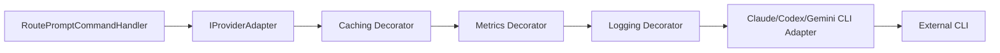

# 04 — Patrones de Diseño Aplicados (Bloque 1 PRO)
## Multi-AI Router (CLI-First)

---

# 1. Introducción

Este documento cubre los **patrones CORE del sistema**, aquellos que definen el comportamiento fundamental del Multi-AI Router:

- Adapter
- Strategy
- Chain of Responsibility
- Result Pattern

Estos patrones son el corazón del sistema porque resuelven los problemas más críticos:

- Integración con múltiples CLIs
- Selección dinámica de proveedores
- Resiliencia ante fallos
- Manejo explícito de errores

---

# 2. Filosofía de uso

En este sistema:

- Los patrones NO se usan por teoría
- Se usan para resolver problemas reales
- Se minimiza la sobreingeniería
- Se prioriza claridad sobre abstracción

---

# 3. Mapa del bloque

| Patrón | Rol |
|-------|-----|
| Adapter | Integración con CLIs |
| Strategy | Selección de proveedor |
| Chain | Fallback |
| Result | Manejo de errores |

---

# 4. Adapter Pattern

## Problema
Cada CLI (Claude, Codex, Gemini) tiene:

- Comandos distintos
- Formatos distintos
- Respuestas distintas

## Sin patrón
Código acoplado:
```csharp
if(provider == "claude") { ... }
```

## Concepto
Adapter traduce interfaces incompatibles a una común.

## Aplicación
Cada CLI tiene su adapter:

```csharp
public interface IAiProvider {
    Task<Result<string>> ExecuteAsync(string prompt);
}
```

```csharp
public class ClaudeAdapter : IAiProvider {
    public async Task<Result<string>> ExecuteAsync(string prompt) {
        // ejecutar CLI
    }
}
```

## Testing
Mockear IAiProvider.

## Errores comunes
- Meter lógica de negocio en el adapter
- No aislar parsing

## Entrevista
“Adapter desacopla el dominio de proveedores externos.”

---

# 5. Strategy Pattern

## Problema
Elegir proveedor dinámicamente.

## Sin patrón
if/else gigante.

## Concepto
Encapsular algoritmos intercambiables.

## Aplicación

```csharp
public interface IRoutingStrategy {
    IAiProvider Select(string prompt);
}
```

```csharp
public class DefaultStrategy : IRoutingStrategy {
    public IAiProvider Select(string prompt) {
        if(prompt.Contains("code")) return new ClaudeAdapter();
        return new GeminiAdapter();
    }
}
```

## Testing
Casos de selección.

## Errores
- Hardcodear lógica
- No desacoplar

## Entrevista
“Strategy elimina branching complejo.”

---

# 6. Chain of Responsibility

## Problema
Fallback entre proveedores.

## Concepto
Encadenar handlers.

## Aplicación

```csharp
Claude → falla → Gemini → falla → Codex
```

## Ejemplo

```csharp
foreach(var provider in providers) {
    var result = await provider.ExecuteAsync(prompt);
    if(result.IsSuccess) return result;
}
```

## Testing
Simular fallos.

## Errores
- No cortar cadena correctamente

## Entrevista
“Chain permite resiliencia sin acoplamiento.”

---

# 7. Result Pattern

## Problema
Excepciones rompen flujo.

## Concepto
Representar éxito/fallo como objeto.

## Ejemplo

```csharp
public class Result<T> {
    public bool IsSuccess { get; }
    public T Value { get; }
    public string Error { get; }
}
```

## Aplicación

```csharp
var result = await provider.ExecuteAsync(prompt);

if(!result.IsSuccess) {
    // fallback
}
```

## Testing
Casos success/failure.

## Errores
- Mezclar exceptions + Result

## Entrevista
“Result hace el flujo explícito y predecible.”

---

# 8. Relación entre patrones

- Strategy selecciona
- Adapter ejecuta
- Chain maneja fallback
- Result controla flujo

---

# 9. Testing del bloque

- Mock adapters
- Simular fallos
- Validar selección

---

# 10. Resumen

Este bloque define el core del sistema:

- Selección dinámica
- Ejecución desacoplada
- Manejo robusto de errores

---

# 04 — Patrones de Diseño Aplicados — Bloque 2 PRO
## Multi-AI Router (CLI-First)

> **Documento descargable Markdown**  
> **Bloque 2:** Application + Infrastructure Patterns  
> **Patrones cubiertos:** Decorator, CQRS ligero, Repository, Unit of Work  
> **Nivel:** Staff Engineer / Software Architect  
> **Proyecto:** Multi-AI Router (CLI-First)

---

# Tabla de contenido

1. [Propósito del bloque](#1-propósito-del-bloque)
2. [Contexto arquitectónico del bloque](#2-contexto-arquitectónico-del-bloque)
3. [Mapa de patrones del bloque 2](#3-mapa-de-patrones-del-bloque-2)
4. [Patrón 4.7 — Decorator Pattern](#4-patrón-47--decorator-pattern)
5. [Patrón 4.8 — CQRS ligero](#5-patrón-48--cqrs-ligero)
6. [Patrón 4.9 — Repository Pattern](#6-patrón-49--repository-pattern)
7. [Patrón 4.10 — Unit of Work](#7-patrón-410--unit-of-work)
8. [Relación entre patrones del bloque](#8-relación-entre-patrones-del-bloque)
9. [Anti-patterns específicos de Application + Infrastructure](#9-anti-patterns-específicos-de-application--infrastructure)
10. [Evolución recomendada por fases](#10-evolución-recomendada-por-fases)
11. [Estrategia de testing del bloque](#11-estrategia-de-testing-del-bloque)
12. [Cómo hablar de este bloque en entrevistas](#12-cómo-hablar-de-este-bloque-en-entrevistas)
13. [Resumen final](#13-resumen-final)
14. [Referencias](#14-referencias)

---

# 1. Propósito del bloque

Este bloque cubre los patrones que conectan el **core de decisión y ejecución** del router con la capa de aplicación, persistencia, observabilidad y transacciones.

El Bloque 1 se enfocó en los patrones que permiten que el sistema seleccione y ejecute proveedores:

- `Adapter`: hablar con CLIs diferentes detrás de una interfaz común.
- `Strategy`: elegir proveedor dinámicamente.
- `Chain of Responsibility`: aplicar fallback.
- `Result Pattern`: modelar éxito/fallo sin depender de excepciones como control normal de flujo.

El Bloque 2 responde otra pregunta:

> ¿Cómo organizo los casos de uso, la persistencia, las métricas, el cache, el logging y las transacciones sin convertir el sistema en una bola de lodo?

Para eso se cubren:

- `Decorator Pattern`
- `CQRS ligero`
- `Repository Pattern`
- `Unit of Work`

Estos patrones NO son accesorios. Son los que evitan que el proyecto termine así:

```text
Endpoint HTTP
  → if/else de routing
  → Process.Start("claude")
  → Console output parsing
  → SQLite insert
  → try/catch gigante
  → logs mezclados
  → métricas manuales
  → return string
```

Eso puede funcionar una tarde, pero no enseña arquitectura, no escala conceptualmente y no sirve como narrativa fuerte para entrevistas Senior/Staff.

El objetivo correcto es:

```text
Endpoint delgado
  → Command/Query
  → Handler de aplicación
  → Dominio protege invariantes
  → Ports hacia infraestructura
  → Adapters ejecutan detalles técnicos
  → Decorators agregan logging/cache/métricas
  → Repository persiste aggregate
  → Unit of Work coordina commit cuando aplica
```

---

# 2. Contexto arquitectónico del bloque

## 2.1 Sistema objetivo

El sistema **Multi-AI Router (CLI-First)** recibe prompts, analiza intención, decide proveedor, ejecuta una CLI —Claude, Codex/ChatGPT o Gemini— retorna una respuesta, guarda historial y deja trazabilidad suficiente para mejorar el routing en el futuro.

El enfoque de arquitectura ya definido para el proyecto es:

- Monolito modular.
- Clean Architecture ligera.
- Vertical Slice Architecture en Application.
- DDD pragmático en Domain.
- Integración CLI-first en Infrastructure.
- Evolución progresiva: MVP primero, complejidad después.

## 2.2 Frontera entre Domain, Application e Infrastructure

La separación esperada es:

```text
AiRouter.Web / Api
  - Endpoints
  - Requests HTTP
  - Responses HTTP
  - Autenticación futura

AiRouter.Application
  - Commands
  - Queries
  - Handlers
  - DTOs de caso de uso
  - Interfaces/ports hacia infraestructura
  - Behaviors transversales

AiRouter.Domain
  - PromptExecutionAggregate
  - PromptRequest
  - RoutingDecision
  - ProviderExecution
  - PromptResponse
  - ExecutionMetrics
  - ErrorInfo
  - Value Objects
  - Invariantes

AiRouter.Infrastructure
  - EF Core / SQLite
  - Repositories concretos
  - CLI adapters
  - Process runner
  - Cache
  - Logging técnico
  - File system
```

## 2.3 Decisión Staff importante

En un sistema pequeño, es tentador decir:

> “No necesito CQRS, Repository ni Unit of Work; EF Core ya lo hace todo.”

Eso tiene algo de verdad, pero incompleto.

La decisión Staff no es “usar o no usar el patrón porque un libro lo dice”. La decisión Staff es:

> ¿Dónde me conviene introducir una frontera explícita porque el sistema tiene reglas, evolución, testing o acoplamiento que lo justifican?

En este proyecto:

- `CQRS ligero` sí se justifica para separar el caso de uso de routear prompt de las consultas de historial/métricas.
- `Repository` sí se justifica para persistir el `PromptExecutionAggregate` sin contaminar Domain con EF Core.
- `Unit of Work` puede NO ser necesario al inicio, porque `DbContext` ya actúa como Unit of Work; pero conviene entender cuándo envolverlo.
- `Decorator` sí se justifica fuerte, porque logging, métricas, cache y resiliencia no deben ensuciar el adapter ni el handler.

---

# 3. Mapa de patrones del bloque 2

| Patrón | Dónde se usa | Problema que resuelve |
|---|---|---|
| Decorator | `IProviderExecutor`, `IProviderAdapter`, `IRoutePromptUseCase`, handlers o services | Agregar logging, caching, métricas, tracing, validación o resiliencia sin modificar el core. |
| CQRS ligero | `RoutePromptCommand`, `GetPromptHistoryQuery`, `GetExecutionDetailsQuery`, `GetProviderMetricsQuery` | Separar operaciones que cambian estado de operaciones que solo leen. Evita handlers gigantes y modelos mezclados. |
| Repository | `IPromptExecutionRepository`, `EfPromptExecutionRepository` | Persistir aggregates sin acoplar dominio/aplicación a EF Core, SQLite u otra DB. |
| Unit of Work | `IUnitOfWork`, `AppDbContext.SaveChangesAsync()` o wrapper explícito | Coordinar una transacción cuando un caso de uso modifica varias entidades/repositorios o publica eventos. |

---

# 4. Patrón 4.7 — Decorator Pattern

## 4.1 Problema que resuelve

En el Multi-AI Router, cada ejecución contra un proveedor CLI necesita comportamientos transversales:

- Logging estructurado.
- Medición de duración.
- Métricas por proveedor.
- Cache de respuestas.
- Tracing con `Activity` / OpenTelemetry.
- Sanitización de errores.
- Timeouts.
- Resiliencia.

El problema es que estos comportamientos NO son el objetivo principal del adapter.

Un `ClaudeCliAdapter` debería saber:

- Cómo construir el comando seguro.
- Cómo invocar `claude`.
- Cómo parsear stdout/stderr.
- Cómo devolver un resultado normalizado.

No debería convertirse en:

```text
ClaudeCliAdapter
  - construye comando
  - ejecuta proceso
  - mide tiempo
  - registra logs
  - calcula métricas
  - guarda cache
  - abre traces
  - maneja circuit breaker
  - conoce reglas de fallback
  - persiste historial
```

Ese diseño termina en clase monstruo.

Decorator resuelve esto envolviendo un componente con otro componente que implementa la misma interfaz.

## 4.2 Qué pasaría sin el patrón

Sin Decorator, el código se contamina rápidamente:

```csharp
public sealed class ClaudeCliAdapter : IProviderAdapter
{
    private readonly ILogger<ClaudeCliAdapter> _logger;
    private readonly IMemoryCache _cache;
    private readonly IMeter _meter;
    private readonly ITracer _tracer;

    public async Task<Result<ProviderExecutionOutput>> ExecuteAsync(
        ProviderExecutionInput input,
        CancellationToken cancellationToken)
    {
        var cacheKey = "provider:" + input.Provider.Value + ":" + input.Prompt.Hash;

        if (_cache.TryGetValue(cacheKey, out ProviderExecutionOutput cached))
        {
            _logger.LogInformation("Cache hit");
            return Result.Success(cached);
        }

        var started = Stopwatch.GetTimestamp();
        using var activity = MyTracing.Start("ClaudeCliAdapter.Execute");

        try
        {
            _logger.LogInformation("Executing Claude CLI");

            // construir comando
            // ejecutar proceso
            // parsear stdout
            // parsear stderr
            // mapear error
            // medir duración
            // guardar cache
            // publicar métrica
            // retornar
        }
        catch (Exception ex)
        {
            _logger.LogError(ex, "Claude CLI failed");
            // mapear error
        }
    }
}
```

Problemas:

- El adapter hace demasiadas cosas.
- Agregar caching obliga a tocar adapters existentes.
- Agregar métricas obliga a tocar adapters existentes.
- El testing se vuelve pesado.
- Los cross-cutting concerns se duplican para Claude, Codex y Gemini.
- Se rompe Open/Closed Principle: para extender comportamiento modificas clases existentes.

## 4.3 Explicación conceptual

Decorator permite agregar comportamiento a un objeto sin modificar su clase.

La estructura conceptual es:

```text
IProviderAdapter
   ↑
ClaudeCliAdapter                  ← implementación base
   ↑ envuelto por
MetricsProviderAdapterDecorator   ← agrega métricas
   ↑ envuelto por
LoggingProviderAdapterDecorator   ← agrega logging
   ↑ envuelto por
CachingProviderAdapterDecorator   ← agrega cache
```

Todos implementan la misma interfaz:

```csharp
public interface IProviderAdapter
{
    ProviderName ProviderName { get; }

    Task<Result<ProviderExecutionOutput>> ExecuteAsync(
        ProviderExecutionInput input,
        CancellationToken cancellationToken);
}
```

Cada decorator recibe un `IProviderAdapter inner` y decide qué hacer antes/después de delegar.

## 4.4 Aplicación en Multi-AI Router

En este proyecto hay dos lugares fuertes para Decorator:

1. Decorar providers/adapters.
2. Decorar handlers o use cases.

Para el MVP, conviene decorar providers/adapters porque ahí están los costos operativos:

- Latencia.
- Fallos.
- Cache.
- Métricas.
- Trazabilidad.

### Flujo recomendado



### Orden de decorators

El orden importa.

Una cadena posible:

```text
CachingProviderAdapterDecorator
  → MetricsProviderAdapterDecorator
    → LoggingProviderAdapterDecorator
      → ClaudeCliAdapter
```

Interpretación:

- Cache primero: si hay cache hit, evita ejecutar todo lo demás.
- Metrics puede medir cache hit/cache miss si lo diseñas así.
- Logging registra ejecución real o intento.
- Adapter hace trabajo técnico.

Otra cadena posible:

```text
Logging
  → Metrics
    → Cache
      → Adapter
```

Interpretación:

- Logging captura absolutamente todo, incluidos cache hits.
- Metrics mide la operación completa.
- Cache evita adapter.

No hay una única respuesta. Lo correcto depende de qué quieres medir.

Para aprendizaje, recomiendo:

```text
Logging externo → Metrics → Cache → Adapter real
```

Porque permite ver todo el flujo mientras estudias.

## 4.5 Ejemplo en C#/.NET

### Contratos base

```csharp
namespace AiRouter.Application.Providers;

public interface IProviderAdapter
{
    ProviderName ProviderName { get; }

    Task<Result<ProviderExecutionOutput>> ExecuteAsync(
        ProviderExecutionInput input,
        CancellationToken cancellationToken);
}

public sealed record ProviderExecutionInput(
    PromptExecutionId ExecutionId,
    ProviderName ProviderName,
    PromptContent Prompt,
    CorrelationId CorrelationId,
    TimeSpan Timeout);

public sealed record ProviderExecutionOutput(
    ProviderName ProviderName,
    ResponseContent Content,
    ExecutionMetrics Metrics,
    string? RawOutputReference);
```

### Adapter real

```csharp
namespace AiRouter.Infrastructure.Providers.Claude;

public sealed class ClaudeCliAdapter : IProviderAdapter
{
    private readonly ICliProcessRunner _processRunner;
    private readonly ClaudeCliOptions _options;
    private readonly IClaudeOutputParser _parser;

    public ClaudeCliAdapter(
        ICliProcessRunner processRunner,
        IOptions<ClaudeCliOptions> options,
        IClaudeOutputParser parser)
    {
        _processRunner = processRunner;
        _options = options.Value;
        _parser = parser;
    }

    public ProviderName ProviderName => ProviderName.Claude;

    public async Task<Result<ProviderExecutionOutput>> ExecuteAsync(
        ProviderExecutionInput input,
        CancellationToken cancellationToken)
    {
        var command = new CliCommand(
            ExecutablePath: _options.ExecutablePath,
            Arguments: ClaudeArguments.FromPrompt(input.Prompt),
            WorkingDirectory: _options.WorkingDirectory,
            Timeout: input.Timeout);

        var processResult = await _processRunner.RunAsync(command, cancellationToken);

        if (processResult.IsFailure)
        {
            return Result.Failure<ProviderExecutionOutput>(processResult.Error);
        }

        var parseResult = _parser.Parse(processResult.Value.StandardOutput, processResult.Value.StandardError);

        if (parseResult.IsFailure)
        {
            return Result.Failure<ProviderExecutionOutput>(parseResult.Error);
        }

        var output = new ProviderExecutionOutput(
            ProviderName: ProviderName,
            Content: ResponseContent.From(parseResult.Value.Content),
            Metrics: ExecutionMetrics.From(
                executionTime: processResult.Value.Duration,
                exitCode: processResult.Value.ExitCode),
            RawOutputReference: processResult.Value.RawOutputReference);

        return Result.Success(output);
    }
}
```

Observación importante:

> El adapter real no sabe nada de cache, métricas de negocio, logging estructurado de alto nivel ni fallback. Eso queda fuera.

### Logging decorator

```csharp
namespace AiRouter.Infrastructure.Providers.Decorators;

public sealed class LoggingProviderAdapterDecorator : IProviderAdapter
{
    private readonly IProviderAdapter _inner;
    private readonly ILogger<LoggingProviderAdapterDecorator> _logger;

    public LoggingProviderAdapterDecorator(
        IProviderAdapter inner,
        ILogger<LoggingProviderAdapterDecorator> logger)
    {
        _inner = inner;
        _logger = logger;
    }

    public ProviderName ProviderName => _inner.ProviderName;

    public async Task<Result<ProviderExecutionOutput>> ExecuteAsync(
        ProviderExecutionInput input,
        CancellationToken cancellationToken)
    {
        using var scope = _logger.BeginScope(new Dictionary<string, object>
        {
            ["ExecutionId"] = input.ExecutionId.Value,
            ["Provider"] = input.ProviderName.Value,
            ["CorrelationId"] = input.CorrelationId.Value
        });

        _logger.LogInformation(
            "Starting provider execution for {Provider}",
            input.ProviderName.Value);

        var result = await _inner.ExecuteAsync(input, cancellationToken);

        if (result.IsSuccess)
        {
            _logger.LogInformation(
                "Provider execution succeeded for {Provider}",
                input.ProviderName.Value);
        }
        else
        {
            _logger.LogWarning(
                "Provider execution failed for {Provider}. ErrorCode: {ErrorCode}. Category: {ErrorCategory}",
                input.ProviderName.Value,
                result.Error.Code,
                result.Error.Category);
        }

        return result;
    }
}
```

### Metrics decorator

```csharp
namespace AiRouter.Infrastructure.Providers.Decorators;

public sealed class MetricsProviderAdapterDecorator : IProviderAdapter
{
    private readonly IProviderAdapter _inner;
    private readonly ProviderMetrics _metrics;

    public MetricsProviderAdapterDecorator(
        IProviderAdapter inner,
        ProviderMetrics metrics)
    {
        _inner = inner;
        _metrics = metrics;
    }

    public ProviderName ProviderName => _inner.ProviderName;

    public async Task<Result<ProviderExecutionOutput>> ExecuteAsync(
        ProviderExecutionInput input,
        CancellationToken cancellationToken)
    {
        var started = Stopwatch.GetTimestamp();

        var result = await _inner.ExecuteAsync(input, cancellationToken);

        var elapsed = Stopwatch.GetElapsedTime(started);

        _metrics.RecordExecution(
            provider: input.ProviderName,
            elapsed: elapsed,
            success: result.IsSuccess,
            errorCategory: result.IsFailure ? result.Error.Category : null);

        return result;
    }
}

public sealed class ProviderMetrics
{
    private readonly Counter<long> _executions;
    private readonly Histogram<double> _durationMs;

    public ProviderMetrics(IMeterFactory meterFactory)
    {
        var meter = meterFactory.Create("AiRouter.Providers");
        _executions = meter.CreateCounter<long>("provider.executions.count");
        _durationMs = meter.CreateHistogram<double>("provider.execution.duration.ms");
    }

    public void RecordExecution(
        ProviderName provider,
        TimeSpan elapsed,
        bool success,
        ErrorCategory? errorCategory)
    {
        var tags = new TagList
        {
            { "provider", provider.Value },
            { "success", success }
        };

        if (errorCategory is not null)
        {
            tags.Add("error.category", errorCategory.Value.ToString());
        }

        _executions.Add(1, tags);
        _durationMs.Record(elapsed.TotalMilliseconds, tags);
    }
}
```

### Cache decorator

```csharp
namespace AiRouter.Infrastructure.Providers.Decorators;

public sealed class CachingProviderAdapterDecorator : IProviderAdapter
{
    private readonly IProviderAdapter _inner;
    private readonly IResponseCache _cache;
    private readonly ICacheKeyFactory _cacheKeyFactory;

    public CachingProviderAdapterDecorator(
        IProviderAdapter inner,
        IResponseCache cache,
        ICacheKeyFactory cacheKeyFactory)
    {
        _inner = inner;
        _cache = cache;
        _cacheKeyFactory = cacheKeyFactory;
    }

    public ProviderName ProviderName => _inner.ProviderName;

    public async Task<Result<ProviderExecutionOutput>> ExecuteAsync(
        ProviderExecutionInput input,
        CancellationToken cancellationToken)
    {
        if (!ShouldUseCache(input))
        {
            return await _inner.ExecuteAsync(input, cancellationToken);
        }

        var key = _cacheKeyFactory.Create(input.ProviderName, input.Prompt);
        var cached = await _cache.GetAsync(key, cancellationToken);

        if (cached is not null)
        {
            return Result.Success(cached with
            {
                Metrics = cached.Metrics with
                {
                    WasCacheHit = true
                }
            });
        }

        var result = await _inner.ExecuteAsync(input, cancellationToken);

        if (result.IsSuccess)
        {
            await _cache.SetAsync(key, result.Value, TimeSpan.FromHours(1), cancellationToken);
        }

        return result;
    }

    private static bool ShouldUseCache(ProviderExecutionInput input)
    {
        // MVP: cachear solo prompts sin contenido sensible y sin timestamp explícito.
        // Futuro: mover esto a una política más rica.
        return input.Prompt.Value.Length < 10_000;
    }
}
```

### Registro con DI

El contenedor built-in de .NET soporta DI, pero no trae decoración avanzada tan cómoda como otros contenedores. Para escenarios reales, Scrutor suele usarse para `Decorate`.

Ejemplo conceptual:

```csharp
services.AddScoped<ClaudeCliAdapter>();

services.AddScoped<IProviderAdapter>(sp =>
{
    IProviderAdapter adapter = sp.GetRequiredService<ClaudeCliAdapter>();

    adapter = new CachingProviderAdapterDecorator(
        adapter,
        sp.GetRequiredService<IResponseCache>(),
        sp.GetRequiredService<ICacheKeyFactory>());

    adapter = new MetricsProviderAdapterDecorator(
        adapter,
        sp.GetRequiredService<ProviderMetrics>());

    adapter = new LoggingProviderAdapterDecorator(
        adapter,
        sp.GetRequiredService<ILogger<LoggingProviderAdapterDecorator>>());

    return adapter;
});
```

Con Scrutor, el registro puede ser más limpio:

```csharp
services.AddScoped<IProviderAdapter, ClaudeCliAdapter>();
services.Decorate<IProviderAdapter, CachingProviderAdapterDecorator>();
services.Decorate<IProviderAdapter, MetricsProviderAdapterDecorator>();
services.Decorate<IProviderAdapter, LoggingProviderAdapterDecorator>();
```

Cuidado: si tienes múltiples providers registrados como `IEnumerable<IProviderAdapter>`, decorar todos requiere validar cómo registras cada implementación para no envolver mal la colección.

## 4.6 Cómo testearlo

### Test 1: el decorator delega al inner

```csharp
[Fact]
public async Task ExecuteAsync_WhenCalled_DelegatesToInnerAdapter()
{
    var input = ProviderExecutionInputFactory.Valid(ProviderName.Claude);
    var expected = ProviderExecutionOutputFactory.Success(ProviderName.Claude);

    var inner = Substitute.For<IProviderAdapter>();
    inner.ProviderName.Returns(ProviderName.Claude);
    inner.ExecuteAsync(input, Arg.Any<CancellationToken>())
         .Returns(Result.Success(expected));

    var decorator = new MetricsProviderAdapterDecorator(
        inner,
        ProviderMetricsFactory.NoOp());

    var result = await decorator.ExecuteAsync(input, CancellationToken.None);

    result.IsSuccess.Should().BeTrue();
    await inner.Received(1).ExecuteAsync(input, Arg.Any<CancellationToken>());
}
```

### Test 2: cache evita ejecución real

```csharp
[Fact]
public async Task ExecuteAsync_WhenCacheHit_DoesNotCallInnerAdapter()
{
    var input = ProviderExecutionInputFactory.Valid(ProviderName.Gemini);
    var cached = ProviderExecutionOutputFactory.Success(ProviderName.Gemini);

    var inner = Substitute.For<IProviderAdapter>();
    var cache = Substitute.For<IResponseCache>();
    var keyFactory = Substitute.For<ICacheKeyFactory>();

    keyFactory.Create(input.ProviderName, input.Prompt).Returns("cache-key");
    cache.GetAsync("cache-key", Arg.Any<CancellationToken>()).Returns(cached);

    var decorator = new CachingProviderAdapterDecorator(inner, cache, keyFactory);

    var result = await decorator.ExecuteAsync(input, CancellationToken.None);

    result.IsSuccess.Should().BeTrue();
    await inner.DidNotReceive().ExecuteAsync(Arg.Any<ProviderExecutionInput>(), Arg.Any<CancellationToken>());
}
```

### Test 3: logging no cambia semántica

Un decorator de logging debe ser transparente: si el inner retorna failure, el decorator retorna el mismo failure.

```csharp
[Fact]
public async Task ExecuteAsync_WhenInnerFails_ReturnsSameFailure()
{
    var input = ProviderExecutionInputFactory.Valid(ProviderName.Codex);
    var error = ExecutionErrors.ProviderUnavailable(ProviderName.Codex);

    var inner = Substitute.For<IProviderAdapter>();
    inner.ProviderName.Returns(ProviderName.Codex);
    inner.ExecuteAsync(input, Arg.Any<CancellationToken>())
         .Returns(Result.Failure<ProviderExecutionOutput>(error));

    var decorator = new LoggingProviderAdapterDecorator(
        inner,
        Substitute.For<ILogger<LoggingProviderAdapterDecorator>>());

    var result = await decorator.ExecuteAsync(input, CancellationToken.None);

    result.IsFailure.Should().BeTrue();
    result.Error.Should().Be(error);
}
```

## 4.7 Errores comunes

### Error 1: meter lógica de negocio en decorators

Mal:

```csharp
if (input.Prompt.Value.Contains("arquitectura"))
{
    return await _claudeAdapter.ExecuteAsync(input, ct);
}
```

Eso es routing, no decoración.

### Error 2: que el decorator altere el contrato sin decirlo

Un decorator no debería cambiar semántica central inesperadamente.

Ejemplo peligroso:

```csharp
if (result.IsFailure)
{
    return Result.Success(FakeFallbackResponse());
}
```

Eso no es logging ni cache; eso es fallback y debe estar modelado en Chain/Execution Service.

### Error 3: ocultar errores reales por logging bonito

No conviertas todo a:

```text
Provider failed.
```

Conserva `ErrorCode`, `ErrorCategory`, `CorrelationId` y contexto seguro.

### Error 4: cachear prompts sensibles

Cachear respuestas de IA puede ser útil, pero hay que tener política.

No caches:

- Credenciales.
- Datos personales.
- Prompts con fecha/hora o contexto muy cambiante.
- Prompts que explícitamente piden “usa el estado actual”.

### Error 5: decorar demasiado pronto

En MVP inicial puedes empezar con logging simple y métricas mínimas. No necesitas 8 decorators antes de ejecutar el primer prompt real.

## 4.8 Cómo explicarlo en entrevista

Respuesta corta:

> Usé Decorator para agregar logging, métricas y caching alrededor de los adapters CLI sin modificar cada provider concreto. Esto mantiene los adapters enfocados en traducir la CLI y evita duplicar cross-cutting concerns en Claude, Codex y Gemini.

Respuesta Senior:

> El riesgo del enfoque CLI-first es que cada provider adapter se vuelva una clase enorme: proceso, parsing, logging, métricas, cache, retries y fallback. Separé la responsabilidad primaria del adapter —ejecutar una CLI concreta— de los comportamientos transversales. Cada decorator implementa el mismo contrato `IProviderAdapter` y envuelve al siguiente. Así puedo componer la cadena en DI y testear cada comportamiento de forma aislada.

Respuesta Staff:

> La decisión importante fue mantener el core cerrado a modificación y abierto a extensión. En vez de modificar tres adapters cada vez que agrego una métrica o política de cache, agrego un decorator reusable. También separé semánticas: cache/logging/métricas son decorators; fallback pertenece al execution pipeline; routing pertenece a Strategy/Specification; persistencia pertenece a Repository. Esa separación evita que el sistema se vuelva una mezcla accidental de patrones.

---

# 5. Patrón 4.8 — CQRS ligero

## 5.1 Problema que resuelve

CQRS significa **Command Query Responsibility Segregation**.

La idea base:

- Un **Command** expresa intención de cambiar estado.
- Una **Query** expresa intención de leer estado.

En el Multi-AI Router, esto aplica perfecto porque las operaciones tienen naturalezas distintas.

### Operaciones tipo Command

- Routear un prompt.
- Ejecutar proveedor CLI.
- Guardar historial.
- Reintentar una ejecución.
- Calificar una respuesta.
- Actualizar preferencia de proveedor.

### Operaciones tipo Query

- Consultar historial.
- Ver detalle de una ejecución.
- Obtener métricas por proveedor.
- Ver últimos errores.
- Listar providers disponibles.

El command principal `RoutePromptCommand` es pesado: crea aggregate, decide routing, ejecuta provider, maneja errores, persiste resultado.

Una query como `GetPromptHistoryQuery` debería ser ligera: leer datos optimizados, paginar y regresar DTOs.

## 5.2 Qué pasaría sin el patrón

Sin CQRS, es común crear un servicio gigante:

```csharp
public sealed class PromptService
{
    public Task<RoutePromptResponse> RoutePromptAsync(...)
    public Task<IReadOnlyList<PromptHistoryItem>> GetHistoryAsync(...)
    public Task<PromptDetailsDto> GetDetailsAsync(...)
    public Task<ProviderMetricsDto> GetMetricsAsync(...)
    public Task RetryAsync(...)
    public Task RateResponseAsync(...)
    public Task DeleteHistoryAsync(...)
}
```

Problemas:

- Mezcla lecturas y escrituras.
- Crece sin control.
- Es difícil testear.
- Termina sabiendo demasiado.
- Las queries arrastran dependencias del dominio que no necesitan.
- Las escrituras empiezan a devolver DTOs de UI.

Otro anti-pattern:

```csharp
app.MapPost("/prompts", async request =>
{
    // validar
    // decidir
    // ejecutar CLI
    // guardar
    // consultar historial actualizado
    // mapear a DTO
    // responder
});
```

El endpoint deja de ser boundary y se vuelve caso de uso.

## 5.3 Explicación conceptual

CQRS ligero no significa necesariamente:

- Event Sourcing.
- Bases de datos separadas.
- Kafka.
- Microservicios.
- Proyecciones complejas.

En este proyecto significa:

```text
Commands y Queries separados como modelos mentales y clases separadas.
```

Ejemplo:

```text
RoutePromptCommand
  → RoutePromptCommandHandler
  → Usa dominio + adapters + repository

GetPromptHistoryQuery
  → GetPromptHistoryQueryHandler
  → Usa lectura optimizada
```

Esto encaja con Vertical Slice Architecture:

```text
Application/
  Features/
    RoutePrompt/
      RoutePromptCommand.cs
      RoutePromptCommandHandler.cs
      RoutePromptResult.cs
      RoutePromptValidator.cs
    GetPromptHistory/
      GetPromptHistoryQuery.cs
      GetPromptHistoryQueryHandler.cs
      PromptHistoryItemDto.cs
    GetExecutionDetails/
      GetExecutionDetailsQuery.cs
      GetExecutionDetailsQueryHandler.cs
```

## 5.4 Aplicación en Multi-AI Router

### Command principal: RoutePrompt

Este command cambia estado porque:

- Crea una ejecución.
- Toma una decisión.
- Ejecuta una CLI.
- Guarda resultado/fallo.
- Puede generar eventos.
- Puede actualizar métricas.

```text
RoutePromptCommand
  → Crea PromptContent
  → Crea PromptExecutionAggregate
  → Solicita RoutingDecision
  → Inicia ejecución
  → Invoca adapter/provider pipeline
  → Completa aggregate con success/failure
  → Guarda aggregate
  → Retorna RoutePromptResult
```

### Queries principales

```text
GetPromptHistoryQuery
  → lee lista paginada
  → no reconstruye aggregate completo si no hace falta

GetPromptExecutionDetailsQuery
  → lee detalle de una ejecución
  → útil para auditoría

GetProviderMetricsQuery
  → agrupa latencia, fallos, éxito por provider
```

## 5.5 Ejemplo en C#/.NET

### Command

```csharp
namespace AiRouter.Application.Features.RoutePrompt;

public sealed record RoutePromptCommand(
    string Prompt,
    string? PreferredProvider,
    string? CorrelationId) : IRequest<RoutePromptResult>;

public sealed record RoutePromptResult(
    Guid ExecutionId,
    string Provider,
    string Status,
    string? Response,
    string? ErrorCode,
    string? ErrorMessage,
    long DurationMs);
```

### Handler del command

```csharp
namespace AiRouter.Application.Features.RoutePrompt;

public sealed class RoutePromptCommandHandler
    : IRequestHandler<RoutePromptCommand, RoutePromptResult>
{
    private readonly IRoutingStrategy _routingStrategy;
    private readonly IProviderExecutionService _executionService;
    private readonly IPromptExecutionRepository _repository;
    private readonly IUnitOfWork _unitOfWork;
    private readonly IClock _clock;

    public RoutePromptCommandHandler(
        IRoutingStrategy routingStrategy,
        IProviderExecutionService executionService,
        IPromptExecutionRepository repository,
        IUnitOfWork unitOfWork,
        IClock clock)
    {
        _routingStrategy = routingStrategy;
        _executionService = executionService;
        _repository = repository;
        _unitOfWork = unitOfWork;
        _clock = clock;
    }

    public async Task<RoutePromptResult> Handle(
        RoutePromptCommand command,
        CancellationToken cancellationToken)
    {
        var promptContent = PromptContent.From(command.Prompt);

        var request = PromptRequest.Create(
            content: promptContent,
            options: PromptOptions.Default(),
            requestedProvider: command.PreferredProvider is null
                ? null
                : ProviderName.From(command.PreferredProvider),
            correlationId: command.CorrelationId is null
                ? CorrelationId.New()
                : CorrelationId.From(command.CorrelationId),
            createdAt: _clock.UtcNow);

        var aggregate = PromptExecutionAggregate.Create(
            request,
            occurredAt: _clock.UtcNow);

        var decision = _routingStrategy.Decide(request);
        aggregate.ApplyDecision(decision, _clock.UtcNow);

        aggregate.StartExecution(
            command: CommandDefinition.ForProvider(decision.SelectedProvider),
            startedAt: _clock.UtcNow);

        var executionResult = await _executionService.ExecuteAsync(
            provider: decision.SelectedProvider,
            prompt: promptContent,
            executionId: aggregate.Id,
            correlationId: request.CorrelationId,
            cancellationToken: cancellationToken);

        if (executionResult.IsSuccess)
        {
            aggregate.CompleteSuccessfully(
                response: PromptResponse.Create(
                    providerName: executionResult.Value.ProviderName,
                    content: executionResult.Value.Content,
                    createdAt: _clock.UtcNow),
                metrics: executionResult.Value.Metrics,
                completedAt: _clock.UtcNow);
        }
        else
        {
            aggregate.FailExecution(
                error: executionResult.Error,
                metrics: executionResult.ErrorMetrics,
                completedAt: _clock.UtcNow);
        }

        await _repository.AddAsync(aggregate, cancellationToken);
        await _unitOfWork.SaveChangesAsync(cancellationToken);

        return RoutePromptResultMapper.FromAggregate(aggregate);
    }
}
```

Observa varias decisiones:

- El handler coordina, pero no contiene detalles de CLI.
- El dominio protege transiciones.
- El adapter no guarda base de datos.
- El repository no decide routing.
- El result final se mapea desde el aggregate.

### Query

```csharp
namespace AiRouter.Application.Features.GetPromptHistory;

public sealed record GetPromptHistoryQuery(
    int Page,
    int PageSize,
    string? Provider,
    string? Status) : IRequest<PagedResult<PromptHistoryItemDto>>;

public sealed record PromptHistoryItemDto(
    Guid ExecutionId,
    string Provider,
    string Status,
    string PromptPreview,
    long DurationMs,
    DateTimeOffset CreatedAt,
    string? ErrorCategory);
```

### Handler de query

```csharp
namespace AiRouter.Application.Features.GetPromptHistory;

public sealed class GetPromptHistoryQueryHandler
    : IRequestHandler<GetPromptHistoryQuery, PagedResult<PromptHistoryItemDto>>
{
    private readonly IPromptExecutionReadStore _readStore;

    public GetPromptHistoryQueryHandler(IPromptExecutionReadStore readStore)
    {
        _readStore = readStore;
    }

    public Task<PagedResult<PromptHistoryItemDto>> Handle(
        GetPromptHistoryQuery query,
        CancellationToken cancellationToken)
    {
        return _readStore.GetHistoryAsync(
            page: query.Page,
            pageSize: query.PageSize,
            provider: query.Provider,
            status: query.Status,
            cancellationToken: cancellationToken);
    }
}
```

### Read store concreto con EF Core

```csharp
namespace AiRouter.Infrastructure.Persistence.ReadStores;

public sealed class PromptExecutionReadStore : IPromptExecutionReadStore
{
    private readonly AiRouterDbContext _dbContext;

    public PromptExecutionReadStore(AiRouterDbContext dbContext)
    {
        _dbContext = dbContext;
    }

    public async Task<PagedResult<PromptHistoryItemDto>> GetHistoryAsync(
        int page,
        int pageSize,
        string? provider,
        string? status,
        CancellationToken cancellationToken)
    {
        var query = _dbContext.PromptExecutions
            .AsNoTracking()
            .AsQueryable();

        if (!string.IsNullOrWhiteSpace(provider))
        {
            query = query.Where(x => x.SelectedProvider == provider);
        }

        if (!string.IsNullOrWhiteSpace(status))
        {
            query = query.Where(x => x.ExecutionStatus == status);
        }

        var total = await query.CountAsync(cancellationToken);

        var items = await query
            .OrderByDescending(x => x.CreatedAt)
            .Skip((page - 1) * pageSize)
            .Take(pageSize)
            .Select(x => new PromptHistoryItemDto(
                x.Id,
                x.SelectedProvider,
                x.ExecutionStatus,
                x.PromptContent.Length <= 120
                    ? x.PromptContent
                    : x.PromptContent.Substring(0, 120),
                x.DurationMs,
                x.CreatedAt,
                x.ErrorCategory))
            .ToListAsync(cancellationToken);

        return new PagedResult<PromptHistoryItemDto>(items, total, page, pageSize);
    }
}
```

### Endpoint delgado

```csharp
app.MapPost("/api/prompts/route", async (
    RoutePromptHttpRequest request,
    ISender sender,
    CancellationToken cancellationToken) =>
{
    var command = new RoutePromptCommand(
        Prompt: request.Prompt,
        PreferredProvider: request.PreferredProvider,
        CorrelationId: request.CorrelationId);

    var result = await sender.Send(command, cancellationToken);

    return Results.Ok(result);
});

app.MapGet("/api/prompts/history", async (
    int page,
    int pageSize,
    string? provider,
    string? status,
    ISender sender,
    CancellationToken cancellationToken) =>
{
    var query = new GetPromptHistoryQuery(page, pageSize, provider, status);
    var result = await sender.Send(query, cancellationToken);

    return Results.Ok(result);
});
```

## 5.6 Cómo testearlo

### Test del command handler

```csharp
[Fact]
public async Task Handle_WhenProviderSucceeds_PersistsSuccessfulAggregate()
{
    var command = new RoutePromptCommand(
        Prompt: "Explícame Strategy Pattern con C#",
        PreferredProvider: null,
        CorrelationId: "test-correlation");

    var routingStrategy = Substitute.For<IRoutingStrategy>();
    routingStrategy.Decide(Arg.Any<PromptRequest>())
        .Returns(RoutingDecision.Create(
            ProviderName.Claude,
            RoutingStrategyName.From("HeuristicV1"),
            DecisionReason.From("Prompt classified as code/architecture."),
            DateTimeOffset.UtcNow));

    var executionService = Substitute.For<IProviderExecutionService>();
    executionService.ExecuteAsync(
            Arg.Any<ProviderName>(),
            Arg.Any<PromptContent>(),
            Arg.Any<PromptExecutionId>(),
            Arg.Any<CorrelationId>(),
            Arg.Any<CancellationToken>())
        .Returns(Result.Success(ProviderExecutionOutputFactory.Success(ProviderName.Claude)));

    var repository = Substitute.For<IPromptExecutionRepository>();
    var unitOfWork = Substitute.For<IUnitOfWork>();

    var handler = new RoutePromptCommandHandler(
        routingStrategy,
        executionService,
        repository,
        unitOfWork,
        new FixedClock(DateTimeOffset.UtcNow));

    var result = await handler.Handle(command, CancellationToken.None);

    result.Status.Should().Be("Succeeded");
    result.Provider.Should().Be("Claude");

    await repository.Received(1).AddAsync(
        Arg.Is<PromptExecutionAggregate>(x => x.Response is not null),
        Arg.Any<CancellationToken>());

    await unitOfWork.Received(1).SaveChangesAsync(Arg.Any<CancellationToken>());
}
```

### Test del query handler

```csharp
[Fact]
public async Task Handle_WhenHistoryExists_ReturnsPagedItems()
{
    var readStore = Substitute.For<IPromptExecutionReadStore>();

    readStore.GetHistoryAsync(1, 10, null, null, Arg.Any<CancellationToken>())
        .Returns(new PagedResult<PromptHistoryItemDto>(
            new[]
            {
                new PromptHistoryItemDto(
                    Guid.NewGuid(),
                    "Claude",
                    "Succeeded",
                    "Explícame DDD...",
                    1200,
                    DateTimeOffset.UtcNow,
                    null)
            },
            total: 1,
            page: 1,
            pageSize: 10));

    var handler = new GetPromptHistoryQueryHandler(readStore);

    var result = await handler.Handle(
        new GetPromptHistoryQuery(1, 10, null, null),
        CancellationToken.None);

    result.Items.Should().HaveCount(1);
}
```

## 5.7 Errores comunes

### Error 1: convertir CQRS en ceremonia excesiva

No necesitas una clase para cada microacción si el sistema está en MVP.

Malo:

```text
CreatePromptCommand
AnalyzePromptCommand
SelectProviderCommand
ExecuteProviderCommand
SavePromptCommand
ReturnPromptCommand
```

Mejor:

```text
RoutePromptCommand
```

Dentro del handler coordinas el flujo completo.

### Error 2: meter lógica de dominio en handlers

Malo:

```csharp
aggregate.Execution.Status = "Succeeded";
aggregate.Response = response;
```

Mejor:

```csharp
aggregate.CompleteSuccessfully(response, metrics, now);
```

### Error 3: usar el mismo modelo para escritura y lectura

No siempre debes reconstruir el aggregate completo para listar historial.

Una query de historial puede usar proyección directa.

### Error 4: pensar que CQRS obliga a dos bases de datos

No. En este proyecto CQRS es lógico y ligero.

Puedes usar la misma SQLite al inicio.

### Error 5: meter MediatR por moda

MediatR ayuda si tienes muchos casos de uso y pipeline behaviors. Si tu MVP tiene dos endpoints, puedes iniciar sin MediatR y mantener la separación conceptual.

La decisión recomendada para este proyecto:

- Usar MediatR cuando ya haya 5+ casos de uso o quieras behaviors transversales.
- Mantener Commands/Queries aunque inicialmente llames handlers directo.

## 5.8 Cómo explicarlo en entrevista

Respuesta corta:

> Usé CQRS ligero para separar operaciones que cambian estado, como routear un prompt, de operaciones de lectura, como consultar historial o métricas.

Respuesta Senior:

> `RoutePromptCommand` coordina un flujo con dominio, routing, ejecución CLI y persistencia. En cambio, `GetPromptHistoryQuery` solo necesita una lectura optimizada. Separarlos evita que el modelo de escritura arrastre necesidades de UI y que las queries tengan que reconstruir aggregates innecesariamente.

Respuesta Staff:

> No implementé CQRS enterprise con event sourcing ni bases separadas porque sería sobreingeniería para un MVP local. Apliqué CQRS como frontera de responsabilidad en Application: commands expresan intención y protegen invariantes vía dominio; queries son idempotentes y pueden proyectar datos. Eso deja una ruta clara para evolucionar a read models, proyecciones o analytics si el sistema crece.

---

# 6. Patrón 4.9 — Repository Pattern

## 6.1 Problema que resuelve

El dominio del proyecto define un aggregate principal:

```text
PromptExecutionAggregate
```

Este aggregate protege reglas como:

- No ejecutar sin decisión.
- No marcar éxito sin respuesta.
- No marcar fallo sin error.
- No completar dos veces una ejecución.
- No guardar estado terminal inconsistente.

La persistencia NO debe romper esas reglas.

Repository resuelve el problema de guardar y recuperar aggregates sin que Application o Domain dependan directamente de EF Core, SQLite, PostgreSQL o cualquier mecanismo concreto.

## 6.2 Qué pasaría sin el patrón

Sin repository, el handler puede terminar así:

```csharp
public async Task<RoutePromptResult> Handle(RoutePromptCommand command, CancellationToken ct)
{
    var entity = new PromptExecutionEntity
    {
        Id = Guid.NewGuid(),
        PromptContent = command.Prompt,
        SelectedProvider = "Claude",
        ExecutionStatus = "Running"
    };

    _dbContext.PromptExecutions.Add(entity);
    await _dbContext.SaveChangesAsync(ct);

    var output = await _claude.ExecuteAsync(command.Prompt, ct);

    entity.ExecutionStatus = "Succeeded";
    entity.ResponseContent = output;
    entity.CompletedAt = DateTimeOffset.UtcNow;

    await _dbContext.SaveChangesAsync(ct);

    return new RoutePromptResult(...);
}
```

Problemas:

- Application queda acoplada a EF Core.
- Se trabaja con entidades de persistencia en lugar de dominio.
- Se pueden guardar estados inválidos.
- Cambiar SQLite por PostgreSQL impacta Application.
- Testear el handler requiere EF aunque solo quieras probar flujo.
- El aggregate deja de ser el centro del modelo.

## 6.3 Explicación conceptual

Repository actúa como colección orientada al dominio.

En lugar de pensar:

```text
INSERT INTO PromptExecutions
UPDATE PromptExecutions
SELECT * FROM PromptExecutions
```

Piensas:

```text
repository.Add(aggregate)
repository.GetById(id)
```

No es una abstracción para esconder SQL genérico. Es una abstracción para persistir aggregates.

Repository correcto:

```csharp
public interface IPromptExecutionRepository
{
    Task AddAsync(PromptExecutionAggregate aggregate, CancellationToken cancellationToken);
    Task<PromptExecutionAggregate?> GetByIdAsync(PromptExecutionId id, CancellationToken cancellationToken);
}
```

Repository incorrecto:

```csharp
public interface IRepository<T>
{
    Task<T?> GetByIdAsync(Guid id);
    Task<IEnumerable<T>> GetAllAsync();
    Task AddAsync(T entity);
    Task UpdateAsync(T entity);
    Task DeleteAsync(T entity);
}
```

¿Por qué es peor el genérico?

Porque no expresa intención del dominio y suele convertirse en CRUD genérico sin valor.

## 6.4 Aplicación en Multi-AI Router

### Repository principal

```text
IPromptExecutionRepository
```

Responsabilidad:

- Guardar `PromptExecutionAggregate`.
- Recuperar aggregate para operaciones que requieren invariantes.
- No usarse para queries de dashboard simples.

### Read Store separado

```text
IPromptExecutionReadStore
```

Responsabilidad:

- Consultas optimizadas.
- DTOs paginados.
- Historial.
- Métricas.

Esta separación evita que el repository se vuelva:

```text
IPromptExecutionRepository
  - Add
  - GetById
  - GetHistory
  - GetMetrics
  - GetFailures
  - GetTopProviders
  - SearchByPrompt
  - ExportCsv
```

Eso sería otro God Service, pero con nombre Repository.

## 6.5 Ejemplo en C#/.NET

### Interface en Application

```csharp
namespace AiRouter.Application.Abstractions.Persistence;

public interface IPromptExecutionRepository
{
    Task AddAsync(
        PromptExecutionAggregate aggregate,
        CancellationToken cancellationToken);

    Task<PromptExecutionAggregate?> GetByIdAsync(
        PromptExecutionId id,
        CancellationToken cancellationToken);
}
```

### DbContext en Infrastructure

```csharp
namespace AiRouter.Infrastructure.Persistence;

public sealed class AiRouterDbContext : DbContext
{
    public AiRouterDbContext(DbContextOptions<AiRouterDbContext> options)
        : base(options)
    {
    }

    public DbSet<PromptExecutionAggregate> PromptExecutions =>
        Set<PromptExecutionAggregate>();

    protected override void OnModelCreating(ModelBuilder modelBuilder)
    {
        modelBuilder.ApplyConfiguration(new PromptExecutionAggregateConfiguration());
    }
}
```

### Configuración EF sin contaminar Domain

```csharp
namespace AiRouter.Infrastructure.Persistence.Configurations;

public sealed class PromptExecutionAggregateConfiguration
    : IEntityTypeConfiguration<PromptExecutionAggregate>
{
    public void Configure(EntityTypeBuilder<PromptExecutionAggregate> builder)
    {
        builder.ToTable("PromptExecutions");

        builder.HasKey(x => x.Id);

        builder.Property(x => x.Id)
            .HasConversion(
                id => id.Value,
                value => PromptExecutionId.From(value));

        builder.OwnsOne(x => x.Request, request =>
        {
            request.Property(r => r.CreatedAt)
                .HasColumnName("CreatedAt")
                .IsRequired();

            request.OwnsOne(r => r.Content, content =>
            {
                content.Property(c => c.Value)
                    .HasColumnName("PromptContent")
                    .IsRequired();
            });

            request.OwnsOne(r => r.CorrelationId, correlation =>
            {
                correlation.Property(c => c.Value)
                    .HasColumnName("CorrelationId")
                    .IsRequired();
            });
        });

        builder.OwnsOne(x => x.Decision, decision =>
        {
            decision.Property(d => d.SelectedProvider)
                .HasColumnName("SelectedProvider")
                .HasConversion(
                    provider => provider.Value,
                    value => ProviderName.From(value));

            decision.Property(d => d.WasFallback)
                .HasColumnName("WasFallback");

            decision.OwnsOne(d => d.Reason, reason =>
            {
                reason.Property(r => r.Value)
                    .HasColumnName("RoutingReason")
                    .HasMaxLength(1000);
            });
        });

        builder.OwnsOne(x => x.Execution, execution =>
        {
            execution.Property(e => e.Status)
                .HasColumnName("ExecutionStatus")
                .HasConversion<string>();

            execution.Property(e => e.StartedAt)
                .HasColumnName("StartedAt");

            execution.Property(e => e.CompletedAt)
                .HasColumnName("CompletedAt");
        });

        builder.OwnsOne(x => x.Response, response =>
        {
            response.OwnsOne(r => r.Content, content =>
            {
                content.Property(c => c.Value)
                    .HasColumnName("ResponseContent");
            });
        });

        builder.OwnsOne(x => x.Error, error =>
        {
            error.Property(e => e.Code)
                .HasColumnName("ErrorCode")
                .HasConversion(
                    code => code.Value,
                    value => ErrorCode.From(value));

            error.Property(e => e.Category)
                .HasColumnName("ErrorCategory")
                .HasConversion<string>();
        });
    }
}
```

Nota: este mapping es ilustrativo. Dependiendo de cómo se modelen constructors privados, backing fields y owned types, EF puede requerir ajustes. La idea importante es: configuración en Infrastructure, no atributos EF en Domain.

### Repository concreto

```csharp
namespace AiRouter.Infrastructure.Persistence.Repositories;

public sealed class EfPromptExecutionRepository : IPromptExecutionRepository
{
    private readonly AiRouterDbContext _dbContext;

    public EfPromptExecutionRepository(AiRouterDbContext dbContext)
    {
        _dbContext = dbContext;
    }

    public async Task AddAsync(
        PromptExecutionAggregate aggregate,
        CancellationToken cancellationToken)
    {
        await _dbContext.PromptExecutions.AddAsync(aggregate, cancellationToken);
    }

    public Task<PromptExecutionAggregate?> GetByIdAsync(
        PromptExecutionId id,
        CancellationToken cancellationToken)
    {
        return _dbContext.PromptExecutions
            .FirstOrDefaultAsync(x => x.Id == id, cancellationToken);
    }
}
```

Importante:

```csharp
AddAsync(...)
```

no llama `SaveChangesAsync`. Eso lo coordina Unit of Work o el handler al final.

### Registro DI

```csharp
services.AddDbContext<AiRouterDbContext>(options =>
{
    options.UseSqlite(configuration.GetConnectionString("AiRouter"));
});

services.AddScoped<IPromptExecutionRepository, EfPromptExecutionRepository>();
services.AddScoped<IPromptExecutionReadStore, PromptExecutionReadStore>();
```

## 6.6 Cómo testearlo

### Unit test del handler con repository mock

```csharp
[Fact]
public async Task Handle_WhenExecutionCompletes_AddsAggregateToRepository()
{
    var repository = Substitute.For<IPromptExecutionRepository>();
    var unitOfWork = Substitute.For<IUnitOfWork>();

    var handler = RoutePromptHandlerFactory.Create(
        repository: repository,
        unitOfWork: unitOfWork,
        executionResult: Result.Success(ProviderExecutionOutputFactory.Success(ProviderName.Claude)));

    await handler.Handle(
        new RoutePromptCommand("Hola", null, null),
        CancellationToken.None);

    await repository.Received(1).AddAsync(
        Arg.Is<PromptExecutionAggregate>(x =>
            x.Response is not null && x.Error is null),
        Arg.Any<CancellationToken>());
}
```

### Integration test del repository con SQLite in-memory

```csharp
[Fact]
public async Task AddAsync_ThenGetByIdAsync_ReturnsAggregate()
{
    await using var dbContext = TestDbContextFactory.CreateSqliteInMemory();
    var repository = new EfPromptExecutionRepository(dbContext);

    var aggregate = PromptExecutionAggregateFactory.Successful(
        provider: ProviderName.Claude,
        prompt: "Explica Repository Pattern");

    await repository.AddAsync(aggregate, CancellationToken.None);
    await dbContext.SaveChangesAsync(CancellationToken.None);

    var loaded = await repository.GetByIdAsync(aggregate.Id, CancellationToken.None);

    loaded.Should().NotBeNull();
    loaded!.Id.Should().Be(aggregate.Id);
    loaded.Response.Should().NotBeNull();
}
```

### Architecture test

```csharp
[Fact]
public void Domain_Should_Not_Depend_On_EntityFramework()
{
    var result = Types.InAssembly(typeof(PromptExecutionAggregate).Assembly)
        .ShouldNot()
        .HaveDependencyOn("Microsoft.EntityFrameworkCore")
        .GetResult();

    result.IsSuccessful.Should().BeTrue();
}
```

## 6.7 Errores comunes

### Error 1: repository genérico para todo

Un generic repository muchas veces agrega poco valor encima de EF Core y esconde capacidades útiles.

Evita:

```csharp
IGenericRepository<T>
```

Prefiere:

```csharp
IPromptExecutionRepository
```

### Error 2: repository con lógica de negocio

Malo:

```csharp
public async Task AddAsync(PromptExecutionAggregate aggregate)
{
    if (aggregate.Request.Content.Value.Contains("code"))
    {
        aggregate.Decision = Claude;
    }
}
```

El repository persiste, no decide.

### Error 3: usar repository para queries complejas de dashboard

Para dashboard, usa read store/proyecciones.

### Error 4: llamar SaveChanges en cada método

Si `AddAsync` hace `SaveChanges`, pierdes control transaccional.

### Error 5: contaminar Domain con EF Core

No uses atributos EF en entidades de dominio si estás buscando Clean Architecture real.

## 6.8 Cómo explicarlo en entrevista

Respuesta corta:

> Usé Repository para persistir el `PromptExecutionAggregate` sin acoplar Application o Domain a EF Core.

Respuesta Senior:

> El repository no es un CRUD genérico. Está orientado al aggregate. `IPromptExecutionRepository` permite guardar y recuperar ejecuciones cuando necesito preservar invariantes del dominio. Para lecturas de historial uso un read store separado con proyecciones, porque no necesito reconstruir el aggregate completo para listar datos.

Respuesta Staff:

> La decisión clave fue no usar Repository como abstracción accidental encima de EF para todo. EF Core ya implementa muchas ideas de Repository/Unit of Work. Introduje un repository específico solo donde aporta valor: persistir el aggregate principal y mantener la capa Application independiente de infraestructura. Para queries, elegí una ruta pragmática y directa, alineada con CQRS ligero.

---

# 7. Patrón 4.10 — Unit of Work

## 7.1 Problema que resuelve

Unit of Work coordina un conjunto de cambios para confirmarlos como una unidad atómica.

En términos simples:

> O se guardan todos los cambios relevantes de un caso de uso, o no se guarda ninguno.

En el Multi-AI Router, al inicio puede haber solo una escritura:

```text
Guardar PromptExecutionAggregate
```

Pero pronto pueden aparecer más:

```text
Guardar PromptExecutionAggregate
Actualizar métricas agregadas
Guardar evento de dominio
Guardar cache metadata
Registrar cuota de usuario
Publicar evento outbox
```

Cuando eso ocurre, necesitas una frontera transaccional clara.

## 7.2 Qué pasaría sin el patrón

Sin Unit of Work, podrías terminar con commits dispersos:

```csharp
await _promptRepository.AddAsync(aggregate, ct);
await _dbContext.SaveChangesAsync(ct);

await _metricsRepository.UpdateAsync(metrics, ct);
await _dbContext.SaveChangesAsync(ct);

await _eventRepository.AddAsync(domainEvent, ct);
await _dbContext.SaveChangesAsync(ct);
```

Riesgo:

- Se guarda aggregate, pero falla metrics.
- Se guarda metrics, pero falla evento.
- El historial dice `Succeeded`, pero no hay evento.
- El dashboard queda inconsistente.

Unit of Work centraliza el commit.

## 7.3 Explicación conceptual

En EF Core, `DbContext` ya actúa como Unit of Work:

```text
ChangeTracker acumula cambios
SaveChangesAsync confirma cambios
```

Por eso, en muchos sistemas, crear `IUnitOfWork` explícito encima de EF puede ser redundante.

Entonces, ¿cuándo tiene sentido?

Tiene sentido si quieres:

- Evitar que Application dependa de `DbContext`.
- Coordinar varios repositories.
- Tener una abstracción clara de commit.
- Integrar domain events antes/después del commit.
- Prepararte para Outbox Pattern futuro.
- Hacer testing del caso de uso sin EF directo.

No tiene sentido si:

- Solo tienes CRUD simple.
- Tu Application ya decidió usar `DbContext` directamente.
- La abstracción solo llama `SaveChangesAsync` sin aportar claridad.

## 7.4 Aplicación en Multi-AI Router

### MVP recomendado

Para el MVP, se puede usar:

```csharp
public interface IUnitOfWork
{
    Task<int> SaveChangesAsync(CancellationToken cancellationToken);
}
```

Implementación:

```csharp
public sealed class EfUnitOfWork : IUnitOfWork
{
    private readonly AiRouterDbContext _dbContext;

    public EfUnitOfWork(AiRouterDbContext dbContext)
    {
        _dbContext = dbContext;
    }

    public Task<int> SaveChangesAsync(CancellationToken cancellationToken)
    {
        return _dbContext.SaveChangesAsync(cancellationToken);
    }
}
```

Esto parece simple, pero aporta una frontera:

```text
Application conoce IUnitOfWork
Infrastructure conoce DbContext
```

### Fase futura: Unit of Work con domain events

```text
1. Guardar aggregate.
2. Extraer domain events.
3. Persistir cambios.
4. Publicar eventos internos o guardarlos en outbox.
```

Cuidado: publicar eventos externos antes del commit puede crear inconsistencias.

Una versión futura puede hacer:

```csharp
public sealed class EfUnitOfWork : IUnitOfWork
{
    private readonly AiRouterDbContext _dbContext;
    private readonly IDomainEventDispatcher _dispatcher;

    public async Task<int> SaveChangesAsync(CancellationToken cancellationToken)
    {
        var domainEvents = _dbContext.ChangeTracker
            .Entries<IAggregateRoot>()
            .SelectMany(x => x.Entity.DomainEvents)
            .ToList();

        var result = await _dbContext.SaveChangesAsync(cancellationToken);

        foreach (var domainEvent in domainEvents)
        {
            await _dispatcher.DispatchAsync(domainEvent, cancellationToken);
        }

        return result;
    }
}
```

Para sistemas más robustos, en lugar de publicar directo después del commit, se usa Outbox. Pero eso pertenece a una fase posterior, no al MVP.

## 7.5 Ejemplo en C#/.NET

### Interface

```csharp
namespace AiRouter.Application.Abstractions.Persistence;

public interface IUnitOfWork
{
    Task<int> SaveChangesAsync(CancellationToken cancellationToken);
}
```

### Implementación EF

```csharp
namespace AiRouter.Infrastructure.Persistence;

public sealed class EfUnitOfWork : IUnitOfWork
{
    private readonly AiRouterDbContext _dbContext;

    public EfUnitOfWork(AiRouterDbContext dbContext)
    {
        _dbContext = dbContext;
    }

    public Task<int> SaveChangesAsync(CancellationToken cancellationToken)
    {
        return _dbContext.SaveChangesAsync(cancellationToken);
    }
}
```

### Uso en handler

```csharp
await _repository.AddAsync(aggregate, cancellationToken);
await _unitOfWork.SaveChangesAsync(cancellationToken);
```

### Caso con múltiples repositorios

```csharp
public sealed class RateProviderResponseCommandHandler
    : IRequestHandler<RateProviderResponseCommand, RateProviderResponseResult>
{
    private readonly IPromptExecutionRepository _promptExecutions;
    private readonly IProviderScoreRepository _providerScores;
    private readonly IUnitOfWork _unitOfWork;

    public async Task<RateProviderResponseResult> Handle(
        RateProviderResponseCommand command,
        CancellationToken cancellationToken)
    {
        var execution = await _promptExecutions.GetByIdAsync(
            PromptExecutionId.From(command.ExecutionId),
            cancellationToken);

        if (execution is null)
        {
            return RateProviderResponseResult.NotFound(command.ExecutionId);
        }

        execution.RateResponse(ResponseRating.From(command.Score));

        var providerScore = await _providerScores.GetByProviderAsync(
            execution.FinalProvider,
            cancellationToken);

        providerScore.ApplyRating(ResponseRating.From(command.Score));

        await _unitOfWork.SaveChangesAsync(cancellationToken);

        return RateProviderResponseResult.Success();
    }
}
```

Aquí Unit of Work sí aporta más valor porque hay dos aggregates/repositorios participando.

## 7.6 Cómo testearlo

### Test unitario: handler llama commit una vez

```csharp
[Fact]
public async Task Handle_WhenAggregateIsAdded_CommitsOnce()
{
    var unitOfWork = Substitute.For<IUnitOfWork>();
    var handler = RoutePromptHandlerFactory.Create(unitOfWork: unitOfWork);

    await handler.Handle(
        new RoutePromptCommand("Hola", null, null),
        CancellationToken.None);

    await unitOfWork.Received(1).SaveChangesAsync(Arg.Any<CancellationToken>());
}
```

### Integration test: rollback implícito si falla antes de SaveChanges

```csharp
[Fact]
public async Task Handle_WhenExecutionThrowsBeforeCommit_DoesNotPersistAggregate()
{
    await using var dbContext = TestDbContextFactory.CreateSqliteInMemory();

    var handler = RoutePromptHandlerFactory.CreateWithRealDb(
        dbContext,
        executionService: ExecutionServiceFactory.Throwing());

    await Assert.ThrowsAsync<ProviderExecutionException>(() =>
        handler.Handle(new RoutePromptCommand("Hola", null, null), CancellationToken.None));

    var count = await dbContext.PromptExecutions.CountAsync();
    count.Should().Be(0);
}
```

### Integration test: commit persiste todos los cambios

```csharp
[Fact]
public async Task SaveChangesAsync_WhenMultipleChanges_CommitAll()
{
    await using var dbContext = TestDbContextFactory.CreateSqliteInMemory();
    var unitOfWork = new EfUnitOfWork(dbContext);

    dbContext.PromptExecutions.Add(PromptExecutionAggregateFactory.SuccessfulEntity());
    dbContext.ProviderScores.Add(ProviderScoreFactory.ForClaude());

    await unitOfWork.SaveChangesAsync(CancellationToken.None);

    (await dbContext.PromptExecutions.CountAsync()).Should().Be(1);
    (await dbContext.ProviderScores.CountAsync()).Should().Be(1);
}
```

## 7.7 Errores comunes

### Error 1: Unit of Work que no agrega nada

Si solo tienes esto:

```csharp
public Task SaveAsync() => _dbContext.SaveChangesAsync();
```

y Application ya usa `DbContext`, quizá no necesitas la abstracción.

Pero si Application NO debe conocer EF, sí puede valer.

### Error 2: llamar SaveChanges dentro de repositories

Malo:

```csharp
public async Task AddAsync(Aggregate aggregate)
{
    _dbContext.Add(aggregate);
    await _dbContext.SaveChangesAsync();
}
```

Eso rompe la unidad de trabajo.

### Error 3: transacciones demasiado grandes

No metas ejecución CLI dentro de una transacción de base de datos.

Malo:

```text
Begin DB transaction
  Execute Claude CLI for 45 seconds
  Save aggregate
Commit transaction
```

Mientras la CLI corre, bloqueas recursos innecesariamente.

Mejor para MVP:

```text
Ejecutar CLI fuera de transacción larga
Construir aggregate final
Guardar en una transacción corta
```

Futuro robusto:

```text
Guardar estado Created/Started
Commit
Ejecutar CLI
Guardar Completed/Failed
Commit
```

### Error 4: publicar eventos externos dentro de la transacción sin estrategia

Si publicas a un broker y luego falla la DB, tienes inconsistencia.

Para eso existe Outbox, pero no hace falta al inicio.

### Error 5: confundir Unit of Work con Service Locator

No hagas:

```csharp
_unitOfWork.GetRepository<PromptExecution>().Add(...)
```

Eso suele esconder dependencias y empeorar claridad.

## 7.8 Cómo explicarlo en entrevista

Respuesta corta:

> Usé Unit of Work como frontera de commit para que el handler coordine cambios y confirme una sola vez al final.

Respuesta Senior:

> En EF Core, `DbContext` ya implementa Unit of Work conceptualmente, así que no creé una abstracción pesada. Definí `IUnitOfWork` como puerto de Application para no depender directamente de EF y para coordinar repositories. Los repositories no llaman `SaveChanges`; el commit ocurre al final del caso de uso.

Respuesta Staff:

> Fui cuidadoso para no sobreingenierizar. En el MVP, Unit of Work es delgado porque solo se guarda el aggregate principal. Pero deja una frontera clara para evolucionar a múltiples repositorios, domain events u outbox. También evité envolver la ejecución CLI en una transacción larga, porque sería un error operativo: la DB no debe esperar mientras un proceso externo tarda o falla.

---

# 8. Relación entre patrones del bloque

## 8.1 CQRS + Repository

Commands suelen usar repository porque modifican estado del dominio.

```text
RoutePromptCommandHandler
  → IPromptExecutionRepository.AddAsync(aggregate)
  → IUnitOfWork.SaveChangesAsync()
```

Queries suelen usar read stores/proyecciones.

```text
GetPromptHistoryQueryHandler
  → IPromptExecutionReadStore.GetHistoryAsync(...)
```

## 8.2 Repository + Unit of Work

Repository registra cambios.

Unit of Work confirma cambios.

```text
repository.Add(aggregate)
repository.Update(otherAggregate)
unitOfWork.SaveChanges()
```

Si el repository guarda inmediatamente, Unit of Work pierde sentido.

## 8.3 Decorator + CQRS

Puedes decorar handlers con pipeline behaviors:

- Logging behavior.
- Validation behavior.
- Performance behavior.
- Transaction behavior.

Con MediatR:

```csharp
public sealed class LoggingBehavior<TRequest, TResponse>
    : IPipelineBehavior<TRequest, TResponse>
{
    public async Task<TResponse> Handle(
        TRequest request,
        RequestHandlerDelegate<TResponse> next,
        CancellationToken cancellationToken)
    {
        // before
        var response = await next();
        // after
        return response;
    }
}
```

Esto es conceptualmente Decorator aplicado al pipeline de Application.

## 8.4 Decorator + Provider Adapter

Decorators de providers agregan comportamiento operativo.

```text
RoutePromptCommandHandler
  → IProviderExecutionService
    → IProviderAdapter decorado
      → Logging
      → Metrics
      → Cache
      → ClaudeCliAdapter
```

## 8.5 Unit of Work + Domain Events

El aggregate acumula eventos.

Unit of Work puede coordinar su publicación o persistencia.

```text
aggregate.Raise(ProviderExecutionSucceeded)
repository.Add(aggregate)
unitOfWork.SaveChanges()
dispatch events
```

Para MVP, basta con preparar el modelo. No hace falta event sourcing.

---

# 9. Anti-patterns específicos de Application + Infrastructure

## 9.1 Handler Dios

Síntoma:

```text
RoutePromptCommandHandler con 800 líneas
```

Hace:

- Routing.
- CLI command building.
- Process execution.
- Parsing.
- Logging.
- Metrics.
- Persistence.
- Cache.
- Mapping.
- Retry.
- Fallback.

Solución:

- Handler coordina.
- Strategy decide.
- Adapter ejecuta.
- Decorator agrega cross-cutting.
- Repository persiste.
- Domain protege invariantes.

## 9.2 Repository genérico sin valor

`IGenericRepository<T>` puede sonar elegante, pero muchas veces solo empobrece EF Core.

Usa repositories específicos por aggregate cuando hay dominio real.

## 9.3 CQRS teatral

Tener 100 commands minúsculos para un MVP puede hacer el proyecto insoportable.

CQRS debe aumentar claridad, no ceremonia.

## 9.4 Decorator que cambia reglas de negocio

Logging no debe decidir proveedor. Cache no debe aplicar fallback. Metrics no debe corregir errores.

Cada decorator debe tener una responsabilidad nítida.

## 9.5 Transacciones largas con procesos externos

Nunca mantengas una transacción de DB abierta mientras ejecutas Claude/Codex/Gemini CLI.

La CLI es lenta, externa, puede colgarse y puede requerir red.

## 9.6 Application dependiendo de Infrastructure

Malo:

```csharp
using AiRouter.Infrastructure.Persistence;
```

en Application.

Application debe depender de abstracciones.

## 9.7 Queries reconstruyendo aggregates innecesariamente

Para listar historial no necesitas cargar todo el aggregate con response completa y value objects complejos.

Usa proyección.

---

# 10. Evolución recomendada por fases

## 10.1 MVP inicial

Usar:

- CQRS conceptual.
- `RoutePromptCommandHandler`.
- `GetPromptHistoryQueryHandler`.
- `IPromptExecutionRepository`.
- `IUnitOfWork` delgado.
- Logging simple.

Evitar:

- Outbox.
- Event sourcing.
- Generic repository.
- Transaction behavior complejo.
- Cache avanzado.

## 10.2 MVP sólido

Agregar:

- Decorator de logging para providers.
- Decorator de métricas.
- Read store separado.
- Architecture tests.
- Integration tests con SQLite.

## 10.3 Fase intermedia

Agregar:

- Cache decorator con política.
- MediatR behaviors.
- Validation behavior.
- Performance behavior.
- Transaction behavior solo para commands que escriben.

## 10.4 Fase avanzada

Agregar si hay necesidad real:

- Domain events dispatch.
- Outbox pattern.
- Proyecciones de métricas.
- Separación read/write storage.
- Event-driven workflows.

---

# 11. Estrategia de testing del bloque

## 11.1 Unit tests

Probar:

- Handler coordina correctamente.
- Repository recibe aggregate correcto.
- UnitOfWork se llama una vez.
- Decorators delegan y no rompen resultados.
- Cache decorator evita llamada real cuando hay hit.

## 11.2 Integration tests

Probar:

- EF mapping de aggregate.
- Persistencia real con SQLite.
- Queries con `AsNoTracking`.
- Paginación.
- Filtros por provider/status.

## 11.3 Architecture tests

Reglas:

```text
Domain no depende de EF Core.
Application no depende de Infrastructure.
Infrastructure sí puede depender de Application y Domain.
Web solo llama Application.
```

Ejemplo:

```csharp
[Fact]
public void Application_Should_Not_Depend_On_Infrastructure()
{
    var result = Types.InAssembly(typeof(RoutePromptCommand).Assembly)
        .ShouldNot()
        .HaveDependencyOn("AiRouter.Infrastructure")
        .GetResult();

    result.IsSuccessful.Should().BeTrue();
}
```

## 11.4 Contract tests para decorators

Un decorator debe respetar el contrato del inner.

Para cada decorator:

- Si inner retorna success, decorator retorna success.
- Si inner retorna failure, decorator retorna failure salvo que su responsabilidad explícita sea recovery.
- Debe llamar inner exactamente cuando corresponde.

## 11.5 Tests de transacción

Probar:

- Si no se llama `SaveChanges`, no se persiste.
- Si falla antes del commit, no hay cambios.
- Si se agregan varias entidades antes del commit, se guardan juntas.

---

# 12. Cómo hablar de este bloque en entrevistas

## 12.1 Pitch corto

> En la capa de aplicación separé commands y queries usando CQRS ligero. Los commands coordinan dominio, adapters y persistencia; las queries usan read stores optimizados. Para persistencia usé Repository orientado al aggregate principal y Unit of Work como frontera de commit. Para cross-cutting concerns como logging, métricas y cache, usé Decorator alrededor de los adapters CLI.

## 12.2 Pregunta: ¿Por qué CQRS si el sistema es pequeño?

Respuesta:

> No implementé CQRS enterprise. Usé CQRS ligero como separación de responsabilidades. Routear un prompt cambia estado y tiene reglas; consultar historial es lectura idempotente. Separarlos evita handlers y servicios gigantes, y permite optimizar lecturas sin comprometer invariantes del dominio.

## 12.3 Pregunta: ¿No es Repository redundante con EF Core?

Respuesta:

> Puede ser redundante si lo usas como CRUD genérico. En este caso no lo usé así. Lo usé como puerto para persistir el aggregate `PromptExecutionAggregate` y mantener Application independiente de EF. Para queries, uso read stores directos, porque no todo debe pasar por Repository.

## 12.4 Pregunta: ¿Por qué Unit of Work si DbContext ya lo es?

Respuesta:

> Precisamente porque DbContext ya lo es, mantuve Unit of Work delgado. Su valor aquí no es reinventar EF, sino exponer una frontera de commit en Application sin depender de Infrastructure. Si el sistema crece a varios repositories, domain events u outbox, esa frontera ya existe.

## 12.5 Pregunta: ¿Dónde pondrías logging, métricas y cache?

Respuesta:

> No los pondría dentro del adapter real ni dentro del handler. Los pondría como decorators alrededor de `IProviderAdapter` o como pipeline behaviors alrededor de commands/queries. Así agrego comportamiento transversal sin modificar la lógica principal.

## 12.6 Pregunta difícil: ¿Qué patrón quitarías para evitar sobreingeniería?

Respuesta:

> En MVP podría no usar MediatR todavía y llamar handlers directamente, manteniendo commands/queries como estructura. También mantendría Unit of Work delgado. No usaría Outbox, Event Sourcing ni repositories genéricos. El criterio es introducir patrones cuando protegen una frontera real, no por estética.

---

# 13. Resumen final

## 13.1 Qué aporta cada patrón

| Patrón | Valor principal |
|---|---|
| Decorator | Agregar logging, cache, métricas y tracing sin ensuciar adapters ni handlers. |
| CQRS ligero | Separar casos de uso de escritura y lectura, reduciendo acoplamiento y complejidad. |
| Repository | Persistir aggregates sin acoplar Application/Domain a EF Core o SQLite. |
| Unit of Work | Coordinar commits y preparar evolución a múltiples repositorios/eventos. |

## 13.2 Decisión más importante del bloque

La decisión más importante no es “usar patrones”. Es ubicar cada responsabilidad en el lugar correcto:

```text
Handler coordina.
Domain protege reglas.
Adapter ejecuta CLI.
Decorator agrega comportamiento transversal.
Repository persiste aggregate.
Unit of Work confirma cambios.
Query lee datos optimizados.
```

## 13.3 Regla Staff

> Si un patrón no reduce acoplamiento, no mejora testabilidad, no protege invariantes o no habilita evolución real, probablemente está sobrando.

En este bloque, los patrones sí aportan porque el sistema tiene fronteras reales:

- CLI externa.
- Dominio con invariantes.
- Historial persistente.
- Métricas y observabilidad.
- Lecturas distintas a escrituras.
- Evolución futura a fallback, scoring, workflows y analytics.

---

# 14. Referencias

Estas referencias se consultaron como base conceptual actualizada y se adaptaron al contexto específico del Multi-AI Router CLI-first.

1. Microsoft Learn — Dependency injection in .NET  
   https://learn.microsoft.com/en-us/dotnet/core/extensions/dependency-injection/overview

2. Microsoft Learn — Dependency injection in ASP.NET Core  
   https://learn.microsoft.com/en-us/aspnet/core/fundamentals/dependency-injection

3. Microsoft Learn — CQRS pattern — Azure Architecture Center  
   https://learn.microsoft.com/en-us/azure/architecture/patterns/cqrs

4. Microsoft Learn — Implementing reads/queries in a CQRS microservice  
   https://learn.microsoft.com/en-us/dotnet/architecture/microservices/microservice-ddd-cqrs-patterns/cqrs-microservice-reads

5. Microsoft Learn — Applying simplified CQRS and DDD patterns  
   https://learn.microsoft.com/en-us/dotnet/architecture/microservices/microservice-ddd-cqrs-patterns/apply-simplified-microservice-cqrs-ddd-patterns

6. Microsoft Learn — Implementing the infrastructure persistence layer with EF Core  
   https://learn.microsoft.com/en-us/dotnet/architecture/microservices/microservice-ddd-cqrs-patterns/infrastructure-persistence-layer-implementation-entity-framework-core

7. Microsoft Learn — EF Core overview  
   https://learn.microsoft.com/en-us/ef/core/

8. Microsoft Learn — Introduction to resilient app development  
   https://learn.microsoft.com/en-us/dotnet/core/resilience/

9. Microsoft Learn — Build resilient HTTP apps  
   https://learn.microsoft.com/en-us/dotnet/core/resilience/http-resilience

10. Polly Docs — Meet Polly  
    https://www.pollydocs.org/

11. Milan Jovanović — Scrutor and ASP.NET Core DI decoration  
    https://www.milanjovanovic.tech/blog/improving-aspnetcore-dependency-injection-with-scrutor

---


# 04 — Patrones de Diseño Aplicados (Bloque 3 PRO)
## Multi-AI Router (CLI-First)

---

# BLOQUE 3 — ADVANCED + ARCHITECTURE PATTERNS

Este bloque cubre los patrones que elevan el sistema a nivel **Staff Engineer**:

- Specification Pattern
- Domain Events
- Template Method
- Ports & Adapters (Hexagonal)

Estos patrones NO son necesarios para un MVP simple, pero son clave para:

- Escalabilidad
- Mantenibilidad a largo plazo
- Separación de responsabilidades real
- Preparación para sistemas distribuidos

---

# 1. Specification Pattern

## Problema
Las reglas de routing pueden crecer rápidamente:

- tipo de prompt
- longitud
- preferencias
- capacidades del proveedor

Sin control, esto termina en lógica compleja difícil de mantener.

## Sin patrón
```csharp
if(prompt.Contains("code") && length > 5000 && provider == "claude") { ... }
```

## Concepto
Encapsular reglas como objetos reutilizables y combinables.

## Aplicación en el Router

```csharp
public interface ISpecification<T> {
    bool IsSatisfiedBy(T entity);
}
```

```csharp
public class IsCodePromptSpec : ISpecification<string> {
    public bool IsSatisfiedBy(string prompt) =>
        prompt.Contains("code");
}
```

## Composición

```csharp
public class AndSpecification<T> : ISpecification<T> {
    private readonly ISpecification<T> _left;
    private readonly ISpecification<T> _right;

    public bool IsSatisfiedBy(T entity) =>
        _left.IsSatisfiedBy(entity) && _right.IsSatisfiedBy(entity);
}
```

## Testing
- Validar cada regla individual
- Validar combinaciones

## Error común
- Sobreingeniería en reglas simples

## Entrevista
“Specification permite reglas extensibles sin modificar el core.”

---

# 2. Domain Events

## Problema
Queremos reaccionar a eventos sin acoplar lógica.

Ejemplo:
- Guardar historial
- Registrar métricas
- Notificar

## Concepto
Un evento representa algo que ya ocurrió.

## Aplicación

Eventos:

- ExecutionStarted
- ExecutionCompleted
- ExecutionFailed

```csharp
public record ExecutionCompleted(string Provider, TimeSpan Duration);
```

## Uso

```csharp
public class ExecutionHandler {
    public void Handle(ExecutionCompleted evt) {
        // logging, métricas
    }
}
```

## Testing
- Verificar que evento se dispare
- Verificar handlers

## Error común
- Usar eventos para lógica core

## Entrevista
“Domain Events desacoplan efectos secundarios.”

---

# 3. Template Method

## Problema
Todos los providers siguen el mismo flujo:

- preparar comando
- ejecutar
- parsear

## Concepto
Definir esqueleto del algoritmo y permitir variaciones.

## Aplicación

```csharp
public abstract class BaseProvider {

    public async Task<string> ExecuteAsync(string prompt) {
        var cmd = BuildCommand(prompt);
        var output = await RunCommand(cmd);
        return Parse(output);
    }

    protected abstract string BuildCommand(string prompt);
    protected abstract string Parse(string output);
}
```

## Implementación

```csharp
public class ClaudeProvider : BaseProvider {
    protected override string BuildCommand(string prompt) =>
        "claude " + prompt;

    protected override string Parse(string output) =>
        output;
}
```

## Testing
- Mock RunCommand
- Validar Parse

## Error común
- Hacerlo demasiado rígido

## Entrevista
“Template asegura consistencia entre implementaciones.”

---

# 4. Ports & Adapters (Hexagonal)

## Problema
El dominio no debe depender de infraestructura.

## Concepto
Separar:

- Core (dominio)
- Puertos (interfaces)
- Adaptadores (implementaciones)

## Aplicación

Dominio:

```csharp
public interface IAiProvider {
    Task<string> Execute(string prompt);
}
```

Infraestructura:

```csharp
public class ClaudeAdapter : IAiProvider { }
```

## Beneficios

- Testabilidad
- Sustitución fácil
- Desacoplamiento total

## Testing
- Mock interfaces

## Error común
- Romper capas

## Entrevista
“Hexagonal architecture permite aislar el dominio.”

---

# 5. Relación entre patrones

- Specification + Strategy → reglas de decisión
- Domain Events + CQRS → side effects desacoplados
- Template + Adapter → ejecución uniforme
- Ports & Adapters → base arquitectónica

---

# 6. Anti-patterns

- Overengineering en Specifications
- Eventos innecesarios
- Template rígido
- Romper separación de capas

---

# 7. Evolución

Inicial:
- Strategy + Adapter

Intermedio:
- Specification
- Template

Avanzado:
- Domain Events
- Hexagonal completo

---

# 8. Testing

- Unit tests de specs
- Test de eventos
- Test de providers
- Test de integración

---

# 9. Entrevistas

Ejemplo:

“Usé Specification para desacoplar reglas de routing, Domain Events para side-effects y Hexagonal para aislar el dominio de la infraestructura.”

---

# 10. Resumen

Este bloque transforma el sistema en:

- Escalable
- Extensible
- Desacoplado
- Listo para evolucionar a sistemas complejos

---
